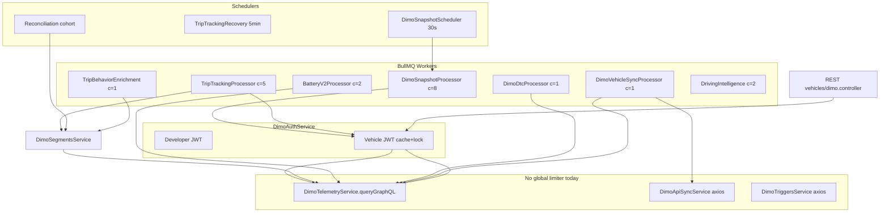

# P1.3 Phase 0 — Global DIMO Provider Concurrency Control

**Date:** 2026-08-29  
**Status:** AUDIT / DESIGN ONLY — NO IMPLEMENTATION  
**Scope:** Authoritative provider audit + architecture for global DIMO request governance  
**P1.2 baseline:** CLOSED for N ≤ 100 CONNECTED, single PM2 fork, `WORKER_SNAPSHOT_CONCURRENCY=8`, `WORKER_TRIP_TRACKING_CONCURRENCY=5`

---

## 1. Executive summary

P1.2 delivered activity-tier snapshot polling, canonical trip reconciliation, partial boundary repair, and production cutover for a **certified envelope of N ≤ 100** on **one backend replica**. It intentionally did **not** implement global DIMO provider concurrency control.

P1.3 Phase 0 establishes authoritative evidence that:

1. **DIMO publishes per-plan rate limits (requests/second per API service per client host)** but **does not publish a concurrency (in-flight) quota** or standard `Retry-After` headers.
2. SynqDrive has **no global DIMO limiter today**. Process-local BullMQ worker concurrency is the only coordination layer.
3. At N ≈ 1000 under busy/extreme scenarios, steady-state demand can exceed **2,000–9,000 DIMO request-starts/minute** while a single replica’s simplified in-flight ceiling is only **~24 concurrent HTTP calls** (snapshot + ACTIVE_TICK fan-out) — and **multi-replica deployment multiplies in-flight work** because BullMQ workers on each replica compete for the same queues.
4. Retry layers (BullMQ × scheduler re-enqueue × selective HTTP retry in recharge client) can **amplify provider load** during outages or 429 spikes.
5. The production **HTTP 403** case (tokenId 190497, `signalsLatest`) is **non-retryable authorization denial** at the telemetry layer; SynqDrive does not degrade connectivity state, causing **unbounded wasted provider budget** for that vehicle.

**Recommendation:** Implement P1.3 as a **Redis-backed hybrid limiter** (global in-flight semaphore + global request-start token bucket) behind a **single canonical `DimoProviderGateway`** that wraps all DIMO HTTP exits (telemetry GraphQL, token exchange, identity, triggers). Trip-correctness work (P0/P1) must receive reserved capacity; backpressure must **delay/requeue jobs**, never drop trip work silently.

**P1.3 implementation ready:** YES for design; NO for coding until slices below are executed.

---

## 2. DIMO MCP authoritative findings

| Item | Result |
|------|--------|
| DIMO MCP namespace status | **ERROR** — live tool discovery failed; MCP tools unavailable this run |
| Fallback sources used | DIMO public docs via WebFetch: FAQ, Telemetry API introduction, Telemetry Playground |

### Classification key

- **AUTHORITATIVE DIMO FACT** — from DIMO-published documentation
- **OBSERVED SYNQDRIVE BEHAVIOR** — from production logs / codebase / P1.2 closure
- **INFERENCE** — reasoned from architecture; not provider-published
- **UNKNOWN** — no authoritative source

### AUTHORITATIVE DIMO FACTS

| Topic | Evidence |
|-------|----------|
| Telemetry endpoint | Single GraphQL endpoint: `POST https://telemetry-api.dimo.zone/query` ([Telemetry API Introduction](https://dimo.org/docs/api-references/telemetry-api/introduction)) |
| Vehicle data auth | Vehicle JWT required via token exchange ([Quickstart](https://www.dimo.org/docs/quickstart)) |
| `signalsLatest` / `signals` | Documented query fields ([Telemetry Playground](https://www.dimo.org/docs/api-references/telemetry-api/telemetry-playground)) |
| Vehicle JWT lifetime | Playground notes: **~10 minutes**; must regenerate when expired |
| Developer JWT lifetime | FAQ: **1 hour** (refresh before expiration) |
| Rate limits by plan | FAQ § Technical → API rate limits: **Hobbyist 10 req/s**, **Core 25 req/s**, **Enterprise custom (up to 1000+ req/s)** — **per API service**, **per client host** |
| Rate limit headers | FAQ: **DIMO does not send remaining-request counts in HTTP headers** |
| HTTP status taxonomy | FAQ documents 200, 201, 204, 400, 401, 403, 404, 405, 409, 424, 500 |
| 403 meaning (generic) | FAQ: *"The server understands the request but refuses to authorize it."* |
| Public keys | `auth.dimo.zone/keys` for JWT verification |

### UNKNOWN (not found in DIMO docs)

| Topic | Status |
|-------|--------|
| Concurrency / max in-flight quota | **UNKNOWN** — no published limit |
| Standard `Retry-After` on 429 | **UNKNOWN** — not documented; FAQ does not mention 429 explicitly |
| `signalsLatest`-specific 403 subcodes | **UNKNOWN** — no field-level permission matrix in fetched docs |
| WebSocket/streaming bulk multi-vehicle query | **UNKNOWN** for production telemetry path — not evidenced as replacement for per-vehicle JWT queries |
| SynqDrive’s effective DIMO plan tier | **UNKNOWN** in repo — rate ceiling depends on console plan |

### OBSERVED SYNQDRIVE BEHAVIOR

- All telemetry GraphQL flows through `DimoTelemetryService.queryGraphQL` (15s per-request timeout cap).
- Auth flows through `DimoAuthService` with Redis + in-memory JWT cache and per-tokenId Redis lock.
- No global outbound DIMO throttle exists.

---

## 3. Source links / references

| Source | URL |
|--------|-----|
| DIMO FAQ (rate limits, HTTP codes, JWT lifetime) | https://www.dimo.org/docs/faq |
| Telemetry API introduction | https://dimo.org/docs/api-references/telemetry-api/introduction |
| Telemetry Playground | https://www.dimo.org/docs/api-references/telemetry-api/telemetry-playground |
| DIMO Quickstart | https://www.dimo.org/docs/quickstart |
| SynqDrive P1.2 closure (403 case) | `architecture/SNAPSHOT_POLLING_P1_2_FINAL_PRODUCTION_CLOSURE_2026-08-29.md` |
| SynqDrive P1.2 FINAL-5 workload model | `backend/src/workers/schedulers/snapshot-polling/p12-final5-workload-model.ts` |
| SynqDrive DIMO telemetry diagnosis | `backend/DIMO_TELEMETRY_FLOW_DIAGNOSIS.md` |

---

## 4. Complete provider call inventory

### 4.1 Canonical HTTP exit points

| Layer | Service | Endpoint(s) | Auth | Notes |
|-------|---------|-------------|------|-------|
| Telemetry GraphQL | `DimoTelemetryService` | `POST {telemetryApiUrl}/query` | Vehicle JWT | **Primary hot path** — all `signalsLatest`, `signals`, `segments`, `events` |
| Token exchange | `DimoAuthService` | `POST token-exchange-api.dimo.zone/v1/tokens/exchange` | Developer JWT | Per tokenId + privileges |
| Developer JWT | `DimoAuthService` | `POST auth.dimo.zone/auth/web3/*` | Web3 challenge | ~2 HTTP calls per refresh |
| Identity GraphQL | `DimoApiSyncService` | `POST identity-api.dimo.zone` | **None** (public privileged query) | Paginated `vehicles(first:100)` |
| Vehicle Triggers REST | `DimoTriggersService` | `vehicle-triggers-api.dimo.zone/v1/*` | Developer JWT | Ops/bootstrap only |
| Direct axios bypass | `DimoTelemetryService.fetchVehicleSummary`, `fetchVehicleVin` | Same telemetry URL | Vehicle JWT | **Bypasses `queryGraphQL` error handling** — governance gap |

### 4.2 Call inventory by workload

| # | Call site | Service | DIMO endpoint | Auth | Trigger | Cadence | Queue | Worker concurrency | Timeout | Client retries | Queue retries | Pagination | Expected calls/job | Idempotency | 429 handling | 403 handling | Overlap? |
|---|-----------|---------|---------------|------|---------|---------|-------|-------------------|---------|----------------|---------------|------------|-------------------|-------------|--------------|--------------|----------|
| 1 | `DimoSnapshotProcessor` | Telemetry | `signalsLatest` GQL | Vehicle JWT | Scheduler tier due | 30s–30min tiered | `dimo.snapshot.poll` | **8** (prod) | 15s GQL | None | BullMQ 3× | N/A | 1 (+1 JWT cache miss) | jobId dedup per vehicle | None → fail job | Fail job, re-enqueue | Yes — up to 8 parallel |
| 2 | `TripTrackingProcessor` ACTIVE_TICK | Segments | core+route+perf GQL | Vehicle JWT | ACTIVE_TICK timer | ~30s per active trip | `dimo.trip-tracking` | **5** | 15s | None | BullMQ 3× | Time windows | **3 parallel** | Per jobId | None | Fail job | Yes — 5×3=15 |
| 3 | `TripTrackingProcessor` POSSIBLE_START/END | Segments | segments/core GQL | Vehicle JWT | Snapshot/heuristic | Event-driven | `dimo.trip-tracking` | 5 | 15s | None | 3× | Yes | 1–5 | jobId dedup | None | Fail job | Yes |
| 4 | `TripReconciliationService` | Segments | segments+energy GQL | Vehicle JWT | Fast/warm scheduler | 4×/hr fast cohort | Inline in trip-tracking / reconcile | 1 overlap default | 15s | None | Scheduler re-run | Multi-page | **≤5/vehicle** | Reconcile idempotent | Swallow→`[]` in many paths | Silent empty | Yes |
| 5 | `TripBehaviorEnrichmentService` | Segments | HF/events GQL | Vehicle JWT | Post-finalize | Per trip | `trip.behavior.enrichment` | 1 | 15s | Driving events internal retry | 3× | Paginated | 2–10+ | Trip-scoped | Partial | Empty degrade | Low overlap |
| 6 | `DimoDtcProcessor` | Telemetry | `obdDTCList` GQL | Vehicle JWT | Periodic | ~3h | `dimo.dtc.poll` | 1 | 15s | None | 3× | N/A | 1 | Poll log | None | Fail | Low |
| 7 | `DimoVehicleSyncProcessor` | Identity + Telemetry | identity GQL + summary | Dev / Vehicle | Manual/scheduled | Rare | `dimo.vehicle.sync` | 1 | 10s | None | 3× | 100/page | N+1 | Sync upsert | None | Fail | Low |
| 8 | `BatteryV2Processor` | Telemetry | preflight GQL | Vehicle JWT | Snapshot hook | Per snapshot | `battery.v2` | 2 | 15s | None | 3× | N/A | 1–2 | Observation idempotent | Catch degrade | Degrade | Medium |
| 9 | `DrivingIntelligenceJobProcessor` | Segments | validation GQL | Vehicle JWT | Post-trip | Per trip | `driving.intelligence.jobs` | 2 | 15s | None | 3× | N/A | 1–3 | Job-scoped | None | Fail | Low |
| 10 | `DimoRechargeSegmentsClient` | Telemetry | segments GQL | Vehicle JWT | Reconcile/energy | Windowed | Inline | Unbounded callers | 15s | **3× exp backoff** | Caller-dependent | 31d windows | 1+/window | Segment fingerprint | **429 retry** | Fail window | Yes |
| 11 | `vehicles.service` REST | Telemetry | summary/VIN GQL | Vehicle JWT | User page load | Ad hoc | HTTP request | **Unbounded** (per request) | 10s default | None | N/A | N/A | 1–2 | Read-only | None | User error | **Yes — spikes** |
| 12 | `dimo.controller` admin | Telemetry | arbitrary GQL | Vehicle JWT | Operator | Ad hoc | HTTP | Unbounded | 15s | None | N/A | N/A | 1 | Manual | None | Error response | Yes |
| 13 | `DimoTriggersService` | Triggers REST | webhooks API | Developer JWT | Ops/bootstrap | Rare | N/A | N/A | 10s | None | N/A | N/A | 1 | Manual | None | Empty/error object | Low |

### 4.3 Call graph (simplified)



---

## 5. Concurrency-domain map

| Domain | Local max | Global max (R replicas) | Bounded? | Process-local / distributed |
|--------|-----------|-------------------------|----------|----------------------------|
| Snapshot worker | 8 jobs | **8 × R** if queue deep | Bounded per replica | Process-local |
| Trip-tracking worker | 5 jobs | **5 × R** | Bounded per replica | Process-local |
| ACTIVE_TICK `Promise.all` | 3 HTTP/job | **3 × 5 × R = 15R** | Bounded by worker c | Process-local |
| Reconciliation inline | ~1 vehicle overlap default | **R** (if all reconcile) | Partially bounded | Process-local |
| Recharge client windows | Sequential per caller | Multiplied by callers | Per-call bounded | Process-local |
| REST `vehicles.service` | **∞** (HTTP thread pool) | **∞ × R** | **Unbounded** | Per replica |
| Admin `dimo.controller` | **∞** | **∞ × R** | **Unbounded** | Per replica |
| JWT refresh stampede | 1 per tokenId (Redis lock) | Lock is **global** (Redis) | Bounded per tokenId | **Distributed** |
| Developer JWT | 1 refresh timer | 1 per process × R | Mostly bounded | Process-local timers |

**Critical insight:** Worker concurrency limits **job slots**, not **HTTP calls**. One trip-tracking job can emit **3 simultaneous** telemetry requests.

---

## 6. Current one-replica maximum (theoretical)

Using `maxProcessLocalDimoConcurrency` from P1.2 workload model **plus** additional domains:

| Component | Formula | Prod value |
|-----------|---------|------------|
| Snapshot in-flight | `WORKER_SNAPSHOT_CONCURRENCY` | **8** |
| ACTIVE_TICK parallel GQL | `TRIP_TRACKING × 3` | **15** |
| Reconciliation overlap (default) | `reconcileOverlap` | **1** |
| **Model subtotal (hot path)** | | **24** |
| DTC + sync + battery + driving intel | 1+1+2+2 | **+6** (worst case) |
| REST burst (unbounded) | unknown | **+N** |
| Auth token exchange (cache miss storm) | up to 1 per in-flight vehicle | **+24** |

**OBSERVED SYNQDRIVE BEHAVIOR:** Production fleet N=6 — theoretical max **not stressed** today.

**INFERENCE:** Under N=1000 recovery, queue depth could saturate all **8** snapshot slots and **5** trip slots continuously, yielding **~24–30+ sustained** concurrent telemetry calls **per replica**, before REST/admin and reconciliation bursts.

---

## 7. Multi-replica amplification

| Replicas | Snapshot slots | Trip slots | ACTIVE_TICK HTTP peak | Model hot-path HTTP peak |
|----------|----------------|------------|----------------------|--------------------------|
| 1 | 8 | 5 | 15 | **24** |
| 2 | 16 | 10 | 30 | **48** |
| 4 | 32 | 20 | 60 | **96** |
| 8 | 64 | 40 | 120 | **192** |

**Process-local limiters that become ineffective globally:**

- `WORKER_SNAPSHOT_CONCURRENCY` — each replica honors 8, but BullMQ distributes jobs → **global snapshot concurrency = 8 × R** (upper bound).
- `WORKER_TRIP_TRACKING_CONCURRENCY` — same → **5 × R**.
- In-memory JWT cache — **duplicated per replica** (Redis cache helps).
- Proactive JWT refresh timers — **R-fold duplicate refresh** unless coordinated.

**Rate limit implication (AUTHORITATIVE):** If SynqDrive runs Core tier (**25 req/s per API service per host**), a **single egress IP/host** must keep **all replicas’ combined** request-start rate ≤ 25/s for telemetry, token-exchange, identity, triggers **independently**.

**INFERENCE:** 4 replicas without global limiter can exceed 25 req/s even if each replica is “modestly” loaded.

---

## 8. JWT / auth concurrency analysis

| Question | Finding |
|----------|---------|
| Developer JWT refresh frequency | Proactive timer before expiry; ~1/hour + startup pre-warm |
| Vehicle JWT creation | On cache miss; cached in Redis with TTL = JWT exp − margin |
| Cache TTL | `vehicleJwtTtlSeconds` default 300s config; actual TTL from JWT `exp` − `vehicleJwtRefreshMarginSeconds` (60s) |
| Concurrent refresh | Redis `SET NX EX 30` lock per `tokenId:privilegesHash`; max 10 lock retries × 500ms |
| Refresh stampede | **Mitigated per tokenId**; cold start of 1000 vehicles → up to 1000 serialized exchanges (lock per token) |
| Auth rate-limited separately? | **UNKNOWN** — FAQ states per API service; token-exchange is separate service |
| 401 behavior | Axios throw → job fail → BullMQ retry |
| 403 on exchange | Observed in ops scripts as `DIMO_TOKEN_EXCHANGE_FORBIDDEN`; throws, fails job |
| Separate auth budget? | **RECOMMENDATION:** Yes — token exchange should not consume telemetry concurrency slots but **should** have its own small rate bucket |

**INFERENCE:** At N=1000 cold cache event (Redis flush), expect a **JWT exchange storm** — limiter must treat auth as first-class with reserved low-rate capacity.

---

## 9. HTTP 403 analysis (production case)

**OBSERVED SYNQDRIVE BEHAVIOR** (from P1.2 closure — sanitized):

| Field | Value |
|-------|-------|
| vehicleId | `c43c3b45-b911-498f-baf9-4376dd585588` |
| tokenId | **190497** |
| Endpoint | Telemetry GraphQL `signalsLatest(tokenId: 190497)` |
| HTTP status | **403** persistent since **2026-08-26** |
| Post-P1.2 deploy | **191/191** snapshot polls failed |
| DB state | `connectionStatus=CONNECTED`, consent `ACTIVE` |
| Scheduler | Continues enqueue while CONNECTED |

**AUTHORITATIVE DIMO FACT:** 403 = server refuses to authorize request (FAQ).

**INFERENCE (likely causes — not confirmed with MCP):**

1. Vehicle JWT lacks privilege for `signalsLatest` / telemetry field set
2. Owner revoked or narrowed sharing permissions at DIMO layer while SynqDrive DB stale
3. tokenId ownership / NFT transfer mismatch
4. Endpoint-specific policy change

**Classification for P1.3 error taxonomy:**

| Attribute | Value |
|-----------|-------|
| Retryable? | **NO** (persistent 403) |
| Auth refresh? | **Retry once after forced JWT cache bust** — if still 403 → non-retryable |
| Connectivity degradation? | **YES** — belongs to connectivity workstream (out of P1.3 implementation, but limiter should support vehicle-level circuit) |
| Count against provider budget? | **Should not** after classification — vehicle circuit opens |

---

## 10. Error taxonomy (design)

| Class | Retry? | Auth refresh? | Backoff | Circuit breaker | Provider health | Job action | Connectivity degrade | Operator alert |
|-------|--------|---------------|---------|-----------------|-----------------|------------|---------------------|----------------|
| HTTP 400 | No | No | None | No | No | Fail permanent | No | No |
| HTTP 401 | Yes (limited) | **Yes** | Exp | Per-vehicle | Yes | Delay job | Maybe | After threshold |
| HTTP 403 | **No** (after 1 refresh) | Once | None | **Per-vehicle** | No | Fail + circuit | **Yes** | Yes |
| HTTP 404 | No | No | None | No | No | Fail permanent | No | Context-dependent |
| HTTP 408 | Yes | Maybe | Exp + jitter | Provider | Yes | Delay | No | Sustained → yes |
| HTTP 409 | No | No | None | No | No | Fail | No | No |
| HTTP 429 | **Yes** | No | **Honor Retry-After if present else exp** | Provider | **Yes** | Delay + limiter throttle | No | Spike alert |
| HTTP 424 | No | No | None | No | No | Fail | No | No |
| HTTP 5xx | Yes | No | Exp + jitter | Provider | Yes | Delay | No | Outage alert |
| Network timeout | Yes | Maybe | Exp | Provider | Yes | Delay | No | Sustained → yes |
| DNS/connect fail | Yes | No | Exp | Provider | Yes | Delay | Maybe | Yes |
| GQL 200 + errors[] (no data) | Depends message | Maybe | Exp | Per-vehicle | Maybe | Fail/retry | Maybe | Context |
| Malformed response | No | No | None | No | No | Fail | No | Yes |
| JWT refresh failure | Yes (limited) | N/A | Exp | Auth | Yes | Delay all DIMO? | Fleet-wide | Yes |

**Trip correctness rule:** Throttling/limiter denial → **delay job with visibility**, never `removeOnFail` trip work silently.

---

## 11. Retry amplification audit

### Layers

| Layer | Config | Applies to |
|-------|--------|------------|
| HTTP client (telemetry) | **None** | Most GQL |
| HTTP client (recharge) | **3 retries**, 750ms×2^n | Recharge segments only |
| Service swallow | Returns `[]` | Many segment fetches |
| BullMQ default | **3 attempts**, exp backoff 5s | All queues (`app.module.ts`) |
| Scheduler re-enqueue | Removes failed jobId, re-adds on due | Snapshot per vehicle |
| Trip recovery scheduler | 5 min stall recovery | Trip-tracking |
| JWT lock retry | 10 × 500ms | Auth |

### Worst-case amplification factors

| Error | HTTP retries | BullMQ attempts | Scheduler cycles (1hr) | Notes |
|-------|-------------|-----------------|------------------------|-------|
| Timeout | 1 | 3 | ~120 for 30s tier | **~360 HTTP/hr/vehicle** |
| 429 | 1 (recharge: 4) | 3 | Continuous | Storm risk |
| 500 | 1 (recharge: 4) | 3 | Continuous | Provider outage multiplier |
| Persistent 403 | 1 | 3 then re-enqueue | **∞** until fixed | **Retry storm + wasted budget** |

**INFERENCE:** Global limiter + vehicle-level 403 circuit is mandatory before N=1000.

---

## 12. Redis infrastructure assessment

| Aspect | Current state |
|--------|---------------|
| Client | `RedisService` extends ioredis, single DB |
| BullMQ | Same Redis instance (`maxRetriesPerRequest: null`) |
| Key patterns | `dimo:developer:jwt`, `dimo:vehicle:jwt:*`, `dimo:vehicle:jwt:lock:*`, BullMQ prefixes |
| Distributed locks | `RedisDistributedLockService` — SET NX PX + Lua release/extend |
| Lua usage | Lock release/extend scripts exist |
| TTL conventions | JWT keys TTL from exp; locks 30s |
| Reconnect | ioredis default; errors logged |
| Outage behavior | JWT falls back to memory; locks fail open (fetch without lock) |

**REDIS SUITABLE:** **YES** — reuse existing Redis; add namespaced keys `dimo:limiter:*` with lease TTL. Do **not** create second Redis architecture.

**Limitations:** Redis outage → limiter cannot enforce global cap (must **fail-open with alert** or **fail-closed for new acquires** — recommend fail-closed for acquire, fail-open only for read-only shadow mode).

---

## 13. Limiter algorithm comparison

| Algorithm | Global concurrency | Rate/sec | Burst | Fairness | Crash recovery | Redis cost | Complexity | Multi-replica | Retry-After | Starvation risk | Trip safety |
|-----------|-------------------|----------|-------|----------|----------------|------------|------------|---------------|-------------|-----------------|-------------|
| A. Distributed semaphore | Excellent | Poor alone | Low | Needs extra | Lease TTL | Medium | Medium | Yes | Manual | High for low priority | Good if priority queues |
| B. Token bucket | Poor alone | Excellent | Excellent | Moderate | Refill clock | Low | Low | Yes | Natural fit | Medium | Good |
| C. Leaky bucket | Poor | Good | Low | Good | Moderate | Low | Medium | Yes | Moderate | Lower | Good |
| D. Sliding window | Poor | Excellent | Tight | Good | Window keys | High | High | Yes | Good | Medium | Good |
| E. Hybrid (sem + bucket) | Excellent | Excellent | Controlled | Best with weights | Lease + refill | Medium | **High** | Yes | Best | Lowest with aging | **Best** |

**Recommendation:** **E — Hybrid** (distributed semaphore for in-flight + token bucket for request-start rate).

---

## 14. Recommended architecture

### Canonical authority

**`DimoProviderGateway`** (new module) — single outbound gate:

```
execute<T>(request: DimoProviderRequest): Promise<T>
```

Where `DimoProviderRequest` includes:

- `operation` (enum: `TELEMETRY_GQL`, `TOKEN_EXCHANGE`, `IDENTITY_GQL`, `TRIGGERS_REST`, `AUTH_DEVELOPER`)
- `priority` (P0–P7)
- `organizationId?`, `tokenId?`, `vehicleId?`
- `invoke: () => Promise<T>` (actual axios call)

**Migrate callers:**

1. `DimoTelemetryService.queryGraphQL` → gateway (narrowest capture of hot path)
2. `DimoAuthService` exchange + developer JWT → gateway with `AUTH_*` operations
3. `DimoApiSyncService`, `DimoTriggersService` → gateway
4. Deprecate direct `fetchVehicleSummary` / `fetchVehicleVin` axios — route through `queryGraphQL`

**Why not scattered `acquireLimiter()`:** Dozens of call sites; easy to miss REST/admin paths.

### Limiter model

- **Global in-flight semaphore** (Redis ZSET or HASH with lease expiry + owner token)
- **Global token bucket** per service class (telemetry vs auth)
- **Priority queues** inside waiters (P0 trip correctness first)
- **Per-org soft caps** within global budget

---

## 15. Priority / fairness model

Derived from trip correctness invariant:

| Priority | Class | Examples | Reserved concurrency |
|----------|-------|----------|---------------------|
| **P0** | Active trip correctness | ACTIVE_TICK core/route/perf, POSSIBLE_END, boundary repair | **30%** min |
| **P1** | Reconciliation / missed-trip recovery | Fast/warm reconcile, partial boundary | **25%** |
| **P2** | Active vehicle snapshot | ACTIVE_DRIVING tier snapshot | 15% |
| **P3** | Recently active snapshot | RECENTLY_ACTIVE tier | 10% |
| **P4** | Route/behavior enrichment | HF/events post-trip | 10% |
| **P5** | Energy/refuel/recharge | Segment energy detectors | 5% |
| **P6** | DTC / background | DTC poll | 3% |
| **P7** | Long-idle snapshot | LONG_IDLE tier | 2% + **aging boost** |

**Fairness mechanisms:**

- Weighted fair queueing among priorities
- **Aging:** P7 jobs gain priority if waiting > 15 min
- **Per-org soft quota:** max 40% of bucket per org (configurable) unless P0
- **No pricing logic** — purely operational fairness

---

## 16. Backpressure contract

When no permit available:

| Condition | Behavior |
|-----------|----------|
| P0/P1 | Wait up to `DIMO_LIMITER_ACQUIRE_TIMEOUT_MS` (default 30s) inside gateway |
| P2–P7 | If timeout → throw `DimoProviderBackpressureError` |
| Worker response | Catch backpressure → `job.moveToDelayed(delay)` — **do not hold BullMQ slot > acquire timeout** |
| Max wait | **30s** default (must be << snapshot lockDuration 60s) |
| Backlog growth | Emit `dimo_limiter_waiting`, alert if p95 wait > 10s |
| Never | Drop job, return empty trip data as success, or skip reconciliation silently |

---

## 17. Crash-safety model

| Event | Mitigation |
|-------|------------|
| SIGKILL after acquire | **Lease TTL** (default 45s > p95 request 15s) auto-releases |
| PM2 restart | Leases expire; no permanent drain |
| Redis reconnect | Re-acquire safe; use Lua compare-delete |
| Network partition | Lease expiry + fencing token on release |
| Request timeout | `finally` release in gateway wrapper |
| Worker crash mid-job | BullMQ stalls job; lease expires; job retried |

**Proof sketch:** Permit count = `active_leases` where each lease has `expiresAt`. Background sweeper or lazy expiry on acquire maintains `count ≤ max`.

---

## 18. Circuit-breaker recommendation

| Scope | P1.3? | Notes |
|-------|-------|-------|
| Provider-wide (429/5xx wave) | **Partial — design only in P1.3 slice 3** | Half-open probe rate |
| Vehicle-level (persistent 403) | **Design in P1.3; state in connectivity slice** | Opens after N consecutive 403 |
| Trip queue pause | **No** | Delay, don't pause entire queue |

**Scope boundary:** Full connectivity state degradation remains **connectivity workstream**; P1.3 supplies classification + circuit hooks.

---

## 19. Workload model — N = 100 / 250 / 500 / 1000 / 2000

Steady-state **request-starts/minute** (`buildWorkloadModelRow`, snapshot concurrency default 8):

| Fleet | Scenario | Snapshot/min | ActiveTick/min | Reconcile/min | **Total DIMO/min** |
|-------|----------|-------------|----------------|---------------|-------------------|
| 100 | S1 normal | 38 | 30 | 9 | **76** |
| 100 | S2 busy | 78 | 120 | 19 | **217** |
| 100 | S3 extreme | 134 | 300 | 29 | **463** |
| 250 | S1 | 96 | 78 | 22 | **196** |
| 250 | S3 | 335 | 750 | 72 | **1,157** |
| 500 | S1 | 188 | 150 | 44 | **382** |
| 500 | S3 | 670 | 1,500 | 144 | **2,314** |
| 1000 | S1 | 377 | 300 | 88 | **764** |
| 1000 | S2 | 783 | 1,200 | 188 | **2,171** |
| 1000 | S3 | 1,340 | 3,000 | 288 | **4,628** |
| 2000 | S1 | 753 | 600 | 175 | **1,528** |
| 2000 | S3 | 2,680 | 6,000 | 575 | **9,255** |

### In-flight vs latency (INFERENCE)

Little's Law: `concurrency ≈ (req/s) × latency(s)`

| Rate cap | Latency 8s | Latency 30s |
|----------|------------|-------------|
| 5 req/s | 40 in-flight | 150 in-flight |
| 10 req/s | 80 | 300 |
| 25 req/s (Core tier) | 200 | 750 |

**AUTHORITATIVE:** Core tier **25 req/s** ≈ **1,500 req/min** ceiling per API service per host.

**INFERENCE:** N=1000 S2/S3 exceeds Core telemetry rate without backoff even at perfect parallelism.

### Candidate limiter scenarios (MODEL INPUTS — not recommendations)

| Config | N=1000 S1 (764/min) | N=1000 S3 (4628/min) |
|--------|---------------------|----------------------|
| conc=20, rate=10/s | Rate OK; in-flight ~80@8s | **Rate insufficient** |
| conc=40, rate=25/s | Comfortable | Still **~3× over** 25/s cap |
| conc=80, rate=25/s | Over-provisioned in-flight | Backlog drains ~25/s → **~3 min** for 4628 burst if no other traffic |

---

## 20. Outage recovery model (30 min DIMO outage, N=1000)

**Assumptions:** S1 normal, 764 req/min accumulated demand, 30 min outage → **~23,000** queued logical operations (upper bound if all schedulers keep enqueueing).

**Recovery policy:**

1. Provider circuit half-open at 5 req/s probe
2. Drain P0/P1 first (60% of budget)
3. Ramp +10% every 5 min if 429 < 1%
4. Snapshot tier: LONG_IDLE last

| Rate budget | Est. full drain time |
|-------------|---------------------|
| 10 req/s | ~38 min (23k/600) |
| 25 req/s | ~15 min |
| 5 req/s (conservative) | ~77 min |

**Trip correctness:** Active trips reconciled within first 5 minutes of recovery at P0 reservation.

---

## 21. Observability contract

### Existing metrics (audit)

| Metric | Location |
|--------|----------|
| `synqdrive_dimo_snapshot_poll_total` | `TripMetricsService` |
| `synqdrive_energy_events_dimo_http_422_total` | Energy events |
| `synqdrive_energy_events_dimo_retryable_failures_total` | Energy events |
| Token health snapshot | `DimoAuthService.getHealthSnapshot()` (not Prometheus yet) |

### Required P1.3 metrics

| Metric | Labels |
|--------|--------|
| `dimo_requests_total` | operation, priority, status_class, org_id |
| `dimo_requests_inflight` | operation |
| `dimo_request_duration_seconds` | operation, priority |
| `dimo_rate_limit_429_total` | operation |
| `dimo_403_total` | operation, tokenId hash |
| `dimo_5xx_total` | operation |
| `dimo_timeout_total` | operation |
| `dimo_limiter_waiting` | priority |
| `dimo_limiter_wait_duration_seconds` | priority |
| `dimo_limiter_acquired_total` | priority |
| `dimo_limiter_rejected_total` | priority, reason |
| `dimo_limiter_lease_expired_total` | |
| `bullmq_queue_waiting` | queue |
| `bullmq_queue_oldest_job_age_seconds` | queue |
| `dimo_provider_circuit_state` | scope (provider/vehicle) |

---

## 22. Configuration contract (candidate)

| Key | Type | Purpose | Validation |
|-----|------|---------|------------|
| `DIMO_GLOBAL_LIMITER_ENABLED` | bool | Master switch | default false |
| `DIMO_GLOBAL_MAX_CONCURRENCY` | int | In-flight cap | 1–500, default 20 |
| `DIMO_GLOBAL_MAX_REQUESTS_PER_SECOND` | float | Token bucket rate | 0.1–100, default 10 |
| `DIMO_LIMITER_BURST` | int | Bucket burst | ≥ rate, default 2× rate |
| `DIMO_LIMITER_LEASE_MS` | int | Permit TTL | 5000–120000, default 45000 |
| `DIMO_LIMITER_ACQUIRE_TIMEOUT_MS` | int | Max wait | 1000–60000, default 30000 |
| `DIMO_AUTH_MAX_REQUESTS_PER_SECOND` | float | Auth bucket | separate from telemetry |
| `DIMO_LIMITER_SHADOW_MODE` | bool | Observe only | default true in rollout phase 1 |
| `DIMO_PER_ORG_SOFT_CAP_PCT` | int | Fairness | 1–100, default 40 |

**Safety:** `0` must **never** mean unlimited — treat 0 as invalid at startup.

---

## 23. Rollout plan

| Phase | Action |
|-------|--------|
| 1. Shadow | `DIMO_LIMITER_SHADOW_MODE=true` — count would-block, no delay |
| 2. Conservative ceiling | Enable limiter: conc=10, rate=5/s |
| 3. Production soak | N≤100 envelope, 48h, watch 429/403/limiter wait |
| 4. Increase envelope | Tune toward Core 25/s if metrics clean |
| 5. Multi-replica | Deploy 2 replicas, verify shared budget |

## 24. Rollback plan

| Action | Effect |
|--------|--------|
| `DIMO_GLOBAL_LIMITER_ENABLED=false` | Immediate bypass — **restores unbounded fan-out risk** |
| Shadow off + limiter off | Safe only for N≤100 single replica (current certified) |
| **Rollback hazard** | Disabling at N=1000 may trigger 429 storm — rollback = re-enable + lower worker concurrency temporarily |

---

## 25. Test strategy (pre-implementation)

| Test | Type |
|------|------|
| Global max concurrency never exceeded | Redis integration |
| Rate never exceeded | Integration + timer |
| Two replicas share budget | Multi-process integration |
| 100 workers / 1000 queued | Load test |
| Priority ordering | Unit + integration |
| P7 aging | Unit |
| Lease expiry after crash | Kill worker mid-request |
| Redis restart | Integration |
| 429 Retry-After | Mock server |
| Persistent 403 → vehicle circuit | Unit |
| 30 min outage simulation | Integration soak |
| No trip loss under pressure | Trip reconciliation invariants |

**Rule:** Do not fake distributed correctness with in-memory Maps only.

---

## 26. Migration impact

| Area | Required? |
|------|-----------|
| Prisma migration | **NO** |
| Redis-only state | **YES** — limiter keys + circuits |
| Queue migration | **NO** |
| Job payload changes | **Optional** — priority hints; can derive from queue+trigger |
| New env vars | **YES** — see §22 |
| Backward compatibility | Shadow mode allows deploy without behavior change |

---

## 27. P1.3 scope boundary

| In P1.3 | Out of scope (separate tracks) |
|---------|-------------------------------|
| Global DIMO concurrency + rate governance | P1.4 reconciliation mutex (if still needed) |
| Canonical `DimoProviderGateway` | P1.7 scheduler leader election |
| Error taxonomy + backpressure | P1.10 broader observability platform |
| Shadow mode + metrics | Full connectivity DB state machine for 403 |
| Vehicle/provider circuit hooks | Adaptive AIMD auto-tuning (design note only) |

**Dependencies:** P1.3 should land **before** certifying N≈1000 or multi-replica production.

---

## 28. Unresolved unknowns

1. SynqDrive’s actual DIMO plan tier and effective req/s ceiling in production
2. Whether DIMO returns `Retry-After` on 429 in practice (undocumented)
3. Exact 403 sub-reason for tokenId 190497 (needs DIMO support or MCP when available)
4. Whether token-exchange and telemetry share one “API service” bucket or separate per FAQ wording
5. Enterprise burst behavior above published tables

---

## 29. Recommended implementation slices (ordered)

| Slice | Deliverable |
|-------|-------------|
| **P1.3-S1** | `DimoProviderGateway` interface + wiring through `DimoTelemetryService.queryGraphQL` + metrics skeleton |
| **P1.3-S2** | Redis hybrid limiter (semaphore + token bucket) + shadow mode |
| **P1.3-S3** | Priority classification map (queue/trigger → P0–P7) + backpressure → `moveToDelayed` |
| **P1.3-S4** | Auth path integration + separate auth bucket |
| **P1.3-S5** | Error taxonomy classifier (403/429/5xx) + vehicle circuit hook surface |
| **P1.3-S6** | Integration tests (Redis, 2-replica budget) |
| **P1.3-S7** | Production soak tooling + dashboard alerts |
| **P1.3-S8** | Enable limiter on N≤100 → tune → multi-replica validation → N=1000 gate |

---

## Appendix A — CURRENT GLOBAL LIMITER

**NO** — no `DimoProviderGateway`, no Redis semaphore, no global rate bucket as of audit date.

## Appendix B — APPLICATION CODE CHANGED IN PHASE 0

**NO** — documentation and SynqDrive Code metadata only.

---

*End of P1.3 Phase 0 audit.*
