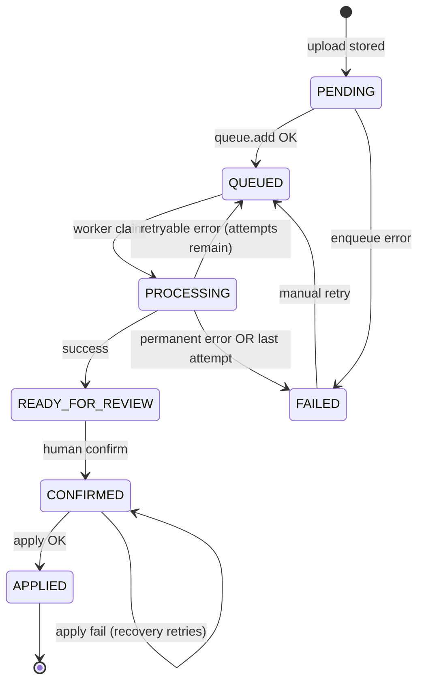

# Document Extraction Queue Reliability — V4.9.326

## Status transition diagram

## Retry matrix

| Error class | Examples | retryable | BullMQ retry | DB during retry |
|-------------|----------|-----------|--------------|-----------------|
| Queue | Redis down, workers disabled | yes (manual) | n/a | FAILED + QUEUE error |
| Storage read | transient IO | yes | yes | QUEUED + nextRetryAt |
| OCR | 429, 5xx, timeout | yes | yes | QUEUED + nextRetryAt |
| OCR | auth, invalid file | no | no | FAILED |
| Extraction | 429, 5xx, timeout heuristics | yes | yes | QUEUED + nextRetryAt |
| Extraction | not configured | no | no | FAILED |
| File validation | empty, MIME spoof, corrupt | no | no | FAILED |
| Apply | domain error | no | recovery only | CONFIRMED + APPLY error |

## Backoff and timeout

| Setting | Env | Default |
|---------|-----|---------|
| Job attempts | `DOCUMENT_EXTRACTION_JOB_ATTEMPTS` | 4 |
| Backoff base | `DOCUMENT_EXTRACTION_JOB_BACKOFF_MS` | 5000 ms (exponential) |
| Worker lock | processor `lockDuration` | 120000 ms |
| Stale QUEUED | `DOCUMENT_EXTRACTION_STALE_QUEUED_MS` | 600000 ms |
| Stale PROCESSING | `DOCUMENT_EXTRACTION_STALE_PROCESSING_MS` | 900000 ms |
| Stale CONFIRMED apply | `DOCUMENT_EXTRACTION_STALE_CONFIRMED_MS` | 600000 ms |
| Max recovery | `DOCUMENT_EXTRACTION_MAX_RECOVERY_ATTEMPTS` | 5 |

## Recovery rules

1. **Stale QUEUED** — `queuedAt` older than threshold, no active BullMQ job, recovery count < max → re-enqueue.
2. **Stale PROCESSING** — `processingStartedAt` older than threshold, no active job → reset PENDING → enqueue → QUEUED.
3. **Stale CONFIRMED** — `appliedAt` null, `updatedAt` old, has `confirmedData` → `retryConfirmedApply`.
4. **Never auto-recover** — READY_FOR_REVIEW, APPLIED, AWAITING_DOCUMENT_TYPE, CANCELLED.

## Health

- `GET /api/v1/document-extractions/health` — queue, workers, Mistral OCR/AI config, storage (no paid API call).
- `GET /api/v1/health/readiness` — includes `documentExtraction` hard check.

## Production guards

- `DOCUMENT_EXTRACTION_QUEUE_ENABLED=false` → upload rejected (503).
- Workers disabled at bootstrap → upload rejected in production.
- Dev/test: `DOCUMENT_EXTRACTION_ALLOW_PENDING_WITHOUT_QUEUE=true` keeps PENDING without enqueue (explicit opt-in).
