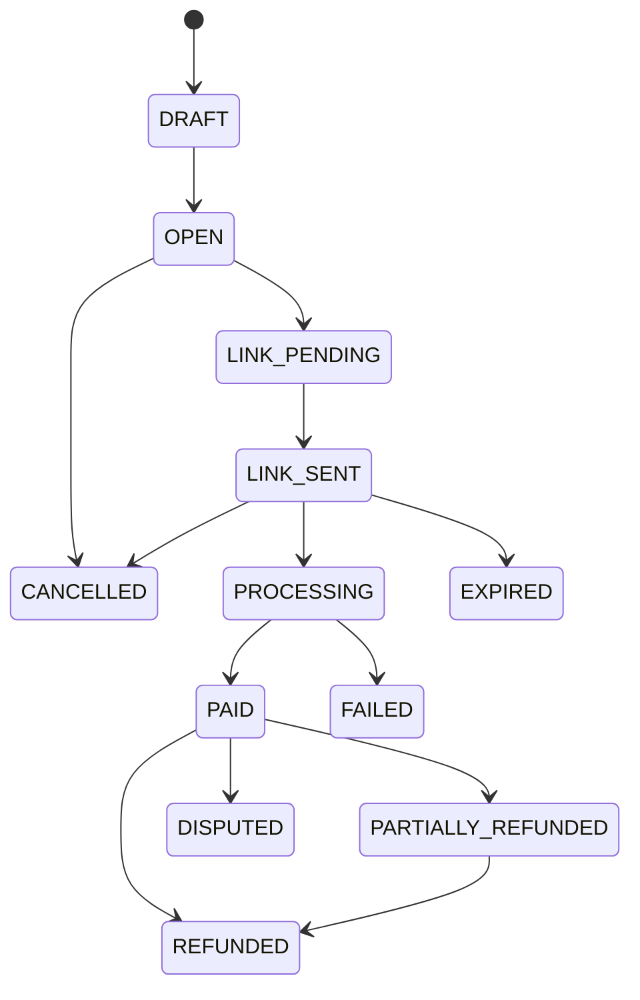

# End-customer payments — domain status machine (Prompt 6)

**Date:** 2026-07-14  
**Scope:** Internal domain logic only — no Stripe SDK, controllers, UI, or invoice side-effects.

## Central gate

All `BookingPaymentRequest` status changes must go through `PaymentStatusService.transitionPaymentRequest()`.  
Repositories remain thin; `BookingPaymentRequestRepository.update()` is documented as lifecycle-restricted.

## Status diagram

## Financial guards

| Rule | Error |
|------|-------|
| PAID requires succeeded CHARGE ≥ amount | `PaidWithoutConfirmedChargeError` |
| Refund requires prior charge | `RefundWithoutPriorPaymentError` |
| Refund ≤ refundable (paid − refunded) | `RefundExceedsRefundableError` |
| CANCEL only before full payment | `CancelAfterFullPaymentError` |
| No reset from paid family to pre-payment | `ResetPaidStatusError` |

## Derived summary

`Booking.paymentStatus` is computed via `deriveBookingPaymentStatus()` from payment requests — not written by arbitrary modules.  
Financial source of truth: `BookingPaymentRequest`, `PaymentTransaction`, `OrgInvoicePayment`.

## Files

- `payment-domain.types.ts`, `payment-domain.errors.ts`
- `payment-status.transitions.ts` — pure `canTransition`, `applyTransition`, amount helpers
- `payment-status.service.ts` — persistence orchestration
