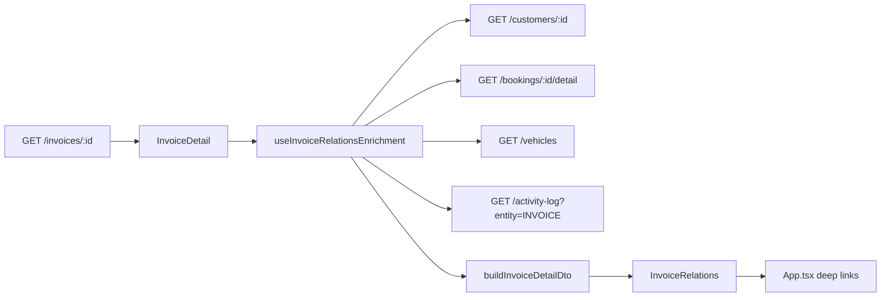

# Invoice detail — Zuordnung (relations) — 2026-07-14

## Scope

Frontend-only rework of the **Zuordnung** card on the invoice detail page.

## Data flow

## DTO

`InvoiceDetailDto.relations` (`invoiceDetailTypes.ts`):

| Field | Content |
|-------|---------|
| `customer` | Primary: name/company; secondary: `KD-…`; tertiary: email |
| `booking` | Primary: `BK-…`; secondary: rental period; tertiary: status label |
| `vehicle` | Primary: make + model; secondary: plate; tertiary: fleet name |
| `vendor` | Supplier name (static row, not navigable) |
| `provenance` | `erstelltVon`, `erstelltUeber`, `quelle` |
| `template` | Optional invoice template |

Mapping lives in `invoiceRelations.mapper.ts` — **no display logic in JSX**.

## Provenance rules

- **OUTGOING_BOOKING** + booking: `erstelltUeber` = `Buchungsassistent` when activity log user or `[synq:wizard-draft]` marker on booking notes; otherwise `Buchungsbestätigung`. `quelle` = `Buchung BK-…`.
- **INCOMING_UPLOADED** / `documentExtractionId`: `KI-Upload` / `Dokumentenextraktion`.
- **OUTGOING_MANUAL** / **OUTGOING_FINAL**: `Rechnungsstellung`.
- Unknown types: `Legacy-Herkunft`.

Never surfaces: „Verknüpft“, raw UUIDs, „Automatisch (Buchung)“ when a user triggered the flow.

## Navigation & permissions

`InvoiceRelationRow` is a full-width `<button>` when `navigable`.

| Relation | Permission module | App handler |
|----------|-------------------|-------------|
| Customer | `customers` read | `customer-detail` |
| Booking | `bookings` read | `bookings` + `pendingBookingDetailId` |
| Vehicle | `fleet` read | `overview` + `selectedVehicle` |

## Tests

- `invoiceRelations.mapper.test.ts` — all relation types + provenance + fallbacks + permissions
- `InvoiceRelations.test.tsx` — rendered output (no Verknüpft/UUID), clickable row, permission hint
