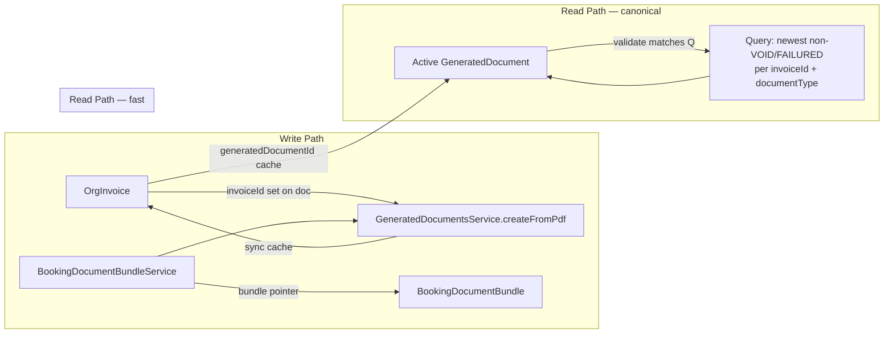

# ADR: Rechnung ↔ Generiertes Dokument — Kanonisches Zielmodell

**Status:** Accepted (design only — no schema/data changes in this ADR)  
**Datum:** 2026-07-14  
**Kontext:** [Ist-Analyse Rechnungsfunktion](../docs/audit/invoice-function-ist-analyse-2026-07-14.md), [Baseline-Tests](../docs/audit/invoice-baseline-tests-2026-07-14.md)  
**Scope:** Mandanten-Rechnungen (`OrgInvoice`) und PDF-Dokumente (`GeneratedDocument`). **Nicht:** SaaS-`BillingInvoice` (Stripe).

---

## 1. Ist-Zustand (codebelegt)

### 1.1 Welche Modelle repräsentieren Rechnungen und Dokumente?

| Modell | Rolle | Relevante Felder |
|--------|--------|------------------|
| **`OrgInvoice`** | Fachliche Ausgangs-/Eingangsrechnung des Vermieters | `organizationId`, `type`, `bookingId`, `status`, `invoiceNumberDisplay`, **`generatedDocumentId`** (Spalte existiert, wird **nicht** beschrieben) |
| **`GeneratedDocument`** | Persistiertes PDF + Metadaten | `organizationId`, `documentType`, `status`, **`invoiceId`**, `bookingId`, `snapshot`, `voidedAt` |
| **`BookingDocumentBundle`** | Buchungsbezogener Dokument-Index (kein Invoice-Modell) | `bookingInvoiceDocumentId`, `finalInvoiceDocumentId`, `status`, `lastError` |
| **`RentalContract`** | Paralleles Pointer-Muster (Vertrag, nicht Rechnung) | `generatedDocumentId` |
| **`BookingDeposit`** | Kautionsbeleg-Pointer | `receiptDocumentId` |
| **`OutboundEmailAttachment`** | E-Mail-Anhang → Dokument | `generatedDocumentId` (FK zu `GeneratedDocument`) |
| **`BillingInvoice`** | SynqDrive ↔ Org Abrechnung (Stripe) | **Separates Domänenmodell** — hier out of scope |

`OrgInvoice` hat **keine Prisma-Relation** zu `GeneratedDocument`. `GeneratedDocument.invoiceId` ist eine **skalare Spalte mit Index**, ohne FK-Constraint (`schema.prisma` Kommentar: bewusst scalar IDs + indexes).

### 1.2 Welche Relation wird beim Generieren gesetzt?

Pfad: `BookingDocumentBundleService.renderAndStore()` → `GeneratedDocumentsService.createFromPdf()`.

```861:879:backend/src/modules/documents/booking-document-bundle.service.ts
    return this.generatedDocs.createFromPdf({
      organizationId: orgId,
      // ...
      invoiceId: args.links?.invoiceId ?? null,
      // ...
    });
```

- **`GeneratedDocument.invoiceId`** wird beim PDF-Erstellen gesetzt (`createFromPdf`, Zeile 99).
- **`OrgInvoice.generatedDocumentId`** wird in `InvoicesService` weder bei `create` noch `update` gesetzt (bestätigt durch Baseline-Tests + Code-Review).
- **`BookingDocumentBundle.bookingInvoiceDocumentId`** / **`finalInvoiceDocumentId`** werden via `setBundlePointer()` aktualisiert — **buchungsbezogen**, nicht rechnungsbezogen.

Typische Zuordnung:

| `OrgInvoice.type` | `GeneratedDocument.documentType` | Bundle-Pointer |
|-------------------|----------------------------------|----------------|
| `OUTGOING_BOOKING` | `BOOKING_INVOICE` | `bookingInvoiceDocumentId` |
| `OUTGOING_FINAL` | `FINAL_INVOICE` | `finalInvoiceDocumentId` |
| `OUTGOING_MANUAL` | *(kein Standard-PDF-Pfad)* | — |

### 1.3 Welche Relation liest die Rechnungsdetailseite?

`frontend/src/rental/components/InvoicesView.tsx` (InvoiceDetail):

- Liest **`invoice.generatedDocumentId`** aus `GET /organizations/:orgId/invoices/:id` (`InvoicesService.format()` Zeile 92).
- **Kein** Reverse-Lookup über `GeneratedDocument.invoiceId`.
- **Kein** `api.documents.open()` — nur Text `generatedDocumentId.slice(0,8)`.
- E-Mail-Gate: `invoice.bookingId && invoice.generatedDocumentId` (Zeilen 854–861).

Die API liefert `generatedDocumentId` aus der DB-Spalte — die in der Praxis **immer `null`** bleibt, obwohl PDFs existieren.

### 1.4 BookingDocumentBundle-, DocumentLink- oder Pointer-Felder?

**Es gibt kein `DocumentLink`-Modell.**

Pointer-Ebenen (Ist):

1. **Rechnung:** `OrgInvoice.generatedDocumentId` — ungenutzt.
2. **Buchung:** `BookingDocumentBundle.*DocumentId` — aktiv für Bundle-UI.
3. **Vertrag/Kaution:** `RentalContract.generatedDocumentId`, `BookingDeposit.receiptDocumentId`.

Auflösung im Bundle-Service (`existingBundleDoc`):

1. Bundle-Pointer (`bookingInvoiceDocumentId` etc.), falls gesetzt und Dokument ≠ `VOID`.
2. Fallback: `findFirst` where `bookingId` + `documentType` + `status != VOID`, `orderBy: createdAt desc`.

### 1.5 Wie werden mehrere Dokumentversionen behandelt?

- **Regenerieren:** altes Dokument → `voidDocument()` (`status = VOID`, `voidedAt`); neues PDF → `createFromPdf()`; Bundle-Pointer wird auf neue ID gesetzt (`ensureBookingInvoice`, `force=true` Pfad).
- **Historie:** VOID-Zeilen bleiben in `generated_documents` (kein Hard-Delete). Nachvollziehbarkeit über `createdAt`, `voidedAt`, `snapshot`, `checksum`, `generatedByUserId`.
- **Kein** explizites `versionNumber`-Feld auf `GeneratedDocument`.
- **Dedupe für Anzeige:** `dedupeDocumentsByType()` — pro `documentType` die **neueste non-VOID** Zeile (`document-list-dedupe.util.ts`).

### 1.6 Wie wird ein „aktives“ Dokument bestimmt?

| Kontext | Algorithmus (Ist) |
|---------|-------------------|
| Buchungsdetail / Bundle-View | Bundle-Pointer → Fallback newest non-VOID by `bookingId`+`documentType`; dann `dedupeDocumentsByType` |
| Rechnungsdetail | `OrgInvoice.generatedDocumentId` (meist null) — **kein aktiver Algorithmus** |
| Duplikat-Rechnungen pro Buchung | `BookingInvoiceLifecycleService.resolveCanonicalBookingInvoice`: bevorzugt Rechnung, die in `GeneratedDocument.invoiceId` verknüpft ist |

Es gibt **keine** `listForInvoice(orgId, invoiceId)`-Methode in `GeneratedDocumentsService`.

### 1.7 Status: erzeugt, fehlgeschlagen, ersetzt, storniert?

**`GeneratedDocument.status`** (String, `documents.constants.ts`):

| Status | Bedeutung (Ist) |
|--------|-----------------|
| `DRAFT` | Definiert, bei `createFromPdf` nicht verwendet (Start: `GENERATED`) |
| `GENERATED` | Standard nach erfolgreicher PDF-Persistenz |
| `SENT` | Nach erfolgreichem E-Mail-Versand (`booking-document-email.service.ts`) |
| `VOID` | Ersetzt / storniert (alte Version bei Regenerate) |
| `FAILED` | Im Schema dokumentiert, **im Documents-Modul nicht gesetzt** bei Render-Fehlern |

**Fehler bei Generierung (Ist):**

- Auf **Bundle-Ebene:** `BookingDocumentBundle.status = FAILED`, `lastError` (String).
- **Kein** persistiertes `GeneratedDocument` mit `status = FAILED` bei PDF-Render-Fehler.

**Ersetzt** = kein eigener Status; semantisch `VOID` + neue Zeile.

### 1.8 Fremdschlüssel und Indizes (Ist)

**`org_invoices`:**

- `organizationId` → FK `Organization` (Cascade)
- `vendorId` → FK `Vendor` (SetNull)
- `generatedDocumentId` — **kein FK**, kein Index
- Indizes: `organizationId`, `bookingId`, `customerId`, `status`, `type`, composites

**`generated_documents`:**

- `organizationId` → FK `Organization` (Cascade)
- `invoiceId` — **Index only** (`@@index([invoiceId])`), kein FK
- `bookingId`, `customerId`, `vehicleId` — Index only
- Kein Unique-Constraint für „eine aktive Version pro Rechnung+Typ“

**`booking_document_bundles`:**

- `bookingId` unique, `organizationId` FK
- Pointer-Spalten ohne FK zu `generated_documents`

**`outbound_email_attachments`:**

- `generatedDocumentId` → FK `GeneratedDocument` (SetNull) — einziger harte FK *zu* GeneratedDocument von außen

### 1.9 Pfade, die PDFs erzeugen ohne vollständige Rechnungs-Aktualisierung

| Pfad | Setzt `invoiceId` auf Doc | Aktualisiert `OrgInvoice` |
|------|---------------------------|---------------------------|
| `BookingDocumentBundleService.ensureBookingInvoice` | Ja | Nein (`generatedDocumentId` bleibt null) |
| `BookingDocumentBundleService.generateFinalInvoiceAndDocument` | Ja | Nein |
| `BookingsService.create` → `generateInitialBundle` | Indirekt | Nein |
| `BookingWizardDraftService.refreshDraftBundle` | Indirekt | Nein |
| Regenerate `POST .../regenerate/BOOKING_INVOICE` | Ja (neue Zeile) | Nein |

`InvoicesService` erzeugt **keine** PDFs. Manuelle `OUTGOING_MANUAL`-Rechnungen haben **keinen** angebundenen Generator.

### 1.10 Legacy-Felder — nicht sofort entfernen

| Feld / Konzept | Grund |
|----------------|--------|
| `OrgInvoice.invoiceNumber` (Int) | `@deprecated`, noch in `format()` / Bundle-Render-Label |
| `OrgInvoice.legacyInvoiceNumber` | Migration-Backfill |
| `OrgInvoice.generatedDocumentId` | Spalte + API-Feld + UI lesen es — **Semantik wird befüllt, nicht entfernt** |
| `BookingDocumentBundle.*DocumentId` | Buchungs-UI, Operator-Flows, E-Mail-Bundle |
| `GeneratedDocument.documentNumber` (`RE-2026-0001`) | Parallel zu `invoiceNumberDisplay` (`FSM-2026-0001`) — PDF-Referenz |
| Skalare IDs ohne Prisma-FK (`invoiceId`, `bookingId` auf Doc) | Bewusste Migrations-Architektur laut Schema-Kommentar |
| `BillingInvoice` | Eigenes Produkt — nicht mit `OrgInvoice` vermischen |

---

## 2. Problem

1. **Zwei konkurrierende Wahrheiten:** Runtime setzt `GeneratedDocument.invoiceId`; UI/API erwarten `OrgInvoice.generatedDocumentId`.
2. **Rechnungsdetail ist blind** für existierende PDFs, obwohl das Bundle sie erzeugt hat.
3. **Aktive Version** ist für Buchungen implementiert (Pointer + Dedupe), für Rechnungen **nicht**.
4. **Versionshistorie** existiert implizit (VOID-Zeilen), aber ohne invoice-zentrierte Abfrage-API.
5. **Fehlerpersistenz** ist bundle-lokal (`lastError`), nicht invoice-/document-zentriert (`FAILED` ungenutzt).
6. **Org-Sicherheit** bei `invoiceId` nur indirekt (Bundle-Kontext), kein DB-FK / kein zentraler Validator.

---

## 3. Zielmodell (fachlich)

| Regel | Beschreibung |
|-------|--------------|
| **Kanonische Relation** | `GeneratedDocument.invoiceId` → `OrgInvoice.id` ist die fachliche Dokument→Rechnung-Verknüpfung. |
| **Mehrversionen** | Eine Rechnung kann **mehrere** `GeneratedDocument`-Zeilen haben (Historie). |
| **Nachvollziehbarkeit** | Jede Version: `snapshot`, `checksum`, `generatedAt`, `generatedByUserId`, `voidedAt`, `templateVersion`. |
| **Aktive Version** | Pro `(organizationId, invoiceId, documentType)` höchstens **eine** aktive Version (`status ∉ {VOID, FAILED}`; bei Gleichstand: neuestes `createdAt`). |
| **Pointer als Cache** | `OrgInvoice.generatedDocumentId` = denormalisierter Zeiger auf die **aktive** Version (nicht alleinige Wahrheit). |
| **Dokumentstatus** | `GENERATED` / `SENT` / `VOID` / `FAILED` persistent auf `GeneratedDocument`; Bundle-`lastError` bleibt aggregierender Buchungs-Kontext. |
| **Org-Sicherheit** | Jede Verknüpfung nur innerhalb derselben `organizationId`; keine org-übergreifenden `invoiceId`-Writes. |

**Dokumenttyp-Mapping (Normativ):**

```
OUTGOING_BOOKING  → BOOKING_INVOICE
OUTGOING_FINAL    → FINAL_INVOICE
OUTGOING_MANUAL   → (zukünftig) BOOKING_INVOICE oder INVOICE_PDF — bis dahin optional kein Auto-PDF
```

Buchungs-Pointer (`bookingInvoiceDocumentId`) bleiben für **Buchungs-Bundle-UX**; sie müssen mit der aktiven Invoice-Version **konsistent** gehalten werden, sind aber nicht die Rechnungs-Wahrheit.

---

## 4. Architekturentscheidung

### Gewählte Variante: **A + C (Hybrid)**

| Teil | Entscheidung |
|------|--------------|
| **C — Kanonische Auflösung** | Aktives Dokument wird **primär per Query** ermittelt: `GeneratedDocument` where `organizationId` + `invoiceId` + `documentType` + `status NOT IN (VOID, FAILED)` order by `createdAt DESC` limit 1. |
| **A — Denormalisierter Cache** | Bestehende Spalte **`OrgInvoice.generatedDocumentId`** wird semantisch als **`activeGeneratedDocumentId`** weiterverwendet (kein neuer Spaltenname in Phase 1). Wird **synchron** bei `createFromPdf`, `voidDocument`, Regenerate gesetzt/geleert. |

### Verworfene Varianten

| Variante | Grund der Verwerfung |
|----------|----------------------|
| **B — Neues explizites Feld** (`activeGeneratedDocumentId` zusätzlich) | Spalte `generated_document_id` existiert seit Migration `20260616180000_invoice_finance_workflow`; UI/API lesen sie bereits. Zweites Feld würde Redundanz ohne Mehrwert schaffen. |
| **Nur A (nur Cache)** | Cache allein reicht nicht: bei Desync (heutiger Ist-Zustand) keine Wahrheit rekonstruierbar. Query-Algorithmus (C) muss immer möglich sein. |
| **Nur C (kein Cache)** | Performance & Rückwärtskompatibilität: `GET /invoices/:id` und `InvoicesView` erwarten ein Feld; Cache vermeidet Join pro Listenzeile. |
| **BookingDocumentBundle-Pointer als Invoice-Wahrheit** | Pointer sind `bookingId`-scoped; `OUTGOING_MANUAL` ohne Buchung; Schlussrechnung hat eigene `OrgInvoice` — Invoice-Zentrierung erforderlich. |
| **Neues `DocumentLink`-Modell (Phase 1)** | Over-Engineering; `GeneratedDocument.invoiceId` + Status erfüllt Anforderung. Link-Tabelle optional erst bei Multi-Parent-Dokumenten. |

---

## 5. Ziel-Architektur (Datenfluss)



**Invarianten (nach Implementierung):**

1. Wenn `OrgInvoice.generatedDocumentId = X`, dann existiert Doc `X` mit `invoiceId = OrgInvoice.id` und `status ∉ {VOID, FAILED}`.
2. Bei Regenerate: altes Doc → `VOID`; Cache zeigt auf neues Doc.
3. `organizationId(GeneratedDocument) = organizationId(OrgInvoice)` wenn `invoiceId` gesetzt.

---

## 6. Migrationsstrategie (zukünftig — nicht in diesem Prompt)

| Phase | Inhalt | Datenänderung |
|-------|--------|---------------|
| **M0** | ADR + Baseline-Tests (erledigt) | Keine |
| **M1** | `GeneratedDocumentsService.listActiveForInvoice(orgId, invoiceId, documentType)` + Org-Validator bei `createFromPdf` | Keine |
| **M2** | `renderAndStore` / `voidDocument`: Cache-Sync auf `OrgInvoice.generatedDocumentId` | **Backfill-Skript** (separater Prompt): für jede Rechnung active Doc aus Query → Cache setzen |
| **M3** | `InvoicesService.findById` / `format()`: Cache validieren; bei Mismatch Query gewinnt + Cache reparieren | Optional |
| **M4** | DB: FK `org_invoices.generated_document_id` → `generated_documents(id)` ON DELETE SET NULL; composite Index `(organization_id, invoice_id, document_type, status)` | Migration |
| **M5** | Bei Render-Fehler: `GeneratedDocument` mit `FAILED` + `metadata.error` **oder** dedizierte `invoice_document_generation_events` — Product-Entscheid; Bundle-`lastError` bleibt | Optional |

**Backfill-Logik (Spezifikation, nicht ausführen):**

```sql
-- Konzept: pro org_invoice.id den neuesten non-VOID generated_documents
-- mit matching document_type (BOOKING_INVOICE / FINAL_INVOICE) ermitteln
-- und org_invoices.generated_document_id setzen wo NULL.
```

---

## 7. Rückwärtskompatibilität

| Verbraucher | Kompatibilität |
|-------------|----------------|
| `GET /invoices/:id` → `generatedDocumentId` | Feld bleibt; wird befüllt statt immer null |
| `InvoicesView` E-Mail / PDF | Funktioniert sobald Cache befüllt; langfristig auch Query-Fallback |
| `BookingDocumentBundle` Pointer | Unverändert; weiterhin für Buchungs-UI |
| `BookingInvoiceLifecycleService` | Nutzt bereits `GeneratedDocument.invoiceId` — bleibt gültig |
| `OutboundEmailAttachment` | Referenziert `generatedDocumentId` direkt — unabhängig |
| Baseline-Regressionstests | Nach M2: „divergence“-Tests anpassen; `describe.skip` Soll-Tests aktivieren |

API-Feldname **`generatedDocumentId`** bleibt in Phase 1 (kein Breaking Rename zu `activeGeneratedDocumentId` in JSON).

---

## 8. Benötigte Indizes und Constraints (Ziel)

| Artefakt | Zweck | Priorität |
|----------|--------|-----------|
| `@@index([organizationId, invoiceId, documentType, status])` auf `generated_documents` | Aktive Version per Query | Hoch |
| FK `org_invoices.generated_document_id` → `generated_documents.id` | Cache-Integrität | Mittel |
| Application check: `invoiceId` setzt nur wenn `orgInvoice.organizationId === doc.organizationId` | Tenant safety | Hoch (vor FK) |
| Optional: CHECK / partial unique via `activeDocumentKey` generated column | DB-enforced „one active“ | Niedrig (App-Logik reicht zunächst) |

**Nicht empfohlen (Ist):** FK `generated_documents.invoice_id` → `org_invoices` mit CASCADE — würde Dokument-Historie bei Rechnungs-Löschung gefährden. Besser: `ON DELETE SET NULL` auf `invoiceId` wenn Rechnung gelöscht wird.

---

## 9. Risiken

| Risiko | Mitigation |
|--------|------------|
| Cache/Query-Desync | Query ist authoritative; Cache-Reconcile bei `findById`; Monitoring-Log bei Mismatch |
| Duplikat-Rechnungen pro Buchung | Bestehend `resolveCanonicalBookingInvoice`; Backfill nur canonical verknüpfen |
| `FAILED` weiterhin nur auf Bundle | Phase 5: FAILED-Zeilen oder Event-Log für Invoice-Sicht |
| Manuelle Rechnungen ohne PDF | Kein Cache; UI zeigt „kein Dokument“ — korrekt |
| Cross-org `invoiceId` | Validator in `createFromPdf`; Tests erweitern |
| Zwei Nummernkreise (FSM vs RE) | Bewusst getrennt; in UI beide anzeigen wo relevant |

---

## 10. Abnahmekriterien (für Implementierungsphasen)

- [ ] `createFromPdf` mit `invoiceId` aktualisiert `OrgInvoice.generatedDocumentId` atomar (Transaction).
- [ ] `voidDocument` leert Cache wenn voided doc = cached active doc; setzt Cache auf nächste active Version falls vorhanden.
- [ ] `GET /invoices/:id` liefert befülltes `generatedDocumentId` für Buchungsrechnungen mit PDF.
- [ ] `listActiveForInvoice` liefert dieselbe ID wie Cache (oder repariert Cache).
- [ ] Regenerate erzeugt VOID + neue Version; Historie abfragbar via `listVersionsForInvoice`.
- [ ] Cross-org: Versuch `invoiceId` aus fremder Org → `ForbiddenException` / DB reject.
- [ ] Baseline-Tests: `invoice-document-link.baseline.spec.ts` Divergence-Test wird Soll-Test; UI-Regression-Locks für `slice(0,8)`-only-Anzeige werden entfernt nach PDF-open.
- [ ] Backfill-Skript: Report `{ invoiceId, previousCache, newCache, source: 'query' }` ohne stille Fehler.

---

## 11. Referenzen (Code)

| Thema | Pfad |
|-------|------|
| Schema | `backend/prisma/schema.prisma` — `OrgInvoice`, `GeneratedDocument`, `BookingDocumentBundle` |
| PDF-Erzeugung | `backend/src/modules/documents/booking-document-bundle.service.ts` |
| Dokument-Persistenz | `backend/src/modules/documents/generated-documents.service.ts` |
| Rechnungs-API | `backend/src/modules/invoices/invoices.service.ts` |
| Canonical Invoice (Duplikate) | `backend/src/modules/invoices/booking-invoice-lifecycle.service.ts` |
| Status-Konstanten | `backend/src/modules/documents/documents.constants.ts` |
| Dedupe | `backend/src/modules/documents/document-list-dedupe.util.ts` |
| Rechnungs-UI | `frontend/src/rental/components/InvoicesView.tsx` |
| Migration Spalte | `backend/prisma/migrations/20260616180000_invoice_finance_workflow/migration.sql` |
| Feature-Doku | `docs/booking-document-lifecycle.md`, `architecture/BOOKING_DOCUMENT_LIFECYCLE_2026-06-13.md` |

---

## 12. Änderungshistorie

| Version | Datum | Autor | Inhalt |
|---------|-------|-------|--------|
| 1.0 | 2026-07-14 | Cloud Agent | Initial ADR — Ist-Analyse, Entscheidung A+C, keine Schemaänderung |

**Changes / Architektur (Master-UI):** Diese ADR-Datei dokumentiert die Entscheidung; Eintrag in `ArchitekturView` / `ChangesView` erfolgt mit der Implementierungsphase (M1+), nicht mit diesem reinen Design-Prompt.
