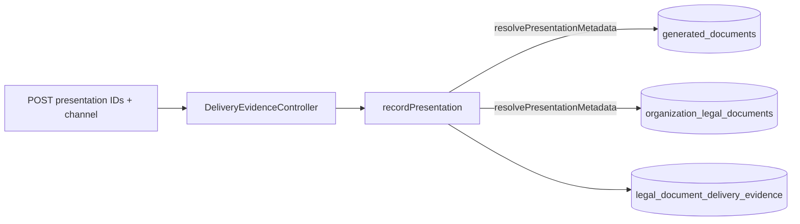

# Legal Documents — Post-Remediation Production Readiness Audit (Prompt 32)

Date: 2026-07-23 (updated after P0/P1 remediation)  
Commit audited: remediation on `cursor/legal-docs-e2e-ci-28ca`  
Decision: **CONDITIONAL GO** (P1-5 CI gate remains)

## Summary

Final independent audit of the 32-prompt remediation series for **Verwaltung → Kunden-Rechtstexte**. Architecture is substantially complete.

**Resolved (2026-07-23):**

1. **P0** — `nest build` green (`LegalDocumentsService` import; workers module imports).
2. **P1-1/2** — Delivery evidence metadata server-derived; no client `deliveryStatus` on POST.
3. **P1-3** — Four-eyes fail-closed when `actorUserId` absent.
4. **P1-4** — Evidence mutations aligned with `@RequireLegalDocumentPermission('legal_documents.audit_view')`.

**Remaining:**

5. **P1-5** — Migration and PostgreSQL invariant tests (CI gate; not run locally).

## Verified architecture (unchanged)

- Central resolver, lifecycle + append-only events, single-ACTIVE partial unique index
- Private S3 storage, malware scanner prod guard, PDF validation, integrity/reconciliation
- Bundle pointers (terms, consumer info, privacy), rental contract snapshots
- Pickup gate with override audit, retention/legal hold, granular permissions
- Operational notifications, i18n/a11y, dedicated CI workflow

## Release conditions

See `docs/audits/legal-documents-post-remediation-readiness-2026-07.md` — sections *Bedingungen für Production-Freigabe* and *Rollback*.

## Signal flow (evidence trust — fixed)

Metadata (`documentType`, `versionLabel`, `language`, `checksum`) and initial `deliveryStatus` are derived server-side; client overrides rejected.
