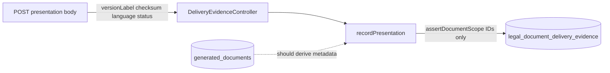

# Legal Documents — Post-Remediation Production Readiness Audit (Prompt 32)

Date: 2026-07-22  
Commit audited: `37636e5f`  
Decision: **NO-GO**

## Summary

Final independent audit of the 32-prompt remediation series for **Verwaltung → Kunden-Rechtstexte**. Architecture is substantially complete; release is blocked by:

1. **P0** — `nest build` failures (`LegalDocumentsService` missing import in `documents.module.ts`; `workers.module.ts` undefined symbols).
2. **P1** — Delivery evidence API accepts client-supplied `versionLabel`, `checksum`, `language`, `documentType`, and `deliveryStatus` (including `DELIVERED` on create).
3. **P1** — Four-eyes `assertSeparation` returns silently when `actorUserId` is absent.
4. **P1** — Migration and PostgreSQL invariant tests not verified in audit environment (CI gate required).

## Verified architecture (unchanged)

- Central resolver, lifecycle + append-only events, single-ACTIVE partial unique index
- Private S3 storage, malware scanner prod guard, PDF validation, integrity/reconciliation
- Bundle pointers (terms, consumer info, privacy), rental contract snapshots
- Pickup gate with override audit, retention/legal hold, granular permissions
- Operational notifications, i18n/a11y, dedicated CI workflow

## Release conditions

See `docs/audits/legal-documents-post-remediation-readiness-2026-07.md` — sections *Bedingungen für Production-Freigabe* and *Rollback*.

## Signal flow (evidence trust — current gap)

**Target:** metadata derived server-side from `generatedDocument` + linked `organizationLegalDocument`; client fields rejected or ignored.
