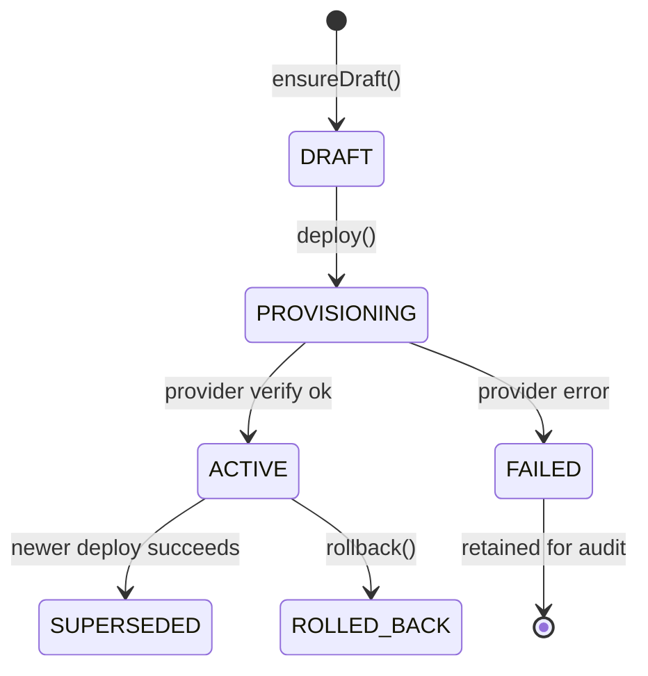

# Voice AI — Versioned ElevenLabs Agent Deployments (2026-07-17)

| Field | Value |
|-------|-------|
| **Status** | **IMPLEMENTED (Prompt 5A)** |
| **Date** | 2026-07-17 |
| **Migration** | `20260717250000_voice_agent_deployment_snapshot` |
| **ADR** | `architecture/VOICE_AI_PRODUCTION_ARCHITECTURE_ADR_2026-07-17.md` §4.3 |

---

## 1. Purpose

Safe draft → diff → deploy → rollback workflow for ElevenLabs conversational agents per organization, without exposing provider payloads to tenant APIs.

Gated by `VOICE_AI_PROVISIONING_STAGING_ENABLED=true` (default off).

---

## 2. Canonical `CanonicalAgentConfig`

Stored in `VoiceAgentDeployment.configSnapshot` (JSON). Tenant APIs accept only canonical fields:

| Area | Fields |
|------|--------|
| Identity | `assistantName`, `language`, `greeting` |
| Prompt | `systemPrompt`, `companyContext`, `businessRules`, `forbiddenActions` |
| Voice | `voiceId`, `voiceName` |
| Tools | `mcpToolRefs[]` (`capabilityKey`, `mode`) |
| Knowledge | `knowledgeRefs[]` (`refId`, `title`, `source`) |
| Hours | `businessHours` (timezone, schedule, after-hours message) |
| Fallback | `fallback` (message, escalation flags, department) |
| Privacy | `privacyRetention` (transcript storage, retention days, PII redaction) |
| Variables | `dynamicVariables[]` |

`configHash` = SHA-256 of stable-sorted JSON snapshot.

Provider system prompt is derived server-side via `buildProviderSystemPrompt()` — not accepted from frontend.

---

## 3. Deployment lifecycle

| Status | Meaning |
|--------|---------|
| `DRAFT` | Editable org draft (`version=0`), does not affect live agent |
| `PROVISIONING` | Immutable snapshot being pushed to ElevenLabs |
| `ACTIVE` | Single live version per `VoiceAssistant` |
| `FAILED` | Provider push failed; previous `ACTIVE` remains |
| `SUPERSEDED` | Replaced by newer successful deploy |
| `ROLLED_BACK` | Was active before rollback |

---

## 4. HTTP routes (tenant)

`OrgScopingGuard` + `ORG_ADMIN` / `SUB_ADMIN` / `MASTER_ADMIN`:

| Method | Path | Action |
|--------|------|--------|
| `GET` | `/organizations/:orgId/voice-assistant/agent-deployment/draft` | Load/create draft |
| `PATCH` | `.../draft` | Validate + save draft (optional `expectedUpdatedAt` optimistic lock) |
| `GET` | `.../diff` | Active vs draft diff (masked secrets/IDs) |
| `POST` | `.../deploy` | Deploy draft (`confirm=true`, `Idempotency-Key` header) |
| `POST` | `.../rollback` | Roll back to `previousVersion` snapshot (`confirm=true`) |

---

## 5. Concurrency & idempotency

| Control | Implementation |
|---------|----------------|
| Org deploy lock | Reject when another `PROVISIONING` row exists for org |
| Idempotent deploy | `VoiceProvisioningJob` unique `(organizationId, idempotencyKey)` |
| Draft optimistic lock | `expectedUpdatedAt` on PATCH → `409 Conflict` on mismatch |
| Single active version | Transaction: supersede prior `ACTIVE`, activate new row |

---

## 6. Provider integration

- Uses `ElevenLabsProviderAdapter` (`createAgent` / `updateAgent` / `getAgent`)
- Stores `protectedExternalRef` + `maskedExternalRef` on deployment
- Dual-writes `VoiceAssistant.elevenLabsAgentId` for legacy compatibility
- Post-update verification via `getAgent` name check
- Logs sanitized via `sanitizeElevenLabsLogMessage`

---

## 7. Schema changes

| Change | Notes |
|--------|-------|
| `VoiceAgentDeployment.configSnapshot` | JSONB immutable snapshot |
| `VoiceAgentDeploymentStatus.SUPERSEDED` | Forward deploy lineage |

---

## 8. Out of scope (Prompt 5A)

- Full operator UI for draft/deploy
- Live call / post-call lifecycle
- MCP tool gateway implementation

---

## 9. Validation

| Check | Result |
|-------|--------|
| `prisma generate` | Pass |
| `npm run build` | Pass |
| `agent-deployment.service.spec.ts` | 13/13 pass |
