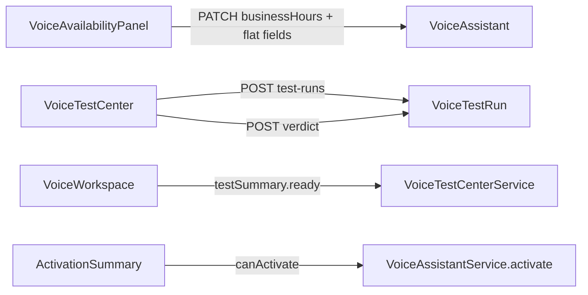

# Voice AI — Availability, Test Center & Activation (2026-07-18)

## Scope

Completes onboarding wizard steps 6–8:

1. **Availability** — weekly plan, multi-window days, timezone, special hours, holidays, after-hours routing, staff groups, forwarding, callback, fallback, max duration, loop protection, conflict warnings, mobile week plan, priority preview.
2. **Test Center** — 10 rental scenarios with simulation-first test runs, PASS/PARTIAL/FAIL verdict persistence, collapsible technical details, no raw JSON default view.
3. **Activation** — server-side activation summary with BLOCKER / WARNING / READY, entitlement + kill-switch surfacing, audit on activation.

## Backend

| Area | Path |
|------|------|
| Availability parse/validate | `availability/voice-availability.util.ts` |
| Test runs API | `test-center/voice-test-center.service.ts` |
| Activation summary | `activation/voice-activation-summary.service.ts` |
| HTTP | `POST/GET …/test-runs`, `GET …/activation-summary` |
| Readiness | `computeReadiness` adds `availability` + `tests` checks for activation |
| Workspace | `testPassed` from `VoiceTestCenterService.getSummary().ready` |
| Test session | Simulation default when agent missing or staging gate off |

### Test run model

- Uses existing `VoiceTestRun` + draft `VoiceAgentDeployment` (no new tables).
- Verdict stored in `redactedResult` + `assertions`; status `PASSED` for PASS/PARTIAL, `FAILED` for FAIL.
- `testPassed` when critical scenarios are PASS/PARTIAL, no FAIL, and ≥8 of 10 validated.

### Activation gates

- `VoiceActivationSummaryService` — server-only `canActivate`
- `assertActivationAllowed` — budget / entitlement protection
- `VOICE_AI_PROVISIONING_STAGING_ENABLED` — live call kill-switch (simulation always allowed)
- ActivityLog audit: `VOICE_ASSISTANT_ACTIVATED`, `VOICE_TEST_RUN_*`

## Frontend

| Component | Role |
|-----------|------|
| `VoiceAvailabilityPanel` | Step 6 UI |
| `VoiceTestCenter` | Step 7 — scenarios, simulation, verdicts |
| `VoiceActivationSummaryPanel` | Step 8 — BLOCKER/WARNING/READY |
| `voice-availability.ops.ts` | Client schedule/routing model + payload sync to `businessHours` JSON |

## Data flow

## i18n

DE/EN keys under `voice.availability.*`, `voice.test.*`, `voice.activation.summary*`.
