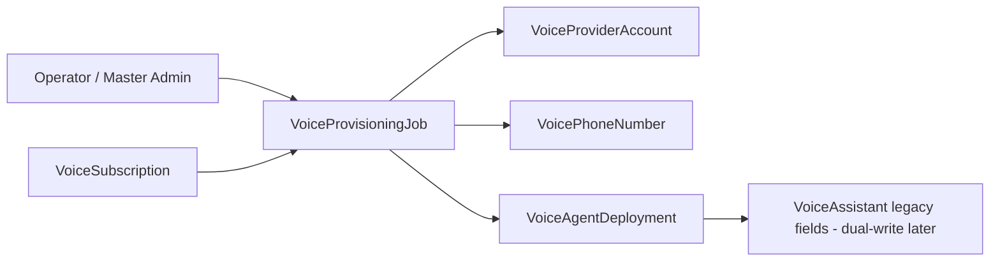

# Voice AI — Tenant Control Plane Data Models (2026-07-17)

| Field | Value |
|-------|-------|
| **Status** | **IMPLEMENTED (Prompt 2A)** |
| **Date** | 2026-07-17 |
| **Migration** | `20260717210000_voice_control_plane_models` |
| **ADR** | `architecture/VOICE_AI_PRODUCTION_ARCHITECTURE_ADR_2026-07-17.md` §4.3, §4.9 |

---

## 1. Purpose

Additive Prisma models for mandantenfähige Voice-Provisionierung. No provider API calls, no automatic provisioning, no changes to legacy `VoiceAssistant` telephony columns.

---

## 2. New models

### 2.1 `VoiceSubscription`

Tenant voice product entitlement with provider-agnostic plan reference (`planCode`, optional `planReference`). No Stripe-specific columns.

| Field | Notes |
|-------|-------|
| `planCode` | Canonical internal plan identifier (e.g. `voice_agent`) |
| `planReference` | Optional external catalog reference |
| `status` | `PENDING` \| `ACTIVE` \| `SUSPENDED` \| `CANCELLED` |
| `currentPeriodStart` / `currentPeriodEnd` | Billing period window |
| `activatedAt` / `suspendedAt` / `cancelledAt` | Lifecycle timestamps |
| `archivedAt` | Soft lifecycle — row retained, excluded from active queries |

### 2.2 `VoiceProviderAccount`

Per-org provider account binding (Twilio subaccount, ElevenLabs workspace).

| Field | Notes |
|-------|-------|
| `provider` | `TWILIO` \| `ELEVENLABS` |
| `accountType` | `PARENT` \| `SUBACCOUNT` \| `WORKSPACE` |
| `maskedExternalRef` | Display-safe external account reference |
| `secretRef` | Opaque vault reference for credentials — **never plaintext** |
| `region` / `edge` | e.g. `ie1` / `dublin` |
| `status` | Includes `ARCHIVED` for soft lifecycle |
| `lastHealthCheckAt` / `lastSyncedAt` | Health and sync timestamps |

### 2.3 `VoicePhoneNumber`

Org-scoped phone inventory linked to `VoiceProviderAccount`.

| Field | Notes |
|-------|-------|
| `maskedPhoneNumber` | Tenant-safe display |
| `protectedE164` | Protected E.164 envelope / vault reference |
| `protectedExternalRef` | Protected Twilio Phone Number SID reference |
| `e164Digest` / `externalRefDigest` | SHA-256 digests for global uniqueness without plaintext |
| `lifecycle` | `DRAFT` → `PROVISIONING` → `ACTIVE` → … → `ARCHIVED` |
| `regulatoryStatus` | Compliance state |
| `elevenLabsImportStatus` | Native integration import progress |
| `voiceAssistantId` | Optional agent assignment (`ON DELETE SET NULL`) |

### 2.4 `VoiceAgentDeployment`

Versioned agent deployment per `VoiceAssistant` and provider.

| Field | Notes |
|-------|-------|
| `version` | Monotonic deployment version |
| `status` | `DRAFT` \| `PROVISIONING` \| `ACTIVE` \| `FAILED` \| `ROLLED_BACK` |
| `configHash` | Deterministic config fingerprint |
| `activatedVersion` / `previousVersion` | Rollback lineage |
| `createdByUserId` / `updatedByUserId` | Audit references |
| `provisionedAt` / `failedAt` / `rolledBackAt` | Status timestamps |

### 2.5 `VoiceProvisioningJob`

Async provisioning job envelope. `payload` JSON must not contain secrets.

| Field | Notes |
|-------|-------|
| `jobType` | e.g. `TWILIO_SUBACCOUNT_CREATE`, `ELEVENLABS_NUMBER_IMPORT` |
| `idempotencyKey` | Unique per org |
| `currentStep` / `progressPct` | Step tracking |
| `errorClass` | `TRANSIENT` \| `PROVIDER` \| `CONFIGURATION` \| … |
| `retryCount` | Retry counter |

---

## 3. Constraints and indexes

| Constraint | Rationale |
|------------|-----------|
| `@@unique([organizationId, provider, accountType])` on `VoiceProviderAccount` | One account slot per provider type per tenant |
| Partial unique `voice_subscriptions_one_active_per_org_idx` | At most one non-archived `ACTIVE` subscription per org |
| `@@unique([e164Digest])` / `@@unique([externalRefDigest])` on `VoicePhoneNumber` | Cross-org E.164 / Twilio SID collision prevention (ADR §4.3) |
| `@@unique([organizationId, idempotencyKey])` on `VoiceProvisioningJob` | Idempotent job creation |
| Indexes on `(organizationId, status)`, `(organizationId, archivedAt)`, lifecycle, job status | Tenant-scoped list queries |

### Foreign key / cascade behavior

| Relation | `onDelete` |
|----------|------------|
| All models → `Organization` | `Cascade` |
| `VoicePhoneNumber` → `VoiceProviderAccount` | `Restrict` (prevent orphan numbers) |
| `VoicePhoneNumber` → `VoiceAssistant` | `SetNull` |
| `VoiceAgentDeployment` → `VoiceAssistant` | `Restrict` |
| `VoiceProvisioningJob` → `VoiceAssistant` | `SetNull` |

---

## 4. Backward compatibility

- **No columns removed** from `VoiceAssistant`, `VoiceConversation`, or `TwilioWebhookEvent`.
- Legacy fields (`phoneNumber`, `twilioPhoneNumberSid`, `elevenLabsAgentId`, `pstnProvider`, etc.) remain authoritative for the current runtime until later prompts migrate reads/writes to control-plane models.
- New tables are empty after migration — existing voice data is untouched.
- Feature flags (`VOICE_AI_SUBACCOUNTS`, `VOICE_AI_NATIVE_TELEPHONY`) remain off; no runtime path reads these tables yet.

---

## 5. Rollback

Migration is additive only. Rollback SQL (manual, pre-9B):

```sql
DROP TABLE IF EXISTS "voice_provisioning_jobs";
DROP TABLE IF EXISTS "voice_agent_deployments";
DROP TABLE IF EXISTS "voice_phone_numbers";
DROP TABLE IF EXISTS "voice_provider_accounts";
DROP TABLE IF EXISTS "voice_subscriptions";
DROP TYPE IF EXISTS "VoiceProvisioningErrorClass";
DROP TYPE IF EXISTS "VoiceProvisioningJobStatus";
DROP TYPE IF EXISTS "VoiceProvisioningJobType";
DROP TYPE IF EXISTS "VoiceAgentDeploymentStatus";
DROP TYPE IF EXISTS "VoiceElevenLabsImportStatus";
DROP TYPE IF EXISTS "VoicePhoneRegulatoryStatus";
DROP TYPE IF EXISTS "VoicePhoneNumberLifecycle";
DROP TYPE IF EXISTS "VoiceProviderAccountStatus";
DROP TYPE IF EXISTS "VoiceProviderAccountType";
DROP TYPE IF EXISTS "VoiceControlPlaneProvider";
DROP TYPE IF EXISTS "VoiceSubscriptionStatus";
```

Repositories can be removed from `VoiceAssistantModule` without affecting legacy voice routes.

---

## 6. Legacy fields not yet migrated

These `VoiceAssistant` fields remain the live source until provisioning prompts (2B+) wire control-plane writes:

| Legacy field | Planned control-plane successor |
|--------------|--------------------------------|
| `twilioPhoneNumberSid` | `VoicePhoneNumber.protectedExternalRef` + digest |
| `phoneNumber` / `phoneNumberId` | `VoicePhoneNumber.maskedPhoneNumber` + `protectedE164` |
| `elevenLabsAgentId` | `VoiceAgentDeployment.protectedExternalRef` |
| `elevenLabsPhoneNumberId` | `VoicePhoneNumber` + `elevenLabsImportStatus` |
| `pstnProvider` | `telephonyMode` enum (Prompt 1A/1B planned, not in 2A) |
| `connectionStatus`, `lastProvisionedAt`, `lastSyncedAt` | `VoiceProviderAccount` health/sync fields |
| (missing) `twilioSubaccountSid` | `VoiceProviderAccount` (`SUBACCOUNT`) |
| (missing) `telephonyMode` | Future enum on `VoiceAssistant` |

---

## 7. Repository layer

Minimal read/write repositories under `backend/src/modules/voice-assistant/control-plane/`:

- `VoiceSubscriptionRepository`
- `VoiceProviderAccountRepository`
- `VoicePhoneNumberRepository`
- `VoiceAgentDeploymentRepository`
- `VoiceProvisioningJobRepository` (idempotent `persistOrGet`)

Registered in `VoiceAssistantModule`. No external API calls.

---

## 8. Validation performed

| Check | Result |
|-------|--------|
| `prisma format` | Pass |
| `prisma validate` | Pass |
| `prisma generate` | Pass |
| `npm run build` (backend) | Pass |
| Repository unit tests | 7/7 pass |
| `prisma migrate deploy` (empty + legacy DB) | **Skipped** — no PostgreSQL server in Cloud Agent runtime; migration SQL reviewed against schema via `prisma migrate diff --from-empty` |

---

## 9. Signal flow (future)



Not active in 2A — schema and repositories only.
