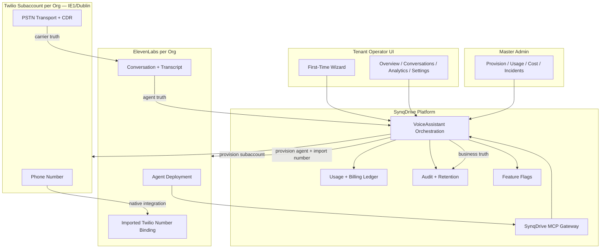

# ADR: SynqDrive Voice AI — Production Architecture

| Field | Value |
|-------|-------|
| **Status** | **ACCEPTED FOR IMPLEMENTATION** |
| **Date** | 2026-07-17 |
| **Prompt** | 0B von 22 |
| **Baseline** | `architecture/VOICE_AI_RUNTIME_BASELINE_2026-07-17.md` |
| **Baseline commit** | `c9b3d7c6` |
| **ADR branch commit** | `e5a132ca` (baseline audit only; no production code) |

---

## 1. Context

### 1.1 Baseline summary

Phase 0A (`VOICE_AI_RUNTIME_BASELINE_2026-07-17.md`) established that SynqDrive already ships a broad Voice Assistant surface (NestJS modules, Prisma models, Rental UI, Master Admin, Twilio webhooks, ElevenLabs REST client), but the **live PSTN path is not production-ready**:

- Twilio inbound/outbound terminates in static TwiML `<Say>` / optional `<Dial>` — **no live ElevenLabs agent conversation**.
- **No** SynqDrive MCP gateway, **no** per-org Twilio subaccounts, **no** billing enforcement on voice routes, **no** usage/cost ledger.
- Provider accounts are connected; **0 Twilio numbers**, **0 ElevenLabs agents**, Production DB: **1 DRAFT assistant**, **0 conversations**.

### 1.2 Drift check since baseline (read-only, 2026-07-17)

| Check | Baseline | Current | Drift |
|-------|----------|---------|-------|
| `origin/main` | `c9b3d7c6` | `c9b3d7c6` | **None** |
| VPS deployed commit | `c9b3d7c6` | `c9b3d7c6` | **None** |
| VPS release | `20260717181230_v4994` | same | **None** |
| `voice_assistants` count | 1 | 1 | **None** |
| `voice_conversations` count | 0 | 0 | **None** |
| Twilio webhook signing on VPS | present (synced during 0A ops) | present | **Ops-only; not in repo** |
| ElevenLabs MCP | error | error | **Unchanged** |
| Twilio Docs MCP | ready | ready | **Available** |

**Conclusion:** No material repository or production-runtime drift affecting architectural decisions. The gap between baseline and target remains fully open for implementation.

### 1.3 Provider documentation alignment (read-only)

**Twilio (via Twilio Docs MCP):**

- Subaccounts: `POST /2010-04-01/Accounts.json` (`CreateAccount`) — region-isolated resources; IE1 API keys must be created in IE1 ([Twilio Regions overview](https://www.twilio.com/docs/global-infrastructure/create-an-outbound-call-via-rest-api-in-a-non-us-twilio-region)).
- Phone numbers are scoped to `{AccountSid}` — supports per-subaccount inventory without cross-tenant listing at the API level when clients are subaccount-scoped.

**ElevenLabs (official docs; MCP unavailable):**

- **Native Twilio integration (MVP standard):** Import purchased Twilio number via `POST /v1/convai/phone-numbers` with subaccount `sid` + `token`; ElevenLabs auto-configures voice webhooks; inbound + outbound via agent assignment and `POST /v1/convai/twilio/outbound-call` ([Native integration](https://elevenlabs.io/docs/eleven-agents/phone-numbers/twilio-integration/native-integration)).
- **Register call (non-MVP):** `POST /v1/convai/twilio/register-call` returns TwiML for custom Twilio routing; requires SynqDrive to own TwiML pipeline; no call transfers; numbers do not appear in EL dashboard ([Register call](https://elevenlabs.io/docs/eleven-agents/phone-numbers/twilio-integration/register-call)).
- **SIP trunk:** Supported as separate import path — deferred to post-MVP enterprise/BYO-PBX.

---

## 2. Decision

SynqDrive will deliver a **production Voice AI** where **Twilio carries PSTN**, **ElevenLabs runs the conversational agent**, and **SynqDrive owns tenant data, permissions, MCP tools, usage, billing, automation, and audit**. Twilio and ElevenLabs are **co-required parts of one deployment**, not interchangeable PSTN providers.

---

## 3. Architecture overview



---

## 4. Binding decisions

### 4.1 Provider roles

| Layer | Owner | Responsibility |
|-------|-------|----------------|
| PSTN carrier | **Twilio** | Subaccounts, numbers, call transport, carrier status, carrier CDR |
| Voice agent | **ElevenLabs** | Agent deployment, real-time conversation, transcript, agent tools (via MCP URL) |
| Platform | **SynqDrive** | Org provisioning, knowledge, permissions, MCP tool execution, usage metering, billing, automations, audit, retention, operator UI |

**Rejected for MVP:**

- Treating Twilio and ElevenLabs as alternative `pstnProvider` choices for the same live path.
- SynqDrive-owned Media Streams bridge.
- Register-call as default inbound/outbound path.
- SIP / BYO-PBX (post-MVP enterprise track).

**Legacy note:** Existing `VoicePstnProvider` enum and TwiML Say bridge remain during migration (see §9) but are **not** the target architecture.

---

### 4.2 MVP telephony

**Standard path: ElevenLabs Native Twilio Integration**

1. SynqDrive provisions a **Twilio subaccount per org** (IE1).
2. SynqDrive purchases or assigns a number **inside that subaccount**.
3. SynqDrive provisions an **ElevenLabs agent per org**.
4. SynqDrive imports the subaccount number into ElevenLabs via `POST /v1/convai/phone-numbers` using **subaccount SID + auth token** (stored server-side, never exposed to tenant UI).
5. ElevenLabs configures Twilio voice webhooks automatically.
6. Inbound: PSTN → Twilio → ElevenLabs agent (no SynqDrive TwiML Say in production path).
7. Outbound: SynqDrive → ElevenLabs `POST /v1/convai/twilio/outbound-call` (not `TwilioTelephonyService.initiateOutboundCall` Say TwiML).

**Explicitly not MVP:**

| Path | Status | Reason |
|------|--------|--------|
| Register call (`/v1/convai/twilio/register-call`) | **Non-standard / fallback only** | Custom TwiML ownership, no transfers, higher ops burden |
| SynqDrive Media Streams bridge | **Prohibited in MVP** | Duplicates EL native integration |
| Direct Twilio `<Say>` greeting bridge | **Legacy / canary-off only** | Baseline P0 gap |
| SIP trunk import | **Post-MVP** | Enterprise BYO-PBX |

**Regional requirement:** All Twilio REST clients, API keys, subaccount creation, and number operations use **`region: ie1`** + **`edge: dublin`** consistently. ElevenLabs `region_config` must match when importing numbers.

---

### 4.3 Tenant isolation

| Rule | Requirement |
|------|-------------|
| Twilio | **One subaccount per `organizationId`** |
| ElevenLabs | **One canonical agent deployment per org** (versioned via EL branches/environments later) |
| Phone inventory API | Tenant routes return **only numbers in org subaccount** — **never** parent-account global list |
| Credentials | Subaccount auth token stored encrypted; scoped server-side retrieval by `organizationId` |
| IE1/Dublin | Mandatory for all Twilio operations affecting that org |
| Cross-org assignment | DB unique constraint: a Twilio number SID / E.164 may map to **at most one** `VoiceAssistant` |

**New persistent fields (additive, planned):**

- `VoiceAssistant.twilioSubaccountSid` (masked in UI)
- `VoiceAssistant.elevenLabsPhoneNumberId` (already exists — becomes canonical for native path)
- `VoiceAssistant.telephonyMode` enum: `LEGACY_TWIML` | `NATIVE_ELEVENLABS_TWILIO` | `SIP_ENTERPRISE` (future)
- `VoiceTwilioSubaccount` table (orgId, subaccountSid, status, ie1ProvisionedAt) — optional normalization

---

### 4.4 MCP Gateway

SynqDrive exposes a **public HTTPS MCP endpoint** for ElevenLabs agent tool calls.

**Endpoint (target):** `POST /api/v1/mcp/voice/{orgId}` (exact path finalized in Prompt 4A)

**Token model:**

- Short-lived JWT or HMAC token bound to `organizationId`, `voiceAssistantId`, `conversationId`, `toolAllowlist`, `scopes`.
- Claims: `exp` (≤ 15 min), `nonce` (single-use), `iat`, `aud` (ElevenLabs agent id).
- Replay protection: nonce stored in Redis with TTL; reject reuse.

**Tool policy classes (maps to existing permission matrix):**

| Class | Runtime behavior |
|-------|------------------|
| `READ_ONLY` | Execute read tools immediately |
| `CONFIRMATION_REQUIRED` | Return pending action; require operator/customer confirmation channel |
| `STAFF_APPROVAL_REQUIRED` | Queue for staff approval (Task / notification) |
| `PROHIBITED` | Hard deny — never exposed to agent |

**Hard prohibitions:**

- No arbitrary SQL.
- No shell execution.
- No universal HTTP proxy tools.
- No cross-tenant IDs in tool arguments without resolver validation.

**Tool allowlist:** Derived from `VoiceAssistant.toolPermissions` + org entitlements; injected into EL agent MCP config at provision time.

---

### 4.5 Conversation source of truth

| Domain | System of record | SynqDrive field(s) |
|--------|------------------|-------------------|
| PSTN transport (ringing, answered, failed, duration, carrier hangup) | **Twilio** | `twilioCallSid`, carrier metadata |
| Agent conversation (transcript, EL status, tool calls) | **ElevenLabs** | `elevenLabsConvId`, `providerConversationId` |
| Tenant business outcome | **SynqDrive** | `outcome`, `escalationReason`, linked booking/customer/vehicle/task |
| Billing minutes | **SynqDrive** | usage ledger (new) |
| Audit / retention | **SynqDrive** | `VoiceConversation` + audit tables |

**Deterministic lifecycle (no invalid composites):**

```
CREATED → RINGING → IN_CONVERSATION → WRAP_UP → COMPLETED
                  ↘ NO_ANSWER / BUSY / FAILED / CANCELLED
```

- **Forbidden:** `ACTIVE` + `RESOLVED`, `COMPLETED` + open escalation task, etc.
- **Resolver:** `VoiceConversationLifecycleService` merges Twilio status webhooks + ElevenLabs post-call webhooks + sync pull into a single state machine with explicit precedence rules (documented in Prompt 5A).

**Correlation keys:**

- Primary: `twilioCallSid` (when PSTN involved)
- Secondary: `elevenLabsConvId` / `providerConversationId`
- Idempotency: `externalEventId` per webhook source (extend beyond Twilio-only)

---

### 4.6 Billing

Voice AI is an **organization add-on** (`VOICE_AGENT` / `addon.voice_agent`). All voice routes require active entitlement **after Prompt 6B**.

#### Customer-facing plans (EUR, excl. VAT — store in billing catalog)

| Plan | Monthly | Included minutes | Overage / min | Setup (once) |
|------|---------|------------------|---------------|--------------|
| **Start** | 49 € | 100 | 0,35 € | 149 € |
| **Pro** | 119 € | 400 | 0,29 € | 249 € |
| **Business** | 249 € | 1.000 | 0,25 € | 499 € |

#### Internal planning cost model

- **0,12 € / minute** blended provider + infra estimate (planning only; not customer-facing).
- **Number costs** billed separately (Twilio recurring + per-minute carrier) — pass-through or bundled per plan policy (Master Admin configurable).

#### Metering rules

- Billable minute = connected conversation time rounded **up to next whole minute** after **6-second grace** (policy detail in 6A).
- Inbound + outbound both meter against org pool.
- Hard stop or warn at 80% / 100% of included minutes (configurable per plan).

---

### 4.7 Tenant UI

#### First-Time Wizard (pre-activation)

Sequential steps — cannot skip required gates:

1. **Tariff** — select Start / Pro / Business (or inherit from billing subscription)
2. **Assistant** — name, voice, language, greeting, system prompt
3. **Knowledge** — snippets + linked stations/rules/tariffs (reuse `useVoiceKnowledgeLinks`)
4. **Rights** — permissions matrix (tool policy classes)
5. **Phone number** — search/purchase in org subaccount OR assign existing
6. **Routing** — inbound enabled, outbound opt-in, escalation phone/user
7. **Test** — signed test session + optional PSTN test call
8. **Activation** — provision EL agent, import number, go live

#### Post-activation information architecture

| Nav item | Purpose |
|----------|---------|
| **Übersicht** | Status, KPIs, alerts, quick actions |
| **Gespräche** | Conversation log, filters, transcripts (masked numbers) |
| **Automationen** | Voice-triggered workflows / follow-up actions |
| **Analyse & Verbrauch** | Analytics + minute usage vs plan |
| **Einstellungen** | Assistant config, telephony, permissions |

**Provider IDs** (Twilio SID suffixes, EL agent id suffixes) appear **only** in **Diagnose** subsection — never in primary operator flows.

**i18n:** DE + EN required for wizard and post-activation surfaces (Prompt 7B).

---

### 4.8 Master Admin

Master Admin becomes the **control plane** for Voice AI platform operations:

| Area | Capabilities |
|------|--------------|
| **Plattformstatus** | Provider connectivity, IE1 health, queue depth, webhook error rate |
| **Organisationen** | Per-org readiness, plan, entitlement, suspension |
| **Provisionierung** | Trigger subaccount create, number purchase, agent deploy, import |
| **Nummern** | Inventory per subaccount (masked), assignment conflicts |
| **Agent Deployments** | EL agent id (masked), version/branch, last provision |
| **Webhooks** | Twilio + ElevenLabs delivery health, signature failures |
| **Usage** | Minutes, calls, overage per org |
| **Kosten** | Internal 0,12 €/min model vs revenue, margin |
| **Audit** | Provision events, permission changes, tool invocations |
| **Incidents** | Failed provisioning, webhook DLQ, billing sync errors |

Replaces stub `costTrackingConnected: false` with real ledger integration (Prompt 8B).

---

### 4.9 Migration, feature flags, and rollback

**Principles:**

- **Additive only** — retain existing `VoiceAssistant`, `VoiceConversation`, `TwilioWebhookEvent` columns through canary.
- **No destructive migration** until Prompt 9B completion criteria met.

#### Feature flags (env + per-org override)

| Flag | Default | Purpose |
|------|---------|---------|
| `VOICE_AI_NATIVE_TELEPHONY` | `false` | Enable EL native Twilio path |
| `VOICE_AI_SUBACCOUNTS` | `false` | Provision per-org Twilio subaccounts |
| `VOICE_AI_MCP_GATEWAY` | `false` | Enable MCP tool endpoint |
| `VOICE_AI_BILLING_ENFORCEMENT` | `false` | Gate routes on `addon.voice_agent` |
| `VOICE_AI_LEGACY_TWIML` | `true` | Keep Say-bridge for rollback |

Per-org overrides stored in `VoiceAssistant.metadata` or dedicated `voice_feature_flags` JSON.

#### Rollback strategy

1. Set org flag `telephonyMode=LEGACY_TWIML` + `VOICE_AI_LEGACY_TWIML=true`.
2. Re-point Twilio number webhooks to SynqDrive `/webhooks/twilio/voice` (ops script).
3. Disable MCP URL on EL agent.
4. No data loss — conversations remain in `VoiceConversation`.

#### Legacy removal criteria (Prompt 9B)

- ≥ 1 org successfully on native path for 14 days.
- E2E green in staging + production canary.
- Zero P0/P1 incidents for 7 days.
- Master Admin shows 0 orgs on `LEGACY_TWIML`.

**Deprecated after canary (not deleted in 0B):**

- `TwilioVoiceBridgeService` Say path as production default.
- `buildPhoneNumberList` parent-account listing.
- `pstnProvider` as mutually exclusive provider switch (replaced by `telephonyMode`).
- `POST .../twilio/outbound-call` Say implementation (replaced by EL outbound API).

---

## 5. Target vs current gap matrix

| Area | Current (baseline) | Target (this ADR) |
|------|-------------------|-------------------|
| PSTN live AI | TwiML Say | EL native Twilio |
| Twilio tenancy | Parent account | Subaccount per org |
| Phone list API | Global | Subaccount-scoped |
| MCP | Prompt-only | SynqDrive MCP Gateway |
| Conversation state | Ad hoc / dual | Deterministic FSM |
| Billing | Addon exists, no gate | Plans + enforcement + ledger |
| UI | 9-tab English | Wizard + 5-area IA, DE/EN |
| Master Admin | Overview stub cost | Full control plane |
| Webhooks | Twilio only | Twilio + ElevenLabs post-call |

---

## 6. Security and compliance (production requirements)

- All new secrets: Cursor Runtime Secrets / VPS `backend.env` — never git, never frontend.
- Subaccount auth tokens: encrypted at rest (reuse existing secret encryption pattern from billing/DIMO if available).
- MCP tokens: short-lived, nonce, allowlist, audit log per invocation.
- PII: caller numbers masked in tenant UI; full numbers Master Admin + audit only with role gate.
- Retention: transcript retention policy per org plan (default 90 days — finalized in 5A).
- GDPR: EU routing IE1 + Dublin; EL data processing agreement tracked in Master Admin.

---

## 7. Non-goals (MVP)

- SIP / BYO-PBX enterprise trunking
- Custom Media Streams bridge
- Register-call as primary path
- Multi-agent per org (single canonical agent MVP)
- Real-time transcript streaming in tenant UI (post-MVP; sync/webhook first)
- WhatsApp voice (separate channel architecture)

---

## 8. Implementation roadmap — Prompts 1A through 10B

Each phase has **A = design/contracts/spec** and **B = implementation + tests**.  
**Do not start a phase B before its phase A is accepted.**

---

### Phase 1 — Foundation & contracts

#### Prompt 1A — Schema, enums, and API contracts

| | |
|---|---|
| **Goal** | Define additive Prisma models, enums (`telephonyMode`, lifecycle states), OpenAPI/DTO contracts, feature-flag registry, and correlation ID conventions. |
| **Prerequisites** | This ADR accepted; baseline audit read. |
| **Non-goals** | Provider provisioning, UI changes, breaking migrations, legacy removal. |

#### Prompt 1B — Implement foundation layer

| | |
|---|---|
| **Goal** | Land additive migrations, feature-flag service, lifecycle enum types, stub services with unit tests; no live telephony switch. |
| **Prerequisites** | 1A contracts merged. |
| **Non-goals** | Enabling native telephony in production; MCP live traffic. |

---

### Phase 2 — Twilio subaccount provisioning

#### Prompt 2A — Twilio tenancy design

| | |
|---|---|
| **Goal** | Specify subaccount provisioning flow, IE1 API key strategy, encrypted credential storage, number purchase/search APIs, Master Admin provision actions, failure/retry semantics. |
| **Prerequisites** | 1B complete. |
| **Non-goals** | ElevenLabs import; tenant wizard UI. |

#### Prompt 2B — Implement Twilio subaccount module

| | |
|---|---|
| **Goal** | `TwilioSubaccountService`, provision job, org-scoped phone list, remove parent-account listing from tenant routes behind flag. |
| **Prerequisites** | 2A accepted; `VOICE_AI_SUBACCOUNTS` flag. |
| **Non-goals** | Live inbound AI calls; billing metering. |

---

### Phase 3 — ElevenLabs native Twilio integration

#### Prompt 3A — EL native telephony design

| | |
|---|---|
| **Goal** | Specify agent provision/update, `POST /v1/convai/phone-numbers` import with subaccount creds, outbound via `/v1/convai/twilio/outbound-call`, webhook subscriptions, readiness checks. |
| **Prerequisites** | 2B subaccounts available in staging. |
| **Non-goals** | Register-call path; SIP; MCP tools. |

#### Prompt 3B — Implement native telephony path

| | |
|---|---|
| **Goal** | Wire activation + assign number through EL native integration; disable Say TwiML for orgs with `NATIVE_ELEVENLABS_TWILIO`; staging E2E inbound/outbound smoke test. |
| **Prerequisites** | 3A accepted; staging Twilio number + EL agent. |
| **Non-goals** | Legacy path removal; production canary. |

---

### Phase 4 — SynqDrive MCP Gateway

#### Prompt 4A — MCP gateway design

| | |
|---|---|
| **Goal** | Tool catalog, token format, nonce/replay store, scope matrix mapping from `voice-assistant-permissions`, EL agent MCP URL config, audit schema. |
| **Prerequisites** | 1B permission model; 3B agent deployable. |
| **Non-goals** | Autonomous destructive actions without approval queues. |

#### Prompt 4B — Implement MCP gateway

| | |
|---|---|
| **Goal** | Public MCP endpoint, token issuer, allowlisted tool executors (bookings read, tasks create, etc.), integration tests with mock EL caller. |
| **Prerequisites** | 4A accepted; Redis available. |
| **Non-goals** | Full automation catalog — start with read + suggest-only tools. |

---

### Phase 5 — Conversation lifecycle & webhooks

#### Prompt 5A — Lifecycle FSM design

| | |
|---|---|
| **Goal** | Unified state machine, Twilio + ElevenLabs webhook contracts, merge precedence, idempotency keys, retention policy, DLQ/replay design. |
| **Prerequisites** | 3B native calls working in staging. |
| **Non-goals** | Billing minute finalization (phase 6). |

#### Prompt 5B — Implement lifecycle pipeline

| | |
|---|---|
| **Goal** | ElevenLabs post-call webhook controller, async queue processor (BullMQ), lifecycle resolver, conversation sync hardening, admin replay tool. |
| **Prerequisites** | 5A accepted. |
| **Non-goals** | Real-time websocket transcript UI. |

---

### Phase 6 — Billing, usage ledger & entitlements

#### Prompt 6A — Voice billing design

| | |
|---|---|
| **Goal** | Catalog entries for Start/Pro/Business, minute metering rules, overage Stripe mapping, entitlement guard spec, internal cost model fields. |
| **Prerequisites** | 5A conversation duration truth defined. |
| **Non-goals** | Customer self-serve plan downgrade automation (can be manual MVP). |

#### Prompt 6B — Implement billing enforcement

| | |
|---|---|
| **Goal** | `VoiceUsageLedger`, entitlement guard on all voice routes, 80%/100% alerts, Master Admin usage views, Stripe catalog seed migration. |
| **Prerequisites** | 6A accepted; existing billing module patterns. |
| **Non-goals** | Retroactive billing for baseline test calls. |

---

### Phase 7 — Tenant UI

#### Prompt 7A — Wizard & IA design

| | |
|---|---|
| **Goal** | Figma-aligned wizard wireframes, step gating, post-activation nav, DE/EN copy deck, diagnose panel spec. |
| **Prerequisites** | This ADR UI section; Figma MCP for visual alignment. |
| **Non-goals** | Master Admin UI (phase 8). |

#### Prompt 7B — Implement tenant voice UI

| | |
|---|---|
| **Goal** | Replace tab sprawl with wizard + 5-area IA; hook to new APIs; i18n DE/EN; mobile pass. |
| **Prerequisites** | 7A accepted; backend APIs from phases 2–6 available behind flags. |
| **Non-goals** | Legacy tab UI removal until canary (flagged). |

---

### Phase 8 — Master Admin control plane

#### Prompt 8A — Master Admin voice ops design

| | |
|---|---|
| **Goal** | Screens for provision, usage, cost/margin, webhooks, incidents; action matrix (what Master Admin can trigger vs read-only). |
| **Prerequisites** | 6A billing model; 2A provision flows. |
| **Non-goals** | Tenant-facing settings. |

#### Prompt 8B — Implement Master Admin voice ops

| | |
|---|---|
| **Goal** | Extend `VoiceAssistantAdminView` into full control plane; real `costTrackingConnected`; provision triggers; webhook health dashboard. |
| **Prerequisites** | 8A accepted; 2B–6B backends. |
| **Non-goals** | Automated incident remediation without human ack. |

---

### Phase 9 — Migration, canary & legacy deprecation

#### Prompt 9A — Canary & migration runbook

| | |
|---|---|
| **Goal** | Per-org migration checklist, flag rollout order, rollback runbook, ops scripts, data backfill for existing `VoiceAssistant` row. |
| **Prerequisites** | 3B–8B integrated in staging. |
| **Non-goals** | Forced migration of all orgs day one. |

#### Prompt 9B — Execute canary & remove legacy

| | |
|---|---|
| **Goal** | Production canary org on native path; monitor 14 days; remove `LEGACY_TWIML` default; delete Say bridge code paths per removal criteria §4.9. |
| **Prerequisites** | 9A runbook; green E2E (phase 10A). |
| **Non-goals** | SIP enterprise path. |

---

### Phase 10 — E2E, observability & production hardening

#### Prompt 10A — Test & observability design

| | |
|---|---|
| **Goal** | Playwright E2E scenarios, staging provider fixtures, Prometheus metrics, alerts, SLOs, on-call runbook for voice incidents. |
| **Prerequisites** | 9A canary plan. |
| **Non-goals** | Load testing at carrier scale (separate perf track). |

#### Prompt 10B — Production hardening & launch

| | |
|---|---|
| **Goal** | Ship E2E suite in CI, dashboards, launch checklist, update ArchitekturView + Changes, production go-live sign-off. |
| **Prerequisites** | 10A accepted; 9B canary green. |
| **Non-goals** | Post-MVP SIP enterprise features. |

---

## 9. Acceptance criteria for this ADR

This ADR is considered **implemented** when Prompt **10B** is complete and:

1. At least one production org handles **live inbound and outbound** calls via **EL native Twilio** on an **IE1 subaccount**.
2. **MCP gateway** executes allowlisted tools with audit trail.
3. **Billing** enforces addon + minute limits with visible usage in tenant UI.
4. **Master Admin** shows usage, cost, margin, and provision status without stubs.
5. **Legacy TwiML Say path** is disabled by default and removable per §4.9.

---

## 10. References

- `architecture/VOICE_AI_RUNTIME_BASELINE_2026-07-17.md`
- `backend/docs/twilio-setup.md`
- `backend/src/modules/voice-assistant/README.md`
- [Twilio: Create subaccount API](https://www.twilio.com/docs/iam/api/subaccounts)
- [Twilio: IE1 regional REST](https://www.twilio.com/docs/global-infrastructure/create-an-outbound-call-via-rest-api-in-a-non-us-twilio-region)
- [ElevenLabs: Native Twilio integration](https://elevenlabs.io/docs/eleven-agents/phone-numbers/twilio-integration/native-integration)
- [ElevenLabs: Register call (non-MVP)](https://elevenlabs.io/docs/eleven-agents/phone-numbers/twilio-integration/register-call)
- [ElevenLabs: Import phone number API](https://elevenlabs.io/docs/api-reference/phone-numbers/create)

---

## 11. Decision log

| Date | Decision |
|------|----------|
| 2026-07-17 | ADR **ACCEPTED FOR IMPLEMENTATION** — native EL Twilio MVP, subaccount per org, SynqDrive MCP gateway, deterministic lifecycle, billing plans as specified. |
