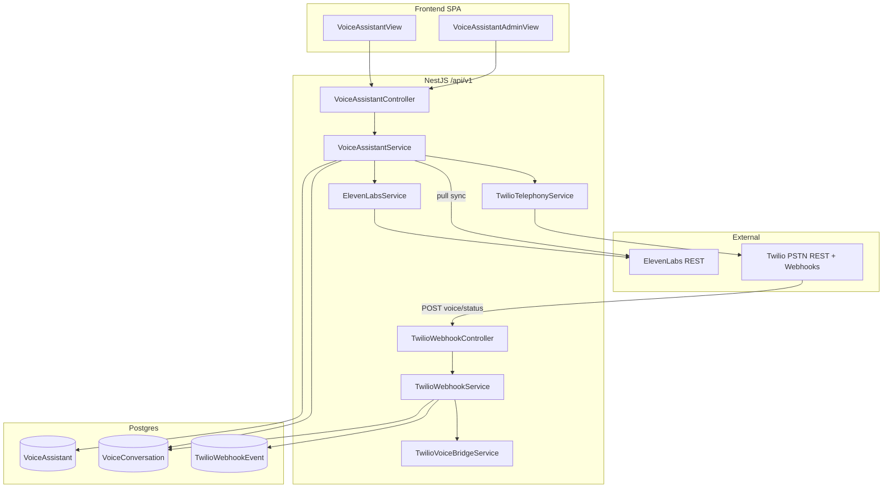

# PHASE 0 — Voice AI Runtime Baseline (Read-Only)

**Scope:** SynqDrive „KI-Sprachassistent“ — Repo, VPS, Env, Twilio, ElevenLabs, Security, UI  
**Methodik:** Keine Datei-, DB-, Deploy- oder Provider-Änderungen. Secrets/Values nicht ausgegeben.  
**Prompt:** 0A von 22  
**Datum:** 2026-07-17  
**Repo-Commit zum Audit-Zeitpunkt:** `c9b3d7c6` (`main` = `origin/main` = VPS)

---

## A. Executive Summary

**CONFIRMED:** SynqDrive hat eine **breit implementierte Voice-Assistant-Plattform** (Backend-Module, Prisma-Modelle, Rental-UI, Master-Admin, Twilio-Webhooks, ElevenLabs-Integration), die auf **Production deployed** ist und mit **Repo = VPS = `origin/main`** (`c9b3d7c6`) übereinstimmt.

**CONFIRMED:** Der **operative Live-Pfad ist noch kein vollständiger KI-Sprachassistent**. Twilio-Telefonie endet aktuell in **TwiML `<Say>`** (Begrüßung + optional Weiterleitung), **ohne** Live-Brücke zum ElevenLabs-Agenten. Outbound-Twilio-Calls starten **keinen** ElevenLabs-Agenten.

**CONFIRMED:** Provider-Accounts sind verbunden, aber **ohne produktive Ressourcen**: Twilio **0 Nummern**, ElevenLabs **0 Agents / 0 importierte Nummern**. Production-DB: **1 Assistant (DRAFT)**, **0 Conversations**, **0 aktive Agents**.

**CONFIRMED:** Billing-Addon `VOICE_AGENT` existiert im Billing-Domain, wird aber **nicht** an Voice-Routen durchgesetzt. Cost-/Usage-Ledger ist **explizit stubbed** (`costTrackingConnected: false`).

**LIKELY:** Das Zielbild „PSTN → Twilio → ElevenLabs Conversational AI → tenant-sichere Tools/MCP“ ist **architektonisch vorbereitet**, aber **runtime-seitig unvollständig** (Bridge-Kommentar im Code, Placeholder-UI, kein MCP-Gateway, keine Voice-Queues).

---

## B. Repo-Commit und Deployment-Abgleich

| Prüfpunkt | Status | Evidenz |
|-----------|--------|---------|
| Lokaler Branch | **CONFIRMED** `main` | `git branch` |
| Lokaler Commit | **CONFIRMED** `c9b3d7c6` — `fix(ops): trim whitespace from SSH user/host in Twilio env sync` | `git log -1` |
| `origin/main` | **CONFIRMED** identisch `c9b3d7c6` | `git rev-parse origin/main` |
| Dirty State | **CONFIRMED** clean | `git status --short` leer |
| VPS deployed Commit | **CONFIRMED** identisch `c9b3d7c6` | VPS `git -C /opt/synqdrive/current rev-parse HEAD` |
| VPS Release | **CONFIRMED** `/opt/synqdrive/releases/20260717181230_v4994` | VPS `readlink -f /opt/synqdrive/current` |
| Package Manager | **CONFIRMED** npm (`package-lock.json`, `npm ci` in Deploy-Skript) | `backend/package.json`, `vps-deploy-release.sh:46` |
| Node.js lokal | **CONFIRMED** v22.14.0 | `node -v` |
| Node.js VPS | **CONFIRMED** v22.23.1 | VPS `node -v` |
| Workspaces | **CONFIRMED** getrennte `backend/` + `frontend/` (kein npm-Workspaces-Monorepo) | `AGENTS.md`, `package.json` |

---

## C. Aktuelle Architektur

### Schichtenmodell (CONFIRMED)

| Schicht | Verantwortung | Dateien |
|---------|---------------|---------|
| AI Agent | ElevenLabs ConvAI (Provision, Test-URL, Sync) | `elevenlabs.service.ts` |
| PSTN | Twilio Nummern, Webhooks, Outbound | `twilio-telephony.service.ts`, `twilio-webhook.*` |
| Bridge | TwiML aus Assistant-Persona | `twilio-voice-twiml.util.ts`, `twilio-voice-bridge.service.ts` |
| Orchestrierung | Org-scoped Lifecycle | `voice-assistant.service.ts` |
| UI | Setup, Wizard, Test, Analytics | `VoiceAssistantView.tsx`, `voice-assistant/*` |

### Wichtige Architektur-Lücke (CONFIRMED)

Inbound/Outbound Twilio spielen **statisches TwiML `<Say>`**, kein ElevenLabs-Stream/SIP:

- `backend/src/modules/twilio/twilio-voice-twiml.util.ts:16-19` — Kommentar „until SIP/stream bridge is enabled“
- `backend/src/modules/twilio/twilio-telephony.service.ts:117-123` — Outbound `calls.create` mit inline `<Say>` TwiML

---

## D. Funktionsmatrix: real / teilweise / placeholder / nicht vorhanden

| Funktion | Status | Marker |
|----------|--------|--------|
| Org Voice Assistant CRUD | **real** | `voice-assistant.controller.ts:19-37` |
| Activation Readiness Gate | **real** | `voice-assistant.service.ts:123-133`, `954-1014` |
| ElevenLabs Agent Provision | **real** (API) | `activateAssistant` `139-146` |
| ElevenLabs Test Session (signed URL) | **real** | `getTestSession` `223-238` |
| Conversation Sync (pull) | **real** | `syncConversations` `349-448` |
| Analytics/KPIs aus DB | **real** | `getConversationAnalytics` `271-347` |
| Tool Permissions Matrix | **teilweise** (Prompt-Policy, keine Runtime-Tools) | `voice-assistant-permissions.ts` |
| ElevenLabs PSTN Assign | **real** (API-Pfad) | `assignElevenLabsPhoneNumber` `465-504` |
| Twilio PSTN Assign + Webhook Config | **real** (API-Pfad) | `assignTwilioPhoneNumber` `506-542` |
| Twilio Inbound Webhook | **teilweise** (TwiML Say, kein AI) | `twilio-webhook.service.ts:38-70` |
| Twilio Outbound Call | **teilweise** (Say only) | `initiateTwilioOutboundCall` `679-726` |
| PSTN → ElevenLabs Live Bridge | **placeholder** | `twilio-voice-twiml.util.ts:16-19` |
| ElevenLabs Webhooks | **nicht vorhanden** | kein Controller/Route |
| Voice MCP Gateway | **nicht vorhanden** | kein `mcp` in `backend/src` |
| Voice Event Queue/Worker | **nicht vorhanden** | kein Voice in `workers/queues` |
| Usage/Cost Ledger | **placeholder** | `costTrackingConnected: false` `847-848` |
| Billing Entitlement Enforcement | **nicht vorhanden** (nur Billing-Domain) | `entitlement-resolver.service.ts:20` |
| Knowledge Health Tab | **placeholder** | `VoiceAssistantView.tsx:544-554` |
| Live Test Transcript UI | **placeholder** | `VoiceTestCenter.tsx` |
| Master Admin Overview/Sync | **real** | `VoiceAssistantAdminController` `112-131` |
| E2E Voice Tests | **nicht vorhanden** | kein `e2e/*voice*` |

---

## E. Twilio-Zustand

**Audit via Read-only SDK** (Twilio MCP = nur Docs, keine Account-Tools — **NOT PRESENT** für Live-Audit)

| Prüfpunkt | Ergebnis | Marker |
|-----------|----------|--------|
| Account erreichbar | **CONFIRMED** active, friendlyName „Disponent“ | API fetch |
| Account-Typ | **CONFIRMED** `Trial` | API `type` |
| Account SID (maskiert) | **CONFIRMED** `****d483` | API |
| API Key SID (maskiert) | **CONFIRMED** `****d25e`, Name „Synqdrive test“ | API |
| Region/Edge | **CONFIRMED** `ie1` / `dublin` | Env + Client-Config |
| IE1/Dublin korrekt gepaart | **CONFIRMED** | `twilio.config.ts:3-6`, `twilio-client.util.ts:23-24` |
| Parent vs. Subaccount | **LIKELY** Parent/Trial-Account; `accounts.list` lieferte 1 Eintrag (gleiche SID-Suffixe) — kein Multi-Tenant-Subaccount-Modell | API |
| Telefonnummern | **CONFIRMED** `0` | API |
| Voice URLs / Status Callbacks | **NOT PRESENT** (keine Nummern) | API |
| SIP Domains | **CONFIRMED** `0` | API |
| Subaccounts je Organisation | **NOT PRESENT** | Code nutzt globalen Account |
| Webhook-Endpunkte deployed | **CONFIRMED** | PM2-Logs: Routes mapped |
| Webhook-Signatur Production | **CONFIRMED** aktiv (`TWILIO_AUTH_TOKEN` auf VPS) | VPS env + Signatur-Test |
| Unsigned Probe → 401 | **CONFIRMED** erwartetes Verhalten | Reachability + Logs |
| Signed Probe → 200 | **CONFIRMED** | Signatur-Test |

**Regionale Inkompatibilität:** **CONFIRMED** Balance-Endpoint in IE1 nicht unterstützt (`Endpoint is not supported in realm 'ie1'`) — für Voice nicht kritisch.

---

## F. ElevenLabs-Zustand

**ElevenLabs MCP:** **NOT VERIFIED** — Server-Status `error` bei Tool-Discovery.  
**Stattdessen:** Read-only REST-Audit mit vorhandenem API Key (keine Werte ausgegeben).

| Prüfpunkt | Ergebnis | Marker |
|-----------|----------|--------|
| Workspace/API erreichbar | **CONFIRMED** HTTP 200 `/user` | REST |
| Subscription | **CONFIRMED** `free` | REST |
| Voice Agents | **CONFIRMED** `0` | REST `/convai/agents` |
| Importierte Telefonnummern | **CONFIRMED** `0` | REST `/convai/phone-numbers` |
| Stimmen verfügbar | **CONFIRMED** `21` | REST `/voices` |
| Twilio-Verknüpfungen in EL | **NOT PRESENT** | 0 phones |
| Post-Call-Webhooks in SynqDrive | **NOT PRESENT** | kein EL-Webhook-Endpoint |
| Agent Deployments/Versionen | **NOT VERIFIED** | 0 Agents |
| Conversations | **NOT PRESENT** live | 0 Agents + Prod DB 0 rows |

**Backend-Integration (CONFIRMED):** `ElevenLabsService` — REST-only, Base URL hardcoded `https://api.elevenlabs.io/v1` (`elevenlabs.service.ts:44`), Config nur `ELEVENLABS_API_KEY` (`47-48`).

---

## G. Datenmodell

### Prisma-Modelle (CONFIRMED)

| Modell | Zeilen | Zweck |
|--------|--------|-------|
| `VoiceAssistant` | `10113-10194` | 1:1 pro Org, PSTN, Permissions, Counters |
| `VoiceConversation` | `10196-10231` | Calls, Transcript, Twilio/ElevenLabs IDs |
| `TwilioWebhookEvent` | `10233-10252` | Idempotente Webhook-Audit |

### Enums (CONFIRMED)

`VoiceAssistantStatus`, `VoicePstnProvider` (`ELEVENLABS`/`TWILIO`), `VoiceConnectionStatus`, `VoiceConversationDirection/Status/Outcome` — `schema.prisma:10077-10111`

### Migrationen (CONFIRMED)

| Migration | Inhalt |
|-----------|--------|
| `20260620160000_voice_assistant_module` | Basis-Modul |
| `20260620180000_voice_assistant_tool_permissions` | Tool permissions JSON |
| `20260717190000_twilio_voice_telephony` | PSTN provider, `twilio_call_sid`, `twilio_webhook_events` |

### Production-DB Snapshot (CONFIRMED, VPS read-only)

| Metrik | Wert |
|--------|------|
| `voice_assistants` | 1 |
| ACTIVE | 0 |
| `voice_conversations` | 0 |
| `twilio_webhook_events` | 2 (Reachability-Probes) |
| `pstn_provider` | 1× `ELEVENLABS`, DRAFT, kein Agent, keine Nummer |

---

## H. Tenant-Isolation

| Frage | Antwort | Marker |
|-------|---------|--------|
| Org-Scoping auf Tenant-Routen | **CONFIRMED** `OrgScopingGuard` | `voice-assistant.controller.ts:15` |
| Conversations org-scoped | **CONFIRMED** `buildConversationWhere(organizationId)` | `listConversations` `246-260` |
| Twilio Inbound Routing | **CONFIRMED** per `To`-Nummer → `VoiceAssistant` | `resolveAssistantByToNumber` `139-151` |
| Kann Org A Nummern von Org B sehen? | **CONFIRMED JA (Liste)** — `buildPhoneNumberList` lädt **alle** Twilio/ElevenLabs-Kontonummern | `1070-1090` |
| Kann Org A Nummer von Org B zuweisen? | **LIKELY NEIN** solange nicht bereits anderer Assistant dieselbe Nummer hält; aber **kein DB-Lock** auf Nummern-Ebene | `assignTwilioPhoneNumber` `520-524` |
| Twilio `assignedToOther` für Twilio-Nummern | **CONFIRMED fehlerhaft/unvollständig** — immer `false` | `mapTwilioProviderPhoneNumbers` `220` |
| Twilio Subaccount je Org | **NOT PRESENT** | globaler Account |
| Master Admin Transcript-Schutz | **CONFIRMED** strip in Admin Detail | `stripConversationForAdmin` |

---

## I. Security

| Thema | Status | Evidenz |
|-------|--------|---------|
| JWT auf Tenant-Routen | **CONFIRMED** | global `AuthGuard` |
| Twilio Webhooks öffentlich, whitelisted | **CONFIRMED** | `auth.guard.ts:22-23` |
| Webhook-Signatur HMAC | **CONFIRMED** in Production | `assertSignatureValid` `110-136` |
| Signatur hinter Nginx/Proxy | **CONFIRMED** `x-forwarded-proto` + `host` | `twilio-webhook.controller.ts:59-66` |
| API Keys nicht im Frontend | **CONFIRMED** | server-only services |
| Caller-Nummern maskiert | **CONFIRMED** | `maskCallerNumber` `voice-conversation.util.ts:22-29` |
| Tool-Aufrufe tenant-sicher | **NOT PRESENT** — nur Prompt-Text, keine Runtime-Execution | `buildPermissionsPromptSection` |
| Voice-Berechtigungen serverseitig (HTTP) | **CONFIRMED** Org + Role; **NOT PRESENT** feingranulare Voice-Permissions pro User | `RolesGuard` ohne per-route Permission |
| Billing-Entitlement Gate | **NOT PRESENT** auf Voice-Routen | grep `addon.voice_agent` nur Billing |
| Retry / DLQ / Replay | **teilweise** — Webhook-Idempotenz via `TwilioWebhookEvent.externalEventId` unique; **kein** DLQ/Replay-Endpoint | migration `29`, webhook service `279-285` |
| Voice webhook Fehler → 200 Fallback | **CONFIRMED** (verhindert Twilio-Retry) | `twilio-webhook.controller.ts:35-44` |

---

## J. UI-/UX-Bewertung (statisch, Code-basiert)

| Bereich | Bewertung | Marker |
|---------|-----------|--------|
| First-Time Experience | **gut strukturiert** — Overview, Launch Checklist, Readiness-Bar | `VoiceLaunchChecklist`, `VoiceCommandHeader` |
| Informationsarchitektur | **gut** — 9 Tabs in 3 Gruppen (Setup/Operate/Improve) | `voice-assistant.ops.ts` NAV_GROUPS |
| Aktivierungsfluss | **real** — Readiness-gated Activate | `VoiceAssistantView` + Backend |
| Leere Zustände | **vorhanden** in Analytics, Conversations, Test, Knowledge | mehrere `EmptyState` |
| Loading/Error | **vorhanden** | `VoiceAssistantView.tsx:288-314`, `345-351` |
| Telephony Wizard | **real UI**, 6 Schritte | `VoiceTelephonyWizard.tsx:81-452` |
| Test Center | **teilweise** — Session startet, Transcript/Tool-Panels Placeholder | README + `getTestSession` instructions `233-234` |
| Analytics | **real** bei Daten, sonst Empty + Sync CTA | `VoiceAnalyticsView.tsx` |
| Permissions Matrix | **real UI** mit Autonomous-Guards | `VoicePermissionsMatrix.tsx` |
| Knowledge Tab | **placeholder** | `VoiceAssistantView.tsx:544-554` |
| Mobile | **responsive** mit horizontal scroll bei Matrix | Tailwind `sm/md/lg/xl` patterns |
| i18n DE/EN | **NOT PRESENT** (fast alles EN hardcoded); nur `nav.aiVoiceAssistant` übersetzt | `de.ts:26`, `en.ts:24` |
| Accessibility | **LIKELY** basisch (Radix/shadcn), keine dedizierten Voice-a11y-Tests | **NOT VERIFIED** |
| Technische Begriffe | **teilweise** — Operator-Sprache („PSTN“, „signed URL“ in Dev-Details) | Test Center |

**Browser-Test:** **NOT VERIFIED** in diesem Prompt (kein sicherer read-only Login-Kontext dokumentiert).

---

## K. Master-Admin-Bewertung

| Funktion | Status | Marker |
|----------|--------|--------|
| Overview aller Orgs | **CONFIRMED** | `getAdminOverview` `743-852` |
| Detail-Drawer pro Org | **CONFIRMED** | `getAdminOrgDetail` `862-911` |
| Admin Sync | **CONFIRMED** | `adminSyncOrganization` `854-860` |
| Readiness % / Warnings | **CONFIRMED** | `voice-assistant-admin.util.ts` |
| Cost Tracking | **placeholder** | `costTrackingConnected: false` `847-848` |
| Transcript-Schutz | **CONFIRMED** | Admin strip |
| Provisionierung (Nummer kaufen, Agent erstellen) | **NOT PRESENT** in Admin UI | nur Monitoring/Sync |

---

## L. Billing-/Usage-Bewertung

| Thema | Status | Marker |
|-------|--------|--------|
| Addon `VOICE_AGENT` im Billing-Katalog | **CONFIRMED** | `billing-domain.types.ts:19` |
| Entitlement `addon.voice_agent` | **CONFIRMED** definiert | `entitlement-resolver.service.ts:20` |
| Enforcement auf Voice-API | **NOT PRESENT** | kein Guard in VoiceAssistantModule |
| In-Modul Usage Counter | **CONFIRMED** `totalCalls`, `totalTalkMinutes`, etc. | `VoiceAssistant` schema `10178-10183` |
| Minutenlimits / Plan-Limits | **NOT PRESENT** | — |
| Cost Ledger / Provider Costs | **NOT PRESENT** (expliziter Stub) | `847-848`, Admin detail `882-885` |

---

## M. Test- und Observability-Stand

| Bereich | Status | Marker |
|---------|--------|--------|
| Backend Unit Tests Voice/Twilio | **CONFIRMED** 8 Suites, 35 Tests, alle grün | `npm test --testPathPattern=voice-assistant\|twilio` |
| Test-Typ | **CONFIRMED** Mock-basiert | `.spec.ts` Dateien |
| Frontend Voice Tests | **NOT PRESENT** | — |
| Playwright E2E Voice | **NOT PRESENT** | — |
| Staging E2E Voice | **NOT PRESENT** | — |
| PM2 Prozess | **CONFIRMED** `synqdrive` online | VPS |
| Separate Voice Worker | **NOT PRESENT** | nur `synqdrive` + `pm2-logrotate` |
| Redis für Voice | **NOT PRESENT** (Redis allgemein auf VPS vorhanden) | VPS `REDIS_HOST` etc., kein Voice-Queue |
| Voice-spezifische Logs 24h | **CONFIRMED** minimal — Module init, Route mapping, 1× invalid signature warn | PM2 grep |
| Ops-Skripte | **CONFIRMED** `twilio-webhook-reachability.sh`, `sync-twilio-env-to-vps.sh` | `backend/scripts/ops/` |
| Architektur-Doku in UI | **CONFIRMED** ArchitekturView Twilio V4.9.583/584 | `ArchitekturView.tsx:773-793` |
| Changes-Doku | **CONFIRMED** Twilio-Einträge | `ChangesView.tsx:38-101` |

---

## N. Abweichungen vom SynqDrive-Zielbild

1. **CONFIRMED:** Kein Live-PSTN→ElevenLabs-Agent-Bridge — nur TwiML Say/Dial.
2. **CONFIRMED:** Kein SynqDrive-MCP-Gateway für tenant-sichere Tool-Ausführung.
3. **CONFIRMED:** Tool Permissions sind Prompt-Policy, nicht durchsetzbare Runtime-Actions.
4. **CONFIRMED:** Kein Event-getriebener Conversation-Lifecycle (nur Pull-Sync + synchrone Webhooks).
5. **CONFIRMED:** Billing-Addon existiert, Feature-Gate fehlt.
6. **CONFIRMED:** Cost/Usage-Ledger fehlt.
7. **CONFIRMED:** Kein Multi-Tenant-Twilio-Subaccount-Modell; globale Nummernliste für alle Orgs.
8. **LIKELY:** Production noch nicht „live-ready“ — 0 Agents, 0 Nummern, 1 DRAFT-Assistant.
9. **CONFIRMED:** UI teils Placeholder (Knowledge, Live Transcript, Test Verdicts lokal only).
10. **CONFIRMED:** i18n unvollständig (DE nur Navigation).

---

## O. Findings nach Priorität

### P0 — Blocker für produktiven KI-Sprachassistenten

| # | Finding | Marker |
|---|---------|--------|
| P0-1 | **Keine PSTN→ElevenLabs Live-Bridge** — Anrufe enden in `<Say>`, nicht im Agent | CONFIRMED |
| P0-2 | **Keine produktiven Provider-Ressourcen** (0 Twilio-Nummern, 0 EL-Agents) | CONFIRMED |
| P0-3 | **Outbound Twilio startet keinen ElevenLabs-Agenten** | CONFIRMED |

### P1 — Sicherheit / Multi-Tenant / Betrieb

| # | Finding | Marker |
|---|---------|--------|
| P1-1 | **Globale Telefonnummern-Liste** für alle Orgs sichtbar | CONFIRMED |
| P1-2 | **Twilio `assignedToOther` nicht implementiert** | CONFIRMED |
| P1-3 | **Kein Billing-Entitlement-Enforcement** trotz `VOICE_AGENT` Addon | CONFIRMED |
| P1-4 | **Kein per-Org Twilio Subaccount** | CONFIRMED |
| P1-5 | **Conversation Sync ohne per-item error isolation** — ein Fehler kann ganzen Sync abbrechen | LIKELY (`syncConversations` loop) |

### P2 — Produktreife / UX / Observability

| # | Finding | Marker |
|---|---------|--------|
| P2-1 | Knowledge Tab Placeholder | CONFIRMED |
| P2-2 | Test Center: kein Live-Transcript, Verdicts nicht persistiert | CONFIRMED |
| P2-3 | Cost Tracking Master Admin stubbed | CONFIRMED |
| P2-4 | i18n fast nur EN | CONFIRMED |
| P2-5 | Keine E2E-Tests | CONFIRMED |
| P2-6 | ElevenLabs MCP in Cloud Agent defekt | CONFIRMED |

### P3 — Nice-to-have / Dokumentation

| # | Finding | Marker |
|---|---------|--------|
| P3-1 | `view.aiVoiceAssistant` i18n Key ungenutzt | CONFIRMED |
| P3-2 | `ELEVENLABS_BASE_URL` nicht in `.env.example` | CONFIRMED |
| P3-3 | ArchitekturView Zeile 793 „Twilio flows deferred“ teils veraltet vs. V4.9.584 | LIKELY |
| P3-4 | Node-Version lokal/VPS leicht unterschiedlich (22.14 vs 22.23) | CONFIRMED |

---

## P. Exakte Evidenz (Auswahl kritischer Pfade)

### Repository-Kern

- Module: `backend/src/modules/voice-assistant/voice-assistant.module.ts:1-15`
- Tenant Controller: `voice-assistant.controller.ts:14-110`
- Admin Controller: `voice-assistant.controller.ts:112-131`
- Activation: `voice-assistant.service.ts:123-171`
- Readiness: `voice-assistant.service.ts:954-1014`
- Sync: `voice-assistant.service.ts:349-448`
- Outbound: `voice-assistant.service.ts:679-726`
- Phone list (global): `voice-assistant.service.ts:1070-1090`
- Cost stub: `voice-assistant.service.ts:847-848`

### Twilio

- Webhook Controller: `twilio-webhook.controller.ts:14-57`
- Signature check: `twilio-webhook.service.ts:110-136`
- Inbound TwiML: `twilio-voice-twiml.util.ts:3-30`
- Outbound Say: `twilio-telephony.service.ts:102-130`
- Config IE1/Dublin: `twilio.config.ts:3-18`

### ElevenLabs

- API Key only: `elevenlabs.service.ts:44-52`
- Agent create: `elevenlabs.service.ts:128-165`
- Test URL: `elevenlabs.service.ts:195-213`

### Frontend

- Main View: `VoiceAssistantView.tsx:43-97` (load), `288-314` (states)
- API Client: `frontend/src/lib/api.ts:5552-5616`
- Knowledge placeholder: `VoiceAssistantView.tsx:544-554`
- Master Admin: `VoiceAssistantAdminView.tsx:70-96`

### Security / Auth

- Webhook whitelist: `auth.guard.ts:22-23`
- Caller mask: `voice-conversation.util.ts:22-29`

### Tests

- 8 Suites / 35 Tests: Jest run output

---

## Q. Empfohlene Voraussetzungen für Prompt 0B

1. **CONFIRMED — Entscheidung Bridge-Architektur:** ElevenLabs SIP/Stream vs. Twilio ConversationRelay vs. native EL-Telefonie — aktueller Code ist explizit „until SIP/stream bridge is enabled“.
2. **CONFIRMED — Provider-Ressourcen-Plan:** Mindestens 1 Twilio-Nummer + 1 ElevenLabs-Agent für Staging-E2E (ohne sie bleibt alles theoretisch).
3. **CONFIRMED — Tenant-Telefonie-Modell klären:** Global account vs. Subaccount-per-Org; heute global mit Cross-Org-Nummernliste.
4. **CONFIRMED — Billing-Gate definieren:** Soll `addon.voice_agent` Voice-Routen blockieren?
5. **CONFIRMED — Conversation Source of Truth:** Dual path (Twilio status + ElevenLabs pull) — Merge-Regeln für finalen Status festlegen.
6. **LIKELY — ElevenLabs MCP reparieren** oder REST-only in 0B fortsetzen.
7. **CONFIRMED — UI-Scope:** Knowledge/Transcript/Cost — implementieren oder aus MVP streichen.
8. **CONFIRMED — i18n-Scope:** DE/EN für Operator-UI oder bewusst EN-only belassen.

---

## Environment-Konfiguration (nur Vorhandensein)

| Variable | Cloud Agent | VPS | `.env.example` | Bewertung |
|----------|-------------|-----|----------------|-----------|
| `ELEVENLABS_API_KEY` | present | present | present | OK |
| `ELEVENLABS_BASE_URL` | missing | missing | **NOT PRESENT** | Default hardcoded in Code |
| `ELEVENLABS_WEBHOOK_SECRET` | missing | missing | **NOT PRESENT** | Kein EL-Webhook-Endpoint |
| `TWILIO_ACCOUNT_SID` | present | present | present | OK |
| `TWILIO_API_KEY_SID` | present | present | present | OK |
| `TWILIO_API_KEY_SECRET` | present | present | present | OK |
| `TWILIO_REGION` | present | present | present (`ie1`) | OK |
| `TWILIO_EDGE` | present | present | present (`dublin`) | OK |
| `TWILIO_AUTH_TOKEN` | present | present | present | OK |
| `TWILIO_VOICE_WEBHOOK_BASE_URL` | present | present | present | OK |
| `APP_URL` | missing | present | present | Cloud Agent ohne lokalen Wert |
| `REDIS_URL` | missing | missing | **NOT PRESENT** | VPS nutzt `REDIS_HOST`/`PORT`/… |
| Voice MCP / Gateway URLs | missing | missing | **NOT PRESENT** | Kein Runtime-Gateway |

---

## Funktions- und Sicherheitsfragen (Kurz)

| Frage | Antwort |
|-------|---------|
| Startet Outbound-Call einen EL-Agenten? | **NEIN** — nur Twilio `<Say>` (**CONFIRMED**) |
| Inbound zu ElevenLabs? | **NEIN** — TwiML Say + optional Dial (**CONFIRMED**) |
| Twilio-Say-Testpfad produktiv? | **JA** — Webhooks deployed, signiert erreichbar (**CONFIRMED**) |
| Org sieht fremde Nummern? | **JA in Liste** (**CONFIRMED**) |
| Twilio-Subaccount je Org? | **NEIN** (**CONFIRMED**) |
| Voice-Berechtigungen serverseitig? | **Org-Scope ja; Tool-Permissions nur Prompt** (**CONFIRMED**) |
| SynqDrive-MCP-Gateway? | **NEIN** (**CONFIRMED**) |
| Tool-Aufrufe tenant-sicher? | **NEIN** — keine Runtime-Tools (**CONFIRMED**) |
| Event-Korrelation? | `VoiceConversation` + `twilioCallSid` / `providerConversationId` (**CONFIRMED**) |
| Finaler Conversation Status? | Twilio Status-Callback **oder** ElevenLabs Sync — kein Unified Resolver (**CONFIRMED**) |
| Usage/Cost Ledger? | **NEIN** (**CONFIRMED**) |
| Minutenlimits? | **NEIN** (**CONFIRMED**) |
| Master Admin Kontrolle? | **Monitoring/Sync ja; Cost/Provisionierung nein** (**CONFIRMED**) |
| Webhook-Signatur hinter Proxy? | **JA** mit gültiger Signatur (**CONFIRMED**) |
| Retry/DLQ/Replay? | **Idempotenz ja; DLQ/Replay nein** (**CONFIRMED**) |
| Tests real/E2E? | **Nur Mocks** (**CONFIRMED**) |

---

## Relevante Dateien (Index)

### Backend

- `backend/src/modules/voice-assistant/` — Module, Service, Controller, DTOs, Permissions, Utils
- `backend/src/modules/twilio/` — TwilioModule, Webhooks, Telephony, Bridge, TwiML
- `backend/src/config/twilio.config.ts`, `twilio-client.util.ts`
- `backend/docs/twilio-setup.md`
- `backend/prisma/migrations/20260620160000_voice_assistant_module/`
- `backend/prisma/migrations/20260620180000_voice_assistant_tool_permissions/`
- `backend/prisma/migrations/20260717190000_twilio_voice_telephony/`

### Frontend

- `frontend/src/rental/components/VoiceAssistantView.tsx`
- `frontend/src/rental/components/voice-assistant/*`
- `frontend/src/master/components/VoiceAssistantAdminView.tsx`
- `frontend/src/lib/api.ts` (voiceAssistant API block)

### Ops

- `backend/scripts/ops/sync-twilio-env-to-vps.sh`
- `backend/scripts/ops/twilio-webhook-reachability.sh`
