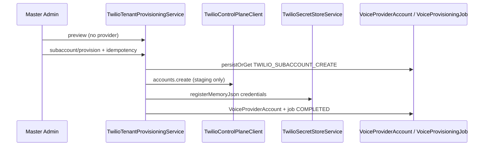

# Voice AI — Twilio Tenant Provisioning Workflow (2026-07-17)

| Field | Value |
|-------|-------|
| **Status** | **IMPLEMENTED (Prompt 4A)** |
| **Date** | 2026-07-17 |
| **ADR** | `architecture/VOICE_AI_PRODUCTION_ARCHITECTURE_ADR_2026-07-17.md` §4.3, §4.8, Phase 2 |

---

## 1. Purpose

Idempotent Twilio subaccount and phone-number provisioning control plane for a single SynqDrive organization. Master-admin only; no parent-account access for org admins.

---

## 2. Master-admin API

Base path: `POST|GET /api/v1/admin/voice-assistant/organizations/:orgId/twilio/*`

| Endpoint | Mutating | Description |
|----------|----------|-------------|
| `POST provisioning/preview` | No | Prerequisites, regulatory snapshot, expected steps |
| `POST subaccount/provision` | Yes* | One subaccount per org via idempotent job |
| `POST credentials/register` | Yes* | Runtime credential registration / rotation prep |
| `POST phone-numbers/search` | No** | DE local/mobile search (TTL cache, masked results) |
| `POST phone-numbers/purchase` | Yes* | Explicit purchase with idempotency + regulatory gate |
| `GET regulatory-status` | No | Bundle / address / end-user compliance view |

\* Requires `confirm=true`, `idempotency-key` header, `VOICE_AI_SUBACCOUNTS=true`, and `VOICE_AI_PROVISIONING_STAGING_ENABLED=true` for live provider calls.  
\** Returns empty results when staging flag is off; never persists global inventory.

---

## 3. Safety gates

| Gate | Behavior |
|------|----------|
| `VOICE_AI_SUBACCOUNTS` | Blocks all mutating provisioning when `false` (default) |
| `VOICE_AI_PROVISIONING_STAGING_ENABLED` | Blocks live Twilio API mutations; enables dry-run semantics |
| `confirm=true` | Required on destructive / cost-incurring actions |
| `idempotency-key` | Required; dedupes jobs and phone purchases per org |
| Trial / no active `VoiceSubscription` | Purchase blocked; preview warns |
| Regulatory `PENDING` / `IN_REVIEW` / `REJECTED` | Purchase blocked |

---

## 4. Data flow

- Parent Twilio client used **only** for subaccount create + subaccount API key.
- Tenant `TwilioTenantClientFactory` used for number search/purchase inside org subaccount.
- Secrets stored as `secretRef` only (`env-json://` + in-memory staging store).

---

## 5. Schema additions

Migration `20260717230000_voice_phone_regulatory_in_review`:

- `VoicePhoneRegulatoryStatus.IN_REVIEW`
- `VoicePhoneNumber.regulatoryDetails` JSON (bundle/address/end-user — no document payloads)

---

## 6. Module wiring

- `TwilioModule`: `TwilioTenantProvisioningController`, `TwilioTenantProvisioningService`, provider client, secret store
- Reuses control-plane repositories: `VoiceSubscriptionRepository`, `VoicePhoneNumberRepository`, `VoiceProvisioningJobRepository`
- Cost actions audited via `AuditService` (`ADMIN_OVERRIDE`, `CRITICAL`)

---

## 7. Non-goals (this prompt)

- No automatic provisioning in CI/tests
- No ElevenLabs number import
- No tenant-facing provisioning routes
- Legacy `VoiceAssistant` telephony columns unchanged
