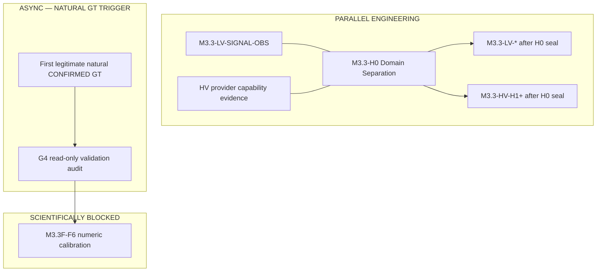

# Battery Intelligence — domain architecture (LV / HV / Shared Core)

**Status:** **M3.3-H0 SEAL PASS** (2026-09-30 audit) · post-G4 roadmap  
**Repository:** `origin/main` @ **`312d9f54a2b4c0b0740061d3e2b74897e78eacb0`** (H0 baseline; see audit for drift)  
**Production:** release **`20260929224455_v4994`** @ **`1dd4224037a84417c5d605575bb6d288ac93184e`**

This document is the **top-level navigation layer** for Battery Intelligence. Historical stage letters **M3.3A–G** remain unchanged. Forward domain work is sealed under **`M3.3-H0`**, then continues as **`M3.3-LV-*`** / **`M3.3-HV-*`**. Do **not** confuse **`M3.3-H0`** (domain separation) with historical/planned **M3.3H** (customer Battery Health UI).

---

## 1. Product requirement (non-negotiable)

SynqDrive Battery Intelligence is **two scientific domains** plus shared infrastructure:

```
Battery Intelligence
├── Shared Core (scope, GT, provenance, tenant isolation)
├── LV Battery Intelligence (12 V / ICE+HEV auxiliary)
└── HV Battery Intelligence (traction pack / EV·PHEV)
```

**Rules:**

- Do **not** treat LV rest-session degradation models as HV traction models.
- Do **not** pool LV longitudinal D3/F5 cohort science with HV without an explicit HV pipeline authority.
- **Ground Truth** is shared persistence with **`battery_scope` = LV | HV** on each fact.
- A **CONFIRMED** GT row is authoritative **input/evidence** (`CONFIRMED_GROUND_TRUTH_FACT`). It is **not** `GROUND_TRUTH_VALIDATED` maturity for derived Battery Intelligence.

**Pipeline scope (unchanged):**

| Pipeline | Scope |
|----------|-------|
| D3 longitudinal materialization | **LV_ONLY** |
| F5 natural calibration + G3 LV GT correlation | **LV_ONLY** |
| E2 / E3 longitudinal health model | **LV_ONLY** |
| HV degradation | **Does not reuse LV logic** |

---

## 2. Shared Core (existing)

| Component | Scope | Maturity |
|-----------|-------|----------|
| `BatteryEvidenceScope` (LV/HV) | SHARED | PRODUCTION |
| `BatteryEvidence` / `BatteryMeasurement` / sessions | SHARED schema; scoped rows | PRODUCTION |
| `BatteryGroundTruthEvent` + revocations (G1–G2.2) | SHARED | PRODUCTION_DEPLOYED @ `1dd422403` |
| GT admission / fingerprint / supersession / historical `asOf` (G3.1) | SHARED | MERGED · CI_VALIDATED · PRODUCTION_VERIFIED (infra) |
| Service-event + document provenance | SHARED | PRODUCTION |
| Org/vehicle tenant isolation | SHARED | PRODUCTION |
| AI Upload → confirm → apply (no auto-GT) | SHARED | PRODUCTION |

**Shared Core explicitly includes:** scope, GT persistence/admission, correction/supersession, historical `asOf`, provenance, org/vehicle isolation.

**Not shared (domain-specific inference):**

- LV rest-session longitudinal profile (D1–D3)
- LV F5 natural calibration cohort + GT segmentation (G3)
- LV E2/E3 longitudinal health evaluator (pure; E3 **OFF** runtime)
- HV recharge session merge, HV SOH shadow, HV method profile (separate code paths)

---

## 3. LV Battery Intelligence (current)

### 3.1 Engineering stack (M3.3A → M3.3G)

| Track | Role | Engineering | Production | Scientific validation |
|-------|------|-------------|------------|------------------------|
| **M3.3A/B** | Generalized LV capture, provider gap, rest liveness | COMPLETE | PRODUCTION_ACTIVE (B1, gap) | WAITING_FOR_NATURAL_EVIDENCE (trustworthy REST) |
| **M3.3C** | Rest-session features C1–C5B | COMPLETE | C3 shadow ON | OBSERVATION_RUNNING |
| **M3.3D** | Longitudinal profile D0–D4 | COMPLETE | D3 materialization ON | LONGITUDINAL_EVIDENCE (shadow) |
| **M3.3E** | Assessment input E1; health model E2; pure evaluator E3 | COMPLETE | E3 **OFF** | NOT customer-safe |
| **M3.3F** | D3 prod F1–F4.6; F5.0/F5.1; F6 **PLANNED** | F0–F5.1 COMPLETE; **F6 DEFERRED** | D3 ON; F5 read-only CLI | F5 DISTRIBUTIONS_EMERGING; **no F6** |
| **M3.3G** | Ground Truth G0–G3.1.1; G4 collection | COMPLETE (G3); G4 infra | GT schema live; **0 rows** | **G4_STATUS=WAITING_FOR_FIRST_NATURAL_GT** |

Authoritative detail: `CURRENT_STATE.md`, `research/M3_3G_*`, `research/M3_3F_*`.

### 3.2 LV signal inventory (conceptual)

| Signal / feature | Scope | Source | Pipeline | Persisted | Customer | Scientific maturity |
|------------------|-------|--------|----------|-----------|----------|---------------------|
| LIVE_VOLTAGE / resting voltage | LV_ONLY | DIMO / document | Stage-2 REST + generalized evidence | YES | Partial (legacy boxes) | DERIVED_EVIDENCE |
| Rest sessions / shutdown / parked | LV_ONLY | Telemetry + gap FSM | M3.3A/B/C | YES (shadow features) | NO | LONGITUDINAL_EVIDENCE |
| Rest-session feature rows | LV_ONLY | C3 computation | C3 shadow | YES | NO | LONGITUDINAL_EVIDENCE |
| Longitudinal profile revisions | LV_ONLY | D1→D2→D3 | D3 sustained | YES | NO | LONGITUDINAL_EVIDENCE |
| F5 cohort statistics | LV_ONLY | D3 revisions | F5 read-only report | NO (report) | NO | DISTRIBUTIONS_EMERGING |
| GT workshop / replacement facts | LV or HV on row | Human confirm | G2 emission | YES | NO | **CONFIRMED_GROUND_TRUTH_FACT** (when confirmed) |
| F5↔GT correlation report | LV_ONLY | GT + D3 | G3 report V2 | NO | NO | **NOT_EVALUATED** until G4; may become **GROUND_TRUTH_VALIDATED** for *derived* linkage conclusions only after G4 |
| E3 evaluation output | LV_ONLY | Pure policy | F5 offline only | NO | NO | NOT customer-safe |

### 3.3 LV remaining engineering (not blocked by G4)

| Item | Type | Notes |
|------|------|-------|
| **M3.3-H0** (umbrella) | ENGINEERING | Domain separation seal — see §7; subtracks define Shared Core once |
| **M3.3-LV-SIGNAL-OBS** | ENGINEERING | REST observability / hybrid shutdown (M3.2 arch debt); parallel within H0 where safe |
| **M3.3H** (historical UI label) | PLANNED | Customer Battery Health UI — **distinct from M3.3-H0**; not authorized for conclusion-bearing claims |
| **M3.3F-F6** | BLOCKED | Numeric calibration — requires natural GT + G4 + F6 gate |
| **G4 validation re-run** | WAITING_FOR_NATURAL_GT | Read-only; **independent** of H0 completion; **does not block** engineering |

---

## 4. HV Battery Intelligence (current)

### 4.1 What exists today

| Area | Scope | Status |
|------|-------|--------|
| `BatteryEvidence` / measurements (HV SOH, workshop, document) | HV_ONLY | PRODUCTION |
| GT emission (HV scope on facts) | HV via Shared Core | PRODUCTION infra; **no HV F5 correlation** |
| `hv-charge-session/*` + ERD recharge consumption | HV_ONLY | PRODUCTION (transitional host under battery-health) |
| HV method profile / capability resolver | HV_ONLY | PRODUCTION code |
| HV SOH shadow / capacity shadow handlers | HV_ONLY | Flag-gated; **no customer publication** |
| `BATTERY_V2_HV_RECHARGE_SESSION_ENABLED` | HV_ONLY | Present in prod env |
| Longitudinal D3 / F5 / E3 pipeline | **LV_ONLY** | HV explicitly rejected in F5 GT correlation |

### 4.2 HV telemetry (classification — provider audit still required per vehicle)

| Signal | Classification |
|--------|----------------|
| LIVE_HV_SOC, LIVE_HV_RANGE, LIVE_HV_CURRENT_ENERGY, LIVE_HV_CHARGING_POWER | AVAILABLE_NOW (capability registry; provider-dependent per VIN) |
| PROVIDER_HV_SOH / workshop / document SOH | AVAILABLE_NOW (evidence paths) |
| Pack temperature, detailed cell-level degradation | PROVIDER_DEPENDENT / UNKNOWN_NEEDS_PROVIDER_AUDIT |
| HV longitudinal degradation trend (D3-like) | **NOT_AVAILABLE** (no authority) |
| HV F5 calibration cohort | **NOT_AVAILABLE** |
| HV GT → telemetry validation | **NOT_AVAILABLE** (no HV F5 pipeline) |

### 4.3 HV missing foundation

| Gap | Priority |
|-----|----------|
| **M3.3-H0-HV** subtrack | **Coordinated under M3.3-H0** — signals, persistence, ERD vs BI ownership |
| HV longitudinal / health model authority (do **not** clone LV E2 blindly) | After H0 seal → **M3.3-HV-H1** |
| HV F5 or equivalent natural-evidence register | PLANNED after H0-HV |
| HV customer-visible health fields | BLOCKED until maturity gates |

**LV algorithms safe to reuse for HV:** **NO** for degradation/rest-session/longitudinal health. **YES** for Shared Core only (scope, GT admission patterns, provenance types).

---

## 5. Customer-facing target (future — maturity gates)

| Maturity | Meaning |
|----------|---------|
| RAW_TELEMETRY | Live signal only |
| DERIVED_EVIDENCE | Computed, not longitudinal |
| LONGITUDINAL_EVIDENCE | D3/F5-style cohort |
| **CONFIRMED_GROUND_TRUTH_FACT** | Human-confirmed GT row in Shared Core (authoritative fact; **not** model validation) |
| **GROUND_TRUTH_VALIDATED** | **Derived** Battery Intelligence output corroborated against independent GT (e.g. post-G4 F5 linkage conclusions) |
| CALIBRATED | F6-approved thresholds |
| CUSTOMER_SAFE | Publication + legal/product sign-off |

**LV examples (target):** STATE, TREND, RISK, EVIDENCE, LAST_MEASUREMENT, CONFIDENCE — mostly **DERIVED/LONGITUDINAL** today; **not CUSTOMER_SAFE**.

**HV examples (target):** SOC, ESTIMATED_HEALTH, CAPACITY_TREND, CHARGING_BEHAVIOR, THERMAL_EVIDENCE, DEGRADATION_TREND, CONFIDENCE — mix of **RAW_TELEMETRY** and **DERIVED**; **not CUSTOMER_SAFE**.

---

## 6. Dependency graph (what can run in parallel)

G4 is **asynchronous observation**. If the first legitimate natural GT arrives tomorrow, G4 may run **immediately** — no H0 prerequisite.



| Track | G4 blocks? |
|-------|------------|
| LV engineering | **NO** |
| HV engineering | **NO** |
| M3.3-H0 | **NO** |
| F6 | **YES** (needs natural GT / G4 evidence + F6 gate) |
| Customer health claims | **YES** (GT validation path + calibration + E3 policy) |

```
G4_BLOCKS_LV_ENGINEERING=NO
G4_BLOCKS_HV_ENGINEERING=NO
G4_CAN_RUN_IMMEDIATELY_ON_FIRST_NATURAL_GT=YES
```

---

## 7. M3.3-H0 — Battery Intelligence domain separation (umbrella)

**M3.3-H0** is one coordinated seal. Subtracks must **not** independently redefine Shared Core.

| Subtrack | Scope |
|----------|--------|
| **M3.3-H0-SHARED** | Shared evidence/provenance authority; GT authority; temporal semantics; tenant/vehicle isolation; scope contract |
| **M3.3-H0-LV** | Freeze LV producers/consumers; D3/F5/E2/E3 explicitly LV; API/read-model/UI scope contracts |
| **M3.3-H0-HV** | Inventory HV producers/consumers; provider capability matrix; ERD vs Battery Intelligence ownership; persistence map; future HV longitudinal boundary |
| **M3.3-H0-CROSS-SCOPE-SEAL** | No implicit HV consumption of LV D3/F5/E3; no implicit LV consumption of HV health/shadow outputs; Shared Core access requires explicit `battery_scope`; list **UNKNOWN_SCOPE** consumers for remediation |

After H0 seal: forward engineering under **`M3.3-LV-*`** and **`M3.3-HV-*`**.

---

## 8. Recommended stage sequence (post-G4)

1. **M3.3-H0 Domain Separation** — H0-SHARED, H0-LV, H0-HV, H0-CROSS-SCOPE-SEAL (single umbrella).
2. **Parallel where safe (within/after H0 start):** **M3.3-LV-SIGNAL-OBS**; HV provider capability evidence gathering.
3. **After H0 seal:** next **M3.3-LV-*** engineering; **M3.3-HV-H1**.
4. **G4:** asynchronous — runs **immediately** upon first legitimate natural GT (no H0 dependency).
5. **M3.3F-F6:** remains blocked by scientific gates / natural evidence (`G4 → F6` dependency only).
6. **Customer conclusion-bearing health:** remains blocked.

---

## 9. G4 parallel track

```
G4_STATUS=WAITING_FOR_FIRST_NATURAL_GT
G4_COLLECTION_INFRASTRUCTURE_READY=YES (production @ 1dd422403)
NATURAL_GT_PRESENT=NO
E3_RUNTIME=OFF
F6=NOT ACTIVE
```

Trigger: first admissible **CONFIRMED** GT row → read-only G4 correlation (F5 V2 + `BATTERY_F5_ALLOW_PRODUCTION_READONLY`).

---

## 10. Knowledge graph strategy

| Artifact | Recommendation |
|----------|----------------|
| This file (`BATTERY_INTELLIGENCE_ARCHITECTURE.md`) | **YES** — mandatory navigation |
| Separate LV / HV knowledge graphs | **NO** yet |
| **M3.3-H0 graph work** | Tag/partition existing `architecture/battery-v2/graph/*` with **`LV` \| `HV` \| `SHARED` \| `UNKNOWN_SCOPE`** |
| HV-specific KG | Reconsider **only after M3.3-H0-HV** if complexity justifies |

---

## 11. Machine-readable audit anchor

```
BATTERY_INTELLIGENCE_POST_G4_ROADMAP_AUDIT=COMPLETE
PR1846_AUTHORITY_HARDENING=YES
FORWARD_PHASE_NAMING=M3.3-H0 umbrella; then M3.3-LV-* / M3.3-HV-* (preserve M3.3A–G history)
```

See also: `research/BATTERY_INTELLIGENCE_POST_G4_ROADMAP_AUDIT_2026-09-29.md` · **`research/M3_3_H0_BATTERY_INTELLIGENCE_DOMAIN_SEPARATION_AUDIT_2026-09-30.md`** (H0 seal)
