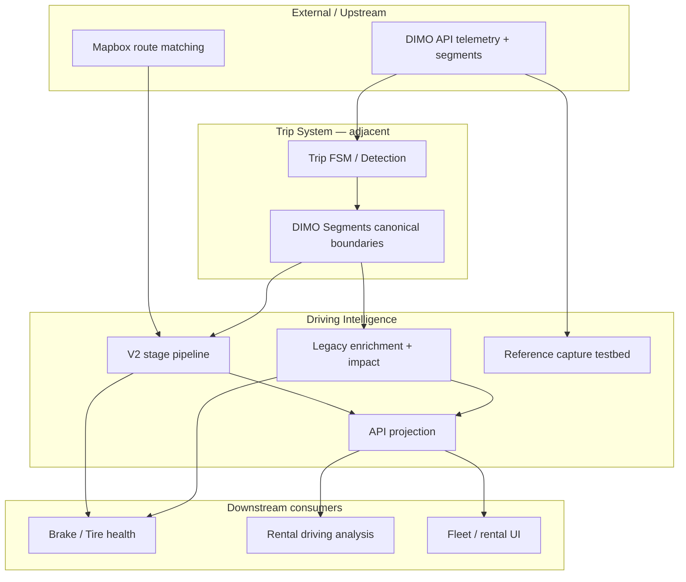
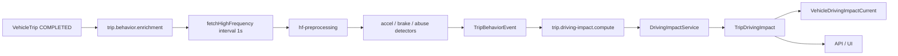
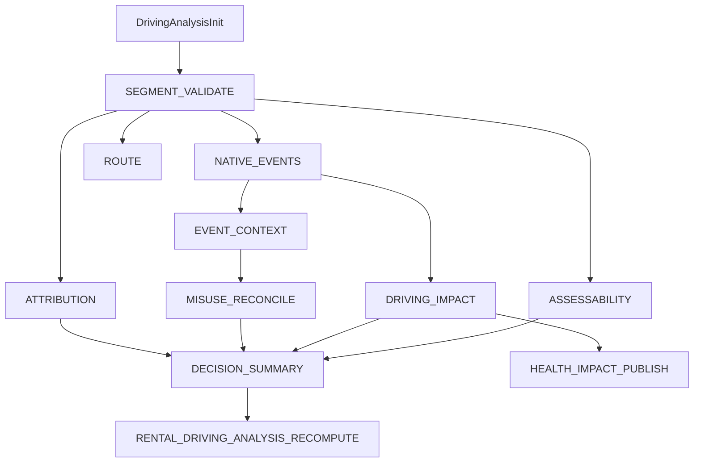
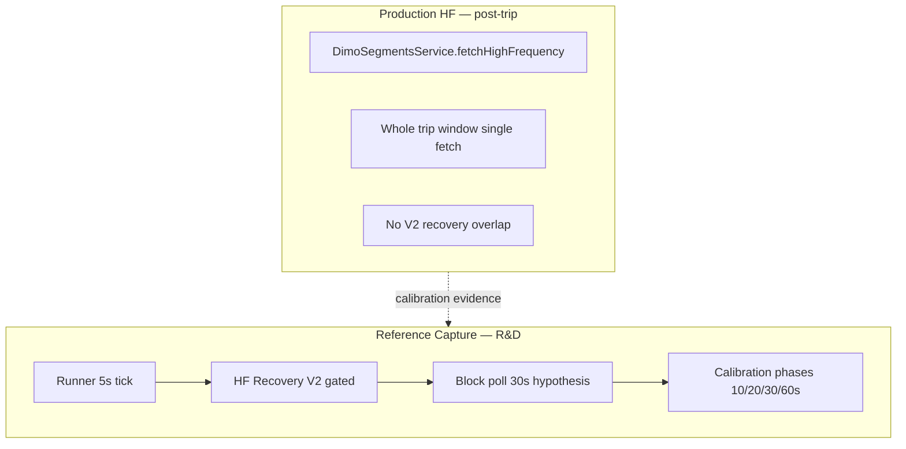
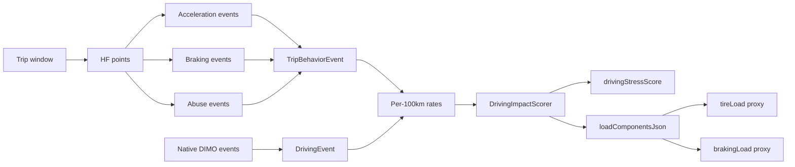
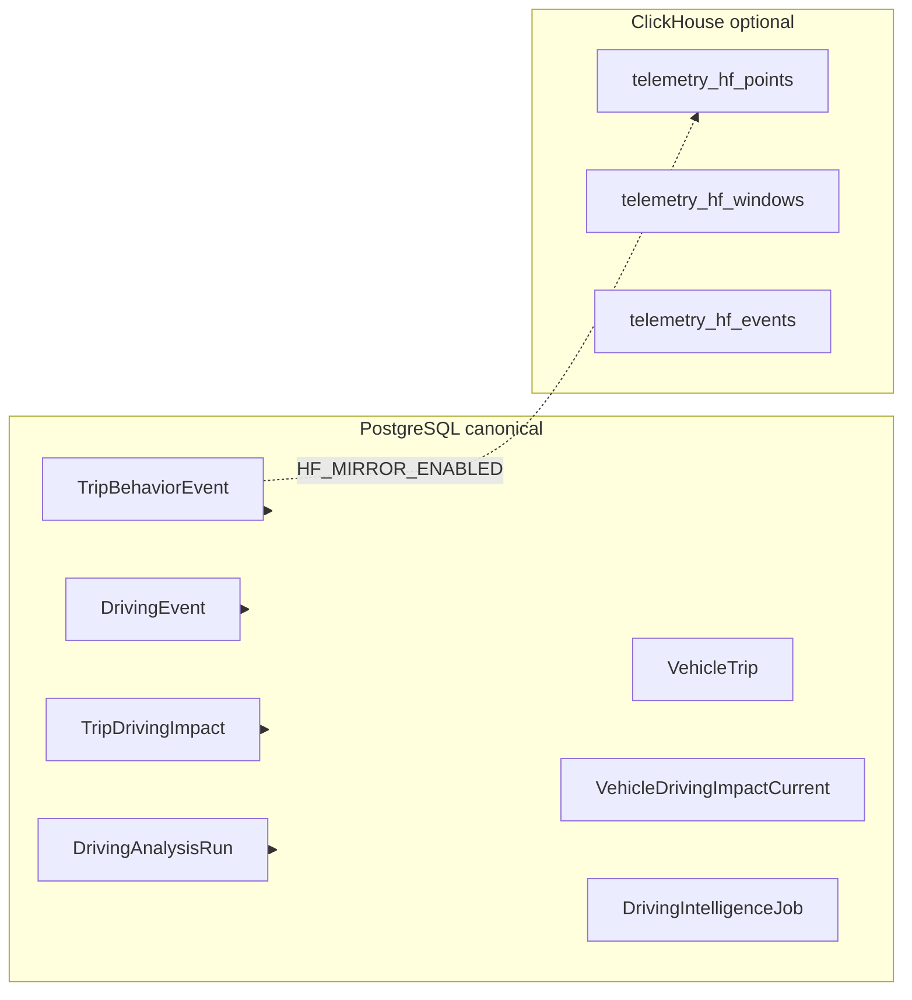

# Driving Intelligence — Knowledge Graph Overview

Human-readable map of the machine graph in `graph/`. Validate with `scripts/validate-graph.sh`.

## Subsystem context

## End-to-end data flow (production default)

## V2 stage DAG (when master flag enabled)

Parallel after `SEGMENT_VALIDATE`: `NATIVE_EVENTS`, `ROUTE`, `ASSESSABILITY`, `ATTRIBUTION`.

`DRIVING_IMPACT` depends on `NATIVE_EVENTS` only (not `ROUTE`).

## Telemetry / HF acquisition split

**Invariant:** `REFERENCE_CAPTURE_PATH ≠ PRODUCTION_HF_PATH` (DI-INV-RC-SEPARATION-001).

## Trip → event → score pipeline

## Job / orchestration graph

| Queue | Processor | Primary output |
|-------|-----------|----------------|
| `trip.behavior.enrichment` | `trip-behavior-enrichment.processor` | Behavior events |
| `trip.driving-impact.compute` | `driving-impact.processor` | Trip impact |
| `driving.intelligence.jobs` | `driving-intelligence-job.processor` | V2 typed jobs |
| `reference.capture.recording` | `reference-capture.processor` | RC observations |

Reconciliation: `DrivingAnalysisReconciliationScheduler` (10 min, leader-gated).

## Persistence graph

## Confidence domains (never conflate)

| ID | Node | Meaning |
|----|------|---------|
| DI-CONF-ASSESS-001 | TripAssessability | Per-dimension data quality gate |
| DI-CONF-EVENT-001 | Event provenance | Native vs HF-reconstructed |
| DI-CONF-STRESS-001 | drivingStressScore | Vehicle operational load |
| DI-CONF-WEAR-001 | tireLoad / brakingLoad | **Proxy** — not measured wear |

## Adjacent subsystem interfaces

| Adjacent | Interface | Direction |
|----------|-----------|-----------|
| Trip FSM | `TripPostFinalizeAnalysisProducer` | Trip end → DI init |
| ATE | Shared trip enrichment timing | Parallel concern; see ATE authority |
| EED | Energy events on timeline | Read-only for DI |
| Tankstellenerkennung | REFUEL enrichment | No DI dependency |
| Brake/Tire health | `HEALTH_IMPACT_PUBLISH` | DI → health recalc |
| ClickHouse | HF mirror, assessability bridge | Write mirror; read for quality |

## Decision register (summary)

Full record: [decisions/DECISION_REGISTER.md](./decisions/DECISION_REGISTER.md).

| ID | Title | Status |
|----|-------|--------|
| DI-DEC-SEGMENTS-CANONICAL-001 | DIMO Segments are trip boundaries | VALIDATED |
| DI-DEC-POST-TRIP-HF-001 | Post-trip HF enrichment (not live abuse) | VALIDATED |
| DI-DEC-STRESS-NOT-DRIVER-001 | drivingStressScore is vehicle load | VALIDATED |
| DI-DEC-LOAD-PROXY-001 | tire/brake load are operational proxies | VALIDATED |
| DI-DEC-V2-FLAG-001 | V2 pipeline behind master flag default off | VALIDATED |
| DI-DEC-RC-SEPARATE-001 | Reference capture isolated from production HF | VALIDATED |
| DI-DEC-HF-RECOVERY-V2-001 | HF recovery V2 for reference capture | EXPERIMENTAL |
| DI-DEC-BLOCK-POLL-30S-001 | 30s block polling scalability hypothesis | PROPOSED |
| DI-DEC-EPISODE-V2-001 | Episode-based future scoring | PROPOSED |

## Open gaps (canonical)

| ID | Gap |
|----|-----|
| DI-GAP-HF-CADENCE-001 | Production detectors assume ~1Hz; runtime ~2s |
| DI-GAP-BLOCK-POLL-VALIDATION-001 | 30s block poll not live-validated |
| DI-GAP-V2-PROD-E2E-001 | V2 pipeline not production-validated at scale |
| DI-GAP-FLEET-COST-001 | Fleet HF request cost not benchmarked |
| DI-GAP-DRIVER-SCORE-NAMING-001 | DriverScoreService misnamed |
| DI-GAP-RAW-HF-REPLAY-001 | No Postgres raw HF replay store |

## Epistemic legend

- **CONFIRMED** — code + tests and/or strong deployment evidence
- **INFERRED** — reasonable from memos; not directly re-verified in bootstrap
- **HISTORICAL** — superseded approach preserved for learning
- **UNKNOWN** — explicitly not reconstructed
- **CONTRADICTED** — sources disagree; see contradiction register

## Narrative: why two paths exist

Production matured on a **simple chain**: trip ends → fetch HF once → detect events → compute impact. This is reliable but **re-fetches DIMO on every enrichment** and cannot recover late-settling buckets.

Reference Capture (DI-EV-0035C) experiments with **incremental HF acquisition**, settlement delay, recovery overlap, and **30s block polling** to reduce API pressure. None of this is wired into `trip-behavior-enrichment.service.ts` until explicitly cut over with evidence.

V2 (durable jobs + stages) adds **idempotent orchestration**, assessability, native events, misuse reconciliation, and health publish — without changing live trip detection when the master flag is off.
