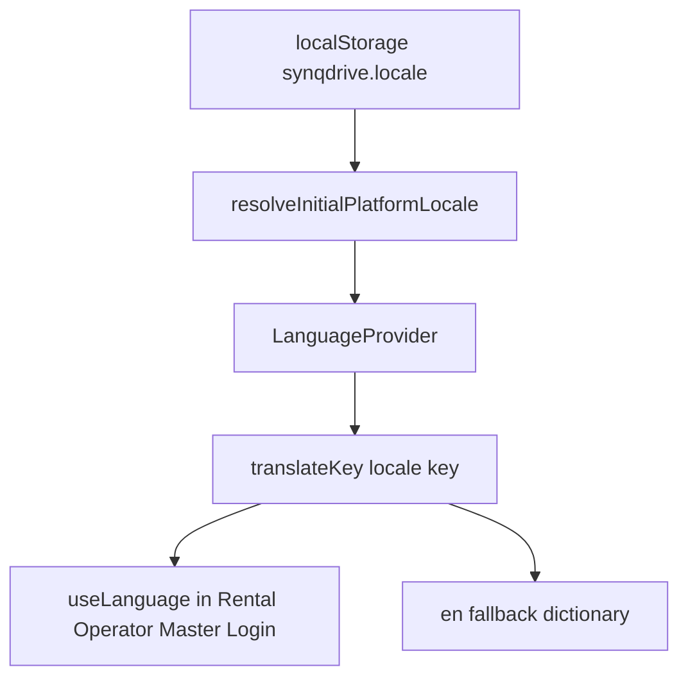

# Internationalization (i18n) — Knowledge Graph Overview

Human-readable map of the machine graph in `graph/`. Validate with `scripts/validate-graph.sh`.

## Runtime flow

## Locale contract

| Locale | Dictionary status | Notes |
|--------|-------------------|-------|
| en | Complete (10,431 keys) | Canonical source |
| de | Complete | Second full locale |
| fr, pl, cs, nl, es, it | Partial | en fallback at lookup |
| tr | Empty | Official locale; fallback-only |

## Architecture evolution

| Era | State | ID |
|-----|-------|-----|
| Historical | Rental `rental/i18n/` bridge | I18N-SUPERSEDED-RENTAL-BRIDGE-001 |
| Current | Platform `LanguageContext` + direct Rental imports | I18N-PIPE-RENTAL-INTEGRATION-001 |

## Governance stack (CONFIRMED on main)

| Layer | Artifact |
|-------|----------|
| Layer 0 | `.github/workflows/i18n-authority-protection.yml` |
| Layer 1–2 | `.github/workflows/i18n-governance-new-debt.yml` |
| SSOT | `authority-path-contract.mjs` |
| Classifier | `workflow-authority-classifier.mjs` |

## Decision register (summary)

Full record: [decisions/DECISION_REGISTER.md](./decisions/DECISION_REGISTER.md).

| ID | Title | Status |
|----|-------|--------|
| I18N-DEC-CANONICAL-EN-001 | English canonical + fallback | VALIDATED |
| I18N-DEC-BRIDGE-RETIRE-001 | Rental bridge retirement | VALIDATED |
| I18N-DEC-GOV-P23-001 | P2.3 governance | VALIDATED |
| I18N-DEC-NINE-LOCALES-001 | Nine official locales | VALIDATED |
| I18N-DEC-HARDCODED-PHASED-001 | Phased enforce-clean | VALIDATED |

## Open gaps (canonical)

| ID | Gap |
|----|-----|
| I18N-GAP-001 | 1,658 enforce-clean hardcoded findings (current scan); 1,661 in 2026-09-07 snapshot |
| I18N-GAP-002 | Partial locale dictionaries |
| I18N-GAP-003 | No Production per-locale UX validation |
| I18N-GAP-004 | Missing hardcoded-copy-guard.test.ts |
| I18N-GAP-005 | main ahead of Production (#1589) |

## Document classification

| Class | Treatment |
|-------|-----------|
| `architecture/internationalization/` | Bootstrap authority (AUDIT_IN_PROGRESS) |
| `architecture/I18N_GOVERNANCE_*` | Supporting evidence |
| `docs/audits/i18n-integration-*` | Supporting evidence |
| `audit-campaign/architecture/I18N_*` | Campaign slice evidence |
