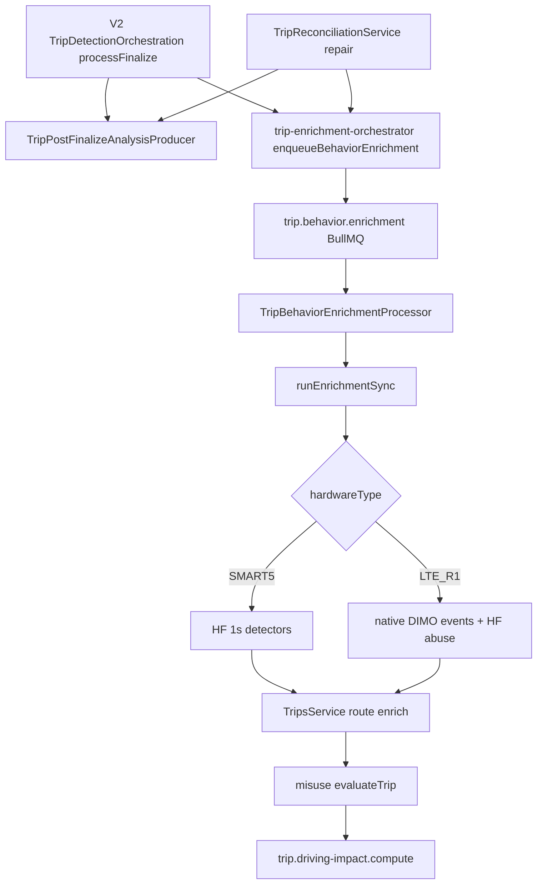

# KG-ATE Discovery — Automatic Trip Enrichment

**Date:** 2026-09-01  
**Status:** DISCOVERY ONLY — not canonical  
**Repository SHA anchor:** `origin/main` @ `c5dce7a9d` (2026-09-01)  
**Authority:** This file is evidence for future `architecture/knowledge-graphs/automatic-trip-enrichment/` — not yet canonical.

---

## 0. Scope boundary

**KG-ATE owns:** How a trip moves automatically and safely through SynqDrive processing after finalization.

**KG-ATE does NOT own:** REFUEL/RECHARGE detection semantics, fuel-level rise, charging duration meaning → cross-reference **KG-EED**.

---

## Part A — Governance patterns reused from Driving Intelligence

| DI concept | Reuse for ATE | Adaptation |
|------------|---------------|------------|
| Repository as canonical authority | **YES** | `architecture/knowledge-graphs/automatic-trip-enrichment/` + `docs/audits/` |
| Evidence classes (`CONFIRMED_FROM_CODE`, etc.) | **YES** | Map to proposed KG taxonomy (Part F in schema proposal) |
| Evidence registry rows | **YES** | `ATE-EV-####` stable IDs |
| Master plan + phase gates | **PARTIAL** | ATE has P1.3/P1.4/P1.7 rollout docs, not one master plan |
| Experiment report template | **YES** | For soak / multi-replica validation |
| Independent review template | **YES** | For authority-changing scheduler/mutex changes |
| Current-state vs historical | **YES** | `CURRENT_STATE.md` vs `DECISIONS.md` |
| Negative results retained | **YES** | Failed deploy / metric collision (P1.3-S6) |
| Epistemic states (Battery V2 pattern) | **YES** | `CONFIRMED` / `INFERRED` / `HISTORICAL` / `UNKNOWN` |

**Not copied blindly:** DI signal/Ground-Truth taxonomy; ATE is orchestration/liveness, not physics scoring.

**Reference governance sources:**
- `docs/audits/driving-intelligence-evidence-governance-2026-09-01.md`
- `docs/audits/driving-intelligence-reconstruction-master-plan-2026-08-30.md`
- `docs/audits/driving-intelligence-evidence-registry.md`
- `architecture/battery-v2/AGENT_CONTRACT.md` (graph maintenance contract pattern)

---

## B1 — Current end-to-end flow (canonical automatic path)



### Flow nodes (selected; full graph ≥20 nodes in canonical build)

| NODE_ID | NAME | TYPE | SOURCE_FILE | ENTRYPOINT | INPUT | OUTPUT | STATE_MUTATION | QUEUE | RETRY | IDEMPOTENCY | FAILURE | OBSERVABILITY | NEXT_NODE |
|---------|------|------|-------------|------------|-------|--------|----------------|-------|-------|-------------|---------|---------------|-----------|
| ATE-N01 | Live trip finalize | SERVICE | `trip-detection-orchestration.service.ts` | `processFinalize()` | FSM context, tripId | COMPLETED trip | `tripStatus=COMPLETED`, `tripAnalysisStatus=PENDING` | `dimo.trip-tracking` | BullMQ 3× | Per-vehicle job IDs | FSM holds non-RESTING | `tripEndLatencyFromMovement` | ATE-N02, ATE-N03 |
| ATE-N02 | Post-finalize V2 analysis init | PRODUCER | `trip-post-finalize-analysis.producer.ts` | `produceAfterPersistedCompletion()` | tripId, source | V2 run + jobs | `DrivingAnalysisRun`, DI jobs | `driving.intelligence.jobs` | Job retry policy | `buildInitJobIdempotencyKey` | Partial queue errors logged | DI metrics | ATE-N04 |
| ATE-N03 | Behavior enqueue | ORCHESTRATOR | `trip-enrichment-orchestrator.service.ts` | `enqueueBehaviorEnrichment()` | tripId, vehicleId, orgId | boolean | `behaviorEnrichmentStatus=PENDING` | `trip.behavior.enrichment` | 3× exp backoff 10s | `jobId=hf-enrich-${tripId}` | Revert PENDING on queue fail | `enrichmentPending` gauge | ATE-N05 |
| ATE-N04 | Driving Intelligence V2 init | SERVICE | `driving-analysis-init.service.ts` | `initializeForCompletedTrip()` | orgId, vehicleId, tripId | Run + staged jobs | V2 tables | `driving.intelligence.jobs` | Dispatcher retry | Run fingerprint | BadRequest if not COMPLETED | Stage orchestrator logs | Parallel V2 handlers |
| ATE-N05 | Behavior worker | PROCESSOR | `trip-behavior-enrichment.processor.ts` | `process()` | Job data | void | Delegates | `trip.behavior.enrichment` | Inherited | Same jobId | Re-throw transient | `observeQueueLag` | ATE-N06 |
| ATE-N06 | Sync enrichment | ORCHESTRATOR | `trip-enrichment-orchestrator.service.ts` | `runEnrichmentSync()` | tripId, vehicleId | status + result | `IN_PROGRESS→COMPLETED\|SKIPPED\|FAILED_*` | — | Bull retry | Status machine | `FAILED_PERMANENT` → reconciliation hook | `enrichmentFailed` | ATE-N07 |
| ATE-N07 | Hardware routing | SERVICE | `trip-behavior-enrichment.service.ts` | `enrichTrip()` | tripId | outcome | events/counters | — | — | Tx delete+createMany | SKIP reasons | `tripCounterAnomalies` | ATE-N08a/b |
| ATE-N08a | SMART5 HF pipeline | SERVICE | `trip-behavior-enrichment.service.ts` | HF path | tokenId, window | `TripBehaviorEvent` rows | counters, `behaviorSummaryJson` | — | DIMO `[]` on error | Transactional replace | `<10 raw / <5 clean` skip | Debug logs | ATE-N09 |
| ATE-N08b | LTE_R1 dual path | SERVICE | `lte-r1-behavior-enrichment.service.ts` | `enrichTripLteR1()` | window | native + abuse events | separate txs | — | Chunk retry | Fingerprint upsert | capability block → null | capability logs | ATE-N09 |
| ATE-N09 | Route/safety enrich | SERVICE | `trips.service.ts` | `enrichTrip()` | orgId, tripId | route fields | `enrichedAt`, waypoints | — | Best-effort catch | Overwrite waypoints | Non-blocking skip | `enrichmentFailed{route}` | ATE-N10 |
| ATE-N10 | Misuse aggregation | SERVICE | `misuse-case-aggregator.service.ts` | `evaluateTrip()` | tripId | misuse cases | `analysisStagesJson.misuse` | — | Recovery scheduler | — | stage failed | recovery logs | ATE-N11 |
| ATE-N11 | Driving impact enqueue | ORCHESTRATOR | `trip-enrichment-orchestrator.service.ts` | `enqueueDrivingImpact()` | tripId | queued | stage pending | `trip.driving-impact.compute` | 3× | `driving-impact-${tripId}` | skip if disabled | debug | ATE-N12 |
| ATE-N12 | Driving impact compute | PROCESSOR | `driving-impact.processor.ts` | `process()` | tripId | TDI + score | `drivingImpactComputedAt` | `trip.driving-impact.compute` | catch→skipped | unique tripId | stage skipped | `recordTdiProcessing` | — |
| ATE-N13 | Trip reconciliation | SERVICE | `trip-reconciliation.service.ts` | `reconcileWindow()` | vehicleId, window, tier | `ReconciliationResult` | via `TripDecisionEngine` only | — | per-step try/catch | mutex + repair audit IDs | isolated energy step | `repairActions` | ATE-N02, ATE-N03 |
| ATE-N14 | Reconciliation scheduler fast | SCHEDULER | `trip-reconciliation.scheduler.ts` | `@Interval` 15m | cohort vehicles | reconcileWindow fast | repairs | — | — | leader-gated | skip if not leader | scheduler logs | ATE-N13 |
| ATE-N15 | Scheduler leader guard | INFRA | `scheduler-leader-guard.service.ts` | `shouldRun(name)` | scheduler name | boolean | — | — | — | Redis lease | non-leader skip | `schedulerLeader` readiness | gates ATE-N14+ |
| ATE-N16 | Reconciliation mutex | INFRA | `reconciliation-execution-mutex.service.ts` | `execute(scope, fn)` | vehicleId scope | executed/skipped | — | — | — | Redis lock per vehicle | skip on contention | mutex metrics | wraps ATE-N13 |
| ATE-N17 | Manual behavior enrich | API | `vehicle-intelligence.controller.ts` | `POST trips/:id/behavior-enrich` | tripId | sync result | same as ATE-N06 | — | user retry | status guards | same as sync | API response | ATE-N06 |
| ATE-N18 | UI route enrich hook | UI | `useTripEnrichment.ts` | `enrichTrip()` | trip | enrichment DTO | — | — | client silent catch | manual only | — | — | API route enrich |
| ATE-N19 | UI behavior fallback | UI | `useTripBehaviorEvents.ts` | `useEffect` | COMPLETED null status | POST behavior-enrich | optimistic IN_PROGRESS | — | once per trip ref | skips if status set | client FAILED_TRANSIENT | — | ATE-N17 |
| ATE-N20 | Admin backfill | API | `platform-admin.controller.ts` | `POST admin/trips/backfill-enrichment` | limit, vehicleId? | counts | enqueues | `trip.behavior.enrichment` | same as N03 | 90d cutoff, max 200 | audit log | — | ATE-N05 |

---

## B2 — Automatic vs manual vs repair paths

| Path | Initiates enrichment? | Primary? | Legacy? | Duplicate risk | Prevention |
|------|----------------------|----------|---------|----------------|------------|
| **Auto post-finalize** (`processFinalize` → orchestrator) | YES | **YES** | No | Low | `hf-enrich-${tripId}`, terminal status guards |
| **Repair finalize** (`enqueueRepairEnrichment`) | YES | YES (repair) | No | Low | Same orchestrator |
| **Reconciliation tiers** (fast/warm/cold) | Indirect (repairs then enqueue) | YES (liveness) | No | Medium cross-pod without leader | `SchedulerLeaderGuard` + per-vehicle mutex |
| **Manual POST behavior-enrich** | YES | Fallback/ops | No | Medium if auto also ran | Terminal status unless force (internal) |
| **UI `useTripBehaviorEvents` fallback** | YES | **Fallback only** | Perceived legacy UX | Medium on old backlog | Only when `behaviorEnrichmentStatus` null |
| **UI `useTripEnrichment` route** | Route only (not behavior) | Manual route | No | Low | Comment: server owns route via DRIVING_ROUTE_ENRICH |
| **Admin backfill** | YES | Ops recovery | No | Batch storm risk | 90d window, limit 200 |
| **Driving analysis reconciliation** | V2 jobs only | Parallel track | No | Split from behavior queue | Separate idempotency |
| **Energy detect (reconciliation step 5)** | NO (energy) | Sibling trigger | — | — | **KG-EED** owns semantics |

### Why move away from click-only enrichment

| Evidence | Finding |
|----------|---------|
| `docs/audits/trip-enrichment-driver-score-energy-events-audit-2026-08.md` §1, §4 | UI click was **fallback**; primary path is post-finalize queue; backlog made trips appear “unenriched until opened” |
| `trip-enrichment-orchestrator.service.ts` header | Single canonical orchestrator mandated for all paths |
| `architecture/TRIP_SYSTEM_AUDIT_2026-04-10.md` | Dual truth / fragmented enrichment identified |

**Maturity:** CONFIRMED_FROM_CODE + CONFIRMED_FROM_RUNTIME (audit observations)

---

## B3 — Orchestration / scheduling / liveness

| Scheduler / producer | OWNER | CADENCE | LEADER_GATED | DUPLICATION_RISK | MUTEX / IDEMPOTENCY |
|---------------------|-------|---------|--------------|------------------|---------------------|
| `TripReconciliationScheduler` fast | `trip-reconciliation.scheduler.ts` | 15 min, 45m window | **YES** (`trip_reconciliation_fast`) | Without leader: N× | `ReconciliationExecutionMutex` per vehicle |
| warm | same | 4 h, 12h window | **YES** | same | same |
| cold | same | daily cron, 7d | **YES** | same | same |
| `TripTrackingRecoveryScheduler` | workers/schedulers | 2 min | varies | `trip-recovery-${vehicleId}` jobId | recovery jobs |
| `TripAnalysisRecoveryScheduler` | workers/schedulers | 5 min | check impl | misuse-only recovery | stuck misuse query |
| `DrivingAnalysisReconciliationScheduler` | workers/schedulers | 10 min | in-process guard | V2 parallel | DI job keys |
| `DimoSnapshotScheduler` | workers/schedulers | 30 s | check impl | **HIGH** if multi-pod ungated | per-vehicle poll jobs |
| `enqueueBehaviorEnrichment` | orchestrator | on event | N/A | jobId dedup | DB status guards |
| `enqueueDrivingImpact` | orchestrator | after behavior | N/A | jobId dedup | unique TDI row |

**Production posture (2026-08-30):** single PM2 replica; leader election + mutex validated for scale-to-2 readiness (`architecture/STAGING_MULTI_REPLICA_VALIDATION_*`, `P1_3_S6_PRODUCTION_DEPLOY_*`).

---

## B4 — Trip reconciliation architecture

**File:** `trip-reconciliation.service.ts`

**Why exists:** Repair missing/stale trips without V1 `syncTripsFromSegments` direct DB mutation; structured audit via `TripRepair`.

**Pipeline inside `reconcileWindow` (mutex-wrapped):**
1. `repairStaleOngoingTrips` — ONGOING >2h → finalize → `enqueueRepairEnrichment`
2. `detectAndRepairMissingTrips` — DIMO segments / CH fallback → overlap detector → `createRepairedTrip`
3. `repairMissingEnds` — ONGOING past grace → end estimate → finalize
4. `repairIntraTripGapSplits` — silence ≥180s → split + finalize segments
5. **`energyEventsService.detectEnergyEvents`** — additive; isolated try/catch (**KG-EED**)
6. `eventTripAssociationService.reconcileUnresolvedWindow`

**Composition (verified in code):**
```
SchedulerLeaderGuard.shouldRun()
  → TripReconciliationScheduler
    → ReconciliationExecutionMutex.execute(vehicleId)
      → reconcileWindow()
        → (optional) runWithDimoRequestContext / provider gateway on DIMO fetches
          → TripDecisionEngine (trip lifecycle authority)
```

**Permanent trip loss:** Repairs go through decision engine; overlap suppression uses deterministic `TripRepair` IDs (`architecture/TRIP_COVERAGE_AWARE_OVERLAP_2026-08-28.md`).

---

## B5 — DIMO access (ATE external dependency view)

**Classification:** `EXTERNAL_AUTHORITY` — Shared Platform / P1.3 DIMO Provider Infrastructure

| ATE depends on | Contract | Invariant |
|----------------|----------|-----------|
| `DimoSegmentsService.fetchHighFrequency` | Vehicle JWT + GraphQL | HF path for SMART5 |
| `fetchDrivingEventsPaginated` | LTE_R1 native events | No invalid safetySystem signals (422 fix) |
| `fetchTripSegments` | Reconciliation repair only | Not behavior enrichment |
| `DimoProviderGateway` + limiter | Shadow/enforce rollout | Rate + in-flight admission |
| `DimoProviderBudgetService` | Global Redis lease semaphore | `maxInFlight` bound |
| `runWithDimoRequestContext` | AsyncLocalStorage context | orgId, vehicleId, tokenId propagation |
| `ReconciliationExecutionMutex` | Per-vehicle Redis lock | No overlapping reconcile |

**ATE may state:** “Reconciliation invokes DIMO through provider gateway with request context.”  
**ATE must NOT state:** Generic DIMO budget algorithm details → **P1.3 authority**.

---

## B6 — Historical decisions (ATE)

| DECISION_ID | DATE | PROBLEM | DECISION | EVIDENCE | STATUS |
|-------------|------|---------|----------|----------|--------|
| ATE-DEC-001 | 2026-04-10 | Fragmented enrichment / dual truth | Document pipeline; identify V1/V2 overlap | `architecture/TRIP_SYSTEM_AUDIT_2026-04-10.md` | CONFIRMED |
| ATE-DEC-002 | 2026-04 | LTE_R1 GraphQL 422 on bad signals | Use `events(behavior.*)` canonical query | `driving-events.query.ts`, `dimo-segments.service.ts` | CONFIRMED |
| ATE-DEC-003 | 2026-07-05 | LTE_R1 skip blocked whole analysis | Assessability: native primary, HF abuse secondary | `architecture/TRIP_ANALYSIS_ASSESSABILITY_2026-07-05.md` | CONFIRMED |
| ATE-DEC-004 | 2026-07-16 | Driving truth fragmentation | DI V2 normative contract; orchestrator remains write path | `docs/architecture/driving-intelligence-v2.md` | CONFIRMED |
| ATE-DEC-005 | 2026-08-27 | “Trips enrich only on click” perception | Auto post-finalize primary; UI fallback documented | `trip-enrichment-driver-score-energy-events-audit-2026-08.md` | CONFIRMED |
| ATE-DEC-006 | 2026-08-28 | Repair duplicate flooding | Coverage-aware overlap + deterministic repair IDs | `TRIP_COVERAGE_AWARE_OVERLAP_2026-08-28.md` | CONFIRMED |
| ATE-DEC-007 | 2026-08-29 | Unbounded DIMO concurrency | Global provider budget (P1.3) | `P1_3_GLOBAL_DIMO_PROVIDER_BUDGET_FINAL_RESPONSE_2026-08-29.md` | PRODUCTION_VALIDATED |
| ATE-DEC-008 | 2026-08-30 | Multi-replica scheduler duplication | Scheduler leader election (P1.7) | `scheduler-leader/` module | VALIDATED |
| ATE-DEC-009 | 2026-08-30 | Overlapping reconciliation | Per-vehicle execution mutex (P1.4) | `reconciliation-execution-mutex/` | VALIDATED |
| ATE-DEC-010 | 2026-08-30 | Scale-to-2 blocked until soak | `GO_WITH_CONDITIONS`; single replica deploy first | `P1_3_S6_PRODUCTION_DEPLOY_*` | ACTIVE |
| ATE-DEC-011 | — | Single canonical orchestrator | All paths through `TripEnrichmentOrchestratorService` | `trip-enrichment-orchestrator.service.ts` | CONFIRMED |
| ATE-DEC-012 | 2026-08-30 | Deploy startup crash | Rename duplicate Prometheus gauge | `3874360e0` hotfix | PRODUCTION_VALIDATED |

---

## Open questions (ATE)

| ID | Question | Maturity |
|----|----------|----------|
| ATE-OQ-01 | When does V2 fully supersede `trip.behavior.enrichment`? | UNKNOWN |
| ATE-OQ-02 | Should `onEnrichmentFailure` cold-tier re-enqueue `FAILED_PERMANENT`? | PROPOSED |
| ATE-OQ-03 | Multi-pod `DimoSnapshotScheduler` without leader — acceptable at scale? | INFERRED risk |
| ATE-OQ-04 | Should HTTP expose `force` re-enrichment for ops? | UNKNOWN |
| ATE-OQ-05 | Route enrich on GET `/trips/:id/route` — idempotent read-only? | UNKNOWN |
| ATE-OQ-06 | DI reconciliation vs behavior status null — intentional split? | INFERRED yes |
| ATE-OQ-07 | 24h single-replica soak completion criteria for scale-to-2 | ACTIVE gate |
| ATE-OQ-08 | CH evidence mirror production adoption | UNKNOWN |
| ATE-OQ-09 | Backfill enqueue storm limits under fleet growth | PROPOSED |
| ATE-OQ-10 | Energy step 5 coupling — schedule ownership split? | PROPOSED (EED scheduler) |
| ATE-OQ-11 | Permanent trip loss proof limits under mutex skip | UNKNOWN |
| ATE-OQ-12 | UI fallback removal once backlog cleared | PROPOSED |

---

## Inventory summary

| Metric | Count |
|--------|------:|
| **Components (nodes + infra + queues)** | **48** |
| **Decisions** | **12** |
| **Evidence artifacts cited** | **28** |
| **Open questions** | **12** |
