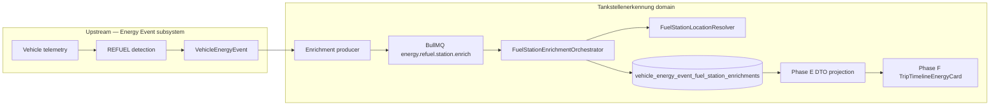

# Tankstellenerkennung — Knowledge Graph Overview

Human-readable map of the machine graph in `graph/`. Validate with `scripts/validate-graph.sh`.

## Domain boundary

## Confidence domains (never conflate)

| ID | Node | Field |
|----|------|-------|
| FST-CONF-DETECTION-001 | Detection confidence | `VehicleEnergyEvent.confidence` |
| FST-CONF-MATCH-001 | Station match confidence | `matchConfidence` on enrichment row |
| FST-AUTH-TRUST-001 | Trusted presentation | `trusted` (derived policy) |

Example invariant: detection `HIGH` + match `LOW` → station must **not** look confirmed in UI (`FST-INV-UI-NO-PROMOTE-LOW-001`).

## Pipeline stages (stable IDs)

| Stage | Representative nodes |
|-------|---------------------|
| Reference data | FST-DATA-OSM-001, FST-IDX-POSTGIS-001 |
| Candidate query | FST-QUERY-ST-DWITH-001, FST-QUERY-KNN-001 |
| Scoring / dedupe / ambiguity | FST-SCORE-V1-001, FST-DEDUPE-V1-001, FST-AMB-DECISION-001 |
| Orchestration | FST-ORCH-ENRICH-001, FST-AUTH-COORD-START-001, FST-AUTH-FINGERPRINT-001 |
| Lifecycle / recovery | FST-STATE-PROCESSING-001, FST-STATE-RESOLUTION-001 (MATCHED, AMBIGUOUS, NOT_FOUND, NO_COORDINATES, INVALID_COORDINATES, ERROR), FST-POL-LIFECYCLE-SKIP-001, FST-POL-RECOVERY-ELIGIBILITY-001 |
| Queue/worker | FST-QUEUE-ENRICH-001, FST-WORK-PROCESSOR-001 |
| Recovery | FST-REC-SCHEDULER-001, FST-AUTH-RECOVERY-LEADER-001 (SINGLETON_GLOBAL when election enabled) |
| Cutover / feature flags | FST-POL-CUTOVER-STARTTIME-001, FST-POL-FEATURE-ENABLE-001 |
| Trust | FST-POL-TRUST-HIGH-MEDIUM-001 |
| API / UI | FST-API-TRIPS-TIMELINE-001, FST-DTO-STATION-001, FST-CONS-TIMELINE-CARD-001 |

## Decision register (summary)

Full scientific record: [decisions/DECISION_REGISTER.md](./decisions/DECISION_REGISTER.md).

| ID | Title | Status |
|----|-------|--------|
| FST-DEC-OSM-DATASET-001 | Local versioned OSM/PostGIS dataset | PRODUCTION_VALIDATED |
| FST-DEC-PRECISION-RESOLVER-001 | Precision-first bounded resolver | VALIDATED |
| FST-DEC-DETECTION-VS-MATCH-001 | Separate detection vs station-match confidence | VALIDATED |
| FST-DEC-ASYNC-ENRICH-001 | Async post-persist enrichment | VALIDATED |
| FST-DEC-STARTTIME-CUTOVER-001 | startTime cutover authority | VALIDATED |
| FST-DEC-NO-BACKFILL-001 | No historical backfill | PRODUCTION_VALIDATED |
| FST-DEC-DB-LIFECYCLE-001 | DB row is lifecycle source of truth | VALIDATED |
| FST-DEC-FAILED-TERMINAL-001 | FAILED terminal for automatic recovery | VALIDATED |
| FST-DEC-TRUST-HIGH-MEDIUM-001 | Only HIGH/MEDIUM MATCHED is trusted | VALIDATED |
| FST-DEC-EXTEND-API-001 | Extend existing Energy Event API | VALIDATED |
| FST-DEC-READ-PERSISTED-001 | HTTP read uses persisted enrichment only | VALIDATED |
| FST-DEC-EXTEND-TIMELINE-UI-001 | Extend TripTimelineEnergyCard | VALIDATED |
| FST-DEC-RECHARGE-UNTOUCHED-001 | RECHARGE unchanged | VALIDATED |
| FST-DEC-REAL-REFUEL-E2E-001 | Require natural post-cutover REFUEL for E2E validation | VALIDATED |
| FST-DEC-COORD-FORECOURT-DWELL-V2-001 | Forecourt dwell medoid coordinate authority V2 | PROPOSED |

Scoped `PRODUCTION_VALIDATED` decisions cite explicit production-validation scope in `DECISION_REGISTER.md` and `FST-EVID-PROD-DEPLOY-001`.

## Open gaps (canonical)

| ID | Gap |
|----|-----|
| FST-GAP-REAL-POST-CUTOVER-REFUEL-001 | Natural post-cutover REFUEL observed; positive match path not validated |
| FST-GAP-PHYSICAL-STOP-COORD-001 | Physical-stop coordinate authority V2 designed (G1.1); G1.2b lookback hardening; implementation pending G2 |

## G1.2b boundary hardening (2026-09-04)

`FST-EVID-G12B-RUNTIME-BOUNDARY-HARDENING-2026-09-04-001` closes five G1.2 review defects: provider-independent lookback, settlement/finality before enrichment, vehicle-scoped reconciliation lock, dimensionally-safe canonical comparator, fail-closed clique multi-sibling grouping. **G1.2c** (`FST-EVID-G12C-FINALITY-AMBIGUITY-CLOSURE-2026-09-04-001`) closes SETTLING semantics, observation-time settlement authority, non-transitive fail-closed components, and 2→3+ sibling race. **G1.2d** (`FST-EVID-G12D-LATE-SIBLING-HARDENING-2026-09-04-001`) closes singleton/external late-sibling duplicate-enrichment path. **G2.1** (`FST-EVID-G21-RUNTIME-WIRING-2026-09-04-001`) wires runtime reconciliation behind `PHYSICAL_REFUEL_RECONCILIATION_V2_ENABLED` (default OFF). **G2.1a** (`FST-EVID-G21A-RUNTIME-SAFETY-LIVENESS-CLOSURE-2026-09-04-001`) closes legacy recovery bypass, durable settlement/orphan/lost-enqueue recovery, matrix scope, V2 coordinate fail-closed, and pre-G2 bridge. **129+ targeted tests PASS.** G2.2 shadow rollout authorized; production activation pending shadow validation.
| FST-GAP-GERMANY-SCOPE-001 | Germany-only scope / international expansion |
| FST-GAP-MANUAL-FAILED-REPAIR-001 | Manual repair for terminal FAILED rows |
| FST-GAP-SINGLE-COORD-POLICY-001 | Single start-coordinate policy |
| FST-GAP-OSM-DATA-QUALITY-001 | OSM relation/multipolygon edge cases |
| FST-GAP-PRODUCTION-SLO-001 | Production SLO / alerting thresholds |
| FST-GAP-UPSTREAM-COORD-CONTRACT-001 | Upstream coordinate/timestamp contract |
| FST-GAP-PRE-PHASE-B-DISCOVERY-001 | Pre-Phase-B discovery history |

## Production E2E governance (confirmed policy)

**FST-DEC-REAL-REFUEL-E2E-001** — natural production evidence required; no synthetic mutation (`FST-REJECT-SYNTHETIC-PROD-REFUEL-001`).

**FST-GAP-REAL-POST-CUTOVER-REFUEL-001** — first natural post-cutover REFUEL observed 2026-09-04; partial pipeline validated; **MATCHED path not validated**.

**NATURAL POSITIVE REFUEL MATCH E2E STILL NOT PRODUCTION_VALIDATED.**

## Epistemic legend

- **CONFIRMED** — code + tests and/or strong deployment/DB evidence
- **INFERRED** — reasonable from memos; not directly re-verified in this bootstrap
- **HISTORICAL** — superseded approach preserved for learning
- **UNKNOWN** — explicitly not reconstructed
- **PRODUCTION_VALIDATED** — strict scoped post-change evidence; see AGENT_CONTRACT.md
