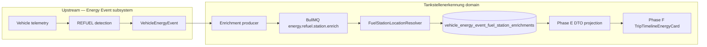

# Tankstellenerkennung — Knowledge Graph Overview

Human-readable map of the machine graph in `graph/`. Validate with `scripts/validate-graph.sh`.

## Domain boundary

## Confidence domains (never conflate)

| ID | Node | Field |
|----|------|-------|
| FST-CONF-DETECTION-001 | Detection confidence | `VehicleEnergyEvent.confidence` |
| FST-CONF-MATCH-001 | Station match confidence | `matchConfidence` on enrichment row |
| FST-AUTH-TRUST-001 | Trusted presentation | `trusted` (derived policy) |

Example invariant: detection `HIGH` + match `LOW` → station must **not** look confirmed in UI (`FST-INV-UI-NO-PROMOTE-LOW-001`).

## Pipeline stages (stable IDs)

| Stage | Representative nodes |
|-------|---------------------|
| Reference data | FST-DATA-OSM-001, FST-IDX-POSTGIS-001 |
| Candidate query | FST-QUERY-ST-DWITH-001, FST-QUERY-KNN-001 |
| Scoring | FST-SCORE-V1-001 |
| Dedupe | FST-DEDUPE-V1-001 |
| Ambiguity | FST-AMB-DECISION-001 |
| Match confidence | FST-CONF-THRESHOLDS-001 |
| Persistence | FST-PERSIST-ENRICHMENT-001 |
| Queue/worker | FST-QUEUE-ENRICH-001, FST-WORK-PROCESSOR-001 |
| Recovery | FST-REC-SCHEDULER-001 |
| Cutover policy | FST-POL-CUTOVER-STARTTIME-001 |
| Trust | FST-POL-TRUST-HIGH-MEDIUM-001 |
| API | FST-API-TRIPS-TIMELINE-001, FST-DTO-STATION-001 |
| UI | FST-CONS-TIMELINE-CARD-001 |

## Decision register (summary)

Full scientific record: [decisions/DECISION_REGISTER.md](./decisions/DECISION_REGISTER.md).

| ID | Title | Status |
|----|-------|--------|
| FST-DEC-OSM-DATASET-001 | Local versioned OSM/PostGIS dataset | PRODUCTION_VALIDATED (dataset) |
| FST-DEC-PRECISION-RESOLVER-001 | Precision-first bounded resolver | VALIDATED |
| FST-DEC-DETECTION-VS-MATCH-001 | Separate detection vs station-match confidence | PRODUCTION_VALIDATED (contract) |
| FST-DEC-ASYNC-ENRICH-001 | Async post-persist enrichment | PRODUCTION_VALIDATED (infra) |
| FST-DEC-STARTTIME-CUTOVER-001 | startTime cutover authority | PRODUCTION_VALIDATED |
| FST-DEC-NO-BACKFILL-001 | No historical backfill | PRODUCTION_VALIDATED |
| FST-DEC-DB-LIFECYCLE-001 | DB row is lifecycle source of truth | VALIDATED |
| FST-DEC-FAILED-TERMINAL-001 | FAILED terminal for automatic recovery | VALIDATED |
| FST-DEC-TRUST-HIGH-MEDIUM-001 | Only HIGH/MEDIUM MATCHED is trusted | VALIDATED |
| FST-DEC-EXTEND-API-001 | Extend existing Energy Event API | PRODUCTION_VALIDATED (deploy) |
| FST-DEC-READ-PERSISTED-001 | HTTP read uses persisted enrichment only | VALIDATED |
| FST-DEC-EXTEND-TIMELINE-UI-001 | Extend TripTimelineEnergyCard | PRODUCTION_VALIDATED (deploy) |
| FST-DEC-RECHARGE-UNTOUCHED-001 | RECHARGE unchanged | VALIDATED |
| FST-DEC-REAL-REFUEL-E2E-001 | Require natural post-cutover REFUEL for E2E validation | PROPOSED |

## Open gap (canonical)

**FST-GAP-REAL-POST-CUTOVER-REFUEL-001** — first real post-cutover REFUEL has not yet exercised the full persisted match → API → UI path in production.

## Epistemic legend

- **CONFIRMED** — code + tests and/or strong deployment/DB evidence
- **INFERRED** — reasonable from memos; not directly re-verified in this bootstrap
- **HISTORICAL** — superseded approach preserved for learning
- **UNKNOWN** — explicitly not reconstructed
- **PRODUCTION_VALIDATED** — strict; see AGENT_CONTRACT.md
