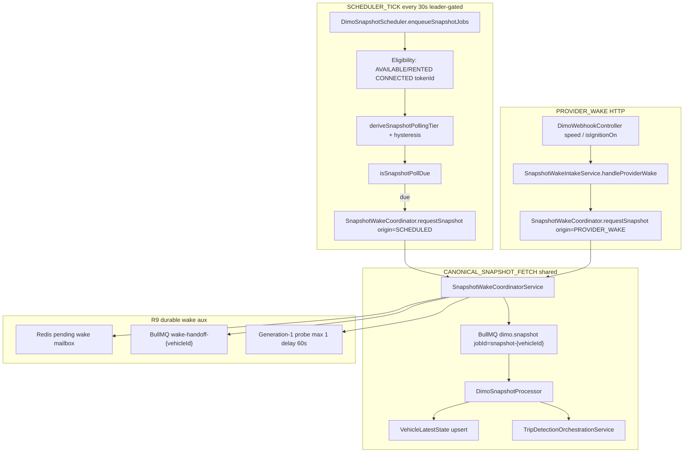

# TDL-OQ-009 — Tiered snapshot polling vs R9 provider-wake ingress (read-only audit)

| Field | Value |
|-------|-------|
| **Evidence ID** | TDL-EVID-OQ009-R9-INGRESS-001 |
| **Observed at (UTC)** | `2026-09-26` (code @ `origin/main`; Production read-only @ `8a1d9c658…`) |
| **Repository baseline** | `origin/main` @ `47a3b42b80eb359b84cb5f1d98854ee0e624e124` |
| **Production baseline** | `8a1d9c6586cbddc41bb6c94870f9d51226d71aa2` @ `20260925182907_v4994` |
| **R9 merge (PR #1553)** | `4bef604633e159297eec0fb1b72485ecb1a608be` — **ancestor of both `main` and Production SHA** |
| **Audit mode** | READ_ONLY |
| **Verdict** | **`RESOLVED_INGRESS_CONTRACT_ALIGNED`** |
| **Cross-module gap (non-blocking)** | **`STALE_FORMER_FLEET_SCHEDULER_MIRROR_COUNT=1`** — `HISTORICALLY_EXCLUDED_FORMER_FLEET_ASSET` (DIM-GAP-005); not an R9 provider coverage defect |

## Executive separation (required)

These layers are **not** interchangeable:

| Layer | Meaning on current `main` / Production |
|-------|----------------------------------------|
| **SCHEDULER_TICK** | Leader-gated `@Interval(30000)` on `DimoSnapshotScheduler` — evaluates cohort ~every **30s** |
| **PER_VEHICLE_POLL** | Subset of cohort enqueued when activity-tier **due** (`providerFetchedAt` + tier interval + promotion bypass) |
| **PROVIDER_WAKE** | DIMO Vehicle Trigger webhook → `SnapshotWakeIntakeService` → `requestSnapshot(origin=PROVIDER_WAKE)` |
| **CANONICAL_SNAPSHOT_FETCH** | BullMQ job `snapshot-{vehicleId}` → `DimoSnapshotProcessor` → full DIMO telemetry fetch → `VehicleLatestState` |
| **TRIP_START_EVALUATION** | `TripDetectionOrchestrationService` after snapshot persist — FSM / POSSIBLE_START / ACTIVE_TRIP |

---

## Phase 0 — Baseline verification

| Check | Result |
|-------|--------|
| `origin/main` @ task anchor | `47a3b42b80eb359b84cb5f1d98854ee0e624e124` |
| Production release SHA | `8a1d9c6586cbddc41bb6c94870f9d51226d71aa2` |
| R9 on `main` | **YES** — `4bef6046…` is ancestor of `47a3b42b8…` |
| R9 on Production | **YES** — `4bef6046…` is ancestor of `8a1d9c658…` (repo object; release tree is shallow on VPS) |
| Current Production is **not** pre-R9 | **CONFIRMED** |

Polling mode (cross-check [TDL_OQ_008](TDL_OQ_008_FEATURE_FLAG_RUNTIME_MATRIX_2026-09-25.md) @ same Production release):

| Field | Production effective |
|-------|---------------------|
| `PRODUCTION_SNAPSHOT_POLLING_MODE` | **ACTIVITY_TIERED** |
| `WORKER_SNAPSHOT_LEGACY_FIXED_CADENCE` | false (absent → default) |
| `WORKER_SNAPSHOT_ACTIVITY_TIER_POLLING_ENABLED` | true |
| Tier MS | 30s / 60s / 5m / 30m (absent → code defaults) |
| `WORKER_SNAPSHOT_MOVEMENT_SPEED_KMH` | **3** (absent → default; matches wake classifier) |

---

## Phase 1 — Canonical ingress graph (current `main`)

**Code proof (entrypoints):**

- Scheduled: `DimoSnapshotScheduler` @ `backend/src/workers/schedulers/dimo-snapshot.scheduler.ts`
- Provider: `DimoWebhookController` speed/ignition → `SnapshotWakeIntakeService` @ `backend/src/modules/dimo/dimo-webhook.controller.ts`, `snapshot-wake-intake.service.ts`
- Convergence: `SnapshotWakeCoordinatorService.requestSnapshot` @ `snapshot-wake-coordinator.service.ts` — `jobId = snapshot-${vehicleId}` (`snapshot-wake.util.ts`)
- Fetch: `DimoSnapshotProcessor` @ `dimo-snapshot.processor.ts`
- Post-fetch wake hooks: `afterSnapshotJob` → probe / successor scheduling

---

## Phase 2 — Scheduler eligibility (Production cohort)

**Code predicate** (`DimoSnapshotScheduler`):

- `vehicle.status` ∈ `AVAILABLE`, `RENTED`
- `dimoVehicleId` not null
- `dimoVehicle.connectionStatus = CONNECTED`
- `dimoVehicle.tokenId` not null

**Production counts** (read-only Prisma @ `2026-09-26`):

| Metric | Count |
|--------|------:|
| `TOTAL_VEHICLES` | 9 |
| `DIMO_LINKED` | 6 |
| `CONNECTED` | 6 |
| `CONNECTED_WITH_TOKEN` | 6 |
| `SCHEDULER_ELIGIBLE_DB_ROWS` | **6** |

Cross-check OQ-003: **6/6** scheduler-eligible vehicles have `vehicle_trip_detection_states` rows (unchanged cardinality contract).

### Cohort denominator separation (required)

Do **not** conflate SynqDrive DB scheduler eligibility with the **authorized R9 provider subscription cohort**.

| Denominator | Meaning | Count @ `2026-09-26` |
|-------------|---------|---------------------:|
| **A — `SCHEDULER_ELIGIBLE_DB_ROWS`** | SynqDrive Prisma: AVAILABLE/RENTED, DIMO CONNECTED, token present | **6** |
| **B — `R9_PROVIDER_AUTHORIZED_COHORT`** | Current fleet authorized for R9 speed/ignition triggers (excludes historically excluded former-fleet asset) | **5** |
| **C — `STALE_FORMER_FLEET_SCHEDULER_MIRROR_COUNT`** | One DB-eligible row mirrors stale AVAILABLE/CONNECTED state for **`HISTORICALLY_EXCLUDED_FORMER_FLEET_ASSET`** — tracked as **existing cross-module data-integrity gap** (DIM-GAP-005); must **not** be reauthorized to “fix” R9 coverage | **1** |

**DB cohort forensic view (not R9 coverage):** `SCHEDULER_COHORT_WITH_BOTH_R9_TRIGGERS=5/6` — label **`DB_COHORT_VIEW`** only.

**Wake intake vehicle predicate** matches scheduler DB eligibility (plus FSM RESTING gate for primary start wake). Provider subscription coverage is evaluated against denominator **B**, not raw DB rows alone.

---

## Phase 3 — Tier derivation

**Implementation:** `deriveSnapshotPollingTier`, `applySnapshotPollingHysteresis`, `isSnapshotPollDue` @ `derive-snapshot-polling-tier.ts`.

| Tier | Primary inputs |
|------|----------------|
| **ACTIVE_DRIVING** | FSM ∈ `{ACTIVE_TRIP, IDLE_WITHIN_TRIP, POSSIBLE_END}` |
| **RECENTLY_ACTIVE** | speed > threshold OR ignition ON OR recent `lastActivityAt` OR telemetry `live` |
| **RESTING_STANDBY** | telemetry `standby` or recent observation age |
| **LONG_IDLE** | stale/offline telemetry / long observation gap |

**Demotion hold:** after ACTIVE_DRIVING ends, effective tier held ≥ `RECENTLY_ACTIVE` cadence for `activeDrivingDemotionHoldMs` (default **90s**).

**Due-time:** compares `now - providerFetchedAt` to tier interval; **promotion bypass** can enqueue immediately when raw tier promotes faster than last poll (one-shot per transition).

**LONG_IDLE telemetry dependency (architectural):**

- Tier inputs (`speedKmh`, `isIgnitionOn`, `observationAt`) come from **`VehicleLatestState`**, updated only by **canonical snapshot fetch** (or other writers that refresh VLS — not raw webhook scalar alone).
- Therefore a **LONG_IDLE** vehicle does **not** learn new speed/ignition from DIMO until **(A)** a scheduled poll is due, **(B)** an **R9 provider wake** requests a canonical fetch, or **(C)** another path refreshes VLS (e.g. trip tracking — separate queue).

This matches the intended **wake-primary / poll-fallback** design.

---

## Phase 4 — R9 wake signal contract

**Classifier:** `classifyDimoStartWakeSignal` @ `snapshot-wake.util.ts` (uses `movementSpeedKmh` from tier config).

| Signal | Accepted? | Wake reason |
|--------|-----------|-------------|
| `speed` > **3 km/h** (Production effective threshold) | **YES** | `SPEED_MOVEMENT` |
| `speed` ≤ 3 km/h | **NO** | — |
| `isIgnitionOn` == **true** | **YES** | `IGNITION_ON` |
| `isIgnitionOn` == **false** | **NO** | — |
| Other webhook signals | **NO** for R9 start wake | handled elsewhere (DTC, RPM, OBD, …) |

**Return fields:**

- `SPEED_ZERO_OR_LOW_WAKE` = **NO** (by design)
- `IGNITION_ON_WAKE` = **YES**
- `IGNITION_OFF_WAKE` = **NO**
- `OTHER_SIGNAL_WAKE` = **NO** (for Trip-start wake path)

---

## Phase 5 — FSM wake eligibility

**Primary wake FSM:** `TripDetectionState.RESTING` only (`isRestingPrimaryWakeFsm`).

Non-RESTING → `IGNORED_FSM_ACTIVE` (metric recorded; **no** `requestSnapshot` for provider path).

**Provider wake does not:**

- mutate FSM directly
- create `VehicleTrip`
- set POSSIBLE_START directly
- write canonical trip boundaries

It only enqueues **canonical snapshot fetch** with optional Redis pending wake context.

---

## Phase 6 — Shared coordinator / parallel fetch safety

| Question | Answer |
|----------|--------|
| `SCHEDULED_AND_WAKE_SHARE_CANONICAL_QUEUE` | **YES** — `QUEUE_NAMES.DIMO_SNAPSHOT`, jobId `snapshot-{vehicleId}` |
| `CAN_SCHEDULED_AND_WAKE_CREATE_PARALLEL_PROVIDER_FETCHES` | **NO** (bounded) — `enqueueStableSnapshotJob` coalesces on same jobId; active job → `COALESCED_*` |
| `CAN_PROVIDER_WAKE_BYPASS_CANONICAL_SNAPSHOT_FETCH` | **NO** — wake only enqueues `DimoSnapshotProcessor` work |
| `CAN_WAKE_DIRECTLY_MUTATE_TRIP` | **NO** |

**Stable IDs verified:**

- `snapshot-{vehicleId}` — `snapshotJobId()`
- `wake-handoff-{vehicleId}` — `snapshotWakeHandoffJobId()`

**Redis mailboxes (shared across replicas):**

- `synqdrive:snapshot-wake:pending:{vehicleId}`
- `synqdrive:snapshot-wake:successor:{vehicleId}`

---

## Phase 7 — Generation-1 wake probe

| Field | Value |
|-------|-------|
| `MAX_WAKE_PROBE_GENERATION` | **1** (`probeGeneration === 1` terminal in `afterSnapshotJob`) |
| `WAKE_PROBE_DELAY_MS` | **60000** — `wakeProbeDelayMs()` = `RECENTLY_ACTIVE` tier interval (default 60s) |
| `CAN_PROBE_CHAIN_UNBOUNDED` | **NO** — gen-1 does not schedule gen-2 |

**Probe triggers** (`shouldRequestWakeProbe`): provider fetch failed (RESTING), stale monotonic skip, snapshot behind wake timestamp, trip start eval error, fresh wake without POSSIBLE_START / stale snapshot freshness, etc.

---

## Phase 8 — Provider subscription coverage (authorized R9 cohort)

**Method:** read-only `sudo node scripts/ops/r9-post-get-audit.mjs` @ Production (`2026-09-26`) — DIMO Vehicle Triggers GET, no mutations.

### R9 provider authorized cohort (denominator B)

| Metric | Count |
|--------|------:|
| `R9_PROVIDER_AUTHORIZED_COHORT` | **5** |
| `R9_SUBSCRIBED_SPEED` | **5** |
| `R9_SUBSCRIBED_IGNITION` | **5** |
| `R9_SUBSCRIBED_BOTH` | **5** |
| `R9_AUTHORIZED_COHORT_COVERAGE` | **100%** |
| `PROVIDER_SUBSCRIPTION_READ_ERRORS` | **0** |

**Interpretation:** All **five** authorized current-fleet assets have both R9 speed and ignition trigger subscriptions. There is **no** missing subscription among the authorized rollout cohort.

### Stale SynqDrive mirror (denominator C — not R9 coverage)

| Metric | Count |
|--------|------:|
| `STALE_FORMER_FLEET_SCHEDULER_MIRROR_COUNT` | **1** |
| `STALE_MIRROR_ALREADY_TRACKED_IN_DIMO_AUTHORITY` | **YES** (DIM-GAP-005; DIM-EV-R9-PERM-001) |
| `EXISTING_CROSS_MODULE_DATA_INTEGRITY_GAP` | **YES** — **`HISTORICALLY_EXCLUDED_FORMER_FLEET_ASSET`** remains scheduler-DB-eligible with stale mirrors; OBD/RPM links only; **must not** be treated as an ordinary “missing R9 subscription” member of cohort B |

**R9 trigger definitions (stableIds):** `9eeb7158afee` (speed), `5d611d470eab` (ignition) — **enabled**.

---

## Phase 9 — Natural Production wake evidence

**Historical (CONFIRMED artifacts):**

- KS MS 661 natural R9 start wake @ `684950419…` — [KS_MS_661_NATURAL_DRIVE_2026-09-08.md](KS_MS_661_NATURAL_DRIVE_2026-09-08.md)
- KS MS 661 R11 natural drive forensics @ `f7eb94cb…` — [KS_MS_661_R11_NATURAL_DRIVE_2026-09-09.md](KS_MS_661_R11_NATURAL_DRIVE_2026-09-09.md)

**Recent Production SQL (bounded, read-only):**

| Window | `raw_detection_meta` contains `"source":"DIMO_TRIGGER"` (COMPLETED trips) | `startWake` substring |
|--------|---------------------------------------------------------------------------|------------------------|
| 7d | **0** | **0** |
| 30d | **0** | **0** |

**Interpretation:** Recent fleet activity did not persist DIMO-trigger start forensics on completed trips in Postgres during these windows; this does **not** disprove webhooks or wakes (forensics may live in metrics, tracking runs, or non-completed paths). **Prometheus** `synqdrive_trip_snapshot_wake_*` was **not** reachable on localhost/public scrape during this audit → operational wake counters **INSUFFICIENT_EVIDENCE** for 7d/30d rates.

| Field | Value |
|-------|-------|
| `NATURAL_R9_START_WAKE_EVIDENCE_PRESENT` | **YES** (historical KS MS 661) |
| `RECENT_PERSISTED_DIMO_TRIGGER_START_COUNT_30D` | **0** (COMPLETED-trip `raw_detection_meta` / `startWake` SQL — bounded; does **not** imply zero webhooks) |
| `RECENT_PROVIDER_WAKE_SAMPLE_COUNT` | **INSUFFICIENT_EVIDENCE** (Prometheus wake counters unavailable in read-only pass) |

---

## Phase 10 — Wake latency

**INSUFFICIENT_EVIDENCE** for distribution (median/p95) — no joined timestamp series exported in this read-only pass.

---

## Phase 11 — Polling fallback contract

When provider wake is absent, **tier scheduler** remains durable fallback (worst-case nominal intervals from due-time + **30s tick quantization**):

| Tier | Nominal max interval | Notes |
|------|---------------------|--------|
| ACTIVE_DRIVING | ~**30s** | + tick alignment |
| RECENTLY_ACTIVE | ~**60s** | |
| RESTING_STANDBY | ~**5m** | |
| LONG_IDLE | ~**30m** | |

**Not** a hard SLA — provider latency, queue backlog, leader skip, and `WORKER_SNAPSHOT_MAX_ENQUEUE_PER_TICK` (Production absent → unlimited batch) affect actual timing.

`POLLING_FALLBACK_PRESENT` = **YES**

---

## Phase 12 — Primary vs authoritative

| Role | Verified wording |
|------|----------------|
| `PROVIDER_WAKE_ROLE` | **LOW_LATENCY_FETCH_TRIGGER** (RESTING-only start wake) |
| `TRIP_START_AUTHORITY` | **TRIP_FSM_FROM_CANONICAL_SNAPSHOT_EVIDENCE** |
| `TRIP_BOUNDARY_AUTHORITY` | **TRIP_FSM + TRIP_DECISION_ENGINE** |

DIMO Vehicle Trigger is **not** trip boundary authority.

---

## Phase 13 — Non-R9 webhook paths (do not conflate)

| Ingress | Trip start | Trip end | Repair | Neither |
|---------|------------|----------|--------|---------|
| speed / isIgnitionOn R9 wake | indirect via snapshot | — | — | |
| RPM webhook | — | — | — | **RPM candidate** (Energy / abuse pipeline) |
| obdDTCList | — | — | — | DTC health |
| OBD plug/unplug inbox | — | — | — | device connection episodes |
| DIMO segments reconciliation | — | — | **yes** | |
| Trip tracking jobs | continuity | end paths | — | |
| ClickHouse assist | — | end assist | repair assist | |

---

## Phase 14 — Multi-replica behavior

| Property | Verified |
|----------|----------|
| Webhook HTTP | Either `synqdrive` / `synqdrive-b` replica may receive |
| Redis wake mailboxes | **Shared** |
| BullMQ | **Shared** |
| Snapshot jobId | **Stable per vehicle** — coalesce |
| Scheduler tick | **Leader-gated** (`dimo_snapshot_tick`) |
| Handoff recovery | **Leader-gated** (`snapshot_wake_handoff_recovery`) |
| Wake intake | **Not** leader-gated (correct for HTTP ingress) |

| Field | Value |
|-------|-------|
| `MULTI_REPLICA_WAKE_SAFE` | **YES** |
| `DUPLICATE_PROVIDER_FETCH_DEFECT_FOUND` | **NO** |

**Replica effective env:** shared `backend/.env` → `/opt/synqdrive/shared/backend.env` (OQ-008); effective in-memory reload **INFERRED_NOT_DIRECTLY_INTROSPECTED** if env file changes without restart.

---

## Phase 15 — Documentation consistency audit

| Claim location | Classification |
|----------------|----------------|
| `OPEN_QUESTIONS` OQ-009 row “pre-R9 on Production” | **STALE_CURRENT_CLAIM** — fix in this PR |
| `AUDIT_MANIFEST` PRODUCTION_CURRENT @ `99d722b4…` only | **STALE_CURRENT_CLAIM** — superseded by `8a1d9c658…` for current-runtime (historical rows remain **HISTORICAL_CORRECT**) |
| R9 five-vehicle canary @ 2026-09-07 | **HISTORICAL_CORRECT** — authorized provider cohort **5**; not “6-vehicle R9 rollout” |
| SynqDrive scheduler DB cohort @ 2026-09-26 | **CURRENT_CORRECT** — **6** rows including **1** stale former-fleet mirror (DIM-GAP-005) |
| `KNOWLEDGE_GRAPH` “natural wake not yet observed” | **STALE_CURRENT_CLAIM** — historical KS MS 661 observed; recent rates unknown |
| Pre-R9 release @ `01541c2ab…` “R9 NOT_ON_PRODUCTION” | **HISTORICAL_CORRECT** |
| Tiered polling + R9 on current Production | **CURRENT_CORRECT** (this audit) |

`CURRENT_INGRESS_CONTRACT_MISMATCH_FOUND` = **NO** (code matches documented R9+tiers architecture; docs had stale **wording**, not inverted contracts).

---

## Phase 16 — Verdict gate

| Gate | Status |
|------|--------|
| Polling mode proven | YES — ACTIVITY_TIERED @ Production |
| R9 ingress path proven | YES — code + Production ancestry |
| Wake vs poll fallback proven | YES — Phase 11 |
| R9 authorized provider coverage | **100%** (5/5 both triggers) |
| Cross-module stale mirror | **1** — existing data-integrity gap (not new R9 defect) |
| Authority conflict | NONE |
| Docs corrected | YES (TDL + DIMO current-state sync in PR #1789) |

**OQ-009 status:** **CLOSED** — `RESOLVED_INGRESS_CONTRACT_ALIGNED`

**NEW_RUNTIME_DEFECT_FOUND=NO**

**BLOCKERS=NONE** — optional follow-up: refresh `AUDIT_MANIFEST` PRODUCTION_CURRENT pointer; expose wake metrics scrape for operational KPIs.

**NEXT_ACTION=** TDL-OQ-010 legacy path inventory; optional SynqDrive cleanup for **`HISTORICALLY_EXCLUDED_FORMER_FLEET_ASSET`** mirror (DIM-GAP-005).
