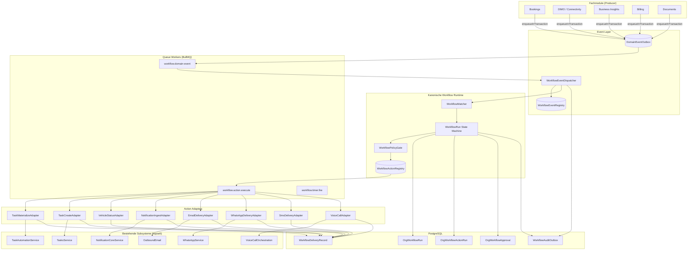
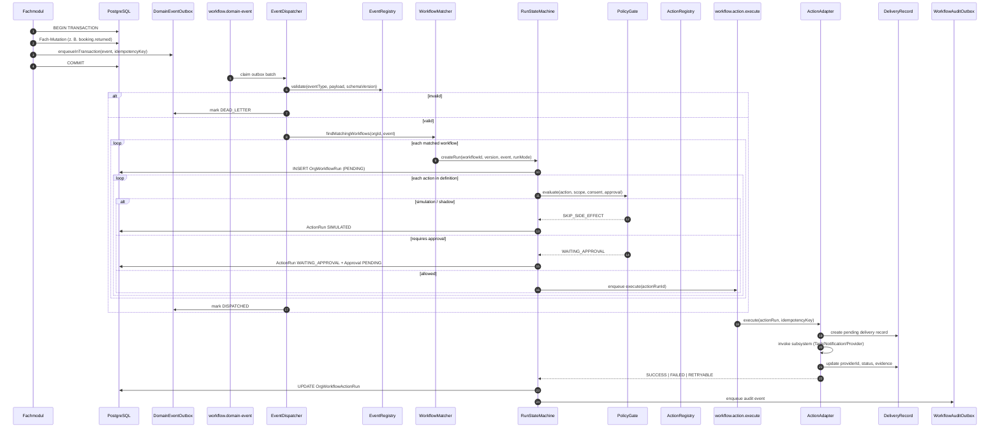
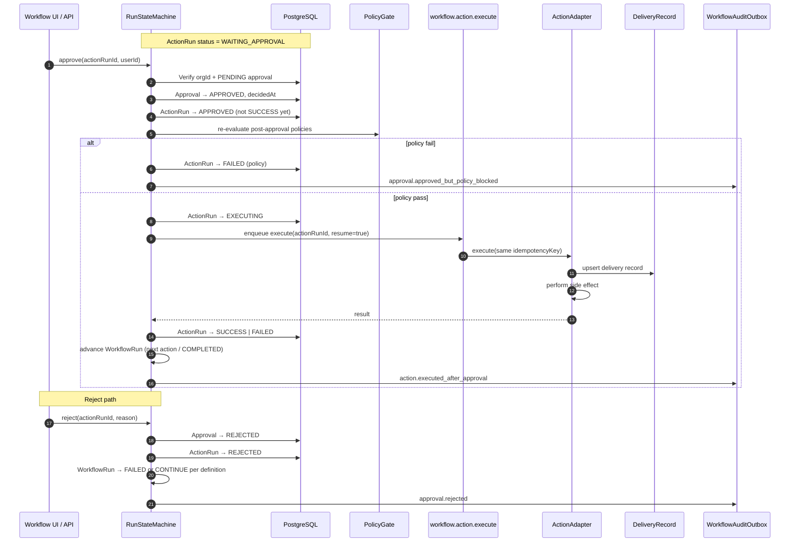

# ADR: SynqDrive Workflow Automation Runtime

| Field | Value |
|-------|-------|
| **ADR ID** | `ADR-WORKFLOW-AUTOMATION-RUNTIME-2026-07` |
| **Status** | **Accepted** |
| **Date** | 2026-07-24 |
| **Phase** | Production-Readiness Überarbeitung — Phase 1, Prompt 2 |
| **Deciders** | SynqDrive Platform Architecture (Cloud Agent remediation track) |
| **Baseline** | [`docs/audits/workflow-automation-runtime-baseline-2026-07.md`](../audits/workflow-automation-runtime-baseline-2026-07.md) |
| **Supersedes** | Keine formale ADR; ersetzt implizit parallele Ist-Architekturen als Zielbild |

---

## Status

**Accepted** — verbindliches Zielbild für alle nachfolgenden Implementierungs-Prompts der Workflow-Automation-Production-Readiness.  
**Kein produktiver Code in diesem Prompt geändert.**

---

## Kontext

SynqDrive betreibt heute **vier parallele Automations- und Kommunikationsschichten** (Baseline §1):

| Ist-Schicht | Reifegrad | Kernproblem |
|-------------|-----------|-------------|
| Task Automation (code-defined catalog) | Produktiv | Kein User-Workflow-Modell; direkte Service-Aufrufe + eigene Outbox |
| OrgWorkflow Engine (user-defined) | Teilweise | Fire-and-forget Events; Stubs; Approval ohne Resume |
| Notification Engine V2 | Flag-gated | Parallele Event-Registry; V1 ActionQueue noch aktiv |
| Kommunikations-Stacks (E-Mail, WhatsApp, Voice) | Fragmentiert | Direkte Provider-Kopplung in Fachmodulen |

Die Baseline dokumentiert **136 bestandene Automation-Tests**, aber **kein einheitlicher Event→Action-Pfad** und **keine kanonische Delivery-Orchestrierung**.

**Externe Rahmenbedingungen (keine Zertifizierungsbehauptung):**

- **DSGVO:** Tenant-Isolation, Consent-Modelle (`WhatsAppConsent`), Retention/Legal Hold vorhanden — müssen in Workflow-Pfade durchgängig werden.
- **ISO/IEC 27001 / 27701:** Durable Audit Outboxes (IAM, Business) existieren; Workflow-Automation muss gleiches Zuverlässigkeitsniveau erreichen.
- **AI Governance:** Destruktive AI-Actions blockiert (`APPROVAL_REQUIRED_ACTIONS`); Voice MCP hat separates Approval — muss konsolidiert werden.

---

## Problem

1. **Keine kanonische Workflow Runtime** — zwei generische Engines (OrgWorkflow + Task Automation) mit überlappenden Seiteneffekten (`OrgTask`).
2. **Events nicht atomar** — `WorkflowEventService.scheduleEmit()` ist fire-and-forget, nicht transaktional (Baseline P0-4).
3. **Actions ohne echte Delivery** — `notification.prepare`, `ai.suggest_action` sind Stubs; Nutzer erwarten Versand.
4. **Approval ohne Execution** — `executedAfterApproval: false` (Baseline P0-3).
5. **Provider-Direktaufrufe** — Billing/Payment/Documents/WhatsApp/Voice umgehen jede zentrale Action-Schicht.
6. **Konkurrierende Event-Definitionen** — z. B. `invoice.overdue` (Workflow), `INVOICE_OVERDUE` (Notification), `billing.invoice.overdue` (Billing Outbox).
7. **Kein einheitliches Idempotenz-, Retry- und DLQ-Modell** über alle Automation-Pfade.

**Ziel:** Eine **einzige kanonische Workflow Runtime** mit dem verbindlichen Fluss:

```
Domain Event
  → Transactional Outbox
  → Event Dispatcher
  → Workflow Matcher
  → Workflow Run State Machine
  → Action Registry
  → Provider oder interner Action Adapter
  → Delivery Result
  → Audit und Monitoring
```

---

## Geprüfte Alternativen

### Alternative A — OrgWorkflow Engine ausbauen, Rest deprecaten

**Beschreibung:** Bestehende `backend/src/modules/workflows/` zur vollständigen Runtime machen; Task Automation schrittweise durch Workflow-Templates ersetzen.

| Pro | Contra |
|-----|--------|
| UI und CRUD existieren | Heute nur 2/8 Trigger verdrahtet |
| `OrgWorkflow*` Tabellen vorhanden | Approval/Action-Executor unreif |
| Geringerer UI-Bruch | Muss viel Engine-Logik nachrüsten |

### Alternative B — Task Automation als primäre Engine

**Beschreibung:** Code-defined Catalog bleibt SSOT; OrgWorkflow wird entfernt oder auf reine Visualisierung reduziert.

| Pro | Contra |
|-----|--------|
| Produktionsreif, getestet | Kein User-defined Workflow-Modell |
| Outbox + Dedup bewährt | Widerspricht Produkt-Vision (Workflow Automation UI) |
| | Erfordert Code-Deploy für jede Regeländerung |

### Alternative C — Notification Engine V2 als Orchestrator

**Beschreibung:** Notification Inbox wird zentrale Automation; Workflows sind Projektionen von Notifications.

| Pro | Contra |
|-----|--------|
| Starke In-App-Delivery | Notifications ≠ allgemeine Actions (Vehicle-Status, Tasks) |
| Registry mit 64 Event-Typen | Viele Events ohne Producer |
| | Vermischt Read-Model (Inbox) mit Write-Orchestrierung |

### Alternative D — Neues Microservice / zweite Workflow Engine

**Beschreibung:** Greenfield-Runtime neben NestJS-Monolith.

| Pro | Contra |
|-----|--------|
| Sauberes Design | **Verboten** durch Architekturregel „keine zweite parallele generische Workflow Engine“ |
| | Migrationsaufwand, verteilte Transaktionen |
| | Widerspricht „bestehende stabile Funktionalität migrationsfähig erhalten“ |

### Alternative E — **Gewählt: Evolve OrgWorkflow → kanonische Runtime; Task Automation als Adapter-Schicht**

**Beschreibung:** OrgWorkflow-Engine wird zur **einzigen generischen Workflow Runtime** ausgebaut. Task Automation, Notification Delivery und Kommunikations-Provider werden **Action Adapter** hinter einer **Action Registry**. Domain Events werden **nur noch über eine kanonische Transactional Outbox** eingespeist.

---

## Gewählte Entscheidung

**SynqDrive erhält genau eine kanonische Workflow Runtime** (`WorkflowRuntime`), implementiert als Evolution des bestehenden `workflows`-Moduls unter Beibehaltung des `OrgWorkflow`-Datenmodells (erweitert, nicht ersetzt).

**Kernprinzipien:**

1. **Ein Event-Eingang** — kanonische `DomainEventOutbox` (neu, org-scoped); keine fire-and-forget Emits aus Fachmodulen.
2. **Ein Matcher** — `WorkflowMatcher` evaluiert System-Templates + Org-Workflows gegen Event Registry.
3. **Ein Run-Lifecycle** — persistente State Machine (`OrgWorkflowRun` → erweitert).
4. **Eine Action Registry** — alle Seiteneffekte (Task, Notification, E-Mail, WhatsApp, SMS, Voice, Vehicle-Update) nur über registrierte Adapter.
5. **Task Automation bleibt** — als **System-Workflow-Templates** + **`task.materialize` Action Adapter**, nicht als parallele Engine.
6. **Notification Engine bleibt** — als **In-App/Delivery-Subystem** + **`notification.ingest` Action Adapter**; kein zweiter Orchestrator.
7. **Provider nur hinter Adaptern** — Fachmodule rufen keine Resend/Meta/Twilio/ElevenLabs APIs direkt auf (Zielzustand; Migration gestaffelt).

---

## Zielkomponenten und Zuständigkeiten

### 1. Kanonische Workflow Engine (`WorkflowRuntime`)

| Verantwortung | Details |
|---------------|---------|
| Workflow-Definition CRUD | `OrgWorkflow` — Draft/Published, versioniert, immutable nach Publish |
| Run-Orchestrierung | `OrgWorkflowRun`, `OrgWorkflowActionRun`, `OrgWorkflowApproval` |
| Condition Evaluation | Bestehend: `workflow-condition.evaluator.ts` — erweitern, nicht duplizieren |
| Scope Enforcement | `organizationId` + station/vehicle/territory — **fail-closed** |
| Simulation / Dry-Run | `runMode: SIMULATION` — keine Adapter-Seiteneffekte |
| System-Templates | Code-defined Workflows für Task-Automation-Regeln (s. Migration) |

**Nicht** Verantwortung der Engine: Provider-Protokolle, Inbox-Rendering, Fachberechnungen (Health, Pricing).

### 2. Event Registry (`WorkflowEventRegistry`)

| Verantwortung | Details |
|---------------|---------|
| Kanonische Domain-Event-Typen | Ein Namespace: `booking.*`, `vehicle.*`, `invoice.*`, `billing.*`, `connectivity.*`, … |
| Schema-Validierung | Payload-JSON-Schema pro Event-Typ; Version (`eventSchemaVersion`) |
| Producer-Registrierung | Welches Modul welches Event emittieren darf |
| Legacy-Aliase | Mapping `vehicle_returned` → `booking.returned` (bestehend) |
| Abgrenzung Notification Registry | Notification-`eventType` wird **Referenz**, nicht zweiter Trigger-Namespace — Workflow-Trigger **mappen** auf Domain Events oder Notification-Events via Registry-Link |

**Single Source of Truth für „was kann einen Workflow auslösen".**

Bestehende Dateien als Ausgangspunkt: `workflow.constants.ts` (8 Typen) → erweitern; Notification-Registry (`notification-event-registry.definitions.ts`) als **Katalog für Notification-Actions**, nicht als Workflow-SSOT.

### 3. Transactional Outbox (`DomainEventOutbox`)

| Verantwortung | Details |
|---------------|---------|
| Atomare Event-Persistenz | `enqueueInTransaction(tx, event)` in derselben DB-Transaktion wie Fach-Mutation |
| Idempotenz | Unique `(organizationId, idempotencyKey)` |
| Dispatch-Trigger | Nach Commit: Outbox-Poller → BullMQ `workflow.domain-event` Queue |
| Status | `PENDING → PROCESSING → DISPATCHED → DEAD_LETTER` |
| Kein In-Memory-only Event | Ersetzt `scheduleEmit()` |

**Bestehende Outbox-Muster übernehmen:** `TaskAutomationOutbox`, `BillingDomainEventOutbox`, `IamAuditOutbox` (Baseline §6).

**Abgrenzung:** Billing/Payment/IAM-Outboxen bleiben für **ihre Domänen** bestehen, **federn aber Domain Events in die kanonische Outbox** (Bridge-Consumer), statt parallele Workflow-Trigger zu definieren.

### 4. Event Dispatcher (`WorkflowEventDispatcher`)

| Verantwortung | Details |
|---------------|---------|
| Outbox lesen | Batch-Claim mit `FOR UPDATE SKIP LOCKED` |
| Event validieren | Gegen Event Registry |
| Matcher aufrufen | Tenant-scoped Workflow-Liste |
| Run anlegen | `OrgWorkflowRun` pro Match (oder dedupliziert) |
| Fehler | Retry mit Backoff; DLQ mit manuellem Replay |

### 5. Queue Workers (`WorkflowWorker`)

| Verantwortung | Details |
|---------------|---------|
| Async Phasen | Domain-Event-Dispatch, Action-Execution, Timer-Fire, Delivery-Retry |
| BullMQ Queues (neu/umbenannt) | `workflow.domain-event`, `workflow.action.execute`, `workflow.timer.fire` |
| Bestehende Queues | `task.automation` → **deprecated**, migriert zu `workflow.action.execute` |
| Worker-Gate | Weiterhin `RuntimeStatusRegistry` + Redis; kein stilles Skip ohne Metrik |
| Embedded Workers | Kurzfristig im API-Prozess (Ist); mittelfristig optional separierbar |

### 6. Action Registry (`WorkflowActionRegistry`)

| Verantwortung | Details |
|---------------|---------|
| Action-Typ-Katalog | `task.materialize`, `task.create`, `vehicle.status.update`, `notification.ingest`, `channel.email.send`, `channel.whatsapp.send`, `channel.sms.send`, `voice.call.initiate`, `workflow.approval.request`, `ai.suggest`, … |
| Adapter-Binding | Jeder Action-Typ → genau ein Adapter |
| Policy Hooks | Pre-execution: Tenant, Scope, Consent, Approval, Rate Limit |
| Idempotenz-Key-Template | Pro Action-Typ |
| Side-Effect-Klassifikation | `INTERNAL` (DB), `EXTERNAL` (Provider), `HUMAN` (Approval) |

**Verboten:** Fachmodule importieren Provider direkt (Architekturregel).

### 7. Action Adapter (intern + Provider)

| Adapter | Kapselt bestehendes Modul | Action-Typ |
|---------|---------------------------|------------|
| `TaskMaterializeAdapter` | `TaskAutomationService` + Catalog/Resolver | `task.materialize` |
| `TaskCreateAdapter` | `TasksService.upsertByDedup` | `task.create` |
| `VehicleStatusAdapter` | `prisma.vehicle.update` (scoped) | `vehicle.status.update` |
| `NotificationIngestAdapter` | `NotificationCoreService.ingestCandidate` | `notification.ingest` |
| `EmailDeliveryAdapter` | `OutboundEmailModule` / Resend | `channel.email.send` |
| `WhatsAppDeliveryAdapter` | `WhatsAppService` / Meta Cloud | `channel.whatsapp.send` |
| `SmsDeliveryAdapter` | Twilio SMS (neu) | `channel.sms.send` |
| `VoiceCallAdapter` | `VoiceCallOrchestrationService` | `voice.call.initiate` |
| `AiSuggestAdapter` | AI suggestion surface (kein auto-execute) | `ai.suggest` |

Jede **externe** Action persistiert `providerId`, `providerStatus`, `deliveryEvidence` in `OrgWorkflowActionRun.output` + `WorkflowDeliveryRecord` (neu).

### 8. Integration Task Automation

**Nicht entfernen — transformieren:**

| Behalten | Rolle in Zielarchitektur |
|----------|-------------------------|
| `task-automation-rule.catalog.ts` | Wird **System-Workflow-Template-Quelle** (21 Regeln) |
| `task-automation-rule-resolver.service.ts` | Org-Overrides → Template-Parameter |
| `booking-pickup-return-timing.rules.ts` | **Fälligkeitslogik** im `TaskMaterializeAdapter` |
| `booking-preparation-timing.rules.ts` | wie oben |
| `task-automation-outbox` Retry/DLQ | Muster → kanonische Action-Execution-Outbox |
| `TaskAutomationAdminController` | UI für System-Template-Overrides (Permission `workflow-automation`) |
| Integrationstests | Golden Master für `task.materialize` Adapter |

**Migration:** Direkte `taskAutomation.*()`-Aufrufe in `BookingsService` werden zu `DomainEventOutbox.enqueue(booking.confirmed)` etc.; System-Workflow matched und ruft `task.materialize` mit `ruleId` auf.

**Parallelbetrieb:** Feature-Flag `WORKFLOW_RUNTIME_TASK_BRIDGE=shadow|on` — Shadow vergleicht Legacy vs. Runtime-Output.

### 9. Integration Notification Engine

| Behalten | Rolle |
|----------|-------|
| `NotificationCoreService` | In-App Lifecycle (ingest, resolve, receipt) |
| `NotificationDeliveryOutbox` | E-Mail-Delivery-Retry — wird **intern vom `EmailDeliveryAdapter`** genutzt |
| `notification-event-registry` | **Delivery-/Inbox-Metadaten** (titleKey, severity, CTA) |
| V2 REST API + Frontend Panel | Read-Model für Operatoren |
| `UserNotificationPreference` | Delivery Policy Input |

**Workflow-Action `notification.ingest`:** Erzeugt/aktualisiert `Notification`-Rows; **kein** direkter E-Mail-Versand in dieser Action (Separation: Ingest vs. Channel Delivery).

**V1 ActionQueue:** Wird nach V2-Cutover abgelöst (bestehender Plan `docs/notification-engine-frontend-cutover.md`).

**Kein zweiter Orchestrator:** Notification Engine reagiert auf Workflow-Actions, emittiert **keine** parallelen Workflow-Runs (außer explizit als Domain-Event-Producer registriert).

### 10. Integration E-Mail, WhatsApp, SMS, Voice AI

| Kanal | Ist | Ziel |
|-------|-----|------|
| **E-Mail** | 5+ parallele Pipelines (Notification, Billing, Payment, Documents, Invite) | Alle **externen** Sends über `channel.email.send` Adapter → `OutboundEmail` |
| **WhatsApp** | `whatsapp-booking-reminder.service.ts` direkt | `channel.whatsapp.send` Adapter; Consent-Check via `WhatsAppConsent` |
| **SMS** | Nicht implementiert | `channel.sms.send` via Twilio; hinter Feature-Flag |
| **Voice AI** | Separater Stack (Twilio + ElevenLabs + MCP) | `voice.call.initiate` Adapter |

**Billing/Payment-E-Mail:** Kurzfristig Bridge-Adapter; mittelfristig Billing-Consumer ruft `notification.ingest` + `channel.email.send` statt eigener Pipeline.

### 11. Rolle SynqDrive Voice Orchestrator

`VoiceCallOrchestrationService` bleibt **spezialisierte Sub-Runtime** für Echtzeit-Telefonie (Twilio ↔ ElevenLabs ↔ MCP).

| Aspekt | Entscheidung |
|--------|--------------|
| Workflow-Integration | Workflow kann `voice.call.initiate` auslösen → Orchestrator übernimmt Call-Lifecycle |
| MCP Tool Approvals | `VoiceApprovalRequest` wird **federated** in `OrgWorkflowApproval` gespiegelt (gleiche Resume-Semantik) |
| Nicht Zuständigkeit | Voice ersetzt nicht Workflow Run State Machine für asynchrone Actions |
| Webhook-Ingestion | Bestehend: `voice.webhook.process` Queue — Ergebnisse als Domain Events (`voice.call.completed`) in Outbox |

### 12. Approval- und Resume-Modell

**Ist-Defekt (Baseline P0-3):** Approve setzt `SUCCESS` ohne Re-Execution.

**Ziel:**

```
Action requires approval
  → ActionRun: WAITING_APPROVAL
  → OrgWorkflowApproval: PENDING
  → Human approves
  → ActionRun: APPROVED → EXECUTING
  → Adapter executes (idempotent)
  → ActionRun: SUCCESS | FAILED
  → WorkflowRun: advance | WAITING | COMPLETED
```

| Regel | Detail |
|-------|--------|
| Resume ist persistent | Approval-Entscheidung überlebt Prozess-Neustart |
| Re-Execution idempotent | Gleicher `idempotencyKey` wie pre-approval |
| Reject | `ActionRun: REJECTED`; WorkflowRun gemäß Policy (abort / continue) |
| Timeout | Timer-Action `approval.expired` |
| AI-destructive Actions | Immer `requiresApproval: true`; niemals auto-execute |

### 13. Versionierungsmodell

| Zustand | Verhalten |
|---------|-----------|
| `DRAFT` | Editierbar; Simulation erlaubt |
| `PUBLISHED` | **Immutable** — Änderungen nur via neue Version (`version++`) |
| `DEPRECATED` | Keine neuen Runs; laufende Runs werden fertiggestellt |
| `ARCHIVED` | Read-only Historie |

`OrgWorkflowRun` speichert `workflowVersion` (bestehend). Published Snapshots werden als JSON-Snapshot oder separate `org_workflow_versions`-Tabelle materialisiert (Implementierungsdetail Phase 2).

### 14. Mandantenmodell

| Regel | Enforcement |
|-------|-------------|
| Jedes Event, Run, Action, Outbox-Row hat `organizationId` NOT NULL | DB + Application |
| Matcher lädt nur Workflows der Event-Org | Query-Filter |
| Scope (station/vehicle/territory) fail-closed | Kein Match → kein Run (nicht org-weit eskalieren) |
| Cross-Tenant-ID in Payload | Validator lehnt ab |
| API | `OrgScopingGuard` + `PermissionsGuard` vereinheitlichen (heute Workflows=Roles, TaskAutomation=Permissions) |

### 15. Idempotenzmodell

| Ebene | Schlüssel |
|-------|-----------|
| Domain Event | `{organizationId}:{eventType}:{entityType}:{entityId}:{occurredAt|monotonicVersion}` |
| Workflow Run | `{domainEventId}:{workflowId}:{workflowVersion}` |
| Action Run | `{workflowRunId}:{actionIndex}:{actionType}:{targetEntityId}` |
| External Delivery | Provider-spezifisch + `OutboundEmail.id` / `WhatsAppMessage.id` / `VoiceConversation.id` |

**Bestehende Muster übernehmen:** `TaskAutomationOutbox.idempotencyKey`, `Notification`-Fingerprint, `BillingDomainEventOutbox.idempotencyKey`.

### 16. Retry- und Dead-Letter-Modell

| Schicht | Retry | DLQ |
|---------|-------|-----|
| Domain Event Outbox | Exponential Backoff, max 5 | `DEAD_LETTER` + Admin Replay API |
| Action Execution | BullMQ 3–5 attempts + Outbox | `OrgWorkflowActionRun: DEAD_LETTER` |
| External Delivery | Adapter-delegiert an Channel-Outbox | Delivery Record + Alert |

**Metriken:** `synqdrive_workflow_*` (neu), bestehende Outbox-Alerts erweitern (`backend/monitoring/prometheus/alerts.yml`).

### 17. Timer- und Delay-Modell

| Typ | Mechanismus |
|-----|-------------|
| Relative Delay | `workflow.timer` Row: `fireAt = now + delay`; Poller → `workflow.timer.fire` Queue |
| Absolute Schedule | Cron-Expression an Workflow-Definition (nur PUBLISHED) |
| Fälligkeits-Offsets | Task-Automation-Timing-Regeln bleiben im `TaskMaterializeAdapter` (bestehende `booking-*-timing.rules.ts`) |
| Approval Timeout | Timer linked to `OrgWorkflowApproval` |

**Kein In-Memory-`setTimeout`** für Workflow-Fortschritt.

### 18. Policy- und Compliance-Prüfung

Pre-Execution Pipeline (`WorkflowPolicyGate`):

1. **Tenant & Scope** — fail-closed
2. **Role / Permission** — wer darf Action auslösen
3. **Consent** — WhatsApp/SMS/E-Mail an Endkunden (`WhatsAppConsent`, `UserNotificationPreference`)
4. **Legal Hold / Retention** — keine Lösch-Actions bei Hold
5. **Rate Limits** — Voice budget, E-Mail rate, WhatsApp template policy
6. **AI Governance** — blockierte Action-Typen (`invoice.charge`, `booking.cancel`, `ai.execute`)
7. **Dry-Run / Simulation** — Policy-Gate läuft, Adapter wird nicht aufgerufen

### 19. Audit- und Observability-Modell

| Ereignis | Ziel |
|----------|------|
| Domain Event enqueued | `WorkflowAuditOutbox` → `ActivityLog` |
| Run state transition | `OrgWorkflowRun` + Audit Event |
| Action executed | `OrgWorkflowActionRun` + Delivery Record |
| Approval decided | `OrgWorkflowApproval` + IAM-style audit |
| External delivery | `OutboundEmail` / Provider webhook correlation |

**Kein fire-and-forget Audit** für kritische Workflow-Mutationen — `WorkflowAuditOutbox` folgt IAM/Business-Audit-Muster.

**Observability:** Structured logs mit `correlationId`, `workflowRunId`, `organizationId`; Prometheus counters/histograms; Grafana Dashboard (Phase 3).

### 20. Feature-Flag- und Rollout-Modell

| Flag | Stufen | Zweck |
|------|--------|-------|
| `WORKFLOW_RUNTIME_ENABLED` | `off` → `shadow` → `on` | Master gate |
| `WORKFLOW_RUNTIME_DOMAIN_EVENTS` | per event type | Gradueller Producer-Cutover |
| `WORKFLOW_RUNTIME_TASK_BRIDGE` | `shadow` → `on` | Task Automation Migration |
| `WORKFLOW_RUNTIME_ACTION_*` | per action adapter | Channel rollout |
| `NOTIFICATIONS_V2` / `VITE_NOTIFICATIONS_V2` | bestehend | Inbox cutover parallel |
| `WORKFLOW_RUNTIME_SIMULATION_DEFAULT` | bool | Org-Admin Dry-Run default |

**Shadow Mode:** Runtime führt Matcher + Condition eval durch, persistiert **Shadow Runs** (`runMode: SHADOW`) ohne Adapter-Seiteneffekte; Vergleich mit Legacy in Logs/Metriken.

---

## Verbindliche Architekturregeln (Normativ)

1. Keine Fachlogik darf Provider direkt aufrufen.
2. Kein Workflow darf ausschließlich im Arbeitsspeicher existieren.
3. Keine externe Action ohne persistente Action-Ausführung (`OrgWorkflowActionRun` + Delivery Record).
4. Keine Ausführung ohne `organizationId`.
5. Scope-Prüfung muss fail-closed sein.
6. Veröffentlichte Workflow-Versionen sind unveränderlich.
7. Tests und Simulationen dürfen keine echten Seiteneffekte verursachen.
8. Provider-Secrets dürfen nicht in Workflow-Definitionen gespeichert werden.
9. Jede externe Action benötigt Provider-ID, Status und Delivery-Nachweis.
10. Keine zweite parallele generische Workflow Engine.
11. Bestehende stabile Funktionalität muss migrationsfähig erhalten bleiben.

---

## Mermaid — Komponentendiagramm



---

## Sequenzdiagramm — Domain Event bis Action



---

## Sequenzdiagramm — Approval und Resume



---

## Datenverantwortlichkeiten

| Daten | Owner (SSOT) | Konsumenten |
|-------|--------------|-------------|
| Domain Event Typen + Schema | `WorkflowEventRegistry` | Dispatcher, Matcher, Producers |
| Event Enqueue / Dispatch Status | `DomainEventOutbox` | Dispatcher, Monitoring |
| Workflow Definition | `OrgWorkflow` (+ Version Snapshot) | Matcher, UI, API |
| Run Lifecycle | `OrgWorkflowRun` | UI, Monitoring, Audit |
| Action Execution State | `OrgWorkflowActionRun` | UI, Retry, Audit |
| Human Approval | `OrgWorkflowApproval` | UI, Resume, Audit |
| External Delivery Proof | `WorkflowDeliveryRecord` (neu) | Audit, Support, Compliance |
| Task Instances | `OrgTask` | Tasks UI, Task Domain V2 |
| In-App Notifications | `Notification` | Notification Panel V2 |
| E-Mail Send Log | `OutboundEmail` | Resend webhooks, Billing audit |
| System Template Catalog | `task-automation-rule.catalog.ts` → `SystemWorkflowTemplateRegistry` | Matcher, Admin UI |
| Org Template Overrides | `OrgTaskAutomationRuleOverride` | Resolver → Template Params |

---

## Mandantenschutz

| Kontrolle | Implementierung |
|-----------|-----------------|
| API Tenant Binding | `OrgScopingGuard` auf allen Workflow/Automation Endpoints |
| DB Isolation | `organizationId` in allen Queries; unique constraints scoped |
| Scope Fail-Closed | Station/Vehicle/Territory Mismatch → Workflow skipped, nicht broadened |
| Permission Model | Vereinheitlichung auf `workflow-automation` Permission (+ Role fallback für Master) |
| Cross-Tenant Payload | Event Validator rejects foreign entity IDs |
| Audit | Tenant in jedem Audit Record; kein org-übergreifendes Replay |
| Secrets | Nur in Runtime Secret / Env — nie in `OrgWorkflow.actions` JSON |

---

## Sicherheitsgrenzen

| Grenze | Regel |
|--------|-------|
| Destruktive Actions | `invoice.charge`, `booking.cancel`, `ai.execute`, `customer.contact.send` — blockiert oder Approval-only |
| Provider Credentials | Nur in Adapter-Layer; Rotation ohne Workflow-Republish |
| PII in Event Payload | Minimal (IDs + non-sensitive metadata); keine Tokens |
| Webhook Ingestion | Separate Inboxes (Voice, DIMO, Stripe) → normalisiert zu Domain Events |
| AI Voice MCP | Tool execution weiterhin über Voice Protection; Workflow spiegelt Approvals |
| Simulation | Kein Provider-Call; erkennbar in UI (`runMode`) |
| Rate Limiting | Voice budget, E-Mail send limits, WhatsApp template compliance |

---

## Migrationsstrategie

### Phase M0 — Foundation (kein Verhaltenwechsel)

- `DomainEventOutbox` Schema + Repository (analog `TaskAutomationOutbox`)
- `WorkflowEventRegistry` erweitern
- `WorkflowAuditOutbox` einführen
- Feature Flags registrieren
- **Legacy-Pfade unverändert**

### Phase M1 — Shadow Domain Events

- Producer-Bridges: `bookings-handover` → Outbox statt `scheduleEmit` (Shadow: beide Pfade, Legacy bleibt aktiv)
- Dispatcher + Matcher in Shadow (`runMode: SHADOW`)
- Metriken: Legacy vs Shadow Diff

### Phase M2 — Task Automation Bridge

- System-Workflow-Templates aus Catalog generieren
- `TaskMaterializeAdapter` kapselt `TaskAutomationService`
- `WORKFLOW_RUNTIME_TASK_BRIDGE=shadow` → `on`
- `TaskAutomationOutbox` → deprecated; Reads für DLQ-Replay behalten

### Phase M3 — Action Registry + Approval Fix

- Action Adapter für `task.create`, `vehicle.status.update`, `notification.ingest`
- Approval Resume implementieren (P0-3 Fix)
- Stub-Actions (`notification.prepare`) → echte `notification.ingest` + optional `channel.email.send`

### Phase M4 — Channel Consolidation

- Billing/Payment/Document E-Mail → `EmailDeliveryAdapter`
- WhatsApp → `WhatsAppDeliveryAdapter`; `WhatsAppAutomationHooksService` deprecated
- SMS Adapter (neu, feature-flagged)

### Phase M5 — Notification / V1 Cutover

- `NOTIFICATIONS_V2` + `VITE_NOTIFICATIONS_V2=on` in Prod (nach VPS-Verifikation)
- ActionQueue V1 entfernen (separater Track)

### Phase M6 — Voice Federation

- `voice.call.initiate` Workflow Action
- `VoiceApprovalRequest` ↔ `OrgWorkflowApproval` Spiegelung

**Rollback:** Jede Phase per Feature-Flag revertierbar; Legacy-Code bleibt bis M5/M6 deprecated, nicht gelöscht.

---

## Konsequenzen

### Positiv

- Einheitlicher Event→Action-Pfad; operatives Debugging an einer Stelle
- Transaktionale Events eliminieren P0-4 (Event-Verlust)
- Task Automation bleibt als bewährte Fachlogik erhalten
- Notification Engine bleibt spezialisiertes Inbox/Delivery-Read-Model
- Compliance-fähiger Audit-Pfad für Automation
- Approval-Resume wird korrekt und idempotent

### Negativ / Kosten

- Migration ist mehrphasig und erfordert Shadow-Betrieb
- Kurzfristig mehr Persistenz (Domain Event Outbox, Delivery Records)
- Team muss Event Registry diszipliniert pflegen
- Billing/Payment-Entkopplung von direkten E-Mail-Sends erfordert sorgfältige Regression

### Risiken

- Big-Bang-Gefahr bei zu schnellem Flag-Cutover → durch Shadow-Flags mitigiert
- Performance: zusätzliche Outbox-Polls → Batch + Index-Tuning nötig
- VPS-Flag-Zustand unbekannt → Phase M1 blockiert bis Verifikation

---

## Ausdrücklich verworfene Ansätze

| Ansatz | Grund |
|--------|-------|
| Task Automation als einzige Engine | Kein User-Workflow-Produkt; widerspricht UI-Investition |
| Notification Engine als Orchestrator | Vermischt Inbox-Read-Model mit Action-Orchestrierung |
| Zweite Workflow Engine / Microservice | Architekturregel; Migrationskosten |
| Fire-and-forget `scheduleEmit` beibehalten | P0-4 Event-Verlust |
| Stub-Actions dauerhaft belassen | P0-2 Nutzererwartung |
| Approval ohne Resume | P0-3 produktionsuntauglich |
| Provider-Direktaufrufe in Fachmodulen | Architekturregel |
| Blindes Löschen von Task Automation | Verliert 136+ Tests und produktive Booking-Automation |
| Geofence/Schedule UI ohne Backend-Registry | P1-1 — nur nach Registry-Aufnahme erlaubt |
| Secrets in Workflow JSON | Architekturregel |

---

## Definition of Done (für die Gesamt-Production-Readiness der Workflow Runtime)

Die Workflow Runtime gilt als **production-ready**, wenn alle Punkte erfüllt sind:

### Architektur & Daten

- [ ] `DomainEventOutbox` ist einziger Eingang für Workflow-relevante Domain Events aus Fachmodulen
- [ ] Kein produktiver `scheduleEmit()`-Pfad mehr
- [ ] `WorkflowEventRegistry` dokumentiert alle produktiven Event-Typen mit Schema-Version
- [ ] `OrgWorkflow` PUBLISHED-Versionen sind immutable
- [ ] `WorkflowDeliveryRecord` existiert für jede externe Action mit Provider-ID und Status

### Funktional

- [ ] Alle Baseline-P0-Befunde (P0-1…P0-6) sind behoben oder durch Migration ersetzt
- [ ] Approval→Resume führt Action idempotent aus
- [ ] Simulation/Shadow erzeugen keine Provider-Seiteneffekte
- [ ] Task Automation läuft über `task.materialize` Adapter (Bridge-Flag `on`)
- [ ] Mindestens Booking-Lifecycle-Events (`booking.confirmed`, `booking.returned`, `booking.completed`, `booking.cancelled`) produktiv in Outbox

### Sicherheit & Compliance

- [ ] Scope-Prüfung fail-closed mit dedizierten Tests
- [ ] Cross-Tenant-Isolation-Tests für Dispatcher, Matcher, Adapter
- [ ] Consent-Checks für WhatsApp/E-Mail an Endkunden
- [ ] `WorkflowAuditOutbox` für kritische Transitionen (kein silent drop)
- [ ] Destruktive Actions blockiert oder Approval-only

### Observability

- [ ] Prometheus-Metriken: outbox lag, run duration, action failure rate, DLQ depth
- [ ] Alerts für DLQ > 0 (kritische Orgs)
- [ ] `correlationId` durchgängig in Logs

### Tests

- [ ] Integration: Event → Outbox → Dispatcher → Matcher → Action → Delivery
- [ ] Integration: Approval → Resume → Idempotent Execute
- [ ] Regression: bestehende `booking-task.pipeline.integration.spec.ts` grün via Adapter
- [ ] Frontend: Workflow UI zeigt nur Registry-validierte Trigger
- [ ] E2E: mindestens ein End-to-End Booking-Return-Workflow in Staging

### Rollout

- [ ] VPS-Flags verifiziert (`WORKFLOW_RUNTIME_*`, `NOTIFICATIONS_V2`)
- [ ] Shadow-Phase abgeschlossen mit akzeptabler Diff-Rate
- [ ] Runbook für DLQ-Replay und Flag-Rollback dokumentiert

---

## Referenzen

| Dokument / Pfad | Relevanz |
|-----------------|----------|
| [`docs/audits/workflow-automation-runtime-baseline-2026-07.md`](../audits/workflow-automation-runtime-baseline-2026-07.md) | Ist-Zustand |
| `backend/src/modules/workflows/` | Bestehende Engine |
| `backend/src/modules/tasks/automation/task-automation-rule.catalog.ts` | System-Templates |
| `backend/src/modules/notifications/` | Inbox + Delivery |
| `architecture/BUSINESS_AUDIT_OUTBOX_2026-07-23.md` | Outbox-Muster |
| `architecture/IAM_TRANSACTIONAL_AUDIT_OUTBOX_2026-07-21.md` | Outbox-Muster |
| `docs/notification-engine-frontend-cutover.md` | Notification V1→V2 |
| `docs/task-automation-outbox-ops.md` | Retry/DLQ Ops |

---

*ADR erstellt auf Basis des belegten Ist-Zustands. Keine produktiven Codeänderungen in diesem Prompt.*
