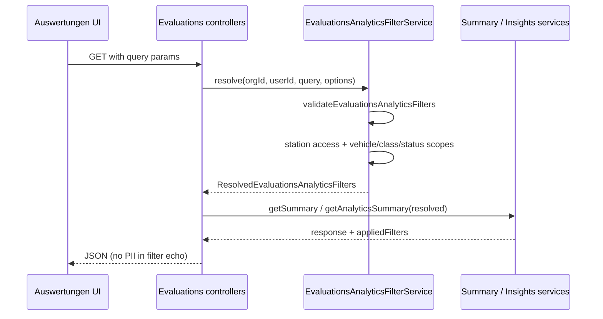

# Evaluations Analytics — Unified Filter Contract (Prompt 18/54)

## Purpose

All Auswertungen analytics surfaces (summary, insights, future charts/rankings/drill-downs) share one filter contract. Clients send URL-safe query parameters; the server validates, resolves tenant/station scopes, and applies typed Prisma predicates — never raw client-supplied `where` objects.

## Source of truth

| Layer | Location |
|-------|----------|
| Types | `shared/evaluations-insights/evaluations-analytics-filters.contract.ts` |
| Validation / URL / matching | `shared/evaluations-insights/evaluations-analytics-filters.ts` |
| Nest DTO + legacy aliases | `backend/src/modules/business-insights/dto/evaluations-analytics-filters.dto.ts` |
| Resolution + Prisma scopes | `backend/src/modules/business-insights/evaluations-analytics-filter.service.ts` |
| Frontend URL sync | `frontend/src/rental/hooks/useEvaluationsAnalyticsFilters.ts` |

## Supported filters

| Query param | Type | Notes |
|-------------|------|-------|
| `period` | `mtd` \| `last7d` \| `last30d` \| `custom` | Default `mtd` |
| `from`, `to` | ISO timestamps | Required when `period=custom`; max 366 days |
| `comparison` | `auto` \| `previous` \| `none` | Default `auto` |
| `stationId` | UUID | Scoped by `StationAccessService`; foreign station → `404` |
| `vehicleId` | UUID | Must belong to org + station scope |
| `vehicleClassId` | UUID | Maps to `Vehicle.rentalCategoryId` |
| `vehicleStatus` | `AVAILABLE` \| `RENTED` \| `IN_SERVICE` \| `OUT_OF_SERVICE` \| `RESERVED` | |
| `bookingChannel` | — | **Rejected** (`UNSUPPORTED_BOOKING_CHANNEL`) — not persisted on bookings |
| `bookingStatus` | Prisma `BookingStatus` enum values | |
| `customerSegment` | `INDIVIDUAL` \| `CORPORATE` | Via `customer.customerType` |
| `currency` | `EUR` | Only EUR supported |
| `riskCategory` | `BUSINESS_RISK` \| `REVENUE_LEAKAGE` | Insight dimension; legacy alias `category` |
| `insightStatus` | `critical` \| `warning` \| `opportunity` \| `info` | Legacy alias `severity` |
| `dataQualityStatus` | `OK` \| `PARTIAL` \| `STALE` \| `UNAVAILABLE` | Summary endpoint only for `OK`/`PARTIAL`/`UNAVAILABLE` |

## Request flow

## Resolved filter shape

`ResolvedEvaluationsAnalyticsFilters` adds server-only fields:

- `period` / `comparisonPeriod` — bounded ISO windows in org timezone
- `scopedVehicleIds` — intersection of station, class, status, and optional `vehicleId`
- `stationVehicleIds` — vehicles at selected station (when `stationId` set)

API responses echo `EvaluationsAnalyticsAppliedFilters` (serializable, no internal sets).

## Endpoints migrated (V4.9.816)

| Endpoint | Filter path |
|----------|-------------|
| `GET /organizations/:orgId/evaluations/analytics/summary` | `allowDataQualitySectionFilters: true` |
| `GET /organizations/:orgId/evaluations/insights/summary` | Standard insights filters |
| `GET /organizations/:orgId/evaluations/insights` | Standard + pagination/sort |

Charts, rankings, and drill-down endpoints are not implemented yet; they must import the same DTO and `EvaluationsAnalyticsFilterService.resolve()` when added.

## Error semantics

| Code | HTTP | When |
|------|------|------|
| `INVALID_ANALYTICS_FILTERS` | 400 | Validation errors (invalid UUID, period bounds, etc.) |
| `UNSUPPORTED_BOOKING_CHANNEL` | 400 | `bookingChannel` present |
| `UNSUPPORTED_FILTER_COMBINATION` | 400 | e.g. `vehicleId` incompatible with station/class/status |
| `UNSUPPORTED_CURRENCY` | 400 | Non-EUR currency |
| Station / vehicle / class not found | 404 | ID unknown or outside user station scope |

## URL sharing

- Serialize: `serializeFiltersToSearchParams()` — omits null/empty values
- Parse: `parseFiltersFromSearchParams()` — used on page load and `popstate`
- No customer names, emails, or free-text PII in query strings
- Rental Auswertungen page: `useEvaluationsAnalyticsFilters` syncs `window.location.search` and persists `stationId` in local storage (existing fleet dashboard key)

## Frontend behavior

- `EvaluationsAnalyticsFilterBar` — period, station, risk category, insight status (extensible)
- `useEvaluationsInsightsAnalytics` — clears summary/lists on filter change (`filterKey` dependency) before refetch
- `FinancialInsightsView` — hosts filter bar via `InsightsCockpit`; invoice charts still client-side (see limitations)

## Access control

- `StationAccessService.resolve()` limits readable stations per user membership
- `assertStationReadable()` on explicit `stationId`
- Vehicle queries always include `buildVehicleStationScopeWhere(access)`
- Foreign station UUID → `404` (not `403`) to avoid ID enumeration

## Tests

| Suite | Coverage |
|-------|----------|
| `shared/evaluations-insights/evaluations-analytics-filters.spec.ts` | Single filters, URL round-trip, timezone MTD, large custom range, bookingChannel |
| `backend/.../evaluations-analytics-filters.shared.spec.ts` | Backend import of shared validation |
| `backend/.../evaluations-analytics-filter.service.spec.ts` | Combined filters, foreign station, unsupported combinations, dataQuality on insights |
| `backend/.../evaluations-analytics-summary.service.spec.ts` | Summary with resolved filters |
| `backend/.../evaluations-analytics-summary.integration.spec.ts` | Performance + partial failure with resolved filters |

Run: `cd backend && npm run test:insights:analytics`

## Remaining limitations

1. **`bookingChannel`** — rejected until a canonical booking channel field exists in Prisma.
2. **Charts / rankings / drill-downs** — not built; contract is ready for them.
3. **Executive financial KPIs on Auswertungen** — `FinancialInsightsView` still aggregates invoices client-side; only the Insights cockpit uses the unified server filters today.
4. **Filter bar UI** — exposes subset of filters (period, station, risk category, insight status); remaining dimensions are API-ready.
5. **`dataQualityStatus` OK/PARTIAL/UNAVAILABLE** — post-filter on summary sections only; does not change upstream SQL for financial/booking aggregates yet.
