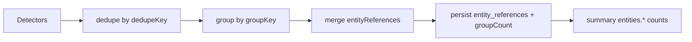

# Evaluations Insight Grouping & Entity Model (Prompt 16/54)

## Problem

Grouped insights collapsed multiple affected vehicles into a single `entityIds` array but KPIs and UI labels treated **one insight row** as **one affected vehicle**. A group of 20 idle vehicles appeared as a single business risk with `groupCount` derived from `entityIds.length` inconsistently.

Additionally, „Kritische Buchungen“ counted critical **insight groups** in the business-risk category instead of unique **booking** entities.

## Counting dimensions (separated)

| Metric | Meaning | Example |
|--------|---------|---------|
| `insightGroups` | Visible insight rows (after filters) | 1 grouped LOW_UTILIZATION card |
| `events` | Sum of merged source events (`groupedCount` / `eventCount`) | 20 idle vehicles merged → 20 |
| `affectedVehicles` | Unique `VEHICLE` entity references | 20 |
| `affectedBookings` | Unique `BOOKING` references | 3 overdue pickups |
| `affectedCustomers` | Unique `CUSTOMER` references | — |
| `affectedStations` | Unique `STATION` references | 2 shortages |
| `uniqueEntities` | Unique `(entityType, entityId)` pairs | deduped union |
| `criticalBookings` | Unique bookings in **CRITICAL** insights | not insight groups |
| `orgWideRisks` | Insight groups without booking reference | station shortage |
| `bookingScopedRisks` | Insight groups with booking reference | pickup overdue |
| `groupCount` (per insight) | Distinct entities in primary scope | 20 vehicles in group |

## Entity reference model

```typescript
interface InsightEntityReference {
  entityType: 'VEHICLE' | 'BOOKING' | 'CUSTOMER' | 'STATION' | 'ORGANIZATION';
  entityId: string;
  organizationId: string;
  stationId?: string | null;
  relationType: 'PRIMARY' | 'AFFECTED' | 'CONTEXT' | 'GROUP_MEMBER';
}
```

Shared implementation: `shared/evaluations-insights/insight-entity-references.ts`

### Rules

- References are **deduplicated** server-side by `(entityType, entityId, relationType)`.
- References with `organizationId !== requesting org` are **stripped** (no cross-tenant leakage).
- Legacy rows without `entity_references` JSON are reconstructed from `entityScope`, `entityIds`, `metrics.bookingId`, `metrics.bookingIds`, and `metrics.entities`.
- Grouping merges member references as `GROUP_MEMBER` and preserves `metrics.entities` for drill-down expansion.

## Data model changes

### Prisma `DashboardInsight`

| Field | Type | Purpose |
|-------|------|---------|
| `entityReferences` | `Json?` | Persisted typed references (new) |
| `groupCount` | `Int` | Distinct primary-scope entities (corrected semantics) |
| `isGrouped` | `Boolean` | `groupedCount > 1` or `groupCount > 1` |

Migration: `20260724110000_dashboard_insights_entity_references`

### API extensions

`DashboardInsightDto` / analytics summary:

```json
{
  "groupCount": 20,
  "entityReferences": [ { "entityType": "VEHICLE", "entityId": "…", … } ],
  "entityBreakdown": {
    "eventCount": 20,
    "groupCount": 20,
    "references": [ … ]
  },
  "counts": {
    "businessRisks": 1,
    "criticalBookings": 2,
    "entities": {
      "insightGroups": 1,
      "events": 20,
      "affectedVehicles": 20,
      …
    }
  }
}
```

## KPI corrections

| UI label | Counts | Unit |
|----------|--------|------|
| Geschäftsrisiken (Gruppen) | `businessRisks` | insight groups |
| Kritische Buchungen | `criticalBookings` | unique bookings |
| Umsatzverlust (Gruppen) | `revenueLeakage` | insight groups |

`criticalBusinessRisks` remains in API as deprecated alias of `criticalBookings`.

## Grouping pipeline



`InsightGroupingService.dedupeAndGroup(candidates, organizationId)` now requires org id for reference normalization.

## Drill-down

- Grouped insights retain `metrics.entities[]` per member (existing dashboard expansion).
- `GET …/evaluations/insights/:id` returns `entityBreakdown` with full reference list.
- Grouping does **not** block drill-down — references + entities payload preserved.

## Tests

```bash
cd backend && npm run test:insights:analytics
```

| Scenario | Assertion |
|----------|-----------|
| 1 insight, 1 vehicle | `groupCount=1`, 1 vehicle ref |
| 1 group, 20 vehicles | `affectedVehicles=20`, `insightGroups=1`, `events=20` |
| Overlapping groups | `uniqueEntities` dedupes shared vehicles |
| No direct entity | `insightGroups=1`, `affectedVehicles=0` |
| Cross-tenant refs | foreign `organizationId` stripped |
| Critical bookings | counts bookings only, not station-critical groups |
| Cross-station group | booking + vehicle refs preserved |

## Migration notes

1. Apply `20260724110000_dashboard_insights_entity_references` (additive JSONB column).
2. No backfill required — legacy insights use runtime reconstruction until next publish run refreshes `entity_references`.
3. Optional: trigger `POST /admin/business-insights/run/:orgId` per org to populate references immediately.

---

*Prompt 16/54 — 2026-07-24*
