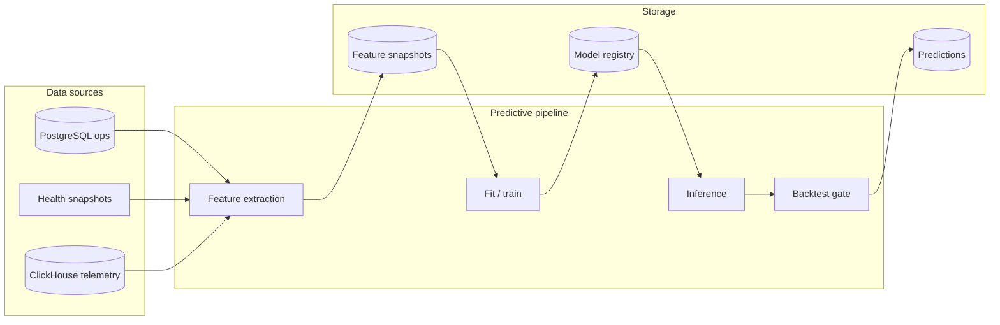
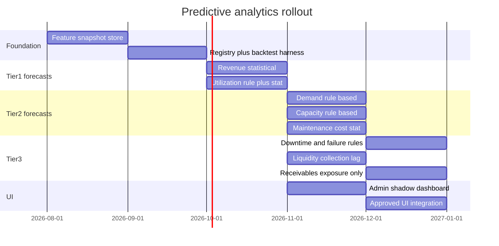

# Evaluations Predictive Analytics — Target Architecture (Prompt 40/54)

**Version:** `predictive-analytics-arch-v1` (design only — no production forecasts yet)  
**Status:** Architecture definition  
**Scope:** Auswertungen / business KPI forecasting for rental fleet operators  
**Principle:** No untested forecasts in production UI. Statistical baselines before ML. Tenant isolation mandatory.

---

## 1. Purpose and boundaries

SynqDrive already delivers **descriptive** analytics (`financial-summary-v1`, `utilization-model-v1`, `cost-model-v1`, strengths/weaknesses, recommendations, impact measurement). Prompt 40 defines the **predictive layer** that may be built on top — without introducing complex ML infrastructure where robust statistical baselines suffice.

### In scope

- Forward-looking KPI projections for fleet/rental operations
- Explicit inference tier per output (observed → rule → statistical → ML)
- Versioned models, backtesting gates, drift monitoring, rollback
- Org-scoped feature extraction, inference, and storage
- Explainability metadata for UI and audit

### Out of scope (v1 architecture)

- Cross-tenant training or pooled models
- Real-time sub-hour forecasting
- Causal attribution (“this campaign caused +12 % revenue”)
- Replacing existing descriptive KPIs with forecasts
- Production UI surfaces for forecasts until backtest + shadow period pass (see §8)

### Relationship to existing modules

| Existing module | Role in predictive layer |
|-----------------|--------------------------|
| `evaluations-analytics-summary` | Source of observed KPIs + filter contract |
| `utilization-model-v1` | Feature source; `BOOKED_NOT_REALIZED` = near-term demand signal |
| `cost-model-v1` | Maintenance cost actuals; gaps documented |
| `weakness-detection-v1` | `FORECAST` evidence kind reserved but unused |
| `evaluations-lineage-v1` | `DEMAND_FORECAST` listed under `sourcesWithoutLineage` |
| `evaluations-impact-measurement-v1` | Post-hoc correlation only — not forecasting |
| Vehicle health (tire/brake/battery) | Component-level rule/statistical horizons |
| ClickHouse telemetry | Trip/signal evidence — not business KPI warehouse today |

---

## 2. Inference tiers (mandatory classification)

Every predictive output MUST declare `inferenceTier`:

| Tier | Code | Definition | When to use |
|------|------|------------|-------------|
| **Observed value** | `OBSERVED` | Measured historical or point-in-time fact | Past periods, current open receivables |
| **Rule-based estimate** | `RULE_BASED` | Deterministic heuristic from known inputs | Pending bookings → near-term utilization; wear models → service horizon |
| **Statistical forecast** | `STATISTICAL` | Time-series or regression fit with documented method | Revenue/utilization seasonality when ≥12 months history |
| **ML forecast** | `ML` | Learned model (ensemble, gradient boosting, etc.) | Only after statistical baseline fails backtest gates AND data volume justifies complexity |

**UI rule:** Forecast badges (`evaluations.executiveKpi.forecastBadge`) MUST only appear when `inferenceTier ∈ {STATISTICAL, ML}` **and** `releaseStatus === 'APPROVED'`. Rule-based near-term signals use label **“Schätzung” / “Estimate”**, not “Prognose”.



---

## 3. Platform architecture

### 3.1 Feature pipeline

**Job type (proposed):** `EVALUATIONS_PREDICTIVE_FEATURE_BUILD`  
**Trigger:** nightly per org (configurable) + on-demand admin recalc  
**Input:** `ResolvedEvaluationsAnalyticsFilters` base scope (org, optional station/class)

| Stage | Responsibility |
|-------|----------------|
| Extract | SQL loaders from `Booking`, `OrgInvoice`, `ServiceCase`, `Vehicle`, health snapshots |
| Normalize | EUR currency filter (match v1 analytics), timezone = org default |
| Aggregate | Daily grain → weekly/monthly rollups per forecast target |
| Enrich | Calendar features (dow, month, DE school holidays proxy), lag features |
| Quality gate | Drop rows below coverage threshold; emit `dataQuality` flags |
| Persist | `OrgPredictiveFeatureSnapshot` (orgId, featureSetVersion, asOfDate, grain, payload JSON) |

**Tenant isolation:** `organizationId` on every row; queries always scoped. No cross-org feature matrices.

**Cost/runtime limits (v1):**

- Max history scan: 36 months per org per job
- Max vehicles in single fit: 500 (sample + weight for larger fleets)
- Job timeout: 10 min/org; skip org on timeout with audit event
- No ClickHouse full-scan in v1 feature pipeline (telemetry features deferred)

### 3.2 Training / fitting

| Tier | Fitting approach | Artifact |
|------|------------------|----------|
| RULE_BASED | No fit — versioned rule config | `rule-set-v{n}.json` |
| STATISTICAL | In-process fit (ETS, seasonal naive, Holt-Winters, simple ARIMA via established lib) | coefficients + hyperparams JSON |
| ML | Batch train (monthly max) — LightGBM/XGBoost or sklearn pipeline | model blob in object storage + manifest |

**No dedicated ML platform in v1.** Fitting runs in NestJS worker with `NODE_OPTIONS` memory cap; ML tier optional phase 3+.

### 3.3 Inference

- **Batch inference** (default): nightly after feature build → `OrgPredictiveForecast` rows
- **On-demand preview** (admin only): `POST …/evaluations/predictive/preview` — no UI for standard users until approved
- Each prediction carries: `forecastId`, `modelVersion`, `featureSetVersion`, `inferenceTier`, `pointEstimate`, `intervalLow`, `intervalHigh`, `confidence`, `explainability`, `suppressedReason` (if null output)

### 3.4 Storage (proposed Prisma models)

```
OrgPredictiveModelRegistry
  - organizationId, forecastKey, modelVersion, inferenceTier
  - trainingWindow, metricsJson, status (DRAFT|SHADOW|APPROVED|DEPRECATED|ROLLED_BACK)
  - artifactRef, createdAt, approvedAt, approvedByUserId

OrgPredictiveFeatureSnapshot
  - organizationId, featureSetVersion, grain, periodStart, payloadJson

OrgPredictiveForecast
  - organizationId, forecastKey, modelVersion, horizonEnd
  - pointEstimate, intervalLow, intervalHigh, currency?, unit
  - inferenceTier, confidence, explainabilityJson, lineageJson
  - generatedAt, expiresAt
```

Append-only `OrgPredictiveModelEvent` for train/backtest/approve/rollback audit (mirror `OrgRecommendationEvent` pattern).

### 3.5 Model versioning

- Semantic: `{forecast-key}-v{major}.{minor}` (e.g. `revenue-mtd-v1.0`)
- Breaking feature schema → major bump
- Every forecast row stores `modelVersion` + `featureSetVersion` + `calculationVersion` (= platform arch version)
- Reproducibility: frozen training window + git SHA of shared forecast module recorded in registry

### 3.6 Backtesting

**Gate before SHADOW or APPROVED:**

| Metric | Minimum for STATISTICAL | Minimum for ML |
|--------|-------------------------|----------------|
| History | ≥ defined per forecast (§4) | Same + 2× volume |
| Holdout | Rolling origin: last 3 months weekly | 6 months |
| MAPE / sMAPE | ≤ 25 % (revenue/utilization) or domain-specific | Must beat statistical baseline by ≥ 5 % relative |
| Coverage | ≥ 80 % of holdout points with prediction | Same |
| Bias | Mean error within ± 10 % of mean actual | Same |

Failed backtest → `status: DRAFT`; never surfaced in UI.

**Implementation:** `shared/evaluations-insights/predictive/` pure functions + `scripts/audits/predictive-backtest.ts` (mirror tire-health backtest pattern).

### 3.7 Drift monitoring

Weekly job `EVALUATIONS_PREDICTIVE_DRIFT_CHECK`:

- Compare last 4 weeks actuals vs forecast errors (MAPE, bias)
- Population stability on key features (booking count, fleet size)
- Alert thresholds: MAPE +50 % vs backtest baseline → `DRIFT_WARNING`; +100 % → auto `ROLLED_BACK`

Drift events → `OrgPredictiveModelEvent` + optional `DashboardInsight` type `PREDICTIVE_MODEL_DRIFT` (admin only).

### 3.8 Rollback

- Manual: admin sets registry `status: ROLLED_BACK`
- Automatic: drift critical or data-quality `ERROR` on input features
- Rollback serves **previous APPROVED version** or suppresses forecast entirely (prefer suppress over stale wrong forecast)

### 3.9 Explainability

| Tier | Minimum explainability |
|------|------------------------|
| OBSERVED | Source tables + period bounds (existing lineage) |
| RULE_BASED | Rule ID + input values (e.g. pending booking count) |
| STATISTICAL | Method name, seasonality period, last N actuals, trend component |
| ML | SHAP/top features OR mandatory fallback to statistical explanation if SHAP unavailable |

All tiers: `limitations[]`, `dataCoveragePercent`, correlation disclaimer when shown alongside recommendations.

### 3.10 Release lifecycle

```
DRAFT → SHADOW (compute but hide from standard UI) → APPROVED → DEPRECATED
                     ↘ ROLLED_BACK
```

**Hard rule:** `APPROVED` requires documented backtest report in repo (`docs/architecture/analytics/backtests/{forecast-key}-{version}.md`).

---

## 4. Forecast catalog

For each target: **Y** = target variable, **H** = horizon, **hist** = minimum history, **grain** = native granularity, **refresh** = inference cadence, **baseline** = first model to implement, **metric** = primary evaluation metric, **fallback** = when model unavailable, **suppress** = when no output.

Legend:  
🟢 = seriously feasible with current data  
🟡 = partially feasible (rule/statistical with limits)  
🔴 = not seriously feasible without new data sources

---

### 4.1 Demand (booking demand)

| Field | Specification |
|-------|---------------|
| Feasibility | 🟡 |
| **Y** | `booking_demand_count` — confirmed+pending booking starts per period |
| **H** | 7d, 30d (near-term); 90d (low confidence) |
| **Min history** | 90 days daily (STATISTICAL); 30 days (RULE_BASED only) |
| **Data sources** | `Booking` (startDate, status), `PricingQuote` (optional, not in v1) |
| **Grain** | Daily → sum to 7d/30d |
| **Refresh** | Daily |
| **Baseline** | **RULE_BASED:** pending+confirmed starts in window + historical conversion rate by DOW |
| **Upgrade** | STATISTICAL seasonal naive on completed+confirmed starts (monthly seasonality if ≥12 mo) |
| **Metric** | sMAPE, MAE (counts) |
| **Fallback** | Show observed trailing 30d average with `ESTIMATE` badge |
| **Suppress** | &lt; 30 days history; &lt; 50 % booking status coverage; fleet size &lt; 5 vehicles |

**Gaps:** No marketing funnel, no web traffic, no competitor pricing. Quotes not in evaluations pipeline.

---

### 4.2 Revenue

| Field | Specification |
|-------|---------------|
| Feasibility | 🟢 |
| **Y** | `revenue_minor` — issued outgoing invoice revenue OR completed booking revenue (config per org; default invoice ledger to match `financial-summary-v1`) |
| **H** | MTD remainder, 30d, 90d |
| **Min history** | 12 months monthly (STATISTICAL); 6 months (RULE_BASED trend only) |
| **Data sources** | `OrgInvoice` (OUTGOING, invoiceDate), `Booking.totalPriceCents` (completed) |
| **Grain** | Daily cash/issued; rollup monthly for seasonality |
| **Refresh** | Daily |
| **Baseline** | **STATISTICAL:** seasonal naive or Holt-Winters on monthly revenue |
| **Upgrade** | STATISTICAL regression on bookings count × avg revenue per booking |
| **ML** | Deferred — only if statistical MAPE &gt; 25 % with ≥ 24 mo data |
| **Metric** | MAPE, bias % |
| **Fallback** | Prior-year same-period × YTD growth factor (RULE_BASED, labeled estimate) |
| **Suppress** | &lt; 6 months history; &gt; 20 % invoices missing dates; multi-currency without EUR normalization |

---

### 4.3 Utilization

| Field | Specification |
|-------|---------------|
| Feasibility | 🟢 |
| **Y** | `utilization_percent` — time-weighted from `utilization-model-v1` |
| **H** | 7d, 30d |
| **Min history** | 60 days daily intervals (STATISTICAL); 14 days (RULE_BASED) |
| **Data sources** | `Booking` intervals, `ServiceCase` downtime, `Vehicle` scope |
| **Grain** | Daily fleet-aggregated utilization % |
| **Refresh** | Daily |
| **Baseline** | **RULE_BASED:** realized utilization + `BOOKED_NOT_REALIZED_TIME` share |
| **Upgrade** | STATISTICAL ETS on daily utilization series |
| **Metric** | MAPE (percentage points), coverage-weighted |
| **Fallback** | Trailing 14d median |
| **Suppress** | Overlapping booking data errors (`utilizationModel` PARTIAL with overlap); &lt; 10 vehicles without station filter |

**Note:** Near-term utilization is partly **observable** via confirmed bookings — distinguish forecast extension from booked pipeline.

---

### 4.4 Fleet capacity

| Field | Specification |
|-------|---------------|
| Feasibility | 🟡 |
| **Y** | `spare_vehicle_count` per station OR `capacity_headroom_hours` |
| **H** | 7d, 14d |
| **Min history** | 30 days (RULE_BASED); 90 days (STATISTICAL) |
| **Data sources** | `Vehicle`, `Booking` overlaps, `ServiceCase.blocksRental`, station grouping |
| **Grain** | Daily per station + fleet total |
| **Refresh** | Daily |
| **Baseline** | **RULE_BASED:** current fleet minus scheduled downtime minus confirmed bookings (interval overlap) |
| **Upgrade** | STATISTICAL on bottleneck frequency from `CAPACITY_BOTTLENECKS` metric history (requires feature snapshot store) |
| **Metric** | Hit rate (bottleneck occurred yes/no), MAE spare count |
| **Fallback** | Point-in-time fleet snapshot only (`OBSERVED`) |
| **Suppress** | No station assignment on &gt; 30 % vehicles; missing `homeStationId` |

---

### 4.5 Maintenance costs

| Field | Specification |
|-------|---------------|
| Feasibility | 🟡 |
| **Y** | `maintenance_cost_minor` — `UNPLANNED_MAINTENANCE_COSTS` + `DAMAGE_REPAIR_COSTS` |
| **H** | 30d, 90d |
| **Min history** | 12 months monthly |
| **Data sources** | `ServiceCase.actualCostCents`, `VehicleDamage.repairCostCents`, `OrgInvoice` (workshop vendors) |
| **Grain** | Monthly |
| **Refresh** | Weekly |
| **Baseline** | **STATISTICAL:** rolling median + trend on monthly actuals |
| **Upgrade** | RULE_BASED blend: scheduled service cases in horizon + health critical count × historical avg repair cost |
| **Metric** | MAPE (high variance expected — wide prediction intervals required) |
| **Fallback** | Trailing 3-month average (`ESTIMATE`) |
| **Suppress** | &lt; 10 service cases in 12 mo; &lt; 60 % cost field population |

**Gaps:** Tire/brake/battery costs not in cost-model buckets; health → finance bridge missing.

---

### 4.6 Vehicle failure (breakdown / immobilization)

| Field | Specification |
|-------|---------------|
| Feasibility | 🟡 (fleet aggregate) / 🔴 (per-vehicle ML) |
| **Y** | `breakdown_probability` or `expected_immobilization_count` per 30d |
| **H** | 14d, 30d |
| **Min history** | 6 months (RULE_BASED); 12 months + health snapshots (STATISTICAL) |
| **Data sources** | `ServiceCase` (REPAIR/DIAGNOSTIC), `RECURRING_VEHICLE_BREAKDOWNS` weakness inputs, health snapshots, optional telemetry freshness |
| **Grain** | Per vehicle → aggregate to fleet |
| **Refresh** | Weekly |
| **Baseline** | **RULE_BASED:** vehicles with critical health + recent unplanned downtime → elevated risk score (not probability calibrated) |
| **Upgrade** | STATISTICAL Poisson on fleet breakdown count per month |
| **ML** | Per-vehicle failure — **deferred** until status transition history + labeled failures exist |
| **Metric** | Brier score (if calibrated), recall@k for high-risk vehicles |
| **Fallback** | Weakness detector `RECURRING_VEHICLE_BREAKDOWNS` (OBSERVATION) |
| **Suppress** | &lt; 20 vehicles; health data on &lt; 50 % fleet; no ServiceCase linkage |

---

### 4.7 Downtime

| Field | Specification |
|-------|---------------|
| Feasibility | 🟡 |
| **Y** | `downtime_percent` or `downtime_hours` (planned + unplanned) |
| **H** | 30d |
| **Min history** | 90 days daily |
| **Data sources** | `ServiceCase.downtimeStart/End`, `Vehicle.status` fallback |
| **Grain** | Daily fleet-aggregated |
| **Refresh** | Daily |
| **Baseline** | **RULE_BASED:** scheduled service cases in horizon + trailing unplanned rate |
| **Upgrade** | STATISTICAL on monthly downtime % |
| **Metric** | MAPE on downtime % |
| **Fallback** | `utilization-model` `MAINTENANCE_TIME` trailing average |
| **Suppress** | &gt; 40 % IN_SERVICE without ServiceCase intervals (snapshot fallback dominates — lineage flags STALE) |

**Gap:** No historical status transition log — limits accuracy (documented in utilization model).

---

### 4.8 Receivables default (payment default risk)

| Field | Specification |
|-------|---------------|
| Feasibility | 🔴 (probability) / 🟡 (exposure amount) |
| **Y** | `default_exposure_minor` — open overdue weighted by aging bucket; NOT individual default probability |
| **H** | 30d, 90d |
| **Min history** | 12 months invoice payment behavior |
| **Data sources** | `OrgInvoice.outstandingCents`, `dueDate`, `paidAt`, `Customer.riskLevel` |
| **Grain** | Portfolio-level |
| **Refresh** | Weekly |
| **Baseline** | **RULE_BASED:** sum overdue + 30 % of due-within-30d (configurable aging weights) — exposure estimate, not PD model |
| **Upgrade** | STATISTICAL on historical overdue→write-off rate if write-off status tracked |
| **ML** | **Not recommended** until payment history features + labeled defaults ≥ 200 |
| **Metric** | Exposure MAE; calibration N/A for v1 |
| **Fallback** | Point-in-time `receivables` section (`OBSERVED`) |
| **Suppress** | &lt; 50 outgoing invoices lifetime; no `paidAt` on &gt; 40 % paid invoices |

**Critical:** Overdue receivables are **collection risk**, not revenue forecast — UI copy must match existing `evaluations.executiveKpi` receivables disclaimer.

---

### 4.9 Liquidity development

| Field | Specification |
|-------|---------------|
| Feasibility | 🟡 (indirect) / 🔴 (full cash forecast) |
| **Y** | `net_cash_in_minor` — paid revenue minus paid expenses in period |
| **H** | 30d, 90d |
| **Min history** | 12 months |
| **Data sources** | `OrgInvoice.paidAt`, `paidCents`, incoming/outgoing types; `PaymentTransaction` (if linked) |
| **Grain** | Weekly cash collection |
| **Refresh** | Weekly |
| **Baseline** | **STATISTICAL:** collection lag model — issued revenue × historical collection curve by week |
| **Upgrade** | RULE_BASED: scheduled incoming payments + known AP from incoming invoices |
| **Metric** | MAPE on weekly net cash |
| **Fallback** | `paidRevenueMtdMinor` observed only |
| **Suppress** | No AP/AR payment timestamps on &gt; 35 % volume; no bank/treasury data (full liquidity 🔴) |

**Gap:** No bank balances, payroll, or tax payment schedules — full liquidity forecast not serious.

---

## 5. Summary matrix

| Forecast | Feasibility | Recommended v1 tier | ML needed? |
|----------|-------------|---------------------|------------|
| Demand | 🟡 | RULE_BASED → STATISTICAL | No |
| Revenue | 🟢 | STATISTICAL | Only if baseline fails |
| Utilization | 🟢 | RULE_BASED + STATISTICAL | No |
| Fleet capacity | 🟡 | RULE_BASED | No |
| Maintenance costs | 🟡 | STATISTICAL (wide intervals) | No |
| Vehicle failure | 🟡 fleet / 🔴 unit | RULE_BASED risk score | Defer per-vehicle ML |
| Downtime | 🟡 | RULE_BASED → STATISTICAL | No |
| Receivables default | 🔴 PD / 🟡 exposure | RULE_BASED exposure | No |
| Liquidity | 🟡 partial / 🔴 full | STATISTICAL collection lag | No |

### Not seriously feasible without new data

| Target | Blocker |
|--------|---------|
| Per-customer default probability | No payment behavior features, no write-off labels, manual `riskLevel` only |
| Full treasury liquidity | No bank balances, payroll, tax calendars |
| Demand with market drivers | No funnel, pricing elasticity, or external demand signals |
| Downtime cost forecast | `UNPLANNED_DOWNTIME_COSTS` = UNAVAILABLE in cost model |
| Telemetry-driven fleet failure ML | ClickHouse not in business analytics ETL; no labeled failure dataset |
| Cross-station transfer-aware utilization forecast | `STATION_TRANSFER` gap in utilization model |

---

## 6. Required infrastructure

### Phase 0 (architecture only — this prompt)

- [x] Target architecture document
- [ ] Shared contracts `predictive-analytics.contract.ts` (types only)
- [ ] Feature flag `EVALUATIONS_PREDICTIVE_ENABLED` default `false`

### Phase 1 — Foundation (before any forecast UI)

| Component | Purpose |
|-----------|---------|
| `OrgPredictiveFeatureSnapshot` table + nightly job | Materialized daily KPI history per org |
| `OrgPredictiveModelRegistry` + events | Versioning, lifecycle |
| `shared/evaluations-insights/predictive/` | Pure forecast builders + backtest utils |
| `scripts/audits/predictive-backtest.ts` | Gate before SHADOW |
| Admin API `GET …/evaluations/predictive/models` | Registry inspection only |

**No new databases required** — PostgreSQL JSON snapshots sufficient for v1. ClickHouse ETL **not** required for phase 1–2.

### Phase 2 — Shadow forecasts

| Component | Purpose |
|-----------|---------|
| Batch inference job | Write `OrgPredictiveForecast` |
| Drift monitoring job | Weekly MAPE check |
| Internal admin dashboard | Compare actual vs forecast; no rental UI |

### Phase 3 — Approved forecasts in Auswertungen

| Component | Purpose |
|-----------|---------|
| `evaluations-analytics-summary` section `predictive` (optional envelope) | Only `APPROVED` models |
| Lineage integration | Remove `DEMAND_FORECAST` from `sourcesWithoutLineage` when live |
| `weakness-detection` `FORECAST` kind | Forecast deviation weaknesses |
| i18n + badge discipline | Estimate vs forecast labels |

### Phase 4 (optional, data-dependent)

- ML tier for revenue/demand with automated retrain
- ClickHouse features for trip-level stress → failure correlation
- Quote/funnel integration for demand

**Explicitly NOT required for v1:**

- Kubernetes ML platform, Feast/Tecton, separate Python training service
- Real-time streaming inference
- GPU workloads

---

## 7. Data protection and privacy risks

| Risk | Mitigation |
|------|------------|
| Cross-tenant data leakage in training | Per-org models only; no pooled training in v1 |
| PII in feature snapshots | Aggregate counts/amounts only; no customer names/emails in `OrgPredictiveFeatureSnapshot` |
| Driver behavior in fleet forecasts | Driver-level features excluded from business KPI forecasts; trip analytics stay separate |
| Re-identification via small fleets | Suppress forecasts when fleet &lt; 5 vehicles or &lt; 10 bookings/month |
| GDPR retention | Feature snapshots TTL 24 months; forecasts TTL 12 months; erasure on org delete (cascade) |
| Automated decisions | Forecasts are decision **support** only — no auto pricing, credit, or blocking |
| Explainability exposure | Admin diagnostics may include feature names — never raw customer records |

---

## 8. UI and product rules (until backtest passes)

1. **No production forecast charts** in Auswertungen for standard users until model `APPROVED`.
2. Existing badges on overdue receivables remain **risk**, not revenue forecast.
3. `vehicle-forecast-engine.ts` (maintenance km horizon) stays separate — component rule-based, not business KPI.
4. `derivePredictiveOperationsInsights.ts` (24h ops) stays **operational**, not statistical forecast tier.
5. Recommendations must not cite predictive outputs until `releaseStatus === APPROVED'`.
6. Shadow period minimum: **8 weeks** per model with weekly backtest report.

---

## 9. Recommended implementation order



### Priority rationale

1. **Feature snapshot store** — unlocks all statistical work; removes on-demand-only history limit.
2. **Revenue + utilization** — strongest data, highest operator value, aligns with existing KPIs.
3. **Demand + capacity** — mostly rule-based extensions of booking pipeline.
4. **Maintenance cost + downtime** — high variance; needs wide intervals and conservative UI.
5. **Liquidity + receivables exposure** — careful labeling; avoid false precision.
6. **Vehicle failure ML** — last; requires new labels and status history.

---

## 10. Module map (planned)

| Path | Role |
|------|------|
| `docs/architecture/analytics/evaluations-predictive-analytics-architecture.md` | This document |
| `shared/evaluations-insights/predictive/predictive-analytics.contract.ts` | Types, tiers, forecast keys (future) |
| `shared/evaluations-insights/predictive/predictive-backtest.ts` | Pure backtest metrics (future) |
| `backend/.../evaluations-predictive-feature.service.ts` | Feature snapshot builder (future) |
| `backend/.../evaluations-predictive-forecast.service.ts` | Inference orchestration (future) |
| `backend/.../evaluations-predictive.controller.ts` | Admin API (future) |
| `scripts/audits/predictive-backtest.ts` | CLI backtest runner (future) |

---

## 11. Acceptance criteria for Prompt 40

- [x] Nine forecast targets analyzed with feasibility rating
- [x] Per-forecast specification table (Y, H, history, sources, grain, refresh, baseline, metric, fallback, suppress)
- [x] Four inference tiers defined
- [x] Platform architecture: pipeline, training, inference, storage, versioning, backtesting, drift, rollback, tenancy, explainability, cost limits
- [x] Explicit rule: no untested forecasts in production UI
- [x] Recommended vs non-feasible models documented
- [x] Infrastructure phases defined without over-engineering
- [x] Privacy risks documented
- [x] Implementation order defined

**Next prompt (41+):** Implement phase 1 foundation (contracts + feature snapshot schema) — still no standard-user forecast UI until backtest gate passes.
