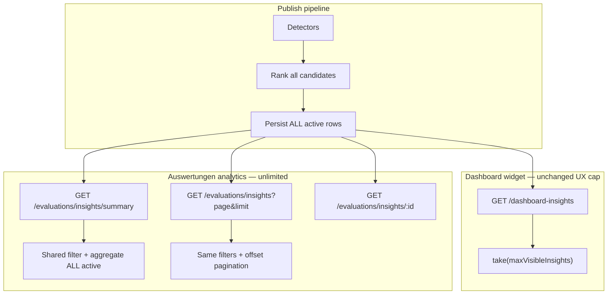

# Evaluations Summary vs Detail Separation (Prompt 15/54)

## Problem

Auswertungen KPI cards (`InsightsCockpit`) counted insights from `GET /dashboard-insights`, which was limited to `maxVisibleInsights` (default **4**) at **publish time** and **read time**. Summary counts therefore under-reported org-wide business risks and revenue leakage.

## Architecture



### Separation of concerns

| Surface | Endpoint | Limit | Purpose |
|---------|----------|-------|---------|
| Dashboard widget | `GET /organizations/:orgId/dashboard-insights` | `maxVisibleInsights` (default 4) | Operator attention — top priority cards |
| Dashboard meta | `GET /organizations/:orgId/dashboard-insights/summary` | None for counts | Run metadata + **full** severity totals |
| Auswertungen summary | `GET /organizations/:orgId/evaluations/insights/summary` | None | KPI cards (`businessRisks`, `revenueLeakage`, `criticalBusinessRisks`, exposure) |
| Auswertungen detail | `GET /organizations/:orgId/evaluations/insights` | `page` + `limit` (max 100) | Paginated, sortable insight lists |
| Drill-down | `GET /organizations/:orgId/evaluations/insights/:id` | 1 | Single insight detail |

## Shared filter contract

`shared/evaluations-insights/insights-analytics.ts` is the single source of truth for:

- Visibility rules (`isVisibleAnalyticsInsight` — hides raw health without booking context)
- Category mapping (`BUSINESS_RISK`, `REVENUE_LEAKAGE`, `OPERATIONAL_RECOMMENDATION`)
- Station filter (`stationId` → vehicle id set resolved server-side)
- Severity filter
- Deterministic sort (`priority` desc, tie-break `id` asc)

**Summary and list endpoints apply identical filters** before aggregate vs slice.

## Services

| Method | Location |
|--------|----------|
| `getAnalyticsSummary` | `DashboardInsightsAnalyticsService` |
| `listAnalyticsInsights` | `DashboardInsightsAnalyticsService` |
| `getAnalyticsInsightById` | `DashboardInsightsAnalyticsService` |

Repository additions:

- `getRunMetadata` — stale/run state without row limit
- `mapRowsToInsightDtos` — preserve list sort order after pagination
- `getActiveInsights` — **summary over all active rows**, insights array still capped for dashboard

## Publish change

`BusinessInsightsService.runForOrganization` now publishes **all ranked candidates** (no `slice(0, maxVisibleInsights)`). `maxVisibleInsights` applies only to dashboard widget display.

## Performance

### Query patterns

| Operation | Query |
|-----------|-------|
| Summary counts | `findMany` active rows — select analytics fields only (id, type, severity, priority, entityIds, metrics, timeContext) |
| List page | Same load + in-memory filter/sort + `slice(skip, skip+take)` + `findMany` by ids for DTO hydration |
| Dashboard widget | `findMany` with `take: maxVisibleInsights` + parallel severity scan for summary |

For typical org sizes (&lt;200 active insights) this is O(n) in memory with a single indexed DB read. No full-table scan without `organizationId` + `isActive` predicate.

### Index

Migration `20260724100000_dashboard_insights_analytics_index`:

```sql
CREATE INDEX dashboard_insights_organization_id_is_active_priority_idx
  ON dashboard_insights (organization_id, is_active, priority DESC);
```

**Rationale:** Existing `(organization_id, is_active)` supports filtering; adding `priority DESC` aligns with the dominant sort order for list queries and dashboard top-N reads.

### Frontend

`InsightsCockpit` uses `useEvaluationsInsightsAnalytics`:

- 1× summary request
- 2× paginated list requests (business risks + revenue leakage, `limit=50`)
- No client-side aggregation over capped dashboard feed

## Tests

```bash
cd backend && npm run test:insights:analytics
```

Coverage:

| Case | Assertion |
|------|-----------|
| 0 insights | All counts zero |
| 4 insights | Category counts match |
| 5 insights | Summary total = 5 independent of `limit=2` pages |
| 100 insights | Full aggregation (75 business + 25 leakage) |
| Pagination | Page meta + deterministic priority sort |
| Filters | Category filter consistent on summary + list |
| Page size independence | `summary.businessRisks === list.meta.total` |

Shared unit tests: `shared/evaluations-insights/insights-analytics.spec.ts`

## API examples

```http
GET /api/v1/organizations/{orgId}/evaluations/insights/summary?stationId={uuid}
GET /api/v1/organizations/{orgId}/evaluations/insights?category=BUSINESS_RISK&page=1&limit=20&sortBy=priority&sortOrder=desc
GET /api/v1/organizations/{orgId}/evaluations/insights/{insightId}
```

## Remaining gaps

- Cursor-based pagination (offset is sufficient for current insight volumes)
- Recommended-actions list not yet a dedicated paginated endpoint (derived from first page of critical/warning insights in UI)
- Station filter requires vehicle lookup per request — acceptable at current scale; cache if needed

---

*Prompt 15/54 — 2026-07-24*
