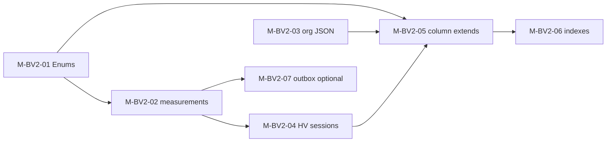
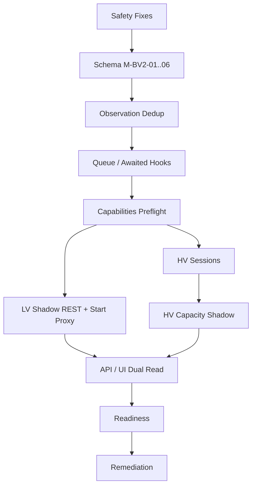
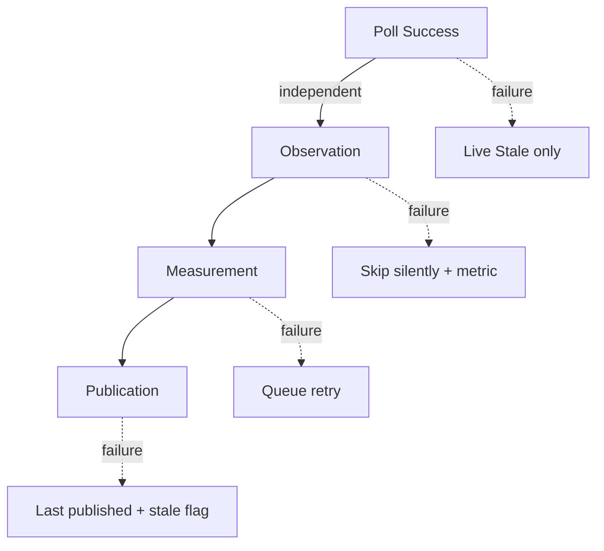

# Battery Health V2 — Migrations-, Rollout-, Test- und Rollbackplan

**Version:** 1.0 (Spezifikation)  
**Date:** 2026-07-16  
**Status:** **Normativ für zukünftige Implementierung** — keine Schema- oder Codeänderung in diesem Prompt  
**Repository-Git-Commit (Erstellung):** `0672e0f`  
**Basis:**

- [`battery-health-v2.md`](./battery-health-v2.md) (Architekturvertrag Prompt 2/78)
- [`battery-health-v2-rollout-flags.md`](./battery-health-v2-rollout-flags.md) (Feature-Flag-Vertrag Prompt 3/78)
- [`../audits/battery-v2-implementation-inventory.md`](../audits/battery-v2-implementation-inventory.md) (Inventur Prompt 1/78)

**Prinzip:** Additive Migrationen, schrittweise Aktivierung per Feature-Flags, Shadow vor Publication, Rollback ohne Verlust neuer Measurements. Keine Big-Bang-Umstellung.

---

## Inhaltsverzeichnis

| # | Abschnitt |
|---|-----------|
| 0 | Zweck und Geltungsbereich |
| 1 | Additive Prisma-Migrationen |
| 2 | Rückwärtskompatibilität alter Backend-Versionen |
| 3 | Dual Read und Shadow Write |
| 4 | Implementierungs- und Rollout-Reihenfolge |
| 5 | Datenbankbackup und Restore |
| 6 | Migrationen: lokal, Test, Staging, Produktion |
| 7 | Feature-Flag-Aktivierung |
| 8 | Shadow-Zeitraum |
| 9 | Teststufen und Abbruchkriterien |
| 10 | Verhalten bei Queue-, Provider- und Migrationsfehlern |
| 11 | Rollback ohne Verlust neuer Measurements |
| 12 | Umgang mit Legacy-Tabellen |
| 13 | Deployment-Reihenfolge mehrerer Prozesse |
| 14 | Messbare Go/No-Go-Kriterien |
| 15 | Abnahmekriterien (Prompt 4) |
| 16 | Referenzen |

---

## 0. Zweck und Geltungsbereich

Dieses Dokument ist der **operative Masterplan** für die technische Einführung von Battery Health V2. Es verbindet:

- **Schema** (additive DDL, keine destruktiven Änderungen in frühen Phasen)
- **Code-Deploy** (NestJS monolith `synqdrive`: API + Worker + Scheduler in einem PM2-Prozess)
- **Feature-Flags** (12 Flags aus [`battery-health-v2-rollout-flags.md`](./battery-health-v2-rollout-flags.md))
- **Datenbereinigung** (Remediation nach Shadow-Validierung)
- **Rollback** (reversibel bis Code-Revert; Daten bleiben erhalten)

**Nicht Gegenstand:** konkrete Implementierung in Prompts 5–78; dieses Dokument definiert nur **wie** implementiert und ausgerollt wird.

**Produktions-Ist (Planungsstand):**

| Attribut | Wert |
|----------|------|
| Runtime | Ein PM2-Prozess `synqdrive` (API + BullMQ-Worker + `@Interval`-Scheduler) |
| Battery-Ingestion | `dimo.snapshot.poll` → `DimoSnapshotProcessor` → fire-and-forget LV/HV-Hooks |
| Deploy-Pipeline | `vps-deploy-release.sh`: `pg_dump` → clone → `prisma migrate deploy` → PM2 restart |
| Backup-Pfad | `/opt/synqdrive/shared/backups/` |
| Bekannte Datenprobleme | 522 falsche LV-`SOH_PERCENT`-Evidence; ~108k HV-Snapshot-Duplikate; HV `publishedSohPct=85` ohne Basis |

---

## 1. Additive Prisma-Migrationen

### 1.1 Leitprinzipien

| Regel | Begründung |
|-------|------------|
| **Nur additive DDL** in Phasen M1–M4 | Alte Backend-Versionen dürfen nach Deploy weiterlaufen |
| **Enum-Werte in separaten Migrationen** | PostgreSQL: neuer Enum-Wert nicht in derselben Transaktion wie erste Nutzung (Pattern: `TaskStatus.WAITING`) |
| **Neue Spalten `NULL` oder mit Default** | Bestehende Rows ohne Backfill-Zwang |
| **Keine `DROP COLUMN` / `DROP TABLE`** vor M5+ und explizitem Runbook | Legacy-Consumer bleiben lesbar |
| **Jede Migration idempotent prüfbar** | `prisma migrate deploy` auf frischer und bestehender DB |
| **Backup-Tabelle vor Daten-Scripts** | `_backup_<ts>_<tabelle>` oder `pg_dump` Slice |

### 1.2 Migrationssequenz (geplant)

Migrationen werden **klein und sequenziell** ausgeliefert — nicht eine Mega-Migration.

#### M-BV2-01 — Enums und Qualitätsvokabular

| Artefakt | Inhalt |
|----------|--------|
| `MeasurementQuality` | `VALID`, `VALID_PROXY`, `SHADOW`, `CONTAMINATED_BY_WAKE`, `CONTAMINATED_BY_CHARGING`, `CONTAMINATED_BY_LOAD`, `MISSED`, `TIMESTAMP_INCONSISTENT`, `STALE`, `UNSUPPORTED_PROFILE`, `DIAGNOSTIC` |
| `BatteryEvidenceValueType` | **Additiv:** `ESTIMATED_HEALTH_SCORE` (neben bestehendem `SOH_PERCENT`) |
| `BatteryMessart` (optional) | `REST_60M`, `REST_6H`, `START_DIP_PROXY`, `SHADOW_HV_CAPACITY`, … |
| Risiko | Niedrig — nur neue Typen, keine bestehenden Werte ändern |

#### M-BV2-02 — `battery_measurements` (Ziel-Tabelle Ebene 4)

```prisma
// Spezifikation — exakte Feldnamen in Implementierungsprompt
model BatteryMeasurement {
  id             String   @id @default(cuid())
  organizationId String
  vehicleId      String
  scope          BatteryScope          // LV | HV
  messart        String                // oder Enum wenn stabil
  quality        MeasurementQuality
  value          Decimal
  unit           String
  observedAt     DateTime
  sessionId      String?               // FK optional, M-BV2-04
  sourceType     BatteryEvidenceSourceType
  metadata       Json?
  createdAt      DateTime @default(now())

  @@unique([vehicleId, messart, observedAt])
  @@index([organizationId, vehicleId, observedAt])
  @@index([vehicleId, quality, observedAt])
}
```

| Aspekt | Plan |
|--------|------|
| Backfill | **Kein** automatischer Backfill aus Legacy — nur neue Writes nach Flag ON |
| Legacy-Alternative | Übergang: `battery_evidence.metadata.messart` + `quality` bis Tabelle produktiv |

#### M-BV2-03 — `Organization.batteryHealthV2ConfigJson`

| Feld | Typ | Default |
|------|-----|---------|
| `batteryHealthV2ConfigJson` | `Json?` | `null` |

**Entscheidung Prompt 4:** Dedizierte Org-Spalte (nicht nur `OrganizationIntegration.configJson`), analog zu anderen Org-Feature-Overrides. Interim in Prompt 5–8: Unterbaum `batteryHealthV2` in Integration-JSON **nur** wenn M-BV2-03 noch nicht deployed — danach Migration auf Spalte.

Struktur (Spezifikation):

```json
{
  "restShadowEnabled": true,
  "hvRechargeSessionEnabled": true,
  "canaryVehicleIds": ["…"],
  "updatedAt": "2026-07-16T12:00:00Z",
  "updatedByUserId": "…"
}
```

#### M-BV2-04 — HV Charge Session Store

```prisma
model HvBatteryChargeSession {
  id               String   @id @default(cuid())
  organizationId   String
  vehicleId        String
  dimoSegmentId    String?  // externe Referenz
  startedAt        DateTime
  endedAt          DateTime?
  isOngoing        Boolean  @default(false)
  durationSec      Int?
  energyAddedKwh   Decimal?
  socStartPct      Decimal?
  socEndPct        Decimal?
  source           String   @default("DIMO_RECHARGE_SEGMENT")
  metadata         Json?
  createdAt        DateTime @default(now())
  updatedAt        DateTime @updatedAt

  @@unique([vehicleId, dimoSegmentId])
  @@index([organizationId, vehicleId, startedAt])
}
```

#### M-BV2-05 — Erweiterungen bestehender Tabellen (additiv)

| Tabelle | Neue Spalten | Nullable |
|---------|--------------|----------|
| `battery_evidence` | `quality MeasurementQuality?`, `messart String?`, `sessionId String?` | Ja — Backfill optional |
| `battery_features` | `publishedEstimatedHealth Decimal?`, `lastAssessmentAt DateTime?`, `policyProfile String?` | Ja |
| `hv_battery_health_current` | `shadowCapacityKwh Decimal?`, `shadowCapacityCv Decimal?`, `sohSource String?`, `referenceCapacityVerified Boolean?` | Ja |
| `hv_battery_health_snapshots` | `insertGateReason String?`, `isDuplicate Boolean?` | Ja |

**Kein Rename** von `publishedSohPct` in M-BV2-05 — API-Compat-Layer schreibt beide Felder während Übergang (Prompt 25).

#### M-BV2-06 — Indizes und Performance

| Index | Zweck |
|-------|-------|
| `(vehicle_id, observed_at DESC)` auf `hv_battery_health_snapshots` | Dedup-Lookups |
| `(vehicle_id, value_type, observed_at DESC)` auf `battery_evidence` | Evidence-Queries (ergänzend zu bestehendem Unique) |
| Partial index optional | `battery_measurements WHERE quality = 'SHADOW'` — nur bei Volumen >1M |

#### M-BV2-07 — Outbox / Queue-Metadaten (optional, mit Block Queue)

| Artefakt | Inhalt |
|----------|--------|
| `battery_measurement_outbox` | `id`, `organizationId`, `vehicleId`, `payload Json`, `status`, `attempts`, `createdAt` — **oder** BullMQ-only ohne Tabelle |
| Entscheidung | Prompt 11: bevorzugt **BullMQ Queue** `battery.measurement.process` ohne zusätzliche Outbox-Tabelle, außer Transaktions-Atomicity mit Snapshot erzwingt DB-Outbox |

#### M-BV2-08 — Remediation-Tabellen (nur für Datenfix-Scripts)

| Tabelle | Zweck |
|---------|-------|
| `_backup_battery_evidence_<ts>` | Kopie vor Reclassify |
| `_backup_hv_battery_health_current_<ts>` | Kopie vor Publication-Reset |
| `_backup_battery_features_<ts>` | Kopie vor STABLE-Review |

Keine Prisma-Models — reine SQL-Backup-Tabellen via Ops-Scripts.

### 1.3 Migrationsabhängigkeiten



### 1.4 Verbotene Migrationen (früh)

| Verbot | Bis |
|--------|-----|
| `DROP TABLE battery_health_snapshots` | M5+ explizite Freigabe |
| `ALTER COLUMN publishedSohPct DROP` | API-Deprecation abgeschlossen |
| `DELETE FROM battery_evidence` in Migration | **Nie** — nur Scripts mit Backup |
| `NOT NULL` auf neue Qualitätsfelder ohne Backfill | Nach Remediation |

---

## 2. Rückwärtskompatibilität alter Backend-Versionen

### 2.1 Szenario

Nach `prisma migrate deploy` kann kurzzeitig **alter Code** (VPS-Stand `2cd57c8` oder Zwischen-Release) gegen **neue Schema-Version** laufen — bis PM2-Neustart mit neuem Build aktiv ist.

### 2.2 Kompatibilitätsmatrix

| Schema-Änderung | Altes Backend | Verhalten |
|-----------------|---------------|-----------|
| Neue Tabellen (`battery_measurements`, `hv_battery_charge_sessions`) | Ignoriert | **OK** — keine Reads/Writes |
| Neue nullable Spalten | Ignoriert | **OK** — INSERT ohne Spalte = NULL |
| Neue Enum-Werte in DB | Altes Backend schreibt alte Enums | **OK** solange altes Backend die neuen Werte nicht lesen muss |
| Neuer Enum-Wert den altes Backend parsen muss | **Risiko** | Neue Evidence-`valueType` nur schreiben wenn neuer Code deployed |
| Unique auf `battery_measurements` | — | Nur neuer Code schreibt |
| `Organization.batteryHealthV2ConfigJson` | Ignoriert | **OK** |

### 2.3 Deploy-Regel: Schema vor Code (expand)

| Schritt | Aktion |
|---------|--------|
| 1 | `prisma migrate deploy` (additive only) |
| 2 | PM2 restart mit **neuem** Build |
| 3 | Flags bleiben `false` — Legacy-Verhalten |

**Contract:** Keine Migration, die altes Backend zum Absturz bringt (fehlende Spalte, NOT NULL ohne Default, geänderte Semantik bestehender Spalten).

### 2.4 Roll-forward bei Code-Revert

Wenn Code auf alten Stand zurückgesetzt wird:

- Neue Tabellen bleiben leer oder ungelesen — **harmlos**
- Neue Spalten mit NULL — **harmlos**
- Rows in `battery_measurements` mit neuen Enum-Werten: altes Backend liest sie nicht
- **Risiko:** Org-JSON-Overrides ohne Code — ignorierbar

### 2.5 API-Rückwärtskompatibilität

| Endpoint | Regel |
|----------|-------|
| `GET .../battery-health-summary` | Bestehende Felder unverändert; neue Felder optional |
| `GET .../battery-health-detail` | `measurements[]`, `freshness`, `flags` additive |
| `publishedSohPct` (LV) | Bleibt lesbar; parallel `publishedEstimatedHealth` |
| `hv.sohStatus` | Neu; Default `UNAVAILABLE` wenn Flag off |

Frontend älterer Builds: ignorieren unbekannte JSON-Felder (bestehendes Verhalten).

---

## 3. Dual Read und Shadow Write

### 3.1 Definitionen

| Modus | Lesen | Schreiben |
|-------|-------|-----------|
| **Legacy Read** | `battery_features`, `hv_battery_health_current`, `battery_evidence` ohne Quality-Gates | Bestehende Pfade (bis Flags ON) |
| **Shadow Write** | — | Neue Pipeline schreibt `SHADOW` / `DIAGNOSTIC` in `battery_measurements` + `battery_evidence`; **kein** `published*` |
| **Dual Read** | `CanonicalBatteryHealthService` vergleicht Legacy vs. V2 intern; API liefert **Legacy** bis `batteryV2UiEnabled` / Publication ON | — |
| **V2 Read** | Canonical bevorzugt V2-Assessment/Publication wenn Flags + Datenqualität | — |

### 3.2 Dual-Read-Implementierung (Ziel)

```
CanonicalBatteryHealthService.getSummary(orgId, vehicleId):
  legacy = readLegacyPath(...)
  v2     = readV2Path(...)        // nur wenn mind. Observation oder Assessment Flag
  if !batteryV2UiEnabled && !batteryV2PublicationEnabled:
    return legacy with optional debug.v2Shadow = v2  // Platform-Admin / Staging only
  else:
    return merge(v2, legacyFallback)
```

| Feld | Dual-Read-Quelle bis Publication |
|------|----------------------------------|
| LV Ampel | Legacy `publishedSohPct` / Klassifikation |
| LV Detail REST-Chart | Legacy `battery_features` + neue Shadow-Evidence (Badge) |
| HV SOH-% | **Kein** Dual — immer `UNAVAILABLE` bis `hvSohPublicationEnabled` |
| HV Shadow Capacity | Nur in `debug` / Admin — nicht user-facing |

### 3.3 Shadow Write — erlaubte Ziele

| Flag-Kombination | Schreibt in | Schreibt **nicht** in |
|------------------|-------------|------------------------|
| Observation ON | Metriken, optional In-Memory Dedup-State | Measurements |
| REST Shadow ON | `battery_measurements`, `battery_evidence` (`SHADOW`) | `published*` |
| HV Session ON | `hv_battery_charge_sessions` | Capacity/SOH Publication |
| HV Capacity Shadow ON | `battery_evidence` (`SHADOW_HV_CAPACITY`), `hv_battery_health_current.shadow*` | `publishedSohPct`, `publishedCapacityKwh` |
| Assessment ON | `battery_features` Rohfelder (`estimated*`) | `published*` |
| Publication ON | `publishedEstimatedHealth`, HV `published*` | — |

### 3.4 Shadow-Validierungsmetriken (Dual Read)

Während Shadow-Zeitraum täglich vergleichen:

| Metrik | Legacy | V2 Shadow | Abweichungs-Schwelle |
|--------|--------|-----------|----------------------|
| REST_60M Count / 7d | `battery_features` Updates | Shadow Measurements VALID | V2 ≥ Legacy Capture −5 % |
| HV Snapshot Rows / 7d | Roh-Inserts | Nach Dedup | V2 Insert-Rate <5 % von Legacy |
| LV Score | `estimatedSohPct` | V2 Assessment | Median Δ <10 Punkte (ICE) |
| HV Capacity | `energy_throughput` (deprecated) | M2 Shadow | Nur qualitativ — kein Auto-Promote |

### 3.5 Promotion Shadow → Publication

Expliziter Gate-Übergang (kein Auto-Promote):

1. Shadow-Zeitraum SLOs grün (§8)
2. Remediation-Scripts für kontaminierte Legacy-Daten (optional vor Publication)
3. Flag `batteryV2PublicationEnabled` / `hvCapacityPublicationEnabled` ON pro Org
4. Erste Publication mit `STABILIZING`, nicht `STABLE`, bis AC20 erfüllt

---

## 4. Implementierungs- und Rollout-Reihenfolge

Die Reihenfolge mappt auf Inventur-Blöcke (Prompts 5–78) und Flag-Phasen 0–11.

### 4.1 Gesamtübersicht



### 4.2 Phase A — Safety Fixes (vor Schema, Prompts 5–10)

| # | Maßnahme | Dateien / Wirkung | Flag | User-Impact |
|---|----------|-------------------|------|-------------|
| A1 | `batteryV2LegacyPublicationEffectsEnabled=false` in Prod-`backend.env` | Config | Deploy | Readiness/Detector konservativ — **empfohlen als Erstmaßnahme** |
| A2 | Keine neuen falschen `SOH_PERCENT`-Evidence für LV-Score | `battery-v2.service.ts` `recomputeHealth` | Code only | Stoppt Datenverschmutzung |
| A3 | HV `upsertPublicationState`: kein Default 85 % | `hv-battery-health.service.ts` | Code only | BEV zeigt `UNAVAILABLE` / `INITIAL_CALIBRATION` |
| A4 | BEV Profile-Guard: skip LV `onSnapshot`/`onTripStart` | `battery-v2.service.ts` | Code only | AC04 |
| A5 | `availableSignals` Root-Query Fix | `dimo-telemetry.service.ts` | Code only | Capability-Preflight korrekt |
| A6 | Prometheus `battery_hook_total` Baseline | Metrics service | Code only | Sichtbarkeit |

**Exit:** P0-03, P0-04, P0-05 nicht weiter verschlechternd; Hook-Metriken exportiert.

### 4.3 Phase B — Schema (Prompts 7–10, Migrationen M-BV2-01..06)

| # | Deliverable | Migration | Deploy |
|---|-------------|-----------|--------|
| B1 | Enums + `ESTIMATED_HEALTH_SCORE` | M-BV2-01 | Mit Phase A Deploy |
| B2 | `battery_measurements` | M-BV2-02 | Leer — kein Backfill |
| B3 | `Organization.batteryHealthV2ConfigJson` | M-BV2-03 | `null` default |
| B4 | `hv_battery_charge_sessions` | M-BV2-04 | Leer |
| B5 | Spalten-Erweiterungen | M-BV2-05 | Nullable |
| B6 | Indizes | M-BV2-06 | Performance |

**Exit:** `prisma migrate deploy` auf Staging + Prod ohne Fehler; alte App-Version startet weiter.

### 4.4 Phase C — Observation Dedup (Prompts 11–15, Flag Phase 1)

| # | Deliverable | Flag |
|---|-------------|------|
| C1 | `BatteryHealthV2Config` + `batteryV2ObservationEnabled` | Env |
| C2 | Observation-Dedup: gleicher Provider-TS + Wert → skip | ON global Staging |
| C3 | HV Snapshot Insert-Gate (Provider-TS oder ΔSOC/ΔEnergy) | Teil von Observation/HV hardening |
| C4 | `TIMESTAMP_INCONSISTENT` bei Kollisionen | Metrik |
| C5 | LV Stale/Future-Guard erweitert | Code |

**Exit:** `observation_skipped` >90 % bei HV; `observation_skipped` <5 % außer `stale` (Flag-Doc Phase 1).

### 4.5 Phase D — Queue (Prompts 11, 17)

| # | Deliverable | Details |
|---|-------------|---------|
| D1 | BullMQ Queue `battery.measurement.process` (Name TBD in `queue-names.ts`) | Entkoppelt von `dimo.snapshot.poll` |
| D2 | Snapshot-Processor: enqueue statt fire-and-forget | Awaited enqueue; Worker verarbeitet |
| D3 | Trip-Start: enqueue `onTripStart` | Gleiche Queue oder dediziert |
| D4 | Partial-failure Semantik | Snapshot-Job `completed` mit `partialFailure: true` bei Battery-Fehler |
| D5 | Retry: 3× exponential backoff; DLQ-Alert | Ops-Runbook |

**Exit:** AC16 — Hook-Fehler sichtbar; Job markiert partial failure; keine stillen `.catch()`.

### 4.6 Phase E — Capabilities (Prompts 5–6, 16)

| # | Deliverable |
|---|-------------|
| E1 | `CapabilityState` Preflight via DIMO `availableSignals(tokenId)` |
| E2 | Persistenz in `vehicle_latest_states.metadata` oder Cache-Tabelle (additiv, optional) |
| E3 | `UNSUPPORTED_PROFILE` / `NOT_LISTED` → keine Measurement |
| E4 | API-Feld `capability.*` in Detail (hinter `batteryV2UiEnabled`) |

**Exit:** Tesla BEV: Provider SOH = `NOT_LISTED`; kein SOH-Pfad (AC11, AC18).

### 4.7 Phase F — LV Shadow (Flag Phase 2a/2b, Prompts 19–22)

| # | Deliverable | Flag |
|---|-------------|------|
| F1 | REST_60M/6H Shadow Measurements | `batteryV2RestShadowEnabled` (1 Org) |
| F2 | Wake → `CONTAMINATED_BY_WAKE` | Code |
| F3 | `MISSED` bei verpasstem REST-Fenster | Code |
| F4 | START_DIP_PROXY diagnostisch | `batteryV2StartProxyEnabled` (ICE) |
| F5 | CRANK_MIN entfernt / Score-Cap 10 % | Code |

**Exit:** AC01–AC04, AC09; Shadow Evidence wächst; keine Publication.

### 4.8 Phase G — HV Sessions (Flag Phase 3, Prompts 29, 34)

| # | Deliverable | Flag |
|---|-------------|------|
| G1 | Scheduler/Worker: DIMO `segments(mechanism: recharge)` 31d rolling | `hvRechargeSessionEnabled` |
| G2 | Upsert `hv_battery_charge_sessions` | Canary KS FH 660E |
| G3 | Segment > `isCharging` Hierarchie | Code |
| G4 | `energy_throughput` auf Poll-Pairs **deaktiviert** | Code (Safety) |

**Exit:** AC13 — ≥3 Sessions / 31d für Canary; Session-Store konsistent mit DIMO.

### 4.9 Phase H — HV Capacity Shadow (Flag Phase 4, Prompts 30–33)

| # | Deliverable | Flag |
|---|-------------|------|
| H1 | M2 Energy/SOC Schätzung pro Session | `hvCapacityShadowEnabled` |
| H2 | Evidence `SHADOW_HV_CAPACITY` | quality=SHADOW |
| H3 | `hv_battery_health_current.shadowCapacityKwh` | nicht publiziert |
| H4 | M3 Validation (Added Energy Reset disqualifiziert) | AC15 |

**Exit:** AC14 — Median ~55 kWh; CV <2 % über 3 Sessions (Tesla).

### 4.10 Phase I — API / UI (Prompts 39–54, Flag Phase 5–6)

| # | Deliverable | Flag |
|---|-------------|------|
| I1 | Dual Read in Canonical | Code |
| I2 | `freshness.*`, `policyProfile`, `displayMode` | API |
| I3 | Assessment ohne Publish | `batteryV2AssessmentEnabled` |
| I4 | UI Shadow-Badges, STALE-Banner | `batteryV2UiEnabled` |
| I5 | LV Label „Geschätzter Zustand“ | AC12 |
| I6 | `endpoint_error` bei 5xx | AC10 |

**Exit:** UI zeigt Shadow; keine SOH-% ohne Quelle; API-Fehler nicht `null`.

### 4.11 Phase J — Readiness (Flag Phase 10, Prompts 45, 55–58)

| # | Deliverable | Flag |
|---|-------------|------|
| J1 | `batteryV2PublicationEnabled` (1 Org ICE) nach AC20 | Publication |
| J2 | `hvCapacityPublicationEnabled` nur mit verifizierter Referenz | Optional |
| J3 | `hvSohPublicationEnabled` nur Provider/Workshop | Default OFF |
| J4 | `batteryV2ReadinessEnabled` — neue Policy-Matrix | Readiness |
| J5 | Legacy Effects bleiben OFF | `batteryV2LegacyPublicationEffectsEnabled=false` |

**Exit:** AC20, AC21; Rental blockiert nicht aus Shadow; Detector publication-gated.

### 4.12 Phase K — Remediation (Prompts 26, 35, 38, 69–70)

| # | Daten | Aktion | Voraussetzung |
|---|-------|--------|---------------|
| K1 | 522 LV `SOH_PERCENT` | Reclassify → `ESTIMATED_HEALTH_SCORE` | Backup `_backup_battery_evidence_*` |
| K2 | 27+ kontaminierte REST | `quality` backfill `CONTAMINATED_BY_WAKE` | Backup |
| K3 | ~108k HV Duplikate | Retention-Job + Dedup (behalte je TS eine Zeile) | Backup; nach Insert-Gate live |
| K4 | 5× ICE `STABLE` ohne VALID-Kern | Publication-Review → `STABILIZING` | Nach LV Publication Flag |
| K5 | HV `publishedSohPct=85` | Nullsetzen / `INITIAL_CALIBRATION` | Backup `_backup_hv_*` |

**Exit:** Keine kontaminierten Kern-Evidence in Publication-Pfad; Remediation auditierbar.

### 4.13 Mapping Prompts ↔ Phasen

| Plan-Phase | Inventur-Prompts | Flag-Phase |
|------------|------------------|------------|
| Safety Fixes | 5–10 | 0 |
| Schema | 7–10 | 0 |
| Observation Dedup | 11–16 | 1 |
| Queue | 11, 17 | 1 |
| Capabilities | 5–6, 16 | 1 |
| LV Shadow | 19–22 | 2a, 2b |
| HV Sessions | 29, 34 | 3 |
| HV Capacity Shadow | 30–33 | 4 |
| API/UI | 39–54 | 5–6 |
| Readiness | 45, 55–58 | 7–10 |
| Remediation | 26, 35, 38, 69–70 | parallel ab Phase I, finalisiert vor Fleet |

---

## 5. Datenbankbackup und Restore

### 5.1 Automatisches Pre-Deploy-Backup (Produktion)

Bestehend in `backend/scripts/ops/vps-deploy-release.sh`:

```bash
BACKUP_DIR="/opt/synqdrive/shared/backups"
sudo -u postgres pg_dump synqdrive | gzip > "${BACKUP_DIR}/db-pre-deploy-${TS}.sql.gz"
```

| Aspekt | Wert |
|--------|------|
| Zeitpunkt | **Vor** `prisma migrate deploy` |
| Format | `pg_dump` vollständig, gzip |
| Naming | `db-pre-deploy-YYYYMMDDHHMMSS.sql.gz` |
| Retention | Min. 30 Tage; Battery-Migrationen: 90 Tage |

### 5.2 Manuelle Backups (Battery-spezifisch)

Vor **jedem** Remediation-Script und vor erster Publication-Flag-Aktivierung pro Org:

```bash
# Vollbackup
sudo -u postgres pg_dump synqdrive | gzip > "/opt/synqdrive/shared/backups/battery-v2-pre-${PHASE}-${TS}.sql.gz"

# Tabellen-Slice (schneller Restore)
sudo -u postgres pg_dump synqdrive \
  -t battery_evidence \
  -t battery_features \
  -t hv_battery_health_current \
  -t hv_battery_health_snapshots \
  -t battery_health_snapshots \
  | gzip > "/opt/synqdrive/shared/backups/battery-v2-tables-${TS}.sql.gz"

# In-DB Backup-Tabelle
sudo -u postgres psql -d synqdrive -c \
  "CREATE TABLE _backup_battery_evidence_${TS} AS SELECT * FROM battery_evidence;"
```

### 5.3 Restore-Verfahren

| Szenario | Vorgehen | Datenverlust |
|----------|----------|--------------|
| Fehlgeschlagene Migration | Restore aus `db-pre-deploy-*`; **kein** `migrate deploy` retry ohne Analyse | Seit Backup |
| Fehlerhaftes Remediation-Script | Restore Tabellen-Slice oder `INSERT…SELECT` aus `_backup_*` | Nur Script-Zeitraum |
| Publication-Fehler | Flag OFF (R3); **kein** DB-Restore nötig | Keiner |
| Kompletter Disaster | Vollrestore + PM2 altes Release | Seit Backup |

```bash
# Vollrestore (Maintenance Window)
pm2 stop synqdrive
gunzip -c /opt/synqdrive/shared/backups/db-pre-deploy-TS.sql.gz | sudo -u postgres psql synqdrive
pm2 start synqdrive
```

### 5.4 Backup-Validierung

| Check | Häufigkeit |
|-------|------------|
| `gzip -t` auf letztem Backup | Jeder Deploy |
| Test-Restore auf Staging-Clone | Monatlich |
| Row-Counts in `_backup_*` = Source | Jedes Remediation-Script |

---

## 6. Migrationen: lokal, Test, Staging, Produktion

### 6.1 Umgebungsmatrix

| Umgebung | DB | Migration ausführen | Daten |
|----------|-----|---------------------|-------|
| **Lokal** | Docker Compose Postgres | `npx prisma migrate dev` / `deploy` | Seed + optional Prod-Slice (anonymisiert) |
| **CI / Test** | Ephemeral Postgres (GitHub Actions) | `prisma migrate deploy` in `npm test` pipeline | Fixtures |
| **Staging** | Dedizierte DB oder Prod-Clone | `prisma migrate deploy` via Deploy-Script | Prod-Subset oder Full-Clone |
| **Produktion** | `synqdrive` auf VPS | `npm run prisma:migrate:deploy` in `vps-deploy-release.sh` | Live |

### 6.2 Lokale Entwicklung

```bash
cd backend && npm run infra:up
npx prisma migrate dev --name battery_v2_<step>
npm run start:dev
# Flags in .env: alle false
BATTERY_V2_OBSERVATION_ENABLED=false
```

| Regel | Detail |
|-------|--------|
| `migrate dev` | Nur lokal — erzeugt Migration-SQL |
| Commit | `prisma/migrations/<timestamp>_battery_v2_*/migration.sql` |
| Keine Prod-Daten in Git | Anonymisierter Slice manuell importieren |

### 6.3 CI / Test

| Schritt | Aktion |
|---------|--------|
| 1 | `docker run postgres:16` |
| 2 | `prisma migrate deploy` |
| 3 | `npm test` inkl. neue `battery-v2*.spec.ts` |
| 4 | Optional: Migration rollback test — **nicht** `migrate reset` auf Shared DB |

**Gate:** CI rot bei Migrationsfehler — kein Merge in `main` ohne grüne Pipeline.

### 6.4 Staging

| Schritt | Aktion |
|---------|--------|
| 1 | Deploy `main` auf Staging-VPS oder gleicher Host mit `staging` DB |
| 2 | `prisma migrate deploy` |
| 3 | Flags schrittweise ON (Canary Org / KS FH 660E) |
| 4 | 7–14 Tage Shadow-Validierung vor Prod |

**Staging = Pflicht-Gate** für: erste Observation, erste HV Session, erste Publication.

### 6.5 Produktion

Reihenfolge in `vps-deploy-release.sh` (unverändert logisch):

1. `pg_dump` Backup  
2. Clone Release → `npm ci` → `prisma generate`  
3. `npm run prisma:migrate:deploy`  
4. `pg-fix-app-table-ownership.sql`  
5. PM2 restart  
6. Health check `https://app.synqdrive.eu/api/v1/health`  
7. **Danach** Flag-Änderung in `backend.env` + zweiter PM2 restart **oder** Runtime Org-Override  

| Regel | Detail |
|-------|--------|
| Migration ohne Flag-ON | Standard — Schema expand |
| Flag-ON ohne Migration | **Verboten** wenn Code Spalten/Tabellen voraussetzt |
| Zwei Deploys erlaubt | Deploy 1: Schema; Deploy 2: Code+Flags |

### 6.6 Migrations-Checkliste pro Umgebung

| Check | Lokal | CI | Staging | Prod |
|-------|-------|-----|---------|------|
| `prisma migrate status` clean | ✓ | ✓ | ✓ | ✓ |
| Alte App startet nach DDL | ✓ | — | ✓ | ✓ (kurzes Fenster) |
| Row counts baseline | optional | — | ✓ | ✓ |
| Backup vor Remediation | — | — | ✓ | ✓ |

---

## 7. Feature-Flag-Aktivierung

### 7.1 Default-Zustand (Phase 0)

Alle 12 Flags `false` in `backend.env`:

```env
BATTERY_V2_OBSERVATION_ENABLED=false
BATTERY_V2_REST_SHADOW_ENABLED=false
BATTERY_V2_START_PROXY_ENABLED=false
BATTERY_V2_ASSESSMENT_ENABLED=false
BATTERY_V2_PUBLICATION_ENABLED=false
BATTERY_V2_LEGACY_PUBLICATION_EFFECTS_ENABLED=false
BATTERY_V2_HV_RECHARGE_SESSION_ENABLED=false
BATTERY_V2_HV_CAPACITY_SHADOW_ENABLED=false
BATTERY_V2_HV_CAPACITY_PUBLICATION_ENABLED=false
BATTERY_V2_HV_SOH_PUBLICATION_ENABLED=false
BATTERY_V2_UI_ENABLED=false
BATTERY_V2_READINESS_ENABLED=false
```

**Empfohlen Phase 0:** `BATTERY_V2_LEGACY_PUBLICATION_EFFECTS_ENABLED=false` explizit setzen (sicherer Modus).

### 7.2 Aktivierungsreihenfolge (verbindlich)

| Schritt | Flag(s) | Scope | Deploy/Runtime |
|-------|---------|-------|----------------|
| 0 | Alle OFF | Global | Baseline 7d Metriken |
| 1 | `batteryV2ObservationEnabled` | Global Staging → Global Prod | Deploy |
| 2a | `batteryV2RestShadowEnabled` | 1 ICE-Org | Deploy + Org Runtime |
| 2b | `batteryV2StartProxyEnabled` | ICE-Org | Deploy + Org Runtime |
| 3 | `hvRechargeSessionEnabled` | BEV Canary (KS FH 660E) | Deploy + Vehicle Runtime |
| 4 | `hvCapacityShadowEnabled` | BEV Canary | Deploy + Vehicle Runtime |
| 5 | `batteryV2AssessmentEnabled` | 1 Org | Deploy + Org Runtime |
| 6 | `batteryV2UiEnabled` | 1 Org | Org Runtime |
| 7 | `batteryV2PublicationEnabled` | 1 ICE-Org | Deploy + Org Runbook |
| 8 | `hvCapacityPublicationEnabled` | Nur mit verifizierter Referenz | Runbook |
| 9 | `hvSohPublicationEnabled` | Nur Provider/Workshop | Runbook — Tesla: OFF |
| 10 | `batteryV2ReadinessEnabled` | Nach Publication | Deploy + Org |
| 11 | Fleet | Org-Overrides schrittweise | Runtime |

### 7.3 Verbotene Kombinationen

| Kombination | Grund |
|-------------|-------|
| Publication vor Assessment | Keine Rohdaten für Publish |
| `hvSohPublicationEnabled` ohne Referenz/Provider | V14, AC11 |
| `batteryV2ReadinessEnabled` + `batteryV2LegacyPublicationEffectsEnabled=true` | Doppelte widersprüchliche Policy |
| Org-Override `true` bei Global `false` | Config-Service lehnt ab |
| Phase 7–10 überspringen | Flag-Doc §5 |

### 7.4 Aktivierungs-Runbook (pro Schritt)

1. Grafana Dashboard „Battery V2 Rollout“ öffnen  
2. Pre-Check Go/No-Go (§14)  
3. Flag setzen (`backend.env` oder Platform Admin PATCH)  
4. PM2 restart wenn Deploy-only Flag  
5. 24h Beobachtung  
6. Abbruchkriterien prüfen (§9)  
7. Incident-Ticket dokumentieren  
8. Nächste Phase erst nach Exit-Kriterium  

### 7.5 Org-Override-Mechanismus

Nach M-BV2-03:

```
PATCH /platform/organizations/:id/battery-health-v2/flags
{ "restShadowEnabled": true }
```

Effective = `globalEnv AND orgOverride` (Org kann global ON nicht erzwingen).

---

## 8. Shadow-Zeitraum

### 8.1 Definition

**Shadow-Zeitraum** = Zeit von erstem Shadow-Write bis Promotion zu Publication (pro Scope LV/HV getrennt).

| Scope | Beginn | Ende |
|-------|--------|------|
| LV REST | `batteryV2RestShadowEnabled` ON | `batteryV2PublicationEnabled` ON |
| LV Start | `batteryV2StartProxyEnabled` ON | Assessment validiert |
| HV Capacity | `hvCapacityShadowEnabled` ON | `hvCapacityPublicationEnabled` ON |
| HV SOH | Provider Evidence ingestion | `hvSohPublicationEnabled` ON (falls je) |

### 8.2 Mindestdauer

| Scope | Mindestdauer | Begründung |
|-------|--------------|------------|
| LV REST Shadow | **14 Tage** | AC20 — 6 VALID REST über 14d |
| HV Sessions + Shadow | **14 Tage** + ≥3 Sessions | STABILIZING HV |
| Assessment | **7 Tage** nach erstem VALID | Stabilität |
| Gesamt Canary | **21 Tage** vor Fleet | Operative SLOs |

### 8.3 Shadow-Aktivitäten

| Aktivität | Frequenz |
|-----------|----------|
| Dual-Read-Vergleich Legacy vs. V2 | Täglich |
| Evidence-Qualitäts-Review (Stichprobe) | Wöchentlich |
| Tesla M2 Median/CV | Pro Session |
| Kontaminations-Rate | Daily Alert wenn >10 % |
| Ops-Review | Wöchentlich |

### 8.4 Shadow-Ende-Kriterien

Alle müssen erfüllt sein:

- [ ] Hook error rate <0,1 % (24h)  
- [ ] HV duplicate skip >90 %  
- [ ] Shadow capacity CV <2 % (BEV, ≥3 Sessions)  
- [ ] Kein neuer `SOH_PERCENT` LV-Score Evidence  
- [ ] AC01–AC04, AC09, AC13, AC14 grün (automatisiert wo möglich)  
- [ ] Remediation K1–K2 optional abgeschlossen  
- [ ] Runbook-Freigabe Platform Owner  

---

## 9. Teststufen und Abbruchkriterien

### 9.1 Teststufen (V-Modell)

| Stufe | Was | Wo | Verantwortlich |
|-------|-----|-----|----------------|
| **T0 — Unit** | Dedup, Quality-Gates, Publication FSM, Config | CI | Entwicklung |
| **T1 — Integration** | Snapshot → Queue → Measurement → Evidence | CI + Lokal | Entwicklung |
| **T2 — Contract** | API DTOs, Canonical Dual Read | CI | Entwicklung |
| **T3 — Acceptance** | AC01–AC21 automatisiert | Staging | QA/Ops |
| **T4 — Canary** | 1 ICE-Org + 1 BEV real | Staging → Prod | Ops |
| **T5 — Fleet** | Alle Org schrittweise | Prod | Ops + Product |

### 9.2 T0 — Unit (Pflicht vor Merge)

| Suite | Mindestabdeckung |
|-------|------------------|
| `battery-health-v2.config.spec.ts` | Flag-Auflösung, Org-Override, Verbotsfälle |
| `battery-v2.service.spec.ts` | REST gates, Wake, MISSED, Profile |
| `hv-battery-health.service.spec.ts` | Dedup, Shadow M2, kein 85-Default |
| `soh-publication.spec.ts` | Erweitert um AC20 |
| `canonical-battery-health.service.spec.ts` | Dual Read, UNAVAILABLE |

### 9.3 T1 — Integration

| Szenario | Erwartung |
|----------|-----------|
| Snapshot mit gleichem Provider-TS 10× | 1 Observation, 0 neue Measurements |
| REST 8h + 14V Wake | `CONTAMINATED_BY_WAKE` |
| BEV Trip Start | Kein LV Measurement |
| Queue-Fehler | partial failure + Metrik |
| DIMO Segment Mock | Session row upserted |

### 9.4 T3 — Acceptance (AC01–AC21)

Vollständige Mapping-Tabelle in [`battery-health-v2.md`](./battery-health-v2.md) §10.2 — automatisieren in Prompts 65–68.

### 9.5 Abbruchkriterien (sofortiges Flag-OFF / Rollback R1)

| ID | Bedingung | Aktion |
|----|-----------|--------|
| **AB01** | Hook error rate ≥1 % über 1h | R1: betroffenes Flag OFF |
| **AB02** | `prisma migrate deploy` fehlgeschlagen | Deploy stoppen; Restore (§5) |
| **AB03** | Snapshot-Queue Lag >1000 Jobs 30min | DIMO-Ops; Battery-Flags OFF |
| **AB04** | Neuer `publishedSohPct` HV ohne `sohSource` | R3 + Incident; Datenfix |
| **AB05** | Rental mass block durch Battery | `batteryV2ReadinessEnabled` OFF |
| **AB06** | Falsche `BATTERY_CRITICAL` Insights >5/24h | Legacy Effects prüfen; Detector OFF path |
| **AB07** | Shadow CV >5 % über 3 Sessions | HV Shadow OFF; Analyse |
| **AB08** | API p95 battery-detail >2s | Performance; UI Flag OFF |
| **AB09** | Kontamination >25 % neuer REST | REST Shadow OFF |
| **AB10** | Datenverlust-Verdacht | Hard freeze; Restore |

### 9.6 Pause vs. Rollback

| Schwere | Maßnahme |
|---------|----------|
| Metrik-Degradation | Pause nächste Phase; Flag bleibt |
| User-facing falscher SOH | R3 Publication OFF |
| DB-Korruption | Restore + R5 Code-Revert |
| Queue unkontrollierbar | Battery-Enqueue OFF; Snapshot weiter |

---

## 10. Verhalten bei Queue-, Provider- und Migrationsfehlern

### 10.1 Queue-Fehler (`dimo.snapshot.poll`, `battery.measurement.process`)

| Fehlertyp | Verhalten | User-Impact |
|-----------|-----------|-------------|
| Snapshot Job timeout | BullMQ retry (3×); `vehicle_latest_states` evtl. stale | Live-Stale-Banner |
| Battery enqueue fehlgeschlagen | Snapshot **trotzdem** SUCCESS mit `partialFailure`; Metrik | Kein Battery-Update |
| Battery Worker fehlgeschlagen | Retry; nach DLQ: Alert; **kein** Legacy-Hook-Fallback | Battery eingefroren |
| Queue Lag > Schwellwert | Scheduler-Throttle optional; AB03 | Stale Daten |

**Prinzip:** Snapshot-Poll ≠ Battery-Pipeline — Poll-Erfolg darf nicht von Battery abhängen (Architektur §1.1).

### 10.2 Provider-Fehler (DIMO)

| Fehlertyp | Verhalten | Battery-Flags |
|-----------|-----------|---------------|
| GraphQL 5xx / Timeout | Snapshot retry; Observation skip | Keine neuen Measurements |
| `signalsLatest` partial null | Live State partial; Capability `AVAILABLE_NULL` | Guards skip |
| `segments(recharge)` Fehler | Session-Fetch retry; `QUERY_ERROR` Capability | `hvRechargeSessionEnabled` Metrik `fetch_error` |
| Rate limit | Exponential backoff; Job delay | Kein Burst-Write |
| Token revoked | Bestehende Daten stale; Alert | Org-Level DIMO fix |

**Prinzip:** Provider-Fehler erzeugen **keine** geschätzten Measurements (V09).

### 10.3 Migrationsfehler

| Fehlertyp | Verhalten |
|-----------|-----------|
| `migrate deploy` SQL error | Deploy **abbricht**; PM2 altes Release bleibt; Restore wenn partial applied |
| Enum-Konflikt | Forward-fix Migration; kein manuelles DDL in Prod ohne Script |
| Ownership (`pg-fix-app-table-ownership`) | Bestehendes Script nach migrate |
| Lange Migration (Index) | `CONCURRENTLY` wo möglich; Maintenance Window |

### 10.4 Fehler-Dekorrelation



---

## 11. Rollback ohne Verlust neuer Measurements

### 11.1 Grundsatz

**Rollback = Pipeline deaktivieren, Daten behalten.** Shadow- und Diagnostic-Measurements sind wertvoll für Analyse und spätere Re-Aktivierung.

### 11.2 Rollback-Stufen (aus Flag-Vertrag, erweitert)

| Stufe | Maßnahme | `battery_measurements` | `battery_evidence` SHADOW | `published*` |
|-------|----------|------------------------|---------------------------|--------------|
| **R1 Soft** | Flag OFF | **Behalten** | **Behalten** | Einfrieren |
| **R2 UI** | `batteryV2UiEnabled=false` | Behalten | Behalten | Unverändert |
| **R3 Publication** | Publication-Flags OFF | Behalten | Behalten | Last value + `stale=true` |
| **R4 Legacy** | `legacyPublicationEffectsEnabled=true` | Behalten | Behalten | Legacy Read-Pfade |
| **R5 Hard** | Code-Revert Deploy | Behalten (ungelesen) | Behalten | Legacy Code liest alte Felder |

### 11.3 Was **niemals** bei Rollback passiert

| Aktion | Verboten |
|--------|----------|
| `DELETE FROM battery_measurements` | Ja |
| `DELETE FROM battery_evidence WHERE quality='SHADOW'` | Ja |
| `TRUNCATE hv_battery_charge_sessions` | Ja |
| Reclassify rückgängig ohne Backup | Ja |

### 11.4 Re-Aktivierung nach R1–R3

1. Fehlerursache beheben  
2. Flag wieder ON  
3. Pipeline verarbeitet **keine** Backfill-Replay automatisch — optional Replay-Job für Outbox/DLQ only  
4. Publication resumiert aus vorhandenen Assessments  

### 11.5 Code-Revert (R5) mit neuen Daten

| Tabelle | Altes Code-Verhalten |
|---------|---------------------|
| `battery_measurements` | Ignoriert — Daten bleiben für zukünftiges Release |
| `battery_evidence` mit `quality` | Altes Code liest ohne Quality-Filter — **Risiko** |
| Mitigation | Revert nur auf Release **nach** Safety Fixes A2–A4; nie auf Pre-Safety Stand |

**Regel:** R5 nur mit Tabellen-Slice-Backup und Verifikation, dass altes Code keine neuen Enum-Werte **lesen** muss.

---

## 12. Umgang mit Legacy-Tabellen

### 12.1 Legacy-Inventar

| Tabelle | Rolle Ist | V2-Rolle | Strategie |
|---------|-----------|----------|-----------|
| `battery_health_snapshots` | LV Trend-Rohdaten | Trend only; `sohPercent` immer null | **Behalten**; kein SOH |
| `battery_features` | LV State + Publication | + `publishedEstimatedHealth`; Rohfelder | **Erweitern** |
| `battery_evidence` | Evidence Store | + `quality`, `messart` | **Erweitern**; Reclassify |
| `hv_battery_health_snapshots` | HV Poll-Zeilen | Mit Insert-Gate; Retention | **Behalten**; Dedup-Job |
| `hv_battery_health_current` | HV Publication | + Shadow-Felder; SOH fix | **Erweitern** |
| `vehicle_latest_states` | Live State | Unverändert | **Behalten** |
| `battery_measurements` | — | Kanonische Ebene 4 | **Neu** |

### 12.2 Legacy-Schreibpfade abschalten (schrittweise)

| Legacy-Pfad | Abschaltung | Ersatz |
|-------------|-------------|--------|
| HV Snapshot jeder Poll | Nach Observation + Insert-Gate | Gated Insert |
| `energy_throughput` SOH | Phase G4 (sofort Safety) | Session M2 Shadow |
| LV `SOH_PERCENT` Evidence | Safety A2 | `ESTIMATED_HEALTH_SCORE` |
| Fire-and-forget hooks | Phase D | Queue |
| `degradation_model` HV | Bereits ignoriert | Datenbereinigung K5 |

### 12.3 Legacy-Lesepfade

| Consumer | Bis | Nach V2 |
|----------|-----|---------|
| `CanonicalBatteryHealthService` | Dual Read | V2 primary |
| `BatteryHealthService.getTrend` | Legacy snapshots | Gated / deprecated |
| `BatteryCriticalDetector` | `publishedSohPct` | `publishedEstimatedHealth` + HV `sohSource` |
| `RentalHealthService` | Canonical | `batteryV2ReadinessEnabled` Matrix |
| Platform Admin Logbook | Direkt DB | Unverändert + neue Tabellen |

### 12.4 Retention

| Tabelle | Default | V2-Empfehlung |
|---------|---------|---------------|
| `hv_battery_health_snapshots` | `RETENTION_HV_BATTERY_SNAPSHOTS_DAYS=0` | 90 Tage nach Dedup |
| `battery_evidence` | `RETENTION_BATTERY_EVIDENCE_DAYS=0` | 365 Tage minimum |
| `battery_measurements` | — | 365 Tage |
| `hv_battery_charge_sessions` | — | Unbegrenzt (klein) |

### 12.5 Deprecation-Zeitleiste

| Milestone | Legacy-Element |
|-----------|----------------|
| M3 | Falsche Evidence reclassifiziert |
| M4 | API: `publishedSohPct` LV deprecated alias |
| M5 | `/battery-health/v2` entfernt |
| M6+ | `energy_throughput` Code entfernt |
| M7+ | Optional: `battery_health_snapshots` Archiv |

**Keine Tabelle löschen** ohne 6 Monate Deprecation und Backup.

---

## 13. Deployment-Reihenfolge mehrerer Prozesse

### 13.1 Ist-Topologie

SynqDrive Produktion: **ein** PM2-Prozess `synqdrive` enthält:

- NestJS HTTP API  
- BullMQ Worker (`DimoSnapshotProcessor`, weitere Processors)  
- `@Interval` Scheduler (`DimoSnapshotScheduler`, Retention, …)  

**Kein** separater Battery-Worker-Prozess heute.

### 13.2 Ziel-Topologie (nach Phase D)

Weiterhin **ein** Prozess — zusätzlicher `BatteryMeasurementProcessor` im selben `WorkersModule`:

```
PM2: synqdrive
├── API (port 3000)
├── BullMQ Workers
│   ├── dimo.snapshot.poll (bestehend)
│   └── battery.measurement.process (neu)
└── Schedulers
    ├── DimoSnapshotScheduler (30s)
    └── HvRechargeSessionScheduler (neu, z.B. 15min)
```

### 13.3 Deploy-Reihenfolge (Single-Process)

| Schritt | Komponente | Aktion |
|---------|------------|--------|
| 1 | Postgres | Backup + `migrate deploy` |
| 2 | `synqdrive` | Rolling restart (PM2) |
| 3 | Redis | Keine Migration — BullMQ Queues auto-create |
| 4 | Frontend | Statischer Build — nach Backend API stabil |
| 5 | Prometheus/Grafana | Dashboard YAML deploy (parallel) |

### 13.4 Multi-Process-Zukunft (falls Worker-Split)

Falls später API und Worker getrennt werden:

| Reihenfolge | Prozess | Grund |
|-------------|---------|-------|
| 1 | Worker + Scheduler | Consumer vor Producer-Enqueue |
| 2 | API | Lese-Pfade mit neuen Feldern |
| 3 | Frontend | UI |

**Battery-Regel:** Worker mit Queue-Consumer **vor** Aktivierung von Enqueue im Snapshot-Processor.

### 13.5 Zero-Downtime-Einschränkung

| Aspekt | Realität |
|--------|----------|
| PM2 restart | ~5–15s Unterbrechung |
| Migration lock | Kurze Tabelle-Locks bei Index — `CONCURRENTLY` nutzen |
| Zwei Versionen parallel | Nicht vorgesehen — Schema expand/kontract |

### 13.6 Frontend-Deploy

| Regel | Detail |
|-------|--------|
| Backend zuerst | API liefert `flags` bevor UI sie nutzt |
| UI Flag OFF | Alte UI funktioniert mit neuen API-Feldern |
| UI Flag ON | Erfordert Backend `batteryV2UiEnabled` effective true |

---

## 14. Messbare Go/No-Go-Kriterien

### 14.1 Gate vor jeder Phase

| Phase | Go | No-Go |
|-------|-----|-------|
| **→ Schema Deploy** | T0+T1 grün; Safety A1–A4 merged | Offene P0 ohne Mitigation |
| **→ Observation ON** | Schema deployed; Backup OK | Migrate failure |
| **→ REST Shadow** | Observation 24h: skip rate OK; AB01 nein | AB09 Kontamination |
| **→ Queue Live** | Integration T1 grün | Fire-and-forget noch aktiv |
| **→ HV Sessions** | DIMO Segment Mock AC13; Capability Preflight | Token/ACL broken |
| **→ HV Shadow** | ≥3 Sessions; AC13 | AB07 CV |
| **→ Assessment** | Shadow 7d; AC01–04 | Kein VALID REST |
| **→ UI** | API Contract T2 | p95 >1s |
| **→ LV Publication** | 14d Shadow; AC20; Remediation K1 optional | CONTAMINATED-Kern |
| **→ HV Publication** | Referenz verifiziert; AC19 | Nur Repo-Referenz |
| **→ Readiness** | Publication 7d stabil; AC21 | Falsche CRITICAL |
| **→ Fleet** | Canary 21d alle SLOs grün | Jeder AB* |

### 14.2 Quantitative SLOs (verbindlich)

| SLO | Schwelle | Messung |
|-----|----------|---------|
| SLO-01 Hook error rate | <0,1 % / 24h | `synqdrive_battery_hook_total{result=error}` |
| SLO-02 HV dedup skip | >90 % | `hv_snapshot_dedup_skipped / total_polls` |
| SLO-03 Shadow capacity CV | <2 % | Stddev/mean über Sessions |
| SLO-04 Publication suppressed contaminated | nicht steigend | Counter |
| SLO-05 Legacy effects suppressed | 100 % wenn Legacy off | `legacy_effects_total{suppressed}` |
| SLO-06 API battery-detail p95 | <500 ms | Prometheus |
| SLO-07 Snapshot queue lag | <50 Jobs p95 | BullMQ |
| SLO-08 REST capture rate | ≥40 % Ruhefenster | Custom metric |
| SLO-09 False SOH evidence | 0 neue / 7d | DB audit query |
| SLO-10 DIMO segment fetch success | >95 % / 24h | `hv_session_fetch_total` |

### 14.3 Go/No-Go-Entscheidungsmatrix (Prod)

| Kriterium | Go | No-Go |
|-----------|-----|-------|
| SLO-01..07 | Alle grün 24h | Eines rot |
| AB01..10 | Keiner aktiv | Einer aktiv |
| Backup | <24h alt | Kein Backup |
| Runbook | Sign-off Ops + Product | Fehlend |
| Rollback getestet | R1 auf Staging | Nie getestet |
| Tesla SOH | `UNAVAILABLE` | Sichtbarer % ohne Quelle |

### 14.4 Audit-Queries (No-Go-Detektoren)

```sql
-- N1: Neue falsche LV SOH Evidence (soll 0 sein nach Safety A2)
SELECT COUNT(*) FROM battery_evidence
WHERE value_type = 'SOH_PERCENT' AND scope = 'LV'
  AND created_at > NOW() - INTERVAL '7 days'
  AND metadata->>'source' = 'telemetry_score';

-- N2: HV published ohne soh_source (soll 0 sein)
SELECT COUNT(*) FROM hv_battery_health_current
WHERE published_soh_pct IS NOT NULL
  AND (soh_source IS NULL OR soh_source = '');

-- N3: HV Snapshot Duplikat-Rate (soll sinken)
SELECT COUNT(*) AS total,
       COUNT(DISTINCT (vehicle_id, observed_at)) AS distinct_ts
FROM hv_battery_health_snapshots
WHERE created_at > NOW() - INTERVAL '7 days';
```

### 14.5 Sign-off-Template

| Feld | Wert |
|------|------|
| Phase | z.B. „4 — HV Shadow“ |
| Datum / UTC | |
| SLO-01..10 | grün/rot |
| AB-Kriterien | kein Abbruch |
| Backup-Referenz | `db-pre-deploy-…` |
| Entscheidung | **GO** / **NO-GO** |
| Sign-off | Ops, Product, Engineering |

---

## 15. Abnahmekriterien (Prompt 4)

| ID | Kriterium | Status |
|----|-----------|--------|
| MR01 | Additive Prisma-Migrationen sequenziell dokumentiert | ✓ §1 |
| MR02 | Rückwärtskompatibilität alter Backend-Versionen | ✓ §2 |
| MR03 | Dual Read und Shadow Write definiert | ✓ §3 |
| MR04 | Reihenfolge Safety → Schema → … → Remediation | ✓ §4 |
| MR05 | DB-Backup und Restore | ✓ §5 |
| MR06 | Migrationen lokal/Test/Staging/Prod | ✓ §6 |
| MR07 | Feature-Flag-Aktivierung | ✓ §7 |
| MR08 | Shadow-Zeitraum | ✓ §8 |
| MR09 | Teststufen und Abbruchkriterien | ✓ §9 |
| MR10 | Queue/Provider/Migrationsfehler | ✓ §10 |
| MR11 | Rollback ohne Measurement-Verlust | ✓ §11 |
| MR12 | Legacy-Tabellen | ✓ §12 |
| MR13 | Deployment-Reihenfolge | ✓ §13 |
| MR14 | Messbare Go/No-Go-Kriterien | ✓ §14 |
| MR15 | `Organization.batteryHealthV2ConfigJson` als Org-Override-Spalte entschieden | ✓ §1.2 M-BV2-03 |

---

## 16. Referenzen

| Dokument / Artefakt | Rolle |
|---------------------|-------|
| [`battery-health-v2.md`](./battery-health-v2.md) | Architekturvertrag, AC01–AC21 |
| [`battery-health-v2-rollout-flags.md`](./battery-health-v2-rollout-flags.md) | 12 Flags, Phasen 0–11, R1–R5 |
| [`../audits/battery-v2-implementation-inventory.md`](../audits/battery-v2-implementation-inventory.md) | Ist-Code, Prompt-Map 5–78 |
| [`../audits/battery-measurement-domain-decision.md`](../audits/battery-measurement-domain-decision.md) | Messartenvertrag |
| [`../audits/dimo-tesla-hv-signal-capability.md`](../audits/dimo-tesla-hv-signal-capability.md) | HV-Empirie |
| [`task-domain-v2-migration-plan.md`](./task-domain-v2-migration-plan.md) | Additive Migrations-Pattern |
| `backend/scripts/ops/vps-deploy-release.sh` | Prod Deploy + Backup |
| `backend/.env.example` | Zukünftige Flag-Dokumentation |

---

*Ende Battery Health V2 Migrations-, Rollout-, Test- und Rollbackplan (Prompt 4/78).*
