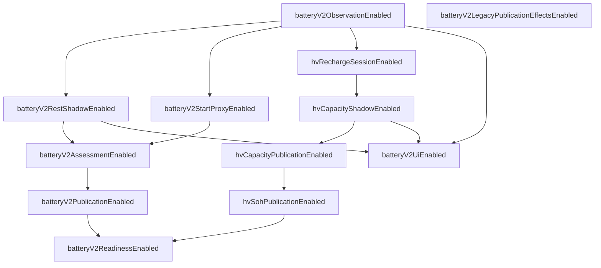

# Battery Health V2 — Feature-Flag- und Rolloutvertrag

**Version:** 1.0 (Spezifikation)  
**Date:** 2026-07-16  
**Status:** **Normativ für zukünftige Implementierung** — keine produktive Flag-Logik in diesem Prompt  
**Repository-Git-Commit (Erstellung):** `222aaa1`  
**Basis:** [`battery-health-v2.md`](./battery-health-v2.md) (Architekturvertrag Prompt 2/78)

**Prinzip:** Bestehende SynqDrive-Flag-Muster wiederverwenden. **Keine** parallele Flag-Engine, kein externes Feature-Flag-SaaS, kein zweites Evaluations-Framework.

---

## Inhaltsverzeichnis

| # | Abschnitt |
|---|-----------|
| 0 | Zweck |
| 1 | Bestehende Flag-Infrastruktur (Ist) |
| 2 | Ziel-Integration (Wiederverwendung) |
| 3 | Flag-Katalog |
| 4 | Abhängigkeitsgraph |
| 5 | Sichere Aktivierungsreihenfolge |
| 6 | Deaktivierung und Rollback |
| 7 | Metriken |
| 8 | Erlaubte Schreibpfade bei deaktivierter Publication |
| 9 | Laufzeit vs. Deployment |
| 10 | Org- und Fahrzeug-Overrides |
| 11 | Rollout-Phasen |
| 12 | Abnahmekriterien (Prompt 3) |

---

## 0. Zweck

Dieser Vertrag definiert **wie** Battery Health V2 schrittweise und reversibel aktiviert wird, ohne unsichere Legacy-Effekte (Readiness, Alerts, Publication) vorzeitig in Produktion zu öffnen.

**Ziele:**

- Schichtweise Aktivierung entlang des Architekturmodells (Observation → Shadow → Assessment → Publication → UI/Readiness)
- Klare Defaults: **Legacy-unsichere Effekte aus**, **neue Publication aus**, **HV SOH aus**, **REST Shadow aus**
- Einheitliche Evaluierung über **einen** `BatteryHealthV2Config`-Service
- Operative Sicherheit: Rollback ohne Datenverlust für Shadow/Evidence

**Nicht Gegenstand:** Implementierung der Config-Klasse, Prisma-Migration, Admin-UI (folgen in Prompts 4+).

---

## 1. Bestehende Flag-Infrastruktur (Ist)

SynqDrive nutzt **kein** zentrales Feature-Flag-Produkt. Bewährte Muster:

| Muster | Beispiel im Repo | Eigenschaft |
|--------|------------------|-------------|
| **Env + `registerAs` Config-Modul** | `notification-engine.config.ts` (`NOTIFICATIONS_V2`), `task-automation-outbox.config.ts`, `payment-email.config.ts`, `ai.config.ts` (`parseBooleanEnv`) | Global; Deployment via `backend.env`; NestJS `ConfigService` |
| **Org-Spalte `Boolean`** | `Organization.paymentsEnabled` + `PaymentsAccessService` | Org-Scope; **Laufzeit** änderbar (Platform Admin) |
| **Org-Join `isEnabled`** | `PartsProviderOrgAccess.isEnabled` | Provider × Org |
| **JSON `configJson`** | `OrganizationIntegration.configJson`, Task-Automation Org-Overrides | Flexibel; Laufzeit |
| **Shadow-Mode pro Event** | `notification-event-registry` (`shadowModeEnabled`), Adapter `shadowModeOnly` | Schreibt intern, keine User-Effekte |
| **Threshold-Env (kein Flag)** | `BATTERY_REST_60M_MS`, `BATTERY_MAX_SAMPLE_AGE_MS` | Bereits Battery-bezogen; bleiben **Schwellen**, keine Feature-Flags |

**Explizit nicht vorhanden:** generischer `FeatureFlagService`, LaunchDarkly, Unleash, per-Request-Flag-Cache.

**Battery V2 Plan:** Neues Modul `backend/src/config/battery-health-v2.config.ts` (analog Notifications/Outbox) + optional `Organization.batteryHealthV2ConfigJson` (analog Integrations-JSON) — **kein** neues Framework.

---

## 2. Ziel-Integration (Wiederverwendung)

### 2.1 `BatteryHealthV2Config` (geplant)

```typescript
// Ziel-Signatur (Spezifikation only)
@Injectable()
export class BatteryHealthV2Config {
  // Global env defaults
  isObservationEnabled(): boolean;
  isRestShadowEnabled(): boolean;
  // …

  // Effective flag = f(globalEnv, orgConfigJson?, vehicleConfigJson?)
  resolve(orgId: string, vehicleId?: string): BatteryHealthV2EffectiveFlags;
}
```

- **Single entry point** für `BatteryV2Service`, `HvBatteryHealthService`, `CanonicalBatteryHealthService`, `RentalHealthService`, `BatteryCriticalDetector`, Frontend-Gates
- Unit-Tests mit env + org JSON fixtures (Muster: `ai.config.spec.ts`, `payments-access.service.spec.ts`)
- Production-Guard für kritische Flags (Muster: `TASK_AUTOMATION_OUTBOX_ENABLED=false` → error in prod)

### 2.2 Env-Namenskonvention

| Code-Flag (camelCase) | Environment Variable |
|-----------------------|---------------------|
| `batteryV2ObservationEnabled` | `BATTERY_V2_OBSERVATION_ENABLED` |
| `batteryV2RestShadowEnabled` | `BATTERY_V2_REST_SHADOW_ENABLED` |
| `batteryV2StartProxyEnabled` | `BATTERY_V2_START_PROXY_ENABLED` |
| `batteryV2AssessmentEnabled` | `BATTERY_V2_ASSESSMENT_ENABLED` |
| `batteryV2PublicationEnabled` | `BATTERY_V2_PUBLICATION_ENABLED` |
| `batteryV2LegacyPublicationEffectsEnabled` | `BATTERY_V2_LEGACY_PUBLICATION_EFFECTS_ENABLED` |
| `hvRechargeSessionEnabled` | `BATTERY_V2_HV_RECHARGE_SESSION_ENABLED` |
| `hvCapacityShadowEnabled` | `BATTERY_V2_HV_CAPACITY_SHADOW_ENABLED` |
| `hvCapacityPublicationEnabled` | `BATTERY_V2_HV_CAPACITY_PUBLICATION_ENABLED` |
| `hvSohPublicationEnabled` | `BATTERY_V2_HV_SOH_PUBLICATION_ENABLED` |
| `batteryV2UiEnabled` | `BATTERY_V2_UI_ENABLED` |
| `batteryV2ReadinessEnabled` | `BATTERY_V2_READINESS_ENABLED` |

Eintrag in `backend/.env.example` mit Kommentarblock — **keine** Secrets.

### 2.3 Org-Override (geplant, optional pro Flag)

JSON-Pfad: `Organization.batteryHealthV2ConfigJson` (neue Spalte, Migration später) **oder** interim `OrganizationIntegration.configJson` Unterbaum `batteryHealthV2` — Entscheidung Prompt 4; Vertrag: **org kann nur Flags aktivieren, die global erlaubt sind** (global = false → org true ist **verboten**).

### 2.4 Fahrzeug-Override (geplant, Canary)

JSON auf `Vehicle` oder `DimoVehicle.metadata` — nur für explizite Canary-Fahrzeuge (z. B. KS FH 660E). Gleiche Regel: **kann nicht global deaktivierte Flags aktivieren**.

---

## 3. Flag-Katalog

Legende:

- **Scope G** = global (env), **O** = organisation, **V** = fahrzeug
- **Runtime** = ohne Redeploy änderbar
- **Deploy** = nur via env + Prozess-Neustart

### 3.1 `batteryV2ObservationEnabled`

| Attribut | Wert |
|----------|------|
| **Default** | `false` |
| **Scope** | G (O/V kann nicht überschreiben wenn G=false) |
| **Schicht** | Provider Observation (Ebene 1) |
| **Zweck** | Observation-Dedup, TS-Wechsel-Erkennung, `CapabilityState`-Preflight; **keine** Measurement ohne weiteres Flag |
| **Abhängigkeiten** | Keine (Root-Ingestion-Flag) |
| **Aktivierung** | Phase 1 (erstes technisches Gate) |
| **Deaktivierung** | Observation-Pipeline no-op; Live State weiter via bestehendem Snapshot |
| **Rollback** | Env `false` + Restart; keine Daten löschen |
| **Metriken** | `battery_v2_observation_total{messart,result}`, `battery_v2_observation_skipped_total{reason}` |
| **Schreiben bei OFF** | `vehicle_latest_states` unverändert (bestehend) |
| **Änderung** | **Deploy** (env); Org-Override **nicht** vorgesehen |

### 3.2 `batteryV2RestShadowEnabled`

| Attribut | Wert |
|----------|------|
| **Default** | `false` |
| **Scope** | G; O opt-in für Flotten-Rollout; V Canary |
| **Schicht** | Measurement Session + Measurement (REST_60M/REST_6H) + Evidence `SHADOW` |
| **Zweck** | REST-Ruhemessungen erfassen mit Quality-Gates; **Shadow** — keine Publication |
| **Abhängigkeiten** | `batteryV2ObservationEnabled=true` |
| **Aktivierung** | Phase 2 (nach Observation stabil) |
| **Deaktivierung** | Keine neuen REST-Measurements; bestehende Shadow-Evidence bleibt |
| **Rollback** | Flag off; Evidence mit `quality=SHADOW` behalten für Analyse |
| **Metriken** | `battery_v2_rest_shadow_total{window,quality}`, `battery_v2_rest_missed_total` |
| **Schreiben bei OFF** | Observation-Metriken optional; **kein** REST Measurement/Evidence |
| **Änderung** | Deploy global; **O/V Runtime** für schrittweisen Rollout |

### 3.3 `batteryV2StartProxyEnabled`

| Attribut | Wert |
|----------|------|
| **Default** | `false` |
| **Scope** | G; O; V |
| **Schicht** | Measurement Session (Trip-Start) + Measurement `START_DIP_PROXY` |
| **Zweck** | Diagnostischer Startdip **nur** — max. 10 % Assessment wenn Assessment an; **nie** CRANK_MIN |
| **Abhängigkeiten** | `batteryV2ObservationEnabled=true`; Profil ≠ `UNSUPPORTED_PROFILE` (BEV ohne LV) |
| **Verhalten wenn ON** | **Immer diagnostisch** — auch bei Assessment/Publication OFF werden Measurements `DIAGNOSTIC` geschrieben |
| **Deaktivierung** | `onTripStart` Startdip-Pfad skip |
| **Rollback** | Flag off |
| **Metriken** | `battery_v2_start_proxy_total{quality}`, `battery_v2_start_proxy_rejected_total{reason}` |
| **Schreiben bei OFF** | Kein Startdip-Measurement |
| **Änderung** | Deploy + **O/V Runtime** |

### 3.4 `batteryV2AssessmentEnabled`

| Attribut | Wert |
|----------|------|
| **Default** | `false` |
| **Scope** | G; O |
| **Schicht** | Assessment (Ebene 6) |
| **Zweck** | `computeHealth` / interne Scores in `battery_features` Rohfelder — **ohne** Publication |
| **Abhängigkeiten** | Mind. eines: `batteryV2RestShadowEnabled` oder `batteryV2StartProxyEnabled` oder WORKSHOP Evidence |
| **Deaktivierung** | Keine neuen Assessment-Updates; Rohfelder eingefroren |
| **Rollback** | Flag off; `estimatedSohPct` nicht weiter berechnet |
| **Metriken** | `battery_v2_assessment_total{scope,result}`, `battery_v2_assessment_suppressed_total{reason}` |
| **Schreiben bei OFF** | Shadow Evidence/Messungen weiter erlaubt wenn jeweilige Ingestion-Flags an |
| **Änderung** | Deploy; O Runtime nach globalem ON |

### 3.5 `batteryV2PublicationEnabled`

| Attribut | Wert |
|----------|------|
| **Default** | `false` |
| **Scope** | G; O |
| **Schicht** | Publication (Ebene 7) — **neue** V2-Pipeline |
| **Zweck** | `publishedEstimatedHealth`, Maturity FSM, EWMA — LV **neu** |
| **Abhängigkeiten** | `batteryV2AssessmentEnabled=true`; keine CONTAMINATED-Kern-Evidence (30d); Maturity-Gates |
| **Deaktivierung** | Keine Updates an `published*` V2-Feldern; API zeigt vorherige Publication oder `INITIAL_CALIBRATION` |
| **Rollback** | Flag off; **letzte** Publication bleibt lesbar mit `stalePublication=true` Banner |
| **Metriken** | `battery_v2_publication_state{scope,state}`, `battery_v2_publication_suppressed_total` |
| **Schreiben bei OFF** | Assessment-Rohwerte + Shadow Evidence **erlaubt** |
| **Änderung** | Deploy; O Runtime **nur** nach globalem ON + manueller Freigabe |

### 3.6 `batteryV2LegacyPublicationEffectsEnabled`

| Attribut | Wert |
|----------|------|
| **Default** | `false` |
| **Scope** | G only |
| **Schicht** | Readiness + Alert (Legacy-Pfad) |
| **Zweck** | Steuert ob **bestehende** `publishedSohPct`/LV-Score-Effekte auf Rental Health, `BatteryCriticalDetector`, AI Summary wirken |
| **Verbindliche Default-Intention** | **Aus** — unsichere Legacy-Readiness/Alert-Effekte deaktivieren bis V2 Publication validiert |
| **Abhängigkeiten** | Unabhängig (Kill-Switch für Legacy) |
| **ON-Verhalten** | Ist-Zustand (V4.8): Detector + Rental nutzen Canonical inkl. Legacy-Publication |
| **OFF-Verhalten** | Readiness `battery`: nur Live-Spannung/HM-Warnleuchte; **kein** CRITICAL aus LV-Publication; Detector HV/LV-Publication-Pfade skip |
| **Rollback** | `true` nur als Notfall (expliziter Incident) |
| **Metriken** | `battery_v2_legacy_effects_total{path,suppressed}` |
| **Schreiben** | Beeinflusst **keine** DB-Writes — nur Read-Pfade |
| **Änderung** | **Deploy only**; in Production `false` nicht per Runtime überschreibbar |

### 3.7 `hvRechargeSessionEnabled`

| Attribut | Wert |
|----------|------|
| **Default** | `false` |
| **Scope** | G; O; V |
| **Schicht** | Measurement Session (HV recharge) |
| **Zweck** | DIMO `segments(mechanism: recharge)` periodisch (31d rolling) → Session-Store |
| **Abhängigkeiten** | `batteryV2ObservationEnabled=true`; DIMO tokenId vorhanden |
| **Deaktivierung** | Keine neuen Sessions; bestehende Session-Tabelle read-only |
| **Rollback** | Flag off |
| **Metriken** | `battery_v2_hv_session_fetch_total{result}`, `battery_v2_hv_session_count` |
| **Schreiben bei OFF** | HV Live State via Snapshot weiter; **keine** Session-Rows |
| **Änderung** | Deploy + **O/V Runtime** |

### 3.8 `hvCapacityShadowEnabled`

| Attribut | Wert |
|----------|------|
| **Default** | `false` |
| **Scope** | G; O; V |
| **Schicht** | Assessment Shadow (M2 Energy/SOC) |
| **Zweck** | Schätzung `estimatedCapacityKwh` intern — **niemals** user-facing SOH |
| **Abhängigkeiten** | `hvRechargeSessionEnabled=true` **oder** ausreichende Live Energy+SOC; Profil BEV/ PHEV |
| **Verbindliche Intention** | Wenn ON → **nur Shadow** (`quality=SHADOW`) |
| **Deaktivierung** | Keine neuen Shadow-Capacity-Evidence |
| **Rollback** | Flag off |
| **Metriken** | `battery_v2_hv_capacity_shadow_kwh` (histogram), `battery_v2_hv_capacity_shadow_cv` |
| **Schreiben bei OFF** | Sessions weiter wenn `hvRechargeSessionEnabled` |
| **Änderung** | Deploy + **O/V Runtime** |

### 3.9 `hvCapacityPublicationEnabled`

| Attribut | Wert |
|----------|------|
| **Default** | `false` |
| **Scope** | G; O |
| **Schicht** | Publication (HV Capacity) |
| **Zweck** | Publizierte Kapazität nur bei verifizierter Referenz + VALID Session/M2-Konsens |
| **Abhängigkeiten** | `hvCapacityShadowEnabled=true` (min. 14d stabile Shadow-Daten); verifizierte `referenceCapacityKwh`; **nicht** nur Repo-Feld |
| **Deaktivierung** | `publishedCapacityKwh` einfrieren |
| **Rollback** | Flag off |
| **Metriken** | `battery_v2_hv_capacity_published_kwh`, `battery_v2_hv_capacity_publication_state` |
| **Schreiben bei OFF** | Shadow weiter erlaubt |
| **Änderung** | Deploy; O Runtime nach expliziter Freigabe |

### 3.10 `hvSohPublicationEnabled`

| Attribut | Wert |
|----------|------|
| **Default** | `false` |
| **Scope** | G; O |
| **Schicht** | Publication (HV SOH %) |
| **Zweck** | User-facing HV SOH nur aus Provider/Workshop/Document **oder** Capacity+Referenz |
| **Abhängigkeiten** | Provider SOH fresh **OR** (`hvCapacityPublicationEnabled` + Referenz) — Tesla heute: **kein** Auto-ON |
| **Verbindliche Default-Intention** | **Aus** — kein sichtbarer SOH ohne belastbare Quelle |
| **Deaktivierung** | API `sohStatus=UNAVAILABLE`; UI kein SOH-% |
| **Rollback** | Flag off; Default-85-Bug bleibt durch separates Datenfix-Script (Prompt 35+) |
| **Metriken** | `battery_v2_hv_soh_published_pct`, `battery_v2_hv_soh_source{source}` |
| **Schreiben bei OFF** | Provider SOH → Evidence `PROVIDER_REPORTED` erlaubt (Ingestion); **kein** `publishedSohPct` |
| **Änderung** | Deploy; O Runtime nur mit Runbook |

### 3.11 `batteryV2UiEnabled`

| Attribut | Wert |
|----------|------|
| **Default** | `false` |
| **Scope** | G; O |
| **Schicht** | UI (Frontend + API `displayMode`) |
| **Zweck** | Shadow-Badges, Freshness-Banner, neue Detail-Felder, `policyProfile` |
| **Abhängigkeiten** | Mind. ein Backend-Pfad aktiv (Observation oder Shadow); API liefert `flags` Block |
| **Deaktivierung** | UI fällt auf Legacy-Darstellung zurück (bestehende Health Tab) |
| **Rollback** | Flag off — rein kosmetisch |
| **Metriken** | `battery_v2_ui_exposed_total{surface}` (frontend counter optional) |
| **Schreiben** | Keine DB-Effekte |
| **Änderung** | **Runtime** (Org) + Deploy global kill-switch |

### 3.12 `batteryV2ReadinessEnabled`

| Attribut | Wert |
|----------|------|
| **Default** | `false` |
| **Scope** | G; O |
| **Schicht** | Rental Readiness (Ebene 8) |
| **Zweck** | Neue Readiness-Matrix aus Architektur §9.4 — Publication-gated |
| **Abhängigkeiten** | `batteryV2PublicationEnabled` oder `hvSohPublicationEnabled` (mind. ein publizierbarer Pfad); `batteryV2LegacyPublicationEffectsEnabled=false` empfohlen |
| **Deaktivierung** | Rental Health `battery`: `unknown`/`good` nach Live-only-Policy; **kein** Block aus Shadow |
| **Rollback** | Flag off |
| **Metriken** | `battery_v2_readiness_state{state}`, `battery_v2_readiness_blocked_total` |
| **Schreiben** | Keine direkten Writes |
| **Änderung** | Deploy; O Runtime |

---

## 4. Abhängigkeitsgraph



**Hard rules:**

1. Kein Flag darf Publication/Readiness aktivieren wenn Parent false.
2. `batteryV2LegacyPublicationEffectsEnabled` ist **orthogonal** (Kill-Switch), default **false**.
3. `hvSohPublicationEnabled` **ohne** belastbare Quelle → Config-Service wirft bei Startup-Validierung **Warnung**, nicht Auto-ON.

---

## 5. Sichere Aktivierungsreihenfolge

| Phase | Flags ON | Ziel | Exit-Kriterium |
|-------|----------|------|----------------|
| **0 — Baseline** | alle `false`; `batteryV2LegacyPublicationEffectsEnabled=false` | Legacy-Effekte aus | Metriken-Baseline 7d |
| **1 — Observation** | `batteryV2ObservationEnabled` | Dedup, Kadenz sichtbar | `observation_skipped` <5 % außer stale |
| **2a — LV Shadow** | + `batteryV2RestShadowEnabled` (1 Org) | REST Shadow Evidence | AC01–AC02, AC09 |
| **2b — LV Diagnostic** | + `batteryV2StartProxyEnabled` (ICE only) | Startdip diagnostisch | AC03, AC04 BEV skip |
| **3 — HV Sessions** | + `hvRechargeSessionEnabled` (BEV Canary) | Recharge-Segmente | AC13, ≥3 Sessions/31d |
| **4 — HV Shadow Cap** | + `hvCapacityShadowEnabled` | M2 intern | AC14, CV<2 % |
| **5 — Assessment** | + `batteryV2AssessmentEnabled` | Rohscores ohne Publish | Kein STABLE ohne VALID |
| **6 — UI Shadow** | + `batteryV2UiEnabled` | Badges im Detail | Keine SOH-% Labels |
| **7 — LV Publication** | + `batteryV2PublicationEnabled` (1 Org ICE) | `publishedEstimatedHealth` | AC12, 6 VALID REST / 14d |
| **8 — HV Capacity Pub** | + `hvCapacityPublicationEnabled` | Nur mit verifizierter Referenz | Runbook + AC19 |
| **9 — HV SOH Pub** | + `hvSohPublicationEnabled` | Nur Provider/Workshop oder 8+Referenz | AC11, AC07 |
| **10 — Readiness** | + `batteryV2ReadinessEnabled`; Legacy bleibt **off** | Neue Policy | AC20, AC21 |
| **11 — Fleet** | Org-Overrides schrittweise | Volle Flotte | SLOs §7 grün |

**Verboten:** Phase 7–10 überspringen; `hvSohPublicationEnabled` vor Referenz-Verifikation; `batteryV2LegacyPublicationEffectsEnabled=true` zusammen mit neuem Readiness ohne Incident.

---

## 6. Deaktivierung und Rollback

### 6.1 Allgemeine Regeln

| Aktion | Verhalten |
|--------|-----------|
| Flag OFF (Deploy) | Pipeline-Pfad sofort no-op nach Restart; **keine** Löschung historischer Daten |
| Org-Override OFF | Nur diese Org; global bleibt |
| Publication OFF | Bestehende `published*` Werte **read-only** mit `stale=true` |
| Assessment OFF | Einfrieren Rohscores |
| Legacy-OFF | Readiness/Detector konservativ (Live/HM only) |

### 6.2 Rollback-Stufen

| Stufe | Maßnahme | Daten |
|-------|----------|-------|
| **R1 — Soft** | Betroffenes Flag `false` (env/org) | Behalten |
| **R2 — UI** | `batteryV2UiEnabled=false` | Behalten |
| **R3 — Publication** | `batteryV2PublicationEnabled=false`, `hvSohPublicationEnabled=false` | Published frozen |
| **R4 — Legacy restore** | `batteryV2LegacyPublicationEffectsEnabled=true` **nur** Incident | Ist-Verhalten |
| **R5 — Hard** | Code-Revert + Deploy `2cd57c8`-Äquivalent | DB unverändert |

**Kein Rollback:** Löschen von `battery_evidence` / Shadow-Measurements ohne Backup.

### 6.3 Notfall: `batteryV2LegacyPublicationEffectsEnabled`

- Default **false** = sicherer Modus
- `true` = bewusste Rückkehr zu V4.8-Verhalten für Readiness/Detector
- Erfordert Incident-Ticket + zeitliche Befristung

---

## 7. Metriken

### 7.1 Globale Metriken (immer, auch Flags off)

| Metrik | Typ | Zweck |
|--------|-----|-------|
| `synqdrive_battery_v2_flag_enabled` | gauge | `flag` label — effektiver Zustand pro Org-Sample |
| `synqdrive_battery_hook_total` | counter | `hook`, `result` — Ingestion-Erfolg |

### 7.2 Pro-Flag-Metriken

Siehe §3 je Flag. Alle Metriken:

- **Keine** PII, keine `vehicleId` als Label (Cardinality) — nur `profile`, `scope`, `quality`
- Optional: `org_bucket` (hash) in Staging only

### 7.3 Rollout-SLOs (Gate vor nächster Phase)

| SLO | Schwelle |
|-----|----------|
| Hook error rate | <0,1 % über 24 h |
| HV duplicate skip rate | >90 % wenn Observation+HV an |
| Shadow capacity CV (BEV) | <2 % über 3 Sessions |
| Publication suppressed (contaminated) | dokumentiert, nicht steigend |
| Legacy effects suppressed | =100 % wenn Legacy off |

### 7.4 Grafana

Dashboard **„Battery V2 Rollout“**: Flag-States, Phase, SLOs, Shadow vs Published Zähler.

---

## 8. Erlaubte Schreibpfade bei deaktivierter Publication

Wenn `batteryV2PublicationEnabled=false` **und** `hvSohPublicationEnabled=false` **und** `hvCapacityPublicationEnabled=false`:

| Tabelle / Artefakt | Erlaubt | Bedingung |
|--------------------|---------|-----------|
| `vehicle_latest_states` | **Ja** | Immer (bestehender Snapshot) |
| `dimo_poll_logs` | **Ja** | Immer |
| `battery_evidence` | **Ja** | `quality ∈ {SHADOW, VALID, VALID_PROXY}`; **kein** falscher `SOH_PERCENT` für LV-Score |
| `battery_measurements` (Ziel) | **Ja** | Shadow/Diagnostic |
| `battery_features` Rohfelder | **Ja** | Wenn `batteryV2AssessmentEnabled` |
| `battery_features.published*` | **Nein** | Publication off |
| `hv_battery_health_snapshots` | **Ja** | Mit Insert-Gate (wenn implementiert) |
| `hv_battery_health_current.published*` | **Nein** | HV Publication off |
| `hv_battery_health_current` Shadow-Felder | **Ja** | Wenn `hvCapacityShadowEnabled` |
| HV Session Store (Ziel) | **Ja** | Wenn `hvRechargeSessionEnabled` |
| Rental Readiness state | **Nein** (neue Policy) | `batteryV2ReadinessEnabled=false` |
| `BATTERY_CRITICAL` Insights | **Nein** aus Publication | `batteryV2LegacyPublicationEffectsEnabled=false` |

**Grundsatz:** Shadow/Diagnostic **schreiben**, Publication/Readiness/Alert **nicht**.

---

## 9. Laufzeit vs. Deployment

| Flag | Global env | Org-Override | Fahrzeug-Override | Änderung in Production |
|------|------------|--------------|-----------------|------------------------|
| `batteryV2ObservationEnabled` | ✓ | — | — | **Deploy only** |
| `batteryV2RestShadowEnabled` | ✓ | ✓ | ✓ (Canary) | Deploy + **Runtime** O/V |
| `batteryV2StartProxyEnabled` | ✓ | ✓ | ✓ | Deploy + **Runtime** O/V |
| `batteryV2AssessmentEnabled` | ✓ | ✓ | — | Deploy + **Runtime** O |
| `batteryV2PublicationEnabled` | ✓ | ✓ | — | Deploy; O Runtime mit Runbook |
| `batteryV2LegacyPublicationEffectsEnabled` | ✓ | — | — | **Deploy only**; `false` in prod nicht per Runtime aufheben |
| `hvRechargeSessionEnabled` | ✓ | ✓ | ✓ | Deploy + **Runtime** O/V |
| `hvCapacityShadowEnabled` | ✓ | ✓ | ✓ | Deploy + **Runtime** O/V |
| `hvCapacityPublicationEnabled` | ✓ | ✓ | — | Deploy + **Runtime** O (Freigabe) |
| `hvSohPublicationEnabled` | ✓ | ✓ | — | **Deploy**; O Runtime nur mit Runbook |
| `batteryV2UiEnabled` | ✓ | ✓ | — | **Runtime** O bevorzugt |
| `batteryV2ReadinessEnabled` | ✓ | ✓ | — | Deploy + **Runtime** O |

**Caching:** Effective flags pro `(orgId, vehicleId)` TTL **60 s** max — nach Override-Änderung konsistent ohne Restart.

**Frontend:** `batteryV2UiEnabled` via API-Feld `batterySummary.flags.uiEnabled` — **nie** hardcoded env im Browser.

---

## 10. Org- und Fahrzeug-Overrides

### 10.1 Evaluationsreihenfolge

```
effective = globalEnv AND NOT globalKill
if vehicleOverride != null: effective = effective AND vehicleOverride  // nur restriktiver oder explizite Canary-Liste
if orgOverride != null: effective = effective AND orgOverride        // org kann global ON nicht erzwingen wenn global OFF
```

**Canary:** Vehicle override `true` nur wenn global flag `true` **oder** global in `CANARY_ALLOWLIST` (env JSON).

### 10.2 Geplante Admin-API (Spezifikation)

| Endpoint | Rolle |
|----------|-------|
| `GET /platform/organizations/:id/battery-health-v2/flags` | Read effective |
| `PATCH /platform/organizations/:id/battery-health-v2/flags` | Platform Admin only |
| `PATCH /platform/vehicles/:id/battery-health-v2/flags` | Canary |

Audit-Log in `organization_audit` / bestehendem Platform-Log — **kein** Implementieren in Prompt 3.

---

## 11. Rollout-Phasen (Zusammenfassung Defaults)

| Flag | Default | Modus bei ON |
|------|---------|--------------|
| `batteryV2ObservationEnabled` | **false** | Ingestion-Gate |
| `batteryV2RestShadowEnabled` | **false** | Shadow |
| `batteryV2StartProxyEnabled` | **false** | **Nur diagnostisch** |
| `batteryV2AssessmentEnabled` | **false** | Intern |
| `batteryV2PublicationEnabled` | **false** | LV Publication neu |
| `batteryV2LegacyPublicationEffectsEnabled` | **false** | Legacy Readiness/Alert **aus** |
| `hvRechargeSessionEnabled` | **false** | Session-SoT |
| `hvCapacityShadowEnabled` | **false** | **Nur Shadow** |
| `hvCapacityPublicationEnabled` | **false** | Publication |
| `hvSohPublicationEnabled` | **false** | **Kein** sichtbarer SOH |
| `batteryV2UiEnabled` | **false** | UI-Badges |
| `batteryV2ReadinessEnabled` | **false** | Neue Policy |

**Erstes empfohlenes Prod-ON (Phase 1):** nur `batteryV2ObservationEnabled` — alle User-Effekte bleiben aus.

---

## 12. Abnahmekriterien (Prompt 3)

| ID | Kriterium |
|----|-----------|
| RF01 | Alle 12 Flags mit Default, Scope, Dependencies dokumentiert |
| RF02 | Wiederverwendung `registerAs` + `Organization`/`JSON` — keine neue Engine |
| RF03 | Legacy-unsafe default **off** |
| RF04 | REST Shadow default **off** |
| RF05 | Start Proxy nur diagnostisch wenn ON |
| RF06 | HV Capacity nur Shadow wenn `hvCapacityShadowEnabled` |
| RF07 | HV SOH Publication default **off** |
| RF08 | Neue Publication default **off** |
| RF09 | Erlaubte Writes bei Publication off definiert |
| RF10 | Runtime vs Deploy pro Flag definiert |
| RF11 | Aktivierungsreihenfolge Phase 0–11 |
| RF12 | Rollback R1–R5 dokumentiert |

---

## Referenzen

- [`battery-health-v2.md`](./battery-health-v2.md)
- [`../audits/battery-v2-implementation-inventory.md`](../audits/battery-v2-implementation-inventory.md)
- `backend/src/modules/notifications/notification-engine.config.ts` (V2-Flag-Muster)
- `backend/src/config/task-automation-outbox.config.ts` (Production-Guard-Muster)
- `backend/src/modules/payments/payments-access.service.ts` (Org-Flag-Muster)

---

*Implementierungsstatus: **Spezifikation only**. Nächster Schritt: `battery-health-v2.config.ts` + Prisma/Admin-API (Prompt 4+).*
