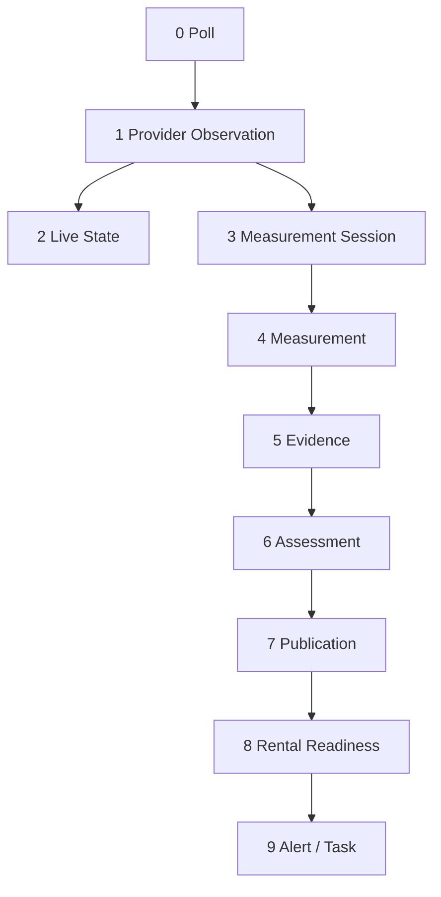
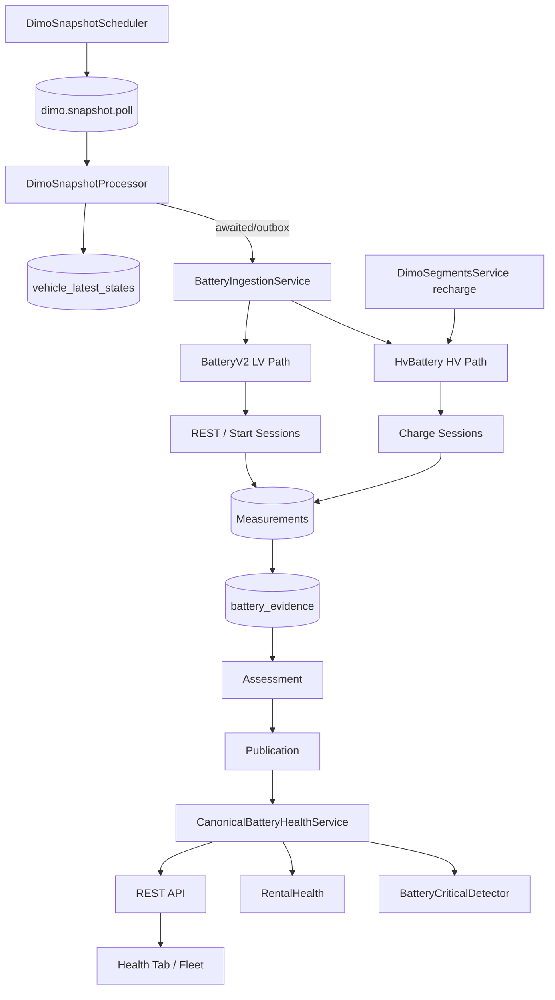

# Battery Health V2 — Verbindlicher Architekturvertrag

**Version:** 2.0 (Spezifikation)  
**Date:** 2026-07-16  
**Status:** **Normativ für zukünftige Implementierung** — keine produktive Umsetzung in diesem Dokument  
**Repository-Git-Commit (Erstellung):** `402cab1`  
**Basis:**

- [`docs/audits/battery-v2-implementation-inventory.md`](../audits/battery-v2-implementation-inventory.md) (Prompt 1/78)
- [`docs/audits/battery-measurement-domain-decision.md`](../audits/battery-measurement-domain-decision.md) (Messartenvertrag)
- [`docs/audits/dimo-tesla-hv-signal-capability.md`](../audits/dimo-tesla-hv-signal-capability.md) (HV-Empirie Tesla)

**Prinzip:** Eine kanonische Read-Fassade (`CanonicalBatteryHealthService`). Keine parallele Battery-Wahrheit in UI, Rental Health, Alerts oder AI.

**Normativität:** Dieses Dokument **übersteuert** Legacy-Code und implizite Annahmen, sofern Audits Widersprüche belegen. Der Messartenvertrag in `battery-measurement-domain-decision.md` bleibt die fachliche Detailquelle für Messarten; dieses Dokument ist die **implementierungsleitende Architektur**.

---

## Inhaltsverzeichnis

| # | Abschnitt |
|---|-----------|
| 0 | Zweck und Geltungsbereich |
| 1 | Schichtenmodell (9 Ebenen) |
| 2 | Leitregel und verbotene Vermischung |
| 3 | LV-Architektur |
| 4 | HV-Architektur |
| 5 | Fahrzeug- und Batterieprofile |
| 6 | Qualitäts-, Freshness-, Capability- und Reifezustände |
| 7 | Evidence-Priorität |
| 8 | Übergang Legacy → V2 |
| 9 | API-, UI-, Monitoring- und Readiness-Vertrag |
| 10 | Verbotene Ableitungen und Abnahmekriterien |
| 11 | Ziel-Runtime-Topologie |
| 12 | Referenzen |

---

## 0. Zweck und Geltungsbereich

SynqDrive Battery Health V2 beschreibt, wie aus DIMO-Telemetrie, Werkstattdaten, Dokumenten und manuellen Bestätigungen **belastbare** Batteriezustände für Flottenbetrieb, Rental Readiness und operative Alerts entstehen — und wo bewusst **keine** Aussage getroffen wird.

**Geltung:**

- Multi-tenant: alle Operationen sind `organizationId`-scoped.
- Keine hardcodierten `vehicleId` / `orgId`.
- Schreibpfad zentral über Snapshot-Hooks, Session-Processor und bestätigte Document-Applies — Ziel: awaited oder Outbox, nicht fire-and-forget.
- Lesepfad zentral: `CanonicalBatteryHealthService` — alle UIs, Rental Health, Insights und AI-Aggregationen konsumieren dieselbe Fassade.

**Nicht Gegenstand dieses Vertrags:** LV-Crank-HF-Anschaffung, Pack-Temperatur-Invention, Tesla-interne BMS-Logik, DIMO-Webhook-Subscription (nur Feasibility in Audits).

---

## 1. Schichtenmodell (9 Ebenen)



### 1.1 Ebene 0 — Poll

| Attribut | Definition |
|----------|------------|
| **Was** | SynqDrive-Request an DIMO (~30 s) oder vergleichbarer Provider-Pull |
| **Persistenz** | `dimo_poll_logs`, Queue-Job-Status |
| **Darf Health behaupten?** | **Nein** |
| **Beispiel** | Erfolgreicher `dimo.snapshot.poll` Job |

Poll-Erfolg ist **Betriebs-SLO**, nicht Messqualität.

### 1.2 Ebene 1 — Provider Observation

| Attribut | Definition |
|----------|------------|
| **Was** | Ein vom Provider gelieferter Signalwert mit Provider-`timestamp` / `lastSeenAt` |
| **Persistenz** | Noch **keine** Battery-Tabelle; transient im Snapshot-Processor |
| **Darf Health behaupten?** | **Nein** |
| **Neue Observation** | Provider-TS **oder** Wert ändert sich gegenüber letzter Observation desselben Signals |
| **Wiederholung** | Gleicher TS + gleicher Wert = **keine** neue Observation (Audit: 94–99 % Wiederholrate) |

**Abgrenzung:** Observation ist die kleinste providerseitige Einheit. Erst nach Qualitäts- und Kontextprüfung wird daraus Measurement.

### 1.3 Ebene 2 — Live State

| Attribut | Definition |
|----------|------------|
| **Was** | Aktueller Telemetrie-Spiegel für UI und Kontext — **ohne** automatische Health-Aussage |
| **Persistenz** | `vehicle_latest_states` (`lvBatteryVoltage`, `evSoc`, traction-Felder, Provenance) |
| **Darf Health behaupten?** | **Nein** |
| **Freshness** | `providerFetchedAt`, `sourceTimestamp`, abgeleitete `live*Freshness` |

Live State darf **niemals** Publication-Freshness oder Assessment-Maturity aktualisieren.

### 1.4 Ebene 3 — Measurement Session

| Attribut | Definition |
|----------|------------|
| **Was** | Zeitlich zusammengehöriger Messzyklus mit definiertem Start, Ende und Kontext |
| **LV-Beispiele** | Ruhefenster ≥60 min / ≥6 h; diagnostisches Startfenster |
| **HV-Beispiele** | DIMO `recharge` segment; laufende Session (`isOngoing`) |
| **Darf Health behaupten?** | Nur **nach** Session-Ende + Qualitätsgate |
| **Primärquelle HV** | **DIMO `segments(mechanism: recharge)`** — nicht Poll-Flanken allein |

Sessions sind die **einzige** belastbare Grundlage für HV-Kapazitätsschätzung.

### 1.5 Ebene 4 — Measurement

| Attribut | Definition |
|----------|------------|
| **Was** | Einzelwert: `messart` + `quality` + Provenienz + `observedAt` + optional `sessionId` |
| **Persistenz (Ziel)** | `battery_measurements` oder äquivalent normiertes Evidence-`quality` + `metadata.messart` |
| **Darf Health behaupten?** | **Nein** (roh) |
| **Beispiele** | `REST_60M` = 12,41 V `VALID`; `SHADOW_HV_CAPACITY` = 55,5 kWh `SHADOW` |

**Insert-Gate (verbindlich):** Kein Measurement ohne neue Observation **und** bestandene Qualitäts-/Profil-Prüfung. Identischer `(vehicleId, messart, observedAt)` → Skip oder `TIMESTAMP_INCONSISTENT`.

### 1.6 Ebene 5 — Evidence

| Attribut | Definition |
|----------|------------|
| **Was** | Für Assessments zugelassene, deduplizierte Messung mit semantisch korrektem `valueType` |
| **Persistenz** | `battery_evidence` |
| **Dedup** | `(vehicleId, scope, valueType, sourceType, observedAt)` |
| **Zulassung** | Nur aus Measurement mit `quality ∈ {VALID, VALID_PROXY, SHADOW}` |
| **Darf Health behaupten?** | Indirekt |

`SHADOW`-Evidence ist **nicht** publication- oder readiness-tauglich.

### 1.7 Ebene 6 — Assessment

| Attribut | Definition |
|----------|------------|
| **Was** | Interne Bewertung aus **kompatiblen** Evidence-Werten |
| **LV-Output** | `estimatedHealthScore` (0–100) — **niemals** als Werkstatt-SOH labeln |
| **HV-Output** | `estimatedCapacityKwh` (Shadow), optional `estimatedSohPct` nur mit verifizierter Referenz |
| **Persistenz (Ziel)** | Berechnung + Zwischenstand in `battery_features` / `hv_battery_health_current` Rohfelder |
| **Darf Health behaupten?** | Intern ja; user-facing nur über Publication |

### 1.8 Ebene 7 — Publication

| Attribut | Definition |
|----------|------------|
| **Was** | Stabilisierter, hysterese-gefilterter, maturity-geprüfter Zustand für UI |
| **LV-Felder** | `publishedEstimatedHealth` (Zielname); Ist: `publishedSohPct` → Migration |
| **HV-Felder** | `publishedSohPct` nur bei echter SOH-Quelle; `publishedCapacityKwh` optional Shadow-intern |
| **States** | `INITIAL_CALIBRATION` → `STABILIZING` → `STABLE` |
| **Darf Health behaupten?** | **Ja** (user-facing) |

Publication ohne VALID-Kern-Evidence der letzten 30 Tage ist **gesperrt**.

### 1.9 Ebene 8 — Rental Readiness

| Attribut | Definition |
|----------|------------|
| **Was** | Separate Policy-Schicht: darf Vermietung blockieren? |
| **Persistenz** | Keine eigene Battery-Tabelle; Ableitung in `RentalHealthService` |
| **Input** | Publication + Evidence-Stärke + HM-Warnleuchten |
| **Darf Health behaupten?** | Policy only — **kein** Ersatz für Publication |

`WATCH` ist **nicht** alertbar. `estimate_unavailable` blockiert Ready **nicht** allein.

### 1.10 Ebene 9 — Alert / Task

| Attribut | Definition |
|----------|------------|
| **Was** | Operativer Handlungsbedarf (`BATTERY_CRITICAL` Insight → `BATTERY_CHECK` Task) |
| **Input** | **Publication** (nicht Roh-Snapshot, nicht Shadow) |
| **Darf Health behaupten?** | **Nein** — Aktion, nicht Metrik-Wahrheit |

---

## 2. Leitregel und verbotene Vermischung

### 2.1 Leitregel (verbindlich)

```
Poll ≠ Provider Observation ≠ Live State ≠ Measurement Session ≠ Measurement
  ≠ Evidence ≠ Assessment ≠ Publication ≠ Rental Block
```

Jede Ebene hat eigene Freshness, eigene Fehlersemantik und eigene UI-Darstellung. **Keine** Ebene darf die Semantik einer höheren Ebene ersetzen.

| Übergang | Regel |
|----------|-------|
| Poll → Observation | Poll kann erfolgreich sein ohne neue Observation |
| Observation → Live State | Live State spiegelt letzte Observation; aktualisiert keine Assessment-Zeitstempel |
| Observation → Measurement | Nur mit Session-Kontext + Quality-Gate |
| Measurement → Evidence | Nur `VALID`, `VALID_PROXY`, `SHADOW` (Shadow nicht publizierbar) |
| Evidence → Assessment | Nur kompatible Messarten; WORKSHOP/DOCUMENT Override erlaubt |
| Assessment → Publication | EWMA + Maturity + Hysterese; gesperrt bei CONTAMINATED-Kern |
| Publication → Readiness | Policy-Matrix §9.3 |
| Readiness → Alert | Nur `CRITICAL`/`WARNING` nach Schwellen; nie aus Shadow |

### 2.2 SynqDrive-Leitsatz

SynqDrive darf **keine präzisere Health-Aussage** machen, als Signalkadenz, Kontext, Profil und empirische Qualität erlauben.

### 2.3 Ebenen-Verbote (Kurzform)

| Verbot | Konsequenz |
|--------|------------|
| Live → Publication | Freshness-Entkopplung |
| CONTAMINATED → REST Evidence | Tag `CONTAMINATED_*`, kein Assessment-Input |
| LV-Score als `SOH_PERCENT` | `ESTIMATED_HEALTH_SCORE` valueType |
| Shadow → user-facing SOH | Nur interne Diagnostics |
| API 500 → `null` wie „keine Batterie“ | `endpoint_error` Zustand |
| Poll-Zeile = Measurement | Insert-Gate |

---

## 3. LV-Architektur

### 3.1 Produktionsstatus je Messart

| Messart | Modus | Assessment | Publication | UI-Label |
|---------|-------|------------|-------------|----------|
| **LIVE_VOLTAGE** | **PRODUCTION** | Nein | Nein | „Aktuelle Spannung (Live)“ |
| **LIVE_LOADED** | PRODUCTION (Proxy) | Nein | Nein | „Spannung unter Last“ |
| **CHARGING_VOLTAGE** | PRODUCTION (Proxy) | Kontamination-Tag | Nein | „Ladespannung (nicht Ruhe)“ |
| **REST_60M** | **SHADOW** | Nur bei `VALID` | Nein bis Coverage ≥40 % | „Ruhespannung (60 min)“ + Shadow-Badge |
| **REST_6H** | **SHADOW** | Nur bei `VALID` | Nein bis Coverage ≥40 % | „Ruhespannung (6 h)“ + Shadow-Badge |
| **START_DIP_PROXY** | **DIAGNOSTIC** | ≤10 % Gewicht | Nein | „Startdip (diagnostisch)“ |
| **CRANK_MIN** | **UNSUPPORTED** | **Verboten** | **Verboten** | Nicht anzeigen |
| **RECOVERY_*`** | DIAGNOSTIC | Diagnostisch | Nein | Detail-Modal only |

### 3.2 LIVE_VOLTAGE (produktiv)

- Signal: `powertrainLowVoltageBatteryCurrentVoltage` → `vehicle_latest_states.lvBatteryVoltage`
- Profile: ICE, HEV, PHEV mit Signal
- Stale-Guard: `BATTERY_MAX_SAMPLE_AGE_MS` (default 5 min) verwirft Observation für REST, **nicht** zwingend für Live-Anzeige mit `STALE`-Badge
- Rental: nur indirekt über HM-Warnleuchte oder extreme Schwellen mit Live-Kontext

### 3.3 REST_60M / REST_6H (Shadow)

**Bedingungen für `VALID`:**

- Ununterbrochene Ruhe ≥ Schwelle (`BATTERY_REST_60M_MS` / `BATTERY_REST_6H_MS`)
- `TripDetectionState.RESTING`; speed = 0; kein aktiver Trip
- Spannung ≤ 13,2 V (chemiespezifisch anpassbar per Spec)
- **Kein** Wake (14 V nach Ruhe) → `CONTAMINATED_BY_WAKE`
- **Kein** Laden → `CONTAMINATED_BY_CHARGING`
- Provider-TS-Wechsel oder Wertänderung gegenüber letzter Observation

**Shadow-Regeln:**

- Measurements und Evidence werden **persistiert** und in Detail-UI sichtbar
- **Kein** `STABLE` Publication aus allein REST-Shadow
- Assessment-Beitrag maximal wie Messartenvertrag (35 % max bei VALID)
- UI zeigt „Shadow“ / „Experimentell“ Badge

**Fehlende Ruhemessung:** `MISSED` — **nicht** schätzen.

### 3.4 START_DIP_PROXY (diagnostisch)

- Ersetzt **CRANK_MIN** vollständig
- Quelle: grobe Startkadenz (~5 s DIMO-Aggregation) im Fenster Trip-Start ±30 s … +120 s
- Max. Assessment-Gewicht: **10 %**
- Keine UI-Bezeichnung „Crank Drop“ ohne expliziten diagnostischen Kontext
- **CRANK_MIN** ist **UNSUPPORTED** — Code darf kein exaktes Minimum bei 5-s-Kadenz ableiten

### 3.5 BEV ohne LV-Signal (**UNSUPPORTED**)

- Profil: `UNSUPPORTED_PROFILE` (empirisch: KS FH 660E)
- `BatteryV2Service.onSnapshot` / `onTripStart`: **sofort return** ohne REST/Crank/Assessment
- Canonical: `lv.status = estimate_unavailable`
- UI: kein Kalibrierungs-/REST-Fortschritt anzeigen
- **Kein** Lead-Acid-Fallback auf HV-Daten

### 3.6 LV Assessment-Output (Ziel)

| Feld | Semantik |
|------|----------|
| `estimatedHealthScore` | 0–100 Verhaltens-/Spannungscomposite |
| `publishedEstimatedHealth` | Publizierter LV-Score |
| ~~`publishedSohPct` (LV)~~ | **Deprecated** — Migration zu `publishedEstimatedHealth` |

UI: **„Geschätzter Batteriezustand“** — nie „SOH %“ ohne WORKSHOP/DOCUMENT.

---

## 4. HV-Architektur

### 4.1 Produktionsstatus je Fähigkeit

| Fähigkeit | Modus | Publication | Tesla (Audit) |
|-----------|-------|-------------|---------------|
| **Live HV SOC / Energy** | PRODUCTION | Nein | Verfügbar |
| **DIMO Recharge Segment** | **PRODUCTION** (Session-SoT) | Session-Metadaten | 8/8 zuverlässig |
| **Provider SOH** | PROVIDER_DEPENDENT | Ja wenn fresh | **Nicht geliefert** |
| **M2: Current Energy / SOC** | **SHADOW** (primäre Kapazitätsmethode) | **Nein** | ~55,5 kWh stabil |
| **M3: Added Energy / ΔSOC** | **VALIDATION_ONLY** | Nein | Nur Segment-Aggregate |
| **M4/M5: Power-Integration** | **REJECTED** (Tesla) | Nein | chargingPower fehlt |
| **CHARGE_SESSION_CAPACITY** | SHADOW → später Production | Nur mit Gates | Nach Dedup + Referenz |
| **Temperaturbereinigte SOH** | **UNSUPPORTED** | Nein | Kein Pack-Temp. |

### 4.2 Session Source of Truth — DIMO Recharge Segment

**Verbindlich:**

1. Primär: `segments(tokenId, mechanism: recharge, from, to)` (max. 31 Tage pro Query)
2. Sekundär: `isCharging` / `cableConnected` Flanken in 1m-Historie
3. Tertiär: SOC-Anstieg + Added-Energy-Nähe-Null
4. **Nicht** für Tesla: Poll-Paar `energy_throughput` ohne Session

**Session-Objekt (Ziel):**

| Feld | Quelle |
|------|--------|
| `sessionId` | DIMO segment `start.timestamp` (stable key) |
| `startedAt` / `endedAt` | segment start/end |
| `isOngoing` | segment `isOngoing` |
| `socStart` / `socEnd` | segment MIN/MAX SOC |
| `energyAddedKwh` | segment Added-Energy Δ |
| `durationSec` | segment `duration` |

`availableSignals(tokenId)` Preflight **vor** Kapazitätspipeline (DIMO-Schema: Root-Query, nicht `signalsLatest`-Subfeld).

### 4.3 Shadow-Kapazität — Current Energy / SOC (M2)

**Formel (synchrone Punkte, SOC 10–90 %):**

```
estimatedNetCapacityKwh = currentEnergyKWh / (socPercent / 100)
```

**Shadow-Regeln:**

- Evidence: `valueType = CURRENT_ENERGY_KWH` + `GROSS_CAPACITY_KWH` oder dedizierter `SHADOW_HV_CAPACITY` mit `quality = SHADOW`
- Persistenz erlaubt; **kein** `publishedSohPct` daraus
- UI: optional „Schätzung (intern)“ nur im Detail-Modal mit Shadow-Badge — **nicht** in Fleet-Ampel
- Aggregat: Median über Sessions; CV-Schwelle für Alarm bei Instabilität

### 4.4 Validierung — Added Energy / ΔSOC (M3)

- **Nur** Segment-Aggregate (`addedEnergyDelta / socDelta`), nicht First/Last-Zeitreihe
- ΔSOC ≥ 20 Prozentpunkte für belastbare Einzelsession
- Monotonicity-Check innerhalb Session; Resets → Session disqualifiziert
- Ergebnis vergleicht M2 — Abweichung >10 % → Data-Quality-Flag
- **Nie** alleinige Publication-Quelle

### 4.5 SOH-Sichtbarkeit

| Bedingung | UI/API |
|-----------|--------|
| Provider SOH fresh | `sohSource = PROVIDER_REPORTED`; publizierbar |
| WORKSHOP / DOCUMENT / MANUAL HV SOH | Override; publizierbar |
| Verifizierte Referenzkapazität + VALID Session-Capacity | Eigene SOH-Schätzung publizierbar |
| Nur Repo-Feld `hvBatteryCapacityKwh` ohne Verifikation | **Kein** user-facing SOH-% — höchstens Shadow-Kapazität intern |
| Provider SOH null (Tesla heute) | `hv.sohStatus = UNAVAILABLE` |

**Verboten:** Default-SOH (z. B. 85 % unter `INITIAL_CALIBRATION`), Age/KM-Fallback, `degradation_model`.

### 4.6 Tesla-spezifische Verbote

Auf Basis [`dimo-tesla-hv-signal-capability.md`](../audits/dimo-tesla-hv-signal-capability.md):

- **Kein** Power-Integrationsmodell (`chargingPower` NOT_LISTED)
- **Kein** `energy_throughput` auf Poll-Paaren
- **Kein** Provider-SOH-Fallback
- **Kein** Gross-Capacity-Signal als Referenz
- **Keine** temperaturbereinigte Kapazität (kein Pack-Temp.)
- Added Energy nur segment-validiert, nicht als SOH allein

### 4.7 HV Snapshot-Persistenz (Ziel)

- Insert nur bei: neuem Provider-`observedAt` **oder** |ΔSOC| ≥ 0,5 pp **oder** |ΔEnergy| ≥ 0,1 kWh
- Duplikat-Rate Ziel: <5 % (Ist: 93,7 % — **P0**)
- Roh-Snapshots (`hv_battery_health_snapshots`) sind **Diagnostik**, nicht Assessment-Input ohne Gate

---

## 5. Fahrzeug- und Batterieprofile

### 5.1 Antriebsprofile (`DriveProfile`)

| Profil | LV | HV | Besonderheit |
|--------|----|----|--------------|
| **ICE** | LIVE + REST Shadow + START_DIP diagnostic | Nein | Standard |
| **HEV** | Wie ICE wenn LV-Signal | HV wenn SOC-Signal | Spezifikativ (0 in Prod) |
| **PHEV** | LV + HV | ICE-Start-Bestätigung für Startdip | Spezifikativ (0 in Prod) |
| **BEV** | **UNSUPPORTED** ohne LV | HV Session-Architektur | KS FH 660E |
| **UNKNOWN** | Nur Live | Nur Live | Kein REST/Crank/Assessment |

Erkennung: `fuelType` + `availableSignals` + `VehicleBatterySpec` — **kein** Raten.

**Zentraler Resolver (V4.9.526, Prompt 25/78):** `resolveDriveProfile()` in `drive-profile/drive-profile-resolver.ts` — reine Domainfunktion, tenant-unabhängig.

| Priorität | Quelle | `DriveProfileSource` | Confidence |
|-----------|--------|----------------------|------------|
| 1 | Bestätigte Fahrzeugstammdaten (`fuelType`, optional `confirmedDriveProfile`) | `VEHICLE_MASTER` | HIGH |
| 2 | Verifizierte VIN-/Providerdaten (`DimoVehicle.fuelType` / `powertrainType`) | `PROVIDER_VIN` | HIGH |
| 3 | Kanonische Powertrain-Spec (`hvBatteryCapacityKwh`, `tankCapacityLiters`) | `CANONICAL_SPEC` | MEDIUM |
| 4 | Telemetrieheuristik (≥2 korroborierte Signalgruppen) | `TELEMETRY_HEURISTIC` | LOW (`telemetryFallback: true`) |

Regeln: kein Profil aus einem einzelnen Signal; Widersprüche Master↔Provider → `UNKNOWN`; unbekannt bleibt `UNKNOWN`. Integration: `DriveProfileResolverService`, `deriveVehicleCapabilityProfile`, `BatteryMeasurementSessionService` (auto `driveProfile`), `BatteryMeasurementService` (BEV-LV-REST → `UNSUPPORTED_PROFILE`), `HvCapabilityRefreshHandler` (skip bei `!isHvMeasurementSupported`).

### 5.2 Batteriechemie (`BatteryChemistry`)

| Profil | Ruhe-Schwellen | SOC-Kurve |
|--------|----------------|-----------|
| **LEAD_ACID** | 12,0–12,6 V | Erlaubt mit Spec |
| **AGM** | 12,2–12,7 V | Erlaubt mit Spec |
| **EFB** | Wie AGM bis Spec | Erlaubt mit Spec |
| **LITHIUM** | **Keine** LA-Bänder | **Verboten** |
| **UNKNOWN** | Default nur mit Warnung | **Verboten** |

**Regel B8:** AGM/EFB/LEAD_ACID-Schwellen **niemals** auf `LITHIUM` oder `UNKNOWN`.

**Zentraler Resolver (V4.9.527, Prompt 26/78):** `resolveLvBatteryChemistry()` in `lv-battery-chemistry/lv-battery-chemistry-resolver.ts` — reine Domainfunktion, tenant-unabhängig.

| Priorität | Quelle | `LvBatteryChemistrySource` | Confidence |
|-----------|--------|----------------------------|------------|
| 1 | Bestätigte `VehicleBatterySpec` (`batteryType`, `sourceConfidence`, `sourceType`) | `BATTERY_SPEC` | HIGH |
| 2 | Werkstatt-/Dokumentevidence (`WORKSHOP_MEASUREMENT`, `DOCUMENT_CONFIRMED`) | `WORKSHOP_DOCUMENT` | HIGH |
| 3 | Verifizierter manueller Eintrag (`MANUAL_REPORT` oder MANUAL-Spec) | `MANUAL_VERIFIED` | MEDIUM |

Regeln: kein Raten aus Spannung allein; EFB bleibt EFB (nicht als AGM speichern); Policy darf AGM-ähnliche Schwellen für EFB nutzen; Lead-Acid-Kurven nur für LA/AGM/EFB (`isLeadAcidCurveApplicable`); Konflikte Spec↔Evidence → `UNKNOWN`. Integration: `LvBatteryChemistryResolverService`, `BatteryMeasurementSessionService` (auto `chemistry`).

### 5.3 Kombinierte Policy (`BatteryPolicyProfile`)

| Policy | Drive + Chemistry |
|--------|-------------------|
| `ICE_LEAD_ACID` | ICE + LEAD_ACID |
| `ICE_AGM` | ICE + AGM |
| `ICE_EFB` | ICE + EFB |
| `PHEV_AUX` | PHEV + beliebig mit LV |
| `EV_AUX_LEAD_ACID` | BEV mit LV + LA-Aux |
| `EV_AUX_LITHIUM` | BEV mit LV + Li-Aux |
| `UNKNOWN_PROFILE` | Spec/Kontext fehlt |
| `UNSUPPORTED_PROFILE` | BEV ohne LV |

**Zentraler Policy-Resolver (V4.9.528, Prompt 27/78):** `resolveBatteryPolicy()` in `battery-policy-profile/` — reine Domainfunktion + Katalog `BATTERY_POLICY_CATALOG`.

Jedes Policy Profile definiert zentral:

| Attribut | Bedeutung |
|----------|-----------|
| `supportedMeasurementTypes` / `forbiddenMeasurementTypes` | Erlaubte/verbotene Messarten |
| `restingBands` | Chemiespezifische Ruhebereiche (good/watch/warning) |
| `startProxyAllowed` + `startProxyRequiresConfirmedIceStart` | Start-Proxy-Gate (PHEV: nur bei bestätigtem ICE-Start) |
| `lvAssessmentAllowed` | LV-Assessment-Pfad |
| `hvPipelineAllowed` | HV-Pipeline (inkl. HEV/PHEV/BEV Override) |
| `chemicalSocEstimationAllowed` | SOC-Kurve aus Spannung — **verboten** für UNKNOWN/LITHIUM/EV-Aux |
| `minimumContext` | Mindestkontext (engine-off REST, Provider-TS, HV-SOC-Signal, …) |

Regeln: BEV ohne LV → `UNSUPPORTED_PROFILE`; PHEV Startproxy nur mit `confirmedIceStart`; UNKNOWN keine chemische SOC-Schätzung; Messungs-Gate über `guardMeasurementQualityForPolicy` (keine verteilten if-Abfragen). Integration: `BatteryPolicyProfileService`, `BatteryMeasurementService`.

Policy wird bei jedem Assessment-Run materialisiert und in API exponiert (`batterySummary.policyProfile`).

---

## 6. Qualitäts-, Freshness-, Capability- und Reifezustände

### 6.1 MeasurementQuality

| Wert | Bedeutung | → Evidence | → Assessment |
|------|-----------|------------|--------------|
| `VALID` | Kontext und Kadenz erfüllt | Ja | Ja |
| `VALID_PROXY` | Annäherung innerhalb Toleranz | Ja (`confidence: proxy`) | Begrenzt |
| `SHADOW` | Bewusst experimentell | Ja (nicht publ.) | Intern only |
| `CONTAMINATED_BY_WAKE` | Wake/Ladespannung | Nein | Nein |
| `CONTAMINATED_BY_CHARGING` | Laden | Nein | Nein |
| `CONTAMINATED_BY_LOAD` | Last | Nein | Nein |
| `MISSED` | Fenster verpasst | Nein | Nein |
| `TIMESTAMP_INCONSISTENT` | Duplikat/TS-Kollision | Nein | Nein |
| `STALE` | Observation älter als Guard | Nein | Nein |
| `UNSUPPORTED_PROFILE` | Profilverbotsfall | Nein | Nein |

### 6.2 FreshnessDimensionen (API-pflichtig)

| Dimension | Definition | LV-Default | HV-Default |
|-----------|------------|------------|------------|
| `liveFreshness` | `now - sourceTimestamp` Live-Signal | fresh ≤15 min | fresh ≤15 min |
| `observationFreshness` | Letzte **neue** Observation | — | — |
| `measurementFreshness` | Letzte VALID Measurement | REST: 14 Tage | Session: 31 Tage |
| `assessmentFreshness` | Letztes Assessment-Update | Unabhängig von Live | Unabhängig von Live |
| `publicationFreshness` | `lastPublishedAt` | — | — |
| `providerFetchFreshness` | `now - providerFetchedAt` | Anzeige „Zuletzt abgefragt“ | gleich |

**Regel:** Live-Update setzt **nur** `liveFreshness` zurück.

### 6.3 CapabilityState (pro Signal/Messart)

| State | Bedeutung |
|-------|-----------|
| `AVAILABLE` | In `availableSignals` + frische Daten (`AVAILABLE_WITH_DATA` im Preflight) |
| `AVAILABLE_STALE` | Signal existiert, TS > Schwellwert (Default 6 h vs. `lastSeen`) |
| `AVAILABLE_NULL` | Gelistet, Wert null (`AVAILABLE_BUT_NULL`) |
| `NOT_LISTED` | Provider liefert nicht in `availableSignals` |
| `QUERY_ERROR` | Technischer Fehler — **nicht** als NOT_LISTED klassifizieren |
| `UNSUPPORTED` | Profilverbotsfall (Policy-Layer, nicht Preflight) |

Preflight über DIMO `availableSignals(tokenId)` + `signalsLatest` — nicht dokumentationsbasiert raten.

**Implementierung (Prompt 28):** `BatteryCapabilityPreflightService` führt read-only Abfrage je Fahrzeug aus (JWT nur im HTTP-Layer, nicht persistiert), klassifiziert 12 Telemetry-Signale + Recharge-Segments-Probe (`mechanism: recharge`, 31-Tage-Fenster), mappt auf `VehicleBatteryCapability` (`vehicleId` + `signalKey`, `checkedAt` = Fetch-Freshness). Job-Anbindung: `HV_CAPABILITY_REFRESH` → Handler für alle DIMO-tokenisierten Fahrzeuge (LV + HV). Keine Assessment-Berechnung in diesem Schritt.

**Lifecycle & Refresh (Prompt 29):** `BatteryCapabilityRefreshService` enqueued `HV_CAPABILITY_REFRESH` bei Registrierung, Provider-Consent-Änderung, Reconciliation (periodisch 6 h, Signal-Loss 2 h), manuell via `POST /admin/vehicles/:vehicleId/battery-capability-refresh`. Signalverlust von operational → `DEGRADED` → `UNAVAILABLE` (3 Verlust-Refreshes oder 24 h Grace); `capabilityVersion` inkrement bei Statuswechsel; Audit in `vehicle_battery_capability_changes`. Alte Rows werden nicht gelöscht. `BatteryCapabilityMeasurementGateService` blockiert neue Assessments für deaktivierte Messarten, bestehende Evidence bleibt.

### 6.4 Reifezustände (`SohPublicationState`)

| State | LV-Bedingung (Ziel) | HV-Bedingung (Ziel) |
|-------|---------------------|---------------------|
| `INITIAL_CALIBRATION` | <3 qualified events | Keine VALID SOH/Capacity-Evidence |
| `STABILIZING` | 3–5 VALID/PROXY, <14 Tage | ≥3 Shadow/VALID Schätzungen |
| `STABLE` | ≥6 VALID REST über ≥14 Tage, 0 CONTAMINATED-Kern | Provider/Workshop SOH **oder** VALID Session-Capacity mit Referenz |

**HV-Verbot:** `publishedSohPct` in `INITIAL_CALIBRATION` ohne Basis (Ist: 85 % — **zu entfernen**).

### 6.5 MaturityConfidence

| Wert | Kriterium |
|------|-----------|
| `high` | STABLE + VALID-Kern + fresh |
| `medium` | STABILIZING oder VALID_PROXY |
| `low` | Nur Shadow/Diagnostic |
| `insufficient_data` | Keine zulässige Evidence |

---

## 7. Evidence-Priorität

> **V4.9.564 (Prompt 64/78):** Zentrale Implementierung in `battery-evidence-strength.policy.ts` mit `BatteryEvidenceStrengthTier`-Hierarchie, Capability-Matrix und `resolveEvidenceConflict()`. Siehe [`battery-evidence-strength-policy.md`](./battery-evidence-strength-policy.md).

### 7.1 LV — Assessment-Input-Priorität

| Rang | Quelle | `sourceType` | Override |
|------|--------|--------------|----------|
| 1 | Werkstatt-Messung | `WORKSHOP_MEASUREMENT` | **Ja** — ersetzt Telemetrie-Assessment |
| 2 | Bestätigtes Dokument | `DOCUMENT_CONFIRMED` | **Ja** |
| 3 | Manuelle Bestätigung | `MANUAL_REPORT` | **Ja** |
| 4 | REST_6H `VALID` | `TELEMETRY_DERIVED` | Nein |
| 5 | REST_60M `VALID` | `TELEMETRY_DERIVED` | Nein |
| 6 | START_DIP_PROXY | `TELEMETRY_DERIVED` | Nein (≤10 %) |
| 7 | LIVE_VOLTAGE | — | **Kein** Assessment-Input |

WORKSHOP/DOCUMENT mit OCV/Load-Test ersetzen `estimatedHealthScore` vollständig bis Widerruf.

### 7.2 HV — SOH/Capacity-Priorität

| Rang | Quelle | Publizierbar | Readiness |
|------|--------|--------------|-----------|
| 1 | Provider SOH (`PROVIDER_REPORTED`, fresh) | **Ja** | Ja |
| 2 | WORKSHOP HV SOH | **Ja** | Ja |
| 3 | DOCUMENT / MANUAL HV SOH | **Ja** | Ja |
| 4 | Session-Capacity `VALID` (Segment+M2 bestätigt) | Ja mit verifizierter Referenz | Mit Gate |
| 5 | M2 Shadow Capacity | **Nein** (intern) | Nein |
| 6 | M3 Validation | **Nein** | Nein |
| — | Age/KM / degradation_model / Default 85 % | **Verboten** | Nein |

Bei Konflikt: höherer Rang gewinnt; niedrigerer Rang bleibt als `supplementary` in Detail-API.

### 7.3 Zeitliche Gültigkeit

- Provider SOH: `observedAt` ≤ 90 Tage für Publication (konfigurierbar)
- WORKSHOP/DOCUMENT: unbegrenzt bis neuer Override
- Telemetrie-Shadow: 31-Tage-Rolling-Fenster

---

## 8. Übergang Legacy → V2

### 8.1 Legacy-Bestandteile

| Komponente | Status | Ziel |
|------------|--------|------|
| `BatteryHealthService` Roh-Snapshots | Behalten für Trend | `sohPercent` immer null |
| `battery_features.publishedSohPct` (LV) | **Deprecated** | → `publishedEstimatedHealth` |
| `energy_throughput` HV | **Entfernen** | Session+M2 |
| `degradation_model` HV | **Ignoriert** (bereits) | Daten bereinigen |
| Fire-and-forget Hooks | **Entfernen** | Awaited/Outbox |
| Detector → raw Snapshot SOH | **Behoben** | Publication only |
| `SOH_PERCENT` Evidence für LV-Score | **Reclassify** | `ESTIMATED_HEALTH_SCORE` |
| HV Poll-Snapshot ohne Gate | **Gate** | Dedup |
| `signalsLatest.availableSignals` Annahme | **Fix** | Root-Query |

### 8.2 Migrationsphasen

| Phase | Inhalt | User-Impact |
|-------|--------|-------------|
| **M0** | Architekturvertrag + Feature-Flags | Keiner |
| **M1** | Insert-Gates, Profil-Guards, keine neuen falschen Evidence | Minimal |
| **M2** | Shadow REST + Shadow HV M2 + Segmente | Detail-UI Badges |
| **M3** | Evidence-Reclassify + Publication-Reset kontaminierte STABLE | Einmalige Shifts |
| **M4** | LV Feld-Rename API compat + HV SOH nur mit Referenz | Label-Klarheit |
| **M5** | Production HV Capacity (opt-in pro Org) | Neue KPIs |

### 8.3 Datenbereinigung (vor M3)

| Daten | Aktion |
|-------|--------|
| 522 falsche LV `SOH_PERCENT` Evidence | Reclassify oder supersede |
| 27+ kontaminierte REST-Snapshots | `quality` backfill |
| ~108k HV-Duplikate | Dedup/Retention |
| 5× ICE `STABLE` ohne VALID-Kern | Publication-Review |
| HV `publishedSohPct=85` ohne Basis | **Löschen/Nullsetzen** |

Backup-Tabellen vor jeder Migration.

### 8.4 API-Kompatibilität

- `GET /battery-health-summary` und `/battery-health-detail` bleiben kanonisch
- `GET /battery-health/v2` → deprecate nach Canonical-Parität
- `GET /battery-health/trend` → nur noch nicht-SOH-Metriken oder gated
- Neue Felder additive: `policyProfile`, `freshness`, `capability`, `shadow`

---

## 9. API-, UI-, Monitoring- und Readiness-Vertrag

### 9.1 API-Vertrag

**Kanonische Endpoints:**

| Endpoint | Zweck | Pflichtfelder (neu/erweitert) |
|----------|-------|-------------------------------|
| `GET .../battery-health-summary` | Ampel + Kurzstatus | `lv.status`, `hv.status`, `policyProfile`, `freshness.*`, `maturityConfidence` |
| `GET .../battery-health-detail` | Modal/Charts | `measurements[]` mit `quality`, `messart`, Evidence-Liste getrennt |
| `GET .../hv-battery-status` | HV-Live + Publication | `sohSource`, `sohStatus`, `shadowCapacityKwh?`, `capability` |
| `GET .../rental-health` | Modul `battery` | `state`, `reason`, `data_stale`, **kein** Roh-SOH |

**Fehlersemantik (verbindlich):**

| Zustand | API | UI |
|---------|-----|-----|
| Keine Batterie / UNSUPPORTED | `lv.status = estimate_unavailable` | Expliziter Text |
| Endpoint-Fehler | HTTP 5xx + `error: true` | `endpoint_error` — nicht `null` |
| Shadow-Daten | `displayMode: SHADOW` | Badge „Interne Schätzung“ |
| UNAVAILABLE SOH | `hv.sohStatus = UNAVAILABLE` | Kein SOH-% |

### 9.2 UI-Vertrag

| Regel | LV | HV |
|-------|----|----|
| User-facing Label | „Geschätzter Batteriezustand“ | „SOH“ nur mit `sohSource` |
| SOH-% verboten ohne Quelle | **Ja** | **Ja** |
| Live vs. Ruhe trennen | `measurementContext` | SOC/Energy live vs. Session |
| STALE-Banner | wenn `liveFreshness > 15 min` | gleich |
| Shadow | Badge im Detail | Badge im Detail |
| Kalibrierung | Nur wenn Profil supported | `INITIAL_CALIBRATION` Text |
| Auto-Refresh | Optional 60 s bei aktivem Health-Tab | gleich |

**Thin-status / fat-detail:** Rental-Health-Ampel nutzt Summary; Detail-API nur in Modals.

### 9.3 Monitoring-Vertrag

**Pflicht-Metriken (Ziel):**

| Metrik | Typ | Labels |
|--------|-----|--------|
| `synqdrive_battery_hook_total` | counter | `hook`, `result` |
| `synqdrive_battery_measurement_total` | counter | `messart`, `quality`, `profile` |
| `synqdrive_battery_hv_snapshot_dedup_skipped_total` | counter | — |
| `synqdrive_battery_publication_state` | gauge | `scope`, `state` |
| `synqdrive_battery_shadow_capacity_kwh` | histogram | `profile` (nicht user-facing) |

**SLOs:**

- Battery-Hook-Fehlerrate <0,1 % (heute unsichtbar)
- HV-Duplikat-Insert-Rate <5 %
- API `battery-health-detail` p95 <500 ms

**Grafana:** Dashboard „Battery Health V2“ mit Poll vs. Observation vs. Measurement Trennung.

### 9.4 Rental Readiness-Vertrag

| Evidenz | `battery.state` | `rental_blocked` |
|---------|-----------------|------------------|
| Keine LV-Daten | `unknown` / `n_a` | **false** |
| LIVE only | `good`/`watch` nach Spannung | false |
| VALID_PROXY REST | `watch` möglich | false |
| STABLE + VALID REST CRITICAL | `critical` | policy-abhängig |
| HV SOH UNAVAILABLE | `unknown` oder SOC-only watch | false |
| HV Provider SOH <70 % | `warning`/`critical` | policy-abhängig |
| HM Batterie-Warnleuchte | `warning` | false |

**WATCH** erzeugt **keinen** `BATTERY_CRITICAL` Insight.

### 9.5 Alert/Task-Vertrag

- `BatteryCriticalDetector` liest **nur** `publishedEstimatedHealth` (LV) und `publishedSohPct` (HV) mit `maturityConfidence ≥ medium`
- Kein Alert aus Shadow, CONTAMINATED, `INITIAL_CALIBRATION`
- Kein Rückgriff auf `battery_health_snapshots.sohPercent`
- Task-Materialisierung: `BATTERY_CRITICAL_HEALTH` → `BATTERY_CHECK` (bestehend)

---

## 10. Verbotene Ableitungen und Abnahmekriterien

### 10.1 Verbotene Ableitungen (verbindlich)

| ID | Verbot |
|----|--------|
| **V01** | Wake/Lade 14 V als REST_60M/REST_6H |
| **V02** | Wiederholter Provider-TS als neue Measurement |
| **V03** | REST_60M und REST_6H aus identischem Snapshot als zwei VALID |
| **V04** | CRANK_MIN bei 5-s-Kadenz |
| **V05** | Pseudo-präziser Drop aus START_DIP_PROXY |
| **V06** | ICE-Crank/REST-Assessment bei BEV ohne LV |
| **V07** | Lead-Acid-SOC-Kurve bei UNKNOWN/LITHIUM |
| **V08** | Live-Update → Assessment-Freshness |
| **V09** | Fehlende Messung schätzen (`MISSED` → Wert erfinden) |
| **V10** | LV-Verhaltensscore als `SOH_PERCENT` / „SOH %“ |
| **V11** | HV-Kapazität ohne Measurement Session + Energy |
| **V12** | Poll-Persistenz-Zeile = Measurement ohne Gate |
| **V13** | API-Fehler als leere Batterie |
| **V14** | HV Default-SOH (85 %) ohne Evidence |
| **V15** | Power-Integration HV bei Tesla |
| **V16** | Added-Energy-Zeitreihe als SOH allein |
| **V17** | Shadow → Publication ohne explizite Promotion |
| **V18** | `energy_throughput` auf Poll-Paaren |
| **V19** | Temperaturbereinigte SOH ohne Pack-Temp. |
| **V20** | Rental Block allein aus Live-Spannung ohne Publication |

### 10.2 Abnahmekriterien (AC)

| ID | Szenario | Erwartetes Verhalten |
|----|----------|----------------------|
| **AC01** | 8 h Ruhe, dann 14 V Wake | `CONTAMINATED_BY_WAKE`; kein REST Evidence |
| **AC02** | Keine LV-Daten während Ruhe | REST = `MISSED`; UI „Messung ausgeblieben“ |
| **AC03** | 5-s Startkadenz | Nur START_DIP_PROXY; kein CRANK_MIN |
| **AC04** | BEV Trip / KS FH 660E | Kein LV REST/Crank; `UNSUPPORTED_PROFILE` |
| **AC05** | Neue Live-Spannung | `liveFreshness` neu; `assessmentFreshness` unverändert |
| **AC06** | `batteryType=UNKNOWN` | Keine LA-SOC-Kurve |
| **AC07** | HV ohne belastbare Sessions | Kein user-facing SOH; `UNAVAILABLE` |
| **AC08** | Gleicher `observedAt` zweiter Poll | Keine zweite Measurement |
| **AC09** | REST_60M + REST_6H gleicher TS | Höchstens ein VALID |
| **AC10** | API 500 auf detail | `endpoint_error` |
| **AC11** | Provider SOH null (Tesla) | `PROVIDER_DEPENDENT` → `UNAVAILABLE` |
| **AC12** | LV-Score 85 | Label „Geschätzter Zustand“; nicht „SOH 85 %“ |
| **AC13** | DIMO recharge segment | Session-Objekt mit start/end/duration |
| **AC14** | M2 Shadow Tesla | Median ~55 kWh intern; **kein** publizierter SOH-% |
| **AC15** | M3 Added Energy Reset in Session | Session disqualifiziert für Capacity |
| **AC16** | Battery hook failure | Metrik `hook_total{result=error}`; Job markiert partial failure (Ziel) |
| **AC17** | WORKSHOP OCV | Override Assessment + Publication |
| **AC18** | `availableSignals` ohne SOH | Kein Provider-SOH-Pfad |
| **AC19** | Referenzkapazität nur Repo | Kein SOH-% in UI |
| **AC20** | STABLE ohne 6 VALID REST | Publication bleibt STABILIZING |
| **AC21** | Detector bei suppressed outlier | Kein CRITICAL |

### 10.3 Prompt-2-Abnahme (dieses Dokument)

| Kriterium | Erfüllt |
|-----------|---------|
| 9 Schichten inkl. Provider Observation | Ja §1 |
| Leitregel Poll…Block | Ja §2 |
| LV LIVE prod / REST Shadow / START_DIP / CRANK unsupported / BEV unsupported | Ja §3 |
| HV Segment / M2 Shadow / M3 validation / SOH gate / Tesla no power ∫ | Ja §4 |
| Profile ICE…UNKNOWN + Chemistry | Ja §5 |
| Quality, Freshness, Capability, Maturity | Ja §6 |
| Evidence-Priorität | Ja §7 |
| Legacy → V2 | Ja §8 |
| API/UI/Monitoring/Readiness | Ja §9 |
| Verbote + AC | Ja §10 |

---

## 11. Ziel-Runtime-Topologie



**Änderung gegenüber Ist:** Battery-Ingestion **awaited** oder Outbox; HV-Sessions aus **Segment-Job** (rolling 31d), nicht aus Poll-Paaren; Canonical unverändert Single-Source-of-Truth.

### 11.1 Battery V2 Job Queue (Prompt 21/78 — Scaffold)

| Attribut | Wert |
|----------|------|
| **Queue** | `battery.v2` (`QUEUE_NAMES.BATTERY_V2`) |
| **Dispatcher** | `BatteryV2Processor` — `job.name` = Jobtyp |
| **Payload** | ID-only, `organizationId` + `vehicleId` + `idempotencyKey` + `correlationId` + `attemptContext` + `modelVersion` |
| **Jobtypen** | `BATTERY_OBSERVATION_CLASSIFY`, `BATTERY_REST_TARGET_EVALUATE`, `BATTERY_START_PROXY_EXTRACT`, `BATTERY_ASSESSMENT_RECOMPUTE`, `BATTERY_PUBLICATION_UPDATE`, `HV_CAPABILITY_REFRESH`, `HV_RECHARGE_SESSION_RECONCILE`, `HV_CAPACITY_SHADOW_RECOMPUTE` |
| **Status P21** | Typen, Validierung, Registry, leere Handler — **keine Migration** der inline `onSnapshot` / `recordSnapshot` / `onTripStart` Hooks |

### 11.2 Producer-Migration (Prompt 22/78)

| Pfad | Vorher | Nachher |
|------|--------|---------|
| `DimoSnapshotProcessor` | F&F `onSnapshot` + `recordSnapshot` | `await classifyAndEnqueue(BATTERY_OBSERVATION_CLASSIFY)` nach VLS-Upsert |
| Trip-Bestätigung | F&F `onTripStart` | `await enqueueStartProxy(BATTERY_START_PROXY_EXTRACT)` mit Delay |
| Duplikate | Kein Queue-Dedup | `jobId = battery-v2:{idempotencyKey}` |
| Consumer | — | Brücke → bestehende Ingestion-Services (übergang) |

### 11.3 Idempotenz & Concurrency (Prompt 23/78)

| Attribut | Regel |
|----------|-------|
| **Job-Identitäten** | Observation: Fahrzeug+Signal+Provider+observedAt+Wert; Rest: Fahrzeug+Restfenster+Zieltyp; Start Proxy: Trip-ID+Modellversion; Assessment: Fahrzeug+Typ+Inputversion; Publication: Assessment-ID+Publicationversion; HV Session: Segment-Fingerprint; HV Capacity: Session-ID+Methode+Modellversion |
| **BullMQ** | Deterministische `jobId` aus `idempotencyKey` (SHA-256-Hash bei Länge >128) |
| **DB** | Prisma-Unique-Constraints (`vehicleId_idempotencyKey`, tenant-scoped keys) + `createOrFindByUnique` bei P2002 |
| **Concurrency** | Redis-Fahrzeugsperre pro Scope (`ingest` / `assess` / `publish` / `hv`) — kein Lost Update |
| **Worker** | `BatteryV2IdempotentExecutionService`: Pre-Check → Lock → Handler; Crash-Retry idempotent |
| **Start Proxy** | `start-proxy:{modelVersion}:trip:{tripId}` |

### 11.4 Pipeline-Härtung (Prompt 24/78)

| Attribut | Regel |
|----------|-------|
| **Retry** | Per Jobtyp begrenzt (`battery-v2-job.retry-policy.ts`), exponentieller Backoff via BullMQ |
| **Fehlercodes** | `BATTERY_V2_JOB_ERROR_CODES` — Provider/Infra/Lock/Validation/Config |
| **Dead Letter** | Prisma `battery_v2_job_dead_letters` nach ausgeschöpften Versuchen; Metrik `synqdrive_battery_v2_jobs_dead_letter_total` |
| **Provider** | Kein Silent-Drop — Providerfehler → retryable `PROVIDER_*`, nicht „keine Daten“ |
| **Snapshot** | DIMO-Snapshot darf abschließen, sobald Battery-Folgejob durable enqueued |
| **Reconciliation** | `BatteryV2ReconciliationScheduler` (5 min): fehlende Observations, Restziele, Tripstarts, Recharge-Segmente, Assessments — tenant-/fahrzeug-scoped, idempotent |

---

## 12. Referenzen

### Audits

- [`battery-v2-implementation-inventory.md`](../audits/battery-v2-implementation-inventory.md)
- [`battery-measurement-domain-decision.md`](../audits/battery-measurement-domain-decision.md)
- [`dimo-tesla-hv-signal-capability.md`](../audits/dimo-tesla-hv-signal-capability.md)
- [`battery-production-evidence-summary.md`](../audits/battery-production-evidence-summary.md)
- [`hv-battery-runtime-reality.md`](../audits/hv-battery-runtime-reality.md)

### Code (Ist — Ziel der Prompts 5+)

- `backend/src/modules/vehicle-intelligence/battery-health/*`
- `backend/src/workers/processors/dimo-snapshot.processor.ts`
- `backend/src/modules/rental-health/rental-health.service.ts`
- `backend/src/modules/business-insights/detectors/battery-critical.detector.ts`
- `frontend/src/rental/components/HealthErrorsView.tsx`

### Extern

- [DIMO Telemetry Signals](https://dimo.org/docs/api-references/telemetry-api/signals)
- [DIMO Segments](https://dimo.org/docs/api-references/telemetry-api/segments)

---

*Implementierungsstatus: **Spezifikation only**. Nächster Prompt: Schema-/Typ-Design und Migrationsplan auf Basis dieses Vertrags.*
