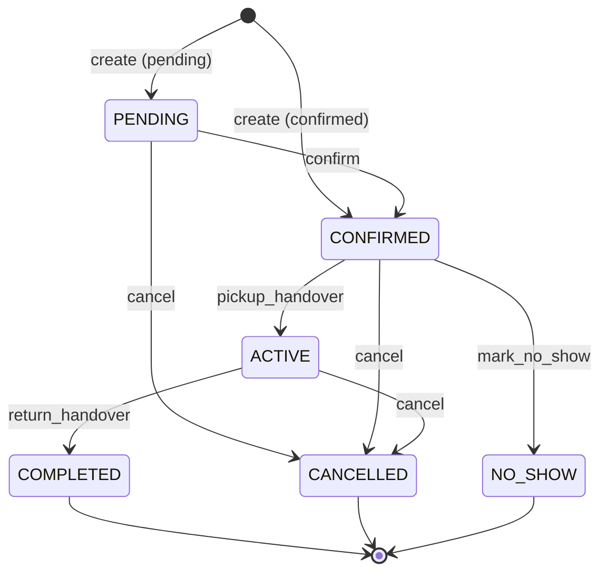

# Booking State Machine

**Version:** V4.9.780 (Booking Production-Readiness Prompt 8/34)  
**Status:** Canonical — single source of truth for `Booking.status` transitions

## Purpose

All booking lifecycle status changes must go through a **closed, explicit state machine** enforced in the domain/service layer. Anything not listed in the transition table is forbidden.

Generic update commands (`BookingsService.update`, removed generic PATCH) **must never** change `status`.

## Lifecycle states

| Status | Terminal | Description |
|--------|----------|-------------|
| `PENDING` | No | Created / wizard draft awaiting confirmation |
| `CONFIRMED` | No | Booking confirmed, awaiting pickup |
| `ACTIVE` | No | Vehicle handed over (rental in progress) |
| `COMPLETED` | Yes | Vehicle returned successfully |
| `CANCELLED` | Yes | Booking cancelled before or during rental |
| `NO_SHOW` | Yes | Customer did not appear after scheduled pickup time |

### States intentionally **not** modeled as `Booking.status`

| Concept | Where it lives |
|---------|----------------|
| `DRAFT` | Wizard draft = `PENDING` + `[synq:wizard-draft]` notes marker |
| `PAYMENT_PENDING` | `paymentStatus` / payment intent / Stripe flow |
| `PREPARATION_FAILED` | `OrgTask` preparation tasks + rental health |
| `CANCELLATION_PROCESSING` | Side effects after `CANCELLED` (void docs, vehicle flip, task supersede) |

## Transition table (closed)

| Key | From | To | Trigger | Permission | Workflow event | Reason code |
|-----|------|-----|---------|------------|----------------|-------------|
| `create_pending` | ∅ | `PENDING` | `create` | `booking.create` | — | `BOOKING_CREATED_PENDING` |
| `create_confirmed` | ∅ | `CONFIRMED` | `create` | `booking.create` | `booking.confirmed` | `BOOKING_CREATED_CONFIRMED` |
| `confirm` | `PENDING` | `CONFIRMED` | `confirm` | `booking.confirm` | `booking.confirmed` | `BOOKING_CONFIRMED` |
| `cancel_from_pending` | `PENDING` | `CANCELLED` | `cancel` | `booking.cancel` | `booking.cancelled` | `BOOKING_CANCELLED` |
| `cancel_from_confirmed` | `CONFIRMED` | `CANCELLED` | `cancel` | `booking.cancel` | `booking.cancelled` | `BOOKING_CANCELLED` |
| `cancel_from_active` | `ACTIVE` | `CANCELLED` | `cancel` | `booking.cancel` | `booking.cancelled` | `BOOKING_CANCELLED_ACTIVE` |
| `pickup_handover` | `CONFIRMED` | `ACTIVE` | `pickup_handover` | `booking.handover.perform` | `booking.activated` | `BOOKING_PICKUP_COMPLETED` |
| `return_handover` | `ACTIVE` | `COMPLETED` | `return_handover` | `booking.handover.perform` | `booking.completed` | `BOOKING_RETURN_COMPLETED` |
| `mark_no_show` | `CONFIRMED` | `NO_SHOW` | `mark_no_show` | `booking.mark_no_show` | `booking.no_show` | `BOOKING_NO_SHOW` |

**Rule:** If a `(from, to, trigger)` triple is not in this table, the transition is rejected with `BOOKING_STATUS_TRANSITION_NOT_ALLOWED`.

## Business rules

1. **ACTIVE** — only after successful pickup handover (`pickup_handover`).
2. **COMPLETED** — only after successful return handover (`return_handover`).
3. **NO_SHOW** — only from `CONFIRMED`, and only when `scheduledStartDate ≤ now`.
4. **CANCELLED** — only from `PENDING`, `CONFIRMED`, or `ACTIVE`.
5. **Terminal states** (`COMPLETED`, `CANCELLED`, `NO_SHOW`) cannot be reactivated on the normal path.
6. **Generic update** — `BookingsService.update` rejects any `status` change (`BOOKING_STATUS_CHANGE_VIA_GENERIC_UPDATE_FORBIDDEN`).

## Admin override (separate path)

Controlled escape hatch for ops/data repair — **not** implicit fallback.

| Requirement | Detail |
|-------------|--------|
| Permission | `booking.override` |
| Trigger | `admin_override` |
| Reason | Min. 10 characters (required) |
| Audit | `booking.status_overridden` workflow event + ActivityLog `kind: booking_status_transition` |
| Scope | Any non-create transition when explicit table entry is missing |

Ops repair scripts (`VehicleBookingHandoverRepairService`) remain separate diagnostic/repair tooling and should use override semantics when writing status.

## Transition contract

Every successful transition records:

| Field | Source |
|-------|--------|
| Permission | Transition definition |
| Preconditions | Evaluated before DB write (e.g. no-show pickup time) |
| Domain event | `WorkflowEventService.scheduleEmit` when `workflowEventType` set |
| Audit event | `ActivityLogService.log` with `metaJson.kind = booking_status_transition` |
| Actor | `userId`, `displayName` from authenticated caller |
| Timestamp | ISO-8601 at audit write |
| Reason code | Stable `reasonCode` from definition; optional free-text `reason` on no-show |

**Ordering:** Preconditions → atomic DB status write (inside transaction when applicable) → side effects (`commitTransitionEffects`) **after** successful persistence.

## Code layout

```
backend/src/modules/bookings/state-machine/
├── booking-state-machine.constants.ts   # Transition table + lookup
├── booking-state-machine.types.ts       # Types, triggers, actor, override
├── booking-state-machine-error.codes.ts # Stable error codes
├── booking-state-machine.ts             # Pure resolver (no I/O)
├── booking-state-machine.spec.ts        # Full transition matrix tests
└── booking-status-transition.service.ts # Audit + workflow + buildUpdateData
```

## Entry points (wired)

| Flow | Service | Trigger |
|------|---------|---------|
| Create booking | `BookingsService.create` | `create` (initial status guard) |
| Wizard confirm | `BookingWizardDraftService.confirmDraft` | `confirm` (`PENDING` → `CONFIRMED`) |
| Cancel | `BookingsService.cancel` | `cancel` |
| No-show | `BookingsService.markNoShow` | `mark_no_show` |
| Pickup handover | `BookingsHandoverService.createHandover` | `pickup_handover` |
| Return handover | `BookingsHandoverService.createHandover` | `return_handover` |
| Status gate (handover validation) | `HandoverValidationService.assertBookingStatus` | delegates to pure resolver |

## Error codes

| Code | When |
|------|------|
| `BOOKING_STATUS_TRANSITION_NOT_ALLOWED` | Closed machine rejects transition |
| `BOOKING_TERMINAL_REACTIVATION_FORBIDDEN` | Terminal → non-terminal without override |
| `BOOKING_STATUS_OVERRIDE_REASON_REQUIRED` | Admin override missing/short reason |
| `BOOKING_STATUS_OVERRIDE_DENIED` | Missing `booking.override` |
| `BOOKING_NO_SHOW_TOO_EARLY` | No-show before scheduled pickup |
| `BOOKING_STATUS_CHANGE_VIA_GENERIC_UPDATE_FORBIDDEN` | Status in generic update command |

## Tests

- `booking-state-machine.spec.ts` — exhaustive matrix: all 9 allowed transitions + forbidden combinations + terminal/override/no-show guards.
- `handover-validation.service.spec.ts` — status gates delegate to state machine error codes.

## Diagram


