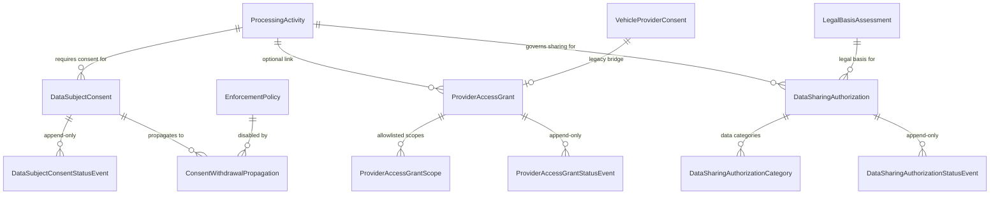
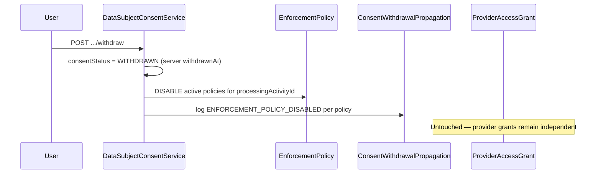

# Consent, Provider Access Grant & Data Sharing — Domain Separation (Prompt 8)

**Date:** 2026-07-23  
**Version:** V4.9.791  
**Migration:** `20260723234500_consent_provider_sharing_domains`

## Overview

Prompt 8 sharpens the three privacy domains that were introduced as foundation models in Prompt 5. Each domain now has dedicated fields, lifecycle rules, append-only status events, services, DTOs, and API routes — with strict separation of concerns.

## Domain Boundaries



| Domain | Purpose | Is NOT |
|--------|---------|--------|
| **DataSubjectConsent** | GDPR consent of an identifiable or pseudonymized data subject for a specific processing activity | Provider OAuth grant, legal basis assessment, data sharing authorization |
| **ProviderAccessGrant** | Technical provider access (DIMO, High Mobility) with scoped permissions | Consent, legal basis, partner sharing |
| **DataSharingAuthorization** | Authorized transfer of data categories to a recipient under a legal basis assessment | Processing activity definition, consent record |

## Field Contracts

### DataSubjectConsent

| Field | Notes |
|-------|-------|
| `dataSubjectReference` | Required, min 8 chars — identifiable or pseudonymized subject |
| `consentTextVersion` | Separate from privacy notice |
| `privacyNoticeVersion` | Separate from consent text |
| `consentStatus` | PENDING → GRANTED → WITHDRAWN \| EXPIRED |
| `grantedAt` | Server-set on grant POST only |
| `evidenceReference` | Proof of consent capture |

### ProviderAccessGrant

| Field | Notes |
|-------|-------|
| `providerStatus` | PENDING → ACTIVE → REVOKED \| EXPIRED |
| `grantedAt` | Server-set on activate POST only |
| `grantedScopes` | Junction table; validated against provider allowlist |
| `technicalOwnerUserId` | Internal owner, not provider secret |
| `legacyVehicleProviderConsentId` | Bridge to existing VPC ledger |

### DataSharingAuthorization

| Field | Notes |
|-------|-------|
| `legalBasisAssessmentId` | Required FK to APPROVED current-version assessment |
| `recipient` / `recipientRole` | Partner identity, not a processing activity |
| `dataCategories` | Junction table of `PrivacyProcessingDataCategory` |
| `validFrom` / `validUntil` | Server-set on authorize; validUntil set on revoke |
| `status` | PENDING → AUTHORIZED → REVOKED \| EXPIRED |

## Legacy Mapping

| Legacy Model | New Domain | Bridge Field |
|--------------|------------|--------------|
| `VehicleProviderConsent` | `ProviderAccessGrant` | `legacyVehicleProviderConsentId` (unique) |
| `OrgDataAuthorization` (consent role) | `DataSubjectConsent` | `legacyOrgDataAuthorizationId` |
| `OrgDataAuthorization` (provider role) | `ProviderAccessGrant` | `legacyOrgDataAuthorizationId` |
| `OrgDataAuthorization` (sharing role) | `DataSharingAuthorization` | `legacyOrgDataAuthorizationId` |

Migration `20260723234500` reshapes existing privacy-domain tables in-place:
- `subject_ref_id` → `data_subject_reference`
- `status` → `consent_status` / `provider_status`
- Drops `legal_basis_assessment_id` from consent (consent is independent of LBA)
- Provider scopes remain in `provider_access_grant_scopes`

`ProviderAccessGrantService.linkFromLegacyVpc()` creates a PENDING grant from an existing VPC row without auto-activating.

## Withdrawal Relationships

Consent withdrawal **does not** revoke provider grants.



Propagation actions:
- `ENFORCEMENT_POLICY_DISABLED` — one row per disabled policy
- `NO_ACTIVE_ENFORCEMENT_POLICIES` — logged when none found

## Security Rules

1. **No client-set grant timestamps** — `grantedAt` on consent grant and provider activate is set server-side; not accepted in create DTOs.
2. **No provider secrets** — only `providerAccountReference` and `providerGrantReference` (opaque IDs), never tokens or keys.
3. **Provider scope allowlist** — `PROVIDER_SCOPE_ALLOWLIST` in `provider-access-grant.constants.ts`; unknown providers or scopes rejected.
4. **No auto-consent** — create always starts in PENDING; grant requires explicit POST with evidence.
5. **No GET activation** — status changes only via POST endpoints (`/grant`, `/activate`, `/authorize`, `/withdraw`, `/revoke`).
6. **Append-only status events** — every transition writes to `*_status_events` tables.
7. **Tenant isolation** — all lookups scoped by `organizationId`; cross-tenant access returns 404.
8. **Data sharing requires approved LBA** — only `APPROVED` + `isCurrentVersion` assessments accepted.

## API Routes

| Method | Path | Permission |
|--------|------|------------|
| GET/POST | `.../processing-activities/:activityId/data-subject-consents` | read / write |
| POST | `.../data-subject-consents/:id/grant` | write |
| POST | `.../data-subject-consents/:id/withdraw` | write |
| GET/POST | `.../provider-access-grants` | read / write |
| POST | `.../provider-access-grants/:id/activate` | manage |
| POST | `.../provider-access-grants/:id/revoke` | manage |
| POST | `.../provider-access-grants/legacy-vpc/:id/link` | manage |
| GET/POST | `.../processing-activities/:activityId/data-sharing-authorizations` | read / write |
| POST | `.../data-sharing-authorizations/:id/authorize` | manage |
| POST | `.../data-sharing-authorizations/:id/revoke` | manage |

## Code Locations

- Prisma models: `backend/prisma/schema.prisma`
- Migration: `backend/prisma/migrations/20260723234500_consent_provider_sharing_domains/`
- Lifecycle: `privacy-domain.lifecycle.ts`
- Invariants: `privacy-domain.invariants.ts`
- Services: `data-subject-consent/`, `provider-access-grant/`, `data-sharing-authorization/`

## Test Results

Run:

```bash
cd backend && npm test -- --testPathPattern='privacy-domain|data-subject-consent|provider-access|data-sharing'
```

Expected coverage:
- `privacy-domain.invariants.spec.ts` — tenant mismatch, chronology, status requirements
- `privacy-domain.lifecycle.spec.ts` — transition guards, reference/version validation
- `data-subject-consent.service.spec.ts` — PENDING create, server grantedAt, withdrawal propagation without provider touch, tenant negative
- `provider-access-grant.service.spec.ts` — scope allowlist, server grantedAt, legacy VPC link, tenant negative
- `data-sharing-authorization.service.spec.ts` — PENDING create, approved LBA gate, server validFrom, tenant negative
