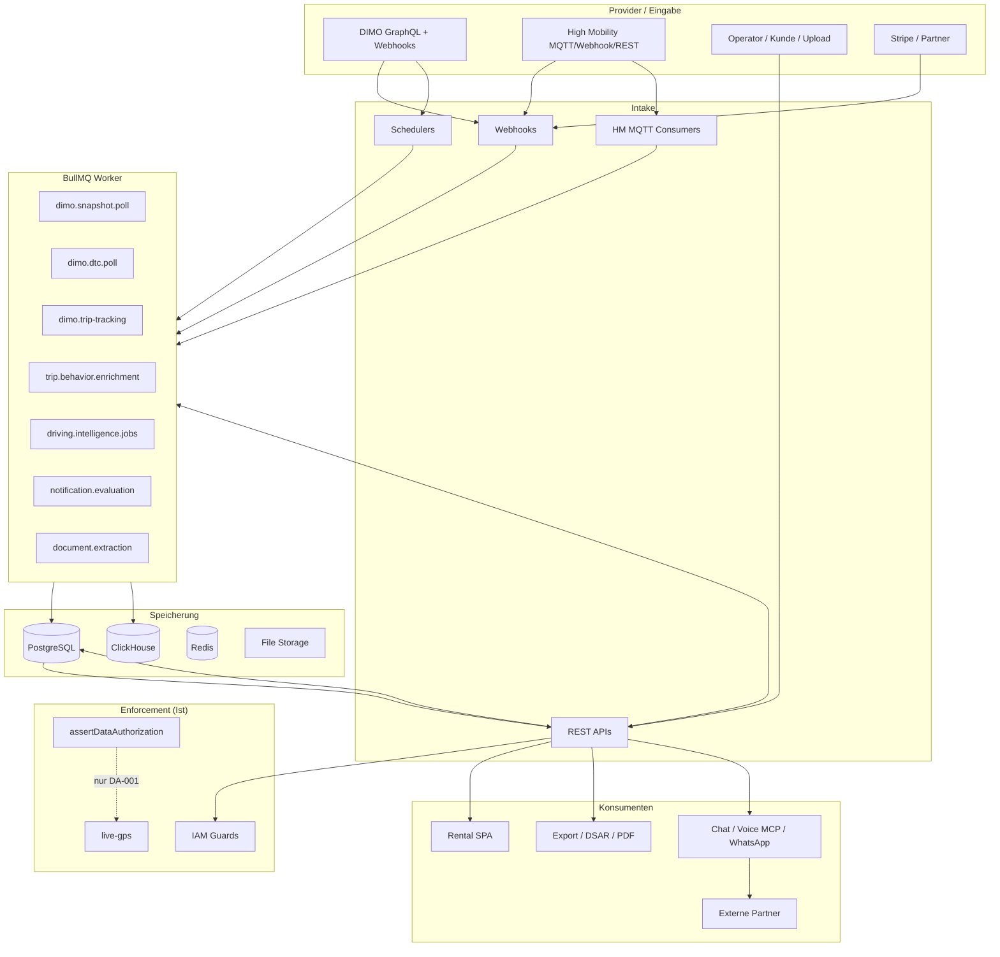
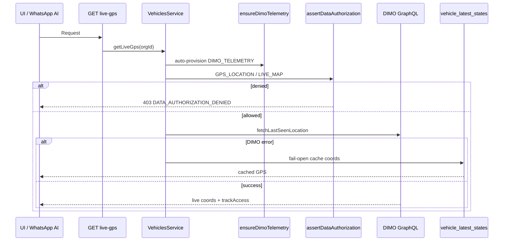
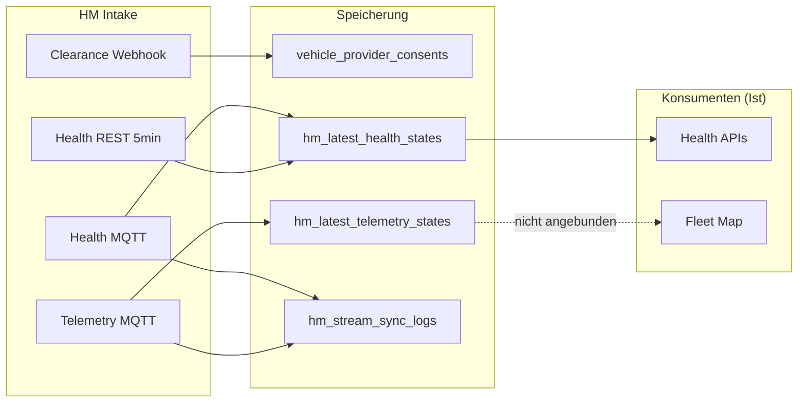
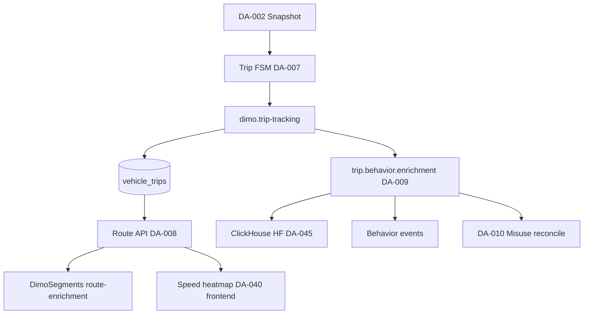
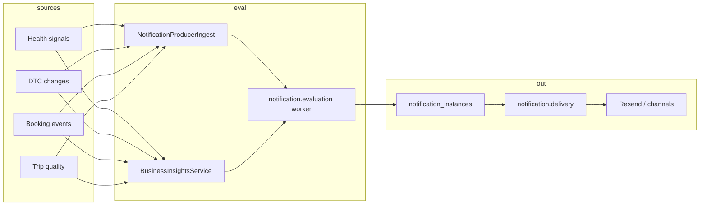
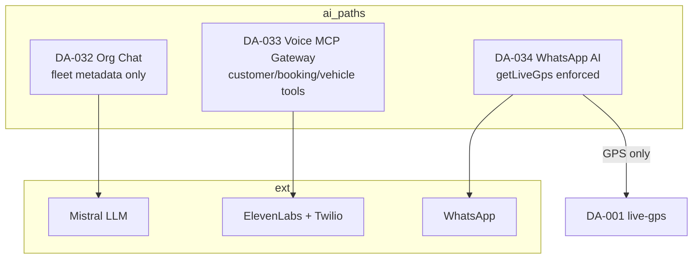

# Data Authorization — Datenfluss- & Enforcement-Karte

**Prompt:** 2 von 44  
**Datum:** 2026-07-23  
**Repository:** `SYNQDRIVE-alpha`  
**Baseline:** `docs/audits/data-authorization-remediation-baseline-2026-07.md`  
**Maschinenlesbar:** `docs/architecture/data-authorization-enforcement-coverage.json`  
**Scope:** Ist-Analyse ohne produktiven Code

---

## Executive Summary

SynqDrive verarbeitet personenbezogene, fahrzeugbezogene und telemetrische Daten über **51 identifizierte Datenpfade** (Provider → Intake → Persist → Ableitung → API/UI → Export → AI → Löschung).

| Schutzstatus | Anzahl | Anteil |
|--------------|--------|--------|
| **Vollständig geschützt** | **0** | 0 % |
| **Teilweise geschützt** | **2** | 3,9 % |
| **Ungeschützt** | **49** | 96,1 % |

**Teilweise geschützt:** `DA-001` DIMO Live GPS, `DA-034` WhatsApp AI (GPS-Tool via `getLiveGps`).

**Kernlücke:** `assertDataAuthorization` existiert als Service, wird aber nur auf dem Live-GPS-Lesepfad aufgerufen. Alle Ingestion-Worker, Health/Trip/DTC-APIs, Notifications, Exporte und Voice-MCP-Tools laufen ohne Org-Consent-Gate.

---

## 1. Methodik

### 1.1 Pipeline-Stufen (Pflichtverfolgung)

Jeder Datenpfad wird über folgende Stufen kartiert:

```
Provider/Eingabe → Intake → Validierung → Raw Persist → Normalisierung
→ Analyse → Ableitung → Speicherung → API Read → UI → Export
→ AI/MCP → externe Weitergabe → Löschung
```

### 1.2 Schutzstatus-Definition

| Status | Kriterium |
|--------|-----------|
| **Vollständig geschützt** | `assertDataAuthorization` auf Read, Export, AI **und** Ingestion; `REVOKED`/`EXPIRED` blockiert alle Stufen |
| **Teilweise geschützt** | Mindestens ein Enforcement-Point **oder** IAM + Consent-Ledger-Signal, aber Lücken in Ingestion/Export/AI |
| **Ungeschützt** | Kein Org-Consent-Enforcement; nur IAM/Org-Scoping oder Plattform-Rolle |

### 1.3 Fail-Modi

| Modus | Bedeutung im Ist-Zustand |
|-------|--------------------------|
| **fail-open** | Datenfluss läuft weiter trotz fehlendem/widerrufenem Consent (typisch Telemetrie-Worker) |
| **fail-closed-iam** | Kein Consent-Gate, aber IAM verweigert bei fehlender Berechtigung (typisch CRUD-APIs) |

---

## 2. Taxonomie (Consent Center)

Quelle: `backend/src/modules/data-authorizations/data-authorization.constants.ts`

**Datenkategorien:** `GPS_LOCATION`, `TELEMETRY_DATA`, `VEHICLE_IDENTITY`, `VEHICLE_STATUS`, `ODOMETER`, `TRIP_DATA`, `DRIVING_BEHAVIOR`, `HEALTH_SIGNALS`, `DTC_CODES`, `BOOKING_DATA`, `CUSTOMER_DATA`, `FINANCIAL_DATA`, `DOCUMENT_DATA`

**Zwecke:** `LIVE_MAP`, `TRIPS`, `VEHICLE_HEALTH`, `ALERTS`, `FLEET_ANALYTICS`, `RENTAL_ANALYTICS`, `TECHNICAL_OVERVIEW`, `ABUSE_MISUSE_DETECTION`, `DOCUMENT_PROCESSING`, `CUSTOMER_CONSENT`, `PARTNER_SERVICE`

---

## 3. Gesamtarchitektur



---

## 4. DIMO-Pipelines

### 4.1 DIMO Live GPS (`DA-001`) — **teilweise geschützt**



| Feld | Wert |
|------|------|
| Kategorie | `GPS_LOCATION` |
| Zweck | `LIVE_MAP` |
| Enforcement | `assertDataAuthorization` ✅ |
| Widerruf | ✅ auf API-Pfad |
| Ingestion | ❌ Snapshot weiter ungegated |
| Fail-Modus | **fail-open** (Cache-Fallback) |
| Risiko | **P1** |

### 4.2 DIMO Snapshot Ingestion (`DA-002`) — ungeschützt

| Stufe | Komponente |
|-------|------------|
| Provider | DIMO `fetchLatestVehicleSnapshot` |
| Intake | `DimoSnapshotScheduler` 30s → `dimo.snapshot.poll` |
| Validierung | Vehicle CONNECTED + tokenId (kein Consent) |
| Raw Persist | `vehicle_latest_states.raw_payload_json` |
| Normalisierung | `DimoSnapshotProcessor` |
| Analyse | Trip-Start, Battery, Connectivity-Episodes |
| Speicherung | PG + CH `telemetry_snapshots` (180d TTL) |
| API/UI | Indirekt via Fleet Map, Telemetry |
| AI | Indirekt Fleet-Context |
| Löschung | `dimo_poll_logs` 30d |

**Remediation:** `assertDataAuthorization(TELEMETRY_DATA)` vor Upsert; Worker-Skip bei `REVOKED`.

### 4.3 Weitere DIMO-Pfade (Kurzmatrix)

| ID | Pfad | Kategorie | Enforcement | Risiko |
|----|------|-----------|-------------|--------|
| DA-003 | Telemetry Read API | TELEMETRY/GPS | ❌ bypass | P0 |
| DA-005 | Device Webhooks | TELEMETRY/DTC | ❌ | P1 |
| DA-006 | DTC Poll | DTC_CODES | ❌ | P0 |
| DA-007 | Trip Detection | TRIP_DATA | ❌ | P0 |
| DA-008 | Route & Waypoints | TRIP/GPS | ❌ | P0 |
| DA-038 | Vehicle Sync (catalog) | VEHICLE_IDENTITY | ❌ | P2 |
| DA-047 | DIMO Registration | VEHICLE_IDENTITY | ❌ auto-consent | P0 |

---

## 5. High Mobility-Pipelines



| ID | Pfad | Status | Hinweis |
|----|------|--------|---------|
| DA-011 | HM Clearance Webhook | Ungeschützt | `VehicleProviderConsent` only |
| DA-012 | HM Health MQTT | Ungeschützt | Kein `HIGH_MOBILITY` in SourceTypes |
| DA-013 | HM Telemetry MQTT | Ungeschützt | Routing stub, kein Fleet Map |
| DA-014 | HM Health REST Poll | Ungeschützt | 30d sync log retention |

**Remediation:** HM-System-Key in `OrgDataAuthorization`; `HEALTH_SIGNALS` Gate vor Persist und Read.

---

## 6. GPS & Live Tracking

| ID | Pfad | Quelle | Enforcement | UI |
|----|------|--------|-------------|-----|
| DA-001 | Live GPS API | DIMO live | **Teilweise** | Vehicle map |
| DA-003 | Telemetry API | VLS + DIMO refresh | ❌ | Vehicle detail |
| DA-004 | Fleet Map | VLS cache (DIMO snapshot) | ❌ | Fleet map |
| DA-013 | HM Telemetry GPS | `hm_latest_telemetry_states` | ❌ | Nicht auf Karte |

**Einziger geschützter GPS-Pfad:** `DA-001`. Fleet Map (`DA-004`) liefert dieselben Koordinaten ohne Gate.

---

## 7. Trips, Waypoints, Heatmaps



| ID | Heatmap-Typ | Quelle | Enforcement |
|----|-------------|--------|-------------|
| DA-040 | Trip speed heatmap | DIMO 7s route buckets | ❌ |
| DA-041 | Damage pin heatmap | Manuelle Schadens-Pins | IAM only (kein Telemetrie-Consent) |

**Canonical trip boundaries:** DIMO Segments (`DimoSegmentsService`) — nicht ad-hoc aus Raw-Signalen.

---

## 8. Driver Behavior & Misuse

| ID | Pfad | Worker | Kategorie | Zweck |
|----|------|--------|-----------|-------|
| DA-009 | Behavior Enrichment | `trip.behavior.enrichment` | DRIVING_BEHAVIOR | ABUSE_MISUSE_DETECTION |
| DA-010 | Misuse & Rental Analysis | `driving.intelligence.jobs` | DRIVING_BEHAVIOR | ABUSE_MISUSE_DETECTION |
| DA-039 | Driver Score | DI jobs | DRIVING_BEHAVIOR | FLEET_ANALYTICS |

Alle Pfade: **IAM org/vehicle scope**, kein Consent-Gate. Shadow-Detector-Framework läuft isoliert (Evaluation).

---

## 9. Health, DTC, Serviceableitungen

| ID | Domäne | Provider | APIs | Worker |
|----|--------|----------|------|--------|
| DA-015 | Battery V2 | DIMO snapshot | `/battery-health/v2` | `battery.v2` |
| DA-016 | Tires | DIMO + HM | `/tires/*` | `tire.recalculation` |
| DA-017 | Brakes | DTC + manual | `/brake-health/*` | `brake.recalculation` |
| DA-018 | Service | HM poll | `/service-*` | HM scheduler |
| DA-019 | AI Health Summary | HM + DIMO | `/ai-health-care-summary` | — |
| DA-020 | DTC Read | DIMO poll/webhook | `/dtc/*` | — |
| DA-021 | DTC Knowledge AI | Mistral | knowledge retry | `dtc.knowledge` |
| DA-044 | Manual Upload Apply | User OCR | apply flow | `document.extraction` |
| DA-046 | Rental Health Summary | Aggregiert | `/rental-health/*` | — |

**HM-Regel (Code):** HM-Ingestion speichert/staged nur — pusht nicht in Tire/Brake/Trip-Pipelines (Phase-3-TODO).

---

## 10. Alerts & Notifications



| ID | Pfad | Consent ALERTS | Widerruf |
|----|------|----------------|----------|
| DA-022 | Evaluation | ❌ | ❌ |
| DA-023 | Delivery (PII in E-Mail) | ❌ | ❌ |
| DA-024 | Connectivity Alerts | ❌ (nur Link-State) | ❌ |

---

## 11. Kunden-, Buchungs- & Finanzdaten

| ID | Pfad | Kategorien | IAM | Consent |
|----|------|------------|-----|---------|
| DA-025 | Customer CRUD | CUSTOMER_DATA | ✅ OrgScoping | ❌ |
| DA-026 | Booking & Handover | BOOKING/CUSTOMER/FINANCIAL | ✅ Permissions | ❌ |
| DA-050 | Stripe Webhooks | FINANCIAL | ✅ Signature | ❌ |

**Voice MCP** liest Kunden/Buchungen (`DA-033`) ohne `assertDataAuthorization`.

---

## 12. Dokumente & Exporte

| ID | Pfad | Auto-Apply | Export | Consent |
|----|------|------------|--------|---------|
| DA-027 | AI Document Upload | ❌ (Review required) | — | ❌ |
| DA-028 | Booking PDFs | N/A | E-Mail PDF | ❌ |
| DA-029 | Legal Documents | N/A | Booking bundle | IAM (separates Modul) |
| DA-030 | IAM DSAR Export | N/A | User ZIP | IAM step-up; **kein** Fahrzeugtelemetrie |

---

## 13. AI, Voice MCP, WhatsApp



| Pfad | Telemetrie-Zugriff | Consent |
|------|-------------------|---------|
| Org Chat | Nur Fleet-Metadaten (kein Live-DIMO) | IAM `ai-assistant` |
| Voice MCP | Kunde, Buchung, Fahrzeugstatus | MCP Token + Capabilities |
| WhatsApp | GPS via `getLiveGps` | **Teilweise** (nur GPS) |

---

## 14. Support, Master Admin, Integrationen

| ID | Pfad | Scope | Consent |
|----|------|-------|---------|
| DA-035 | Master Admin | Cross-tenant `MASTER_ADMIN` | ❌ |
| DA-036 | Support Tickets | Org-scoped | ❌ (nur ID-Validierung) |
| DA-037 | Integrations Connect | IAM `data-authorization.manage` | ❌ (IAM ≠ Org-Consent) |
| DA-042 | Insurance Authorization | Separates Modell | Eigene Logs |

---

## 15. Retention & Löschung

| Datenklasse | Scheduler / Policy | Default | Consent-verknüpft |
|-------------|-------------------|---------|-------------------|
| `dimo_poll_logs` | `DataRetentionScheduler` | 30d | ❌ |
| `hm_stream_sync_logs` |同上 | 14d | ❌ |
| `trip_tracking_runs` |同上 | 30d | ❌ |
| `activity_logs` (Consent-Audit) |同上 | **0 = disabled** | ⚠️ konfigurierbar |
| `vehicle_trip_waypoints` |同上 | 0 = disabled | ❌ |
| ClickHouse snapshots | TTL migration | 180d | ❌ |
| ClickHouse HF points | TTL | 90d | ❌ |
| `org_data_authorizations` | — | **Kein Job** | — |
| `vehicle_provider_consents` | — | **Kein Job** | — |
| Kunden | `CustomerRetentionService` | **Placeholder** | — |

**Widerruf stoppt keine Retention-Jobs** — gespeicherte Daten bleiben bis TTL/manuelle Löschung.

---

## 16. Master-Enforcement-Matrix (alle 51 Pfade)

Vollständige maschinenlesbare Matrix: `docs/architecture/data-authorization-enforcement-coverage.json`

### 16.1 Aggregat nach Domäne

| Domäne | Pfade | Teilweise | Ungeschützt |
|--------|-------|-----------|-------------|
| DIMO / GPS | 12 | 1 | 11 |
| High Mobility | 4 | 0 | 4 |
| Trips / Behavior | 8 | 0 | 8 |
| Health / DTC | 10 | 0 | 10 |
| Alerts | 3 | 0 | 3 |
| Customer / Booking / Financial | 3 | 0 | 3 |
| Documents / Export | 4 | 0 | 4 |
| AI / MCP | 3 | 2 | 1 |
| Admin / Support / Integrations | 4 | 0 | 4 |

### 16.2 Kompakt-Matrix (Auszug — alle IDs in JSON)

| ID | Name | Kategorie | Enforcement | Schutz | Risiko |
|----|------|-----------|-------------|--------|--------|
| DA-001 | DIMO Live GPS | GPS_LOCATION | assertDataAuthorization | **partial** | P1 |
| DA-002 | DIMO Snapshot | TELEMETRY_DATA | None | none | P0 |
| DA-003 | Telemetry Read API | TELEMETRY/GPS | None | none | P0 |
| DA-004 | Fleet Map | GPS_LOCATION | None | none | P0 |
| DA-005 | DIMO Webhooks | TELEMETRY/DTC | None | none | P1 |
| DA-006 | DTC Poll | DTC_CODES | None | none | P0 |
| DA-007 | Trip Detection | TRIP_DATA | None | none | P0 |
| DA-008 | Route & Waypoints | TRIP/GPS | None | none | P0 |
| DA-009 | Behavior Enrichment | DRIVING_BEHAVIOR | None | none | P0 |
| DA-010 | Misuse Analysis | DRIVING_BEHAVIOR | None | none | P0 |
| DA-011–014 | HM Pfade | HEALTH/TELEMETRY | None | none | P0–P1 |
| DA-015–019 | Health Module | HEALTH_SIGNALS | None | none | P0 |
| DA-020–021 | DTC Read/AI | DTC_CODES | None | none | P0–P1 |
| DA-022–024 | Alerts | ALERTS | None | none | P0–P2 |
| DA-025–026 | Customer/Booking | CUSTOMER/BOOKING | IAM only | none | P1 |
| DA-027–029 | Documents | DOCUMENT_DATA | IAM only | none | P1–P3 |
| DA-030 | DSAR Export | CUSTOMER_DATA | IAM step-up | none | P1 |
| DA-031 | Data Analyse | TELEMETRY/TRIP | IAM only | none | P1 |
| DA-032 | Org Chat AI | VEHICLE_IDENTITY | IAM only | none | P1 |
| DA-033 | Voice MCP | CUSTOMER/BOOKING | MCP token | none | P0 |
| DA-034 | WhatsApp AI | GPS_LOCATION | getLiveGps | **partial** | P1 |
| DA-035–037 | Admin/Support/Integrations | varies | IAM | none | P2–P3 |
| DA-038–051 | siehe JSON | — | — | — | — |

---

## 17. Wichtigste Enforcement-Lücken (priorisiert)

### P0 — Blockiert Production-Readiness

1. **Ingestion ohne Gate** (`DA-002`, `DA-006`, `DA-007`, `DA-045`) — Worker persistieren bei `REVOKED`
2. **Telemetry API Bypass** (`DA-003`) — gleiche GPS-Daten wie Live-GPS ohne Check
3. **Fleet Map offen** (`DA-004`) — cached GPS für alle Org-Mitglieder mit `fleet` access
4. **Health/DTC/Trips Read APIs** (`DA-015`–`DA-020`, `DA-007`–`DA-008`) — IAM only
5. **Voice MCP** (`DA-033`) — PII/Telemetrie ohne Consent-Kategorien
6. **Auto-Consent bei Registration** (`DA-047`) — widerspricht explizitem Widerruf-Modell

### P1 — Vor breitem Rollout

7. **HM komplett außerhalb OrgDataAuthorization** (`DA-011`–`DA-014`)
8. **Notifications lesen Health/Booking ohne ALERTS-Gate** (`DA-022`–`DA-023`)
9. **WhatsApp nur GPS geschützt** (`DA-034`)
10. **Denied Access ohne Audit** (quer über `DA-001`)
11. **Fail-open Cache nach Auth-Check** (`DA-001`)

### P2 — Härtung

12. Connectivity Runtime nur Observability (`DA-048`)
13. IAM `data-authorization.manage` vs Consent Center Verwechslung (`DA-037`)
14. Activity-Log-Retention kann Consent-Audit löschen (`DA-051`)

---

## 18. Sichere Remediation-Reihenfolge (bezogen auf Datenpfade)

| Phase | Pfade | Maßnahme |
|-------|-------|----------|
| **A — Messung** | alle | `isAuthorized` Shadow-Log in Workern; Coverage-CI gegen JSON |
| **B — Read GPS** | DA-001,003,004 | Einheitliches LIVE_MAP Gate; Cache-Fallback bei deny blockieren |
| **C — Ingestion** | DA-002,006,007,045 | `assertDataAuthorization` vor Persist; Worker skip |
| **D — Derived** | DA-008–010,015–021 | Gate auf Read + Upstream-Job |
| **E — HM** | DA-011–014 | HM SourceType + System-Key |
| **F — AI** | DA-032–034 | Tool-level category checks |
| **G — PII** | DA-025–026,030,033 | CUSTOMER/BOOKING category enforcement |
| **H — Lifecycle** | DA-047,051 | Expliziter Grant; Audit retention legal hold |

---

## 19. Durchgeführte Prüfungen

- [x] Baseline `data-authorization-remediation-baseline-2026-07.md` gelesen
- [x] Code-Verifikation: `assertDataAuthorization` (1 Call-Site), Worker-Inventar (20 Processor)
- [x] DIMO: Snapshot, DTC, Webhooks, Segments, Live GPS, Vehicle Sync
- [x] HM: Webhook, MQTT Health/Telemetry, REST Poll
- [x] Trips, Waypoints, Heatmaps (trip speed + damage pins)
- [x] Driving behavior, misuse, driver score
- [x] Health module (battery, tire, brake, service, AI summary)
- [x] Alerts, notifications, connectivity alerts
- [x] Customer, booking, documents, DSAR, data analyse
- [x] Voice MCP, Org Chat, WhatsApp AI
- [x] Master admin, support, integrations, insurance boundary
- [x] Retention config `retention.config.ts`

---

## Anhang — Changes / Architektur

**Changes (Synqdrive Code → Changes):** nicht aktualisiert (Analyse-only)  
**Architektur (Synqdrive Code → Architektur):** nicht aktualisiert (dedizierte Architektur-Datei in `docs/architecture/` erstellt)
