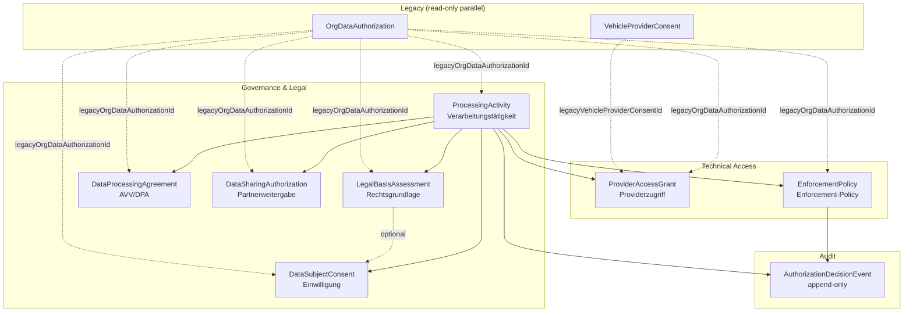

# Data Authorization — Privacy Domain Model

**Prompt:** 5 von 44  
**Datum:** 2026-07-23  
**Status:** Foundation — parallele Domänenmodelle, Legacy unverändert  
**Referenz:** `docs/plans/data-authorization-production-remediation-plan-2026-07.md`

---

## 1. Problemstellung

`OrgDataAuthorization` vereinte bisher mehrere fachlich getrennte Datenschutz-Rollen in einem Monolith:

| Rolle | Beschreibung | Bisher in ODA |
|-------|--------------|---------------|
| Verarbeitungstätigkeit | WAS wird verarbeitet (Art. 30 DSGVO) | `purpose`, `dataCategories`, `moduleOrigin` |
| Rechtsgrundlage | WARUM rechtmäßig (Art. 6 DSGVO) | implizit in `sourceType` / `riskLevel` |
| Einwilligung | WILLEN der betroffenen Person | `status`, `granted*` / `revoked*` |
| Providerzugriff | Technischer Zugang DIMO/HM | überlappend mit `VehicleProviderConsent` |
| Partnerweitergabe | Weitergabe an Dritte | `destination`, `processorName` |
| Auftragsverarbeitung | AVV/DPA mit Auftragsverarbeiter | `processorType`, `processorName` |
| Enforcement-Policy | Technische Zugriffskontrolle | nur in `DataAuthorizationEnforcementService` |

**Ziel:** Klare Domänentrennung ohne Legacy-Daten zu löschen oder automatisch neu zu bewerten.

---

## 2. Domänenübersicht



---

## 3. ER-Diagramm (Prisma)

```mermaid
erDiagram
  Organization ||--o{ ProcessingActivity : owns
  Organization ||--o{ LegalBasisAssessment : owns
  Organization ||--o{ DataSubjectConsent : owns
  Organization ||--o{ ProviderAccessGrant : owns
  Organization ||--o{ DataSharingAuthorization : owns
  Organization ||--o{ DataProcessingAgreement : owns
  Organization ||--o{ EnforcementPolicy : owns
  Organization ||--o{ AuthorizationDecisionEvent : owns

  ProcessingActivity ||--o{ ProcessingActivityCategory : has
  ProcessingActivity ||--o{ ProcessingActivityPurpose : has
  ProcessingActivity ||--o{ LegalBasisAssessment : governs
  ProcessingActivity ||--o{ DataSubjectConsent : governs
  ProcessingActivity ||--o{ ProviderAccessGrant : optional
  ProcessingActivity ||--o{ DataSharingAuthorization : governs
  ProcessingActivity ||--o{ DataProcessingAgreement : optional
  ProcessingActivity ||--o{ EnforcementPolicy : governs
  ProcessingActivity ||--o{ AuthorizationDecisionEvent : optional

  LegalBasisAssessment ||--o{ DataSubjectConsent : optional

  ProviderAccessGrant ||--o{ ProviderAccessGrantScope : has
  Vehicle ||--o{ ProviderAccessGrant : optional

  EnforcementPolicy ||--o{ AuthorizationDecisionEvent : optional

  OrgDataAuthorization ||--o| ProcessingActivity : legacy
  OrgDataAuthorization ||--o| LegalBasisAssessment : legacy
  OrgDataAuthorization ||--o| DataSubjectConsent : legacy
  OrgDataAuthorization ||--o| ProviderAccessGrant : legacy
  OrgDataAuthorization ||--o| DataSharingAuthorization : legacy
  OrgDataAuthorization ||--o| DataProcessingAgreement : legacy
  OrgDataAuthorization ||--o| EnforcementPolicy : legacy
  VehicleProviderConsent ||--o| ProviderAccessGrant : legacy

  ProcessingActivity {
    uuid id PK
    uuid organization_id FK
    string activity_code UK
    string title
    ProcessingActivityStatus status
    uuid owner_user_id
    ProcessingActivityOwnerRole owner_role
    uuid legacy_org_data_authorization_id FK
    datetime created_at
    datetime updated_at
  }

  LegalBasisAssessment {
    uuid id PK
    uuid organization_id FK
    uuid processing_activity_id FK
    PrivacyLegalBasisType legal_basis_type
    LegalBasisAssessmentStatus status
    uuid assessed_by_user_id
    datetime assessed_at
    uuid legacy_org_data_authorization_id FK
  }

  DataSubjectConsent {
    uuid id PK
    uuid organization_id FK
    uuid processing_activity_id FK
    uuid legal_basis_assessment_id FK
    DataSubjectConsentStatus status
    DataSubjectType subject_type
    uuid subject_ref_id
    uuid legacy_org_data_authorization_id FK
  }

  ProviderAccessGrant {
    uuid id PK
    uuid organization_id FK
    uuid processing_activity_id FK
    uuid vehicle_id FK
    string provider
    ProviderAccessGrantStatus status
    uuid legacy_vehicle_provider_consent_id FK
    uuid legacy_org_data_authorization_id FK
  }

  DataSharingAuthorization {
    uuid id PK
    uuid organization_id FK
    uuid processing_activity_id FK
    string partner_label
    DataSharingAuthorizationStatus status
    uuid legacy_org_data_authorization_id FK
  }

  DataProcessingAgreement {
    uuid id PK
    uuid organization_id FK
    uuid processing_activity_id FK
    string processor_label
    DataProcessingAgreementStatus status
    uuid legacy_org_data_authorization_id FK
  }

  EnforcementPolicy {
    uuid id PK
    uuid organization_id FK
    uuid processing_activity_id FK
    EnforcementPolicyStatus status
    PrivacyEnforcementMode enforcement_mode
    PrivacyProcessingDataCategory data_category
    PrivacyProcessingPurpose processing_purpose
    uuid legacy_org_data_authorization_id FK
  }

  AuthorizationDecisionEvent {
    uuid id PK
    uuid organization_id FK
    uuid processing_activity_id FK
    uuid enforcement_policy_id FK
    AuthorizationDecisionEventType event_type
    datetime created_at
  }
```



---

## 4. Modellverantwortlichkeiten

| Modell | Tabelle | Fachliche Verantwortung | Owner-Feld | Status-Enum |
|--------|---------|-------------------------|------------|-------------|
| `ProcessingActivity` | `processing_activities` | Verarbeitungstätigkeit (Art. 30) | `ownerUserId` + `ownerRole` | `ProcessingActivityStatus` |
| `ProcessingActivityCategory` | `processing_activity_categories` | Datenkategorie je Tätigkeit | — | — |
| `ProcessingActivityPurpose` | `processing_activity_purposes` | Verarbeitungszweck je Tätigkeit | — | — |
| `LegalBasisAssessment` | `legal_basis_assessments` | Rechtsgrundlage (Art. 6) | `assessedByUserId` | `LegalBasisAssessmentStatus` |
| `DataSubjectConsent` | `data_subject_consents` | Einwilligung (Art. 7) | `recordedByUserId` | `DataSubjectConsentStatus` |
| `ProviderAccessGrant` | `provider_access_grants` | Technischer Providerzugriff | `grantedByUserId` | `ProviderAccessGrantStatus` |
| `ProviderAccessGrantScope` | `provider_access_grant_scopes` | Provider-Scope-Keys | — | — |
| `DataSharingAuthorization` | `data_sharing_authorizations` | Partnerweitergabe | `authorizedByUserId` | `DataSharingAuthorizationStatus` |
| `DataProcessingAgreement` | `data_processing_agreements` | AVV/DPA | `signedByUserId` | `DataProcessingAgreementStatus` |
| `EnforcementPolicy` | `enforcement_policies` | Technische Enforcement-Regel | — (Policy) | `EnforcementPolicyStatus` + `PrivacyEnforcementMode` |
| `AuthorizationDecisionEvent` | `authorization_decision_events` | Unveränderliches Entscheidungsprotokoll | `actorType` + `actorId` | `AuthorizationDecisionEventType` |

---

## 5. Relationen & Integritätsregeln

### 5.1 Hierarchie (acyclisch)

```
Organization
  └── ProcessingActivity (Wurzel)
        ├── ProcessingActivityCategory / Purpose (1:N Junction)
        ├── LegalBasisAssessment (1:N)
        ├── DataSubjectConsent (1:N, optional → LegalBasisAssessment)
        ├── ProviderAccessGrant (0:N, optional vehicle)
        ├── DataSharingAuthorization (1:N)
        ├── DataProcessingAgreement (0:N)
        └── EnforcementPolicy (1:N)
              └── AuthorizationDecisionEvent (append-only, 0:N)
```

### 5.2 Cascade-Policy

| Relation | onDelete | Begründung |
|----------|----------|------------|
| `Organization` → alle Domänen | **RESTRICT** | Kein stilles Löschen historischer Nachweise |
| `ProcessingActivity` → Kinder | **RESTRICT** | Archivierung statt Hard-Delete |
| Legacy-FKs → `OrgDataAuthorization` | **SET NULL** | Legacy-Löschung darf neue Domäne nicht mitlöschen |
| `AuthorizationDecisionEvent` → Parent | **SET NULL** | Audit bleibt erhalten |
| `Vehicle` → `ProviderAccessGrant` | **SET NULL** | Grant-Historie bleibt |

### 5.3 Tenant-Isolation

Jedes Modell trägt `organizationId`. Invarianten (`privacy-domain.invariants.ts`) prüfen:

- `organizationId` des Kindes = `organizationId` der ProcessingActivity
- Keine Cross-Tenant-Referenzen auf `vehicleId`, `legalBasisAssessmentId`, etc.

---

## 6. Legacy-Kompatibilität

| Legacy | Behandlung |
|--------|------------|
| `org_data_authorizations` | **Unverändert** — alle bestehenden APIs bleiben aktiv |
| `vehicle_provider_consents` | **Unverändert** — Billing/Connectivity weiterhin darüber |
| Daten-Migration | **Keine** in diesem Prompt — nur Schema-Foundation |
| Rechtliche Neubewertung | **Verboten** — keine automatische Umdeutung von ACTIVE/REVOKED |
| Legacy-Link-Felder | Nullable `legacyOrgDataAuthorizationId` / `legacyVehicleProviderConsentId` auf neuen Modellen |
| Backfill | Geplant ab Prompt 10 (Remediation-Plan) |

---

## 7. Was bewusst nicht in diesem Prompt

- Keine Änderung an `DataAuthorizationsController` / `DataAuthorizationsService`
- Keine Enforcement-Umschaltung
- Kein Backfill von Legacy → neue Domäne
- Keine NestJS-Services für CRUD der neuen Modelle (folgt in späteren Prompts)

---

## 8. Code-Artefakte

| Pfad | Rolle |
|------|-------|
| `backend/prisma/schema.prisma` | 8 Modelle + 18 Enums + 2 Junction-Tabellen |
| `backend/prisma/migrations/20260723230000_privacy_domain_foundation/` | Initiale Migration |
| `backend/src/modules/data-authorizations/privacy-domain/privacy-domain.invariants.ts` | Modellinvarianten |
| `backend/src/modules/data-authorizations/privacy-domain/privacy-domain.invariants.spec.ts` | Unit Tests |

---

## 9. Taxonomie (Enums)

**Datenkategorien** (`PrivacyProcessingDataCategory`): identisch zur bestehenden Consent-Center-Taxonomie (13 Werte).

**Zwecke** (`PrivacyProcessingPurpose`): identisch zur bestehenden Consent-Center-Taxonomie (11 Werte).

**Rechtsgrundlagen** (`PrivacyLegalBasisType`): CONSENT, CONTRACT, LEGAL_OBLIGATION, VITAL_INTEREST, PUBLIC_INTEREST, LEGITIMATE_INTEREST.

---

## Anhang — Changes / Architektur

**Changes:** aktualisiert (V4.9.789)  
**Architektur (Synqdrive Code → Architektur):** aktualisiert
