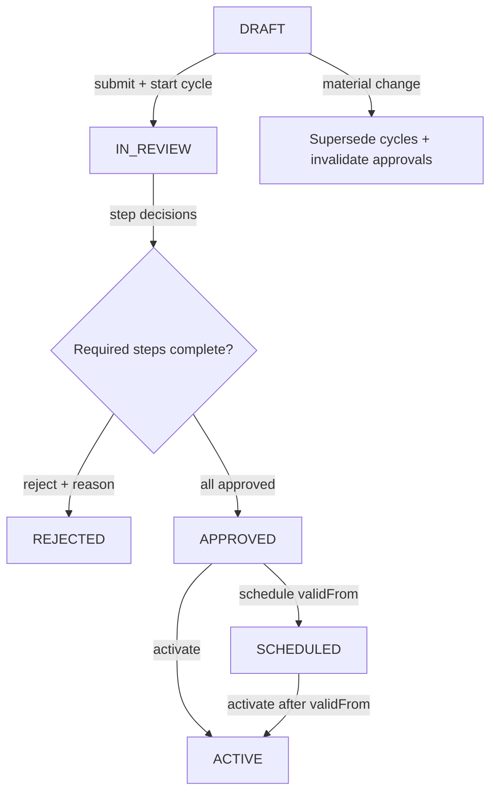

# Data Processing Review & Four-Eyes Workflow (Prompt 14)

**Date:** 2026-07-23  
**Module:** `backend/src/modules/data-authorizations/privacy-domain/review-workflow/`

## Workflow

### Roles

| Role | Permission action |
|------|-------------------|
| Requester | `data_processing.create` (submit) |
| Business Owner | `data_processing.approve` (BUSINESS_OWNER step) |
| Privacy Reviewer | `data_processing.review_privacy` |
| Security Reviewer | `data_processing.review_security` |
| Final Approver | `data_processing.approve` (FINAL_APPROVAL step) |

### Review gates by risk (server-configured)

| Risk | Required steps |
|------|----------------|
| LOW | FINAL_APPROVAL |
| MEDIUM | BUSINESS_OWNER, FINAL_APPROVAL |
| HIGH | BUSINESS_OWNER, PRIVACY_REVIEW, SECURITY_REVIEW, FINAL_APPROVAL |
| CRITICAL | BUSINESS_OWNER, PRIVACY_REVIEW, SECURITY_REVIEW, FINAL_APPROVAL |

Configuration is in `review-workflow.config.ts` — not accepted from clients.

## Permission matrix

| Action | Maps to module | Level |
|--------|----------------|-------|
| `data_processing.view` | data-authorization | read |
| `data_processing.create` | data-authorization | write |
| `data_processing.review_privacy` | data-authorization | manage |
| `data_processing.review_security` | data-authorization | manage |
| `data_processing.approve` | data-authorization | manage |
| `data_processing.activate` | data-authorization | manage |
| `data_processing.suspend` | data-authorization | manage |
| `data_processing.revoke` | data-authorization | manage |
| `data_processing.audit_view` | data-authorization | read |

`ORG_ADMIN` and `MASTER_ADMIN` bypass explicit checks. Existing `org_admin` templates with `data-authorization: manage` satisfy all actions (migration-safe).

## Four-eyes

- Org flag: `Organization.dataProcessingFourEyesEnabled` (default `true`)
- When enabled: requester cannot perform `FINAL_APPROVAL`
- Privacy/security steps may be performed by requester (separation only on final approval)

## Review gates

- Activation (`schedule`, `activate`) requires `APPROVED`/`SCHEDULED` + completed review cycle for exact `versionNumber` + `contentFingerprint`
- Rejection requires reason (min 3 chars)
- Material content change supersedes open/approved cycles and resets entity to DRAFT
- Append-only `data_processing_review_decisions` — no updates
- Parallel decisions on same step → `409 REVIEW_STEP_ALREADY_DECIDED`

## Default role migration

No SQL migration for permissions. `org_admin` retains `data-authorization: { read, write, manage }` → all `data_processing.*` actions via operational permission registry.

`sub_admin` retains read-only `data-authorization` → view/audit only.

## API

| Method | Path | Permission |
|--------|------|------------|
| POST | `.../review-workflow/processing-activities/:id/submit` | write |
| POST | `.../review-workflow/cycles/:cycleId/decisions` | manage |
| GET | `.../review-workflow/cycles/:cycleId` | read |
| POST | `.../policy-lifecycle/...` | guarded (Prompt 14) |

## Test results

| Scenario | Test |
|----------|------|
| Self-approval blocked | `review-workflow.four-eyes` |
| Missing review | `blocks activation without completed review cycle` |
| Rejection without reason | `rejects decision without reason` |
| High/Critical risk gates | `review-workflow.config` |
| Wrong org reviewer | `assertOrgMembership` in service |
| Missing permission | `read-only membership lacks approve` |
| Material change | `invalidates approvals on material change` |
| Parallel decisions | `blocks parallel review decision` |
| Mandatory step missing | `blocks activation when mandatory review step missing` |

Full `data-authorizations` suite run after implementation.
