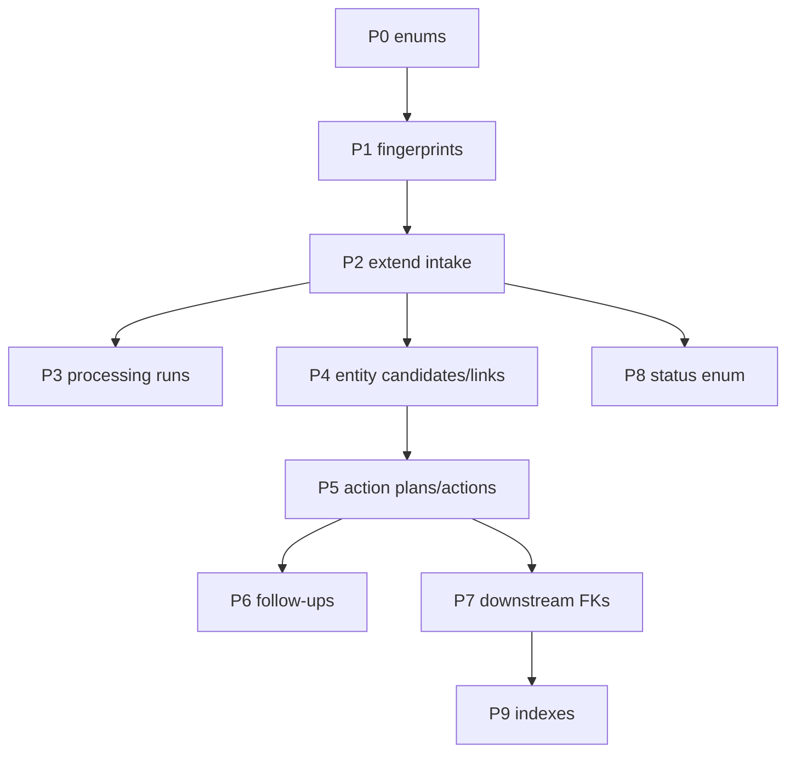

# Document Intake V2 — Additiver Prisma-Migrationsplan

**Version:** 1.0 (Spezifikation)  
**Date:** 2026-07-17  
**Status:** **Planung only** — **keine Schemaänderung, keine Migration, kein produktiver DDL-Lauf**  
**Prompt:** 14/84  
**Basis:**

- [`document-intake-v2-implementation-inventory.md`](../audits/document-intake-v2-implementation-inventory.md) (Prompt 1)
- [`document-intake-lifecycle.transition.ts`](../../backend/src/modules/document-extraction/document-intake-lifecycle.transition.ts) (Prompt 13 — kanonische FSM)
- Ist-Schema: `backend/prisma/schema.prisma` (`VehicleDocumentExtraction` + Downstream-FKs)
- Referenz-Pläne: [`battery-health-v2-prisma-plan.md`](./battery-health-v2-prisma-plan.md), [`driving-intelligence-v2-prisma-plan.md`](./driving-intelligence-v2-prisma-plan.md)

**Schutzregel (verbindlich):** Bestehende produktive Zeilen in `vehicle_document_extractions` und Downstream-Entitäten werden **nicht** still überschrieben. V2 schreibt additiv; Legacy-Pfade bleiben lesbar bis Cutover-Flag.

---

## Inhaltsverzeichnis

| # | Abschnitt |
|---|-----------|
| 0 | Zweck, Scope, Namenskonvention |
| 1 | Ist-Zustand — relevante Modelle |
| 2 | Äquivalenzprüfung — erweitern vs. duplizieren |
| 3 | Geplante Prisma-Enums |
| 4 | `DocumentIntake` (Erweiterung `VehicleDocumentExtraction`) |
| 5 | `DocumentContentFingerprint` |
| 6 | `DocumentProcessingRun` |
| 7 | `DocumentEntityCandidate` |
| 8 | `DocumentEntityLink` |
| 9 | `DocumentActionPlan` |
| 10 | `DocumentAction` |
| 11 | `DocumentFollowUpSuggestion` |
| 12 | Erweiterungen an bestehenden Downstream-Modellen |
| 13 | Migrationsreihenfolge & Abhängigkeiten |
| 14 | Tenant-Scope & FK-Regeln |
| 15 | Audit, Retention & GDPR |
| 16 | Legacy-Mapping |
| 17 | Rollback |
| 18 | Abnahmekriterien (Prompt 14) |

---

## 0. Zweck, Scope, Namenskonvention

### 0.1 Zweck

Dieses Dokument definiert den **exakten additiven** Prisma-/PostgreSQL-Plan für Document Intake V2:

| Geplantes Modell | Rolle |
|------------------|-------|
| `DocumentIntake` | Kanonischer Intake-Root (physische Tabelle: erweiterte `vehicle_document_extractions`) |
| `DocumentContentFingerprint` | Content-Hash / Dedup pro Organisation |
| `DocumentProcessingRun` | Materialisierte Pipeline-Läufe (OCR → Klassifikation → Extraktion) |
| `DocumentEntityCandidate` | Aufgelöste, aber noch nicht bestätigte Entity-Vorschläge |
| `DocumentEntityLink` | Bestätigte operative Zuordnungen (Fahrzeug, Buchung, Kunde, Fahrer, …) |
| `DocumentActionPlan` | Dry-Run / Action-Preview / Apply-Plan mit Fingerprint |
| `DocumentAction` | Einzelne Downstream-Aktion inkl. partiellem Apply-Zustand |
| `DocumentFollowUpSuggestion` | Nicht-destruktive Follow-up-Vorschläge (Tasks, Hinweise) |

### 0.2 Nicht-Ziele (dieser Prompt)

- Keine `schema.prisma`-Änderung
- Keine produktive Migration
- Keine Service-/Frontend-Verdrahtung
- Kein Drop von Legacy-Spalten oder JSON-Blobs

### 0.3 Leitprinzipien

| Prinzip | Bedeutung |
|---------|-----------|
| **Additive only** | Neue Tabellen + nullable Spalten; kein `DROP COLUMN` in V2 Phase 1–8 |
| **Single intake root** | Kein paralleles Upload-Modell — `VehicleDocumentExtraction` bleibt physische Heimat |
| **Tenant-first** | Jede Zeile trägt `organizationId`; Queries immer org-scoped |
| **Pipeline ≠ Apply** | `DocumentProcessingRun` + `FAILED` vs. `DocumentActionPlan` + `APPLY_FAILED` |
| **Confirmed links ≠ candidates** | Kandidaten in `DocumentEntityCandidate`; bestätigte Links in `DocumentEntityLink` |
| **PARTIALLY_APPLIED ≠ APPLIED** | Status + `DocumentActionPlan.status` + Action-Zähler |

### 0.4 DB-Namenskonvention

| Prisma-Modell | PostgreSQL-Tabelle (`@@map`) |
|---------------|------------------------------|
| `DocumentIntake` | `vehicle_document_extractions` (Erweiterung, kein Tabellenwechsel) |
| `DocumentContentFingerprint` | `document_content_fingerprints` |
| `DocumentProcessingRun` | `document_processing_runs` |
| `DocumentEntityCandidate` | `document_entity_candidates` |
| `DocumentEntityLink` | `document_entity_links` |
| `DocumentActionPlan` | `document_action_plans` |
| `DocumentAction` | `document_actions` |
| `DocumentFollowUpSuggestion` | `document_follow_up_suggestions` |

> **Hinweis:** `DocumentIntake` ist der **logische** V2-Name. In Phase 1 bleibt der Prisma-Modellname `VehicleDocumentExtraction` mit `@@map("vehicle_document_extractions")`. Umbenennung des Prisma-Symbols erfolgt in einem späteren Prompt, sobald alle Imports migriert sind.

---

## 1. Ist-Zustand — relevante Modelle

### 1.1 `VehicleDocumentExtraction` (`vehicle_document_extractions`)

| Bereich | Ist (Auszug) |
|---------|--------------|
| Scope | `vehicleId` **required**, `organizationId` optional |
| Typ | `requestedDocumentType`, `effectiveDocumentType`, `detectedDocumentType`, `classificationMode` |
| Lifecycle | `status` (`DocumentExtractionStatus`, 10 Werte), `processingStage`, `errorPhase`, `errorCode` |
| Payload | `extractedData`, `confirmedData`, `plausibility` (JSON inkl. `_pipeline`) |
| File | `objectKey`, `mimeType`, `sizeBytes`, `sourceFileName` |
| Timestamps | `queuedAt` … `appliedAt`, `cancelledAt`, `nextRetryAt` |
| Audit-Spalten | `createdById`, `confirmedById`, `appliedById`, `cancelledById`, `fileDeletedById` |
| Downstream-Pointer | `serviceEventId` (einzelner Legacy-Pointer) |
| Indizes | `(vehicleId)`, `(status)`, `(organizationId, createdAt)`, `(vehicleId, createdAt)`, `(status, updatedAt)` |

**JSON `_pipeline` (heute):** `contentCache`, `documentTypeAudit`, `actionAudit` — siehe `document-content-cache.util.ts`.

### 1.2 Downstream-FKs (Ist)

| Modell | `documentExtractionId` / `documentId` | Unique auf Extraction |
|--------|--------------------------------------|------------------------|
| `OrgInvoice` | `documentExtractionId String?` | **Nein** |
| `BatteryEvidence` | `documentExtractionId String?` | Dedup-Key separat |
| `BrakeEvidence` | `documentExtractionId String?` | Nein |
| `VehicleBatteryReferenceCapacity` | `documentId String?` | Nein |
| `Fine` | **fehlt** | — |
| `VehicleDamage` | **fehlt** | — |
| `VehicleServiceEvent` | **fehlt** | — |

### 1.3 Enums (Ist, nicht duplizieren)

- `DocumentExtractionType` — 13 Apply-Typen + `AUTO` (Kategorie-Basis)
- `DocumentExtractionStatus` — Legacy-Lifecycle (ohne V2-only Status)
- `DocumentExtractionStage`, `DocumentExtractionErrorPhase`

---

## 2. Äquivalenzprüfung — erweitern vs. duplizieren

| Geplantes Modell | Bereits vorhanden? | Entscheidung |
|------------------|-------------------|--------------|
| `DocumentIntake` | `VehicleDocumentExtraction` | **Erweitern** — gleiche Tabelle; V2-Spalten additiv; logische Umbenennung später |
| `DocumentContentFingerprint` | `sizeBytes` + `objectKey` auf Intake | **Neu** — org-scoped Hash-Dedup; Intake referenziert per FK |
| `DocumentProcessingRun` | Timestamps + `plausibility._pipeline.contentCache` | **Neu materialisiert** — JSON bleibt Mirror während Migration |
| `DocumentEntityCandidate` | Ad-hoc in `extractedData` / Zukunft JSON | **Neu** — normalisierte Kandidaten |
| `DocumentEntityLink` | `vehicleId` auf Intake; PATCH reassign | **Neu** — explizite bestätigte Links inkl. booking/customer/driver |
| `DocumentActionPlan` | Kein Dry-Run-Persist | **Neu** |
| `DocumentAction` | `plausibility._pipeline.actionAudit` + `serviceEventId` | **Neu** — `actionAudit` bleibt Legacy-Mirror |
| `DocumentFollowUpSuggestion` | Keine Tabelle | **Neu** — nur Vorschläge, nie Auto-Apply |
| `DocumentExtractionType` | Enum | **Wiederverwenden** als `category`; `documentSubType` optional String |
| `DocumentIntakeCanonicalStatus` (FSM) | `DocumentExtractionStatus` | **Enum erweitern** — neue Werte additiv; `CONFIRMED` deprecated |

**Keine Doppel-Einführung:**

- Kein zweites Upload-Root-Modell (`DocumentUpload`, `OrgDocument`, …)
- Kein paralleles Action-Audit nur in JSON (Dual-Write während Übergang)
- Kein Ersatz von `DocumentExtractionPlausibilityService`-Checks — Plausibility-JSON bleibt bis UI-Migration

---

## 3. Geplante Prisma-Enums

> **Migrationshinweis:** Jeder neue Enum in **eigener** Migration vor erster Spaltennutzung.

**Implementierungsstand (Prompt 15, 2026-07-17):** Migration `20260717193000_document_intake_v2_enums` — 13 additive Enum-Typen in `schema.prisma` (keine Spalten/Modelle). Prisma-Namen gemäß Prompt 15: `DocumentCategory`, `DocumentSubtype`, `DocumentEntityType`, `DocumentCandidateStatus`, `DocumentLinkStatus`, `DocumentActionType`, `DocumentActionStatus`, `DocumentActionRequirement`, `DocumentFollowUpType`, `DocumentFollowUpStatus`, `DocumentProcessingMaturity`, `DocumentDuplicateStatus`, `DocumentApplyMode`. Bestehende `DocumentExtraction*` Enums unverändert.

**Implementierungsstand (Prompt 16, 2026-07-17):** Migration `20260717200000_document_action_plans` — `DocumentActionPlan` + `DocumentActionPlanStatus`; partial unique current index auf `(extraction_id, input_fingerprint) WHERE invalidated_at IS NULL`; Repository `DocumentActionPlanRepository.resolveOrCreatePlan` (Dedup, Invalidierung, Supersede-Kette). Keine `DocumentAction`-Ausführung.

**Implementierungsstand (Prompt 17, 2026-07-17):** Migration `20260717210000_document_actions` — `DocumentAction` mit `DocumentActionType/Status/Requirement`; unique `(organization_id, idempotency_key)`; Payload-Sanitizer; `DocumentActionRepository.createPlannedActions` (Dedup, Pflicht/Optional-Queries). Keine Ausführung.

**Implementierungsstand (Prompt 18, 2026-07-17):** Migration `20260717220000_document_entity_candidates_links` — `DocumentEntityCandidate` + `DocumentEntityLink`; partial unique aktiver Link pro `(extraction_id, entity_type)`; Ranking/Bestätigung/Supersede-Repositories; Tenant-Entity-Scope-Validierung. Keine Resolver-Verdrahtung.

**Implementierungsstand (Prompt 19, 2026-07-17):** Migration `20260717230000_document_extraction_v2_control_fields` — additive V2-Steuerfelder auf `vehicle_document_extractions`; `vehicle_id` nullable; `organization_id` FK (bleibt nullable bis Backfill); Backfill-Plan in `document-intake-v2-extraction-backfill-plan.md` (nicht ausgeführt).

**Implementierungsstand (Prompt 20, 2026-07-17):** Pure Domain-Engine `planDocumentActions()` in `document-action-planner.engine.ts` — deterministischer Planner über Kategorie, confirmedData, Plausibilität, Entity Links/Candidates, Feature Flags und Downstream Capabilities. Output: `DocumentActionPlanDraft`, geplante `PlannedDocumentActionInput[]`, `blockingReasons`, `missingRequirements`, `followUpCandidateTypes`. Fingerprint via `buildDocumentActionPlannerInputFingerprint`. Keine Prisma-Writes, keine Ausführung.

**Implementierungsstand (Prompt 21, 2026-07-17):** `POST /organizations/:orgId/document-extractions/:extractionId/action-plan` — `DocumentExtractionApplyPlanService.dryRunActionPlan` lädt confirmedData/Links, re-prüft Plausibilität, persistiert Plan+Actions (PREVIEW/WOULD_APPLY), keine Downstream-Writes. Planner-Fingerprint als `inputFingerprint` Override für Idempotenz.

**Implementierungsstand (Prompt 22, 2026-07-17):** `document-action-planner.archive-rules.ts` — Archive-Only-Profile (GENERAL, OTHER, bekannte Subtypes wie PAYMENT_PROOF, UNKNOWN_DOCUMENT_TYPE). Semantic planner actions ohne Downstream-Create; Archiv = valider Erfolg; LINK_* nur als unbestätigte Kandidaten-Vorschläge; kein Auto-Kontakt. Planner-Version `document-action-planner-v2`.

**Implementierungsstand (Prompt 23, 2026-07-17):** `document-action-planner.fine-rules.ts` — FINE-Profile mit Modi FINE_NOTICE / HEARING_FORM / DRIVER_INQUIRY. Semantic Actions: CREATE_FINE_DRAFT, LINK_*, SUGGEST_DRIVER_REVIEW, SUGGEST_DEADLINE_TASK, SUGGEST_CUSTOMER_CONTACT. Pflichtfelder Fine Draft nur für FINE_NOTICE; fehlende Tatzeit blockiert Booking-/Driver-Attribution; mehrere Fahrer → keine Auto-Zuordnung; kein offenseType-Default; Anhörungsbogen kein blindes Bußgeld. Planner-Version `document-action-planner-v3`.

**Implementierungsstand (Prompt 24, 2026-07-17):** `document-action-planner.invoice-rules.ts` — Finance-Profile (Eingangsrechnung, Gutschrift, Mahnung, Zahlungsnachweis). Semantic Actions: CREATE_INVOICE_DRAFT, CREATE_CREDIT_NOTE_DRAFT, LINK_*, LINK_EXISTING_INVOICE, SUGGEST_PAYMENT_REVIEW, SUGGEST_DUE_DATE_TASK, ARCHIVE_ONLY. Kein pauschales 19 %-VAT; explizite oder unklare Betrags-/Steuersemantik; taxLines für Mehrfachsätze; Plan-Outcomes READY/DRAFT_ONLY/BLOCKED. Planner-Version `document-action-planner-v4`.

**Implementierungsstand (Prompt 25, 2026-07-17):** `document-action-planner.maintenance-rules.ts` — Maintenance-Profile (SERVICE, OIL_CHANGE, TUV, BOKRAFT, DAMAGE, ACCIDENT, VEHICLE_CONDITION). Semantic Actions: CREATE_SERVICE_EVENT, UPDATE_TUV/BOKRAFT_COMPLIANCE, CREATE_DAMAGE/INSPECTION_DRAFT, LINK_*, SUGGEST_REPAIR/INSPECTION/INSURANCE_REVIEW. Kein Datums-Fallback; validUntil nur bestätigt; Mangelstatus; Accident ≠ auto-Schaden; Readiness über applySafetyDecision. Planner-Version `document-action-planner-v5`.

### 3.1 `DocumentIntakeStatus` (Erweiterung `DocumentExtractionStatus`)

**Strategie:** `DocumentExtractionStatus` **additiv erweitern** (kein neuer Enum-Typ), um bestehende Spalten nicht zu duplizieren.

| Neuer Enum-Wert | Kanonisch (FSM Prompt 13) | Legacy-Mapping |
|-----------------|---------------------------|----------------|
| `READY_FOR_ACTION_PREVIEW` | `READY_FOR_ACTION_PREVIEW` | — |
| `READY_TO_APPLY` | `READY_TO_APPLY` | — |
| `APPLYING` | `APPLYING` | Liest/schreibt interim `CONFIRMED` bis Cutover |
| `PARTIALLY_APPLIED` | `PARTIALLY_APPLIED` | — |
| `APPLY_FAILED` | `APPLY_FAILED` | Liest interim `FAILED` + `errorPhase=APPLY` |

**Bestehende Werte bleiben:** `CONFIRMED` wird **deprecated** (nur Legacy-Read/Write-Compat).

| Aspekt | Plan |
|--------|------|
| Prisma-Typ | `enum DocumentExtractionStatus` erweitert |
| Default | Unverändert `PENDING` auf Intake |
| Rollback | Neue Enum-Werte bleiben in DB; Writer auf Legacy-Mapping zurück |

### 3.2 `DocumentCategory` (implementiert — ehem. Plan `DocumentIntakeCategory`)

```prisma
enum DocumentCategory {
  SERVICE
  MAINTENANCE      // OIL_CHANGE, BRAKE, TIRE, BATTERY
  INSPECTION       // TUV_REPORT, BOKRAFT_REPORT
  FINANCE          // INVOICE, FINE
  DAMAGE           // DAMAGE, ACCIDENT
  CONDITION        // VEHICLE_CONDITION
  GENERAL          // OTHER
}
```

| Aspekt | Plan |
|--------|------|
| Prisma-Typ | `DocumentCategory` (implementiert P15) |
| Nullability | Spalte `category` nullable bis Backfill (folge-Prompt) |
| Default | Abgeleitet aus `effectiveDocumentType` im Writer |
| Legacy-Mapping | `effectiveDocumentType` bleibt Source of Truth bis Cutover |

### 3.2b `DocumentSubtype` (implementiert)

```prisma
enum DocumentSubtype {
  UNSPECIFIED
  STANDARD
  CREDIT_NOTE
  PAYMENT_REMINDER
  PARKING_FINE
  SPEEDING_FINE
  ROUTINE_MAINTENANCE
  INSPECTION_PASS
  INSPECTION_FAIL
  OTHER
}
```

### 3.3 `DocumentEntityType` (implementiert)

```prisma
enum DocumentEntityType {
  VEHICLE
  BOOKING
  CUSTOMER
  DRIVER
  VENDOR
  ORGANIZATION
}
```

### 3.4 `DocumentEntityCandidateStatus`

```prisma
enum DocumentEntityCandidateStatus {
  PROPOSED
  CONFIRMED
  REJECTED
  SUPERSEDED
}
```

### 3.5 `DocumentEntityLinkRole`

```prisma
enum DocumentEntityLinkRole {
  PRIMARY_VEHICLE
  BILLING_CUSTOMER
  ASSIGNED_DRIVER
  RELATED_BOOKING
  VENDOR
  ISSUING_AUTHORITY   // display-only, kein FK-Ziel
}
```

### 3.6 `DocumentProcessingRunKind`

```prisma
enum DocumentProcessingRunKind {
  FULL_PIPELINE
  REEXTRACT
  RECLASSIFY
  OCR_ONLY
  APPLY_RETRY
}
```

### 3.7 `DocumentProcessingRunStatus`

```prisma
enum DocumentProcessingRunStatus {
  RUNNING
  SUCCEEDED
  FAILED
  CANCELLED
}
```

### 3.8 `DocumentActionPlanStatus`

```prisma
enum DocumentActionPlanStatus {
  DRAFT              // Dry-run, nicht bestätigt
  READY              // Preview bestätigt, apply-fähig
  APPLYING
  PARTIALLY_APPLIED
  APPLIED
  APPLY_FAILED
  SUPERSEDED         // Neuere Plan-Version existiert
  ARCHIVE_ONLY       // Kein Downstream-Apply
}
```

### 3.9 `DocumentActionKind`

```prisma
enum DocumentActionKind {
  CREATE_SERVICE_EVENT
  UPDATE_VEHICLE_INSPECTION
  CREATE_INVOICE
  CREATE_FINE
  CREATE_DAMAGE
  RECORD_TIRE_MEASUREMENT
  RECORD_BRAKE_EVIDENCE
  RECORD_BATTERY_EVIDENCE
  ARCHIVE_ONLY
  SUGGEST_TASK          // nur Follow-up, nicht destructive apply
}
```

### 3.10 `DocumentActionStatus`

```prisma
enum DocumentActionStatus {
  WOULD_APPLY
  APPLIED
  SKIPPED
  FAILED
  BLOCKED
}
```

### 3.11 `DocumentFollowUpKind`

```prisma
enum DocumentFollowUpKind {
  CREATE_TASK
  REQUEST_CUSTOMER_INFO
  SCHEDULE_INSPECTION
  NOTIFY_DRIVER
  LINK_TO_BOOKING
  MANUAL_REVIEW
}
```

### 3.12 `DocumentFollowUpStatus`

```prisma
enum DocumentFollowUpStatus {
  SUGGESTED
  ACCEPTED
  DISMISSED
  COMPLETED
}
```

---

## 4. `DocumentIntake` (Erweiterung `VehicleDocumentExtraction`)

**Physische Tabelle:** `vehicle_document_extractions`  
**Prisma (Phase 1):** Modell `VehicleDocumentExtraction` — Umbenennung zu `DocumentIntake` in Phase 8+.

### 4.1 Neue / geänderte Felder (additiv)

| Feld | Prisma-Typ | Null | Default | Relation | Tenant-Scope | Index | Unique | Audit | Retention | Legacy-Mapping | Rollback |
|------|------------|------|---------|----------|--------------|-------|--------|-------|-----------|----------------|----------|
| `vehicleId` | `String?` | **Ja** (Migration ALTER) | — | `Vehicle?` | via FK | bestehend + `(organizationId, vehicleId)` | — | — | Fahrzeug-Lifecycle | bisher required → bleibt für Alt-Rows gesetzt | Spalte wieder NOT NULL nur wenn Cutover abgeschlossen |
| `bookingId` | `String?` | Ja | — | `Booking?` | `organizationId` + FK | `(organizationId, bookingId)` | — | — | Booking-Lifecycle | — | Drop FK + Spalte (spät) |
| `customerId` | `String?` | Ja | — | `Customer?` | org | `(organizationId, customerId)` | — | — | Customer GDPR | — | Drop FK + Spalte |
| `driverId` | `String?` | Ja | — | `Customer?` (`assignedDriver`) | org | `(driverId)` | — | — | wie Customer | — | Drop FK + Spalte |
| `category` | `DocumentIntakeCategory?` | Ja | abgeleitet im Writer | — | org | `(organizationId, category)` | — | — | — | aus `effectiveDocumentType` | Null OK |
| `documentSubType` | `String?` | Ja | — | — | org | — | — | — | — | feiner Granularität (z. B. `MAHNUNG`, `Gutschrift`) | Drop Spalte |
| `contentFingerprintId` | `String?` | Ja | — | `DocumentContentFingerprint?` | org | `(contentFingerprintId)` | — | — | Fingerprint-Tabelle | — | SetNull |
| `canonicalStatus` | `DocumentExtractionStatus` | Nein | `@default(PENDING)` | — | org | `(canonicalStatus, updatedAt)` | — | Status-Übergänge | Intake-Archive | **Optional:** Spalte spiegelt erweitertes `status`; wenn nicht eingeführt, erweitern wir direkt `status` | Writer auf Legacy-Status |
| `activeActionPlanId` | `String?` | Ja | — | `DocumentActionPlan?` | org | `(activeActionPlanId)` | — | Apply-Audit | — | — | SetNull |
| `latestProcessingRunId` | `String?` | Ja | — | `DocumentProcessingRun?` | org | — | — | Pipeline-Audit | — | Timestamps auf Intake bleiben Mirror | SetNull |
| `partialApplyActionCount` | `Int` | Nein | `0` | — | — | — | — | Apply | — | 0 für Legacy | — |
| `totalPlannedActionCount` | `Int?` | Ja | — | — | — | — | — | Apply | — | — | — |

**Planungsentscheidung `status` vs. `canonicalStatus`:**

- **Empfohlen (einfacher):** Bestehende Spalte `status` erhält die neuen Enum-Werte; Domain-FSM aus Prompt 13 mappt Legacy `CONFIRMED` beim Lesen.
- **Alternative:** `canonicalStatus` neu; `status` bleibt Legacy-Spiegel bis Cutover — nur wenn parallele APIs nötig.

### 4.2 Unveränderte Felder (weiterverwenden)

| Feld | V2-Rolle |
|------|----------|
| `organizationId` | Pflicht-Scope (wird **NOT NULL** in Phase 3 — heute nullable) |
| `requested/effective/detectedDocumentType` | Klassifikations-Wahrheit |
| `extractedData`, `confirmedData` | Human-review Payload |
| `plausibility` | Plausibility-Checks + `_pipeline` Mirror |
| `objectKey`, `mimeType`, `sizeBytes` | File-Metadaten |
| `errorPhase`, `errorCode`, `errorMessage` | Pipeline/Apply-Fehler |
| `serviceEventId` | **Legacy** Einzelpointer — ersetzt durch `DocumentAction` |
| Audit-Spalten | bleiben; ergänzt durch Run/Action-Tabellen |

### 4.3 Constraints (geplant)

```sql
-- Phase 3: organizationId NOT NULL für neue Rows (Backfill aus vehicle.organizationId)
-- Phase 4: CHECK — mindestens eine Entity-Zuordnung vor Apply für fahrzeugpflichtige Typen
--   (erzwungen im Service, optional DB CHECK nach Reife)
```

---

## 5. `DocumentContentFingerprint`

**Tabelle:** `document_content_fingerprints`

| Feld | Prisma-Typ | Null | Default | Relation | Tenant-Scope | Index | Unique | Audit | Retention | Legacy-Mapping | Rollback |
|------|------------|------|---------|----------|--------------|-------|--------|-------|-----------|----------------|----------|
| `id` | `String` @id @uuid | Nein | `uuid()` | — | — | PK | PK | — | — | — | — |
| `organizationId` | `String` | Nein | — | `Organization` | **Ja** | `(organizationId, createdAt)` | — | — | Org-Lifecycle | — | Cascade org delete |
| `contentSha256` | `String` | Nein | — | — | org | — | `@@unique([organizationId, contentSha256])` | — | Dedup-Registry | — | — |
| `byteSize` | `Int` | Nein | — | — | — | — | — | — | — | `sizeBytes` auf Intake | — |
| `mimeType` | `String?` | Ja | — | — | — | — | — | — | — | `mimeType` auf Intake | — |
| `normalizedMimeType` | `String?` | Ja | — | — | — | — | — | — | — | — | — |
| `pageCount` | `Int?` | Ja | — | — | — | — | — | — | — | `ocrPageCount` | — |
| `firstSeenAt` | `DateTime` | Nein | `now()` | — | — | — | — | — | — | — | — |
| `lastSeenAt` | `DateTime` | Nein | `now()` | — | — | — | — | — | — | — | — |
| `seenCount` | `Int` | Nein | `1` | — | — | — | — | — | — | — | — |
| `createdAt` | `DateTime` | Nein | `now()` | — | — | — | — | — | — | — | — |
| `updatedAt` | `DateTime` | Nein | `@updatedAt` | — | — | — | — | — | — | — | — |

**Relation:** `DocumentIntake.contentFingerprintId` → hierher. Mehrere Intakes **dürfen** gleichen Fingerprint referenzieren (Re-Upload-Warnung, kein Hard-Block in Phase 1).

---

## 6. `DocumentProcessingRun`

**Tabelle:** `document_processing_runs`

| Feld | Prisma-Typ | Null | Default | Relation | Tenant-Scope | Index | Unique | Audit | Retention | Legacy-Mapping | Rollback |
|------|------------|------|---------|----------|--------------|-------|--------|-------|-----------|----------------|----------|
| `id` | `String` @uuid | Nein | uuid | — | — | PK | PK | — | 90d nach Intake terminal | — | — |
| `organizationId` | `String` | Nein | — | `Organization` | **Ja** | `(organizationId, startedAt)` | — | — | — | — | — |
| `documentIntakeId` | `String` | Nein | — | `DocumentIntake` | org + intake | `(documentIntakeId, startedAt DESC)` | — | Pipeline-Audit | mit Intake | — | Cascade |
| `kind` | `DocumentProcessingRunKind` | Nein | `FULL_PIPELINE` | — | — | — | — | — | — | — | — |
| `status` | `DocumentProcessingRunStatus` | Nein | `RUNNING` | — | — | `(status, startedAt)` | — | — | — | — | — |
| `attemptNumber` | `Int` | Nein | `1` | — | — | — | — | — | — | `processingAttempts` | — |
| `stage` | `DocumentExtractionStage` | Nein | `QUEUE` | — | — | — | — | — | — | `processingStage` Mirror | — |
| `errorPhase` | `DocumentExtractionErrorPhase?` | Ja | — | — | — | — | — | — | — | Intake `errorPhase` | — |
| `errorCode` | `String?` | Ja | — | — | — | — | — | — | — | Intake `errorCode` | — |
| `errorMessage` | `String?` | Ja | — | — | — | — | — | PII-safe | — | Intake `errorMessage` | — |
| `ocrProvider` | `String?` | Ja | — | — | — | — | — | — | — | Intake-Spiegel | — |
| `ocrModel` | `String?` | Ja | — | — | — | — | — | — | — | — | — |
| `extractionProvider` | `String?` | Ja | — | — | — | — | — | — | — | — | — |
| `extractionModel` | `String?` | Ja | — | — | — | — | — | — | — | — | — |
| `ocrPageCount` | `Int?` | Ja | — | — | — | — | — | — | — | — | — |
| `contentFingerprintId` | `String?` | Ja | — | `DocumentContentFingerprint?` | org | — | — | — | — | — | SetNull |
| `pipelinePayloadJson` | `Json?` | Ja | — | — | — | — | — | — | OCR-Text **nicht** unbegrenzt | `plausibility._pipeline` Partial-Mirror | — |
| `startedAt` | `DateTime` | Nein | `now()` | — | — | — | — | — | — | `processingStartedAt` | — |
| `completedAt` | `DateTime?` | Ja | — | — | — | — | — | — | — | `processingCompletedAt` | — |
| `createdAt` | `DateTime` | Nein | `now()` | — | — | — | — | — | — | — | — |
| `updatedAt` | `DateTime` | Nein | `@updatedAt` | — | — | — | — | — | — | — | — |

**Unique:** Kein globaler Unique — mehrere Runs pro Intake erlaubt. Optional `@@unique([documentIntakeId, kind, attemptNumber])` für Idempotenz.

---

## 7. `DocumentEntityCandidate`

**Tabelle:** `document_entity_candidates`

| Feld | Prisma-Typ | Null | Default | Relation | Tenant-Scope | Index | Unique | Audit | Retention | Legacy-Mapping | Rollback |
|------|------------|------|---------|----------|--------------|-------|--------|-------|-----------|----------------|----------|
| `id` | `String` @uuid | Nein | uuid | — | — | PK | PK | — | mit Intake | JSON-Blob `entityCandidates` (zukünftig) | — |
| `organizationId` | `String` | Nein | — | `Organization` | **Ja** | — | — | — | — | — | — |
| `documentIntakeId` | `String` | Nein | — | `DocumentIntake` | org | `(documentIntakeId, entityType)` | — | — | — | — | Cascade |
| `entityType` | `DocumentEntityType` | Nein | — | — | — | — | — | — | — | — | — |
| `entityId` | `String?` | Ja | — | polymorph | org | `(entityType, entityId)` | — | — | — | — | — |
| `displayLabel` | `String?` | Ja | — | — | — | — | — | — | — | z. B. Kennzeichen-Text | — |
| `score` | `Decimal(5,4)?` | Ja | — | — | — | — | — | — | — | Resolver-Score | — |
| `matchReason` | `String?` | Ja | — | — | — | — | — | — | — | `PLATE_EXACT`, `BOOKING_OVERLAP`, … | — |
| `status` | `DocumentEntityCandidateStatus` | Nein | `PROPOSED` | — | — | `(documentIntakeId, status)` | — | — | — | — | — |
| `source` | `String` | Nein | `"resolver_v1"` | — | — | — | — | — | — | — | — |
| `metadataJson` | `Json?` | Ja | — | — | — | — | — | — | — | — | — |
| `proposedAt` | `DateTime` | Nein | `now()` | — | — | — | — | — | — | — | — |
| `resolvedAt` | `DateTime?` | Ja | — | — | — | — | — | — | — | — | — |
| `createdAt` | `DateTime` | Nein | `now()` | — | — | — | — | — | — | — | — |
| `updatedAt` | `DateTime` | Nein | `@updatedAt` | — | — | — | — | — | — | — | — |

**Unique (optional):** `@@unique([documentIntakeId, entityType, entityId])` WHERE `entityId IS NOT NULL`.

**Polymorphe FK:** Kein DB-enforced FK auf `entityId` — Validierung im Service je `entityType` (wie `TaskLinkedObject`).

---

## 8. `DocumentEntityLink`

**Tabelle:** `document_entity_links`  
**Nur bestätigte Links** — Kandidat wird bei Bestätigung `CONFIRMED` oder direkt hier persistiert.

| Feld | Prisma-Typ | Null | Default | Relation | Tenant-Scope | Index | Unique | Audit | Retention | Legacy-Mapping | Rollback |
|------|------------|------|---------|----------|--------------|-------|--------|-------|-----------|----------------|----------|
| `id` | `String` @uuid | Nein | uuid | — | — | PK | PK | — | mit Intake | — | — |
| `organizationId` | `String` | Nein | — | `Organization` | **Ja** | — | — | — | — | — | — |
| `documentIntakeId` | `String` | Nein | — | `DocumentIntake` | org | `(documentIntakeId)` | — | **Ja** | — | `vehicleId` auf Intake | — |
| `entityType` | `DocumentEntityType` | Nein | — | — | — | — | — | — | — | — | — |
| `entityId` | `String` | Nein | — | polymorph | org | `(entityType, entityId)` | — | — | — | — | — |
| `role` | `DocumentEntityLinkRole` | Nein | — | — | — | — | `@@unique([documentIntakeId, role])` | — | — | ein PRIMARY_VEHICLE | — |
| `confirmedById` | `String?` | Ja | — | `User?` | — | — | — | **Ja** | — | `confirmedById` auf Intake | — |
| `confirmedAt` | `DateTime` | Nein | `now()` | — | — | — | — | **Ja** | — | — | — |
| `sourceCandidateId` | `String?` | Ja | — | `DocumentEntityCandidate?` | — | — | — | — | — | — | SetNull |
| `createdAt` | `DateTime` | Nein | `now()` | — | — | — | — | — | — | — | — |
| `updatedAt` | `DateTime` | Nein | `@updatedAt` | — | — | — | — | — | — | — | — |

**Legacy-Mapping:** `DocumentEntityLink` mit `role=PRIMARY_VEHICLE` spiegelt `DocumentIntake.vehicleId` während Dual-Write.

---

## 9. `DocumentActionPlan`

**Tabelle:** `document_action_plans`

| Feld | Prisma-Typ | Null | Default | Relation | Tenant-Scope | Index | Unique | Audit | Retention | Legacy-Mapping | Rollback |
|------|------------|------|---------|----------|--------------|-------|--------|-------|-----------|----------------|----------|
| `id` | `String` @uuid | Nein | uuid | — | — | PK | PK | — | mit Intake | — | — |
| `organizationId` | `String` | Nein | — | `Organization` | **Ja** | — | — | — | — | — | — |
| `documentIntakeId` | `String` | Nein | — | `DocumentIntake` | org | `(documentIntakeId, createdAt DESC)` | — | Apply-Audit | — | — | Cascade |
| `planFingerprint` | `String` | Nein | — | — | org | — | `@@unique([documentIntakeId, planFingerprint])` | — | — | Hash aus `effectiveType + confirmedData + entityLinks` | — |
| `planVersion` | `Int` | Nein | `1` | — | — | — | — | — | — | — | — |
| `status` | `DocumentActionPlanStatus` | Nein | `DRAFT` | — | — | `(documentIntakeId, status)` | — | — | — | Intake `status` APPLY-Phase | — |
| `documentType` | `DocumentExtractionType` | Nein | — | — | — | — | — | — | — | `effectiveDocumentType` | — |
| `confirmedDataJson` | `Json` | Nein | — | — | — | — | — | — | — | `confirmedData` Snapshot | — |
| `entityLinksSnapshotJson` | `Json?` | Ja | — | — | — | — | — | — | — | bestätigte Links zum Planzeitpunkt | — |
| `plannedActionCount` | `Int` | Nein | `0` | — | — | — | — | — | — | — | — |
| `appliedActionCount` | `Int` | Nein | `0` | — | — | — | — | — | — | `partialApplyActionCount` auf Intake | — |
| `blockedReasonsJson` | `Json?` | Ja | — | — | — | — | — | — | — | `applySafety.reasons` | — |
| `supersededById` | `String?` | Ja | — | `DocumentActionPlan?` | — | — | — | — | — | — | Self-FK |
| `createdById` | `String?` | Ja | — | `User?` | — | — | — | **Ja** | — | — | — |
| `confirmedById` | `String?` | Ja | — | `User?` | — | — | — | **Ja** | — | — | — |
| `createdAt` | `DateTime` | Nein | `now()` | — | — | — | — | — | — | — | — |
| `confirmedAt` | `DateTime?` | Ja | — | — | — | — | — | — | — | — | — |
| `appliedAt` | `DateTime?` | Ja | — | — | — | — | — | — | — | Intake `appliedAt` | — |
| `updatedAt` | `DateTime` | Nein | `@updatedAt` | — | — | — | — | — | — | — | — |

**`planFingerprint` Berechnung (Domain, nicht DB):**

```
sha256(stableJson({
  effectiveDocumentType,
  confirmedData,        // keys sorted
  entityLinks,          // role + entityType + entityId sorted
  applySafetyDecision,
  schemaVersion: 1,
}))
```

**PARTIALLY_APPLIED:** `status=PARTIALLY_APPLIED` wenn `0 < appliedActionCount < plannedActionCount`.

---

## 10. `DocumentAction`

**Tabelle:** `document_actions`

| Feld | Prisma-Typ | Null | Default | Relation | Tenant-Scope | Index | Unique | Audit | Retention | Legacy-Mapping | Rollback |
|------|------------|------|---------|----------|--------------|-------|--------|-------|-----------|----------------|----------|
| `id` | `String` @uuid | Nein | uuid | — | — | PK | PK | — | mit Plan | — | — |
| `organizationId` | `String` | Nein | — | `Organization` | **Ja** | — | — | — | — | — | — |
| `documentIntakeId` | `String` | Nein | — | `DocumentIntake` | org | `(documentIntakeId)` | — | — | — | — | Cascade |
| `actionPlanId` | `String` | Nein | — | `DocumentActionPlan` | org | `(actionPlanId, sequence)` | — | Apply-Audit | — | — | Cascade |
| `sequence` | `Int` | Nein | — | — | — | — | `@@unique([actionPlanId, sequence])` | — | — | — | — |
| `kind` | `DocumentActionKind` | Nein | — | — | — | — | — | — | — | — | — |
| `status` | `DocumentActionStatus` | Nein | `WOULD_APPLY` | — | — | `(actionPlanId, status)` | — | — | — | `actionAudit[].action` | — |
| `downstreamEntityType` | `String?` | Ja | — | — | — | — | — | — | — | provenance gate | — |
| `downstreamEntityId` | `String?` | Ja | — | — | org | `(downstreamEntityType, downstreamEntityId)` | `@@unique([documentIntakeId, kind])` optional | — | — | `serviceEventId` für erste Action | — |
| `payloadJson` | `Json?` | Ja | — | — | — | — | — | — | — | Apply-Input Snapshot | — |
| `resultJson` | `Json?` | Ja | — | — | — | — | — | — | — | `DocumentApplyTypedResult` | — |
| `errorCode` | `String?` | Ja | — | — | — | — | — | — | — | — | — |
| `errorMessage` | `String?` | Ja | — | — | — | — | — | PII-safe | — | — | — |
| `appliedAt` | `DateTime?` | Ja | — | — | — | — | — | **Ja** | — | — | — |
| `createdAt` | `DateTime` | Nein | `now()` | — | — | — | — | — | — | — | — |
| `updatedAt` | `DateTime` | Nein | `@updatedAt` | — | — | — | — | — | — | — | — |

**Idempotenz:** `@@unique([documentIntakeId, kind])` WHERE `status = APPLIED` — verhindert doppelte Fine/Invoice pro Intake (ersetzt Ad-hoc-Checks).

**Partial apply:** Einzelne Actions können `APPLIED` sein während Geschwister `WOULD_APPLY` / `FAILED` bleiben → Plan `PARTIALLY_APPLIED`.

---

## 11. `DocumentFollowUpSuggestion`

**Tabelle:** `document_follow_up_suggestions`

| Feld | Prisma-Typ | Null | Default | Relation | Tenant-Scope | Index | Unique | Audit | Retention | Legacy-Mapping | Rollback |
|------|------------|------|---------|----------|--------------|-------|--------|-------|-----------|----------------|----------|
| `id` | `String` @uuid | Nein | uuid | — | — | PK | PK | — | 1y | — | — |
| `organizationId` | `String` | Nein | — | `Organization` | **Ja** | — | — | — | — | — | — |
| `documentIntakeId` | `String` | Nein | — | `DocumentIntake` | org | `(documentIntakeId)` | — | — | — | — | Cascade |
| `actionPlanId` | `String?` | Ja | — | `DocumentActionPlan?` | — | — | — | — | — | — | SetNull |
| `kind` | `DocumentFollowUpKind` | Nein | — | — | — | — | — | — | — | — | — |
| `status` | `DocumentFollowUpStatus` | Nein | `SUGGESTED` | — | — | `(documentIntakeId, status)` | — | — | — | — | — |
| `title` | `String` | Nein | — | — | — | — | — | — | — | — | — |
| `description` | `String?` | Ja | — | — | — | — | — | — | — | — | — |
| `suggestedPayloadJson` | `Json?` | Ja | — | — | — | — | — | — | — | Task template etc. | — |
| `linkedTaskId` | `String?` | Ja | — | `OrgTask?` | org | — | — | — | — | nach Accept | SetNull |
| `dismissedById` | `String?` | Ja | — | `User?` | — | — | — | **Ja** | — | — | — |
| `dismissedAt` | `DateTime?` | Ja | — | — | — | — | — | — | — | — | — |
| `createdAt` | `DateTime` | Nein | `now()` | — | — | — | — | — | — | — | — |
| `updatedAt` | `DateTime` | Nein | `@updatedAt` | — | — | — | — | — | — | — | — |

**Regel:** Follow-ups werden **niemals** im Apply-Worker ausgeführt — nur `DocumentAction` mit `kind != SUGGEST_TASK`.

---

## 12. Erweiterungen an bestehenden Downstream-Modellen

### 12.1 `Fine` — additiv

| Feld | Prisma-Typ | Null | Default | Relation | Index | Unique | Legacy | Rollback |
|------|------------|------|---------|----------|-------|--------|--------|----------|
| `documentIntakeId` | `String?` | Ja | — | `DocumentIntake?` | `(documentIntakeId)` | `@@unique([documentIntakeId])` WHERE NOT NULL | fehlt heute | Drop FK |

### 12.2 `VehicleDamage` — additiv

| Feld | Prisma-Typ | Null | Default | Relation | Index | Unique |
|------|------------|------|---------|----------|-------|--------|
| `documentIntakeId` | `String?` | Ja | — | `DocumentIntake?` | `(documentIntakeId)` | `@@unique([documentIntakeId])` |

### 12.3 `OrgInvoice` — additiv

| Feld | Änderung |
|------|----------|
| `documentExtractionId` | **Unique** ergänzen: `@@unique([documentExtractionId])` |
| Rename (spät) | `documentIntakeId` Alias-Spalte oder Synonym-Migration |

### 12.4 `VehicleServiceEvent` — additiv

| Feld | Prisma-Typ | Null | Index | Unique |
|------|------------|------|-------|--------|
| `documentIntakeId` | `String?` | Ja | `(documentIntakeId)` | Nein (mehrere Service-Actions möglich) |

### 12.5 Evidence-Modelle (unverändert + Index)

`BatteryEvidence`, `BrakeEvidence` — `documentExtractionId` behalten; optional Composite `@@index([documentExtractionId, valueType])`.

---

## 13. Migrationsreihenfolge & Abhängigkeiten

Alle Migrationen **additiv**. Vorschlagsname folgt `YYYYMMDDHHMMSS_description`.

| Phase | Migration | Inhalt | Gate |
|-------|-----------|--------|------|
| **P0** | `document_intake_v2_enums` | §3 Enums | — |
| **P1** | `document_content_fingerprints` | `DocumentContentFingerprint` | `DOCUMENT_INTAKE_V2` shadow |
| **P2** | `document_intake_extend_vehicle_document_extractions` | §4 Spalten + `vehicleId` nullable + `organizationId` NOT NULL Backfill | shadow |
| **P3** | `document_processing_runs` | `DocumentProcessingRun` + FK auf Intake | worker dual-write |
| **P4** | `document_entity_candidates_links` | `DocumentEntityCandidate` + `DocumentEntityLink` | resolver |
| **P5** | `document_action_plans_actions` | `DocumentActionPlan` + `DocumentAction` | dry-run API |
| **P6** | `document_follow_up_suggestions` | `DocumentFollowUpSuggestion` | preview UI |
| **P7** | `document_intake_downstream_fks` | §12 Fine/Damage/ServiceEvent FKs + Invoice unique | apply hardening |
| **P8** | `document_intake_status_enum_extend` | Neue `DocumentExtractionStatus` Werte | cutover |
| **P9** | `document_intake_indexes_audit` | Composite-Indizes, optional partial uniques | ops |

**Abhängigkeitsgraph:**



---

## 14. Tenant-Scope & FK-Regeln

| Regel | Umsetzung |
|-------|-----------|
| Org-Isolation | Jede neue Tabelle hat `organizationId` NOT NULL |
| Intake-Ownership | Child-FKs → `documentIntakeId` mit `onDelete: Cascade` |
| Cross-tenant | Service validiert: `intake.organizationId === entity.organizationId` |
| Nullable `vehicleId` | Upload darf org-weit starten; `PRIMARY_VEHICLE` Link required vor Apply für fahrzeugpflichtige Typen |
| Polymorphe Entities | `DocumentEntityCandidate/Link` — FK-Validierung im Service |
| Downstream Deletes | `onDelete: SetNull` auf Fine/Invoice/Damage FKs |

---

## 15. Audit, Retention & GDPR

| Objekt | Audit | Retention |
|--------|-------|-----------|
| `DocumentIntake` | Spalten `*ById` + Run/Action-Tabellen | Lebensdauer Org-Archive; GDPR-Delete löscht Intake + File + Runs |
| `DocumentProcessingRun` | `pipelinePayloadJson` ohne Raw-OCR unbegrenzt | 90 Tage nach terminalem Intake (Job) |
| `DocumentActionPlan/Action` | immutable nach `APPLIED` | min. 7 Jahre Finanzdocs, sonst Org-Policy |
| `DocumentContentFingerprint` | `seenCount` | solange Referenzen existieren |
| `DocumentFollowUpSuggestion` | `dismissedById` | 1 Jahr |
| OCR-Text in JSON | `_pipeline.contentCache` | **Kürzen/entfernen** in Retention-Job (bestehende Ops-Policy) |

**GDPR-Delete-Pfad (geplant):** Intake terminal `CANCELLED`/`REJECTED` oder expliziter Delete → Cascade Children → `objectKey` Storage-Delete → Fingerprint `seenCount` dekrementieren.

---

## 16. Legacy-Mapping

| Legacy | V2 kanonisch | Leseregel |
|--------|--------------|-----------|
| `status=CONFIRMED` | `APPLYING` | `normalizeStoredStatusToCanonical` |
| `status=FAILED` + `errorPhase=APPLY` | `APPLY_FAILED` | wie Prompt 13 |
| `status=FAILED` + Pipeline-Phase | `FAILED` | — |
| `vehicleId` (required) | `DocumentEntityLink(PRIMARY_VEHICLE)` | Dual-Write Phase 2–6 |
| `serviceEventId` | `DocumentAction.downstreamEntityId` (erste SERVICE-Action) | Backfill-Skript |
| `plausibility._pipeline.actionAudit` | `DocumentAction` Rows | Dual-Write, JSON als Mirror |
| `plausibility._pipeline.contentCache` | `DocumentProcessingRun.pipelinePayloadJson` | OCR-Text nur in Run, nicht duplizieren langfristig |
| `documentExtractionId` auf Invoice | `documentIntakeId` Synonym | gleiche UUID |

---

## 17. Rollback

| Phase | Rollback-Strategie |
|-------|-------------------|
| P0–P1 | Feature-Flag aus; neue Tabellen ungenutzt — **kein Drop nötig** |
| P2 | Neue Spalten ignorieren; `vehicleId` bleibt nullable oder Backfill behalten |
| P3–P6 | Writer auf JSON-Legacy; Tabellen bleiben leer |
| P7 | Downstream-FKs nullable — Legacy-Apply ohne FK weiter möglich |
| P8 | Status-Writer mappt `APPLYING` → `CONFIRMED`, `APPLY_FAILED` → `FAILED`+`APPLY` |
| Vollständiger Rollback | Kein `DROP TABLE` in Produktion ohne Ops-Fenster; Tabellen orphaned bis Cleanup |

**Datenverlust:** Bestehende `vehicle_document_extractions` und Downstream-Records bleiben bei Rollback **unverändert**.

---

## 18. Abnahmekriterien (Prompt 14)

| # | Kriterium | Status |
|---|-----------|--------|
| 1 | Alle 8 Modelle spezifiziert | ✅ |
| 2 | Pro Feld: Typ, Null, Default, Relation, Tenant, Index, Unique, Audit, Retention, Legacy, Rollback | ✅ (Tabellen §4–11) |
| 3 | Äquivalenzprüfung: erweitern vs. duplizieren dokumentiert | ✅ §2 |
| 4 | Optionales `vehicleId` + booking/customer/driver | ✅ §4, §8 |
| 5 | Kategorie / Untertyp | ✅ §3.2, §4 |
| 6 | Content Hash | ✅ §5 |
| 7 | Action-Plan-Fingerprint | ✅ §9 |
| 8 | Downstream Entity IDs | ✅ §10, §12 |
| 9 | Partielle Apply-Zustände | ✅ §9, §10 |
| 10 | Bestätigte Entity Links | ✅ §8 |
| 11 | **Keine** Schemaänderung in diesem Prompt | ✅ |

---

## Änderungshistorie

| Version | Datum | Änderung |
|---------|-------|----------|
| 1.0 | 2026-07-17 | Initialer additiver Plan (Prompt 14/84) |
