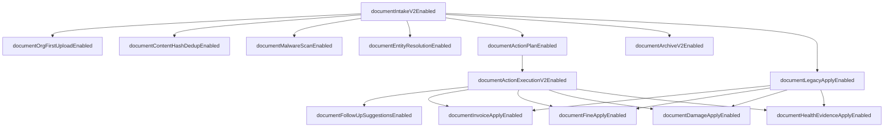

# Document Intake V2 — Feature-Flag- und Rolloutvertrag

**Version:** 1.0 (Spezifikation)  
**Date:** 2026-07-17  
**Status:** **Normativ für Prompts 4–84** — keine produktive Flag-Logik in diesem Dokument  
**Serie:** Prompt **3/84** (Document Intake V2)  
**Basis:** [`document-intake-v2.md`](./document-intake-v2.md) (Architekturvertrag Prompt 2/84)

**Prinzip:** Bestehende SynqDrive-Flag-Muster wiederverwenden. **Keine** parallele Flag-Engine, kein externes Feature-Flag-SaaS, kein zweites Evaluations-Framework.

**Schutzregel (verbindlich):**

```
Intake + OCR + Klassifikation + Extraktion + Review
  ≠ Action Execution (Downstream-Writes)

Dry Run und Apply teilen denselben Action-Plan-Builder.
Nur Action Execution darf Domain-Services mutieren.
```

---

## Inhaltsverzeichnis

| # | Abschnitt |
|---|-----------|
| 0 | Zweck |
| 1 | Bestehende Flag-Infrastruktur (Ist) |
| 2 | Ziel-Integration (Wiederverwendung) |
| 3 | Flag-Katalog |
| 4 | Abhängigkeitsgraph |
| 5 | Sichere Aktivierungsreihenfolge |
| 6 | Deaktivierung und Rollback |
| 7 | Metriken |
| 8 | Erlaubte Schreibpfade bei deaktivierter Execution |
| 9 | Laufzeit vs. Deployment |
| 10 | Org-Overrides |
| 11 | Rollout-Phasen — Default-Zusammenfassung |
| 12 | Abnahmekriterien (Prompt 3) |

---

## 0. Zweck

Dieser Vertrag definiert **wie** Document Intake V2 schrittweise und reversibel aktiviert wird, ohne:

- unsichere Apply-Pfade mit erfundenen Defaults (Audit P0: `APPLIED` ohne `fines`-Row, `Parkverstoß`, 19 % VAT, SCRATCH/MODERATE)
- parallele Dry-Run- und Apply-Logik
- automatische Kundenkontakte aus Intake
- Malware-Scan-Fail-Closed vor validiertem Scannerbetrieb
- Org-first Upload ohne getestete Fallbacks erzwingen

**Ziele:**

- Schichtweise Aktivierung entlang des 11-Schichten-Modells (Intake → Plan → Execution → Archive)
- Klare Defaults: **V2 Apply aus**, **Legacy Apply nur für belegte sichere Typen**, **Entity Resolution nur Vorschlag**, **Action Plan vor Execution**, **Follow-ups ohne Auto-Ausführung**
- Einheitliche Evaluierung über **einen** `DocumentIntakeV2Config`-Service
- Operative Sicherheit: Rollback ohne Löschen von Extraction-Records und Audit-Trail

**Nicht Gegenstand:** Implementierung der Config-Klasse, Prisma-Migration, Admin-UI (folgen in Prompts 4+).

---

## 1. Bestehende Flag-Infrastruktur (Ist)

SynqDrive nutzt **kein** zentrales Feature-Flag-Produkt. Bewährte Muster im Repo:

| Muster | Beispiel im Repo | Eigenschaft |
|--------|------------------|-------------|
| **Env + `registerAs` Config-Modul** | `document-extraction.config.ts`, `ai.config.ts` (`parseBooleanEnv`), `notification-evaluation.config.ts` | Global; Deployment via `backend.env`; NestJS `ConfigService` |
| **Injectable Config-Klasse** | `NotificationEngineConfig` (`NOTIFICATIONS_V2`), `DrivingIntelligenceV2Config` | Einfache `is*Enabled()`-Gates mit Master-Sub-Flag-Hierarchie |
| **Org-Spalte `Boolean`** | `Organization.paymentsEnabled` + `PaymentsAccessService` | Org-Scope; **Laufzeit** änderbar |
| **JSON `configJson`** | `OrganizationIntegration.configJson`, Task-Automation Org-Overrides | Flexibel; Laufzeit |
| **Observability** | `DocumentExtractionObservabilityService` → `TripMetricsService` (`document_extraction_*` Prometheus) | Metriken für Jobs, Apply, Classification |
| **Kontakt-Schutz (global)** | `ai.config.ts` → `externalActionsRequireApproval` (`AI_EXTERNAL_ACTIONS_REQUIRE_APPROVAL`, default `true`) | Kein Auto-Versand ohne Approval-Policy |

### 1.1 Document-Extraction Ist-Config (`document-extraction.config.ts`)

Bereits vorhanden — **bleiben Schwellen/Infra**, werden **nicht** zu V2-Feature-Flags umdefiniert:

| Env-Variable | Default | Rolle |
|--------------|---------|-------|
| `DOCUMENT_EXTRACTION_QUEUE_ENABLED` | `true` | Queue-Gate; Upload rejected wenn `false` in Prod |
| `DOCUMENT_AI_EXTRACTION_ENABLED` | `true` | Mistral-Extraktion |
| `DOCUMENT_CLASSIFICATION_ENABLED` | `true` | AUTO-Klassifikation |
| `DOCUMENT_UPLOAD_MAX_MB` | `10` | Größenlimit |
| `DOCUMENT_PDF_MIN_TEXT_CHARS` | `40` | PDF-Text-Qualitätsgate |
| `DOCUMENT_CLASSIFICATION_AUTO_CONTINUE_MIN` | `0.85` | Klassifikations-Schwelle |
| Recovery/Chunking-Env | siehe `.env.example` | Worker-Resilienz |

**Explizit nicht vorhanden:** `DOCUMENT_INTAKE_V2`, `DocumentIntakeV2Config`, Apply Dry-Run-API, per-Type Apply-Flags, Malware-Scan, Content-Hash-Dedup.

**Explizit außerhalb des V2-Flag-Scope:** Customer Verification / Didit, Invoice-Public-Upload (`/uploads/`), `FinesView.AIUploadFlow` Stub.

**Document Intake V2 Plan:** Erweiterung von `document-extraction.config.ts` **oder** neues Modul `backend/src/config/document-intake-v2.config.ts` (analog `DrivingIntelligenceV2Config`) + `DocumentIntakeV2Config` Injectable — **kein** neues Framework.

---

## 2. Ziel-Integration (Wiederverwendung)

### 2.1 `DocumentIntakeV2Config` (geplant)

```typescript
// Ziel-Signatur (Spezifikation only)
@Injectable()
export class DocumentIntakeV2Config {
  // Global env defaults
  isMasterEnabled(): boolean;
  isOrgFirstUploadEnabled(): boolean;
  // …

  // Effective flag = f(globalEnv, orgConfigJson?)
  resolve(orgId: string): DocumentIntakeV2EffectiveFlags;

  /** Typ-spezifischer Apply-Pfad: legacy | v2 | blocked */
  resolveApplyPath(
    orgId: string,
    documentType: ApplyDocumentExtractionType,
  ): 'legacy' | 'v2' | 'blocked';
}
```

**Consumer (erlaubt):**

- `DocumentExtractionService`, `DocumentExtractionController`, `DocumentExtractionOrgController`
- `DocumentExtractionProcessor`, `DocumentEntityResolverService` (neu)
- `DocumentExtractionApplyPlanService`, `DocumentExtractionApplyExecutor` (neu)
- `DocumentExtractionApplyService` (Legacy — gated)
- Frontend: `useDocumentUploadPage`, `useDocumentExtractionFlow`, `DocumentUploadView`

**Consumer (verboten):**

- `FinesView.AIUploadFlow`, Invoice-Public-Upload, Didit-Verification

### 2.2 Env-Namenskonvention

| Code-Flag (camelCase) | Environment Variable |
|-----------------------|---------------------|
| `documentIntakeV2Enabled` | `DOCUMENT_INTAKE_V2_ENABLED` |
| `documentOrgFirstUploadEnabled` | `DOCUMENT_ORG_FIRST_UPLOAD_ENABLED` |
| `documentEntityResolutionEnabled` | `DOCUMENT_ENTITY_RESOLUTION_ENABLED` |
| `documentActionPlanEnabled` | `DOCUMENT_ACTION_PLAN_ENABLED` |
| `documentActionExecutionV2Enabled` | `DOCUMENT_ACTION_EXECUTION_V2_ENABLED` |
| `documentFollowUpSuggestionsEnabled` | `DOCUMENT_FOLLOW_UP_SUGGESTIONS_ENABLED` |
| `documentArchiveV2Enabled` | `DOCUMENT_ARCHIVE_V2_ENABLED` |
| `documentContentHashDedupEnabled` | `DOCUMENT_CONTENT_HASH_DEDUP_ENABLED` |
| `documentMalwareScanEnabled` | `DOCUMENT_MALWARE_SCAN_ENABLED` |
| `documentLegacyApplyEnabled` | `DOCUMENT_LEGACY_APPLY_ENABLED` |
| `documentInvoiceApplyEnabled` | `DOCUMENT_INVOICE_APPLY_ENABLED` |
| `documentFineApplyEnabled` | `DOCUMENT_FINE_APPLY_ENABLED` |
| `documentDamageApplyEnabled` | `DOCUMENT_DAMAGE_APPLY_ENABLED` |
| `documentHealthEvidenceApplyEnabled` | `DOCUMENT_HEALTH_EVIDENCE_APPLY_ENABLED` |

Eintrag in `backend/.env.example` mit Kommentarblock — **keine** Secrets.

**Bestehende Env bleiben orthogonal:** `DOCUMENT_EXTRACTION_QUEUE_ENABLED`, `DOCUMENT_AI_EXTRACTION_ENABLED`, `AI_EXTERNAL_ACTIONS_REQUIRE_APPROVAL`.

### 2.3 Org-Override (geplant)

JSON-Pfad: `Organization.documentIntakeV2ConfigJson` (neue Spalte, Migration Prompt 4+) **oder** interim Unterbaum in `OrganizationIntegration.configJson` → `documentIntakeV2`.

**Regel:** Org kann Flags nur aktivieren, die **global erlaubt** sind (`global=false` → `org=true` ist **verboten** und wird auf `false` gezwungen).

**Ausnahme:** Org darf **keinen** global deaktivierten Malware-Fail-Closed aktivieren, bevor `documentMalwareScanValidated=true` im Platform-Config gesetzt ist (internes Ops-Flag, kein Tenant-Override).

### 2.4 Evaluationsreihenfolge

```
effective = globalEnv AND NOT globalKill
if orgOverride != null: effective = effective AND orgOverride
// org kann global OFF nicht zu ON machen
```

**Caching:** Effective flags pro `orgId` TTL **60 s** max.

**Frontend:** Flags via `GET /document-extractions/metadata` → `flags` block oder `GET /organizations/:orgId/document-intake-v2/flags` — **nie** hardcoded env im Browser.

---

## 3. Flag-Katalog

Legende:

- **Scope G** = global (env), **O** = organisation
- **Shadow** = berechnet/persistiert, keine Downstream-Writes, keine User-Verpflichtung
- **Publication** = user-facing Apply-Ergebnis, Archive-Filter, Follow-up-UI
- **Runtime** = ohne Redeploy änderbar (Org-JSON)
- **Deploy** = env + Prozess-Neustart

---

### 3.1 `documentIntakeV2Enabled`

| Attribut | Wert |
|----------|------|
| **Default** | `false` |
| **Scope** | G (Master-Kill-Switch); O kann nicht überschreiben wenn G=false |
| **Schicht** | Gesamte V2-Pipeline (Schichten 1–11) |
| **Zweck** | Master-Gate: ohne dieses Flag verhält sich System wie V1 (`vehicles/:id/.../upload`, Legacy Apply) |
| **Abhängigkeiten** | Keine (Root für V2) |
| **Shadow/Publication** | OFF = V1-Verhalten; ON = Sub-Flags wirksam |
| **Deaktivierung** | Alle V2-Pfade no-op; bestehende Extractions unverändert lesbar |
| **Rollback** | `false` + Restart → V1 API/UI |
| **Metriken** | `synqdrive_document_intake_v2_flag_enabled{flag="master"}` |
| **Änderung** | **Deploy only** |

---

### 3.2 `documentOrgFirstUploadEnabled`

| Attribut | Wert |
|----------|------|
| **Default** | `false` |
| **Scope** | G; O (Pilot-Org) |
| **Schicht** | 1 File Intake, 2 Stored Document |
| **Zweck** | `POST /organizations/:orgId/document-extractions/upload` aktiv; `vehicleId` optional/nullable |
| **Abhängigkeiten** | `documentIntakeV2Enabled=true` |
| **Shadow/Publication** | ON: neue Upload-Route; Vehicle-Route bleibt Alias mit `suggestedContext.vehicleId` |
| **Deaktivierung** | Org-first Route 404/disabled; Vehicle-Upload weiterhin V1 |
| **Rollback** | Flag off; keine Migration bestehender Rows nötig |
| **Metriken** | `document_intake_upload_total{route="org"|"vehicle"}`, `document_intake_upload_without_vehicle_total` |
| **Änderung** | Deploy + **O Runtime** (Pilot) |

---

### 3.3 `documentEntityResolutionEnabled`

| Attribut | Wert |
|----------|------|
| **Default** | `true` (wenn Master ON) — **immer Vorschlagsmodus** |
| **Scope** | G; O |
| **Schicht** | 6 Entity Candidate Resolution |
| **Zweck** | `DocumentEntityResolverService` berechnet Kandidaten (vehicle, booking, customer, driver, vendor) |
| **Abhängigkeiten** | `documentIntakeV2Enabled=true`; Extraktion abgeschlossen (Schicht 5) |
| **Verbindliche Intention** | `true` = Kandidaten in `entityCandidates` JSON; **keine Auto-Bindung**; UI-Kontext nur als `suggestedContext`-Kandidat |
| **Shadow/Publication** | Shadow bis User bestätigt in Review; `PLATE_MISMATCH` → BLOCKER wenn FINE |
| **Deaktivierung** | Keine Kandidaten-Berechnung; manuelle Entity-Wahl weiter möglich |
| **Rollback** | Flag off; gespeicherte Kandidaten bleiben lesbar |
| **Metriken** | `document_entity_resolution_total{entity_type,result}`, `document_entity_candidate_count`, `document_entity_blocker_total{code}` |
| **Änderung** | Deploy + **O Runtime** |

**Hinweis:** Es gibt **kein** separates Flag für „Auto-Bind“ — Auto-Bind ist **architektonisch verboten** (R2, R3). Dieses Flag steuert nur, ob Resolver läuft.

---

### 3.4 `documentActionPlanEnabled`

| Attribut | Wert |
|----------|------|
| **Default** | `false` |
| **Scope** | G; O |
| **Schicht** | 8 Action Plan |
| **Zweck** | `DocumentExtractionApplyPlanService.buildPlan()` + `GET .../action-plan` API |
| **Abhängigkeiten** | `documentIntakeV2Enabled=true` |
| **Shadow/Publication** | **Shadow/Dry-Run** — zeigt `WOULD_CREATE` / `BLOCKED`; **kein** Downstream-Write |
| **Deaktivierung** | Kein Action-Plan-Endpoint; Review ohne Plan-Vorschau (Legacy) |
| **Rollback** | Flag off; keine Plan-Snapshots gelöscht |
| **Metriken** | `document_action_plan_total{document_type}`, `document_action_plan_blocked_total{action_type}`, `document_action_plan_build_duration_seconds` |
| **Änderung** | Deploy + **O Runtime** |

**Verbindliche Reihenfolge:** Muss **vor** `documentActionExecutionV2Enabled` aktiviert werden.

---

### 3.5 `documentActionExecutionV2Enabled`

| Attribut | Wert |
|----------|------|
| **Default** | `false` |
| **Scope** | G; O |
| **Schicht** | 9 Action Execution |
| **Zweck** | `DocumentExtractionApplyExecutor` führt Plan aus; `APPLIED` / `PARTIALLY_APPLIED` mit Integrity Gate |
| **Abhängigkeiten** | `documentIntakeV2Enabled=true`, **`documentActionPlanEnabled=true`** |
| **Shadow/Publication** | **Publication** — Downstream-Writes über Domain-Services |
| **Deaktivierung** | Confirm lehnt ab oder fällt auf Legacy Apply zurück (wenn `documentLegacyApplyEnabled` + Typ erlaubt) |
| **Rollback** | Flag off; bestehende `APPLIED`-Rows bleiben; Recovery-Job pausiert V2-Retry |
| **Metriken** | `document_action_execution_total{action_type,result}`, `document_action_execution_partial_total`, `document_applied_without_downstream_gauge` (**muss 0**) |
| **Änderung** | Deploy; O Runtime **nur** mit Runbook |

**Verbindlich:** Neuer Apply **zunächst deaktiviert** — dieses Flag default `false`.

---

### 3.6 `documentFollowUpSuggestionsEnabled`

| Attribut | Wert |
|----------|------|
| **Default** | `false` |
| **Scope** | G; O |
| **Schicht** | 10 Follow-up Suggestions |
| **Zweck** | `WOULD_SUGGEST`-Items nach Apply: Tasks, Fristen, Kontakt-Checklisten |
| **Abhängigkeiten** | `documentIntakeV2Enabled=true`; idealerweise nach erstem V2-Apply-Pilot |
| **Verbindliche Intention** | **Keine automatische Ausführung** — `PREPARE_CUSTOMER_CONTACT` erzeugt Entwurf; `CREATE_TASK` nur mit explizitem User-Opt-in im Plan |
| **Shadow/Publication** | UI-Vorschläge; kein Resend/SMTP/WhatsApp |
| **Deaktivierung** | Keine Follow-up-UI; Apply-Ergebnis bleibt |
| **Rollback** | Flag off |
| **Metriken** | `document_follow_up_suggestion_total{type}`, `document_follow_up_auto_execute_total` (**muss 0**), `document_contact_prepare_total` |
| **Änderung** | Deploy + **O Runtime** |

---

### 3.7 `documentArchiveV2Enabled`

| Attribut | Wert |
|----------|------|
| **Default** | `false` |
| **Scope** | G; O |
| **Schicht** | 11 Archive & Audit Trail |
| **Zweck** | Org-scoped Liste als Primär-UI; erweiterte Filter (customerId, bookingId, invoiceNumber); `PARTIALLY_APPLIED` sichtbar |
| **Abhängigkeiten** | `documentIntakeV2Enabled=true`; empfohlen mit `documentOrgFirstUploadEnabled` |
| **Shadow/Publication** | **Publication** — Archive-UI und API-Filter |
| **Deaktivierung** | Legacy Archive (`listByOrg` ohne V2-Filter); Daten bleiben |
| **Rollback** | Flag off; Frontend auf V1-Archive |
| **Metriken** | `document_archive_list_total{scope="org"|"vehicle"}`, `document_archive_filter_usage_total{filter}` |
| **Änderung** | Deploy + **O Runtime** |

---

### 3.8 `documentContentHashDedupEnabled`

| Attribut | Wert |
|----------|------|
| **Default** | `false` |
| **Scope** | G; O (Warn-only Pilot) |
| **Schicht** | 1 File Intake |
| **Zweck** | `contentSha256` pro Org; Warnung oder Block bei identischem Hash |
| **Abhängigkeiten** | `documentIntakeV2Enabled=true`; Schema-Feld `contentSha256` (Prompt 4+) |
| **Shadow/Publication** | Phase 1: **Warn** in API-Response; Phase 2: **Block** (separates Ops-Flag `DOCUMENT_CONTENT_HASH_DEDUP_BLOCK=true`) |
| **Deaktivierung** | Hash wird gespeichert aber nicht geprüft |
| **Rollback** | Flag off |
| **Metriken** | `document_content_hash_duplicate_total{action="warn"|"block"}`, `document_upload_dedup_rejected_total` |
| **Änderung** | Deploy; Block-Modus **Deploy only** |

---

### 3.9 `documentMalwareScanEnabled`

| Attribut | Wert |
|----------|------|
| **Default** | `false` |
| **Scope** | G (**kein** Org-Override für Fail-Closed) |
| **Schicht** | 1 File Intake (nach Storage, vor Queue) |
| **Zweck** | Async/Sync Malware-Scan über `DocumentMalwareScanPort` (Implementierung später) |
| **Abhängigkeiten** | `documentIntakeV2Enabled=true`; Scanner-Adapter deployed und validiert |
| **Verbindliche Intention** | **Fail-Closed nur nach validiertem Scannerbetrieb** — bis `documentMalwareScanValidated` (intern): Scan **optional/log-only** oder Upload ohne Scan |
| **Modi** | `disabled` → `log_only` → `fail_open` (Pilot) → `fail_closed` (nur nach Validierung) |
| **Deaktivierung** | Upload ohne Scan (V1-Verhalten) |
| **Rollback** | Flag off sofort |
| **Metriken** | `document_malware_scan_total{result}`, `document_malware_scan_latency_seconds`, `document_malware_upload_rejected_total`, `document_malware_scanner_unavailable_total` |
| **Änderung** | **Deploy only**; Fail-Closed-Modus **Deploy + Ops-Runbook** |

---

### 3.10 `documentLegacyApplyEnabled`

| Attribut | Wert |
|----------|------|
| **Default** | `true` |
| **Scope** | G; O |
| **Schicht** | 9 Action Execution (V1-Pfad) |
| **Zweck** | Bestehender `DocumentExtractionApplyService.apply()` bleibt für Übergang erreichbar |
| **Abhängigkeiten** | Keine (wirkt wenn `documentActionExecutionV2Enabled=false`) |
| **Verbindliche Intention** | **Nur für belegte sichere Typen** — gated durch per-Type-Flags (§3.11–3.14) |
| **Shadow/Publication** | Publication über Legacy-Pfad — bekannte Default-Risiken bleiben bis Typ-Flags OFF |
| **Deaktivierung** | Confirm nur noch über V2 Executor (wenn V2 ON) oder blockiert |
| **Rollback** | `true` + per-Type Flags zurücksetzen |
| **Metriken** | `document_apply_path_total{path="legacy"|"v2"|"blocked"}`, `document_legacy_apply_total{document_type}` |
| **Änderung** | Deploy + **O Runtime** |

**Sichere Typen (Default ON über Sub-Flags):** `SERVICE`, `OIL_CHANGE`, `TUV_REPORT`, `BOKRAFT_REPORT`, `BRAKE`, `TIRE`, `BATTERY`, `VEHICLE_CONDITION`, `OTHER` (kein Downstream).

**Unsichere Typen (Default OFF):** `FINE`, `INVOICE`, `DAMAGE`, `ACCIDENT`.

---

### 3.11 `documentInvoiceApplyEnabled`

| Attribut | Wert |
|----------|------|
| **Default** | `false` |
| **Scope** | G; O |
| **Schicht** | 9 — `CREATE_INVOICE` |
| **Zweck** | Invoice-Apply über Legacy oder V2 erlauben |
| **Abhängigkeiten** | `documentLegacyApplyEnabled=true` **oder** `documentActionExecutionV2Enabled=true` |
| **Begründung Default OFF** | Audit: hardcoded `taxRate: 19`, fehlende Line-Validierung |
| **V2-Pfad** | Nur wenn Plan `CREATE_INVOICE` nicht `BLOCKED` und Tax aus confirmed lines |
| **Deaktivierung** | `INVOICE` Confirm → Plan `BLOCKED` / HTTP 400 |
| **Rollback** | `false` |
| **Metriken** | `document_apply_invoice_total{result}`, `document_apply_invoice_blocked_total{reason}` |
| **Änderung** | Deploy; O Runtime nach V2-Plan-Tests |

---

### 3.12 `documentFineApplyEnabled`

| Attribut | Wert |
|----------|------|
| **Default** | `false` (V2); `true` nur wenn Legacy explizit für Pilot-Org |
| **Scope** | G; O |
| **Schicht** | 9 — `CREATE_FINE` |
| **Zweck** | Bußgeld-Apply erlauben |
| **Abhängigkeiten** | Apply-Pfad (Legacy oder V2) aktiv |
| **Begründung Default OFF** | Audit P0: `APPLIED` ohne `fines`-Row; `eventDate`/`offenseType` Defaults |
| **V2-Pfad** | `eventDate` Pflicht; kein `Parkverstoß`/`amountCents:0` Fallback |
| **Deaktivierung** | FINE archivierbar (`ARCHIVE_ONLY`) ohne Fine-Record |
| **Rollback** | `false` |
| **Metriken** | `document_apply_fine_total{result}`, `document_applied_without_fine_row_gauge` (**muss 0**) |
| **Änderung** | Deploy; O Runtime für Pilot |

---

### 3.13 `documentDamageApplyEnabled`

| Attribut | Wert |
|----------|------|
| **Default** | `false` |
| **Scope** | G; O |
| **Schicht** | 9 — `CREATE_DAMAGE` (`DAMAGE`, `ACCIDENT`) |
| **Zweck** | Schaden-Apply erlauben |
| **Abhängigkeiten** | Apply-Pfad aktiv |
| **Begründung Default OFF** | Audit: `SCRATCH`/`MODERATE` Defaults ohne Evidence |
| **V2-Pfad** | Pflichtfelder aus Schema; keine Severity-Defaults |
| **Deaktivierung** | DAMAGE/ACCIDENT nur Review + Archive |
| **Rollback** | `false` |
| **Metriken** | `document_apply_damage_total{result}`, `document_apply_damage_default_used_total` (**muss 0** in V2) |
| **Änderung** | Deploy; O Runtime nach V2-Plan-Tests |

---

### 3.14 `documentHealthEvidenceApplyEnabled`

| Attribut | Wert |
|----------|------|
| **Default** | `true` |
| **Scope** | G; O |
| **Schicht** | 9 — `ADD_BRAKE_EVIDENCE`, `ADD_TIRE_MEASUREMENT`, `ADD_BATTERY_EVIDENCE`, Service-Events (`SERVICE`, `OIL_CHANGE`, `TUV_REPORT`, `BOKRAFT_REPORT`) |
| **Zweck** | Health- und Service-Apply über bestehende Domain-Services |
| **Abhängigkeiten** | `documentLegacyApplyEnabled=true` **oder** `documentActionExecutionV2Enabled=true` |
| **Begründung Default ON** | Produktiv am weitesten erprobt; Domänen wiederverwendet (R13) |
| **Einschränkung V2** | Kein `new Date()` für Pflicht-`eventDate` im Plan |
| **Deaktivierung** | Health/Service-Actions `BLOCKED` |
| **Rollback** | `true` beibehalten für Betriebssicherheit |
| **Metriken** | `document_apply_health_total{module,result}`, `document_apply_service_event_total{document_type}` |
| **Änderung** | Deploy + **O Runtime** |

---

## 4. Abhängigkeitsgraph



**Hard rules:**

1. **Kein** Sub-Flag wirksam wenn `documentIntakeV2Enabled=false` (außer `documentLegacyApplyEnabled` + per-Type Flags für reinen V1-Betrieb).
2. `documentActionExecutionV2Enabled` erfordert `documentActionPlanEnabled=true`.
3. Per-Type Apply-Flags erfordern **mindestens einen** aktiven Apply-Pfad: Legacy **oder** V2.
4. `documentMalwareScanEnabled` Fail-Closed erfordert internes `documentMalwareScanValidated=true` — nicht per Org überschreibbar.
5. Entity Resolution **nie** Auto-Bind — unabhängig vom Flag-Wert.
6. Follow-ups **nie** Auto-Execute — unabhängig vom Flag-Wert.

---

## 5. Sichere Aktivierungsreihenfolge

| Phase | Flags ON | Ziel | Exit-Kriterium |
|-------|----------|------|----------------|
| **0 — Baseline (V1)** | alle V2 `false`; `documentLegacyApplyEnabled=true`, `documentHealthEvidenceApplyEnabled=true`; Fine/Invoice/Damage Apply `false` | Ist-Verhalten ohne neue Risiken | Metriken-Baseline 7d |
| **1 — Master + Read Path** | `documentIntakeV2Enabled`, `documentOrgFirstUploadEnabled` (1 Org), `documentArchiveV2Enabled` | Org-Upload + Archive lesbar | AC1 Upload ohne vehicleId |
| **2 — Intake Hardening** | + `documentContentHashDedupEnabled` (warn), optional `documentMalwareScanEnabled` (log_only) | Dedup-Warnungen; Scan-Telemetrie | Keine Upload-Regression |
| **3 — Entity Suggestions** | + `documentEntityResolutionEnabled` | Kandidaten in Review; kein Auto-Bind | `entity_blocker` korrekt bei PLATE_MISMATCH |
| **4 — Action Plan (Shadow)** | + `documentActionPlanEnabled` | Dry-Run API; Review zeigt Plan | AC3 Plan identisch pre-apply |
| **5 — V2 Apply Pilot** | + `documentActionExecutionV2Enabled`, `documentFineApplyEnabled` (1 Org) | FINE mit Integrity Gate | `applied_without_fine_row=0` |
| **6 — Weitere Typen** | + `documentInvoiceApplyEnabled`, `documentDamageApplyEnabled` (nach Plan-Tests) | Typ-spezifische V2-Apply | Audit T17/T29/T38 grün |
| **7 — Follow-ups** | + `documentFollowUpSuggestionsEnabled` | Vorschläge ohne Auto-Send | `follow_up_auto_execute=0` |
| **8 — Dedup Block** | Hash dedup block mode | Duplikat-Uploads blockiert | `duplicate_total` stabil |
| **9 — Malware Fail-Closed** | `documentMalwareScanEnabled` fail_closed | Scanner validiert | 7d Scanner-SLO grün |
| **10 — Legacy off** | `documentLegacyApplyEnabled=false` | Nur V2 Executor | Kein Legacy-Apply in Metriken |
| **11 — Fleet** | Org-Overrides schrittweise | Volle Flotte | SLOs §7 grün |

**Verboten:**

- Phase 5 vor Phase 4 (`documentActionExecutionV2Enabled` vor `documentActionPlanEnabled`)
- `documentMalwareScanEnabled` Fail-Closed vor Scanner-Validierung
- `documentInvoiceApplyEnabled` / `documentDamageApplyEnabled` ON ohne Action Plan in V2-Pfad
- Per-Type ON ohne Integrity-Gate-Tests (Audit AC5–AC7)

---

## 6. Deaktivierung und Rollback

### 6.1 Allgemeine Regeln

| Aktion | Verhalten |
|--------|-----------|
| Master OFF | V1 Upload/Apply/Archive; V2 APIs 404 oder degraded |
| Action Plan OFF | Kein Dry-Run-Endpoint; Execution V2 blockiert |
| Execution V2 OFF | Fallback auf Legacy wenn erlaubt; sonst Confirm 400 |
| Legacy OFF | Nur V2 Executor; wenn auch V2 OFF → Apply blockiert |
| Per-Type OFF | Plan-Action `BLOCKED` für diesen Typ |
| Entity Resolution OFF | Keine neuen Kandidaten; bestehende bleiben |
| Follow-up OFF | Keine Vorschläge; kein Auto-Send rückwirkend |
| Malware OFF | Upload ohne Scan |

### 6.2 Rollback-Stufen

| Stufe | Maßnahme | Daten |
|-------|----------|-------|
| **R1 — Soft** | Betroffenes Sub-Flag `false` (O Runtime) | Extractions unverändert |
| **R2 — Apply** | `documentActionExecutionV2Enabled=false` | Kein V2-Write; Legacy wenn ON |
| **R3 — Plan** | `documentActionPlanEnabled=false` | Plan-Snapshots lesbar |
| **R4 — Master** | `documentIntakeV2Enabled=false` | V1-Verhalten |
| **R5 — Hard** | Code-Revert + Deploy | DB-Records bleiben |

**Kein Rollback:** Löschen von `vehicle_document_extractions`, Downstream-Domänen-Rows ohne Backup.

### 6.3 Notfall-Kill-Switch

`DOCUMENT_INTAKE_V2_ENABLED=false` deaktiviert **alle** V2-Pfade — **nicht** `DOCUMENT_EXTRACTION_QUEUE_ENABLED` (Upload/Queue V1 läuft weiter).

`DOCUMENT_LEGACY_APPLY_ENABLED=false` + `DOCUMENT_ACTION_EXECUTION_V2_ENABLED=false` = **Apply vollständig blockiert** (Review/Archive weiter möglich).

---

## 7. Metriken

### 7.1 Bestehende Metriken (wiederverwenden)

| Metrik | Quelle | Zweck |
|--------|--------|-------|
| `document_extraction_jobs_total` | `TripMetricsService` | Pipeline-Outcomes |
| `document_extraction_apply_total` | same | Apply success/error (Legacy) |
| `document_extraction_failures_total` | same | Stage failures |
| `document_extraction_classification_total` | same | AUTO vs awaiting |
| `document_extraction_queue_age_seconds` | same | Queue health |

### 7.2 Neue V2-Rollout-Metriken

| Metrik | Typ | Zweck |
|--------|-----|-------|
| `synqdrive_document_intake_v2_flag_enabled` | gauge | `flag` label — effektiver Zustand |
| `document_apply_path_total` | counter | `legacy` / `v2` / `blocked` |
| `document_applied_without_downstream_gauge` | gauge | **muss 0** nach V2 Apply |
| `document_applied_without_fine_row_gauge` | gauge | **muss 0** (Audit P0) |
| `document_action_plan_blocked_total` | counter | Pflichtfeld-Blocks |
| `document_action_execution_partial_total` | counter | `PARTIALLY_APPLIED` |
| `document_follow_up_auto_execute_total` | counter | **muss 0** |
| `document_entity_blocker_total` | counter | `PLATE_MISMATCH` etc. |
| `document_malware_scan_total` | counter | Scan-Ergebnisse |
| `document_content_hash_duplicate_total` | counter | warn/block |
| `document_legacy_apply_default_used_total` | counter | Default-Erkennung (Alarm wenn >0 in V2) |

### 7.3 Rollout-SLOs (Gate vor nächster Phase)

| SLO | Schwelle |
|-----|----------|
| `document_applied_without_downstream_gauge` | `0` |
| `document_applied_without_fine_row_gauge` | `0` |
| `document_follow_up_auto_execute_total` | `0` |
| `document_legacy_apply_default_used_total` (V2-Pfad) | `0` |
| `document_extraction_apply_total{result="error"}` | Keine Regression > Baseline + 5 % |
| `document_malware_scanner_unavailable_total` | `0` in Fail-Closed-Phase |
| OCR/Classify-Erfolgsrate | Keine Regression vs. Audit 1 (n=2 Baseline) |

### 7.4 Grafana

Dashboard **„Document Intake V2 Rollout“**: Flag-States, Phase, Apply-Pfad, Integrity-Gauges, Queue-Age, per-Type Apply.

---

## 8. Erlaubte Schreibpfade bei deaktivierter Execution

Wenn `documentActionExecutionV2Enabled=false` und `documentLegacyApplyEnabled=false`:

| Artefakt | Erlaubt | Bedingung |
|----------|---------|-----------|
| `vehicle_document_extractions` (Intake/OCR/Extract) | **Ja** | Queue + AI enabled |
| `entityCandidates` JSON | **Ja** | Wenn `documentEntityResolutionEnabled` |
| `actionPlan` snapshot (read-only) | **Ja** | Wenn `documentActionPlanEnabled` |
| `fines` / `org_invoices` / `damages` | **Nein** | Apply blockiert |
| `vehicle_service_events` / Health Evidence | **Nein** | Apply blockiert |
| `PREPARE_CUSTOMER_CONTACT` / SMTP | **Nein** | Immer verboten ohne explizites Send-Feature |
| `ARCHIVE_ONLY` Status | **Ja** | Confirm ohne Downstream (V2) |

Wenn `documentActionPlanEnabled=true` aber Execution OFF:

| Artefakt | Erlaubt |
|----------|---------|
| `GET action-plan` Dry Run | **Ja** |
| Confirm → Downstream | **Nein** |

**Grundsatz:** Plan/Review/Archive **lesen und vorbereiten**; Domain-Writes nur über expliziten Apply-Pfad.

---

## 9. Laufzeit vs. Deployment

| Flag | Global env | Org-Override | Änderung in Production |
|------|------------|--------------|------------------------|
| `documentIntakeV2Enabled` | ✓ | — | **Deploy only** |
| `documentOrgFirstUploadEnabled` | ✓ | ✓ | Deploy + **Runtime** O |
| `documentEntityResolutionEnabled` | ✓ | ✓ | Deploy + **Runtime** O |
| `documentActionPlanEnabled` | ✓ | ✓ | Deploy + **Runtime** O |
| `documentActionExecutionV2Enabled` | ✓ | ✓ | Deploy; O Runtime mit Runbook |
| `documentFollowUpSuggestionsEnabled` | ✓ | ✓ | Deploy + **Runtime** O |
| `documentArchiveV2Enabled` | ✓ | ✓ | Deploy + **Runtime** O |
| `documentContentHashDedupEnabled` | ✓ | ✓ (warn) | Deploy; Block **Deploy only** |
| `documentMalwareScanEnabled` | ✓ | — | **Deploy only** |
| `documentLegacyApplyEnabled` | ✓ | ✓ | Deploy + **Runtime** O |
| `documentInvoiceApplyEnabled` | ✓ | ✓ | Deploy; O Runtime nach Tests |
| `documentFineApplyEnabled` | ✓ | ✓ | Deploy; O Runtime nach Tests |
| `documentDamageApplyEnabled` | ✓ | ✓ | Deploy; O Runtime nach Tests |
| `documentHealthEvidenceApplyEnabled` | ✓ | ✓ | Deploy + **Runtime** O |

---

## 10. Org-Overrides

### 10.1 Geplante Admin-API (Spezifikation)

| Endpoint | Rolle |
|----------|-------|
| `GET /platform/organizations/:id/document-intake-v2/flags` | Read effective flags |
| `PATCH /platform/organizations/:id/document-intake-v2/flags` | Platform Admin only |

Audit-Log in bestehendem Platform-Log — Implementierung Prompt 74+.

### 10.2 Typische Pilot-Org-Profile

| Profil | Flags |
|--------|-------|
| **Pilot Read** | Master + OrgUpload + Archive + EntityResolution |
| **Pilot Plan** | + ActionPlan |
| **Pilot FINE Apply** | + ExecutionV2 + FineApply (nach AC5) |
| **Production Safe** | HealthEvidence ON; Fine/Invoice/Damage OFF bis V2 proven |

---

## 11. Rollout-Phasen — Default-Zusammenfassung

| Flag | Default | Modus bei ON |
|------|---------|--------------|
| `documentIntakeV2Enabled` | **false** | Master-Gate V2 |
| `documentOrgFirstUploadEnabled` | **false** | Org-scoped Upload |
| `documentEntityResolutionEnabled` | **true** (mit Master) | **Nur Vorschläge** |
| `documentActionPlanEnabled` | **false** | Dry-Run / Plan-API |
| `documentActionExecutionV2Enabled` | **false** | V2 Executor |
| `documentFollowUpSuggestionsEnabled` | **false** | Vorschläge **ohne Auto** |
| `documentArchiveV2Enabled` | **false** | Org-Archive V2 |
| `documentContentHashDedupEnabled` | **false** | Warn → später Block |
| `documentMalwareScanEnabled` | **false** | log_only → fail_closed nach Validierung |
| `documentLegacyApplyEnabled` | **true** | V1 Apply (typ-gegated) |
| `documentInvoiceApplyEnabled` | **false** | Invoice Apply |
| `documentFineApplyEnabled` | **false** | Fine Apply |
| `documentDamageApplyEnabled` | **false** | Damage Apply |
| `documentHealthEvidenceApplyEnabled` | **true** | Service/Brake/Tire/Battery |

**Verbindliche Defaults (Zusammenfassung):**

- Neuer V2 Apply: **deaktiviert** (`documentActionExecutionV2Enabled=false`)
- Legacy Apply: **an**, aber nur sichere Typen über per-Type-Flags
- Entity Resolution: **Vorschlagsmodus** — kein Auto-Bind
- Action Plan: **vor** Action Execution aktivieren
- Follow-ups: **keine automatische Ausführung**
- Malware: **fail-closed nur nach validiertem Scannerbetrieb**

**Erstes empfohlenes Prod-ON (Phase 1):** `documentIntakeV2Enabled` + `documentOrgFirstUploadEnabled` + `documentArchiveV2Enabled` — **kein** V2 Apply.

---

## 12. Abnahmekriterien (Prompt 3)

| ID | Kriterium |
|----|-----------|
| RF01 | Alle 14 Flags mit Default, Scope, Dependencies dokumentiert |
| RF02 | Wiederverwendung `registerAs` + `DocumentIntakeV2Config` — keine neue Engine |
| RF03 | Bestehende `document-extraction.config.ts` Env orthogonal dokumentiert |
| RF04 | `documentActionExecutionV2Enabled` default **off** |
| RF05 | Legacy Apply nur für sichere Typen; Fine/Invoice/Damage default **off** |
| RF06 | Entity Resolution default Vorschlag — kein Auto-Bind-Flag |
| RF07 | Action Plan vor Execution in Aktivierungsreihenfolge |
| RF08 | Follow-ups ohne Auto-Execute dokumentiert |
| RF09 | Malware Fail-Closed nur nach Validierung |
| RF10 | Erlaubte Writes bei Execution off definiert |
| RF11 | Runtime vs Deploy pro Flag definiert |
| RF12 | Rollback R1–R5 dokumentiert |
| RF13 | Metriken + SLOs inkl. Integrity-Gauges = 0 |
| RF14 | `AI_EXTERNAL_ACTIONS_REQUIRE_APPROVAL` orthogonal dokumentiert |

---

## Referenzen

- [`document-intake-v2.md`](./document-intake-v2.md) — Architekturvertrag (Prompt 2)
- [`../audits/document-intake-v2-implementation-inventory.md`](../audits/document-intake-v2-implementation-inventory.md) — Ist-Inventur
- [`../audits/document-intake-production-reality.md`](../audits/document-intake-production-reality.md) — Audit P0
- [`../audits/document-intake-test-matrix.md`](../audits/document-intake-test-matrix.md) — Dry-Run-Matrix
- [`driving-intelligence-v2-rollout-flags.md`](./driving-intelligence-v2-rollout-flags.md) — Flag-Muster-Vorlage
- [`battery-health-v2-rollout-flags.md`](./battery-health-v2-rollout-flags.md) — Flag-Muster-Vorlage
- `backend/src/config/document-extraction.config.ts` — Ist-Config
- `backend/src/modules/notifications/notification-engine.config.ts` — Injectable-Pattern
- `backend/src/modules/document-extraction/document-extraction-observability.service.ts` — Metriken

**Nächste Prompts:**

- **Prompt 4/84:** Prisma/Schema-Design (`PARTIALLY_APPLIED`, `contentSha256`, `entityCandidates`, `actionPlan` snapshot)
- **Prompt 5/84:** `DocumentIntakeV2Config` + `.env.example` Block
- **Prompt 6/84:** `DocumentExtractionApplyPlanService` + Dry-Run API

---

*Implementierungsstatus: **Spezifikation only**. Keine Code-Änderungen in Prompt 3.*
