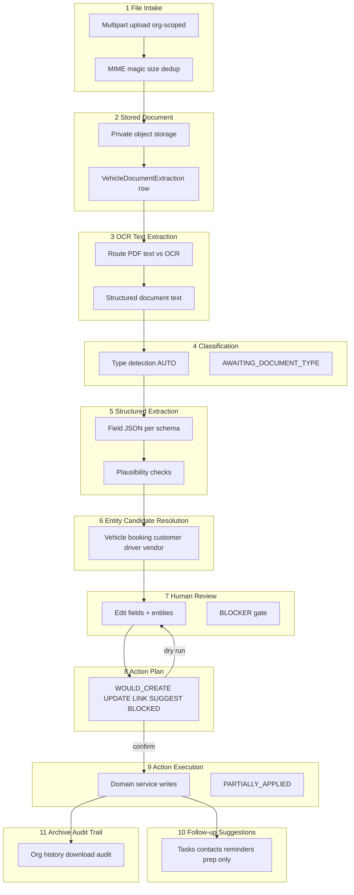

# Document Intake V2 — Verbindlicher Architekturvertrag

**Version:** 2.0 (Spezifikation)  
**Date:** 2026-07-17  
**Status:** **Normativ für Prompts 3–84** — keine produktive Umsetzung in diesem Dokument  
**Serie:** Prompt **2/84** (Document Intake V2)  
**Basis:**

- [`docs/audits/document-intake-v2-implementation-inventory.md`](../audits/document-intake-v2-implementation-inventory.md) (Prompt 1/84)
- [`docs/audits/document-intake-production-reality.md`](../audits/document-intake-production-reality.md) (Audit 1)
- [`docs/audits/document-intake-test-matrix.md`](../audits/document-intake-test-matrix.md) (Audit 2)

**Prinzip:** Eine kanonische Intake-Pipeline mit gemeinsamem **Action Plan** für Dry Run und Apply. Keine parallele Schatten-Apply-Logik. Keine erfundenen Pflichtwerte. Keine automatischen Kundenkontakte.

**Normativität:** Dieses Dokument **übersteuert** Legacy-Verhalten in `document-extraction` (V1), parallele Upload-Stubs (`FinesView.AIUploadFlow`, Invoice-Public-Upload) und implizite Frontend-Defaults, sofern Audits Widersprüche belegen. Bestehende Domänen (`tasks`, `fines`, `invoices`, `damages`, `vehicle_service_events`, Health-Evidence) werden **wiederverwendet**, nicht dupliziert.

---

## Inhaltsverzeichnis

| # | Abschnitt |
|---|-----------|
| 0 | Zweck, Geltungsbereich, Schutzregeln |
| 1 | Schichtenmodell (11 Ebenen) |
| 2 | Verbindliche Produktregeln |
| 3 | Status- und Stagemodell V2 |
| 4 | Action Plan — Vertrag |
| 5 | Entity Candidate Resolution |
| 6 | Human Review & UI-Gates |
| 7 | Downstream-Domänen (Wiederverwendung) |
| 8 | API- und Routing-Zielbild |
| 9 | Übergang V1 → V2 |
| 10 | Verbotene Muster |
| 11 | Abnahmekriterien |
| 12 | Referenzen |

---

## 0. Zweck, Geltungsbereich, Schutzregeln

### 0.1 Zweck

Document Intake V2 beschreibt, wie operative Dokumente (Werkstatt, Compliance, Rechnungen, Bußgelder, Schäden, allgemeine Schreiben) **sicher** in SynqDrive eingehen, maschinell vorstrukturiert werden, von Menschen bestätigt werden und **nachweisbar** in bestehende Fachdomänen überführt werden — oder bewusst nur archiviert bleiben.

### 0.2 Geltungsbereich

| Gilt | Gilt nicht |
|------|------------|
| AI Document Upload (`document-extraction` Modul, Zielzustand V2) | Customer Verification / Didit-Dokumente |
| Org-scoped Intake + Archive | Öffentliche `/uploads/` Pfade |
| Mistral OCR + strukturierte Extraktion | Ad-hoc Legacy `createLegacy` |
| Action Plan Dry Run + Execution | `FinesView` Stub-Upload (bis Konsolidierung) |
| Follow-up **Vorschläge** (kein Auto-Versand) | Automatische E-Mail/SMS/WhatsApp |

**Multi-tenant:** Alle Operationen sind `organizationId`-scoped. Keine hardcodierten `orgId`, `vehicleId`, `customerId`, `driverId`.

**Schreibpfad Downstream:** Ausschließlich über bestätigten Action Plan → bestehende Domain-Services (`FinesService`, `InvoicesService`, `DamagesService`, `BrakeLifecycleService`, …).

**Lesepfad Archive:** Kanonisch `GET /organizations/:orgId/document-extractions` (+ Detail/Download). Fahrzeugliste ist Filter, nicht Voraussetzung.

### 0.3 Schutzregel (verbindlich)

```
Datei-Intake + OCR/Klassifikation/Extraktion
  ≠ Action Execution (Downstream-Writes)

Dry Run und Apply teilen denselben Action-Plan-Builder.
Nur Action Execution darf Domain-Services mutieren.
```

**Customer / Driver / Booking / Vehicle** am Upload-Start sind **optional** und stets als **Kandidaten oder Vorschläge** modelliert — nie als stillschweigende Wahrheit vor OCR.

---

## 1. Schichtenmodell (11 Ebenen)



Jede Schicht hat **eindeutige Verantwortung**. Keine Schicht darf die Aufgabe einer späteren Schicht vorwegnehmen (insb. keine fachlichen Felder vor Schicht 3 abgeschlossen).

---

### Schicht 1 — File Intake

**Verantwortung:** Datei annehmen, technisch validieren, Intake-Datensatz anlegen.

| Aspekt | Vertrag |
|--------|---------|
| Scope | Upload startet **organisationsbezogen** (`organizationId` aus Auth/Route) |
| Entry API (Ziel) | `POST /organizations/:orgId/document-extractions/upload` |
| Übergang V1 | Bestehende `vehicles/:vehicleId/.../upload` Route bleibt kompatibel; `vehicleId` wird als **optionaler Kontextvorschlag** gemappt |
| Erlaubte MIME | `application/pdf`, `image/jpeg`, `image/png`, `image/webp`, `text/plain` |
| Validierung | Magic bytes, MIME-Konsistenz, Größenlimit, leere Datei, Dateiname-Sanitisierung |
| Dedup | `contentSha256` pro Organisation — Warnung oder Block bei identischem Hash (Implementierung Prompt 13+) |
| Vor OCR verboten | Dokumenttyp-Auswahl (außer `AUTO`), Fahrzeug-/Buchungs-/Kunden-/Fahrer-Felder, Review-Felder, Apply-Aktionen |
| UI | Nur Uploadzone + optionaler **Kontextvorschlag** (read-only Chip), kein Pflicht-Fahrzeug |

**Output:** Intake-Record `PENDING` → `QUEUED`, `objectKey` gesetzt oder `FAILED`.

---

### Schicht 2 — Stored Document

**Verantwortung:** Binärdatei privat persistieren; Metadaten am Extraction-Record.

| Aspekt | Vertrag |
|--------|---------|
| Storage | `DocumentStoragePort` — private keys `organizations/{orgId}/…/documents/…` |
| Tenant | `organizationId` Pflicht; `vehicleId` optional/nullable in V2-Schema |
| Metadaten | `mimeType`, `sizeBytes`, `sourceFileName`, `contentSha256`, `createdById` |
| Nicht öffentlich | Kein Static-Serving; Download nur authentifiziert |
| Löschen | `deleteFile` entfernt Binär; Record + Audit bleiben |

**Output:** Verarbeitbares `objectKey`, Record bereit für Queue.

---

### Schicht 3 — OCR / Text Extraction

**Verantwortung:** Maschinenlesbaren Volltext + Seitenstruktur erzeugen.

| Aspekt | Vertrag |
|--------|---------|
| Routing | PDF: lokale Textebene wenn Qualitätsgate bestanden; sonst Mistral OCR. Bilder: OCR. Plain text: direkt. |
| Provider | `ocrProvider`, `ocrModel`, `ocrPageCount`, `ocrCompletedAt` |
| Cache | OCR-Ergebnis in Pipeline-Cache (`plausibility._pipeline.contentCache`) — kein Re-OCR bei Retry |
| Fehler | `FAILED` mit `errorPhase=OCR` oder retry-fähig per BullMQ |
| Output | `DocumentStructuredContent` — `text`, `pages[]`, `pageBoundaryReliable`, `sourceMethod` |

**Keine** strukturierten Fachfelder in dieser Schicht — nur Text und Seitenmetadaten.

---

### Schicht 4 — Classification

**Verantwortung:** Dokumenttyp bestimmen oder Typauswahl anfordern.

| Aspekt | Vertrag |
|--------|---------|
| Request modes | `AUTO` (Standard) oder expliziter Typ (Override — Audit-Trail Pflicht) |
| Entscheidung | `evaluateClassificationDecision` — Schwellen aus Config |
| AUTO continue | Confidence + rationale → `effectiveDocumentType` gesetzt, Extraktion folgt |
| Unsicher | `AWAITING_DOCUMENT_TYPE` — **keine** Extraktion bis User `set_document_type` |
| UNKNOWN / OTHER | Erlaubt — führt zu Archiv-only oder Extraktion mit minimalem Schema |
| Audit | `detectedDocumentType`, `classificationConfidence`, rationale, sourcePages in `plausibility.classification` |

**Regel:** Expliziter Typ aus UI vor OCR ist **verboten**. Typ-Override nur nach mindestens Schicht 3 oder in `AWAITING_DOCUMENT_TYPE`.

---

### Schicht 5 — Structured Extraction

**Verantwortung:** Typ-spezifische Felder als JSON extrahieren.

| Aspekt | Vertrag |
|--------|---------|
| Schema | `DOCUMENT_FIELD_SCHEMAS` — Single Source of Truth |
| Engine | `DocumentAiExtractionService` (+ Chunking/Merge bei langen Dokumenten) |
| Kontext | Fahrzeug-VIN/Kennzeichen nur als **Hinweis** an Agent — nicht als gewählte Zuordnung |
| Output | `extractedData` JSON, `extractionProvider/Model`, Evidence/Conflicts in `plausibility` |
| Plausibilität (worker) | `DocumentExtractionPlausibilityService.runChecks` — **informativ** bis Review |
| Leere Extraktion | Erlaubt → Review mit manueller Eingabe; **keine** Default-Feldwerte erfinden |

**Pflichtfelddefinitionen** pro Typ werden zentral deklariert (Prompt 34+) und in Schicht 7/8 durchgesetzt.

---

### Schicht 6 — Entity Candidate Resolution

**Verantwortung:** Kandidaten für Fahrzeug, Buchung, Kunde, Fahrer, Anbieter **vorschlagen** — nicht bindend zuordnen.

| Entity | Signale | Output |
|--------|---------|--------|
| Vehicle | Kennzeichen, VIN, Fahrzeugname im Text; optional UI-Kontextvorschlag | `EntityCandidate[]` mit `confidence`, `matchReasons`, `conflicts` |
| Booking | Fahrzeug + Ereignisdatum/Zeitraum, Überlappung | Kandidatenliste |
| Customer | Name, Kundennummer, Adresse, Buchungskunde | Kandidatenliste |
| Driver | Buchungsfahrer, Führerschein-Hinweise, Anhörungsbogen | Kandidatenliste |
| Vendor | Firmenname, IBAN, USt-IdNr. (Rechnung) | Kandidatenliste |

**Vertrag:**

- Jeder Kandidat: `{ entityType, entityId?, displayReference, confidence, matchReasons[], conflicts[], confirmationRequired }`
- UI-Kontext (z. B. Fahrzeug-Detailseite) erzeugt höchstens einen **Suggested Context**-Kandidaten — gleichberechtigt mit OCR-Kandidaten, **niemals** Auto-Bindung
- Mehrere plausible Kandidaten → `confirmationRequired: true`
- Widerspruch OCR vs. manuelle Wahl → `conflicts` + ggf. `BLOCKER` (z. B. `PLATE_MISMATCH` bei FINE)

**Persistenz:** `entityCandidates` JSON am Extraction-Record; bestätigte Wahl in `confirmedEntityLinks` bei Confirm.

---

### Schicht 7 — Human Review

**Verantwortung:** Mensch prüft Typ, Felder, Kandidaten; bestätigt oder korrigiert.

| Aspekt | Vertrag |
|--------|---------|
| Status | `READY_FOR_REVIEW` oder `AWAITING_DOCUMENT_TYPE` |
| UI | Felder editierbar; Entity-Kandidaten wählbar; Action-Plan-Vorschau (Schicht 8) sichtbar |
| BLOCKER | `plausibility.overallStatus === 'BLOCKER'` → **Confirm API lehnt ab** (HTTP 400) |
| WARNING | Erlaubt Confirm mit expliziter Nutzerbestätigung (Audit-Eintrag) |
| Keine Defaults | UI zeigt leere Pflichtfelder — **kein** heutiges Datum, kein 19 %, kein `Parkverstoß` |
| Archive-only | Typ `OTHER` / unklare Schreiben: Review kann „Nur archivieren“ wählen |

**Output:** `confirmedData`, `confirmedEntityLinks`, optional geänderter `effectiveDocumentType`.

---

### Schicht 8 — Action Plan

**Verantwortung:** Deterministische Liste geplanter Aktionen aus bestätigten Daten — **identisch** für Dry Run und Apply.

| Aspekt | Vertrag |
|--------|---------|
| Builder | `DocumentExtractionApplyPlanService.buildPlan(input)` — pure function + Domain-Regeln |
| API Dry Run | `GET .../action-plan` oder `POST .../action-plan/dry-run` |
| API Apply | `POST .../confirm` ruft **denselben Builder** auf, dann Executor |
| Action shape | Siehe §4 |
| BLOCKED | Fehlende Pflichtfelder, BLOCKER-Plausibilität, fehlende Entity bei Pflicht — Action `status: BLOCKED` |
| ARCHIVE_ONLY | Explizite Aktion ohne Downstream-Create |

**Kein** separater Apply-Code-Pfad der andere Defaults nutzt als der Plan-Builder.

---

### Schicht 9 — Action Execution

**Verantwortung:** Geplante Aktionen idempotent ausführen; Status wahrheitsgetreu setzen.

| Aspekt | Vertrag |
|--------|---------|
| Executor | `DocumentExtractionApplyExecutor.execute(plan)` — ruft bestehende Domain-Services |
| Idempotenz | Jede Action trägt `idempotencyKey`; Wiederholung erzeugt **kein** zweites Downstream-Objekt |
| Erfolg | Alle **Pflicht**-Actions `COMPLETED` → `APPLIED` |
| Teilerfolg | Mindestens eine Pflicht-Action `FAILED`, andere `COMPLETED` → `PARTIALLY_APPLIED` + Fehlerdetail |
| Totalausfall | Keine Pflicht-Action erfolgreich → bleibt `CONFIRMED` mit `errorPhase=APPLY` (nicht `APPLIED`) |
| Transaktion | Pro Action atomar wo Domain es erlaubt; kein globales Distributed TX — Kompensation über Idempotenz + Recovery |

**APPLIED Bedeutung (V2):** Nachgewiesene erfolgreiche **Pflichtaktionen** laut Plan — nicht bloß „Apply-Methode returned“.

---

### Schicht 10 — Follow-up Suggestions

**Verantwortung:** Operative **Vorschläge** nach erfolgreicher oder partieller Apply — ohne Auto-Ausführung.

| Typ | Beispiele | Ausführung |
|-----|-----------|------------|
| FINE | Fahrer klären, Frist prüfen, Einspruchsfrist | `WOULD_SUGGEST` → Task-Vorschlag |
| INVOICE | Freigabe, Zahlungstermin | Task-Vorschlag |
| TÜV Mangel | Nacharbeit terminieren | Task-Vorschlag |
| DAMAGE | Versicherung kontaktieren | **Kontakt vorbereiten**, nicht senden |
| OTHER | Zuständigkeit klären | Archiv-Hinweis |

**Vertrag:**

- Follow-ups sind **keine** Actions in Schicht 9, außer explizit als `CREATE_TASK` mit User-Opt-in
- `PREPARE_CUSTOMER_CONTACT` erzeugt Entwurf/Checkliste — **kein** Resend/SMTP/WhatsApp-Call
- Bereits bei FINE: `TasksService.upsertByDedup` nur nach **expliziter** Produktregel im Plan, nicht heimlich

---

### Schicht 11 — Archive und Audit Trail

**Verantwortung:** Langzeit-Auffindbarkeit, Download, Nachvollziehbarkeit.

| Aspekt | Vertrag |
|--------|---------|
| Liste | `GET /organizations/:orgId/document-extractions` — paginiert, filterbar |
| Filter (Ziel) | status, documentType, vehicleId, customerId, bookingId, date range, fileName, invoiceNumber (via metadata) |
| Download | Org- und Fahrzeug-Route; `Cache-Control: no-store` |
| Audit DB | `createdById`, `confirmedById`, `appliedById`, `cancelledById`, `fileDeletedById`, timestamps |
| Audit JSON | `plausibility._pipeline.actionAudit[]` — confirm, apply, reassign, type change |
| DSGVO | Delete-File + Retention-Job (später) — Spec in Prompt 69+ |
| Sichtbarkeit | Kein `objectKey`/Roh-OCR in Public DTO |

Allgemeine Dokumente (`OTHER`, Behördenbrief ohne Fahrzeugbezug) **müssen** archivierbar sein **ohne** erfundene Service/FINE/Invoice-Records.

---

## 2. Verbindliche Produktregeln

Die folgenden Regeln sind **nicht verhandelbar** für V2-Implementierung und Tests.

| # | Regel |
|---|--------|
| R1 | Upload startet **organisationsbezogen** |
| R2 | Fahrzeug, Buchung, Kunde, Fahrer sind am Start **optional** |
| R3 | Kontext aus Detailseite (Fahrzeugakte, Buchung, Kunde) ist **nur ein Vorschlag** |
| R4 | Vor Abschluss von OCR/Text (Schicht 3): **keine** fachlichen Felder oder Zuordnungen auswählbar |
| R5 | `BLOCKER` verhindert **serverseitig** Confirm/Apply |
| R6 | **Kein** fachlicher Default darf fehlende Pflichtwerte erfinden |
| R7 | Apply Dry Run und echter Apply verwenden **denselben** Action Plan (Builder) |
| R8 | `APPLIED` = nachgewiesene erfolgreiche **Pflichtaktionen** |
| R9 | Jede Action ist **einzeln idempotent** (`idempotencyKey`) |
| R10 | Teilerfolg = `PARTIALLY_APPLIED` mit sichtbarem Action-Ergebnis |
| R11 | Kontakte werden **vorbereitet**, nie automatisch versendet |
| R12 | Allgemeine Dokumente dürfen **sicher archiviert** werden ohne erfundene Zieldomäne |
| R13 | Task-, Fine-, Invoice-, Damage-, Service-Domänen werden **wiederverwendet** |

---

## 3. Status- und Stagemodell V2

### 3.1 Status (Ziel)

| Status | Bedeutung |
|--------|-----------|
| `PENDING` | Record angelegt, Storage/Queue ausstehend |
| `QUEUED` | Job enqueued |
| `PROCESSING` | Worker aktiv (OCR → Extraktion) |
| `AWAITING_DOCUMENT_TYPE` | Typwahl erforderlich |
| `READY_FOR_REVIEW` | Extraktion fertig, Review offen |
| `CONFIRMED` | User bestätigt; Apply läuft oder hängt |
| `APPLIED` | Alle Pflicht-Actions erfolgreich |
| `PARTIALLY_APPLIED` | **Neu in V2** — Teilerfolg, sichtbar |
| `FAILED` | Nicht recoverable / retries erschöpft |
| `CANCELLED` | User abgebrochen |

`REJECTED` wird **deprecated** — nicht neu verwenden.

### 3.2 Stages

`UPLOAD` → `STORAGE` → `QUEUE` → `OCR` → `CLASSIFICATION` → `EXTRACTION` → `VALIDATION` → `REVIEW` → `APPLY`

Stage und Status sind orthogonal: z. B. `PARTIALLY_APPLIED` + `stage=APPLY`.

---

## 4. Action Plan — Vertrag

### 4.1 Action-Typen (Wiederverwendung Domänen)

| Action type | Target module | Domain operation |
|-------------|---------------|------------------|
| `CREATE_SERVICE_EVENT` | `vehicle_service_events` | `VehicleServiceEvent` + ggf. Vehicle-Datum-Felder |
| `CREATE_FINE` | `fines` | `FinesService.create` |
| `CREATE_INVOICE` | `org_invoices` | `InvoicesService.create` |
| `CREATE_DAMAGE` | `damages` | `DamagesService.create` |
| `ADD_BRAKE_EVIDENCE` | `brake_evidence` | `BrakeEvidenceService.recordMany` |
| `ADD_TIRE_MEASUREMENT` | `tire_measurements` | `TireLifecycleService.recordMeasurement` |
| `ADD_BATTERY_EVIDENCE` | `battery_evidence` | `BatteryEvidenceService.recordMany` |
| `LINK_VEHICLE` | extraction row | `vehicleId` setzen |
| `LINK_BOOKING` | extraction metadata | `bookingId` |
| `LINK_CUSTOMER` | extraction metadata | `customerId` |
| `LINK_DRIVER` | extraction metadata | `driverId` |
| `ARCHIVE_ONLY` | — | Kein Downstream-Create |
| `CREATE_TASK_SUGGESTION` | `org_tasks` | `TasksService.upsertByDedup` — nur wenn im Plan explizit |
| `PREPARE_CUSTOMER_CONTACT` | — | Entwurf nur |

### 4.2 Action-Status

| Status | Bedeutung |
|--------|-----------|
| `WOULD_CREATE` | Dry Run: würde Datensatz anlegen |
| `WOULD_UPDATE` | Dry Run: würde mutieren |
| `WOULD_LINK` | Dry Run: würde Verknüpfung setzen |
| `WOULD_SUGGEST` | Dry Run: Follow-up-Vorschlag |
| `BLOCKED` | Pflichtdaten/Plausibilität fehlen |
| `NOT_APPLICABLE` | Für diesen Dokumenttyp irrelevant |

Nach Execution zusätzlich: `COMPLETED`, `FAILED`, `SKIPPED`.

### 4.3 Action-Objekt (JSON)

```typescript
interface DocumentActionPlanItem {
  actionId: string;           // stable uuid per plan build
  type: string;               // CREATE_FINE, ...
  status: 'WOULD_CREATE' | 'WOULD_UPDATE' | 'WOULD_LINK' | 'WOULD_SUGGEST' | 'BLOCKED' | 'NOT_APPLICABLE' | 'COMPLETED' | 'FAILED' | 'SKIPPED';
  idempotencyKey: string;     // e.g. fine:create:extraction:{id}
  targetModule: string;
  requiredFields: string[];
  missingFields: string[];
  risk?: 'low' | 'medium' | 'high';
  confirmationRequired: boolean;
  resultEntityType?: string;
  resultEntityId?: string;    // nur nach Execution
  errorCode?: string;
}
```

### 4.4 Pflicht vs. optional

- **Pflicht-Actions** sind typabhängig deklariert (z. B. FINE → `CREATE_FINE` Pflicht; OTHER → nur `ARCHIVE_ONLY`)
- Fehlt Pflichtfeld → Action `BLOCKED`; Plan gesamt nicht apply-fähig
- **Kein** Fallback-Wert um `BLOCKED` zu umgehen

---

## 5. Entity Candidate Resolution

### 5.1 Service

`DocumentEntityResolverService` (neu, Prompt 21+) — liest:

- `extractedData` / OCR-Text-Features (ohne PII in Logs)
- `suggestedContext` vom Client (vehicleId, bookingId, …)
- Org-scoped Queries (vehicles, bookings, customers, drivers, vendors)

### 5.2 Konfliktregeln

| Code | Schwere | Verhalten |
|------|---------|-----------|
| `PLATE_MISMATCH` (FINE) | BLOCKER | Confirm verboten bis gelöst |
| `VIN_MISMATCH` | WARNING | Confirm mit Hinweis |
| `MULTIPLE_BOOKING_MATCH` | WARNING | User muss wählen |
| `NO_VEHICLE_CANDIDATE` | WARNING oder BLOCKER | Typabhängig |

### 5.3 V1-Abweichung

V1 bindet Upload an `vehicleId` in URL — V2 mappt das auf `suggestedContext.vehicleId` ohne Bindungsannahme.

---

## 6. Human Review & UI-Gates

| Gate | Server | Client |
|------|--------|--------|
| Vor OCR | Keine Typ-/Entity-Controls | Upload only |
| AWAITING_DOCUMENT_TYPE | `set_document_type` | Typ-Picker |
| READY_FOR_REVIEW | `action-plan` API | Felder + Kandidaten + Plan-Vorschau |
| BLOCKER | Confirm 400 | Confirm disabled |
| PARTIALLY_APPLIED | Detail zeigt Action-Ergebnisse | Retry einzelner Actions (später) |

**Einheitliche Flows:** `DocumentUploadView`, `VehicleDocumentUploadDrawer`, `OperatorAiUploadFlow` nutzen **dieselbe** State-Machine und APIs — keine divergierenden Defaults (`SERVICE` vs `AUTO`).

---

## 7. Downstream-Domänen (Wiederverwendung)

| Domäne | Service | V2-Änderung |
|--------|---------|-------------|
| Bußgeld | `FinesService` | `documentExtractionId` FK; keine Apply-Defaults |
| Rechnung | `InvoicesService` | Tax aus confirmed lines; `documentExtractionId` dedup |
| Schaden | `DamagesService` | Keine SCRATCH/MODERATE-Defaults |
| Service/TÜV/BOKraft/Öl | `vehicle_service_events` + Vehicle-Felder | `validUntil` respektieren |
| Bremsen | `BrakeLifecycleService` + Evidence | unverändert, Plan-Action |
| Reifen | `TireLifecycleService` | `linkedExtractionId` |
| Batterie | `BatteryEvidenceService` | V2 valueTypes |
| Tasks | `TasksService` | Explizite Plan-Actions only |
| Kontakt/E-Mail | Resend/WhatsApp | **Nur** `PREPARE_*` — separates explizites Send-Feature |

**Keine** neuen parallelen Tabellen für Fine/Invoice/Damage.

---

## 8. API- und Routing-Zielbild

### 8.1 Kanonische Endpoints (V2)

| Method | Path | Schicht |
|--------|------|---------|
| `POST` | `/organizations/:orgId/document-extractions/upload` | 1–2 |
| `GET` | `/organizations/:orgId/document-extractions` | 11 |
| `GET` | `/organizations/:orgId/document-extractions/:id` | 11 |
| `GET` | `/organizations/:orgId/document-extractions/:id/action-plan` | 8 |
| `POST` | `/organizations/:orgId/document-extractions/:id/confirm` | 7–9 |
| `PATCH` | `/organizations/:orgId/document-extractions/:id/entities` | 6–7 |
| `PATCH` | `/organizations/:orgId/document-extractions/:id/document-type` | 4 |
| `GET` | `.../download` | 11 |

Vehicle-scoped Routes bleiben als **Alias** (Übergangsphase).

### 8.2 Request: Upload (V2)

```typescript
interface UploadDocumentV2Request {
  file: multipart;
  requestedDocumentType: 'AUTO' | DocumentExtractionType; // default AUTO
  suggestedContext?: {
    vehicleId?: string;
    bookingId?: string;
    customerId?: string;
    driverId?: string;
    source?: 'vehicle_detail' | 'booking_detail' | 'customer_detail' | 'central_upload';
  };
}
```

`suggestedContext` wird gespeichert, **nicht** als Wahrheit angewendet.

---

## 9. Übergang V1 → V2

| V1 Ist | V2 Ziel | Prompt-Bereich |
|--------|---------|----------------|
| Vehicle-required upload URL | Org upload + optional vehicle | 5–12, 21–28 |
| `APPLIED` ohne Downstream | Integrity gate | 5–12 |
| Separater Apply-Code | Plan + Executor | 5–12 |
| Plausibilität nur teils blocking | BLOCKER auf Pflichtfelder erweitert | 29–36 |
| `FinesView` Stub | Konsolidierung oder Deprecation | 50 |
| Drawer `SERVICE` default | `AUTO` überall | 29 |
| Kein `PARTIALLY_APPLIED` | Schema + UI | 8 |

**Feature flag:** `DOCUMENT_INTAKE_V2` (default off bis Cutover, Prompt 74).

---

## 10. Verbotene Muster

| Verbot | Grund |
|--------|-------|
| `new Date()` als Fallback für Pflicht-Datum in Apply | R6, Audit P0 |
| `offenseType: 'Parkverstoß'` / `amountCents: 0` bei FINE | R6 |
| `damageType: SCRATCH`, `severity: MODERATE` ohne Evidence | R6 |
| Invoice `taxRate: 19` hardcoded | R6 |
| `APPLIED` setzen wenn Plan-Pflicht-Actions fehlen | R8 |
| Unterschiedliche Logik Dry Run vs Apply | R7 |
| Auto-E-Mail/SMS an Kunden aus Intake | R11 |
| Neues Fine/Invoice-Modul parallel | R13 |
| Fahrzeug aus erstem Fleet-Eintrag wählen | R2, R3 |
| Dokumenttyp-Pflicht vor OCR (außer AUTO) | R4 |
| Paralleler Public-Upload für AI-Dokumente | Security |

---

## 11. Abnahmekriterien (V2 Cutover)

| ID | Kriterium |
|----|-----------|
| AC1 | Upload ohne `vehicleId` möglich; Archiv org-scoped |
| AC2 | UI vor OCR zeigt keine Fachfelder |
| AC3 | `GET action-plan` und Confirm produzieren identische Plan-Items (bis auf Execution-Status) |
| AC4 | BLOCKER → Confirm 400; kein Downstream-Write |
| AC5 | FINE ohne `eventDate` → Plan `CREATE_FINE` = `BLOCKED`; kein Fine-Record |
| AC6 | Erfolgreicher Apply → `APPLIED` + `resultEntityId` je Pflicht-Action |
| AC7 | Simulierter Teilerfolg → `PARTIALLY_APPLIED` |
| AC8 | Retry Confirm mit gleichem `idempotencyKey` → keine Duplikate |
| AC9 | OTHER-Dokument → `ARCHIVE_ONLY` ohne Service/FINE/Invoice-Create |
| AC10 | `PREPARE_CUSTOMER_CONTACT` erzeugt keinen SMTP/API-Call |
| AC11 | Audit Trail enthält confirm, apply, entity changes |
| AC12 | Testmatrix Audit 2 T17/T29/T38 bestehen unter V2-Harness |

---

## 12. Referenzen

| Dokument | Inhalt |
|----------|--------|
| [document-intake-v2-implementation-inventory.md](../audits/document-intake-v2-implementation-inventory.md) | Ist-Inventur Prompt 1 |
| [document-intake-production-reality.md](../audits/document-intake-production-reality.md) | Produktions-Audit |
| [document-intake-test-matrix.md](../audits/document-intake-test-matrix.md) | Dry-Run-Matrix |
| [DOCUMENT_EXTRACTION_LIFECYCLE_2026-07-10.md](../architecture/DOCUMENT_EXTRACTION_LIFECYCLE_2026-07-10.md) | V1 Lifecycle API |
| [DOCUMENT_FINE_EXTRACTION_2026-07-16.md](../architecture/DOCUMENT_FINE_EXTRACTION_2026-07-16.md) | FINE schema V4.9.507 |
| [DOCUMENT_CLASSIFICATION_2026-07-10.md](../architecture/DOCUMENT_CLASSIFICATION_2026-07-10.md) | Klassifikation V1 |
| [DOCUMENT_OCR_ROUTING_2026-07-10.md](../architecture/DOCUMENT_OCR_ROUTING_2026-07-10.md) | OCR Routing V1 |

**Nächste Prompts:**

- **Prompt 3/84:** Prisma/Schema-Design (`PARTIALLY_APPLIED`, `contentSha256`, `entityCandidates`, `actionPlan` snapshot)
- **Prompt 4/84:** Testplan + Golden Fixtures
- **Prompt 5/84:** `DocumentExtractionApplyPlanService` + Dry-Run API

---

*Ende des verbindlichen Architekturvertrags Document Intake V2.*
