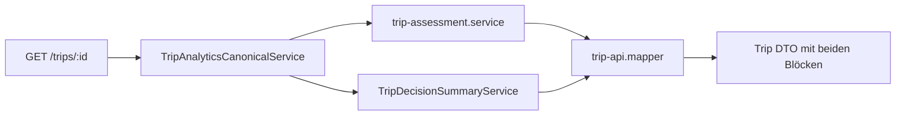
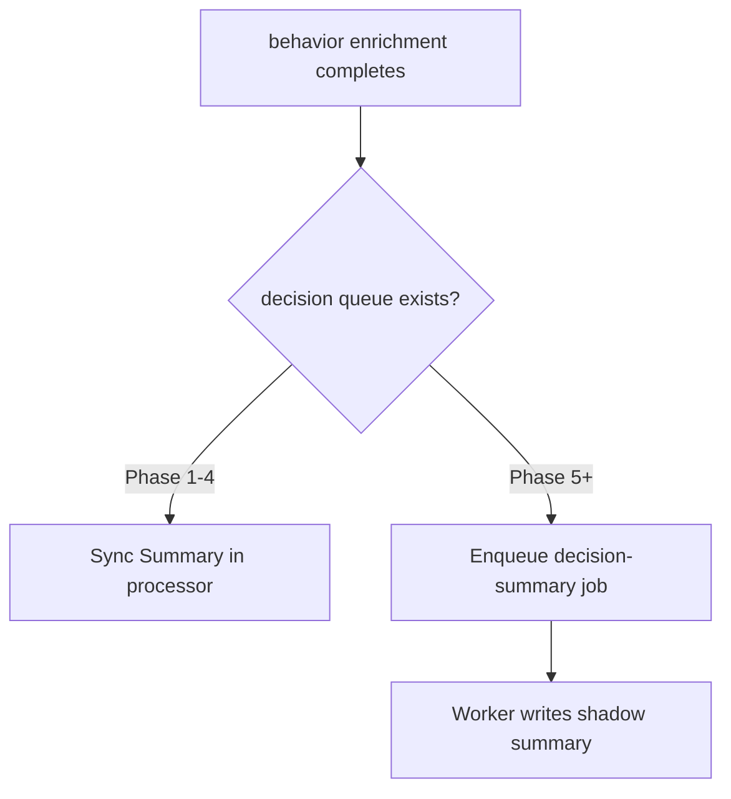
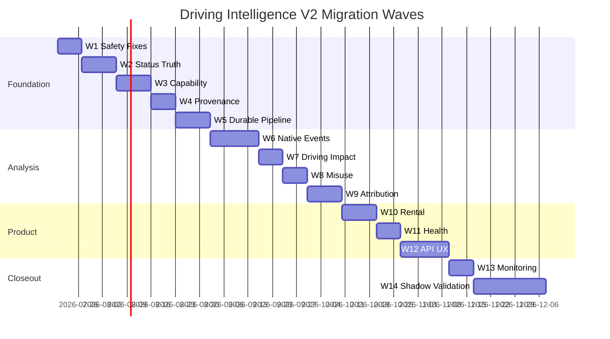

# Driving Intelligence V2 — Migrations- und Rolloutplan

**Version:** 1.0 (Spezifikation)  
**Date:** 2026-07-16  
**Status:** **Normativ für zukünftige Implementierung** — keine produktive Migration in diesem Prompt  
**Repository-Git-Commit (Erstellung):** `80e8b198`  
**Basis:**

- [`driving-intelligence-v2.md`](./driving-intelligence-v2.md) (Architekturvertrag Prompt 2/76)
- [`driving-intelligence-v2-rollout-flags.md`](./driving-intelligence-v2-rollout-flags.md) (Flag-Vertrag Prompt 3/76)
- [`../audits/driving-intelligence-v2-implementation-inventory.md`](../audits/driving-intelligence-v2-implementation-inventory.md) (Ist-Inventur Prompt 1/76)

**Schutzregel (verbindlich):** Die **Live-Trip-Erkennung** (`TripDecisionEngine`, FSM, Detectors, Policy, `dimo.trip-tracking`) ist **ausdrücklich außerhalb** des Migrationsumfangs. Keine DDL-, Queue-, Flag- oder Code-Änderung darf Trip-Start, Trip-Ende, Grace Periods oder Finalisierung beeinflussen.

---

## Inhaltsverzeichnis

| # | Abschnitt |
|---|-----------|
| 0 | Zweck und Migrationsprinzipien |
| 1 | Additive Schemaänderungen |
| 2 | Rückwärtskompatibilität |
| 3 | Dual Read und Shadow Write |
| 4 | Status-Reconciliation |
| 5 | Modellversionierung |
| 6 | Queue-Migration |
| 7 | Legacy-Score-Deprecation |
| 8 | Bestandsdaten-Diagnose |
| 9 | Dry-Run-Remediation |
| 10 | Shadow-Zeitraum |
| 11 | API-/UI-Umstellung |
| 12 | Health-Verbrauch |
| 13 | Manuelle Entscheidungsfreigabe |
| 14 | Rollback ohne Verlust qualifizierter Evidence |
| 15 | Phasenplan (14 Migrationswellen) |
| 16 | Abnahmekriterien (Prompt 4) |

---

## 0. Zweck und Migrationsprinzipien

### 0.1 Zweck

Dieser Plan beschreibt **wie** SynqDrive von der bestehenden Post-Trip-Pipeline (monolithisches `tripAssessment`, desynchrone Statusfelder, Legacy-Scores) zu Driving Intelligence V2 migriert — **ohne** Big-Bang, **ohne** Trip-Detection-Risiko, **ohne** Verlust belastbarer Evidence.

### 0.2 Leitprinzipien

| Prinzip | Bedeutung |
|---------|-----------|
| **Additive first** | Neue Tabellen/Spalten; Legacy-Felder bleiben lesbar bis Deprecation-Phase |
| **Dual Read** | API liefert Legacy + V2 parallel während Übergang |
| **Shadow Write** | V2 persistiert intern bevor User-facing Publication |
| **Evidence never delete** | Rollback deaktiviert Pfade, löscht keine `driving_events`, `misuse_cases`, `trip_driving_impacts` |
| **Trip detection invariant** | FSM-Metriken müssen während Migration flach bleiben |
| **Org-scoped rollout** | Canary-Org vor Fleet |

### 0.3 Ist-Probleme (Production Audit, Ausgangslage)

| ID | Problem | Migrationsziel |
|----|---------|----------------|
| P0-1 | 84 % `trip_analysis_status=NULL` | Backfill + Reconciliation |
| P0-2 | Impact-Row vs. `driving_impact_status=PENDING` | Status Truth Phase |
| P0-3 | `PRUEFHINWEIS` / „Fahrbewertung“ UI | API/UX Phase |
| P0-4 | Customer attribution 5,4 % | Attribution Phase |
| P0-5 | Rental analysis 0 rows | Rental Phase |
| P0-6 | Brake health empty trotz Impact | Health Phase |

---

## 1. Additive Schemaänderungen

Alle Änderungen sind **additiv** und **nullable/defaulted**. Keine DROP-Spalte in V2 Phase 1–10.

### 1.1 Neue Tabellen (geplant)

| Tabelle | Zweck | Phase |
|---------|-------|-------|
| `trip_decision_summaries` | Materialisiertes `TripDecisionSummary` pro Trip + Provenance | Provenance |
| `trip_decision_summary_supersedes` | Supersede-Audit (fingerprint chain) | Provenance |
| `vehicle_analysis_capability_profiles` | Capability-first pro `tokenId`/Fahrzeug | Capability |
| `driving_decision_audits` | Manuelle Kunden-/Mietentscheidungen | Manual Decision |
| `driving_migration_runs` | Dry-Run / Remediation Job Audit | Diagnose |

### 1.2 `trip_decision_summaries` (Kern)

```prisma
model TripDecisionSummary {
  id                String   @id @default(uuid())
  organizationId    String   @map("organization_id")
  vehicleId         String   @map("vehicle_id")
  tripId            String   @unique @map("trip_id")

  modelVersion      String   @map("model_version")
  modelFamily       String   @map("model_family")  // DECISION_SUMMARY
  inputFingerprint  String   @map("input_fingerprint")

  dataBasis         String   @map("data_basis")
  vehicleLoadLevel  String?  @map("vehicle_load_level")
  driverConductLevel String? @map("driver_conduct_level")
  misuseEvidenceLevel String @map("misuse_evidence_level")
  attributionLevel  String   @map("attribution_level")
  recommendationLevel String @map("recommendation_level")

  payloadJson       Json     @map("payload_json")   // vollständiges DTO
  reasonsJson       Json?    @map("reasons_json")
  stagesJson        Json?    @map("stages_json")
  evidenceStrength  String?  @map("evidence_strength")

  isShadow          Boolean  @default(true) @map("is_shadow")
  publishedAt       DateTime? @map("published_at")
  supersededAt      DateTime? @map("superseded_at")
  supersededById    String?  @map("superseded_by_id")

  computedAt        DateTime @map("computed_at")
  computedBy        String   @map("computed_by")     // PIPELINE | BACKFILL | MANUAL

  createdAt         DateTime @default(now()) @map("created_at")
  updatedAt         DateTime @updatedAt @map("updated_at")

  @@index([organizationId])
  @@index([vehicleId, computedAt])
  @@index([inputFingerprint])
  @@map("trip_decision_summaries")
}
```

**Regel:** `isShadow=true` bis `drivingDecisionSummaryEnabled` + Org-Freigabe.

### 1.3 Erweiterungen bestehender Tabellen (additiv)

| Tabelle | Neue Spalte(n) | Zweck | Nullable |
|---------|----------------|-------|----------|
| `vehicle_trips` | `analysis_provenance_json` | Modellversion, fingerprint auf Trip-Ebene | Ja |
| `trip_driving_impacts` | `input_fingerprint`, `evidence_strength`, `superseded_at` | Provenance + Health-Gate | Ja |
| `vehicle_driving_impact_current` | `evidence_strength`, `model_version`, `computed_fingerprint` | Health Eligibility | Ja |
| `misuse_cases` | `evidence_strength`, `evidence_kinds_json` | Misuse-Dimension D | Ja |
| `rental_driving_analyses` | `decision_summary_json`, `trips_scored`, `trips_total`, `model_version` | Rental V2 | Ja |
| `organizations` | `driving_intelligence_v2_config_json` | Org-Flag-Overrides | Ja |
| `vehicles` | `driving_intelligence_v2_canary_json` | Fahrzeug-Canary | Ja |

### 1.4 Explizit **keine** Schema-Änderung

| Bereich | Grund |
|---------|-------|
| `vehicle_trip_detection_states` | Trip-Detection out of scope |
| `vehicle_trips.trip_status` | Lifecycle owned by `TripDecisionEngine` |
| `vehicle_trips.start_time` / `end_time` | Keine Segment-Überschreibung |
| Detection metadata (`detectionProfile`, …) | Read-only für V2 |

### 1.5 Migrationsreihenfolge DDL

1. `driving_migration_runs` (Diagnose-Infrastruktur)
2. `vehicle_analysis_capability_profiles`
3. `trip_decision_summaries` + `trip_decision_summary_supersedes`
4. Additive Spalten auf `trip_driving_impacts`, `vehicle_driving_impact_current`
5. `rental_driving_analyses` Erweiterungen
6. `driving_decision_audits`
7. `organizations` / `vehicles` JSON-Spalten

Jede Migration: `ADD COLUMN IF NOT EXISTS` / neue Tabelle — idempotent (Pattern: `trip_analysis_status_guard`).

---

## 2. Rückwärtskompatibilität

### 2.1 API-Kompatibilitätsschicht

| Feld (Legacy) | V2-Äquivalent | Übergang |
|---------------|---------------|----------|
| `tripAssessment` | `tripDecisionSummary` | Beide parallel bis Flag + 1 Release |
| `tripAssessment.status=PRUEFHINWEIS` | `dataBasis` + `recommendation` | Legacy deprecated, Mapper liefert Auflösung |
| `drivingScore` (Trip) | `vehicleLoad.score` | Legacy nullable, `@deprecated` in OpenAPI |
| `drivingStressScore` | `vehicleLoad.score` | Beibehalten als Alias |
| `drivingStyleScore` (Customer) | `drivingStressScore` | Deprecated alias |
| `listBadge` / `tripOverallRating` | `listBadge.recommendation` + `dataBasis` | Opt-in via Flag |

### 2.2 Read-Pfad-Matrix

| Flag `drivingDecisionSummaryEnabled` | API-Verhalten |
|--------------------------------------|---------------|
| `false` | Legacy `tripAssessment` only (Ist) |
| `true` + Summary shadow | Legacy + `tripDecisionSummary` mit `isShadow: true` (intern) |
| `true` + Summary published | `tripDecisionSummary` primary; `tripAssessment` deprecated mirror |

### 2.3 Frontend-Kompatibilität

- Feature-Flag aus API `flags.drivingDecisionSummaryEnabled`
- Komponenten: `TripDecisionSummary` neben `TripEvidencePanel` (nicht sofort ersetzen)
- i18n: neue Keys `driving.*`; alte Keys bleiben bis Phase API/UX

### 2.4 Breaking Changes (erst nach Deprecation-Frist)

| Change | Earliest |
|--------|----------|
| Entfernen `tripAssessment` aus API | 2 Releases nach 100 % Org auf V2 |
| Entfernen `vehicle_trips.driving_score` Schreiben | Nach Backfill auf Impact |
| `PRUEFHINWEIS` enum-Wert deprecaten | Nach UI-Cutover |

---

## 3. Dual Read und Shadow Write

### 3.1 Dual Read (API)



**Regeln:**

- V2 liest **nie** aus Legacy und schreibt Legacy **nicht** zurück
- Legacy liest **nicht** aus `trip_decision_summaries` während Shadow
- Divergenz wird geloggt: `driving_v2_dual_read_divergence_total{dimension}`

### 3.2 Shadow Write (Persistenz)

| Artefakt | Shadow Write | Publication |
|----------|--------------|---------------|
| `trip_decision_summaries` | `isShadow=true`, `publishedAt=null` | Flag + Org ON → `publishedAt=now()` |
| `misuse_cases` | `informationalOnly=true` (Ist) | Unverändert bis Manual Decision |
| HF/Engine Events | `evidenceKind=ESTIMATED_PROXY` | Nie auto-publish |
| `rental_driving_analyses` | Payload mit `shadow: true` | Flag `rentalDrivingAnalysisV2Enabled` |

### 3.3 Shadow Write Trigger

| Trigger | Schreibt Shadow Summary |
|---------|-------------------------|
| Behavior enrichment completed | Ja (wenn Master ON) |
| Driving impact completed | Ja (Update Load-Dimension) |
| Misuse aggregation done | Ja (Update Misuse-Dimension) |
| Assignment changed | Recompute Shadow |
| Manual `POST …/recompute-decision` | Ja |

**Nicht:** Jeder API-GET (read-time only ohne Persist wenn Flag aus).

### 3.4 Divergenz-Toleranz (Shadow Validation)

| Dimension | Akzeptable Divergenz (Shadow) | Aktion |
|-----------|------------------------------|--------|
| `dataBasis` vs. `analysisAssessability` | 0 % nach Mapping fix | Block Publication |
| `vehicleLoad` vs. `drivingStressScore` | 0 % (gleiche Quelle) | — |
| `recommendation` vs. `tripAssessment.status` | Dokumentiert in Runbook | Operator Review |
| Conduct native vs. HF-only | HF darf nicht höher sein | Auto-cap in V2 |

---

## 4. Status-Reconciliation

### 4.1 Ziel-Sync-Regeln

| Bedingung | Aktion |
|-----------|--------|
| `trip_driving_impacts` row exists | `driving_impact_status=READY`, stage `drivingImpact=done` |
| `behavior_enrichment_status=COMPLETED` | stage `behavior=done`, `behavior_summary_status=READY` |
| `analysis_stages_json.misuse=pending` > 30 min | Recovery scheduler (bestehend) + V2 metric |
| `trip_analysis_status=NULL` + COMPLETED + enrichment done | Backfill → `PARTIAL` or `COMPLETED` |
| Impact READY but analysis NULL | Backfill analysis from stages |

### 4.2 Reconciliation-Jobs (geplant)

| Job | Typ | Phase |
|-----|-----|-------|
| `reconcile-trip-analysis-status.ts` | Dry-run + apply | Status Truth |
| `reconcile-driving-impact-status.ts` | Dry-run + apply | Status Truth |
| `reconcile-analysis-stages-from-ist.ts` | Infer stages from Ist | Status Truth |
| `reconcile-misuse-pending.ts` | Re-trigger aggregation | Misuse |

### 4.3 Idempotenz

- Jobs nutzen `driving_migration_runs` mit `runId`, `mode=DRY_RUN|APPLY`
- Apply nur wenn Dry-run 0 unexpected mutations oder explizites `--force`
- Per-trip: `inputFingerprint` unchanged → skip

### 4.4 Koordinator-Änderungen (Code, später)

`TripAnalysisCoordinatorService.markStage` muss **atomar** mit `DrivingImpactService` Ende aufgerufen werden — keine Impact-Row ohne Stage-Update.

---

## 5. Modellversionierung

### 5.1 Version-Familien

| Familie | Aktuell (Ist) | V2 Ziel | Speicherort |
|---------|---------------|---------|-------------|
| `IMPACT` | `v1.1.0` (`driving-impact.config.ts`) | `v2.0.0` | `trip_driving_impacts.model_version` |
| `DECISION_SUMMARY` | — | `v2.0.0` | `trip_decision_summaries.model_version` |
| `MISUSE_RULES` | implizit | `v2.0.0` | `misuse_cases.evidence_summary` |
| `ASSESSABILITY` | `v1` (JSON) | `v2.0.0` | `behavior_summary_json` |

### 5.2 Fingerprint-Inputs (normativ)

```
SHA256(
  tripId,
  modelVersion,
  behaviorEnrichmentStatus,
  sorted(driving_event_ids),
  sorted(trip_behavior_event_ids),
  trip_driving_impact.updated_at,
  misuse_case_fingerprints[],
  assignment_snapshot_hash,
  capability_profile_hash,
  device_quality_status
)
```

### 5.3 Recompute-Policy

| Event | Recompute |
|-------|-----------|
| Modellversion bump | Backfill-Job, supersede alte Summary |
| Assignment change | Single-trip recompute |
| Native events backfill | Affected trips batch |
| Flag promotion Shadow→Published | Kein Recompute — nur `publishedAt` setzen |

### 5.4 Supersede-Kette

- Alte `trip_decision_summaries` → `supersededAt`, `supersededById`
- API liefert nur nicht-superseded oder explizit `?includeSuperseded=true` (Admin)

---

## 6. Queue-Migration

### 6.1 Bestehende Queues (unverändert)

| Queue | Rolle | Migration |
|-------|-------|-----------|
| `dimo.trip-tracking` | **FSM — OUT OF SCOPE** | Keine Änderung |
| `trip.behavior.enrichment` | Behavior pipeline | Erweitert um V2 hooks post-processor |
| `trip.driving-impact.compute` | Impact compute | Status-sync hook |

**Keine neue Queue für Trip-Detection.** Keine Umleitung von `dimo.trip-tracking`.

### 6.2 Neue Queues (optional, geplant)

| Queue | Zweck | Phase |
|-------|-------|-------|
| `trip.decision-summary.compute` | Async Summary materialization | Durable Pipeline |
| `driving.decision-summary.backfill` | Batch backfill | Diagnose |
| `driving.event-context.retry` | Context recovery | Native Events |
| `driving.rental-analysis.recompute` | Booking-level aggregate | Rental |

### 6.3 Queue-Migrationsstrategie



**Phase 1–4:** Summary synchron im bestehenden Processor (weniger Moving Parts).  
**Phase 5+:** Dedizierte Queue wenn p95 Latency > 2 s.

### 6.4 Job-Idempotenz

| Queue | jobId Pattern |
|-------|---------------|
| `trip.decision-summary.compute` | `decision-${tripId}-${fingerprintPrefix}` |
| `driving.decision-summary.backfill` | `backfill-${orgId}-${fromDate}` |
| Bestehend `trip.behavior.enrichment` | `hf-enrich-${tripId}` (unverändert) |
| Bestehend `trip.driving-impact.compute` | `driving-impact-${tripId}` (unverändert) |

### 6.5 Retry / DLQ

- Bestehende BullMQ retry (3× exponential) beibehalten
- Neue Metrik: `driving_v2_queue_failed_total{queue}`
- Kein DLQ-Table — failed jobs in Redis; Ops-Runbook für replay

---

## 7. Legacy-Score-Deprecation

### 7.1 Deprecation-Matrix

| Legacy | Status | Ziel | Entfernen |
|--------|--------|------|-----------|
| `vehicle_trips.driving_score` | Schreiben bei Impact | Stop write; read fallback | Phase 12+ |
| `vehicle_trips.abuse_score` | HF diagnostic | Behalten (technisch) | — |
| `tripAssessment.status` | Read-time | Deprecated API field | Phase 12+ |
| `PRUEFHINWEIS` enum | UI/API | Entfernen aus User labels | Phase API/UX |
| `tripOverallRating` | Frontend derived | `listBadge` | Phase API/UX |
| i18n `trips.drivingScore` | Copy | `trips.vehicleLoad` | Phase API/UX |
| `customers.drivingStyleScore` | API alias | Remove alias | Phase Attribution |

### 7.2 Schreib-Stopp-Reihenfolge

1. Impact schreibt nur `trip_driving_impacts.driving_stress_score`
2. Mapper liest Impact → `vehicleLoad.score`
3. Stop `vehicle_trips.driving_score` update in enrichment
4. Backfill historische NULLs aus Impact wo vorhanden
5. API `@deprecated` annotation
6. Spalte optional read-only (nie DROP in V2)

### 7.3 Customer Aggregate

`DriverScoreService` → nur Trips mit `attribution.customerChargeable=true` und `dataBasis=BELASTBAR`.

---

## 8. Bestandsdaten-Diagnose

### 8.1 Diagnose-Script (geplant)

`backend/scripts/ops/diagnose-driving-intelligence-v2.ts`

**Output:** Markdown + JSON nach `driving_migration_runs`.

### 8.2 Diagnose-Queries (90-Tage-Fenster, pro Org)

| Check | SQL-Konzept | Schwelle (Audit) |
|-------|-------------|------------------|
| `analysis_status_null_rate` | `trip_analysis_status IS NULL` / COMPLETED | > 10 % → P0 |
| `impact_status_desync_rate` | Impact row + `driving_impact_status=PENDING` | > 0 % → P0 |
| `misuse_stuck_pending` | `analysis_stages_json.misuse=pending` + age | > 0 |
| `native_events_coverage` | Trips mit `driving_events` / LTE_R1 | Per vehicle |
| `attribution_explicit_rate` | `booking_link_source=EXPLICIT` | Fleet benchmark |
| `rental_analysis_gap` | COMPLETED bookings ohne `rental_driving_analyses` | > 0 wenn Flag an |
| `brake_health_gap` | Vehicles mit Impact, ohne `brake_health_current` | Monitor |
| `pruefhinweis_exposure` | Read-time assessment count (sample API) | UX metric |

### 8.3 Capability-Diagnose

Pro Fahrzeug (`tokenId`):

- `availableSignals` Snapshot (cached in `vehicle_analysis_capability_profiles`)
- Native event types 30d
- HF median cadence
- `NOT_ASSESSABLE` rate

### 8.4 Ausführung

```bash
# Dry-run only (read-only)
npx ts-node backend/scripts/ops/diagnose-driving-intelligence-v2.ts --org <orgId> --days 90

# Output: docs/audits/generated/driving-v2-diagnosis-<org>-<date>.json
```

**Vor jeder Migrationswelle:** Diagnose → Gates in §15.

---

## 9. Dry-Run-Remediation

### 9.1 Remediation-Scripts (geplant)

| Script | Mode | Phase |
|--------|------|-------|
| `reconcile-trip-analysis-status.ts` | `--dry-run` / `--apply` | Status Truth |
| `reconcile-driving-impact-status.ts` | `--dry-run` / `--apply` | Status Truth |
| `backfill-trip-decision-summary-shadow.ts` | `--dry-run` / `--apply` | Provenance |
| `backfill-capability-profiles.ts` | `--dry-run` / `--apply` | Capability |
| `recompute-rental-driving-analysis.ts` | `--dry-run` / `--apply` | Rental |
| `reconcile-customer-driving-aggregates.ts` | `--dry-run` / `--apply` | Attribution |

### 9.2 Dry-Run-Output-Contract

```typescript
interface MigrationRunResult {
  runId: string;
  mode: 'DRY_RUN' | 'APPLY';
  script: string;
  organizationId?: string;
  startedAt: string;
  completedAt: string;
  totals: { scanned: number; wouldChange: number; changed: number; skipped: number; errors: number };
  samples: Array<{ tripId: string; field: string; before: unknown; after: unknown }>;
  gates: { passed: boolean; failures: string[] };
}
```

### 9.3 Apply-Gates

Apply nur wenn:

1. Dry-run `errors=0`
2. `wouldChange` reviewed (Platform Admin)
3. DB backup completed (VPS deploy script pattern)
4. FSM metrics baseline ± 5 % über 1 h nach Apply (Trip-Detection)

### 9.4 Remediation-Reihenfolge

Status Truth → Capability backfill → Shadow Summary backfill → Rental recompute → Customer aggregates

**Nie:** Trip lifecycle fields, detection state, waypoint deletion.

---

## 10. Shadow-Zeitraum

### 10.1 Definition

**Shadow-Zeitraum** = Zeit von erstem `trip_decision_summaries` Shadow Write bis Org-Freigabe `drivingDecisionSummaryEnabled` (Publication).

### 10.2 Shadow-Phasen

| Sub-Phase | Dauer (Richtwert) | Kriterium |
|-----------|-------------------|-----------|
| **S0 — Internal only** | 2 Wochen | Team + Data Analyse; keine UI |
| **S1 — Admin UI** | 2 Wochen | Shadow Summary in Trip Detail (Feature flag, Platform Admin) |
| **S2 — Canary Org** | 4 Wochen | 1 Org, Divergenz-Review wöchentlich |
| **S3 — Publication** | — | `publishedAt` gesetzt, Legacy parallel |
| **S4 — Legacy off** | 2 Releases nach S3 | `tripAssessment` entfernen |

### 10.3 Shadow-Validierungs-Checkliste

- [ ] `driving_v2_dual_read_divergence_total` < Schwellwert pro Dimension
- [ ] Kein `PRUEFHINWEIS` in V2 `recommendation` mapping
- [ ] HF/Engine nie alleinige Kundenempfehlung
- [ ] FSM metrics unverändert
- [ ] Ops sign-off auf Dry-run Reports

### 10.4 Shadow-Zeitraum-Metriken

| Metrik | Zweck |
|--------|-------|
| `driving_v2_shadow_summary_total` | Shadow writes |
| `driving_v2_published_summary_total` | Publications |
| `driving_v2_shadow_duration_days` | Gauge per org |

---

## 11. API-/UI-Umstellung

### 11.1 API-Rollout

| Milestone | Endpoints | Verhalten |
|-----------|-----------|-----------|
| M1 | `GET /trips/:id` | + optional `tripDecisionSummary` (shadow) |
| M2 | `GET /trips` | + `listBadge { recommendation, dataBasis }` |
| M3 | `GET /customers/:id` | + `attributionCoveragePct`, dimensional aggregates |
| M4 | `GET /rental-driving-analyses` | + `decisionSummary` in payload |
| M5 | `POST /driving-decisions` | Manual audit CRUD |
| M6 | `POST /trips/:id/recompute-decision` | Ops |

### 11.2 UI-Rollout (Frontend)

| Milestone | Komponente | Flag |
|-----------|------------|------|
| U1 | `TripDecisionSummary.tsx` hinter Flag | `drivingDecisionSummaryEnabled` |
| U2 | Listen-Badge Fix | `trip-overall-status.ts` |
| U3 | `CustomerDrivingTab` dimensional | + `attributionV2Enabled` |
| U4 | `RentalPeriodDecisionSummary` | + `rentalDrivingAnalysisV2Enabled` |
| U5 | `ManualRentalApprovalDialog` | + `customerDrivingDecisionEnabled` |
| U6 | i18n `driving.*` keys | Alle Locales |

### 11.3 Copy-Migration

| Alt | Neu | Phase |
|-----|-----|-------|
| Prüfhinweis | Datenqualität eingeschränkt / … | U1 |
| Fahrbewertung | Fahrzeugbelastung | U1 |
| Auffällig (Liste) | Empfehlung + Datenbasis | U2 |

### 11.4 Mobile

Max. 2 Chips: `recommendation` + `dataBasis` — gleiche API, responsive components.

---

## 12. Health-Verbrauch

### 12.1 Migrationspfad Health

| Schritt | Tire Health | Brake Health |
|---------|-------------|--------------|
| H0 (Ist) | Impact consumed, works | 0 rows |
| H1 | + `evidenceStrength` badge (internal) | Recalc hook fix |
| H2 | Publication mit strength gate | First `brake_health_current` rows |
| H3 | **Kein** Rental block from driving | **Kein** block |
| H4 | Optional alert wenn strength LOW | Optional |

### 12.2 Eligibility-Migration

```typescript
// Ziel: BrakeHealthService / TireHealthService
if (!config.isHealthImpactV2Enabled()) {
  return legacyEligibility(); // Ist-Verhalten
}
const strength = impactCurrent.evidenceStrength;
if (strength === 'LOW' || strength === 'NONE') {
  return { drivingImpactAvailable: false, block: false }; // verbindlich: kein Block
}
```

### 12.3 Daten-Backfill Health

- Nach Impact Status Truth: `brakeHealthService.recalculate(vehicleId)` batch per org
- Dry-run zählt vehicles mit Impact but no brake row

### 12.4 Verboten

- Conduct/Misuse → Health
- Driving V2 Flag → Rental readiness block
- Health alert → auto customer block

---

## 13. Manuelle Entscheidungsfreigabe

### 13.1 Rollout-Stufen

| Stufe | `customerDrivingDecisionEnabled` | UI |
|-------|-----------------------------------|-----|
| MD0 | `false` | Keine Decision UI |
| MD1 | `false` | Read-only Audit API (internal) |
| MD2 | `true` (Platform Admin only) | Dialog in Staging |
| MD3 | `true` (1 Canary Org) | Production mit Runbook |
| MD4 | Fleet | Legal + Ops sign-off |

### 13.2 Voraussetzungen vor MD2

- `drivingDecisionSummaryEnabled=true`
- `attributionV2Enabled=true`
- Shadow Validation S2 abgeschlossen
- `driving_decision_audits` Tabelle deployed
- Runbook: keine Auto-Blacklist, Revoke-Flow

### 13.3 Audit-Pflichtfelder

`reason` (min 20 Zeichen), `decidedByUserId`, `dimensionsSnapshot`, `recommendationAtDecision`

### 13.4 Integration

- Customer Detail: „Letzte manuelle Entscheidung“
- **Kein** Einfluss auf Trip-Detection, Booking-FSM, oder Payment

---

## 14. Rollback ohne Verlust qualifizierter Evidence

### 14.1 Was bleibt bei Rollback

| Artefakt | Bei Flag OFF | Bei Code Revert |
|----------|--------------|-----------------|
| `driving_events` (native) | **Behalten** | **Behalten** |
| `trip_behavior_events` | **Behalten** | **Behalten** |
| `trip_driving_impacts` | **Behalten** | **Behalten** |
| `misuse_cases` | **Behalten** | **Behalten** |
| `trip_decision_summaries` (shadow) | **Behalten** (read-only) | **Behalten** |
| `driving_decision_audits` | **Behalten** | **Behalten** |
| `vehicle_trips` lifecycle | **Unberührt** | **Unberührt** |

### 14.2 Was wird deaktiviert (nicht gelöscht)

- V2 API fields (`tripDecisionSummary`) — omitted
- Shadow → Published pipeline — stop
- New remediation jobs — stop
- Customer Decision UI — hidden

### 14.3 Rollback-Stufen (aus Flag-Vertrag)

| Stufe | Aktion | Evidence |
|-------|--------|----------|
| R1 | Sub-Flag OFF | Vollständig erhalten |
| R2 | `drivingDecisionSummaryEnabled=false` | Summaries erhalten, nicht ausgeliefert |
| R3 | `drivingIntelligenceV2Enabled=false` | Alle V2 writes stop; Legacy reads |
| R4 | UI revert | Keine DB-Änderung |
| R5 | Code revert | DB unverändert; FSM code unangetastet |

### 14.4 Qualifizierte Evidence (nie löschen)

- `PROVIDER_CLASSIFIED` native events
- `MANUAL_VERIFIED` audits
- `trip_driving_impacts` mit `evidence_strength ≥ MEDIUM`
- `misuse_cases` mit `informationalOnly=false` (falls später manuell bestätigt)

**Nur löschen:** Shadow Summaries mit `isShadow=true` + `computedBy=BACKFILL` + älter als Retention (optional, > 180d) — **nicht** in Phase 1–10.

---

## 15. Phasenplan (14 Migrationswellen)

Jede Welle: Diagnose → Dry-run → Apply → Flag → Monitor → Gate.



### Welle 1 — Safety Fixes

| Item | Aktion |
|------|--------|
| Scope | Config service, Guards, Metrics only |
| Code | `DrivingIntelligenceV2Config`; Trip-Detection import guard test |
| Schema | `driving_migration_runs` |
| Flags | Keine ON |
| Gate | Unit test: FSM modules don't import V2 config |

### Welle 2 — Status Truth

| Item | Aktion |
|------|--------|
| Scripts | `reconcile-trip-analysis-status`, `reconcile-driving-impact-status` |
| Code | Coordinator sync after impact |
| Flags | `drivingIntelligenceV2Enabled`, `drivingImpactV2Enabled`, `assessabilityV2Enabled` |
| Gate | `impact_status_desync_rate=0`, `analysis_status_null_rate < 5%` |

### Welle 3 — Capability / Assessability

| Item | Aktion |
|------|--------|
| Schema | `vehicle_analysis_capability_profiles` |
| Scripts | `backfill-capability-profiles` |
| Code | Capability resolver per tokenId |
| Flags | `assessabilityV2Enabled` confirmed |
| Gate | 100 % fleet profile row; PARTIAL not SKIPPED on LTE_R1 native |

### Welle 4 — Provenance

| Item | Aktion |
|------|--------|
| Schema | `trip_decision_summaries`, provenance columns on impact |
| Code | Fingerprint + `TripDecisionSummaryService` (shadow) |
| Flags | Master ON; Summary OFF (shadow write only) |
| Gate | Shadow summaries for 30d trips sample |

### Welle 5 — Durable Pipeline

| Item | Aktion |
|------|--------|
| Queue | Optional `trip.decision-summary.compute` |
| Code | Orchestrator hooks, idempotent jobs |
| Flags | Shadow detektoren ON |
| Gate | p95 enrichment+summary < 5s or async queue |

### Welle 6 — Native Events

| Item | Aktion |
|------|--------|
| Code | Native primary conduct path |
| Flags | `nativeEventV2Enabled` Canary org |
| Gate | Conduct matches native capability audit |

### Welle 7 — Driving Impact

| Item | Aktion |
|------|--------|
| Code | Impact `v2.0.0`, evidence_strength |
| Schema | Impact provenance columns |
| Gate | Rolling current fingerprinted |

### Welle 8 — Misuse

| Item | Aktion |
|------|--------|
| Code | Reconciliation, evidence_kinds |
| Flags | `misuseReconciliationEnabled` |
| Gate | `misuse_stuck_pending=0` |

### Welle 9 — Attribution

| Item | Aktion |
|------|--------|
| Code | DriverScore gates, `attributionCoveragePct` |
| Scripts | `reconcile-customer-driving-aggregates` |
| Flags | `attributionV2Enabled` |
| Gate | Customer KPI only EXPLICIT trips |

### Welle 10 — Rental Analysis

| Item | Aktion |
|------|--------|
| Schema | Rental payload extensions |
| Code | Auto-materialize on booking COMPLETED |
| Flags | `rentalDrivingAnalysisV2Enabled` Canary |
| Gate | 1 row per completed booking in canary |

### Welle 11 — Health

| Item | Aktion |
|------|--------|
| Code | Brake recalc fix, evidence strength |
| Flags | `healthImpactV2Enabled` (no block) |
| Gate | Brake rows > 0 where impact exists; block_suppressed=100% |

### Welle 12 — API / UX

| Item | Aktion |
|------|--------|
| API | Publish `tripDecisionSummary`, `listBadge` |
| UI | TripDecisionSummary, i18n, Customer tab |
| Flags | `drivingDecisionSummaryEnabled` |
| Gate | UX AC 1–10 from architecture doc |

### Welle 13 — Monitoring

| Item | Aktion |
|------|--------|
| Ops | Grafana dashboard, alerts on desync/divergence |
| Runbooks | Status repair, rollback R1–R5 |
| Gate | SLOs green 7d |

### Welle 14 — Shadow Validation

| Item | Aktion |
|------|--------|
| Process | S0–S4 shadow period |
| Flags | Publication per org |
| Gate | Ops + Legal sign-off; MD3 optional start |
| Outcome | Fleet rollout or extend shadow |

---

## 16. Abnahmekriterien (Prompt 4)

| ID | Kriterium |
|----|-----------|
| MP01 | Alle 14 Planungsbereiche (§1–§14) dokumentiert |
| MP02 | Trip-Detection explizit out of scope in jeder Welle |
| MP03 | Schema nur additiv; keine DROP in Phase 1–10 |
| MP04 | Dual Read + Shadow Write definiert |
| MP05 | Status-Reconciliation mit Dry-run/Apply |
| MP06 | Modellversion + Fingerprint + Supersede |
| MP07 | Queue-Migration ohne `dimo.trip-tracking` Änderung |
| MP08 | Legacy-Score-Deprecation plan |
| MP09 | Diagnose-Script-Spezifikation |
| MP10 | Shadow-Zeitraum S0–S4 |
| MP11 | API/UI Meilensteine |
| MP12 | Health ohne Blockwirkung |
| MP13 | Manual Decision gestaffelt MD0–MD4 |
| MP14 | Rollback erhält qualifizierte Evidence |
| MP15 | 14 Migrationswellen in geforderter Reihenfolge |

---

## Referenzen

- [`driving-intelligence-v2.md`](./driving-intelligence-v2.md)
- [`driving-intelligence-v2-rollout-flags.md`](./driving-intelligence-v2-rollout-flags.md)
- [`../audits/driving-intelligence-v2-implementation-inventory.md`](../audits/driving-intelligence-v2-implementation-inventory.md)
- [`../audits/driving-analysis-production-reality.md`](../audits/driving-analysis-production-reality.md)
- [`task-domain-v2-migration-plan.md`](./task-domain-v2-migration-plan.md) (Migrationsmuster-Vorlage)
- `backend/src/modules/vehicle-intelligence/trips/TRIP_OWNERSHIP.ts`

---

*Implementierungsstatus: **Spezifikation only**. Nächster Schritt: Prisma-Migration + `DrivingIntelligenceV2Config` (Prompt 5+).*
