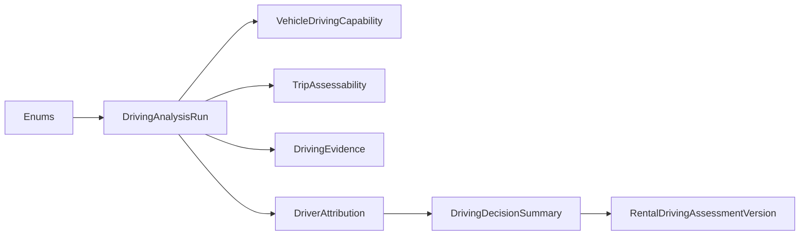

# Driving Intelligence V2 — Additiver Prisma-Plan (Fahrzeug-Capabilities)

**Version:** 1.0 (Spezifikation)  
**Date:** 2026-07-16  
**Status:** **Planung only** — **keine Schemaänderung, keine Migration, kein produktiver DDL-Lauf**  
**Prompt:** 11/76  
**Repository-Git-Commit (Erstellung):** `main` @ Planung  
**Basis:**

- [`driving-intelligence-v2.md`](./driving-intelligence-v2.md) (Architekturvertrag Prompt 2/76)
- [`driving-intelligence-v2-migration-rollout-plan.md`](./driving-intelligence-v2-migration-rollout-plan.md) (Migrationswellen Prompt 4/76)
- [`../audits/driving-intelligence-v2-implementation-inventory.md`](../audits/driving-intelligence-v2-implementation-inventory.md)

**Schutzregel (verbindlich):** Live-Trip-Erkennung (`TripDecisionEngine`, FSM, Detectors, Policy, `trip-tracking.processor`) bleibt **unverändert**. Dieser Plan betrifft ausschließlich **post-trip** Driving Intelligence V2.

---

## Inhaltsverzeichnis

| # | Abschnitt |
|---|-----------|
| 0 | Zweck, Scope, Namenskonvention |
| 1 | Ist-Zustand — relevante Modelle |
| 2 | Äquivalenzprüfung — keine Doppel-Einführung |
| 3 | Geplante Prisma-Enums |
| 4 | `VehicleDrivingCapability` |
| 5 | `TripAssessability` |
| 6 | `DrivingAnalysisRun` |
| 7 | `DrivingEvidence` |
| 8 | `DrivingDecisionSummary` |
| 9 | `DriverAttribution` |
| 10 | `RentalDrivingAssessmentVersion` |
| 11 | Migrationsreihenfolge & Abhängigkeiten |
| 12 | Tenant-Scope & FK-Regeln |
| 13 | Retention & Lifecycle |
| 14 | Rollback ohne Evidence-Verlust |
| 15 | Abnahmekriterien (Prompt 11) |

---

## 0. Zweck, Scope, Namenskonvention

### 0.1 Zweck

Dieses Dokument definiert den **exakten additiven** Prisma-/PostgreSQL-Plan für fahrzeugbezogene Driving-Capabilities und die materialisierten V2-Schichten 5–12 des Architekturvertrags:

| Ebene (Architektur) | Geplantes Prisma-Modell |
|---------------------|-------------------------|
| 5 Analysis Capability | `VehicleDrivingCapability` |
| 6 Assessability | `TripAssessability` |
| Provenance / Recompute | `DrivingAnalysisRun` |
| Evidenz-Normalisierung | `DrivingEvidence` |
| 12 Decision Recommendation | `DrivingDecisionSummary` |
| 10 Attribution | `DriverAttribution` |
| 11 Rental Analysis (versioniert) | `RentalDrivingAssessmentVersion` |

**Explizit ausgeschlossen in diesem Prompt:** DDL-Ausführung, Backfill-Skripte, Service-Implementierung, UI.

### 0.2 Leitprinzipien

| Prinzip | Bedeutung |
|---------|-----------|
| **Additive only** | Neue Tabellen + optionale JSON-Spiegel; keine `DROP COLUMN` in V2 Phase 1–10 |
| **Evidence never delete** | `DrivingEvidence`, `misuse_cases`, `driving_events` werden durch Rollback nicht gelöscht |
| **Capability-first** | Pro `vehicleId` / `tokenId`, kein Fleet-Default |
| **Shadow before publish** | `DrivingAnalysisMaturity.SHADOW` bis Org-Flag + Gate |
| **Legacy mirrors write-only** | `VehicleTrip.drivingScore`, `RentalDrivingAnalysis.drivingScore` bleiben Spiegel — keine neue Leselogik |

### 0.3 DB-Namenskonvention

| Prisma-Modell | PostgreSQL-Tabelle (`@@map`) |
|---------------|------------------------------|
| `VehicleDrivingCapability` | `vehicle_driving_capabilities` |
| `TripAssessability` | `trip_assessabilities` |
| `DrivingAnalysisRun` | `driving_analysis_runs` |
| `DrivingEvidence` | `driving_evidence` |
| `DrivingDecisionSummary` | `driving_decision_summaries` |
| `DriverAttribution` | `driver_attributions` |
| `RentalDrivingAssessmentVersion` | `rental_driving_assessment_versions` |

---

## 1. Ist-Zustand — relevante Modelle

### 1.1 `Vehicle` / `DimoVehicle`

| Feld (Ist) | Relevanz für V2 |
|------------|-----------------|
| `Vehicle.hardwareType` | Capability-Gate (LTE_R1 / SMART5 / UNKNOWN) |
| `Vehicle.dimoVehicleId` → `DimoVehicle.tokenId` | Capability-Probe pro Telematik-Identität |
| `DimoVehicle.rawJson` | Enthält intermittierend `availableSignals`, `dataSummary` — **nicht** als alleinige Wahrheit |

### 1.2 `VehicleTrip` (`vehicle_trips`)

**Bereits vorhanden (bleiben unverändert in Phase 1):**

| Feld | Ist-Typ | V2-Rolle |
|------|---------|----------|
| `behaviorSummaryJson` | `Json?` | Legacy-Quelle für Assessability bis Backfill |
| `tripAnalysisStatus`, `analysisStagesJson` | `String?` / `Json?` | Stage-Truth (P7–P9) |
| `drivingImpactStatus` | `String?` | Readiness-Gate |
| `assignmentStatus`, `assignedBookingId`, `bookingLinkSource`, `isPrivateTrip` | Enums / IDs | Attribution-Snapshot auf Trip |
| `drivingScore` | `Float?` | **Deprecated mirror** — Write-only |

### 1.3 `TripDrivingImpact` / `VehicleDrivingImpactCurrent`

Kanonische **Vehicle Load** (Ebene 7). `DrivingDecisionSummary.vehicleLoad` liest hieraus — nicht aus `VehicleTrip.drivingScore`.

### 1.4 `MisuseCase` / `MisuseCaseEvidence`

Kanonische **Misuse Evidence** (Ebene 9). `DrivingEvidence` verweist auf diese Rows — ersetzt sie nicht.

### 1.5 `RentalDrivingAnalysis` (`rental_driving_analyses`)

| Feld | Ist | V2 |
|------|-----|-----|
| `payload` | `Json` | Bleibt; `RentalDrivingAssessmentVersion.payloadJson` versioniert |
| `drivingScore` | `Float?` | Legacy mirror |
| Unique `bookingId` | 1:1 | **Konflikt** mit Versionierung → siehe §10 |

**Planungsentscheidung:** `rental_driving_analyses` bleibt als **„latest published“-Kompatibilitätssicht**; versionierte Wahrheit wandert nach `rental_driving_assessment_versions`. Kein DROP der Legacy-Tabelle in V2.

---

## 2. Äquivalenzprüfung — keine Doppel-Einführung

| Geplantes Modell | Bereits vorhanden? | Entscheidung |
|------------------|-------------------|--------------|
| `VehicleDrivingCapability` | Teilweise runtime (`getVehicleCapabilities`, `deriveVehicleCapabilityProfile`) | **Neu** materialisiert pro Fahrzeug |
| `TripAssessability` | In `behaviorSummaryJson.analysisAssessability` | **Neu** materialisiert pro Trip + Run |
| `DrivingAnalysisRun` | Teilweise `analysisStagesJson`, `drivingImpactComputedAt` | **Neu** als generischer Run-Envelope |
| `DrivingEvidence` | `MisuseCaseEvidence`, lose `driving_events` | **Neu** als übergreifender Evidence-Index (referenziert Ist-Rows) |
| `DrivingDecisionSummary` | Read-time `tripAssessment`, geplant als `trip_decision_summaries` in Migrationsplan | **Neu** unter Name `DrivingDecisionSummary` / `driving_decision_summaries` |
| `DriverAttribution` | `vehicle_trips` Assignment + `TripAttributionService` | **Neu** materialisierter Snapshot pro Trip/Run |
| `RentalDrivingAssessmentVersion` | `rental_driving_analyses` 1:1 | **Neu** versionierte Zeilen; Legacy-Tabelle bleibt |

**Keine erneute Einführung:** `TripDrivingImpact`, `MisuseCase`, `DrivingEvent`, `TripBehaviorEvent`.

---

## 3. Geplante Prisma-Enums

> **Migrationshinweis:** Jeder Enum in **eigener** Migration vor erster Spaltennutzung (PostgreSQL-Pattern wie `TaskStatus.WAITING`).

**Implementierungsstand (P12, 2026-07-16):** Migration `20260716190000_driving_intelligence_v2_enums` — alle unten genannten Enum-Typen sind in `schema.prisma` deklariert. `TripAssessabilityStatus` heißt im Schema **`DrivingAssessabilityStatus`**; `DriverAttributionType` → **`DrivingAttributionType`**; `DriverAttributionConfidence` → **`DrivingAttributionConfidence`**. Zusätzlich: `VehicleLoadLevel`, `DriverConductLevel`, `MisuseEvidenceLevel`. Noch **keine** Modelle/Spalten.

### 3.1 `DrivingCapabilityStatus`

Fahrzeugbezogener Gate-Status einer einzelnen Capability-Dimension.

```prisma
enum DrivingCapabilityStatus {
  UNKNOWN          // noch nicht ermittelt
  SUPPORTED        // belastbar nutzbar
  LIMITED          // nutzbar mit Einschränkung / Shadow
  UNSUPPORTED      // für dieses Fahrzeug nicht verfügbar
  DEGRADED         // Gerät/Provider liefert unzuverlässige Signale
}
```

| Aspekt | Plan |
|--------|------|
| DB-Typ | `CREATE TYPE "DrivingCapabilityStatus" AS ENUM (...)` |
| Tenant-Scope | Indirekt über `vehicleId` → `organizationId` |
| Legacy-Mapping | Runtime-Boolean `nativeEventCapable` → `SUPPORTED`/`UNSUPPORTED` |
| Rollback | Enum bleibt; Writer deaktiviert via Flag |

---

### 3.2 `DrivingAnalysisDimension`

Welche Bewertungsdimension ein Run / eine Evidence-Zeile betrifft.

```prisma
enum DrivingAnalysisDimension {
  CAPABILITY
  ASSESSABILITY
  VEHICLE_LOAD
  DRIVER_CONDUCT
  MISUSE_EVIDENCE
  ATTRIBUTION
  DECISION_SUMMARY
  RENTAL_AGGREGATE
  HEALTH_IMPACT   // read-only consumer marker, keine Personenbewertung
}
```

| Aspekt | Plan |
|--------|------|
| Verwendung | `DrivingAnalysisRun.primaryDimension`, `DrivingEvidence.dimension` |
| Legacy-Mapping | `analysisStagesJson` Keys → Dimension (behavior→CONDUCT, drivingImpact→VEHICLE_LOAD, …) |
| Rollback | Nicht persistiert in Legacy |

---

### 3.3 `DrivingAssessabilityStatus` (Schema-Name; Plan: TripAssessabilityStatus)

Ob / wie weit eine Trip-Analyse belastbar ist (Ebene 6).

```prisma
enum DrivingAssessabilityStatus {
  FULL
  LIMITED
  NOT_ASSESSABLE
}
```

| Aspekt | Plan |
|--------|------|
| Legacy-Mapping | `behaviorSummaryJson.analysisAssessability` (String) → Enum |
| Verboten | Mapping zu Conduct-Level |
| Rollback | Leser fallen auf `deriveAnalysisAssessability()` aus JSON |

---

### 3.4 `DrivingEvidenceSourceType`

Herkunft einer Evidenzzeile (aligniert mit Architektur §3 + `MisuseEvidenceSourceType`).

```prisma
enum DrivingEvidenceSourceType {
  PROVIDER_TELEMETRY_EVENT    // driving_events TELEMETRY_EVENTS
  HF_BEHAVIOR_EVENT           // trip_behavior_events
  MISUSE_CASE                 // misuse_cases
  MISUSE_CASE_EVIDENCE        // misuse_case_evidence
  EVENT_CONTEXT_ASSESSMENT    // driving_events.metadataJson.contextAssessment
  VEHICLE_TRIP_COUNTER        // canonical counters on vehicle_trips
  MANUAL_VERIFIED             // Werkstatt / Schaden / Operator
  DERIVED_PATTERN             // SynqDrive-Detektor-Aggregat
  RENTAL_PERIOD_AGGREGATE     // nur Rental-Scope
}
```

| Aspekt | Plan |
|--------|------|
| Legacy-Mapping | `MisuseEvidenceSourceType` → Subset-Mapping (1:1 wo möglich) |
| Retention | **Unbegrenzt** (Evidence never delete) |
| Rollback | Tabelle ignorieren; Leser auf `misuse_case_evidence` |

---

### 3.5 `DrivingEvidenceStrength`

Publication-/Conduct-Tauglichkeit (Architektur Evidenzarten aggregiert).

```prisma
enum DrivingEvidenceStrength {
  NONE
  LOW            // ESTIMATED_PROXY / sparse
  MEDIUM         // RECONSTRUCTED / MIXED
  HIGH           // MEASURED / PROVIDER_CLASSIFIED
  VERIFIED       // MANUAL_VERIFIED
}
```

| Aspekt | Plan |
|--------|------|
| Legacy-Mapping | `tripAssessment.signals.*` confidence → Strength |
| Health-Gate | Tire/Brake nur ≥ `MEDIUM` für Publication (App-Logik) |
| Rollback | Feld nullable; fehlend = Legacy-Heuristik |

---

### 3.6 `DrivingAnalysisMaturity`

Shadow-/Publish-Zyklus eines Runs oder Summary.

```prisma
enum DrivingAnalysisMaturity {
  SHADOW         // intern persistiert, nicht user-facing
  CANDIDATE      // bereit zur Freigabe
  PUBLISHED      // aktiv in APIs/UI
  SUPERSEDED     // durch neuere Version ersetzt
  FAILED         // technischer Fehlschlag
}
```

| Aspekt | Plan |
|--------|------|
| Legacy-Mapping | `isShadow` (Migrationsplan) → `SHADOW`/`PUBLISHED` |
| Default neue Rows | `SHADOW` |
| Rollback | Flag `drivingDecisionSummaryEnabled=false` → nur SHADOW-Writes stoppen |

---

### 3.7 `DrivingAttributionType` (Schema-Name; Plan: DriverAttributionType)

Zuordnungsebene (Ebene 10 / UX Dimension E).

```prisma
enum DrivingAttributionType {
  CONFIRMED_DRIVER          // EXPLICIT assignment, scoreEligible
  BOOKING_CUSTOMER          // ASSIGNED_BOOKING_CUSTOMER
  ASSIGNED_DRIVER           // ASSIGNED_DRIVER (non-customer)
  VEHICLE_ONLY              // bekanntes Fahrzeug, keine Person
  PRIVATE_UNASSIGNED        // Privatfahrt
  UNKNOWN                   // UNKNOWN_ASSIGNMENT / widersprüchlich
}
```

| Aspekt | Plan |
|--------|------|
| Legacy-Mapping | `TripAssignmentStatus` + `bookingLinkSource` → Type (App-Logik) |
| Gate | `CONFIRMED_DRIVER` / `BOOKING_CUSTOMER` nur bei `bookingLinkSource=EXPLICIT` für Kunden-KPI |

---

### 3.8 `DrivingAttributionConfidence` (Schema-Name; Plan: DriverAttributionConfidence)

```prisma
enum DrivingAttributionConfidence {
  HIGH
  MEDIUM
  LOW
}
```

| Aspekt | Plan |
|--------|------|
| Legacy-Mapping | `TripAttribution.confidence` (bestehend) |
| Regel | `TIME_WINDOW` → max `MEDIUM` |

---

### 3.9 `DrivingDecisionRecommendation`

Operative Empfehlung (Ebene 12 — **keine automatische Sanktion**).

```prisma
enum DrivingDecisionRecommendation {
  KEINE_MASSNAHME
  BEOBACHTEN
  KUNDENGESPRAECH
  MANUELLE_MIETFREIGABE
  FAHRZEUGPRUEFUNG
  TECHNISCHE_DATENPRUEFUNG
}
```

| Aspekt | Plan |
|--------|------|
| Legacy-Mapping | `tripAssessment.status` / `recommendedAction` → Recommendation (deterministisch) |
| Verboten | Auto-Blacklist / Auto-Rental-Block |

---

### 3.10 `VehicleLoadLevel` (Dimension B)

```prisma
enum VehicleLoadLevel {
  SCHONEND
  NORMAL
  ERHOHT
  STARK_ERHOHT
}
```

| Aspekt | Plan |
|--------|------|
| Legacy-Mapping | `classifyStressLevel` / `drivingStressScore` bands |
| Implementiert | P12 migration |

---

### 3.11 `DriverConductLevel` (Dimension C)

```prisma
enum DriverConductLevel {
  UNAUFFAELLIG
  DYNAMISCH
  AUFFAELLIG
  STARK_AUFFAELLIG
  NICHT_BEWERTBAR
}
```

| Aspekt | Plan |
|--------|------|
| Legacy-Mapping | `TripAssessmentStatus` (subset; `PRUEFHINWEIS` → app-layer reasonCategory) |
| Implementiert | P12 migration |

---

### 3.12 `MisuseEvidenceLevel` (Dimension D)

```prisma
enum MisuseEvidenceLevel {
  KEINE
  EINZELNER_HINWEIS
  MEHRERE_BELASTBARE_HINWEISE
  STARKER_VERDACHT
  SCHADENSPRUEFUNG
}
```

| Aspekt | Plan |
|--------|------|
| Legacy-Mapping | `misuse_cases` count + severity aggregation |
| Implementiert | P12 migration |

---

## 4. `VehicleDrivingCapability`

**Zweck:** Materialisiertes Capability-Profil pro Fahrzeug und Analyse-Dimension (Ebene 5). Ersetzt Fleet-Defaults.

### 4.1 Prisma-Skizze

```prisma
model VehicleDrivingCapability {
  id               String                    @id @default(uuid())
  organizationId   String                    @map("organization_id")
  vehicleId        String                    @map("vehicle_id")
  dimoTokenId      Int?                      @map("dimo_token_id")

  dimension        DrivingAnalysisDimension  // CAPABILITY oder spezifische Sub-Capability in capabilityKey
  capabilityKey    String                    @map("capability_key")
  // Beispiele: NATIVE_BEHAVIOR_EVENTS | HF_CADENCE_SUFFICIENT | ICE_EVENT_CONTEXT | ROUTE_ENRICHMENT | ENGINE_SIGNALS

  status           DrivingCapabilityStatus
  statusReason     String?                   @map("status_reason")
  evidenceStrength DrivingEvidenceStrength?  @map("evidence_strength")

  observedAt       DateTime                  @map("observed_at")
  validFrom        DateTime                  @map("valid_from")
  validUntil       DateTime?                 @map("valid_until")

  sampleWindowDays Int                       @default(30) @map("sample_window_days")
  sampleTripCount  Int?                      @map("sample_trip_count")
  metricsJson      Json?                     @map("metrics_json")
  // z.B. nativeEventCount30d, hfMedianCadenceSec, availableSignals snapshot

  modelVersion     String                    @map("model_version")
  inputFingerprint String?                   @map("input_fingerprint")
  sourceRunId      String?                   @map("source_run_id")

  createdAt        DateTime                  @default(now()) @map("created_at")
  updatedAt        DateTime                  @updatedAt @map("updated_at")

  organization Organization @relation(...)
  vehicle      Vehicle      @relation(...)
  sourceRun    DrivingAnalysisRun? @relation(...)

  @@unique([vehicleId, capabilityKey, validFrom])
  @@index([organizationId])
  @@index([vehicleId, status])
  @@index([dimoTokenId])
  @@index([capabilityKey, status])
  @@map("vehicle_driving_capabilities")
}
```

### 4.2 Feld-für-Feld

| Feld | Typ | Nullable | Tenant-Scope | Index | Unique | Retention | Legacy-Mapping | Rollback |
|------|-----|----------|--------------|-------|--------|-----------|----------------|----------|
| `id` | `String` UUID | NOT NULL | — | PK | PK | Unbegrenzt | — | — |
| `organizationId` | `String` | NOT NULL | **Ja** — FK `organizations` | `@@index` | — | Mit Org | `Vehicle.organizationId` | CASCADE delete |
| `vehicleId` | `String` | NOT NULL | **Ja** — FK `vehicles` | composite | `@@unique[vehicleId,capabilityKey,validFrom]` | Unbegrenzt Historie | `Vehicle.id` | CASCADE |
| `dimoTokenId` | `Int?` | NULL | Nein (Lookup) | `@@index` | — | Rolling | `DimoVehicle.tokenId` | NULL ok |
| `dimension` | `DrivingAnalysisDimension` | NOT NULL | — | — | — | — | Runtime profile | — |
| `capabilityKey` | `String` | NOT NULL | — | composite | unique Teil | — | `getVehicleCapabilities()` keys | — |
| `status` | `DrivingCapabilityStatus` | NOT NULL | — | composite | — | — | Boolean flags → Status | — |
| `statusReason` | `String?` | NULL | — | — | — | — | `behaviorEnrichmentError` | — |
| `evidenceStrength` | `DrivingEvidenceStrength?` | NULL | — | — | — | — | — | NULL |
| `observedAt` | `DateTime` | NOT NULL | — | — | — | — | Probe timestamp | — |
| `validFrom` | `DateTime` | NOT NULL | — | — | unique Teil | Historie | — | — |
| `validUntil` | `DateTime?` | NULL | — | — | — | Historie | — | — |
| `sampleWindowDays` | `Int` | NOT NULL default 30 | — | — | — | — | Audit 30d | — |
| `sampleTripCount` | `Int?` | NULL | — | — | — | — | — | — |
| `metricsJson` | `Json?` | NULL | — | — | — | — | `availableSignals` snapshot | — |
| `modelVersion` | `String` | NOT NULL | — | — | — | — | — | — |
| `inputFingerprint` | `String?` | NULL | — | optional | — | — | — | — |
| `sourceRunId` | `String?` | NULL | — | FK | — | — | — | SET NULL |
| `createdAt` | `DateTime` | NOT NULL | — | — | — | Audit | — | — |
| `updatedAt` | `DateTime` | NOT NULL | — | — | — | — | — | — |

---

## 5. `TripAssessability`

**Zweck:** Materialisierte Assessability pro Trip (Ebene 6), entkoppelt von monolithischem `behaviorSummaryJson`.

### 5.1 Prisma-Skizze

```prisma
model TripAssessability {
  id                    String                   @id @default(uuid())
  organizationId        String                   @map("organization_id")
  vehicleId             String                   @map("vehicle_id")
  tripId                String                   @map("trip_id")
  analysisRunId         String?                  @map("analysis_run_id")

  status                TripAssessabilityStatus
  limitReason           String?                  @map("limit_reason")
  analysisLimitReason   String?                  @map("analysis_limit_reason")

  nativeBehaviorEventsAvailable Boolean          @default(false) @map("native_behavior_events_available")
  hfInsufficientForAbuse        Boolean          @default(false) @map("hf_insufficient_for_abuse")
  shortTermMisuseAssessable     Boolean          @default(false) @map("short_term_misuse_assessable")
  deviceQualityWarning          Boolean          @default(false) @map("device_quality_warning")

  hfPointsTotal         Int?                     @map("hf_points_total")
  hfPointsCleaned       Int?                     @map("hf_points_cleaned")
  nativeEventCount      Int?                     @map("native_event_count")

  maturity              DrivingAnalysisMaturity  @default(SHADOW)
  modelVersion          String                   @map("model_version")
  inputFingerprint      String?                  @map("input_fingerprint")
  computedAt            DateTime                 @map("computed_at")

  createdAt             DateTime                 @default(now()) @map("created_at")
  updatedAt             DateTime                 @updatedAt @map("updated_at")

  @@unique([tripId, analysisRunId])
  @@index([organizationId])
  @@index([vehicleId, computedAt])
  @@index([tripId, status])
  @@map("trip_assessabilities")
}
```

### 5.2 Feld-für-Feld

| Feld | Typ | Nullable | Tenant-Scope | Index | Unique | Retention | Legacy-Mapping | Rollback |
|------|-----|----------|--------------|-------|--------|-----------|----------------|----------|
| `id` | `String` | NOT NULL | — | PK | PK | Mit Trip | — | — |
| `organizationId` | `String` | NOT NULL | **Ja** | `@@index` | — | Mit Trip | via Vehicle | CASCADE |
| `vehicleId` | `String` | NOT NULL | **Ja** | composite | — | Mit Trip | `VehicleTrip.vehicleId` | CASCADE |
| `tripId` | `String` | NOT NULL | **Ja** | composite | `@@unique[tripId,analysisRunId]` | **Co-terminiert mit Trip** | `VehicleTrip.id` | CASCADE |
| `analysisRunId` | `String?` | NULL | **Ja** | FK | unique Teil | Run-Audit 24 Mo | — | SET NULL |
| `status` | `TripAssessabilityStatus` | NOT NULL | — | composite | — | — | `behaviorSummaryJson.analysisAssessability` | Leser → JSON |
| `limitReason` | `String?` | NULL | — | — | — | — | `analysisLimitReason` | — |
| `analysisLimitReason` | `String?` | NULL | — | — | — | — | `behaviorSummaryJson` | — |
| `nativeBehaviorEventsAvailable` | `Boolean` | NOT NULL default false | — | — | — | — | `deriveAnalysisAssessability` | — |
| `hfInsufficientForAbuse` | `Boolean` | NOT NULL default false | — | — | — | — | idem | — |
| `shortTermMisuseAssessable` | `Boolean` | NOT NULL default false | — | — | — | — | idem | — |
| `deviceQualityWarning` | `Boolean` | NOT NULL default false | — | — | — | — | `deviceQualityWarning` | — |
| `hfPointsTotal` | `Int?` | NULL | — | — | — | — | `behaviorSummaryJson` | — |
| `hfPointsCleaned` | `Int?` | NULL | — | — | — | — | idem | — |
| `nativeEventCount` | `Int?` | NULL | — | — | — | — | idem | — |
| `maturity` | `DrivingAnalysisMaturity` | NOT NULL default SHADOW | — | — | — | — | — | SHADOW only |
| `modelVersion` | `String` | NOT NULL | — | — | — | — | — | — |
| `inputFingerprint` | `String?` | NULL | — | — | — | — | — | — |
| `computedAt` | `DateTime` | NOT NULL | — | composite | — | — | `behaviorEnrichedAt` | — |
| `createdAt` / `updatedAt` | `DateTime` | NOT NULL | — | — | — | Audit | — | — |

**Hinweis:** Pro Trip ist maximal **eine** `PUBLISHED`-Zeile aktiv (App-Constraint); ältere Runs → `SUPERSEDED`.

---

## 6. `DrivingAnalysisRun`

**Zweck:** Generischer Provenance-Envelope für Pipeline-Läufe (Trip, Rental, Capability-Probe).

### 6.1 Prisma-Skizze

```prisma
model DrivingAnalysisRun {
  id               String                   @id @default(uuid())
  organizationId   String                   @map("organization_id")
  vehicleId        String?                  @map("vehicle_id")
  tripId           String?                  @map("trip_id")
  bookingId        String?                  @map("booking_id")

  primaryDimension DrivingAnalysisDimension @map("primary_dimension")
  trigger          String                   // PIPELINE | BACKFILL | MANUAL | CAPABILITY_PROBE | RENTAL_RECOMPUTE
  maturity         DrivingAnalysisMaturity  @default(SHADOW)

  modelVersion     String                   @map("model_version")
  modelFamily      String                   @map("model_family")
  inputFingerprint String                   @map("input_fingerprint")

  startedAt        DateTime                 @map("started_at")
  completedAt      DateTime?                @map("completed_at")
  failedAt         DateTime?                @map("failed_at")
  errorCode        String?                  @map("error_code")
  errorMessage     String?                  @map("error_message")

  stagesJson       Json?                    @map("stages_json")
  metricsJson      Json?                    @map("metrics_json")
  // latencyMs, tripCount, scoredTripCount, …

  supersededById   String?                  @map("superseded_by_id")
  supersededAt     DateTime?                @map("superseded_at")

  createdAt        DateTime                 @default(now()) @map("created_at")
  updatedAt        DateTime                 @updatedAt @map("updated_at")

  @@index([organizationId, startedAt])
  @@index([tripId, primaryDimension, maturity])
  @@index([bookingId, primaryDimension])
  @@index([vehicleId, startedAt])
  @@index([inputFingerprint])
  @@map("driving_analysis_runs")
}
```

### 6.2 Feld-für-Feld

| Feld | Typ | Nullable | Tenant-Scope | Index | Unique | Retention | Legacy-Mapping | Rollback |
|------|-----|----------|--------------|-------|--------|-----------|----------------|----------|
| `id` | `String` | NOT NULL | — | PK | PK | **24 Monate** (Audit) | — | Stop writer |
| `organizationId` | `String` | NOT NULL | **Ja** | composite | — | 24 Mo | — | CASCADE |
| `vehicleId` | `String?` | NULL | **Ja** wenn gesetzt | composite | — | 24 Mo | — | SET NULL |
| `tripId` | `String?` | NULL | **Ja** wenn gesetzt | composite | — | 24 Mo | — | SET NULL |
| `bookingId` | `String?` | NULL | **Ja** wenn gesetzt | composite | — | 24 Mo | — | SET NULL |
| `primaryDimension` | `DrivingAnalysisDimension` | NOT NULL | — | composite | — | — | Stage key | — |
| `trigger` | `String` | NOT NULL | — | — | — | — | `computedBy` (Migrationsplan) | — |
| `maturity` | `DrivingAnalysisMaturity` | NOT NULL | — | composite | — | — | — | SHADOW |
| `modelVersion` | `String` | NOT NULL | — | — | — | — | `TripDrivingImpact.modelVersion` | — |
| `modelFamily` | `String` | NOT NULL | — | — | — | — | DECISION_SUMMARY / IMPACT / … | — |
| `inputFingerprint` | `String` | NOT NULL | — | `@@index` | — | — | geplant Impact-Spalte | — |
| `startedAt` | `DateTime` | NOT NULL | — | composite | — | — | `analysisStartedAt` | — |
| `completedAt` | `DateTime?` | NULL | — | — | — | — | `analysisCompletedAt` | — |
| `failedAt` | `DateTime?` | NULL | — | — | — | — | `analysisFailedAt` | — |
| `errorCode` | `String?` | NULL | — | — | — | — | stage `errorCode` | — |
| `errorMessage` | `String?` | NULL | — | — | — | — | `analysisFailedReason` | — |
| `stagesJson` | `Json?` | NULL | — | — | — | — | `analysisStagesJson` | Leser Legacy |
| `metricsJson` | `Json?` | NULL | — | — | — | — | `analysisLatencyMs` | — |
| `supersededById` | `String?` | NULL | — | FK self | — | Kette bleibt | `supersededById` (Plan) | — |
| `supersededAt` | `DateTime?` | NULL | — | — | — | — | idem | — |
| `createdAt` / `updatedAt` | `DateTime` | NOT NULL | — | — | — | Audit | — | — |

---

## 7. `DrivingEvidence`

**Zweck:** Normalisierter Evidence-Index über alle Quellen — **referenziert** Ist-Tabellen, dupliziert keine Event-Payloads.

### 7.1 Prisma-Skizze

```prisma
model DrivingEvidence {
  id               String                     @id @default(uuid())
  organizationId   String                     @map("organization_id")
  vehicleId        String                     @map("vehicle_id")
  tripId           String?                    @map("trip_id")
  bookingId        String?                    @map("booking_id")
  customerId       String?                    @map("customer_id")

  analysisRunId    String?                    @map("analysis_run_id")
  dimension        DrivingAnalysisDimension
  sourceType       DrivingEvidenceSourceType  @map("source_type")
  sourceId         String?                    @map("source_id")
  sourceTable      String?                    @map("source_table")

  strength         DrivingEvidenceStrength
  occurredAt       DateTime                   @map("occurred_at")
  title            String?
  snapshotJson     Json?                      @map("snapshot_json")

  fingerprint      String
  informationalOnly Boolean                   @default(true) @map("informational_only")

  createdAt        DateTime                   @default(now()) @map("created_at")

  @@unique([fingerprint])
  @@index([organizationId])
  @@index([tripId, dimension])
  @@index([vehicleId, occurredAt])
  @@index([sourceType, sourceId])
  @@index([analysisRunId])
  @@map("driving_evidence")
}
```

### 7.2 Feld-für-Feld

| Feld | Typ | Nullable | Tenant-Scope | Index | Unique | Retention | Legacy-Mapping | Rollback |
|------|-----|----------|--------------|-------|--------|-----------|----------------|----------|
| `id` | `String` | NOT NULL | — | PK | PK | **Nie löschen** | — | Tabelle ignorieren |
| `organizationId` | `String` | NOT NULL | **Ja** | `@@index` | — | Nie löschen | — | CASCADE |
| `vehicleId` | `String` | NOT NULL | **Ja** | composite | — | Nie löschen | — | CASCADE |
| `tripId` | `String?` | NULL | **Ja** | composite | — | Nie löschen | — | SET NULL |
| `bookingId` | `String?` | NULL | **Ja** | — | — | Nie löschen | — | SET NULL |
| `customerId` | `String?` | NULL | **Ja** | — | — | Nie löschen | — | SET NULL |
| `analysisRunId` | `String?` | NULL | **Ja** | `@@index` | — | Nie löschen | — | SET NULL |
| `dimension` | `DrivingAnalysisDimension` | NOT NULL | — | composite | — | — | Misuse vs Conduct | — |
| `sourceType` | `DrivingEvidenceSourceType` | NOT NULL | — | composite | — | — | `MisuseEvidenceSourceType` | — |
| `sourceId` | `String?` | NULL | — | composite | — | — | `sourceId` | — |
| `sourceTable` | `String?` | NULL | — | — | — | — | explizit: driving_events / … | — |
| `strength` | `DrivingEvidenceStrength` | NOT NULL | — | — | — | — | Misuse confidence | — |
| `occurredAt` | `DateTime` | NOT NULL | — | composite | — | — | `recordedAt` / `startedAt` | — |
| `title` | `String?` | NULL | — | — | — | — | event type label | — |
| `snapshotJson` | `Json?` | NULL | — | — | — | — | `snapshotJson` Misuse | — |
| `fingerprint` | `String` | NOT NULL | — | — | **`@@unique`** | Dedup | `MisuseCase.fingerprint` | — |
| `informationalOnly` | `Boolean` | NOT NULL default true | — | — | — | — | `MisuseCase.informationalOnly` | — |
| `createdAt` | `DateTime` | NOT NULL | — | — | — | Audit | — | — |

**Regel:** Backfill erzeugt `DrivingEvidence`-Rows aus `misuse_case_evidence` — **ohne** Quell-Rows zu löschen.

---

## 8. `DrivingDecisionSummary`

**Zweck:** Materialisiertes Trip-Level Decision Summary (Ebene 12 + Dimensionen A–F). Ziel-Read-Model für `TripDecisionSummaryService`.

### 8.1 Prisma-Skizze

```prisma
model DrivingDecisionSummary {
  id                    String                        @id @default(uuid())
  organizationId        String                        @map("organization_id")
  vehicleId             String                        @map("vehicle_id")
  tripId                String                        @map("trip_id")
  analysisRunId         String?                       @map("analysis_run_id")

  maturity              DrivingAnalysisMaturity       @default(SHADOW)
  modelVersion          String                        @map("model_version")
  modelFamily           String                        @default("DECISION_SUMMARY") @map("model_family")
  inputFingerprint      String                        @map("input_fingerprint")

  dataBasis             String                        @map("data_basis")
  vehicleLoadLevel      String?                       @map("vehicle_load_level")
  driverConductLevel    String?                       @map("driver_conduct_level")
  misuseEvidenceLevel   String                        @map("misuse_evidence_level")
  attributionLevel      String                        @map("attribution_level")
  recommendation        DrivingDecisionRecommendation

  evidenceStrength      DrivingEvidenceStrength?      @map("evidence_strength")
  partial               Boolean                       @default(false)

  payloadJson           Json                          @map("payload_json")
  reasonsJson           Json?                         @map("reasons_json")
  stagesJson            Json?                         @map("stages_json")

  publishedAt           DateTime?                     @map("published_at")
  supersededAt          DateTime?                     @map("superseded_at")
  supersededById        String?                       @map("superseded_by_id")

  computedAt            DateTime                      @map("computed_at")
  computedBy            String                        @map("computed_by")

  createdAt             DateTime                      @default(now()) @map("created_at")
  updatedAt             DateTime                      @updatedAt @map("updated_at")

  @@unique([tripId, inputFingerprint])
  @@index([organizationId])
  @@index([vehicleId, computedAt])
  @@index([tripId, maturity])
  @@index([recommendation])
  @@map("driving_decision_summaries")
}
```

### 8.2 Feld-für-Feld

| Feld | Typ | Nullable | Tenant-Scope | Index | Unique | Retention | Legacy-Mapping | Rollback |
|------|-----|----------|--------------|-------|--------|-----------|----------------|----------|
| `id` | `String` | NOT NULL | — | PK | PK | Supersede-Kette | — | — |
| `organizationId` | `String` | NOT NULL | **Ja** | `@@index` | — | Mit Org | — | CASCADE |
| `vehicleId` | `String` | NOT NULL | **Ja** | composite | — | Mit Trip | — | CASCADE |
| `tripId` | `String` | NOT NULL | **Ja** | composite | `@@unique[tripId,inputFingerprint]` | Mit Trip | — | CASCADE |
| `analysisRunId` | `String?` | NULL | **Ja** | FK | — | 24 Mo | — | SET NULL |
| `maturity` | `DrivingAnalysisMaturity` | NOT NULL default SHADOW | — | composite | — | — | `isShadow` | Flag off |
| `modelVersion` | `String` | NOT NULL | — | — | — | — | `tripAssessment.version` | — |
| `modelFamily` | `String` | NOT NULL | — | — | — | — | — | — |
| `inputFingerprint` | `String` | NOT NULL | — | — | unique Teil | — | neu | — |
| `dataBasis` | `String` | NOT NULL | — | — | — | — | Dimension A | — |
| `vehicleLoadLevel` | `String?` | NULL | — | — | — | — | `stressLevel` / Load | — |
| `driverConductLevel` | `String?` | NULL | — | — | — | — | `tripAssessment.status` | — |
| `misuseEvidenceLevel` | `String` | NOT NULL | — | — | — | — | misuse case count bands | — |
| `attributionLevel` | `String` | NOT NULL | — | — | — | — | `TripAttribution.scope` | — |
| `recommendation` | `DrivingDecisionRecommendation` | NOT NULL | — | `@@index` | — | — | `recommendedAction` | — |
| `evidenceStrength` | `DrivingEvidenceStrength?` | NULL | — | — | — | — | — | — |
| `partial` | `Boolean` | NOT NULL default false | — | — | — | — | `tripAnalysisStatus=PARTIAL` | — |
| `payloadJson` | `Json` | NOT NULL | — | — | — | — | volles `TripDecisionSummary` DTO | — |
| `reasonsJson` | `Json?` | NULL | — | — | — | — | `tripAssessment.reasons` | — |
| `stagesJson` | `Json?` | NULL | — | — | — | — | `analysisStagesJson` | — |
| `publishedAt` | `DateTime?` | NULL | — | — | — | — | — | — |
| `supersededAt` | `DateTime?` | NULL | — | — | — | Kette | — | — |
| `supersededById` | `String?` | NULL | — | FK | — | Kette | — | — |
| `computedAt` | `DateTime` | NOT NULL | — | composite | — | — | — | — |
| `computedBy` | `String` | NOT NULL | — | — | — | — | PIPELINE/BACKFILL | — |
| `createdAt` / `updatedAt` | `DateTime` | NOT NULL | — | — | — | Audit | — | — |

**Aktive Published-Regel:** Maximal eine Row pro `tripId` mit `maturity=PUBLISHED` (partieller Unique-Index in SQL-Migration, Prisma `@@unique` reicht nicht — manuell wie bei Notifications).

---

## 9. `DriverAttribution`

**Zweck:** Materialisierter Attribution-Snapshot pro Trip/Run (Ebene 10). Ergänzt — ersetzt nicht — `vehicle_trips` Assignment-Writer.

### 9.1 Prisma-Skizze

```prisma
model DriverAttribution {
  id                    String                      @id @default(uuid())
  organizationId        String                      @map("organization_id")
  vehicleId             String                      @map("vehicle_id")
  tripId                String                      @map("trip_id")
  analysisRunId         String?                     @map("analysis_run_id")

  attributionType       DriverAttributionType       @map("attribution_type")
  confidence            DriverAttributionConfidence
  customerChargeable    Boolean                     @default(false) @map("customer_chargeable")
  scoreEligible         Boolean                     @default(false) @map("score_eligible")

  bookingId             String?                     @map("booking_id")
  customerId            String?                     @map("customer_id")
  driverId              String?                     @map("driver_id")

  assignmentStatusSnapshot      TripAssignmentStatus?      @map("assignment_status_snapshot")
  assignmentSubjectTypeSnapshot TripAssignmentSubjectType? @map("assignment_subject_type_snapshot")
  bookingLinkSourceSnapshot     TripBookingLinkSource?     @map("booking_link_source_snapshot")
  isPrivateTripSnapshot         Boolean                    @default(false) @map("is_private_trip_snapshot")

  reason                String?
  maturity              DrivingAnalysisMaturity     @default(SHADOW)
  computedAt            DateTime                    @map("computed_at")

  createdAt             DateTime                    @default(now()) @map("created_at")
  updatedAt             DateTime                    @updatedAt @map("updated_at")

  @@unique([tripId, analysisRunId])
  @@index([organizationId])
  @@index([bookingId])
  @@index([customerId])
  @@index([tripId, attributionType])
  @@map("driver_attributions")
}
```

### 9.2 Feld-für-Feld

| Feld | Typ | Nullable | Tenant-Scope | Index | Unique | Retention | Legacy-Mapping | Rollback |
|------|-----|----------|--------------|-------|--------|-----------|----------------|----------|
| `id` | `String` | NOT NULL | — | PK | PK | Mit Trip | — | — |
| `organizationId` | `String` | NOT NULL | **Ja** | `@@index` | — | Mit Trip | — | CASCADE |
| `vehicleId` | `String` | NOT NULL | **Ja** | — | — | Mit Trip | — | CASCADE |
| `tripId` | `String` | NOT NULL | **Ja** | composite | `@@unique[tripId,analysisRunId]` | Mit Trip | — | CASCADE |
| `analysisRunId` | `String?` | NULL | **Ja** | FK | unique Teil | 24 Mo | — | SET NULL |
| `attributionType` | `DriverAttributionType` | NOT NULL | — | composite | — | — | `TripAttributionService` | Leser Legacy |
| `confidence` | `DriverAttributionConfidence` | NOT NULL | — | — | — | — | idem | — |
| `customerChargeable` | `Boolean` | NOT NULL default false | — | — | — | — | `customerChargeable` | — |
| `scoreEligible` | `Boolean` | NOT NULL default false | — | — | — | — | `scoreEligible` | — |
| `bookingId` | `String?` | NULL | **Ja** | `@@index` | — | — | `assignedBookingId` | — |
| `customerId` | `String?` | NULL | **Ja** | `@@index` | — | — | `assignmentSubjectId` | — |
| `driverId` | `String?` | NULL | **Ja** | — | — | — | optional Driver-Entity | — |
| `assignmentStatusSnapshot` | `TripAssignmentStatus?` | NULL | — | — | — | — | Trip fields | — |
| `assignmentSubjectTypeSnapshot` | `TripAssignmentSubjectType?` | NULL | — | — | — | — | idem | — |
| `bookingLinkSourceSnapshot` | `TripBookingLinkSource?` | NULL | — | — | — | — | `bookingLinkSource` | — |
| `isPrivateTripSnapshot` | `Boolean` | NOT NULL default false | — | — | — | — | `isPrivateTrip` | — |
| `reason` | `String?` | NULL | — | — | — | — | `TripAttribution.reason` | — |
| `maturity` | `DrivingAnalysisMaturity` | NOT NULL default SHADOW | — | — | — | — | — | SHADOW |
| `computedAt` | `DateTime` | NOT NULL | — | — | — | — | — | — |
| `createdAt` / `updatedAt` | `DateTime` | NOT NULL | — | — | — | Audit | — | — |

**Writer-Regel:** Nur `TripAssignmentService` darf Assignment-Felder auf `vehicle_trips` ändern; `DriverAttribution` ist **Snapshot** zum Analysezeitpunkt.

---

## 10. `RentalDrivingAssessmentVersion`

**Zweck:** Versionierte Rental-Period-Aggregation (Ebene 11) mit Supersede-Kette — löst 1:1-Limit von `rental_driving_analyses` für Recompute.

### 10.1 Prisma-Skizze

```prisma
model RentalDrivingAssessmentVersion {
  id                  String                      @id @default(uuid())
  organizationId      String                      @map("organization_id")
  bookingId           String                      @map("booking_id")
  vehicleId           String                      @map("vehicle_id")
  driverId            String                      @map("driver_id")
  analysisRunId       String?                     @map("analysis_run_id")

  version             Int
  maturity            DrivingAnalysisMaturity     @default(SHADOW)

  periodStart         DateTime                    @map("period_start")
  periodEnd           DateTime                    @map("period_end")

  modelVersion        String                      @map("model_version")
  inputFingerprint    String                      @map("input_fingerprint")

  overallLevel        String                      @map("overall_level")
  riskLevel           String                      @map("risk_level")
  recommendation      DrivingDecisionRecommendation?
  drivingStressScore  Float?                      @map("driving_stress_score")

  tripsTotal          Int                         @default(0) @map("trips_total")
  tripsScored         Int                         @default(0) @map("trips_scored")
  abuseDetectionCount Int?                        @map("abuse_detection_count")
  drivingEventsCount  Int?                        @map("driving_events_count")

  payloadJson         Json                        @map("payload_json")
  decisionSummaryJson Json?                       @map("decision_summary_json")

  publishedAt         DateTime?                   @map("published_at")
  supersededAt        DateTime?                   @map("superseded_at")
  supersededById      String?                     @map("superseded_by_id")

  computedAt          DateTime                    @map("computed_at")
  computedBy          String                      @map("computed_by")

  createdAt           DateTime                    @default(now()) @map("created_at")
  updatedAt           DateTime                    @updatedAt @map("updated_at")

  @@unique([bookingId, version])
  @@unique([bookingId, inputFingerprint])
  @@index([organizationId])
  @@index([vehicleId, periodEnd])
  @@index([driverId])
  @@index([bookingId, maturity])
  @@map("rental_driving_assessment_versions")
}
```

### 10.2 Feld-für-Feld

| Feld | Typ | Nullable | Tenant-Scope | Index | Unique | Retention | Legacy-Mapping | Rollback |
|------|-----|----------|--------------|-------|--------|-----------|----------------|----------|
| `id` | `String` | NOT NULL | — | PK | PK | Alle Versionen | — | — |
| `organizationId` | `String` | NOT NULL | **Ja** | `@@index` | — | Mit Org | — | CASCADE |
| `bookingId` | `String` | NOT NULL | **Ja** | composite | `@@unique[bookingId,version]` | Alle Versionen | `RentalDrivingAnalysis.bookingId` | — |
| `vehicleId` | `String` | NOT NULL | **Ja** | composite | — | — | idem | CASCADE |
| `driverId` | `String` | NOT NULL | **Ja** | `@@index` | — | — | idem | CASCADE |
| `analysisRunId` | `String?` | NULL | **Ja** | FK | — | 24 Mo | — | SET NULL |
| `version` | `Int` | NOT NULL | — | composite | unique Teil | Monoton +1 | neu | — |
| `maturity` | `DrivingAnalysisMaturity` | NOT NULL default SHADOW | — | composite | — | — | — | SHADOW |
| `periodStart` / `periodEnd` | `DateTime` | NOT NULL | — | — | — | — | Rental period | — |
| `modelVersion` | `String` | NOT NULL | — | — | — | — | payload `analysisMeta` | — |
| `inputFingerprint` | `String` | NOT NULL | — | — | `@@unique[bookingId,inputFingerprint]` | — | neu | — |
| `overallLevel` | `String` | NOT NULL | — | — | — | — | `overallLevel` | — |
| `riskLevel` | `String` | NOT NULL | — | — | — | — | `riskLevel` | — |
| `recommendation` | `DrivingDecisionRecommendation?` | NULL | — | — | — | — | neu in payload | — |
| `drivingStressScore` | `Float?` | NULL | — | — | — | — | `payload.vehicleStressSummary` | — |
| `tripsTotal` | `Int` | NOT NULL default 0 | — | — | — | — | neu | — |
| `tripsScored` | `Int` | NOT NULL default 0 | — | — | — | — | neu | — |
| `abuseDetectionCount` | `Int?` | NULL | — | — | — | — | idem | — |
| `drivingEventsCount` | `Int?` | NULL | — | — | — | — | idem | — |
| `payloadJson` | `Json` | NOT NULL | — | — | — | — | `RentalDrivingAnalysis.payload` | — |
| `decisionSummaryJson` | `Json?` | NULL | — | — | — | — | `decisionSummary` Ziel | — |
| `publishedAt` | `DateTime?` | NULL | — | — | — | — | — | — |
| `supersededAt` | `DateTime?` | NULL | — | — | — | Kette | — | — |
| `supersededById` | `String?` | NULL | — | FK | — | Kette | — | — |
| `computedAt` | `DateTime` | NOT NULL | — | — | — | — | `createdAt` Legacy | — |
| `computedBy` | `String` | NOT NULL | — | — | — | — | PIPELINE | — |
| `createdAt` / `updatedAt` | `DateTime` | NOT NULL | — | — | — | Audit | — | — |

**Kompatibilität:** Bei `maturity=PUBLISHED` spiegelt ein Upsert-Job weiterhin die **letzte** Version in `rental_driving_analyses` (Legacy 1:1) inkl. `drivingScore` mirror.

---

## 11. Migrationsreihenfolge & Abhängigkeiten



| Welle | Migration | Inhalt |
|-------|-----------|--------|
| **V2-DB-1** | `20260801120000_driving_v2_enums` | Alle §3 Enums |
| **V2-DB-2** | `20260801120100_driving_analysis_runs` | `DrivingAnalysisRun` |
| **V2-DB-3** | `20260801120200_vehicle_driving_capabilities` | `VehicleDrivingCapability` |
| **V2-DB-4** | `20260801120300_trip_assessabilities` | `TripAssessability` |
| **V2-DB-5** | `20260801120400_driving_evidence` | `DrivingEvidence` |
| **V2-DB-6** | `20260801120500_driver_attributions` | `DriverAttribution` |
| **V2-DB-7** | `20260801120600_driving_decision_summaries` | `DrivingDecisionSummary` + partieller Unique `PUBLISHED` |
| **V2-DB-8** | `20260801120700_rental_driving_assessment_versions` | `RentalDrivingAssessmentVersion` |

**Keine Migration in diesem Prompt ausführen.**

---

## 12. Tenant-Scope & FK-Regeln

| Regel | Detail |
|-------|--------|
| **T1** | Jede Tabelle trägt `organizationId NOT NULL` (außer rein technische Joins — hier: keine Ausnahme) |
| **T2** | FK `organizationId` → `organizations(id) ON DELETE CASCADE` |
| **T3** | FK `vehicleId` → `vehicles(id) ON DELETE CASCADE` |
| **T4** | FK `tripId` → `vehicle_trips(id) ON DELETE CASCADE` |
| **T5** | FK `bookingId` → `bookings(id) ON DELETE CASCADE` |
| **T6** | FK `customerId` / `driverId` → `customers(id) ON DELETE SET NULL` |
| **T7** | Cross-tenant Links verboten — App-Layer validiert wie `TasksService.assertLinksBelongToOrg` |
| **T8** | Kein hardcodiertes `organizationId` in Backfill-Skripten |

---

## 13. Retention & Lifecycle

| Artefakt | Retention | Löschregel |
|----------|-----------|------------|
| `VehicleDrivingCapability` | Vollständige Historie (validFrom/validUntil) | Kein Auto-Delete |
| `TripAssessability` | Lebensdauer des Trips + Supersede-Kette | CASCADE mit Trip |
| `DrivingAnalysisRun` | **24 Monate** rolling (Audit) | Optionaler Archiv-Job, nicht in Phase 1 |
| `DrivingEvidence` | **Unbegrenzt** | Evidence never delete |
| `DrivingDecisionSummary` | Supersede-Kette unbegrenzt | CASCADE mit Trip |
| `DriverAttribution` | Mit Trip | CASCADE |
| `RentalDrivingAssessmentVersion` | Alle Versionen pro Booking | CASCADE mit Booking |
| Legacy `rental_driving_analyses` | Bleibt | Mirror der latest published Version |

---

## 14. Rollback ohne Evidence-Verlust

| Stufe | Aktion | Datenverlust |
|-------|--------|--------------|
| **R1 — Flag** | `DRIVING_INTELLIGENCE_V2=false`, `drivingDecisionSummaryEnabled=false` | Keiner |
| **R2 — Writer stop** | Pipeline schreibt nur noch Legacy JSON / Impact | V2-Tabellen stagnieren |
| **R3 — Reader fallback** | APIs lesen `tripAssessment`, `behaviorSummaryJson`, `rental_driving_analyses` | Keiner |
| **R4 — Deploy revert** | Code-Rollback ohne Down-Migration | Keiner |
| **R5 — DDL rollback** | **Nicht in V2 Phase 1–10** — Tabellen bleiben | N/A |

**Verboten beim Rollback:** `DELETE FROM driving_evidence`, `DELETE FROM misuse_cases`, `DELETE FROM trip_driving_impact`.

---

## 15. Abnahmekriterien (Prompt 11)

| # | Kriterium |
|---|-----------|
| AC-1 | Dokument listet alle 7 Modelle mit Feld-Tabelle (Typ, Nullability, Tenant, Index, Unique, Retention, Legacy, Rollback) |
| AC-2 | Alle 9 Enum-Gruppen spezifiziert |
| AC-3 | Keine `DROP COLUMN` / keine Trip-Detection-Tabellen |
| AC-4 | `DrivingEvidence` referenziert Ist-Quellen — keine Payload-Duplikation als Wahrheit |
| AC-5 | `RentalDrivingAssessmentVersion` löst Recompute/Supersede ohne Löschung von `rental_driving_analyses` |
| AC-6 | Migrationsreihenfolge mit Enum-first dokumentiert |
| AC-7 | **Keine** `schema.prisma`-Änderung in diesem Prompt |

---

## Referenzen

- [`driving-intelligence-v2.md`](./driving-intelligence-v2.md) — Schichten 5–12, API-DTO `TripDecisionSummary`
- [`driving-intelligence-v2-migration-rollout-plan.md`](./driving-intelligence-v2-migration-rollout-plan.md) — Wellen, Dual Read, Shadow
- [`driving-intelligence-v2-rollout-flags.md`](./driving-intelligence-v2-rollout-flags.md) — Feature Flags
- `backend/prisma/schema.prisma` — Ist-Modelle `VehicleTrip`, `TripDrivingImpact`, `MisuseCase`, `RentalDrivingAnalysis`
- `backend/src/modules/vehicle-intelligence/driving-impact/legacy-score-mirror.ts` — Legacy-Mirror-Vertrag (P10)
