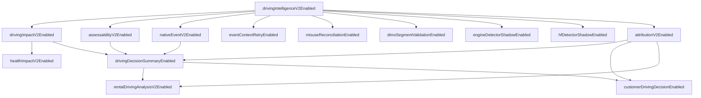

# Driving Intelligence V2 — Feature-Flag- und Rolloutvertrag

**Version:** 1.0 (Spezifikation)  
**Date:** 2026-07-16  
**Status:** **Normativ für zukünftige Implementierung** — keine produktive Flag-Logik in diesem Prompt  
**Repository-Git-Commit (Erstellung):** `8b4512ed`  
**Basis:** [`driving-intelligence-v2.md`](./driving-intelligence-v2.md) (Architekturvertrag Prompt 2/76)

**Prinzip:** Bestehende SynqDrive-Flag-Muster wiederverwenden. **Keine** parallele Flag-Engine, kein externes Feature-Flag-SaaS, kein zweites Evaluations-Framework.

**Schutzregel (verbindlich):** **Kein** Feature Flag darf die bestehende Live-Trip-Erkennung verändern, abschalten oder umkonfigurieren. Flags gelten **ausschließlich** für Post-Trip-Analyse, Read-Model, UI, Rental, Health-Eligibility und manuelle Kundenentscheidungen.

---

## Inhaltsverzeichnis

| # | Abschnitt |
|---|-----------|
| 0 | Zweck |
| 1 | Bestehende Flag-Infrastruktur (Ist) |
| 2 | Ziel-Integration (Wiederverwendung) |
| 3 | Flag-Katalog |
| 4 | Abhängigkeitsgraph |
| 5 | Sichere Aktivierungsreihenfolge |
| 6 | Deaktivierung und Rollback |
| 7 | Metriken |
| 8 | Erlaubte Schreibpfade bei deaktivierter Publication |
| 9 | Laufzeit vs. Deployment |
| 10 | Org- und Fahrzeug-Overrides |
| 11 | Rollout-Phasen — Default-Zusammenfassung |
| 12 | Abnahmekriterien (Prompt 3) |

---

## 0. Zweck

Dieser Vertrag definiert **wie** Driving Intelligence V2 schrittweise und reversibel aktiviert wird, ohne:

- Live-Trip-FSM / `TripDecisionEngine` zu berühren
- automatische Kundenblockierung oder Blacklisting einzuführen
- Shadow-/Proxy-Evidenz als belastbaren Vorwurf zu publizieren
- Health Impact vorzeitig operative Blockwirkung zu geben

**Ziele:**

- Schichtweise Aktivierung entlang des Architekturmodells (Post-Trip → Shadow → Partial → Decision Summary → UI/Rental → Health)
- Klare Defaults: **Master aus**, **Detektoren Shadow**, **Kundenentscheidung aus**, **DIMO-Segmente nur nachgelagert**, **Health ohne Block**
- Einheitliche Evaluierung über **einen** `DrivingIntelligenceV2Config`-Service
- Operative Sicherheit: Rollback ohne Datenverlust für Shadow-Evidence und Summaries

**Nicht Gegenstand:** Implementierung der Config-Klasse, Prisma-Migration, Admin-UI (folgen in Prompts 4+).

---

## 1. Bestehende Flag-Infrastruktur (Ist)

SynqDrive nutzt **kein** zentrales Feature-Flag-Produkt. Bewährte Muster im Repo:

| Muster | Beispiel im Repo | Eigenschaft |
|--------|------------------|-------------|
| **Env + `registerAs` Config-Modul** | `ai.config.ts` (`parseBooleanEnv`), `task-automation-outbox.config.ts`, `notification-evaluation.config.ts` | Global; Deployment via `backend.env`; NestJS `ConfigService` |
| **Injectable Config-Klasse** | `NotificationEngineConfig` (`NOTIFICATIONS_V2`) | Einfache `isV2Enabled()`-Gates |
| **Org-Spalte `Boolean`** | `Organization.paymentsEnabled` + `PaymentsAccessService` | Org-Scope; **Laufzeit** änderbar |
| **JSON `configJson`** | `OrganizationIntegration.configJson`, Task-Automation Org-Overrides | Flexibel; Laufzeit |
| **Per-Event Shadow-Mode** | `notification-event-registry` (`shadowModeEnabled`) | Schreibt intern, keine User-Effekte |
| **Driving-spezifisch (bestehend)** | `HF_MIRROR_ENABLED` (env) → `trip-metrics.service` gauge `hf_mirror_enabled` | ClickHouse Mirror only; **kein** Conduct-Gate |
| **Threshold-Env (kein Flag)** | `WORKER_SNAPSHOT_INTERVAL_MS`, Driving-Impact-Schwellen in `driving-impact.config.ts` | Schwellen, keine Feature-Flags |

**Explizit nicht vorhanden:** generischer `FeatureFlagService`, LaunchDarkly, Unleash, `DRIVING_INTELLIGENCE_V2` (noch).

**Explizit außerhalb des Flag-Scope:** `trip-tracking.processor.ts`, `trip-detection-orchestration.service.ts`, `TripDecisionEngine`, `detectors/*`, `policy/*` — diese Module **dürfen** `DrivingIntelligenceV2Config` **nicht** importieren.

**Driving V2 Plan:** Neues Modul `backend/src/config/driving-intelligence-v2.config.ts` (analog `NotificationEngineConfig` + Battery-V2-Plan) + optional `Organization.drivingIntelligenceV2ConfigJson` — **kein** neues Framework.

---

## 2. Ziel-Integration (Wiederverwendung)

### 2.1 `DrivingIntelligenceV2Config` (geplant)

```typescript
// Ziel-Signatur (Spezifikation only)
@Injectable()
export class DrivingIntelligenceV2Config {
  // Hard invariant — always false for trip detection modules
  isTripDetectionAffected(): false;

  // Global env defaults
  isMasterEnabled(): boolean;
  isNativeEventV2Enabled(): boolean;
  // …

  // Effective flag = f(globalEnv, orgConfigJson?, vehicleConfigJson?)
  resolve(orgId: string, vehicleId?: string): DrivingIntelligenceV2EffectiveFlags;
}
```

**Consumer (erlaubt):**

- `TripEnrichmentOrchestratorService`, `TripAnalysisCoordinatorService`
- `TripBehaviorEnrichmentService`, `LteR1BehaviorEnrichmentService`, `EventContextEnrichmentService`
- `DrivingImpactService`, `MisuseCaseAggregatorService`
- `TripDecisionSummaryService` (neu)
- `RentalDrivingAnalysisService`, `DriverScoreService`, `TripAttributionService`
- `TireHealthService`, `BrakeHealthService` (Eligibility only)
- `vehicle-intelligence.controller.ts`, Frontend API `flags` block

**Consumer (verboten):**

- `TripDecisionEngine`, `TripDetectionOrchestrationService`, `trip-tracking.processor`, alle `detectors/*`

### 2.2 Env-Namenskonvention

| Code-Flag (camelCase) | Environment Variable |
|-----------------------|---------------------|
| `drivingIntelligenceV2Enabled` | `DRIVING_INTELLIGENCE_V2_ENABLED` |
| `nativeEventV2Enabled` | `DRIVING_V2_NATIVE_EVENTS_ENABLED` |
| `eventContextRetryEnabled` | `DRIVING_V2_EVENT_CONTEXT_RETRY_ENABLED` |
| `drivingImpactV2Enabled` | `DRIVING_V2_IMPACT_ENABLED` |
| `misuseReconciliationEnabled` | `DRIVING_V2_MISUSE_RECONCILIATION_ENABLED` |
| `assessabilityV2Enabled` | `DRIVING_V2_ASSESSABILITY_ENABLED` |
| `attributionV2Enabled` | `DRIVING_V2_ATTRIBUTION_ENABLED` |
| `rentalDrivingAnalysisV2Enabled` | `DRIVING_V2_RENTAL_ANALYSIS_ENABLED` |
| `drivingDecisionSummaryEnabled` | `DRIVING_V2_DECISION_SUMMARY_ENABLED` |
| `healthImpactV2Enabled` | `DRIVING_V2_HEALTH_IMPACT_ENABLED` |
| `dimoSegmentValidationEnabled` | `DRIVING_V2_DIMO_SEGMENT_VALIDATION_ENABLED` |
| `engineDetectorShadowEnabled` | `DRIVING_V2_ENGINE_DETECTOR_SHADOW_ENABLED` |
| `hfDetectorShadowEnabled` | `DRIVING_V2_HF_DETECTOR_SHADOW_ENABLED` |
| `customerDrivingDecisionEnabled` | `DRIVING_V2_CUSTOMER_DECISION_ENABLED` |

Eintrag in `backend/.env.example` mit Kommentarblock — **keine** Secrets.

**Bestehendes Env bleibt orthogonal:** `HF_MIRROR_ENABLED` steuert weiterhin nur ClickHouse-Mirror — nicht Conduct-Publication.

### 2.3 Org-Override (geplant)

JSON-Pfad: `Organization.drivingIntelligenceV2ConfigJson` (neue Spalte, Migration später) **oder** interim Unterbaum in `OrganizationIntegration.configJson` → `drivingIntelligenceV2`.

**Regel:** Org kann Flags nur aktivieren, die **global erlaubt** sind (`global=false` → `org=true` ist **verboten** und wird vom Config-Service auf `false` gezwungen).

### 2.4 Fahrzeug-Override (Canary)

JSON auf `Vehicle` oder `DimoVehicle.metadata` — nur für explizite Canary-Fahrzeuge (z. B. ein LTE_R1 Tiguan). Gleiche Regel: kann global deaktivierte Flags **nicht** aktivieren.

---

## 3. Flag-Katalog

Legende:

- **Scope G** = global (env), **O** = organisation, **V** = fahrzeug
- **Shadow** = persistiert + UI-Badge, **keine** Publication/Kundenempfehlung
- **Publication** = user-facing Decision Summary / Rental / Customer KPI
- **Runtime** = ohne Redeploy änderbar (Org/V)
- **Deploy** = env + Prozess-Neustart

### 3.1 `drivingIntelligenceV2Enabled`

| Attribut | Wert |
|----------|------|
| **Default** | `false` |
| **Scope** | G (Master-Kill-Switch); O kann nicht überschreiben wenn G=false |
| **Schicht** | Gesamte Post-Trip V2-Pipeline |
| **Zweck** | Master-Gate: ohne dieses Flag verhält sich System wie Legacy (bestehende Enrichment-Pipeline läuft weiter) |
| **Abhängigkeiten** | Keine (Root für V2) |
| **Shadow/Publication** | OFF = Legacy read paths; ON = Sub-Flags wirksam |
| **Trip-Detection** | **Kein Effekt** — invariant |
| **Aktivierung** | Phase 1 (erstes Gate nach Pipeline-Truth-Fixes) |
| **Rollback** | `false` + Restart → Legacy API/UI |
| **Metriken** | `synqdrive_driving_v2_flag_enabled{flag="master"}` |
| **Änderung** | **Deploy only** |

### 3.2 `nativeEventV2Enabled`

| Attribut | Wert |
|----------|------|
| **Default** | `false` |
| **Scope** | G; O; V (Canary pro `tokenId`) |
| **Schicht** | Provider Event → Driver Conduct (Primary) |
| **Zweck** | Native DIMO `behavior.*` als **primäre** Conduct-Quelle bei Capability; Capability-first per Fahrzeug |
| **Abhängigkeiten** | `drivingIntelligenceV2Enabled=true` |
| **Shadow/Publication** | ON ohne `drivingDecisionSummaryEnabled` = Events persistiert, Conduct in Summary **nicht** publiziert |
| **Aktivierung** | Phase 3 (nach Assessability + Impact-Status-Sync) |
| **Rollback** | Flag off; bestehende `driving_events` bleiben |
| **Metriken** | `driving_v2_native_events_total{result}`, `driving_v2_native_capability{available}` |
| **Änderung** | Deploy + **O/V Runtime** |

### 3.3 `eventContextRetryEnabled`

| Attribut | Wert |
|----------|------|
| **Default** | `false` |
| **Scope** | G; O |
| **Schicht** | Event Context (Ebene 4) |
| **Zweck** | Retry/Recovery für fehlgeschlagene `contextAssessment`-Writes; Scheduler für incomplete context |
| **Abhängigkeiten** | `drivingIntelligenceV2Enabled=true`; ICE profile |
| **Shadow/Publication** | Context bleibt `CONTEXT_ONLY` — nie allein Publication |
| **Aktivierung** | Phase 4 (optional parallel zu Native) |
| **Rollback** | Flag off; kein Retry-Queue |
| **Metriken** | `driving_v2_event_context_retry_total{result}`, `driving_v2_event_context_incomplete_gauge` |
| **Änderung** | Deploy; O Runtime |

### 3.4 `drivingImpactV2Enabled`

| Attribut | Wert |
|----------|------|
| **Default** | `false` |
| **Scope** | G; O |
| **Schicht** | Vehicle Load (Ebene 7) |
| **Zweck** | Impact-Compute mit **Status-Sync** (`drivingImpactStatus=READY` wenn Row existiert), `modelVersion`, Fingerprint |
| **Abhängigkeiten** | `drivingIntelligenceV2Enabled=true`; Behavior stage terminal |
| **Shadow/Publication** | ON = `trip_driving_impacts` + Coordinator sync; Publication in Summary erst mit `drivingDecisionSummaryEnabled` |
| **Aktivierung** | Phase 2 (Pipeline-Truth — früh) |
| **Rollback** | Flag off; bestehende Impact-Rows read-only |
| **Metriken** | `driving_v2_impact_compute_total{result}`, `driving_v2_impact_status_desync_gauge` |
| **Änderung** | Deploy; O Runtime nach globalem ON |

### 3.5 `misuseReconciliationEnabled`

| Attribut | Wert |
|----------|------|
| **Default** | `false` |
| **Scope** | G; O |
| **Schicht** | Misuse Evidence (Ebene 9) |
| **Zweck** | Erweiterte Recovery (`misuse=pending`), Re-Aggregation nach Assignment-Änderung, Idempotenz-Fixes |
| **Abhängigkeiten** | `drivingIntelligenceV2Enabled=true`; Behavior `done` |
| **Shadow/Publication** | Cases bleiben default `informationalOnly=true` bis explizite Promotion |
| **Aktivierung** | Phase 4 |
| **Rollback** | Flag off; bestehende Cases bleiben |
| **Metriken** | `driving_v2_misuse_reconcile_total{result}`, `driving_v2_misuse_stuck_pending_gauge` |
| **Änderung** | Deploy + **O Runtime** |

### 3.6 `assessabilityV2Enabled`

| Attribut | Wert |
|----------|------|
| **Default** | `false` |
| **Scope** | G; O |
| **Schicht** | Assessability / Datenbasis (Ebene 6) |
| **Zweck** | Neue Assessability-Regeln: PARTIAL statt global SKIPPED; Device-Quality → `dataBasis=EINGESCHRÄNKT` statt `PRUEFHINWEIS` |
| **Abhängigkeiten** | `drivingIntelligenceV2Enabled=true` |
| **Shadow/Publication** | Schreibt `behaviorSummaryJson`; Publication über Summary |
| **Aktivierung** | Phase 2 (mit Impact) |
| **Rollback** | Flag off; Legacy Assessability read-time |
| **Metriken** | `driving_v2_assessability_total{level}`, `driving_v2_assessability_limit_reason{reason}` |
| **Änderung** | Deploy; O Runtime |

### 3.7 `attributionV2Enabled`

| Attribut | Wert |
|----------|------|
| **Default** | `false` |
| **Scope** | G; O |
| **Schicht** | Attribution (Ebene 10) |
| **Zweck** | `EXPLICIT`-Gate für Customer-Aggregate; `attributionCoveragePct`; `TIME_WINDOW` nicht kundenbelastbar |
| **Abhängigkeiten** | `drivingIntelligenceV2Enabled=true` |
| **Shadow/Publication** | OFF = Legacy DriverScore über alle Trips; ON = gefilterte Aggregate |
| **Aktivierung** | Phase 6 (vor Rental/Customer Publication) |
| **Rollback** | Flag off |
| **Metriken** | `driving_v2_attribution_filtered_total{scope}`, `driving_v2_attribution_coverage_ratio` |
| **Änderung** | Deploy + **O Runtime** |

### 3.8 `rentalDrivingAnalysisV2Enabled`

| Attribut | Wert |
|----------|------|
| **Default** | `false` |
| **Scope** | G; O |
| **Schicht** | Rental Analysis (Ebene 11) |
| **Zweck** | Materialisierung `rental_driving_analyses` mit `decisionSummary` bei Booking COMPLETED + Recompute |
| **Abhängigkeiten** | `drivingIntelligenceV2Enabled=true`, `attributionV2Enabled=true`, `drivingDecisionSummaryEnabled=true` |
| **Shadow/Publication** | ON = persistiert Payload; UI erst mit Frontend-Gate |
| **Aktivierung** | Phase 8 |
| **Rollback** | Flag off; keine neuen Rows |
| **Metriken** | `driving_v2_rental_analysis_total{result}`, `driving_v2_rental_analysis_recompute_total` |
| **Änderung** | Deploy; O Runtime mit Runbook |

### 3.9 `drivingDecisionSummaryEnabled`

| Attribut | Wert |
|----------|------|
| **Default** | `false` |
| **Scope** | G; O |
| **Schicht** | Decision Recommendation (Ebene 12) — **Publication** |
| **Zweck** | `TripDecisionSummary` in API/UI; 6 Dimensionen A–F; `listBadge` aus Recommendation + Datenbasis |
| **Abhängigkeiten** | `drivingIntelligenceV2Enabled=true`, `assessabilityV2Enabled=true`; mind. eines: `nativeEventV2Enabled` oder `drivingImpactV2Enabled` |
| **Shadow/Publication** | **Publication** — ersetzt `tripAssessment` User-Labels |
| **Verbot bei ON** | `PRUEFHINWEIS`, „Fahrbewertung“ für Belastung |
| **Aktivierung** | Phase 7 |
| **Rollback** | Flag off; Legacy `tripAssessment` parallel (Übergang) |
| **Metriken** | `driving_v2_decision_summary_total{dimension}`, `driving_v2_recommendation_total{level}` |
| **Änderung** | Deploy; O Runtime nach Freigabe |

### 3.10 `healthImpactV2Enabled`

| Attribut | Wert |
|----------|------|
| **Default** | `false` |
| **Scope** | G; O |
| **Schicht** | Health Impact (Ebene 13) |
| **Zweck** | `evidenceStrength` Gate für Tire/Brake; liest nur Vehicle Load |
| **Abhängigkeiten** | `drivingImpactV2Enabled=true` |
| **Shadow/Publication** | **Verbindlich: keine operative Blockwirkung** in Phase 1–10 — nur Eligibility-Badges intern |
| **Aktivierung** | Phase 9 (nach Impact stabil) |
| **Rollback** | Flag off; Health Module Legacy-Eligibility |
| **Metriken** | `driving_v2_health_eligibility_total{module,strength}`, `driving_v2_health_block_suppressed_total` |
| **Änderung** | Deploy; O Runtime |

### 3.11 `dimoSegmentValidationEnabled`

| Attribut | Wert |
|----------|------|
| **Default** | `false` |
| **Scope** | G; O |
| **Schicht** | Post-Trip Reconciliation (nachgelagert) |
| **Zweck** | DIMO-Segmente **nur** zur Validierung/Reconciliation persistierter Trips (Distanz, Zeit, Missing-Trip-Hints) |
| **Abhängigkeiten** | `drivingIntelligenceV2Enabled=true` |
| **Verboten** | Trip-Start/Ende-Trigger; FSM-Parameter; Grace Periods |
| **Shadow/Publication** | Diagnostic + `TripRepair`-Vorschläge only; keine Trip-Grenz-Überschreibung |
| **Aktivierung** | Phase 5 (optional, parallel) |
| **Rollback** | Flag off |
| **Metriken** | `driving_v2_segment_validation_total{result}`, `driving_v2_segment_mismatch_gauge` |
| **Änderung** | Deploy only (global) |

### 3.12 `engineDetectorShadowEnabled`

| Attribut | Wert |
|----------|------|
| **Default** | `true` (wenn Engine-Detektoren laufen) |
| **Scope** | G; O; V |
| **Schicht** | Signal Observation → Rekonstruiert (neue Detektoren) |
| **Zweck** | **Alle neuen** Engine-Detektoren laufen **nur Shadow** (`ESTIMATED_PROXY`) |
| **Abhängigkeiten** | `drivingIntelligenceV2Enabled=true` |
| **Verbindliche Intention** | `true` = Shadow erzwungen; `false` = neue Detektoren **aus** (nicht Publication) |
| **Shadow/Publication** | Shadow only — nie Conduct Publication, nie Kundenempfehlung |
| **Aktivierung** | Automatisch mit Master ON in Dev; Prod erst Phase 4 explizit |
| **Rollback** | `false` = Detektoren off |
| **Metriken** | `driving_v2_engine_detector_shadow_total{detector}`, `driving_v2_engine_detector_suppressed_total` |
| **Änderung** | Deploy + **O/V Runtime** |

### 3.13 `hfDetectorShadowEnabled`

| Attribut | Wert |
|----------|------|
| **Default** | `true` (wenn HF-Pfad aktiv) |
| **Scope** | G; O; V |
| **Schicht** | HF-Rekonstruktion → Conduct/Misuse |
| **Zweck** | HF-Detektoren (accel/brake/abuse) liefern nur Shadow-Evidence wenn nicht durch Native ersetzt |
| **Abhängigkeiten** | `drivingIntelligenceV2Enabled=true`; unabhängig von `HF_MIRROR_ENABLED` |
| **Verbindliche Intention** | `true` = HF nie alleinige belastbare Conduct-Quelle; `false` = HF-Pfad für Conduct **deaktiviert** (nicht Legacy-Promotion) |
| **Shadow/Publication** | Shadow; Badge „Geschätzt“ in UI |
| **Aktivierung** | Mit Master in Dev default `true`; Prod: explizit bestätigen |
| **Rollback** | `false` |
| **Metriken** | `driving_v2_hf_shadow_total{path}`, `driving_v2_hf_promoted_blocked_total` |
| **Änderung** | Deploy + **O/V Runtime** |

### 3.14 `customerDrivingDecisionEnabled`

| Attribut | Wert |
|----------|------|
| **Default** | `false` |
| **Scope** | G; O |
| **Schicht** | Manuelle Kundenentscheidung + Audit Trail |
| **Zweck** | UI/API für `ManualRentalApprovalDialog`, `DrivingDecisionAudit` CRUD |
| **Abhängigkeiten** | `drivingIntelligenceV2Enabled=true`, `drivingDecisionSummaryEnabled=true`, `attributionV2Enabled=true` |
| **Verbindliche Intention** | **Aus** bis explizite Freigabe — **keine automatische Kundenblockierung** |
| **Shadow/Publication** | Publication nur nach manueller Bestätigung mit Pflichtbegründung |
| **Verbot** | Auto-Blacklist, Auto-Mietfreigabe-Ablehnung |
| **Aktivierung** | Phase 10 (letztes User-facing Gate) |
| **Rollback** | Flag off; Audit-Records read-only |
| **Metriken** | `driving_v2_customer_decision_total{decision}`, `driving_v2_customer_decision_revoked_total` |
| **Änderung** | Deploy; O Runtime **nur** mit Runbook + Legal Review |

---

## 4. Abhängigkeitsgraph



**Hard rules:**

1. **Kein** Sub-Flag darf wirksam sein wenn `drivingIntelligenceV2Enabled=false`.
2. `customerDrivingDecisionEnabled` erfordert `drivingDecisionSummaryEnabled` + `attributionV2Enabled`.
3. `rentalDrivingAnalysisV2Enabled` erfordert `drivingDecisionSummaryEnabled`.
4. `engineDetectorShadowEnabled` und `hfDetectorShadowEnabled` default **`true`** erzwingen Shadow — Promotion erfordert separaten Architektur-Change + neues Flag (nicht in V2 Phase 1).
5. **Trip-Detection-Module importieren diesen Graphen nicht.**

---

## 5. Sichere Aktivierungsreihenfolge

| Phase | Flags ON | Ziel | Exit-Kriterium |
|-------|----------|------|----------------|
| **0 — Baseline** | alle `false`; `hfDetectorShadowEnabled=true`, `engineDetectorShadowEnabled=true` (latent, ohne Master wirkungslos) | Ist-Verhalten; FSM unberührt | Metriken-Baseline 7d |
| **1 — Master + Pipeline Truth** | `drivingIntelligenceV2Enabled`, `drivingImpactV2Enabled`, `assessabilityV2Enabled` | Status-Sync, PARTIAL, kein PRUEFHINWEIS intern | `impact_status_desync=0` |
| **2 — Shadow Detektoren** | + `hfDetectorShadowEnabled`, `engineDetectorShadowEnabled` (bestätigt) | HF/Engine nur Shadow | `hf_promoted_blocked` = 100 % |
| **3 — Native Primary** | + `nativeEventV2Enabled` (1 Org, LTE_R1 Canary) | Conduct aus Provider Events | Native capability match Audit |
| **4 — Context + Misuse** | + `eventContextRetryEnabled`, `misuseReconciliationEnabled` | Context complete; misuse unstuck | `misuse_stuck_pending` → 0 |
| **5 — Segment Validation** | + `dimoSegmentValidationEnabled` | Nachgelagerte Segment-Checks | Keine FSM-Änderung verifiziert |
| **6 — Attribution** | + `attributionV2Enabled` | Customer-Gates | `attribution_coverage` sichtbar |
| **7 — Decision Summary** | + `drivingDecisionSummaryEnabled` | API/UI 6 Dimensionen | AC UX-Audit 1–6 |
| **8 — Rental** | + `rentalDrivingAnalysisV2Enabled` (1 Org) | Miet-Reports materialisiert | Row pro COMPLETED booking |
| **9 — Health Eligibility** | + `healthImpactV2Enabled` | Tire/Brake strength badges; **kein Block** | `health_block_suppressed=100%` |
| **10 — Customer Decision** | + `customerDrivingDecisionEnabled` | Manuelle Freigabe + Audit | Legal/Runbook OK |
| **11 — Fleet** | Org-Overrides schrittweise | Volle Flotte | SLOs §7 grün |

**Verboten:**

- Phase 7 vor Phase 1–2
- `customerDrivingDecisionEnabled` vor `drivingDecisionSummaryEnabled`
- `dimoSegmentValidationEnabled` mit FSM-Code-Änderung
- `healthImpactV2Enabled` mit Rental-Block-Policy
- Irgendein Flag in `trip-tracking` / `TripDecisionEngine`

---

## 6. Deaktivierung und Rollback

### 6.1 Allgemeine Regeln

| Aktion | Verhalten |
|--------|-----------|
| Master OFF | Alle V2-Pfade no-op nach Restart; Legacy read paths |
| Sub-Flag OFF | Nur dieser Pfad; historische Daten bleiben |
| Summary OFF | API liefert Legacy `tripAssessment` (Übergang) |
| Customer Decision OFF | Keine neuen Audits; bestehende lesbar |
| Shadow-Flags OFF | Detektoren aus; nicht „Legacy Promotion“ |

### 6.2 Rollback-Stufen

| Stufe | Maßnahme | Trip-Detection |
|-------|----------|----------------|
| **R1 — Soft** | Betroffenes Sub-Flag `false` | **Unberührt** |
| **R2 — Summary** | `drivingDecisionSummaryEnabled=false` | **Unberührt** |
| **R3 — Master** | `drivingIntelligenceV2Enabled=false` | **Unberührt** |
| **R4 — UI** | Frontend fällt auf Legacy-Komponenten | **Unberührt** |
| **R5 — Hard** | Code-Revert + Deploy | **Unberührt** — FSM-Code nie revertiert wegen V2 |

**Kein Rollback:** Löschen von `misuse_cases`, `trip_driving_impacts`, `driving_events` ohne Backup.

### 6.3 Notfall-Kill-Switch

`DRIVING_INTELLIGENCE_V2_ENABLED=false` ist der **einzige** globale Not-Aus-Schalter für V2 — deaktiviert **nicht** Trip-Erkennung, Snapshot-Poll oder `dimo.trip-tracking`.

---

## 7. Metriken

### 7.1 Globale Metriken

| Metrik | Typ | Zweck |
|--------|-----|-------|
| `synqdrive_driving_v2_flag_enabled` | gauge | `flag` label — effektiver Zustand (sampled per org) |
| `synqdrive_trip_finalized_total` | counter | **Bestehend** — unabhängig von V2-Flags |
| `synqdrive_enrichment_failed_total` | counter | **Bestehend** — unabhängig von V2-Flags |

### 7.2 Rollout-SLOs (Gate vor nächster Phase)

| SLO | Schwelle |
|-----|----------|
| `driving_v2_impact_status_desync_gauge` | `0` nach Phase 1 |
| `driving_v2_hf_promoted_blocked_total` / attempts | 100 % blocked in Shadow phase |
| `driving_v2_health_block_suppressed_total` | 100 % wenn Health ON ohne Block-Policy |
| `driving_v2_customer_decision_total{decision=auto_*}` | **0** — kein Auto-Block |
| Trip-FSM Metriken (`trip_finalized`, `trip_discarded`) | Keine Regression vs. Baseline |
| `driving_v2_recommendation_total{level=KUNDENGESPRAECH}` | Nur mit `EXPLICIT` attribution |

### 7.3 Grafana

Dashboard **„Driving Intelligence V2 Rollout“**: Flag-States, Phase, Desync-Gauges, Shadow vs Published, FSM-Baseline (unverändert).

---

## 8. Erlaubte Schreibpfade bei deaktivierter Publication

Wenn `drivingDecisionSummaryEnabled=false` (und Master kann an oder aus sein):

| Artefakt | Erlaubt | Bedingung |
|----------|---------|-----------|
| `vehicle_trips` Lifecycle-Felder | **Ja** | Trip-Detection (immer, flag-unabhängig) |
| `vehicle_trips` Enrichment-Felder | **Ja** | Bestehende Pipeline |
| `driving_events` (native) | **Ja** | Wenn `nativeEventV2Enabled` oder Legacy LTE_R1 path |
| `trip_behavior_events` (HF) | **Ja** | Wenn HF läuft; Shadow wenn `hfDetectorShadowEnabled` |
| `trip_driving_impacts` | **Ja** | Wenn `drivingImpactV2Enabled` |
| `misuse_cases` | **Ja** | `informationalOnly=true` default |
| `rental_driving_analyses` | **Nein** | `rentalDrivingAnalysisV2Enabled=false` |
| `trip_decision_summaries` (Ziel) | **Nein** | Summary off |
| `driving_decision_audits` (Ziel) | **Nein** | `customerDrivingDecisionEnabled=false` |
| Customer Auto-Block / Blacklist | **Nein** | **Immer verboten** |
| Health Rental Block aus Driving | **Nein** | `healthImpactV2Enabled` ohne Block-Policy |
| DIMO-Segment → Trip-Grenze ändern | **Nein** | **Immer verboten** |

**Grundsatz:** Shadow/Diagnostic **schreiben**, Decision Summary / Customer Decision / Auto-Block **nicht**.

---

## 9. Laufzeit vs. Deployment

| Flag | Global env | Org-Override | Fahrzeug-Override | Änderung in Production |
|------|------------|--------------|-------------------|------------------------|
| `drivingIntelligenceV2Enabled` | ✓ | — | — | **Deploy only** |
| `nativeEventV2Enabled` | ✓ | ✓ | ✓ (Canary) | Deploy + **Runtime** O/V |
| `eventContextRetryEnabled` | ✓ | ✓ | — | Deploy + **Runtime** O |
| `drivingImpactV2Enabled` | ✓ | ✓ | — | Deploy + **Runtime** O |
| `misuseReconciliationEnabled` | ✓ | ✓ | — | Deploy + **Runtime** O |
| `assessabilityV2Enabled` | ✓ | ✓ | — | Deploy + **Runtime** O |
| `attributionV2Enabled` | ✓ | ✓ | — | Deploy + **Runtime** O |
| `rentalDrivingAnalysisV2Enabled` | ✓ | ✓ | — | Deploy; O Runtime mit Runbook |
| `drivingDecisionSummaryEnabled` | ✓ | ✓ | — | Deploy; O Runtime mit Runbook |
| `healthImpactV2Enabled` | ✓ | ✓ | — | Deploy + **Runtime** O |
| `dimoSegmentValidationEnabled` | ✓ | — | — | **Deploy only** |
| `engineDetectorShadowEnabled` | ✓ | ✓ | ✓ | Deploy + **Runtime** O/V |
| `hfDetectorShadowEnabled` | ✓ | ✓ | ✓ | Deploy + **Runtime** O/V |
| `customerDrivingDecisionEnabled` | ✓ | ✓ | — | **Deploy**; O Runtime nur mit Runbook |

**Caching:** Effective flags pro `(orgId, vehicleId)` TTL **60 s** max.

**Frontend:** Flags via API `tripDecisionSummary.flags` oder `GET /organizations/:id/driving-intelligence-v2/flags` — **nie** hardcoded env im Browser.

---

## 10. Org- und Fahrzeug-Overrides

### 10.1 Evaluationsreihenfolge

```
effective = globalEnv AND NOT globalKill
if vehicleOverride != null: effective = effective AND vehicleOverride  // Canary
if orgOverride != null: effective = effective AND orgOverride        // org kann global ON nicht erzwingen wenn global OFF
```

**Invariant:** `DrivingIntelligenceV2Config.isTripDetectionAffected()` → **immer `false`**.

### 10.2 Geplante Admin-API (Spezifikation)

| Endpoint | Rolle |
|----------|-------|
| `GET /platform/organizations/:id/driving-intelligence-v2/flags` | Read effective flags |
| `PATCH /platform/organizations/:id/driving-intelligence-v2/flags` | Platform Admin only |
| `PATCH /platform/vehicles/:id/driving-intelligence-v2/flags` | Canary |

Audit-Log in bestehendem Platform-Log — **kein** Implementieren in Prompt 3.

---

## 11. Rollout-Phasen — Default-Zusammenfassung

| Flag | Default | Modus bei ON |
|------|---------|--------------|
| `drivingIntelligenceV2Enabled` | **false** | Master-Gate Post-Trip V2 |
| `nativeEventV2Enabled` | **false** | Native Primary Conduct |
| `eventContextRetryEnabled` | **false** | Context Recovery |
| `drivingImpactV2Enabled` | **false** | Impact + Status-Sync |
| `misuseReconciliationEnabled` | **false** | Misuse Recovery |
| `assessabilityV2Enabled` | **false** | PARTIAL / Datenbasis |
| `attributionV2Enabled` | **false** | EXPLICIT-Gates |
| `rentalDrivingAnalysisV2Enabled` | **false** | Miet-Aggregat |
| `drivingDecisionSummaryEnabled` | **false** | **Publication** 6 Dimensionen |
| `healthImpactV2Enabled` | **false** | Eligibility **ohne Block** |
| `dimoSegmentValidationEnabled` | **false** | **Nur nachgelagert** |
| `engineDetectorShadowEnabled` | **true** | **Nur Shadow** |
| `hfDetectorShadowEnabled` | **true** | **Nur Shadow** |
| `customerDrivingDecisionEnabled` | **false** | **Manuell only** |

**Verbindliche Defaults (Zusammenfassung):**

- Neue Engine-/HF-Detektoren: **nur Shadow** (`engineDetectorShadowEnabled=true`, `hfDetectorShadowEnabled=true`)
- **Keine** automatische Kundenblockierung (`customerDrivingDecisionEnabled=false`)
- Health Impact V2: **ohne operative Blockwirkung** bis explizite Policy-Phase
- DIMO-Segmente: **nur nachgelagert** (`dimoSegmentValidationEnabled` — kein FSM-Effekt)
- Kundenentscheidung: **deaktiviert** bis Phase 10
- Live-Trip-Erkennung: **unabhängig** von allen Flags

**Erstes empfohlenes Prod-ON (Phase 1):** `drivingIntelligenceV2Enabled` + `drivingImpactV2Enabled` + `assessabilityV2Enabled` — **keine** User-facing Publication.

---

## 12. Abnahmekriterien (Prompt 3)

| ID | Kriterium |
|----|-----------|
| RF01 | Alle 14 Flags mit Default, Scope, Dependencies dokumentiert |
| RF02 | Wiederverwendung `registerAs` + `Organization` JSON — keine neue Engine |
| RF03 | Live-Trip-Erkennung explizit flag-unabhängig |
| RF04 | HF/Engine-Detektoren default Shadow |
| RF05 | `customerDrivingDecisionEnabled` default **off** |
| RF06 | `healthImpactV2Enabled` ohne Blockwirkung in Rollout |
| RF07 | `dimoSegmentValidationEnabled` nur nachgelagert — kein FSM |
| RF08 | `drivingDecisionSummaryEnabled` default **off** |
| RF09 | Erlaubte Writes bei Publication off definiert |
| RF10 | Runtime vs Deploy pro Flag definiert |
| RF11 | Aktivierungsreihenfolge Phase 0–11 |
| RF12 | Rollback R1–R5 dokumentiert |
| RF13 | Metriken + SLOs inkl. `auto_*` decision = 0 |
| RF14 | `HF_MIRROR_ENABLED` orthogonal dokumentiert |

---

## Referenzen

- [`driving-intelligence-v2.md`](./driving-intelligence-v2.md)
- [`../audits/driving-intelligence-v2-implementation-inventory.md`](../audits/driving-intelligence-v2-implementation-inventory.md)
- [`battery-health-v2-rollout-flags.md`](./battery-health-v2-rollout-flags.md) (Flag-Muster-Vorlage)
- `backend/src/modules/notifications/notification-engine.config.ts` (`NOTIFICATIONS_V2`)
- `backend/src/config/ai.config.ts` (`parseBooleanEnv`)
- `backend/src/modules/observability/trip-metrics.service.ts` (`HF_MIRROR_ENABLED` gauge)
- `backend/src/modules/vehicle-intelligence/trips/TRIP_OWNERSHIP.ts`

---

*Implementierungsstatus: **Spezifikation only**. Nächster Schritt: `driving-intelligence-v2.config.ts` + `.env.example` Block (Prompt 4+).*
