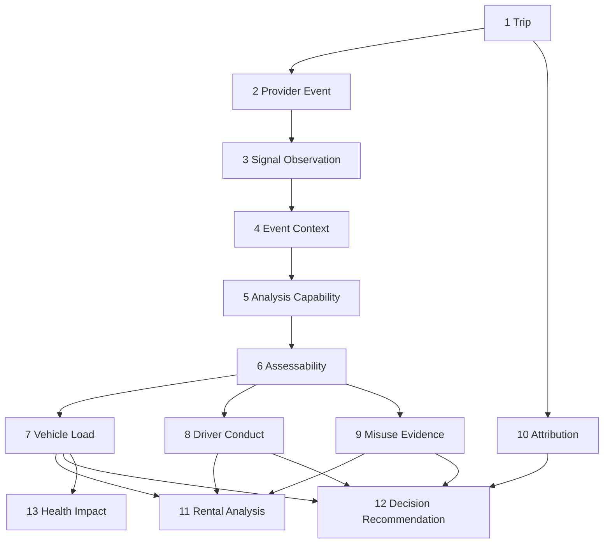

# Driving Intelligence V2 — Verbindlicher Architekturvertrag

**Version:** 2.0 (Spezifikation)  
**Date:** 2026-07-16  
**Status:** **Normativ für zukünftige Implementierung** — keine produktive Umsetzung in diesem Dokument  
**Repository-Git-Commit (Erstellung):** `c85edaf6`  
**Basis:**

- [`docs/audits/driving-intelligence-v2-implementation-inventory.md`](../audits/driving-intelligence-v2-implementation-inventory.md) (Prompt 1/76)
- [`docs/audits/driving-analysis-production-reality.md`](../audits/driving-analysis-production-reality.md)
- [`docs/audits/dimo-driving-signals-capability.md`](../audits/dimo-driving-signals-capability.md)
- [`docs/audits/driving-analysis-ux-decision-model.md`](../audits/driving-analysis-ux-decision-model.md)

**Prinzip:** Eine kanonische Read-Fassade (`TripDecisionSummaryService`). Keine parallele Driving-Wahrheit in UI, Rental, Alerts, Health oder Kundenentscheidungen.

**Normativität:** Dieses Dokument **übersteuert** Legacy-Code und implizite Annahmen, sofern Audits Widersprüche belegen. Der UX-Entscheidungsvertrag in `driving-analysis-ux-decision-model.md` bleibt die fachliche Detailquelle für Operator-Copy und Dimensionen A–F; dieses Dokument ist die **implementierungsleitende Architektur**.

---

## Inhaltsverzeichnis

| # | Abschnitt |
|---|-----------|
| 0 | Zweck, Geltungsbereich und Schutzregel |
| 1 | Schichtenmodell (13 Ebenen) |
| 2 | Strikte Trennung der Bewertungsdimensionen |
| 3 | Evidenzarten und Priorität |
| 4 | Native DIMO Events und Capability-first |
| 5 | HF- und Engine-Detektoren (Shadow / Context Only) |
| 6 | Modellversion, Input Fingerprint, Recompute, Supersede |
| 7 | Partielle Analysen und Stage-Status |
| 8 | Health Impact — Eligibility und Evidenzstärke |
| 9 | Kundenentscheidung — ausschließlich manuell |
| 10 | DIMO-Segmente — nur nachgelagerte Tripvalidierung |
| 11 | Kanonische Read-Fassade und API-Vertrag |
| 12 | Übergang Legacy → V2 |
| 13 | Verbotene Ableitungen und Abnahmekriterien |
| 14 | Referenzen |

---

## 0. Zweck, Geltungsbereich und Schutzregel

### 0.1 Zweck

Driving Intelligence V2 beschreibt, wie aus **bereits abgeschlossenen** Fahrten (`VehicleTrip.tripStatus = COMPLETED`) belastbare operative Aussagen für Autovermieter entstehen:

- Wurde das Fahrzeug mechanisch belastet?
- War das Fahrverhalten auffällig?
- Gibt es Hinweise auf Fehlgebrauch oder Schadensprüfbedarf?
- Ist die Datenbasis und Zuordnung ausreichend?
- Welche **Empfehlung** folgt daraus — ohne automatischen Kundenvorwurf?

### 0.2 Geltungsbereich

| Gilt | Gilt nicht |
|------|------------|
| Post-Trip-Analyse ab `finalizeTrip` | Trip-Start-Erkennung |
| Enrichment, Assessment, Decision Summary | Trip-Ende-Erkennung |
| Rental Period Aggregation | Live-Trip-FSM |
| Health Impact Consumption | Grace Periods, Detection Thresholds |
| Manuelle Kundenentscheidung + Audit | Snapshot-basierte Live-Erkennung |
| DIMO-Segment-Reconciliation **nach** Trip-Existenz | DIMO-Segmente als primärer Trip-Trigger |

**Multi-tenant:** Alle Operationen sind `organizationId`-scoped. Keine hardcodierten `vehicleId`, `orgId`, `customerId`.

**Schreibpfad:** Kanonisch über `TripEnrichmentOrchestratorService` (bestehend) → Ziel: `TripDecisionSummaryService` (neu) als Read-Fassade.

**Lesepfad:** Kanonisch: `TripDecisionSummaryService` — alle UIs, Rental Analysis, Customer Profile, Notifications und Health-Eligibility konsumieren dieselbe Fassade oder deren dimensional abgeleitete Felder.

### 0.3 Schutzregel (verbindlich)

```
Live-Trip-Erkennung (FSM, Detectors, Policy, TripDecisionEngine)
  ≠ Post-Trip Driving Intelligence V2
```

Die neue Architektur **beginnt erst nach erfolgreichem Tripabschluss** oder arbeitet auf **bereits persistierten** `COMPLETED`-Trips.

**DIMO-Segmente** dürfen ausschließlich **nachgelagert** zur Validierung und Reconciliation bereits erkannter Trips verwendet werden — niemals als Ersatz für `TripDecisionEngine` oder als primäre Trip-Grenze in V2.

Geschützte Dateien: siehe Inventur §12 (`trip-decision.engine.ts`, `trip-detection-orchestration.service.ts`, `detectors/*`, `policy/*`, `trip-tracking.processor.ts`).

---

## 1. Schichtenmodell (13 Ebenen)



Jede Ebene hat eigene Semantik, Freshness, Fehlerbehandlung und UI-Darstellung. **Keine** Ebene darf die Semantik einer höheren ersetzen.

### 1.1 Ebene 1 — Trip

| Attribut | Definition |
|----------|------------|
| **Was** | Abgeschlossene operative Fahrt mit kanonischen Grenzen aus Live-FSM |
| **Persistenz** | `vehicle_trips` (`tripStatus=COMPLETED`, Zeiten, Distanz, Assignment-Snapshot) |
| **Owner** | `TripDecisionEngine` (Lifecycle only) |
| **Darf Fahrer bewerten?** | **Nein** |
| **Darf Belastung bewerten?** | **Nein** (roh) |

Trip ist die **zeitliche und räumliche Einheit** aller nachgelagerten Analysen. V2 ändert keine Trip-Grenzen.

**Pflichtfelder für V2-Eligibility:** `endTime`, `distanceKm > 0` (oder dokumentierte Ausnahme), `vehicleId`, `organizationId` (via Vehicle).

### 1.2 Ebene 2 — Provider Event

| Attribut | Definition |
|----------|------------|
| **Was** | Vom Telematik-Provider (primär DIMO) geliefertes diskretes Ereignis |
| **Persistenz** | `driving_events` (`source=TELEMETRY_EVENTS`) |
| **Beispiele** | `behavior.harshAcceleration`, `behavior.harshBraking`, `safety.collision` |
| **Evidenzart** | `PROVIDER_CLASSIFIED` |
| **Darf Fahrer bewerten?** | **Nein** (Einzelereignis) |
| **Darf Conduct ableiten?** | Nur als Input zu Ebene 8 |

Provider Events sind **fahrzeugspezifisch verfügbar** — nicht fleet-weit garantiert (Audit: Tiguan vs. Arteon vs. Tesla).

### 1.3 Ebene 3 — Signal Observation

| Attribut | Definition |
|----------|------------|
| **Was** | Zeitreihenpunkt oder aggregierter Signalwert innerhalb eines Trip-Fensters |
| **Persistenz** | Transient (DIMO Query) oder `trip_behavior_events` (HF-abgeleitet), optional ClickHouse Mirror |
| **Beispiele** | `speed`, `powertrainCombustionEngineSpeed`, `obdEngineLoad` |
| **Evidenzart** | `MEASURED` (wenn Kadenz ausreichend) oder `ESTIMATED_PROXY` (wenn sparse) |
| **Darf Fahrer bewerten?** | **Nein** |

**Insert-Gate:** Observation allein erzeugt **kein** Missbrauchs- oder Conduct-Urteil. Kadenz &lt; Schwellwert → `ESTIMATED_PROXY` oder Shadow.

### 1.4 Ebene 4 — Event Context

| Attribut | Definition |
|----------|------------|
| **Was** | Konservativ klassifizierter Kontext um ein Provider Event (±30 s Signale, Motorkontext, Grade) |
| **Persistenz** | `driving_events.metadataJson.contextAssessment` |
| **Evidenzart** | `CONTEXT_ONLY` |
| **Darf Missbrauch begründen?** | Nur als **zusätzlicher** Hinweis; nie allein |
| **Darf Fahrer bewerten?** | **Nein** |

Event Context **erklärt** ein Ereignis; es ist kein eigenständiger Vorwurf.

### 1.5 Ebene 5 — Analysis Capability

| Attribut | Definition |
|----------|------------|
| **Was** | Fahrzeugprofil-spezifische Fähigkeit, bestimmte Analysepfade zu betreiben |
| **Persistenz** | `VehicleCapabilityProfile` (Ziel) oder abgeleitet aus `availableSignals`, `dataSummary`, `hardwareType` |
| **Beispiele** | `NATIVE_BEHAVIOR_EVENTS`, `HF_CADENCE_SUFFICIENT`, `ICE_EVENT_CONTEXT`, `ROUTE_ENRICHMENT` |
| **Darf operativ entscheiden?** | **Nein** — nur Gate |

Capability ist **per `tokenId` / Fahrzeug**, nicht per Fleet-Default (DIMO Capability Audit).

### 1.6 Ebene 6 — Assessability

| Attribut | Definition |
|----------|------------|
| **Was** | Bewertung, **ob** und **wie weit** eine Trip-Analyse belastbar ist |
| **Persistenz** | `vehicle_trips.behaviorSummaryJson` (`analysisAssessability`, `analysisLimitReason`, …) |
| **Werte** | `FULL`, `LIMITED`, `NOT_ASSESSABLE` |
| **Darf Fahrer bewerten?** | **Nein** — beschreibt Datenqualität |
| **UI-Dimension** | **Datenbasis** (UX Dimension A) |

Assessability ist **kein** Verhaltensurteil. `LIMITED` wegen Gerät ≠ „auffälliger Fahrer“.

### 1.7 Ebene 7 — Vehicle Load

| Attribut | Definition |
|----------|------------|
| **Was** | Mechanische Belastung des Fahrzeugs (Reifen, Bremsen, Antrieb, Fahrwerk) |
| **Persistenz** | `trip_driving_impacts` (`drivingStressScore`, Komponenten), `vehicle_driving_impact_current` (rolling) |
| **Modell** | `DrivingImpactService` / `driving-impact.config.ts` (`modelVersion`) |
| **Evidenzstärke** | `MEASURED` + `RECONSTRUCTED` (HF-Komponenten) gemischt |
| **Darf Fahrer bewerten?** | **Nein** — explizit verboten |
| **UI-Dimension** | **Fahrzeugbelastung** (UX Dimension B) |

**Verbindliche Copy-Regel:** Nie „schlechter Fahrer“; immer „Fahrzeugbelastung“ / „mechanische Belastung“.

### 1.8 Ebene 8 — Driver Conduct

| Attribut | Definition |
|----------|------------|
| **Was** | Bewertung des Fahrverhaltens aus belastbaren Verhaltensereignissen |
| **Persistenz** | Abgeleitet read-time; Ereignisse in `driving_events` + `trip_behavior_events` |
| **Primärquelle** | Native Provider Events (wenn Capability) |
| **Sekundärquelle** | HF-Rekonstruktion nur mit `ESTIMATED_PROXY` / Shadow-Badge |
| **Darf Fahrer bewerten?** | **Ja**, aber nur bei ausreichender Attribution + Assessability |
| **UI-Dimension** | **Fahrverhalten** (UX Dimension C) |

Conduct **darf nicht** aus Vehicle Load allein abgeleitet werden.

### 1.9 Ebene 9 — Misuse Evidence

| Attribut | Definition |
|----------|------------|
| **Was** | Aggregierte Hinweise auf Fehlgebrauch, Missbrauch oder Schadensverdacht |
| **Persistenz** | `misuse_cases`, `misuse_case_evidence` |
| **Default** | `informationalOnly=true` bis manuell bestätigt |
| **Unterscheidung** | Missbrauch ≠ Schadensverdacht (eigene `MisuseCaseType`) |
| **Darf Kunde sperren?** | **Nein** (automatisch) |
| **UI-Dimension** | **Missbrauchsevidenz** (UX Dimension D) |

### 1.10 Ebene 10 — Attribution

| Attribut | Definition |
|----------|------------|
| **Was** | Zuordnung einer Fahrt zu Buchung, Kunde, Fahrer oder Privat |
| **Persistenz** | `vehicle_trips` Assignment-Felder; `TripAttributionService` read-only |
| **Writer** | `TripAssignmentService` only |
| **Confidence** | `HIGH`, `MEDIUM`, `LOW` abgeleitet aus `bookingLinkSource` |
| **Darf Fahrer bewerten?** | Gate — ohne `EXPLICIT` keine kundenbezogene Empfehlung |
| **UI-Dimension** | **Attribution** (UX Dimension E) |

`TIME_WINDOW`-Match ist **nicht** kundenbelastbar.

### 1.11 Ebene 11 — Rental Analysis

| Attribut | Definition |
|----------|------------|
| **Was** | Aggregierte Driving Intelligence über einen Mietzeitraum |
| **Persistenz** | `rental_driving_analyses.payload` inkl. `decisionSummary` (Ziel) |
| **Input** | Nur Trips mit gültiger Attribution innerhalb Buchungsfenster |
| **Darf Kunde sperren?** | **Nein** — nur Empfehlung |
| **Trigger** | Booking `COMPLETED` + Recompute bei Nachanalyse |

### 1.12 Ebene 12 — Decision Recommendation

| Attribut | Definition |
|----------|------------|
| **Was** | Operative Empfehlung für Vermieter (keine automatische Sanktion) |
| **Persistenz** | `trip_decision_summaries` (Ziel) oder read-time via `TripDecisionSummaryService` |
| **Werte** | `KEINE_MASSNAHME`, `BEOBACHTEN`, `KUNDENGESPRAECH`, `MANUELLE_MIETFREIGABE`, `FAHRZEUGPRUEFUNG`, `TECHNISCHE_DATENPRUEFUNG` |
| **UI-Dimension** | **Empfehlung** (UX Dimension F) |

Recommendation ist **deterministisch** aus Ebenen 6–10; ändert keine Health- oder Kundendaten ohne manuelle Aktion.

### 1.13 Ebene 13 — Health Impact

| Attribut | Definition |
|----------|------------|
| **Was** | Downstream-Nutzung von Vehicle Load für Verschleißmodule |
| **Persistenz** | `vehicle_driving_impact_current`; Tire/Brake Health Snapshots |
| **Consumer** | `TireHealthService`, `BrakeHealthService` |
| **Input** | **Nur** Ebene 7 (Vehicle Load), nie Conduct oder Misuse |
| **Darf Fahrer bewerten?** | **Nein** |

Health Impact ist **asset-zentriert**, nicht personenzentriert.

---

## 2. Strikte Trennung der Bewertungsdimensionen

### 2.1 Leitregel (verbindlich)

```
Trip ≠ Provider Event ≠ Signal Observation ≠ Event Context ≠ Capability ≠ Assessability
  ≠ Vehicle Load ≠ Driver Conduct ≠ Misuse Evidence ≠ Damage Suspicion
  ≠ Data Quality ≠ Attribution ≠ Recommendation ≠ Health Impact
```

### 2.2 Dimensions-Matrix

| Dimension | Fachliche Frage | Darf mischbar mit | Darf nie mischbar mit |
|-----------|-----------------|-------------------|------------------------|
| **Fahrzeugbelastung** | Wie stark wurde das Asset mechanisch beansprucht? | Health Impact | Fahrerverhalten, Missbrauch |
| **Fahrverhalten** | War die Fahrdynamik auffällig? | — (eigenständig) | Fahrzeugbelastung als Proxy |
| **Missbrauch** | Gibt es Hinweise auf vertragswidrige Nutzung? | Schadensverdacht (getrennt labeln) | Automatische Kundensperre |
| **Schadensverdacht** | Gibt es Hinweise auf Schaden (Impact, Collision)? | Missbrauch (eigener Case-Type) | Fahrverhalten allein |
| **Datenqualität** | Kann ich der Analyse vertrauen? | Assessability | Fahrerverhalten, Missbrauch |
| **Fahrerzuordnung** | Wem kann ich die Fahrt zuordnen? | Attribution Confidence | Conduct ohne EXPLICIT |

### 2.3 Verbotene UI- und API-Mappings

| Verboten | Stattdessen |
|----------|-------------|
| `PRUEFHINWEIS` als Sammelstatus | Auflösen in Datenbasis / Conduct / Misuse / Empfehlung |
| `drivingScore` / „Fahrbewertung“ für Belastung | `vehicleLoad` / „Fahrzeugbelastung“ |
| Geräteproblem → Listen-Badge „auffällig“ | `dataBasis=EINGESCHRÄNKT` |
| `drivingStressScore` → Kunden-KPI ohne Attribution-Gate | `attributionCoveragePct` + gefilterte Aggregate |
| Shadow/Proxy-Evidence → belastbarer Vorwurf | Badge „Geschätzt“ / `ESTIMATED_PROXY` |
| Automatisches Blacklisting | Manuelle Entscheidung + Audit Trail |
| Vehicle Load critical → „schlechter Fahrer“ | „Starke Fahrzeugbelastung“ |

### 2.4 Schadensverdacht vs. Missbrauch

| Aspekt | Missbrauch | Schadensverdacht |
|--------|------------|------------------|
| **Typische Cases** | Kickdown-Muster, Cold-Engine-Abuse, Aggressive Pattern | `POSSIBLE_IMPACT`, `DIMO_COLLISION_REPORTED`, `DAMAGE_SUSPICION` |
| **Empfehlung** | `KUNDENGESPRAECH` (nur mit Attribution) | `FAHRZEUGPRUEFUNG` |
| **Evidenz** | Verhaltens- + Kontextmuster | Native Safety Events, Impact-Detektoren |
| **UI** | „Hinweis auf Fehlgebrauch“ | „Fahrzeugprüfung empfohlen“ |

Beide sind **informational** bis manuell bestätigt.

---

## 3. Evidenzarten und Priorität

### 3.1 Evidenzarten (verbindlich)

| Code | Definition | Publication-tauglich | Conduct-tauglich | Misuse-tauglich |
|------|------------|---------------------|------------------|-----------------|
| `MEASURED` | Direkt gemessenes Signal mit ausreichender Kadenz | Ja (Load) | Nur mit Detector-Validierung | Nein allein |
| `PROVIDER_CLASSIFIED` | DIMO/Provider-native klassifiziertes Event | Ja | **Ja (Primary)** | Als Anker ja |
| `RECONSTRUCTED` | SynqDrive-Detektor aus HF/Observations | Ja (Load-Komponenten) | Nur mit Shadow-Badge | Nur informativ |
| `ESTIMATED_PROXY` | Sparse HF, CH-Mirror, abgeleitete Proxy | Shadow only | Shadow only | Nein |
| `CONTEXT_ONLY` | Event Context Assessment | Nein | Erklärung only | Zusatz only |
| `MANUAL_VERIFIED` | Werkstatt, Schaden, manuell bestätigter Befund | Ja | Ja | **Ja (stärkste)** |

### 3.2 Prioritätsordnung (Conduct)

```
MANUAL_VERIFIED
  > PROVIDER_CLASSIFIED (native behavior.*)
    > RECONSTRUCTED (HF, ausreichende Kadenz)
      > ESTIMATED_PROXY (shadow — nie als Vorwurf)
        > CONTEXT_ONLY (nie allein)
```

### 3.3 Prioritätsordnung (Vehicle Load)

```
MANUAL_VERIFIED (Werkstatt/Inspektion)
  > MEASURED (native + route + HF-Komponenten)
    > RECONSTRUCTED (HF-Detektoren)
      > ESTIMATED_PROXY (nicht für Health Publication)
```

### 3.4 Mischregeln

| Mischung | Regel |
|----------|-------|
| Native + HF | `MIXED` labeln; Conduct nur aus Native wenn vorhanden |
| Nur HF | Conduct max. `DYNAMISCH` mit Shadow; kein `STARK_AUFFÄLLIG` |
| Nur Context | Kein Conduct-Urteil |
| Device degraded | Assessability `LIMITED`; Conduct `NICHT_BEWERTBAR` |

---

## 4. Native DIMO Events und Capability-first

### 4.1 Verbindliche Priorität

Bei **fahrzeugspezifischer Verfügbarkeit** sind native DIMO `behavior.*` Events die **primäre Verhaltensevidenz** für Driver Conduct.

```
IF capability.nativeBehaviorEvents = true
  THEN conduct.primarySource = PROVIDER_CLASSIFIED
ELSE IF capability.hfCadenceSufficient = true
  THEN conduct.primarySource = RECONSTRUCTED (shadow-badged)
ELSE
  conduct = NICHT_BEWERTBAR
```

### 4.2 Capability-Ermittlung (per Fahrzeug)

| Signal | Quelle |
|--------|--------|
| Native Events verfügbar | `dataSummary.eventDataSummary` + empirische 30d-Probe |
| HF-Kadenz ausreichend | Median-Intervall &lt; Schwellwert (Audit: ~3–10 s, nicht 1 Hz) |
| Event Context erlaubt | `powertrainType != EV` + ICE Guards |
| Route Enrichment | `speed` in `availableSignals` |

**Kein Fleet-Default:** Tiguan ≠ Arteon ≠ Tesla.

### 4.3 Null-Event-Semantik (LTE_R1)

| Bedingung | Conduct |
|-----------|---------|
| Native query succeeded + 0 Events + ausreichend HF | `UNAUFFÄLLIG` (calm trip) |
| Native query succeeded + 0 Events + insufficient HF | `NICHT_BEWERTBAR` |
| Native query failed | `NICHT_BEWERTBAR`, `dataBasis=EINGESCHRÄNKT` |

### 4.4 Safety Events

` safety.collision` und vergleichbare Provider Events sind **Schadensverdacht**, nicht automatisch Missbrauch.

---

## 5. HF- und Engine-Detektoren (Shadow / Context Only)

### 5.1 Verbindliche Einstufung (V2 Phase 1)

| Detektor-Klasse | V2-Modus | Begründung |
|-----------------|----------|------------|
| Bestehende HF accel/brake | `RECONSTRUCTED` oder Shadow | Kadenz unsicher |
| HF abuse (kickdown, cold engine, impact) | Shadow → Misuse **informationalOnly** | Proxy-Risiko |
| Neue Engine-Detektoren | **Shadow only** bis validiert | Keine Produktionsfreigabe ohne Backtest |
| ClickHouse HF Mirror | `ESTIMATED_PROXY` | CH optional / oft unavailable |
| RPM Webhook Candidates | `ESTIMATED_PROXY` | Kontext only |
| Event Context Classifier | `CONTEXT_ONLY` | Erklärt, bewertet nicht allein |

### 5.2 Shadow-Definition

Shadow-Evidenz:

- wird **persistiert** und **angezeigt** mit Badge „Geschätzt“ / „Shadow“
- darf **keine** kundenbezogene Empfehlung auslösen
- darf **kein** `informationalOnly=false` setzen
- darf Vehicle Load **nur** mit `confidence=LOW` einfließen

### 5.3 Freigabe Shadow → Primary

Shadow-Promotion erfordert **alle**:

1. Empirische Kadenz-Validierung pro `tokenId`
2. Backtest gegen Native Events (wo vorhanden)
3. Architektur-Änderungseintrag + Feature-Flag
4. Keine Regression in Assessability-Tests

---

## 6. Modellversion, Input Fingerprint, Recompute, Supersede

### 6.1 Modellversion

Jede materialisierte Analyse trägt:

```typescript
interface AnalysisProvenance {
  modelVersion: string;        // z.B. "driving-impact-v1.2.0", "decision-summary-v2.0.0"
  modelFamily: 'IMPACT' | 'CONDUCT' | 'MISUSE' | 'DECISION_SUMMARY';
  computedAt: string;            // ISO-8601 UTC
  computedBy: 'PIPELINE' | 'MANUAL_RECOMPUTE' | 'BACKFILL';
}
```

**Regel:** UI und API zeigen `modelVersion` in Technische Details (Ebene 3 UX).

### 6.2 Input Fingerprint

Vor Persistenz wird ein deterministischer Fingerprint berechnet:

```
inputFingerprint = SHA256(
  tripId,
  modelVersion,
  sorted(providerEventIds),
  sorted(behaviorEventIds),
  assignmentSnapshot,
  capabilityProfileHash,
  assessabilityState,
  impactRowVersion
)
```

**Zweck:** Idempotenz, Skip bei unverändertem Input, Audit „warum recompute?“.

### 6.3 Recompute

| Trigger | Erlaubt | Pflicht |
|---------|---------|---------|
| Behavior enrichment completed | Ja | Status-Sync |
| Assignment geändert | Ja | Attribution + Rental + Summary |
| Modellversion erhöht | Ja (Backfill) | `supersededBy` setzen |
| Manueller Ops-Trigger | Ja | Audit-Log |
| API Read | **Nein** | — |

Recompute ist **additive supersede**, kein stilles Überschreiben ohne Provenance.

### 6.4 Supersede

```typescript
interface SupersedeRecord {
  previousFingerprint: string;
  supersededAt: string;
  supersededBy: string;       // userId oder 'PIPELINE'
  reason: string;             // Pflicht bei manuell
}
```

Alte Summaries bleiben **lesbar** für Audit; UI zeigt aktuelle Version.

---

## 7. Partielle Analysen und Stage-Status

### 7.1 Verbindliches Stage-Modell

```
behavior → route → misuse → drivingImpact → decisionSummary
```

Jede Stage: `pending` | `done` | `skipped` | `failed`

### 7.2 Kein globales Alles-oder-nichts

| Verboten | Verbindlich |
|----------|-------------|
| `tripAnalysisStatus=SKIPPED` wegen HF-only auf LTE_R1 mit Native | `PARTIAL` + behavior `done` |
| Ein Fehler skippt alle Stages | Stage-spezifischer `failed` / `skipped` |
| `drivingImpactStatus=PENDING` trotz Impact-Row | Impact `done` synchronisieren |
| `PRUEFHINWEIS` als globaler Status | Dimensionale Partial Results |

### 7.3 Trip-Level-Aggregat

| `tripAnalysisStatus` | Bedingung |
|----------------------|-----------|
| `IN_PROGRESS` | Mindestens eine Stage `pending` |
| `PARTIAL` | Mind. eine Stage `done`, mind. eine nicht `failed` |
| `COMPLETED` | Alle Stages terminal (`done` oder `skipped`) |
| `FAILED` | Mind. eine kritische Stage `failed` (behavior) |
| `SKIPPED` | Nur wenn **keine** Assessability (NOT_ASSESSABLE, NOT_SUPPORTED) |

### 7.4 Partial Result Contract

`TripDecisionSummary` **muss** auch bei `PARTIAL` liefern:

- `dataBasis` (immer)
- `vehicleLoad` (wenn impact `done`)
- `driverConduct` (wenn behavior `done`)
- `misuseEvidence` (wenn misuse `done` oder `skipped` mit 0)
- `attribution` (immer, wenn Trip existiert)
- `recommendation` (konservativ bei `LIMITED`)

Fehlende Dimension → explizit `null` + `reasonCode`, nicht stilles Weglassen.

---

## 8. Health Impact — Eligibility und Evidenzstärke

### 8.1 Eligibility

| Modul | Eligibility-Bedingung |
|-------|----------------------|
| **Tire Health V2** | `vehicle_driving_impact_current` vorhanden + `modelVersion` kompatibel + `evidenceStrength ≥ MEDIUM` |
| **Brake Health V2** | Wie Tire + min. `distanceKm` im Rolling Window |
| **Rental Readiness** | Separates Policy-Modul — **nicht** Driving Conduct |

### 8.2 Evidenzstärke (für Health)

| Stärke | Bedingung | Health Publication |
|--------|-----------|-------------------|
| `HIGH` | ≥80 % Trips mit `MEASURED`/`PROVIDER_CLASSIFIED` Load, Assessability FULL | Erlaubt |
| `MEDIUM` | ≥50 % belastbare Trips, teils RECONSTRUCTED | Erlaubt mit Badge |
| `LOW` | Dominant ESTIMATED_PROXY oder LIMITED | **Nur Shadow** — keine Wear-Alarme |
| `NONE` | Kein Impact Current | `drivingImpactAvailable=false` |

### 8.3 Verbotene Health-Ableitungen

| Verboten | Grund |
|----------|-------|
| Conduct → Tire Wear | Person ≠ Asset |
| Misuse → Brake Health | Verdacht ≠ Verschleiß |
| Ein Trip critical → Health Alert | Rolling Window + Stärke |
| Health Alert → Kundensperre | Getrennte Policy |

### 8.4 Brake/Tire Consumer Contract

Health-Module lesen **ausschließlich**:

- `VehicleDrivingImpactCurrent` (rolling 30d)
- `TripDrivingImpact` (optional Detail)
- **Nicht:** `tripAssessment`, `MisuseCase`, `driverConduct`

---

## 9. Kundenentscheidung — ausschließlich manuell

### 9.1 Verbindliche Regel

```
Keine automatische Kundenentscheidung aus Driving Intelligence V2.
```

Empfehlungen (`KUNDENGESPRAECH`, `MANUELLE_MIETFREIGABE`) sind **Vorschläge**. Wirksame Entscheidungen erfordern **manuelle Bestätigung** mit Audit Trail.

### 9.2 Erlaubte manuelle Entscheidungen

| Entscheidung | Voraussetzung |
|--------------|---------------|
| `APPROVE` (Mietfreigabe) | Mitarbeiter + Pflichtbegründung (min. 20 Zeichen) |
| `CONDITIONAL` | Wie oben + Bedingungen |
| `REJECT` | Wie oben — **kein** Auto-Blacklist |
| `DISMISS` (Hinweis entkräften) | Begründung + `decidedByUserId` |
| `INSPECTION_REQUESTED` | Fahrzeugprüfung anstoßen |

### 9.3 Audit Trail (Pflicht)

```typescript
interface DrivingDecisionAudit {
  id: string;
  organizationId: string;
  subjectType: 'CUSTOMER' | 'BOOKING' | 'TRIP' | 'VEHICLE';
  subjectId: string;
  decision: 'APPROVE' | 'CONDITIONAL' | 'REJECT' | 'DISMISS' | 'INSPECTION_REQUESTED';
  recommendationAtDecision: RecommendationCode;
  dimensionsSnapshot: TripDecisionSummary;  // A–F zum Zeitpunkt
  reason: string;
  decidedByUserId: string;
  decidedAt: string;
  revokedAt?: string;
  revokedByUserId?: string;
  revokeReason?: string;
}
```

### 9.4 Gates für kundenbezogene Empfehlung

Empfehlung `KUNDENGESPRAECH` oder `MANUELLE_MIETFREIGABE` nur wenn **alle** erfüllt:

1. `attribution ∈ {BESTÄTIGTER_FAHRER, BUCHUNGSKUNDE}` + `bookingLinkSource=EXPLICIT` + `confidence ≥ MEDIUM`
2. `dataBasis = BELASTBAR` (nicht `EINGESCHRÄNKT` für Kundenvorwurf)
3. Evidence nicht nur `ESTIMATED_PROXY`
4. Events normalisiert (`per100km` oder Cluster)
5. Muster wiederholt **oder** `misuseEvidence ≥ STARKER_VERDACHT` mit `MANUAL_VERIFIED` oder `PROVIDER_CLASSIFIED`

Bei `dataBasis=EINGESCHRÄNKT` wegen Gerät: maximal `TECHNISCHE_DATENPRUEFUNG`.

---

## 10. DIMO-Segmente — nur nachgelagerte Tripvalidierung

### 10.1 Verbindliche Rolle

| DIMO-Segmente dürfen | DIMO-Segmente dürfen nicht |
|----------------------|----------------------------|
| Trip-Zeitfenster **validieren** | Trip-Start auslösen (V2) |
| Distanz/Odometer **abgleichen** | Trip-Ende ersetzen |
| Missing-Trip-Candidate **hinweisen** | Live-FSM ersetzen |
| Route-Reconciliation **unterstützen** | Grace Periods ändern |
| Energy Events (refuel/recharge) anreichern | Canonical Trip Boundaries überschreiben |

### 10.2 Reconciliation-Contract

`TripReconciliationService` darf:

- Enrichment re-triggern
- Repairs **nur via `TripDecisionEngine`** anwenden
- Segment-Abweichungen als `TripRepair` / Diagnostic persistieren

`TripReconciliationService` darf **nicht**:

- Neue Trip-Heuristiken einführen
- `tripStatus` direkt mutieren
- Segment als alleinige Wahrheit ohne FSM-Rücksprache setzen

### 10.3 Timeline API

`GET /trips-timeline` nutzt Segmente für **Darstellung** und Merge mit Energy Events — nicht als alleinige Analyse-Wahrheit für Conduct/Misuse.

---

## 11. Kanonische Read-Fassade und API-Vertrag

### 11.1 TripDecisionSummaryService (Ziel)

**Single Read Model** für:

- Trip Detail, Trips List Badge
- Rental Analysis, Booking Usage
- Customer/Driver Profile (gefiltert)
- Notification Copy (dimensional)
- Manual Decision Dialog

### 11.2 API-DTO (Ziel)

```typescript
interface TripDecisionSummary {
  // Provenance
  modelVersion: string;
  inputFingerprint: string;
  computedAt: string;

  // Dimension A — Datenbasis
  dataBasis: 'BELASTBAR' | 'EINGESCHRÄNKT' | 'UNZUREICHEND' | 'NICHT_UNTERSTÜTZT';
  dataBasisReasons: string[];

  // Dimension B — Fahrzeugbelastung
  vehicleLoad: {
    level: 'SCHONEND' | 'NORMAL' | 'ERHÖHT' | 'STARK_ERHÖHT';
    score: number | null;
    per100km: { hardBrakes: number; hardAccelerations: number; /* … */ };
    evidenceStrength: 'HIGH' | 'MEDIUM' | 'LOW' | 'NONE';
  } | null;

  // Dimension C — Fahrverhalten
  driverConduct: {
    level: 'UNAUFFÄLLIG' | 'DYNAMISCH' | 'AUFFÄLLIG' | 'STARK_AUFFÄLLIG' | 'NICHT_BEWERTBAR';
    primaryEvidence: EvidenceKind;
    eventCountVisible: number;
    per100km: number | null;
  } | null;

  // Dimension D — Missbrauchsevidenz
  misuseEvidence: {
    level: 'KEINE' | 'EINZELNER_HINWEIS' | 'MEHRERE_BELASTBARE_HINWEISE' | 'STARKER_VERDACHT' | 'SCHADENSPRÜFUNG';
    caseCount: number;
    informationalOnly: boolean;
  };

  // Dimension E — Attribution
  attribution: {
    level: 'BESTÄTIGTER_FAHRER' | 'BUCHUNGSKUNDE' | 'ZUGEWIESENER_FAHRER' | 'FAHRZEUGBEZOGEN' | 'UNKLAR' | 'PRIVAT_NICHT_ZUGEORDNET';
    confidence: 'HIGH' | 'MEDIUM' | 'LOW';
    customerChargeable: boolean;
  };

  // Dimension F — Empfehlung
  recommendation: {
    level: RecommendationCode;
    primaryReason: string;
    reasons: string[];
    ctas: Array<{ action: string; label: string; eligible: boolean }>;
  };

  // Partial analysis
  stages: AnalysisStagesJson;
  partial: boolean;
}
```

### 11.3 List Badge Contract

```typescript
interface TripListBadge {
  recommendation: RecommendationCode;
  dataBasis: DataBasisCode;
  // Niemals: PRUEFHINWEIS, "auffällig" ohne Kontext
}
```

### 11.4 Legacy-Mapping

| Legacy | V2 |
|--------|-----|
| `tripAssessment.status` | Deprecated — aus Summary ableiten |
| `tripAssessment.status=PRUEFHINWEIS` | **Verboten** in UI |
| `vehicle_trips.driving_score` | Deprecated → `vehicleLoad.score` |
| `tripOverallRating` | Deprecated → `listBadge` |

---

## 12. Übergang Legacy → V2

### 12.1 Phasen

| Phase | Inhalt |
|-------|--------|
| **Phase 0** | Pipeline-Truth (Status-Sync, Backfill) — Prompts 5–12 |
| **Phase 1** | `TripDecisionSummary` Backend + API — Prompts 13–20 |
| **Phase 2** | Evidence-Normalisierung, Attribution Gates — Prompts 21–36 |
| **Phase 3** | Rental + Frontend Surfaces — Prompts 37–52 |
| **Phase 4** | Profile + Audit Trail — Prompts 53–68 |
| **Phase 5** | Alerts, i18n, Readiness — Prompts 69–76 |

### 12.2 Feature Flag

```
DRIVING_INTELLIGENCE_V2=true
```

- UI liest `tripDecisionSummary` wenn Flag aktiv
- Legacy `tripAssessment` parallel für Übergang (max. 1 Release)
- Flag default `false` bis AC erfüllt

### 12.3 Datenmigration

| Artefakt | Aktion |
|----------|--------|
| Historische `trip_analysis_status=NULL` | Backfill aus Ist-Stages |
| `driving_impact_status` desync | Repair-Script |
| Bestehende `misuse_cases` | `informationalOnly=true` beibehalten |
| `rental_driving_analyses` | Recompute bei Bedarf |

---

## 13. Verbotene Ableitungen und Abnahmekriterien

### 13.1 Verbotene Ableitungen

| # | Verbot |
|---|--------|
| V1 | Geräteproblem → Fahrerverdacht |
| V2 | Vehicle Load → Conduct |
| V3 | Shadow Evidence → belastbarer Kundenvorwurf |
| V4 | Automatische Mietfreigabe/-sperre |
| V5 | `PRUEFHINWEIS` als User-Label |
| V6 | DIMO-Segment → canonical Trip Boundary (V2) |
| V7 | Misuse → Health Alert ohne Eligibility |
| V8 | Cross-tenant Aggregation |
| V9 | Conduct ohne Attribution → Kunden-KPI |
| V10 | HF-only → `STARK_AUFFÄLLIG` |

### 13.2 Abnahmekriterien (Architektur)

1. Jede API-Response für Trip Detail enthält `tripDecisionSummary` mit allen 6 Dimensionen oder explizitem `null`+`reason`.
2. Kein User-facing Label „Prüfhinweis“ oder „Fahrbewertung“ für Belastung.
3. Native Events werden bei Capability als `PROVIDER_CLASSIFIED` priorisiert.
4. HF/Shadow trägt sichtbares Badge; löst keine Kundenempfehlung aus.
5. `tripAnalysisStatus=PARTIAL` liefert nutzbare Teilergebnisse.
6. Health-Module konsumieren nur Vehicle Load mit `evidenceStrength` Gate.
7. Manuelle Entscheidung erzeugt `DrivingDecisionAudit` mit Snapshot.
8. Trip-Detection-Dateien unverändert (Diff-Review).
9. Recompute erzeugt neue Provenance ohne Silent-Overwrite.
10. DIMO-Segmente nur in Reconciliation/Timeline — nicht in FSM.

---

## 14. Referenzen

| Dokument | Rolle |
|----------|-------|
| [`driving-intelligence-v2-implementation-inventory.md`](../audits/driving-intelligence-v2-implementation-inventory.md) | Ist-Inventur, Dateien, Prompt-Matrix |
| [`driving-analysis-ux-decision-model.md`](../audits/driving-analysis-ux-decision-model.md) | UX-Dimensionen, Copy, Wireframes |
| [`driving-analysis-production-reality.md`](../audits/driving-analysis-production-reality.md) | Produktionsbefunde P0/P1 |
| [`dimo-driving-signals-capability.md`](../audits/dimo-driving-signals-capability.md) | Capability-first, Native Events |
| [`TRIP_ANALYSIS_ASSESSABILITY_2026-07-05.md`](./TRIP_ANALYSIS_ASSESSABILITY_2026-07-05.md) | Assessability, Stages |
| [`DRIVING_ASSESSMENT_DEVICE_QUALITY_2026-07-10.md`](./DRIVING_ASSESSMENT_DEVICE_QUALITY_2026-07-10.md) | Gerätequalität |
| [`TRIP_OWNERSHIP.ts`](../backend/src/modules/vehicle-intelligence/trips/TRIP_OWNERSHIP.ts) | Lifecycle-Invarianten |

---

*Changes / Architektur: Dieses Dokument **ist** die Architektur-Aktualisierung für Driving Intelligence V2 Prompt 2. SynqDrive Code → Changes wird bei produktiver Umsetzung ergänzt.*
