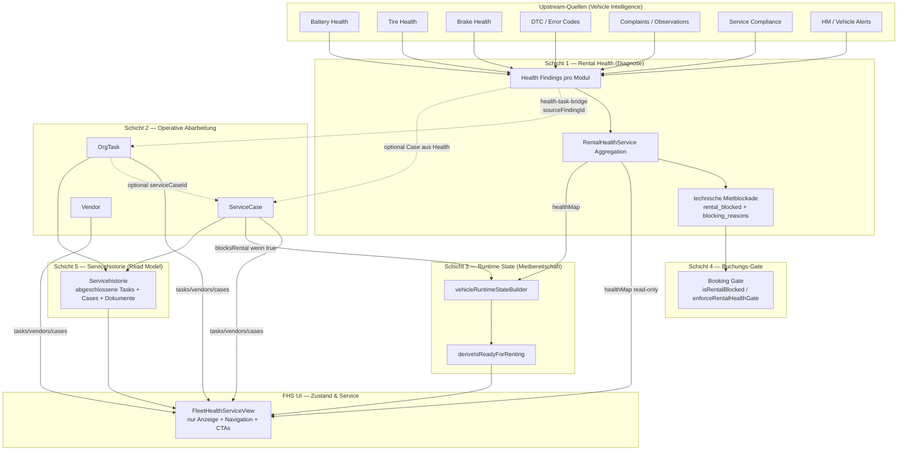
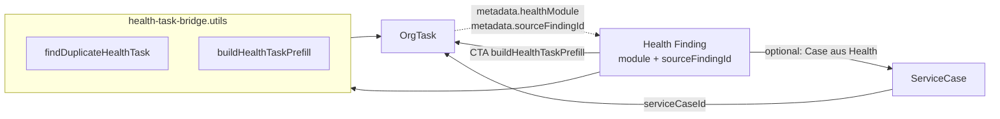
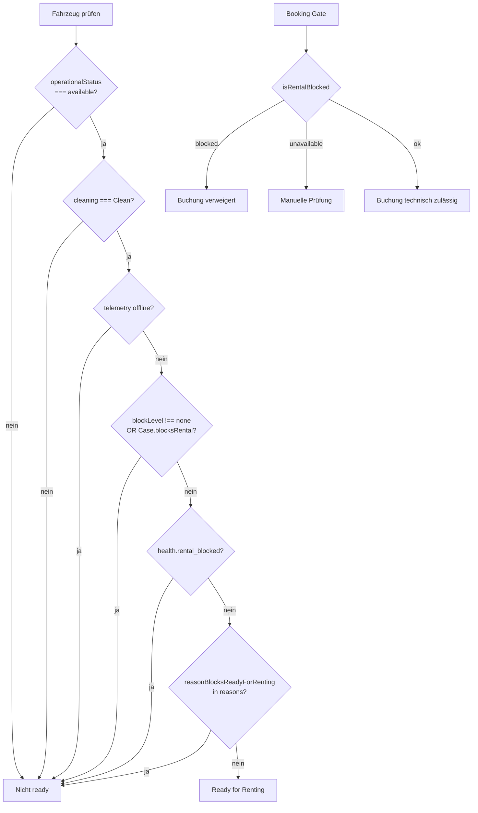

# Fleet „Zustand & Service“ — Domain Boundaries (Zielarchitektur)

| Feld | Wert |
|------|------|
| **Version** | 1.0 |
| **Status** | **Normativ** — verbindliche Zielarchitektur vor Code-Remediation |
| **Prompt** | 0/66, Prompt 3 |
| **Erstellt (UTC)** | 2026-07-20 |
| **Repository-Baseline** | `7192fb4e4e8ad854b3b3415b909513a08b669f90` (`main` zum Erstellungszeitpunkt) |
| **Modus** | Dokumentation only — keine Produktivcodeänderung |

**Verwandte Dokumente:**

| Dokument | Rolle |
|----------|-------|
| [`fleet-health-service-remediation-contract.md`](../implementation/fleet-health-service-remediation-contract.md) | Ausführungsvertrag (Prompt 1) |
| [`fleet-health-service-remediation-tracker.md`](../implementation/fleet-health-service-remediation-tracker.md) | Umsetzungs-Tracker (Prompt 2) |
| [`fleet-health-service-callsite-baseline.md`](../implementation/fleet-health-service-callsite-baseline.md) | Ist-Inventur (Prompt 4) |
| [`FLEET_HEALTH_SERVICE_CONTRACT.md`](../../frontend/src/rental/components/fleet-health-service/FLEET_HEALTH_SERVICE_CONTRACT.md) | UI-Fachvertrag |
| [`fleet-health-service-production-reality.md`](../audits/fleet-health-service-production-reality.md) | Audit 1 |
| [`fleet-health-service-workflow-ux-test-matrix.md`](../audits/fleet-health-service-workflow-ux-test-matrix.md) | Audit 2 |

**Deployment-Hinweis:** Der deployte VPS-Stand (`ac856881` zum Audit-Zeitpunkt) kann vom Repository abweichen. Dieses Dokument beschreibt das **Zielbild**; Ist-Abweichungen sind in Audits und Baseline dokumentiert.

---

## 1. Zweck

Dieses Dokument legt die **verbindlichen Domänengrenzen** für Fleet „Zustand & Service“ fest, bevor Remediation-Code geändert wird. Es definiert:

- welche Schicht welche Wahrheit **besitzt** (Owner),
- welche Schicht nur **konsumiert** (Consumer),
- welche Zustände **nicht gegenseitig überschrieben** werden dürfen,
- wie Health Findings, Tasks und Service Cases **verknüpft** werden,
- warum `ServiceCase.blocksRental` **nicht** in `overall_state` einfließt,
- wie `unknown` / `error` / `partial` semantisch behandelt werden,
- welche Quelle **Ready for Renting** bestimmt.

---

## 2. Schichtenmodell (Übersicht)



### 2.1 Owner vs. Consumer

| Konzept | Owner (Wahrheit) | Consumer (nur lesen / ableiten) |
|---------|------------------|----------------------------------|
| Health Finding | Modul-Services → `RentalHealthService` | FHS UI, Runtime Builder (Reasons), Notifications |
| Rental Health Aggregation | `RentalHealthService` | FHS, Fleet Map, Health Tab, Insights |
| Technische Mietblockade | `RentalHealthService.collectBlockingReasons` | Booking Gate, Runtime (explizite Reasons) |
| OrgTask | `TasksService` / `org_tasks` | FHS, Service Center, Runtime (availability flag) |
| ServiceCase | `ServiceCasesService` / `service_cases` | FHS (Ziel), Runtime (`blocksRental`) |
| Vendor | `VendorsService` / `vendors` | Tasks, FHS Partner-Tab |
| Runtime State / Ready for Renting | `vehicleRuntimeStateBuilder` + `deriveIsReadyForRenting` | Dashboard, Fleet Status, FHS (Hinweis) |
| Booking Gate | `RentalHealthService.isRentalBlocked` | `BookingsService.enforceRentalHealthGate` |
| Servicehistorie | Abgeleitetes Read Model aus Tasks + Cases (+ Dokumente) | FHS Verlauf-Tab |

**Regel:** Consumer dürfen Owner-Daten **anreichern** (Labels, Sortierung, KPI), aber **keine parallele Wahrheit** erzeugen.

---

## 3. Domänenkonzepte (präzise)

### 3.1 Health Finding

**Definition:** Ein diagnostisches Signal auf **Modul-Ebene** innerhalb von Rental Health V1 — z. B. „Reifenprofil kritisch“, „TÜV überfällig (warning)“, „Batterie unknown“.

| Aspekt | Festlegung |
|--------|------------|
| **Owner** | Jeweiliger Vehicle-Intelligence-Service, aggregiert durch `RentalHealthService` |
| **Kanonical Shape** | `ModuleHealth`: `state`, `reason`, `last_updated_at`, `data_stale`, optional `source`, `evidence_type` |
| **Module** | `battery`, `tires`, `brakes`, `error_codes`, `service_compliance`, `complaints`, `vehicle_alerts` |
| **Nicht** | Task-Status, Vendor-Waiting, Service-Case-Status, Buchungsstatus |

**Health Finding ≠ OrgTask:** Ein Finding beschreibt **technischen Zustand**; ein Task beschreibt **operative Arbeit**. Ein überfälliger TÜV kann gleichzeitig ein `service_compliance`-Finding **und** einen `VEHICLE_INSPECTION`-Task haben — zwei Perspektiven, keine zweite Health-Berechnung aus Tasks.

**Stabile Identität (Zielbild Remediation):** Jedes handlungsrelevante Finding soll über `sourceFindingId` (Fingerprint aus `vehicleId` + `healthModule` + normalisiertem Reason/Evidence-Key) an Tasks/Cases anknüpfbar sein — ohne Typ-Heuristik allein.

---

### 3.2 Rental Health Aggregation

**Definition:** Die **read-only** Zusammenführung aller Modul-Findings zu `VehicleHealth` / `VehicleHealthResponse`.

| Feld | Semantik | Owner |
|------|----------|-------|
| `overall_state` | Schweregrad-Aggregat: `good` \| `warning` \| `critical` \| `unknown` \| `n_a` | `computeOverallState()` |
| `modules.*` | Pro-Modul-Finding | Modul-Evaluatoren |
| `generated_at` | Aggregationszeitpunkt | `RentalHealthService` |
| `rental_blocked` | **Separates** Boolean — nicht aus `overall_state` abgeleitet | `collectBlockingReasons()` |
| `blocking_reasons` | Geordnete Hard-Blocker-Liste | `collectBlockingReasons()` |

**Aggregationsregeln (`overall_state`):**

| Regel | Verhalten |
|-------|-----------|
| `n_a` Module | Aus Aggregat **ausgeschlossen** (strukturell nicht anwendbar) |
| Irgendein `critical` | → `overall_state = critical` |
| Irgendein `warning` (kein critical) | → `warning` |
| Irgendein `unknown` (kein critical/warning) | → `unknown` |
| Alle applicable `good` | → `good` |
| Nur `n_a` | → `unknown` |

**Wichtig:** `overall_state` ist **diagnostische Schwere**, nicht Mietbereitschaft. `warning` und `critical` ohne Hard-Blocker blockieren die Miete **nicht** automatisch.

**Consumer:** `healthMap` in `FleetContext`, FHS ViewModel, `fleet-health-control-center`, Runtime Builder (Reasons only).

---

### 3.3 Technische Mietblockade

**Definition:** Explizite, **technisch begründete** Unvermietbarkeit — unabhängig von `overall_state`.

| Aspekt | Festlegung |
|--------|------------|
| **Owner** | `RentalHealthService.collectBlockingReasons()` |
| **Output** | `rental_blocked: boolean`, `blocking_reasons: string[]` |
| **Invariante** | `rental_blocked === (blocking_reasons.length > 0)` |
| **Quellen (Beispiele)** | TÜV/BOKraft overdue, `blocksRental`-Observation, Limp Mode, Tire/Brake Hard-Block, Battery Safety Block |

**Nicht-Blocker (explizit ausgeschlossen):**

- `overall_state === warning` allein
- `overall_state === critical` ohne passenden Hard-Block-Evidence-Pfad
- Service-Compliance „overdue“ als **warning** (HM/OEM Next Service)
- Task overdue / Task `blocksVehicleAvailability`
- `ServiceCase.blocksRental` (→ Runtime State, siehe §3.5)
- Vendor `WAITING` ohne technischen Blocker

**Booking Gate** konsumiert ausschließlich diese Schicht (`isRentalBlocked`), nicht Runtime State und nicht Tasks.

**Remediation-Ziel (Ist-Abweichung):** Per-vehicle API-Fehler dürfen **nicht** zu `rental_blocked: false` + `unknown` stub degradieren (Audit FHS-T-021). Fehler → `healthGateStatus: UNAVAILABLE` / ehrliches `unknown`.

---

### 3.4 OrgTask

**Definition:** Eine **einzelne operative Arbeit** — zuweisbar, fällig, statusfähig, optional vendor-gebunden.

| Aspekt | Festlegung |
|--------|------------|
| **Owner** | `org_tasks` via `TasksService` |
| **Status-Lifecycle** | `OPEN` → `IN_PROGRESS` → `WAITING` → `DONE` \| `CANCELLED` |
| **Relevanz FHS** | `activeTasks` (offen), `historyTasks` (DONE/CANCELLED) |
| **Health-Bezug** | Optional über Metadata: `sourceType: 'HEALTH'`, `healthModule`, `sourceFindingId` |

**Invarianten:**

| ID | Regel |
|----|-------|
| T1 | Task `DONE` **heilt** kein Health Finding |
| T2 | Task overdue ist **operative** Fälligkeit, kein `rental_blocked` |
| T3 | `blocksVehicleAvailability` betrifft **operative Verfügbarkeit** (Fleet/Ops), nicht Rental-Health-Gate |
| T4 | Tasks sind **keine** Health-Aggregation — kein Task-Count als `overall_state` |

**Consumer:** FHS Aufgaben/Termine/Übersicht (Execution-Layer), Servicehistorie (DONE), Runtime (optional availability).

---

### 3.5 ServiceCase

**Definition:** Ein **übergeordneter Werkstatt-/Servicevorgang**, der mehrere Tasks, Termine, Dokumente und Kommentare bündelt.

| Aspekt | Festlegung |
|--------|------------|
| **Owner** | `service_cases` via `ServiceCasesService` |
| **Status** | `OPEN`, `IN_PROGRESS`, `WAITING_PARTS`, `SCHEDULED`, `COMPLETED`, `CANCELLED` |
| **Felder (relevant)** | `category`, `scheduledAt`, `blocksRental`, `source`, `vehicleId` |
| **Verknüpfung Tasks** | `OrgTask.serviceCaseId` (optional) |

**Warum `ServiceCase.blocksRental` nicht in `overall_state` einfließt:**

1. **Semantische Trennung:** `overall_state` misst **technische Diagnose** aus Vehicle Intelligence. Ein Service Case ist ein **operativer Vorgang** („Fahrzeug in Werkstatt“, „Warten auf Teile“) — keine Messgröße aus Telemetrie/Health-Modulen.
2. **Zeitliche Entkopplung:** Ein Case kann offen sein, während Health module `good` zeigen (Arbeit noch nicht reflektiert) — oder umgekehrt Health `critical`, Case bereits `COMPLETED`.
3. **Doppelte Blockade vermeiden:** Würde `blocksRental` in Rental Health einfließen, entstünde eine zweite Blockade-Logik neben `collectBlockingReasons` mit anderem Lifecycle (Case schließen ≠ Finding behoben).
4. **Korrekte Schicht:** Workshop-Blockade ist **operative Mietbereitschaft** → `vehicleRuntimeStateBuilder` / `deriveIsReadyForRenting` (Prompt 20), analog zu Cleaning, Damage, aktiver Buchung.

**Zielbild FHS:** Cases werden parallel zu Tasks in Data Layer, Termine, Historie und KPI angezeigt — nicht als Ersatz für Tasks.

---

### 3.6 Vendor

**Definition:** Stammdaten eines Werkstatt-/Partnerbetriebs — Kontakt, Service Areas, Zuordnung zu Fahrzeugen.

| Aspekt | Festlegung |
|--------|------------|
| **Owner** | `vendors` via `VendorsService` |
| **Permission** | `vendor-management` für Schreibzugriff |
| **Verwendung** | Task-Zuweisung, Partner-Tab, KPI „Wartet Partner“ (`WAITING` + `vendorId`) |

**Invarianten:**

| ID | Regel |
|----|-------|
| V1 | Vendor-Liste ist **keine** Health-Quelle |
| V2 | API-Fehler → **Fehlerzustand** in UI, nicht stilles `[]` (Remediation P0-2) |
| V3 | Vendor-Waiting zählt **nicht** in `rental_blocked` |

---

### 3.7 Runtime State

**Definition:** Die **operative Mietbereitschaft** eines Fahrzeugs im Fleet/Dashboard — zusammengesetzt aus mehreren Inputs, nicht identisch mit Rental Health.

| Aspekt | Festlegung |
|--------|------------|
| **Owner** | `vehicleRuntimeStateBuilder` + `deriveIsReadyForRenting` |
| **Inputs** | `VehicleData` (operational status, cleaning), `healthMap`, Insights, Pickup/Return, **ServiceCase.blocksRental** (Ziel), Task availability flags |
| **Output** | `isReadyForRenting`, `reasons[]`, Slices (ready-to-rent, blocked-maintenance, …) |

**Ready for Renting — kanonische Quelle:**

```
deriveIsReadyForRenting(
  operationalStatus === 'available'
  AND canonical operational block === AVAILABLE
  AND backend data quality reliable
  AND cleaningStatus === 'Clean'
  AND blockLevel === 'none'
  AND telemetry !== 'offline'
  AND keine reason mit reasonBlocksReadyForRenting === true
)
```

| Input-Typ | Wirkt auf Ready? |
|-----------|------------------|
| `health.rental_blocked` + `blocking_reasons` | **Ja** — explizite Blocker |
| Health module `warning` / `critical` ohne Blocker | **Nein** — nur Attention/Reasons |
| `ServiceCase.blocksRental` | **Ja** (Zielbild Prompt 20) |
| Task overdue | **Nein** (direkt) — ggf. über `blocksVehicleAvailability` |
| Aktive Buchung / nicht available | **Ja** |
| Cleaning dirty | **Ja** |
| Telemetry offline | **Ja** |

**FHS zeigt** technische Health-Perspektive; **Dashboard/Fleet Status** zeigt Runtime Readiness. „Technisch unauffällig“ ≠ „vermietungsbereit“ (Audit 2 §7).

---

### 3.8 Booking Gate

**Definition:** Backend-Enforcement bei Buchungserstellung/-änderung — **nur technische Mietblockade**, fail-closed.

| Aspekt | Festlegung |
|--------|------------|
| **Owner** | `BookingsService.enforceRentalHealthGate` |
| **Quelle** | `RentalHealthService.isRentalBlocked(orgId, vehicleId)` |
| **Erfolg** | `healthGateStatus: OK`, `blocked: false` |
| **Hard Block** | `VEHICLE_RENTAL_BLOCKED` + `blocking_reasons` |
| **Gate unavailable** | `VEHICLE_HEALTH_GATE_UNAVAILABLE`, `manualReviewRequired: true` — **kein** silent open |

**Abgrenzung:**

| Prüfung | Schicht |
|---------|---------|
| Darf dieses Fahrzeug **technisch** vermietet werden? | Booking Gate (Rental Health) |
| Ist es **operativ jetzt** bereit (Cleaning, Case, Buchung)? | Runtime State (UI/Ops) |
| Zeitraum-Konflikt / Verfügbarkeit im Kalender | Booking-Konfliktprüfung (separat) |

---

### 3.9 Servicehistorie

**Definition:** Ein **read-only Zeitstrahl** abgeschlossener Wartungs-/Serviceereignisse — Dokumentation, nicht Steuerung.

| Aspekt | Ist (Baseline) | Zielbild (Remediation) |
|--------|----------------|------------------------|
| **Owner** | Abgeleitetes UI-Read-Model | Gleich — keine eigene Persistenz |
| **Primärquelle** | `OrgTask` mit `status IN (DONE, CANCELLED)` gefiltert via `service-history.utils` | + `ServiceCase` `COMPLETED` + verknüpfte Dokumente |
| **Anzeige** | FHS Verlauf-Tab (`FleetHealthServiceHistoryPanel`) | Unified Timeline |
| **Nicht** | Health Findings, aktive Tasks, Rental Health |

**Invarianten:**

| ID | Regel |
|----|-------|
| H1 | Historie **spiegelt** keine Health-Aggregation |
| H2 | Case abgeschlossen ≠ Health Finding behoben |
| H3 | HM/OEM Servicehistorie (Next Service) bleibt **separat** von dokumentierter Werkstatt-Historie (vgl. `service-info-display.ts`) |

---

## 4. Verknüpfungen: Health Finding ↔ Task ↔ Service Case



| Verknüpfung | Mechanismus | Pflicht? |
|-------------|-------------|----------|
| Finding → Task | `buildHealthTaskPrefill`, `sourceType: 'HEALTH'`, `metadata.healthModule`, `metadata.sourceFindingId` | Optional (CTA) |
| Finding → Case | API Create mit `source: HEALTH`, Health-Metadaten | Optional (Ziel) |
| Case → Task | `OrgTask.serviceCaseId` | Optional |
| Task → Finding | **Kein Rückkanal** — Task-Status ändert Health nicht | — |
| Dedup | `findDuplicateHealthTask`: **nur** gleiches `vehicleId` + `healthModule` + `sourceFindingId` + offener Status | Zielbild (Remediation P1-1) |

**Verboten:**

- Task-Typ allein (`REPAIR`) als Dedup für verschiedene Findings
- Task `DONE` triggert Health-Recalculation
- Service Case Status als Modul-State in Rental Health

---

## 5. Zustände, die nicht überschrieben werden dürfen

| Owner-Feld | Darf nicht überschrieben werden durch |
|------------|--------------------------------------|
| `VehicleHealth.overall_state` | Task-Status, Case-Status, Vendor, Runtime |
| `VehicleHealth.rental_blocked` | Task overdue, Case.blocksRental, warning-only critical |
| `VehicleHealth.blocking_reasons` | Frontend-Heuristik, Task-Titel |
| `ModuleHealth.state` | Task completion, Case closure |
| `OrgTask.status` | Health improvement |
| `ServiceCase.status` | Health module state |
| `deriveIsReadyForRenting()` | Allein `overall_state === good` |
| `isRentalBlocked()` | Runtime reasons, Task flags |

**UI-Regel:** FHS ViewModel darf **kombinieren** (z. B. Health-Zeile + verknüpfter Task), aber jedes Badge muss **Quelle** tragen (Zustand vs. Aufgabe vs. Vorgang).

---

## 6. Semantik: `unknown`, `error`, `partial`

### 6.1 `unknown` (HealthState)

| Aspekt | Semantik |
|--------|----------|
| **Bedeutung** | Unzureichende oder fehlende Modul-Evidenz — **nicht** „gesund“ |
| **UI** | `healthSeverityBand` → `limited`; nie als green/good behandeln |
| **Aggregat** | Zieht `overall_state` auf `unknown`, wenn kein critical/warning |
| **Mietblockade** | Blockiert **nur**, wenn explizit in `blocking_reasons` (z. B. Gate unavailable) |
| **≠ safe** | Invariante I1 |

### 6.2 `error` (API-/Systemebene)

| Kontext | Semantik | Zielverhalten |
|---------|----------|---------------|
| Rental Health API 500 (einzelnes Fahrzeug) | Evaluierung fehlgeschlagen | `unknown` + **kein** falsches `rental_blocked: false` |
| Rental Health Gate (`isRentalBlocked`) | Exception / Total failure | `healthGateStatus: UNAVAILABLE`, fail-closed |
| Vendor API Fehler | Keine Vendor-Wahrheit | `vendorError` — nicht KPI = 0 |
| Task/Case API Fehler | Keine Task/Case-Wahrheit | `serviceError` — nicht leere Erfolgs-KPI |
| Modul-Evaluator `.catch` innerhalb Aggregation | Partial module failure | Andere Module bleiben; betroffenes Modul `unknown` |

### 6.3 `partial` (Teilweise Daten / Teilladung)

| Kontext | Semantik |
|---------|----------|
| `Promise.allSettled` in Rental Health | Ein Modul fail → Modul `unknown`, Rest intakt |
| `data_stale: true` | Daten vorhanden, aber älter als Schwellwert — **kein** Auto-Blocker |
| Fleet batch mit gemischten Ergebnissen | Pro Fahrzeug eigenes `VehicleHealth`, kein Fleet-weites „alles gut“ |
| Task summary OK, list fail | UI zeigt inkonsistenten Zustand ehrlich (Remediation) |
| Health geladen, Cases nicht | Kein „0 Cases“ als Erfolg — Lade-/Fehlerzustand |

**Grundsatz:** Partial Failure **nie** als gesunder Leerzustand darstellen (Invariante I7, I8).

---

## 7. Ready for Renting — Entscheidungsbaum



**Wichtig:** Booking Gate prüft nur den **linken Zweig** (`isRentalBlocked`). Runtime prüft den **vollen Baum**. Ein Fahrzeug kann `BOOKOK` sein, aber im Dashboard **nicht ready** (z. B. Cleaning dirty).

---

## 8. FHS UI — Konsumregeln (Zielbild)

| Subtab | Primäre Wahrheit | Darf nicht |
|--------|------------------|------------|
| Übersicht | Rental Health + Execution-Dedup | Eigene Severity berechnen |
| Fahrzeuge | `healthMap` | Task-KPI als Health |
| Aufgaben | `OrgTask` | Health als Task-Status |
| Termine | Tasks + Cases (`scheduledAt`) | Health-Fälligkeit erfinden |
| Partner | `Vendor` | Stille Fehler |
| Verlauf | Servicehistorie | Aktive Findings als „erledigt“ |

---

## 9. Remediation-Compliance (Checkliste)

Vor Merge jedes Code-Prompts **7–66**:

- [ ] Keine zweite Health-Bewertung im ViewModel
- [ ] `ServiceCase.blocksRental` nur in Runtime, nicht in `RentalHealthService`
- [ ] Task `DONE` berührt Health nicht
- [ ] `unknown` / API error nicht als „grün“ oder KPI-Null
- [ ] Health→Task-Link mit `sourceFindingId` (nach Prompt 11)
- [ ] Booking Gate unverändert fail-closed
- [ ] Changes/Architektur bei Code-Änderung aktualisiert

---

## 10. Änderungshistorie

| Version | Datum | Prompt | Änderung |
|---------|-------|--------|----------|
| 1.0 | 2026-07-20 | 3/66 | Initiale Zielarchitektur Domain Boundaries |

---

**Ende.** Dieses Dokument ist verbindlich für alle Remediation-Prompts ab Prompt 4 (Code) bzw. bereits für Prompt 5–6 (Testplan/Rollout).
