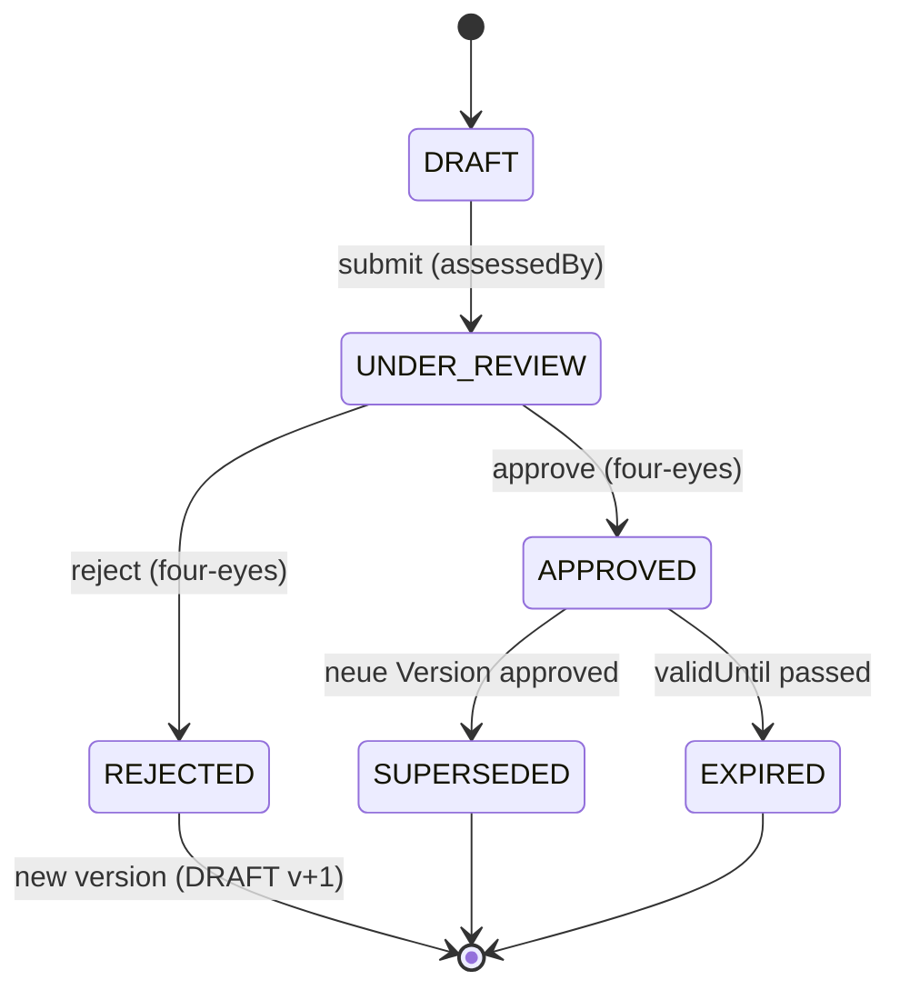

# Legal Basis Assessment — Professional Model

**Prompt:** 7 von 44  
**Datum:** 2026-07-23  
**Migration:** `20260723233000_legal_basis_assessment_professional`

---

## Grundsatz

SynqDrive **dokumentiert** Rechtsgrundlagen und **prüft technische Voraussetzungen** — es erfolgt **keine automatische juristische Bestimmung**. Das System kann Aktivierungen blockieren, ersetzt aber keine juristische Bewertung.

---

## Unterstützte Rechtsgrundlagen (`PrivacyLegalBasisType`)

| Typ | Art. 6 DSGVO | Technische Pflichtfelder |
|-----|--------------|--------------------------|
| `CONTRACT` | (1)(b) | `necessityAssessment` |
| `LEGAL_OBLIGATION` | (1)(c) | — |
| `LEGITIMATE_INTERESTS` | (1)(f) | `legitimateInterestDescription`, `balancingTestReference` |
| `CONSENT` | (1)(a) | `consentRequirement` ≠ `NOT_APPLICABLE` |
| `VITAL_INTERESTS` | (1)(d) | — |
| `PUBLIC_TASK` | (1)(e) | — |
| `OTHER_WITH_LEGAL_REFERENCE` | Sonstige | `legalReference` |

---

## Fachliche Aktivierungsgates

| Gate | Regel |
|------|-------|
| **G-LBA-01** | `CONSENT` ohne definierte `consentRequirement` → nicht submittable |
| **G-LBA-02** | `LEGITIMATE_INTERESTS` ohne Interessenabwägung → nicht submittable |
| **G-LBA-03** | `CONTRACT` ohne `necessityAssessment` → nicht submittable |
| **G-LBA-04** | `OTHER_WITH_LEGAL_REFERENCE` ohne `legalReference` → nicht submittable |
| **G-LBA-05** | Vier-Augen: `approvedByUserId` ≠ `assessedByUserId` |
| **G-LBA-06** | Keine direkte Aktivierung aus `DRAFT` |
| **G-LBA-07** | Aktive `ProcessingActivity` benötigt ≥1 gültiges `APPROVED` Assessment |
| **G-LBA-08** | Abgelaufene Assessments (`validUntil` < now) erlauben keine neue Verarbeitung |
| **G-LBA-09** | `APPROVED` Assessments sind unveränderlich — materielle Änderung → neue Version |

---

## Statusübergänge

| Von | Nach | Aktion | Permission |
|-----|------|--------|------------|
| `DRAFT` | `UNDER_REVIEW` | `POST .../submit` | `write` |
| `UNDER_REVIEW` | `APPROVED` | `POST .../approve` | `manage` |
| `UNDER_REVIEW` | `REJECTED` | `POST .../reject` | `manage` |
| `APPROVED`/`REJECTED` | `DRAFT` (v+1) | `POST .../new-version` | `write` |

---

## Versionierung

| Feld | Zweck |
|------|-------|
| `policyFamilyId` | Gruppiert alle Versionen einer Assessment-Familie |
| `versionNumber` | Monoton steigend pro Familie (1, 2, 3, …) |
| `isCurrentVersion` | Markiert die aktuelle Arbeits-/Gültigkeitsversion |

**Regeln:**

- Erste Erstellung: neue `policyFamilyId`, `versionNumber = 1`
- Materielle Änderung: `createNewVersion()` aus `APPROVED` oder `REJECTED`
- Bei `approve` neuer Version: vorherige `APPROVED` derselben Familie → `SUPERSEDED`
- Historische Versionen werden **nicht** überschrieben

---

## API

Base: `/api/v1/organizations/:orgId/processing-activities/:activityId/legal-basis-assessments`

| Method | Path | Beschreibung |
|--------|------|--------------|
| GET | `/` | Liste |
| GET | `/:assessmentId` | Detail |
| POST | `/` | Create DRAFT v1 |
| PATCH | `/:assessmentId` | Update (nur DRAFT) |
| POST | `/:assessmentId/submit` | DRAFT → UNDER_REVIEW |
| POST | `/:assessmentId/approve` | UNDER_REVIEW → APPROVED |
| POST | `/:assessmentId/reject` | UNDER_REVIEW → REJECTED |
| POST | `/:assessmentId/new-version` | Neue Version aus APPROVED/REJECTED |

---

## Code-Artefakte

| Pfad | Rolle |
|------|-------|
| `legal-basis-assessment.transitions.ts` | Statusübergänge + Content-Gates |
| `legal-basis-assessment.service.ts` | Lifecycle + Versionierung |
| `legal-basis-assessment.controller.ts` | REST API |
| `legal_basis_assessment_evidence_refs` | Evidence-Referenzen (kein JSON-Blob) |

---

## Testergebnisse (2026-07-23)

| Suite | Ergebnis |
|-------|----------|
| `legal-basis-assessment.transitions.spec.ts` | 8/8 PASS |
| `legal-basis-assessment.service.spec.ts` | 5/5 PASS |
| `privacy-domain.invariants.spec.ts` | 13/13 PASS |
| Gesamt data-authorization | 42/42 PASS |
