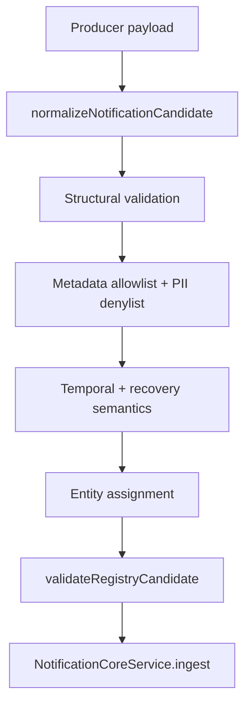

# Notification Candidate Contract

> **Status:** Production remediation Prompt 4 (2026-07) — strict ingest contract enforced at core boundary.  
> **Code:** `backend/src/modules/notifications/notification-candidate.contract.ts`  
> **Validator:** `notification-candidate.validator.ts`

## Purpose

All notification producers must emit a **canonical `NotificationCandidate`** before `NotificationCoreService.ingestCandidate()` persists anything. Invalid candidates are:

1. **Rejected** (no partial persistence)
2. **Logged** as structured JSON (`component: notification-candidate`)
3. **Counted** in Prometheus (`synqdrive_notification_candidate_rejected_total{field}`)

Legacy field aliases (`sourceType`/`sourceRef`/`conditionCode`/`titleKey`) remain supported and are normalized by `normalizeNotificationCandidate()`.

---

## Canonical contract (`schemaVersion: 1`)

| Field | Required | Description |
|-------|----------|-------------|
| `schemaVersion` | yes | Must be `1` (`NOTIFICATION_CANDIDATE_SCHEMA_VERSION`) |
| `organizationId` | yes | Tenant scope |
| `eventType` | yes | Registered registry code |
| `sourceSystem` | yes | Producer system (`NotificationSourceType`) — alias: `sourceType` |
| `sourceEventId` | conditional | Opaque producer event id; **required** for `RUNTIME`, `SYSTEM`, `WORKFLOW` |
| `entityType` | yes | `NotificationEntityType` |
| `entityId` | yes | Primary entity id (except org/fleet scoped rows) |
| `conditionKey` | yes | Stable condition within entity — alias: `conditionCode` |
| `occurredAt` | yes | When the fact/state change happened (producer clock) |
| `observedAt` | yes | When SynqDrive observed the fact; defaults to `occurredAt` |
| `severity` | yes | `CRITICAL` \| `WARNING` \| `INFO` \| `SUCCESS` |
| `recoveryState` | yes | `ACTIVE` \| `RECOVERED` (synced with severity) |
| `templateKey` | yes | i18n key (`notification.*`) — alias: `titleKey` |
| `bodyKey` | yes | i18n body key (`notification.*`) |
| `templateParams` | yes | Structured interpolation payload (may include display labels) |
| `vehicleId` | optional | Denormalized ref; must match `entityId` when `entityType=VEHICLE` |
| `bookingId` | optional | Denormalized ref; must match `entityId` when `entityType=BOOKING` |
| `stationId` | optional | Denormalized ref for station-scoped rows |
| `customerId` | optional | Denormalized ref for customer-scoped rows |
| `userId` | optional | Acting user for workflow-sourced events |
| `correlationId` | optional | Cross-service trace id |
| `causationId` | optional | Upstream causing event id |
| `metadata` | optional | Allowlisted operational keys only (no PII) |

### Materialization fields (registry-derived)

Producers using `buildCandidateFromRegistry()` also carry: `eventKind`, `domain`, `actionType`, `actionTarget`, `resolutionPolicy`, `deliveryPolicy`, `scopeVersion`.

---

## Validation rules

| Rule | Enforcement |
|------|-------------|
| `organizationId` non-empty | Hard reject |
| `eventType` registered | Registry lookup |
| `occurredAt` valid `Date` | Hard reject; never substituted by `generatedAt` |
| `observedAt >= occurredAt` | Hard reject |
| `observedAt` skew ≤ 24h from `occurredAt` | Hard reject |
| `schemaVersion === 1` | Hard reject |
| Free-text titles as identity | Rejected — only `notification.*` template keys |
| PII in `metadata` | Rejected (`email`, `phone`, `customerName`, …) |
| Unknown `metadata` keys | Rejected (allowlist in contract) |
| Entity ref mismatch | e.g. `vehicleId !== entityId` for `VEHICLE` |
| `SUCCESS` ↔ `RECOVERED` | Must match; `EVENT` kind cannot recover |
| `sourceEventId` for external producers | Required when `sourceSystem ∈ {RUNTIME, SYSTEM, WORKFLOW}` |

### Validation pipeline

---

## Producer interfaces

| Interface | Change |
|-----------|--------|
| `NotificationAdapterContext` | Added `sourceEventId`, `observedAt`, `correlationId`, `causationId` |
| `RegistryCandidateBuildInput` | Added canonical optional fields; populates full contract in `buildCandidateFromRegistry()` |
| `NotificationProducerAdapter` | Unchanged signature; adapters should pass `sourceEventId` via context |
| `insight-candidate.mapper` | Emits normalized contract via registry builder |
| `NotificationCandidateMetricsBinder` | Wires Prometheus rejection counter on module init |

---

## Metadata policy

**Allowlisted keys** (operational only): `runId`, `adapterId`, `dedupeKey`, `groupKey`, `complaintId`, `categoryKey`, `legalDocumentId`, `cleared`, `resolved`, `reason`, `codes`, …

**PII denylist:** `email`, `phone`, `firstName`, `lastName`, `customerName`, `address`, …

**Array values** allowed only for: `reasons`, `blockingReasons`, `codes` (string arrays).

---

## Metrics & logging

| Signal | Name |
|--------|------|
| Prometheus | `synqdrive_notification_candidate_rejected_total{field}` |
| Structured log | `{ component: "notification-candidate", field, reason, eventType, organizationId }` |

Production always logs rejections; development rejects without requiring metrics binding.

---

## Tests

| Suite | Coverage |
|-------|----------|
| `notification-candidate.contract.spec.ts` | Normalization, metadata PII/unknown keys |
| `notification-candidate.validator.spec.ts` | Org, entity, eventType, time, severity, metadata, recovery, sourceEventId |

---

## Related docs

- `docs/architecture/notification-event-registry.md`
- `docs/notification-engine-domain-contract.md`
