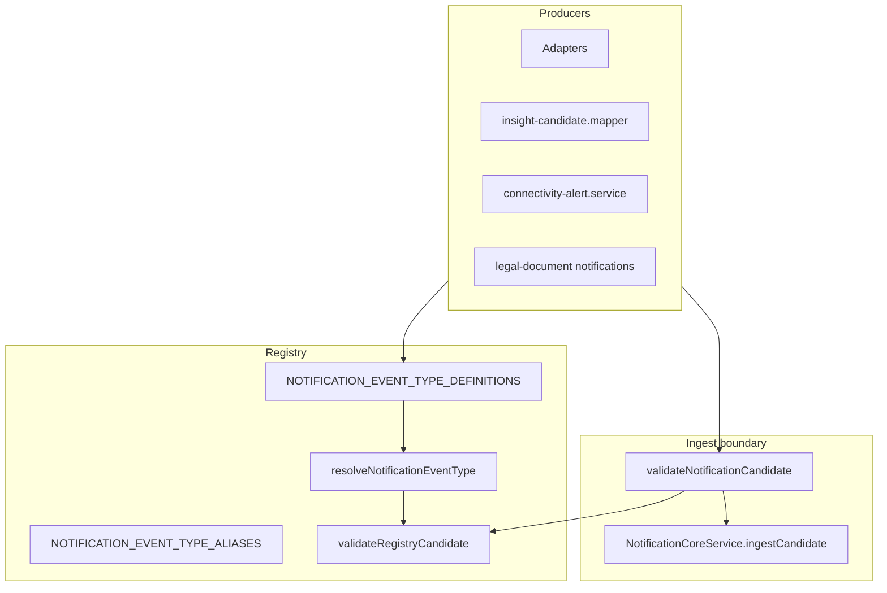

# Notification Event Registry — Canonical Source of Truth

> **Status:** Production remediation Prompt 3 (2026-07) — registry enforced at ingest boundary.  
> **Code:** `backend/src/modules/notifications/registry/`  
> **Legacy overview:** `docs/notification-engine-event-registry.md` (V4.9.353)

## Purpose

The notification event registry is the **only** authoritative catalog of notification `eventType` values. Producers must:

1. Use a registered `eventType` (or a documented alias resolved at validation time).
2. Build candidates via `buildCandidateFromRegistry()` + `validateRegistryCandidate()`, or pass through `validateNotificationCandidate()` which enforces the same rules at core ingest.
3. Never invent fingerprints, template keys, or generic fallback event types.

Unregistered event types are **rejected** in all environments. In production, rejections are additionally logged as structured JSON (`component: notification-registry`).

---

## Enforcement architecture



| Layer | File | Behaviour |
|-------|------|-----------|
| Definitions | `notification-event-registry.definitions.ts` | 46 core + 20 `LEGAL_*` = **66** event types |
| Aliases | `notification-event-registry.aliases.ts` | Producer synonym → canonical code |
| Slug aliases | `NOTIFICATION_EVENT_SLUG_ALIASES` | Kebab-case doc routing only |
| Build | `buildCandidateFromRegistry()` | Copies registry fields; rejects unknown types |
| Adapter validation | `validateRegistryCandidate()` | Domain, conditionCode, severity, template params, navigation |
| **Ingest validation** | `validateNotificationCandidate()` | Structural checks + **registry enforcement** |
| Consistency tests | `notification-event-registry.consistency.ts` | Static registry integrity (unique keys, severity rules) |
| Type union | `notification-event-type-codes.ts` | `NotificationEventTypeCode` compile-time guard |

---

## Event type aliases (consolidated synonyms)

| Producer / legacy string | Canonical `eventType` | Notes |
|--------------------------|----------------------|-------|
| `WEBHOOK_PROCESSING_FAILED` | `WEBHOOK_FAILURE` | Connectivity vocabulary; registry canonical |
| `pickup-overdue` (slug) | `PICKUP_OVERDUE` | Via `resolveEventSlug` |
| `return-overdue` (slug) | `RETURN_OVERDUE` | Via `resolveEventSlug` |
| `driving-assessment-recovered` (slug) | `DRIVING_ASSESSMENT_DEVICE_QUALITY` | Recovery uses SUCCESS severity on same fingerprint |

**Not aliases — distinct registry entries (do not merge):**

| Entry A | Entry B | Distinction |
|---------|---------|-------------|
| `REQUIRED_DOCUMENT_MISSING` | `LEGAL_REQUIRED_DOCUMENT_MISSING` | Legacy org-level bridge vs operational legal matrix |
| `COMPLIANCE_EXPIRED` | `TUV_OVERDUE` / `BOKRAFT_OVERDUE` | Generic compliance umbrella vs specific detectors |
| `RETURN_OVERDUE` | `RETURN_NEEDS_INSPECTION` | Overdue return (booking lifecycle) vs inspection workflow |

**Removed / rejected patterns:**

- Free-form event strings at ingest — **rejected** (no generic fallback type).
- Localized `titleKey` values (e.g. insight `title` text) — **rejected** at validation.
- `SERVICE_OVERDUE` condition code `overdue` — **replaced** by registry canonical `service_overdue`.

---

## Definition schema (per event type)

| Field | Description |
|-------|-------------|
| `slug` | Unique kebab-case documentation ID |
| `eventType` | Unique uppercase canonical code (fingerprint component) |
| `domain` | `NotificationDomain` |
| `defaultEntityType` | Default entity for fingerprint + navigation |
| `conditionCode` | Stable condition within entity scope |
| `fingerprintVersion` | `scopeVersion` in fingerprint (`vN`) |
| `eventKind` | `STATE` (persistent until cleared) or `EVENT` (point-in-time) |
| `defaultSeverity` | Initial severity |
| `allowedSeverityEscalations` | Permitted non-SUCCESS severities (SUCCESS is recovery-only) |
| `titleKey` / `bodyKey` | i18n keys (`notification.*`) |
| `requiredTemplateParams` | Mandatory interpolation fields |
| `actionType` / `actionTargetBuilder` | Navigation contract |
| `sourceType` | Default producer source |
| `resolutionPolicy` | Auto-resolve, reopen policy |
| `expiryPolicy` | EVENT TTL (typically 7d for transactional events) |
| `deliveryPolicy` | Channel defaults (IN_APP, EMAIL, PUSH) |
| `preferenceCategory` | User preference filter category |
| `supportedRoles` | Role visibility matrix |
| `retentionClass` | Derived at bootstrap: `OPERATIONAL_STATE` \| `SHORT_LIVED_EVENT` \| `TRANSIENT_EVENT` |
| `shadowModeEnabled` | Phase-1 shadow ingest allowed |
| `producerModule` | Owning SynqDrive module |

### Fingerprint rule

```
canonical = orgId | eventType | entityType | entityId | conditionCode | v{fingerprintVersion}
```

Variant suffixes (`conditionCode:variant`) are allowed when built via `conditionCodeVariant` (e.g. `ACTIVE_DTC:{code}`, `technical_observation_active:{id}`, connectivity episode scopes).

### Recovery behaviour

- **STATE** types: `SUCCESS` severity on ingest triggers resolve-by-fingerprint (recovery), not a new warning row.
- **EVENT** types: one-shot; no SUCCESS recovery path.
- Recovery may use alternate `titleKey` (e.g. `notification.title.drivingAssessmentRecovering`) while keeping the same fingerprint family.

### Reopen behaviour

STATE types use `STATE_RESOLUTION` with `DEFAULT_STATE_REOPEN_POLICY` (cooldown + max reopens). `STATION_SHORTAGE` uses `OPERATIONS_REOPEN` (30 min cooldown, max 5 reopens).

---

## Retention classes

| Class | Applies to | Policy |
|-------|-----------|--------|
| `OPERATIONAL_STATE` | All `STATE` event kinds | Retained until resolved/archived; core ops data |
| `SHORT_LIVED_EVENT` | `EVENT` + `expiryPolicy` (7d default) | Auto-expire; suitable for booking/telemetry one-shots |
| `TRANSIENT_EVENT` | `EVENT` without explicit expiry | Short inbox lifetime; rare |

---

## Shadow mode (phase 1 producers)

Only these types have `shadowModeEnabled: true`:

| eventType | Producer module |
|-----------|-----------------|
| `DRIVING_ASSESSMENT_DEVICE_QUALITY` | vehicle-intelligence |
| `STATION_SHORTAGE` | business-insights |
| `TECHNICAL_OBSERVATION_ACTIVE` | vehicle-complaints |

---

## Registered event types (66)

### Operations & handovers

| eventType | Domain | Kind | Default severity | conditionCode | Producer module |
|-----------|--------|------|------------------|---------------|-----------------|
| `STATION_SHORTAGE` | OPERATIONS | STATE | WARNING | `shortage` | business-insights |
| `BLOCKED_VEHICLE` | OPERATIONS | STATE | WARNING | `blocked_vehicle` | operations |
| `VEHICLE_NOT_READY` | OPERATIONS | STATE | WARNING | `vehicle_not_ready` | operations |
| `MAINTENANCE_REQUIRED` | OPERATIONS | STATE | WARNING | `maintenance_required` | operations |
| `LOW_UTILIZATION` | OPERATIONS | STATE | INFO | `low_utilization` | business-insights |
| `PICKUP_OVERDUE` | HANDOVERS | STATE | WARNING | `pickup_overdue` | business-insights |
| `RETURN_OVERDUE` | HANDOVERS | STATE | WARNING | `return_overdue` | bookings (supplemental UI) |
| `TIGHT_HANDOVER` | HANDOVERS | STATE | WARNING | `tight_handover` | business-insights |
| `RETURN_NEEDS_INSPECTION` | HANDOVERS | STATE | WARNING | `return_inspection` | business-insights |
| `SERVICE_BEFORE_BOOKING` | HANDOVERS | STATE | WARNING | `service_before_booking` | business-insights |
| `PICKUP_DUE` | HANDOVERS | EVENT | INFO | `pickup_due` | bookings |
| `RETURN_DUE` | HANDOVERS | EVENT | INFO | `return_due` | bookings |
| `HANDOVER_INCOMPLETE` | HANDOVERS | STATE | WARNING | `handover_incomplete` | bookings |

### Vehicle health

| eventType | Domain | Kind | Default severity | conditionCode | Producer module |
|-----------|--------|------|------------------|---------------|-----------------|
| `ACTIVE_DTC` | VEHICLE_HEALTH | STATE | WARNING | `active_dtc` (+ code variant) | vehicle-intelligence |
| `BATTERY_CRITICAL` | VEHICLE_HEALTH | STATE | CRITICAL | `battery_critical` | business-insights |
| `TIRE_CRITICAL` | VEHICLE_HEALTH | STATE | CRITICAL | `tires_critical` | business-insights |
| `BRAKE_CRITICAL` | VEHICLE_HEALTH | STATE | CRITICAL | `brakes_critical` | business-insights |
| `COMPLIANCE_EXPIRED` | VEHICLE_HEALTH | STATE | WARNING | `compliance_expired` | business-insights (reserved) |
| `SERVICE_OVERDUE` | VEHICLE_HEALTH | STATE | WARNING | `service_overdue` | business-insights |
| `SERVICE_WINDOW` | VEHICLE_HEALTH | STATE | INFO | `service_window` | business-insights |
| `TUV_OVERDUE` | VEHICLE_HEALTH | STATE | WARNING | `tuv_overdue` | business-insights |
| `BOKRAFT_OVERDUE` | VEHICLE_HEALTH | STATE | WARNING | `bokraft_overdue` | business-insights |
| `HM_SERVICE_NO_TRACKING` | VEHICLE_HEALTH | STATE | INFO | `hm_no_tracking` | business-insights |
| `TECHNICAL_OBSERVATION_ACTIVE` | VEHICLE_HEALTH | STATE | WARNING | `technical_observation_active` (+ id variant) | vehicle-complaints |

### Driving analysis

| eventType | Domain | Kind | Default severity | conditionCode | Producer module |
|-----------|--------|------|------------------|---------------|-----------------|
| `DRIVING_ASSESSMENT_DEVICE_QUALITY` | DRIVING_ANALYSIS | STATE | WARNING | `driving_assessment_device_quality` | vehicle-intelligence |
| `TRIP_ANALYSIS_COMPLETED` | DRIVING_ANALYSIS | EVENT | INFO | `trip_analysis_completed` | vehicle-intelligence |
| `MISUSE_DETECTED` | DRIVING_ANALYSIS | STATE | WARNING | `misuse_detected` | vehicle-intelligence |
| `POSSIBLE_IMPACT` | DRIVING_ANALYSIS | STATE | WARNING | `possible_impact` | vehicle-intelligence |
| `DATA_QUALITY_LIMITED` | DRIVING_ANALYSIS | STATE | INFO | `data_quality_limited` | vehicle-intelligence |

### Bookings

| eventType | Domain | Kind | Default severity | conditionCode | Producer module |
|-----------|--------|------|------------------|---------------|-----------------|
| `BOOKING_CREATED` | BOOKINGS | EVENT | INFO | `booking_created` | bookings |
| `BOOKING_UPDATED` | BOOKINGS | EVENT | INFO | `booking_updated` | bookings |

### Documents & legal (21 types)

| eventType | Scope | Notes |
|-----------|-------|-------|
| `REQUIRED_DOCUMENT_MISSING` | ORG | Legacy bridge; prefer `LEGAL_*` for new work |
| `LEGAL_REQUIRED_DOCUMENT_MISSING` | ORG | Operational legal matrix |
| `LEGAL_REQUIRED_LANGUAGE_MISSING` | ORG | |
| `LEGAL_REQUIRED_JURISDICTION_MISSING` | ORG | |
| `LEGAL_APPROVAL_PENDING` | ORG | |
| `LEGAL_ACTIVATION_SCHEDULED` | ORG | |
| `LEGAL_DOCUMENT_EXPIRING_SOON` | ORG | |
| `LEGAL_SCAN_FAILED` | ORG | |
| `LEGAL_INTEGRITY_CHECK_FAILED` | ORG | |
| `LEGAL_BUNDLE_INCOMPLETE` | BOOKING | |
| `LEGAL_DOCUMENT_DELIVERY_FAILED` | BOOKING | |
| `LEGAL_PICKUP_BLOCKED_MISSING_PROOF` | BOOKING | |
| `LEGAL_TECH_*` (8 types) | ORG | Admin-only technical alerts |

### Billing

| eventType | Domain | Kind | Default severity |
|-----------|--------|------|------------------|
| `PAYMENT_FAILED` | BILLING | STATE | CRITICAL |
| `INVOICE_OVERDUE` | BILLING | STATE | WARNING |
| `DEPOSIT_PROBLEM` | BILLING | STATE | WARNING |

### System / connectivity

| eventType | Domain | Kind | Default severity | conditionCode |
|-----------|--------|------|------------------|---------------|
| `INTEGRATION_DISCONNECTED` | SYSTEM | STATE | CRITICAL | `integration_disconnected` |
| `TELEMETRY_OFFLINE` | SYSTEM | STATE | WARNING | `telemetry_offline` |
| `TELEMETRY_SOFT_OFFLINE` | SYSTEM | STATE | WARNING | `telemetry_soft_offline` |
| `DEVICE_UNPLUGGED` | SYSTEM | STATE | WARNING | `device_unplugged` |
| `DEVICE_RECONNECTED` | SYSTEM | EVENT | INFO | `device_reconnected` |
| `AUTHORIZATION_REQUIRED` | SECURITY | STATE | WARNING | `authorization_required` |
| `DATA_SOURCE_DISCONNECTED` | SYSTEM | STATE | WARNING | `data_source_disconnected` |
| `DATA_COVERAGE_INSUFFICIENT` | SYSTEM | STATE | INFO | `data_coverage_insufficient` |
| `DEVICE_BINDING_CHANGED` | SYSTEM | EVENT | INFO | `device_binding_changed` |
| `CONNECTIVITY_STATE_UNKNOWN` | SYSTEM | STATE | INFO | `connectivity_state_unknown` |
| `WEBHOOK_FAILURE` | SYSTEM | EVENT | WARNING | `webhook_failure` |

---

## Workflow & delivery suitability

| Suitability | Rule |
|-------------|------|
| **Workflow** | `sourceType === WORKFLOW` or `producerModule === bookings` — suitable for booking/handover workflow hooks |
| **Delivery** | `deliveryPolicy.channels.length > 0` — all registered types support at least IN_APP |
| **Critical delivery** | `BATTERY_CRITICAL`, `TIRE_CRITICAL`, `BRAKE_CRITICAL`, `ACTIVE_DTC`, `PAYMENT_FAILED`, `INTEGRATION_DISCONNECTED`, `LEGAL_TECH_*` — EMAIL/PUSH capable |

---

## Validation rules summary

| Check | Failure mode |
|-------|--------------|
| Unknown `eventType` | Reject (+ prod log) |
| Domain / eventKind / conditionCode mismatch | Reject |
| Severity not in `allowedSeverityEscalations` | Reject (SUCCESS exempt for recovery) |
| Missing `requiredTemplateParams` | Reject |
| Incomplete navigation target when `requiresNavigation` | Reject |
| Non-`notification.*` titleKey/bodyKey | Reject |
| Duplicate `eventType` or `slug` at bootstrap | Process crash (registry load) |

---

## Tests

| Suite | Coverage |
|-------|----------|
| `notification-event-registry.spec.ts` | Known types, aliases, fingerprints, consistency, shadow mode |
| `notification-candidate.validator.spec.ts` | Structural + registry enforcement, unknown types, insight mapper |
| `notification-core.service.spec.ts` | Ingest with registry-aligned fixtures |

---

## Related documentation

- `docs/audits/notification-engine-remediation-baseline-2026-07.md`
- `docs/audits/notification-engine-data-flow-map-2026-07.md`
- `docs/notification-engine-event-registry.md` (original V4.9.353 reference)
- `architecture/LEGAL_DOCUMENT_OPERATIONAL_NOTIFICATIONS_2026-07-22.md`
