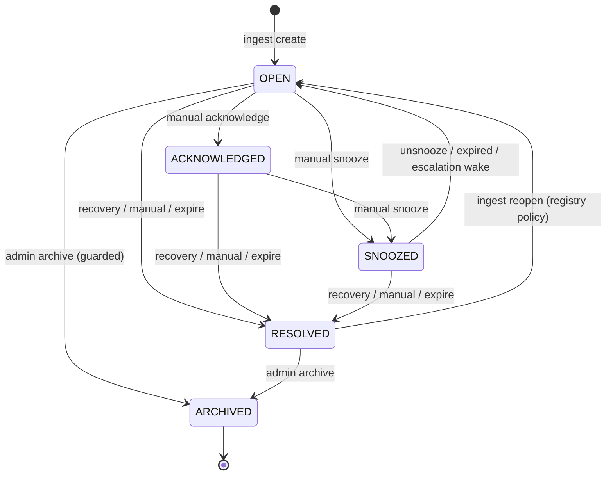

# Notification Lifecycle State Machine

**Module:** `backend/src/modules/notifications/lifecycle`  
**Status:** Production (Notification Engine Remediation — Prompt 8)

## Scope

Org-wide lifecycle statuses on `notifications.status`:

| Status | Meaning |
|--------|---------|
| `OPEN` | Active, unacknowledged |
| `ACKNOWLEDGED` | Cause seen — **does not clear underlying condition** |
| `SNOOZED` | Temporarily deprioritized — **CRITICAL escalation wakes** |
| `RESOLVED` | Condition cleared or manually resolved |
| `ARCHIVED` | Administrative terminal state |

**`READ` is not a lifecycle status** — per-user read state lives on `notification_receipts.read_at`.

## Allowed transitions

| From | To | Trigger | Roles |
|------|-----|---------|-------|
| OPEN | ACKNOWLEDGED | Manual acknowledge | ORG_ADMIN, SUB_ADMIN, WORKER |
| OPEN | SNOOZED | Manual snooze | ORG_ADMIN, SUB_ADMIN, WORKER |
| OPEN | RESOLVED | Recovery ingest / manual / auto-expire | SYSTEM, ORG_ADMIN, SUB_ADMIN, WORKER |
| OPEN | ARCHIVED | Manual archive | ORG_ADMIN, SUB_ADMIN |
| ACKNOWLEDGED | SNOOZED | Manual snooze | ORG_ADMIN, SUB_ADMIN, WORKER |
| ACKNOWLEDGED | RESOLVED | Recovery / manual / expire | SYSTEM, ORG_ADMIN, SUB_ADMIN, WORKER |
| SNOOZED | OPEN | Unsnooze / snooze expired / ingest wake | SYSTEM, ORG_ADMIN, SUB_ADMIN, WORKER |
| SNOOZED | RESOLVED | Recovery / manual / expire | SYSTEM, ORG_ADMIN, SUB_ADMIN, WORKER |
| RESOLVED | OPEN | Ingest reopen (registry policy) | SYSTEM |
| RESOLVED | ARCHIVED | Manual archive | ORG_ADMIN, SUB_ADMIN |

## Forbidden transitions (examples)

- ARCHIVED → *
- RESOLVED → OPEN (without `reopenAuthorized`)
- RESOLVED → SNOOZED / ACKNOWLEDGED
- OPEN → ARCHIVED (without admin + archive guardrails)
- ACKNOWLEDGED → OPEN
- SNOOZED → ACKNOWLEDGED / ARCHIVED

## Ingest side-effects

| Current status | New occurrence | Severity escalation | Recovery |
|----------------|----------------|---------------------|----------|
| OPEN | Update in place | Escalate | → RESOLVED |
| ACKNOWLEDGED | Update in place (stays ACK) | Escalate | → RESOLVED |
| SNOOZED | Wake→OPEN if expired or escalated | Escalate + wake | → RESOLVED |
| RESOLVED | Reopen policy | — | Ignored if already resolved |
| ARCHIVED | Ignored | — | — |

**Recovery** never creates a new active SUCCESS notification — it resolves the active row.

**Reopen** follows registry reopen policy (`evaluateReopenDecision`).

## Mermaid

## Implementation

- `notification-lifecycle.state-machine.ts` — canonical catalog + helpers
- `notification-status.transitions.ts` — backward-compatible re-export
- `NotificationCoreService` — all org-wide transitions via `assertNotificationStatusTransition`

## Tests

`notification-lifecycle.state-machine.spec.ts` — full allowed/forbidden matrix, snooze expiry, role rules, archive guardrails.
