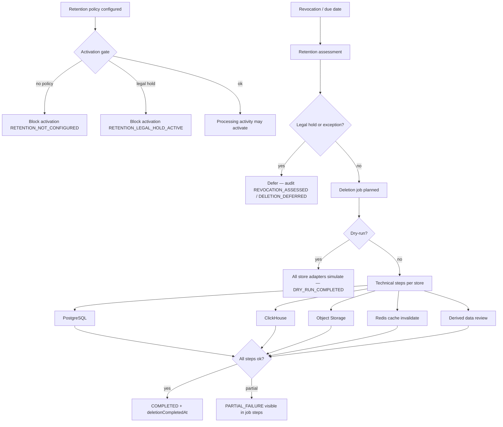

# Retention, Deletion & Legal Hold (Prompt 32)

**Date:** 2026-07-24  
**Version:** V4.9.815  
**Migration:** `20260724120000_retention_deletion_legal_hold`

## Scope

Per-`ProcessingActivity` and per-data-category retention and deletion governance.  
**No global hardcoded retention period** — each policy row is explicitly configured.  
**No automatic legal deletion decision** — technical execution follows governance decisions and gates.

## Retention matrix

| Field | Model column | Notes |
|-------|--------------|-------|
| `retentionClass` | `retention_class` | `OPERATIONAL`, `TELEMETRY`, `ANALYTICS`, `AUDIT_EVIDENCE`, `LEGAL_EVIDENCE`, `CUSTOMER_DATA`, `FINANCIAL` |
| `retentionDuration` | `retention_duration_days` | Optional day count — no platform-wide default |
| `retentionStartEvent` | `retention_start_event` | Anchor event (`PROCESSING_START`, `CONSENT_WITHDRAWAL`, …) |
| `deletionMethod` | `deletion_method` | `HARD_DELETE`, `ANONYMIZE`, `REDACT`, `ARCHIVE_THEN_DELETE` |
| `anonymizationAllowed` | `anonymization_allowed` | Required gate for `ANONYMIZE` |
| `legalHold` | `legal_hold` | Blocks activation and deletion |
| `legalHoldReason` | `legal_hold_reason` | Free-text hold reason |
| `legalHoldOwnerUserId` | `legal_hold_owner_user_id` | Responsible user |
| `deletionDueAt` | `deletion_due_at` | Scheduler input |
| `deletionCompletedAt` | `deletion_completed_at` | Set only after full non-dry success |
| `deletionEvidence` | `processing_activity_deletion_evidence` | Counts/hashes only — **no re-stored PII** |
| `exceptions` | `processing_activity_retention_exceptions` | Extends retention until `extendsUntil` |

Unique key: `(processingActivityId, dataCategory, retentionClass)`.

## Deletion paths



### Store adapters

| Target | Behavior |
|--------|----------|
| `POSTGRESQL` | Tenant-scoped `deleteMany` / anonymization on register exports |
| `CLICKHOUSE` | Checks `ClickHouseService.getStatus()` first — **no Docker assumption**; `NOT_APPLICABLE` when unconfigured |
| `OBJECT_STORAGE` | Prefix-hash evidence only |
| `REDIS_CACHE` | `AuthorizationDecisionService.invalidateOrganizationCache` — **not full deletion** |
| `DERIVED_DATA` | Dry-run plans review; apply skips with `DERIVED_REQUIRES_MANUAL_REVIEW` |

## Governance vs technical deletion

| Layer | Table | Purpose |
|-------|-------|---------|
| Governance decision | `processing_activity_deletion_decisions` | Append-only: configured, assessed, blocked, executed, deferred |
| Technical job | `processing_activity_deletion_jobs` | Idempotent job with `idempotencyKey` |
| Technical step | `processing_activity_deletion_job_steps` | Per-store outcome, errors, row counts |
| Evidence | `processing_activity_deletion_evidence` | Counts/hashes — no PII content |

## Activation gate

`RetentionActivationGateService` wired into `PolicyLifecycleActivationGuardService`:

- `RETENTION_NOT_CONFIGURED` — no configured policy
- `RETENTION_INCOMPLETE` — category gaps without activity-wide policy
- `RETENTION_LEGAL_HOLD_ACTIVE` — hold blocks activation

Env: `RETENTION_REQUIRE_FOR_ACTIVATION` (default `true`).

## Scheduler

`RetentionDeletionSchedulerService`:

- Polls policies with `deletionDueAt <= now`, `legalHold = false`, `deletionCompletedAt IS NULL`
- Tenant-scoped batches (`RETENTION_DELETION_BATCH_SIZE`, default 50)
- Respects active exceptions
- Default scheduler dry-run: `RETENTION_DELETION_SCHEDULER_DRY_RUN` (default `true`)

## API

Base: `GET/POST/PATCH .../organizations/:orgId/processing-activities/:activityId/retention-deletion/*`

| Permission | Action |
|------------|--------|
| `data_processing.retention_view` | List policies, jobs, decisions, config |
| `data_processing.retention_edit` | Upsert policy, add exceptions |
| `data_processing.retention_legal_hold` | Set/clear legal hold |
| `data_processing.retention_delete` | Run deletion job (dry-run or apply) |

## Technical prerequisites

1. **PostgreSQL** — migration `20260724120000` applied
2. **ClickHouse** — optional; `CLICKHOUSE_URL` set and runtime available; table registry with `org_id` columns
3. **Object Storage** — adapter records prefix-hash evidence; full purge wiring is deployment-specific
4. **Redis** — cache invalidation via existing authorization decision cache
5. **Prisma generate** after schema pull

Env flags:

| Variable | Default | Purpose |
|----------|---------|---------|
| `RETENTION_DELETION_ENABLED` | `true` | Master switch |
| `RETENTION_DELETION_DRY_RUN` | `true` | API default dry-run |
| `RETENTION_DELETION_SCHEDULER_ENABLED` | `true` | Scheduler on |
| `RETENTION_DELETION_SCHEDULER_DRY_RUN` | `true` | Scheduler applies dry-run by default |
| `RETENTION_REQUIRE_FOR_ACTIVATION` | `true` | Activation gate |

## Recovery

| Scenario | Recovery |
|----------|----------|
| `PARTIAL_FAILURE` job | Inspect `processing_activity_deletion_job_steps`; fix store; re-run with same idempotency key — completed steps are skipped |
| Legal hold set in error | `PATCH .../legal-hold` with `active: false`; audit trail preserved |
| ClickHouse unavailable | Step `SKIPPED`; no false COMPLETED claim for mutations |
| Wrong tenant attempt | Org-scoped queries return 404 — no cross-tenant mutation |
| Repeated job | Idempotent replay returns existing job with `idempotentReplay: true` |
| Evidence audit | `processing_activity_deletion_evidence` retains counts only |

## Test results

```bash
cd backend && npm run test:data-auth:retention
```

| Scenario | Status |
|----------|--------|
| Normal deletion (PG, CH, OS, Redis) | ✅ |
| Anonymization | ✅ |
| Legal hold blocks deletion + activation | ✅ |
| ClickHouse not configured / unavailable | ✅ |
| Object Storage evidence | ✅ |
| PostgreSQL tenant scope | ✅ |
| Redis not full deletion | ✅ |
| Partial failure visible | ✅ |
| Idempotent retry | ✅ |
| Wrong tenant | ✅ |
| Dry-run | ✅ |
| Revocation assessment (no blind delete) | ✅ |
| Decision vs step separation | ✅ |

## Disclaimer

Retention and deletion tooling provides technical governance support. It does **not** replace legal assessment of retention periods, legal holds, or erasure obligations.
