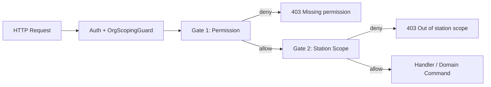

# Stations V2 — Permissions und Station Scope

**Version:** 1.0  
**Date:** 2026-07-17  
**Status:** **Normativ für zukünftige Implementierung** — keine produktive Umsetzung in diesem Dokument  
**Repository-Git-Commit (Erstellung):** wird beim Abschluss von Prompt 5/78 dokumentiert  
**Basis:**

- [`stations-v2.md`](./stations-v2.md) (Schicht 4 — Station Access und Scope)
- [`stations-v2-domain-glossary.md`](./stations-v2-domain-glossary.md) (Begriffe Stationsscope)
- [`stations-v2-execution-contract.md`](./stations-v2-execution-contract.md) (Invarianten R6, R7)
- [`../audits/stations-v2-implementation-inventory.md`](../audits/stations-v2-implementation-inventory.md) (Ist: kein `PermissionsGuard` auf Controller)

**Prinzip:** **Zwei unabhängige Gates** — (1) **Permission** (darf die Aktion grundsätzlich?) und (2) **Station Scope** (auf welche Stationen bezieht sie sich?). Beide müssen passieren. **Org-Mitgliedschaft allein reicht nicht.**

**Ist-Widerspruch:** Heute nutzt das Backend das grobe Modul `stations` mit `{ read, write, manage }`; `ORG_ADMIN` und `MASTER_ADMIN` umgehen Teile der Permission-Prüfung still. V2 ersetzt das durch explizite Permissions und dokumentierte Scope-Modi ohne versteckte Bypasses.

---

## Inhaltsverzeichnis

| # | Abschnitt |
|---|-----------|
| 0 | Zweck und Geltungsbereich |
| 1 | Zwei-Gate-Modell |
| 2 | Kanonische Permissions |
| 3 | Permission → Endpoint / Command Mapping |
| 4 | Station-Scope-Modi |
| 5 | Scope-Auflösung (`:id` / `stationId`) |
| 6 | Rollen-Matrix |
| 7 | Scope-Matrix pro Rolle |
| 8 | Nested Resources und KPIs |
| 9 | Master Admin und Org Admin |
| 10 | Speicher- und JWT-Vertrag |
| 11 | Migration vom Ist-Modul `stations` |
| 12 | Abnahmekriterien |
| 13 | Referenzen |

---

## 0. Zweck und Geltungsbereich

Dieses Dokument definiert die **Ziel-Permission- und Scope-Policy** für das Stations-Modul in SynqDrive V2.

**Geltung:**

- Alle Routen unter `/api/v1/organizations/:orgId/stations/**`
- Nested Reads/Writes, die eine `stationId` oder Stations-Kontext benötigen (Fleet, Bookings, KPIs, Mapbox-Geocode, Vehicle-Station-Commands)
- Frontend-Sichtbarkeit spiegelt **dieselbe** Policy — UI blendet nur ein, was die API nach beiden Gates erlauben würde

**Nicht Gegenstand:**

- Nicht-Station-Module (`bookings`, `fleet`, …) — nur Stations-spezifische Permissions
- Platform-Admin-`pruneMasterData` (separater Ops-Pfad)

---

## 1. Zwei-Gate-Modell



| Gate | Frage | Quelle |
|------|-------|--------|
| **1 — Permission** | Darf dieser User diese **Aktionsart** in dieser Org ausführen? | `OrganizationMembership.permissions` → V2-Key `stations.*` |
| **2 — Station Scope** | Darf er sie auf **diese Station(en)** anwenden? | `stationScopeMode` + `stationIds` / `stationScope` |

**Regeln:**

| ID | Regel |
|----|-------|
| **PG-01** | Permission und Scope sind **getrennte** Gates — kein Ersatz des anderen. |
| **PG-02** | Aktive **Org-Mitgliedschaft** ist notwendig, aber **nicht hinreichend** — Permission und Scope müssen explizit erfüllt sein. |
| **PG-03** | **Listen, KPIs und Nested Resources** werden **immer** nach Scope gefiltert — auch wenn Gate 1 global read erlaubt. |
| **PG-04** | `:id` (Route) und `stationId` (Body/Query) werden **einheitlich** auf dieselbe Scope-Prüfung gemappt (§5). |
| **PG-05** | **Master Admin** und **Org Admin** haben **keine stillen Sonderpfade** außerhalb der in §6/§9 dokumentierten Matrix. |

---

## 2. Kanonische Permissions

Permissions sind **punktnotierte Keys** im Modul `stations`. Sie werden in `membership.permissions.stationsV2` (Ziel) oder einem äquivalenten strukturierten JSON gespeichert — **nicht** implizit aus `MembershipRole` abgeleitet.

| Permission | Bedeutung | Typische HTTP-Methode |
|------------|-----------|------------------------|
| `stations.read` | Stationen listen, Detail, Stats, Fleet/Bookings lesen, Mapbox-Suche lesen | GET |
| `stations.create` | Neue Station anlegen | POST `/stations` |
| `stations.update_master_data` | Stammdaten (Name, Adresse, Kontakt, Notizen) | PATCH Master-Felder |
| `stations.manage_operations` | Capabilities, Kapazität, Geofence-Radius, Öffnungskalender | PATCH Capabilities/Calendar |
| `stations.activate` | Station auf `ACTIVE` setzen (inkl. Restore-Effekt) | POST restore / Status-Command |
| `stations.deactivate` | Station auf `INACTIVE` setzen | Status-Command |
| `stations.archive` | Station archivieren | POST `.../archive` |
| `stations.restore` | Archivierte Station wiederherstellen | POST `.../restore` |
| `stations.set_primary` | Hauptstation setzen | POST `.../set-primary` |
| `stations.manage_home_fleet` | Heimat-Zuordnung, Bulk-Home-Fleet | PUT home-fleet, assign-home |
| `stations.manage_current_location` | Physischen Standort bestätigen/ändern | PATCH current-station, confirm-presence |
| `stations.manage_transfers` | Erwartete Station / Transfer-Flow | expected-Commands |
| `stations.manage_team` | Stationsverantwortlicher, später Staff-Tab | Master Data `managerName` + Zukunft Staff |
| `stations.view_activity` | Stations-Audit / Activity lesen | GET activity |
| `stations.geocode` | Koordinaten-Backfill, Mapbox-Retrieve mit Schreibwirkung | POST backfill-coordinates |

### 2.1 Abhängigkeiten (empfohlen)

| Permission | Erfordert mindestens |
|------------|---------------------|
| Jede Write-Permission | `stations.read` (implizit oder explizit geprüft) |
| `stations.restore` | `stations.read` |
| `stations.set_primary` | `stations.read`, `stations.manage_operations` |
| `stations.manage_home_fleet` | `stations.read` |
| `stations.manage_current_location` | `stations.read` |
| `stations.manage_transfers` | `stations.read` |
| `stations.geocode` | `stations.read`, `stations.update_master_data` |

### 2.2 Verbotene Kompensation

| Verboten | Grund |
|----------|-------|
| `MembershipRole.ORG_ADMIN` ohne explizite Permissions in JSON | PG-05 |
| `stations.write` als Sammel-Ersatz für granulare Keys in V2 | Auditierbarkeit |
| Scope `ALL_STATIONS` ohne `stations.read` | PG-01 |

---

## 3. Permission → Endpoint / Command Mapping

| Endpoint / Command | Permission |
|--------------------|------------|
| `GET /stations`, `GET /stations/stats` | `stations.read` |
| `GET /stations/:id` | `stations.read` |
| `GET /stations/:id/overview-stats` | `stations.read` |
| `GET /stations/:id/fleet` | `stations.read` |
| `GET /stations/:id/bookings` | `stations.read` |
| `GET /stations/search/mapbox` | `stations.read` |
| `GET /stations/search/mapbox/:mapboxId` | `stations.read` |
| `POST /stations` | `stations.create` |
| `PATCH /stations/:id` (Master Data) | `stations.update_master_data` |
| `PATCH /stations/:id` (Capabilities/Calendar) | `stations.manage_operations` |
| `POST /stations/:id/archive` | `stations.archive` |
| `POST /stations/:id/restore` | `stations.restore` |
| `POST /stations/:id/set-primary` | `stations.set_primary` |
| `PUT /stations/:id/vehicles` / Bulk home | `stations.manage_home_fleet` |
| `POST /stations/:id/assign-vehicle` (home) | `stations.manage_home_fleet` |
| `PATCH /stations/vehicles/current-station` | `stations.manage_current_location` |
| `POST .../assign-vehicle` (expected) | `stations.manage_transfers` |
| `PATCH .../managerName` | `stations.manage_team` |
| `GET .../activity` (Ziel) | `stations.view_activity` |
| `POST /stations/backfill-coordinates` | `stations.geocode` |
| `DELETE /stations/:id` | **deprecated** → erfordert `stations.archive` |

---

## 4. Station-Scope-Modi

Scope ist **unabhängig** von Permissions und beschreibt **welche Stationen** sichtbar/bearbeitbar sind.

| Modus | Konstante | Bedeutung |
|-------|-----------|-----------|
| **Alle Stationen** | `ALL_STATIONS` | Volle Org-Sicht auf alle nicht gelöschten Stationen (nach Permission gefiltert) |
| **Zugewiesene Stationen** | `ASSIGNED_STATIONS` | Nur Stationen in `membership.stationIds` (oder legacy `stationScope` = einzelne UUID) |
| **Keine Stationen** | `NO_STATIONS` | Kein Stationszugriff — alle Stations-Reads/Writes schlagen fehl (403), unabhängig von Einzelpermissions |

### 4.1 Auflösung `ASSIGNED_STATIONS`

```
allowedStationIds =
  if membership.stationIds is non-empty array → stationIds
  else if membership.stationScope is UUID → [stationScope]
  else → []  // behandelt als NO_STATIONS wenn Modus ASSIGNED_STATIONS
```

Legacy `stationScope = 'ALL'` mappt auf Modus `ALL_STATIONS`.

### 4.2 Modus-Zuweisung (Default pro Rolle)

Siehe §7 — überschreibbar nur durch Org-Admin in Users/Roles UI, nicht still durch Rolle allein.

---

## 5. Scope-Auflösung (`:id` / `stationId`)

### 5.1 Einheitliche Resolver-Funktion (Ziel)

```typescript
function resolveStationIdFromRequest(req: Request): string | null {
  return (
    req.params?.id ??           // /stations/:id
    req.params?.stationId ??    // generische Nested-Routen
    req.body?.stationId ??
    req.query?.stationId ??
    null
  );
}
```

| Regel | Detail |
|-------|--------|
| **SR-01** | Alle genannten Quellen sind **äquivalent** für Scope-Check. |
| **SR-02** | Listen ohne Station-ID: `WHERE stationId IN allowedStationIds` oder kein Filter bei `ALL_STATIONS`. |
| **SR-03** | Body-`stationId` bei Vehicle-Commands: Scope auf **Ziel-Station** prüfen. |
| **SR-04** | `vehicleId`-only Endpoints: Scope über `vehicle.homeStationId` **oder** `currentStationId` **oder** `expectedStationId` — Fahrzeug sichtbar wenn **mindestens eine** Station im Scope (vgl. `NotificationStationScopeService`). |

### 5.2 `StationScopeGuard` (Ist → Ziel)

| Ist | Ziel |
|-----|------|
| Nur `params.stationId` | `resolveStationIdFromRequest` inkl. `:id` |
| Unwired | Auf alle Stations-Routen + Nested Writes |
| String-Vergleich `user.stationScope` | `StationScopeService.assertInScope(orgId, user, stationId)` |

---

## 6. Rollen-Matrix (Permissions)

Legende: **✓** = erlaubt · **—** = verweigert · **(S)** = nur innerhalb Station Scope

| Permission | Master Admin | Org Admin | Sub Admin | Station Manager | Worker | Driver | Read-only |
|------------|:------------:|:---------:|:---------:|:---------------:|:------:|:------:|:---------:|
| `stations.read` | ✓ | ✓ | ✓ | ✓ | ✓ (S) | — | ✓ (S) |
| `stations.create` | ✓ | ✓ | — | — | — | — | — |
| `stations.update_master_data` | ✓ | ✓ | ✓ (S) | ✓ (S) | — | — | — |
| `stations.manage_operations` | ✓ | ✓ | ✓ (S) | ✓ (S) | — | — | — |
| `stations.activate` | ✓ | ✓ | ✓ (S) | — | — | — | — |
| `stations.deactivate` | ✓ | ✓ | ✓ (S) | — | — | — | — |
| `stations.archive` | ✓ | ✓ | — | — | — | — | — |
| `stations.restore` | ✓ | ✓ | ✓ (S) | — | — | — | — |
| `stations.set_primary` | ✓ | ✓ | — | — | — | — | — |
| `stations.manage_home_fleet` | ✓ | ✓ | ✓ (S) | ✓ (S) | — | — | — |
| `stations.manage_current_location` | ✓ | ✓ | ✓ (S) | ✓ (S) | ✓ (S) | — | — |
| `stations.manage_transfers` | ✓ | ✓ | ✓ (S) | ✓ (S) | — | — | — |
| `stations.manage_team` | ✓ | ✓ | — | ✓ (S) | — | — | — |
| `stations.view_activity` | ✓ | ✓ | ✓ (S) | ✓ (S) | — | — | ✓ (S) |
| `stations.geocode` | ✓ | ✓ | ✓ (S) | ✓ (S) | — | — | — |

**Hinweise zur Matrix:**

- **Master Admin:** Platform-Rolle; Zugriff nur über **explizite** Tenant-Kontextwahl (`:orgId`) — kein anonymes Cross-Tenant-Leaken. Permissions wie Org Admin, Scope default `ALL_STATIONS` **nur** für gewählte Org.
- **Org Admin:** Vollständige Stations-Permissions gemäß Matrix — **nicht** „alles ohne Prüfung“ (PG-05).
- **Sub Admin:** Operativ breit, aber **kein** Create/Archive/Primary; Scope typisch `ASSIGNED_STATIONS`.
- **Station Manager:** Lokale Station operativ; kein Archive/Primary/Activate/Deactivate auf Org-Ebene.
- **Worker:** Read + Current an zugewiesener Station (Handover); kein Master-Data-Write.
- **Driver:** **Keine** Stations-Permissions — Buchungen über `bookings`-Modul.
- **Read-only:** Nur `stations.read` + `stations.view_activity`.

---

## 7. Scope-Matrix pro Rolle

| Rolle | Default Scope-Modus | Konfigurierbar |
|-------|---------------------|----------------|
| **Master Admin** | `ALL_STATIONS` (pro gewählter Org) | Nein (Policy) |
| **Org Admin** | `ALL_STATIONS` | Nein (Policy) |
| **Sub Admin** | `ASSIGNED_STATIONS` | Ja (`stationIds`) |
| **Station Manager** | `ASSIGNED_STATIONS` | Ja |
| **Worker** | `ASSIGNED_STATIONS` | Ja |
| **Driver** | `NO_STATIONS` | — |
| **Read-only** | `ASSIGNED_STATIONS` oder `ALL_STATIONS` | Ja (Org-Admin setzt) |

### 7.1 Kombinationen

| Scope-Modus | `stations.read` | Ergebnis |
|-------------|-----------------|----------|
| `NO_STATIONS` | beliebig | **403** auf alle Stations-Endpunkte |
| `ASSIGNED_STATIONS` | ✓ | Nur zugewiesene Stationen |
| `ALL_STATIONS` | ✓ | Gesamte Org |
| `ALL_STATIONS` | — | **403** (Permission fehlt) |

---

## 8. Nested Resources und KPIs

### 8.1 Listen

| Resource | Scope-Filter |
|----------|--------------|
| `GET /stations` | `station.id IN allowedStationIds` oder ungefiltert bei `ALL_STATIONS` |
| `GET /stations/stats` | Aggregation nur über sichtbare Stationen |
| `GET /stations/:id/overview-stats` | `:id` muss in Scope sein |

### 8.2 KPIs (R7)

| KPI | Scope-Regel |
|-----|-------------|
| `totalStations` | COUNT sichtbare Stationen |
| `totalVehicles` / `unassignedVehicles` | Nur Fahrzeuge, deren **Heimat** sichtbar ist, bzw. unassigned innerhalb Org-Scope |
| `vehicleCountHome` | Pro sichtbarer Station |
| `vehiclesWithActiveBookingAtStation` | Buchungen nur an sichtbaren Stationen |

**Verboten:** Org-weite KPIs an scoped User liefern, auch wenn einzelne Station-Detail-Calls 403 wären.

### 8.3 Nested Entities

| Entity | Sichtbar wenn |
|--------|---------------|
| Vehicle in Fleet-Tab | `home`, `current` oder `expected` Station im Scope |
| Booking in Station-Tab | `pickupStationId` oder `returnStationId` im Scope |
| Notification (bestehend) | `NotificationStationScopeService` — align mit dieser Policy |

---

## 9. Master Admin und Org Admin

### 9.1 Keine stillen Bypasses (PG-05)

| Ist (zu entfernen) | V2 |
|--------------------|-----|
| `assertMembershipPermission`: `ORG_ADMIN` → sofort return | Org Admin: Permissions aus **explizitem** `stationsV2`-Block in Membership; Matrix §6 |
| `PermissionsGuard` fehlt auf Controller | Jede Route mit `@RequireStationsPermission('…')` |
| `MASTER_ADMIN` ohne Org-Kontext | Master Admin: gleiche Permission-Keys; Org via `:orgId` |

### 9.2 Master Admin

| Aspekt | Regel |
|--------|-------|
| Tenant | Muss `:orgId` in Route haben (wie heute `OrgScopingGuard`) |
| Permissions | Vollständige Matrix §6 — **nicht** „Superuser ohne Log“ |
| Scope | `ALL_STATIONS` für die gewählte Org |
| Audit | Alle Writes mit `actor.platformRole = MASTER_ADMIN` markieren |

### 9.3 Org Admin

| Aspekt | Regel |
|--------|-------|
| Scope | `ALL_STATIONS` |
| Permissions | Alle `stations.*` laut §6 |
| Einschränkung | Kein Platform-Ops (`pruneMasterData`) |

---

## 10. Speicher- und JWT-Vertrag

### 10.1 Membership JSON (Ziel)

```json
{
  "stationsV2": {
    "read": true,
    "create": true,
    "update_master_data": true,
    "manage_operations": true,
    "activate": true,
    "deactivate": true,
    "archive": true,
    "restore": true,
    "set_primary": true,
    "manage_home_fleet": true,
    "manage_current_location": true,
    "manage_transfers": true,
    "manage_team": true,
    "view_activity": true,
    "geocode": true
  },
  "stations": { "read": true, "write": true, "manage": true }
}
```

Während Migration: fehlt `stationsV2`, Map aus legacy `stations.{read,write,manage}` gemäß §11.

### 10.2 Scope-Felder

| Feld | Typ | Bedeutung |
|------|-----|-----------|
| `stationScopeMode` | `ALL_STATIONS` \| `ASSIGNED_STATIONS` \| `NO_STATIONS` | Kanonisch (Ziel) |
| `stationIds` | `string[]` | Bei `ASSIGNED_STATIONS` |
| `stationScope` | `string?` | Legacy: `ALL` oder einzelne UUID |

JWT/session soll `stationScopeMode` + `stationIds` für Read-Model-Filter cachen (nach Membership-Load).

---

## 11. Migration vom Ist-Modul `stations`

| Legacy `stations` | V2 Mapping |
|-------------------|------------|
| `read: true` | `stations.read`, `stations.view_activity` |
| `write: true` | alle Write-Keys außer `archive`, `set_primary`, `geocode` (konservativ) |
| `manage: true` | **alle** Keys in §2 |

| Rolle (Template) | Ist legacy | Ziel V2 Scope |
|------------------|------------|---------------|
| `org_admin` | read/write/manage | `ALL_STATIONS` + volle Matrix |
| `sub_admin` | read/write/manage (eingeschränkt auf Module) | `ASSIGNED_STATIONS` + Matrix ohne create/archive/primary |
| `station_manager` | stations write | `ASSIGNED_STATIONS` + Manager-Spalten |
| `employee` / `worker` | stations read | `ASSIGNED_STATIONS` + read + current |
| `driver` | kein stations | `NO_STATIONS` |
| `read_only` | stations read | konfigurierbar |

**Implementierung:** Prompt 7+ (`PermissionsGuard` wiring + `stationsV2` evaluator).

---

## 12. Abnahmekriterien

| ID | Kriterium |
|----|-----------|
| AC-P01 | Jeder Stations-Endpoint prüft Permission **und** Scope |
| AC-P02 | Org-Mitglied ohne `stations.read` erhält 403 auf GET |
| AC-P03 | User mit `stations.read` + `NO_STATIONS` erhält 403 |
| AC-P04 | Scoped User sieht in Liste nur erlaubte Stationen |
| AC-P05 | KPI-Header enthält keine ausgeblendeten Stationen |
| AC-P06 | `PATCH /stations/:id` mit fremder `:id` → 403 |
| AC-P07 | Body `stationId` außerhalb Scope → 403 |
| AC-P08 | Org Admin ohne Eintrag in `stationsV2` wird **nicht** automatisch durchgelassen |
| AC-P09 | Master Admin ohne `:orgId` → kein Stationszugriff |
| AC-P10 | `:id` und `stationId` gleiche Scope-Logik (Integrationstest) |

---

## 13. Referenzen

| Dokument / Code | Rolle |
|-----------------|-------|
| [`stations-v2.md`](./stations-v2.md) | Schicht 4 Architektur |
| [`stations-v2-domain-glossary.md`](./stations-v2-domain-glossary.md) | Stationsscope-Begriff |
| `backend/src/shared/auth/permissions.guard.ts` | Ist-Guard |
| `backend/src/shared/guards/station-scope.guard.ts` | Ist-Scope (unwired) |
| `backend/src/modules/users/defaults/organization-role.defaults.ts` | Rollen-Templates |
| `backend/src/modules/notifications/access/notification-station-scope.service.ts` | Scope-Muster |

---

**Ende Stations V2 Permissions.** Implementierung ab Prompt 7 gemäß [`stations-v2-implementation-inventory.md`](../audits/stations-v2-implementation-inventory.md) Block A.
