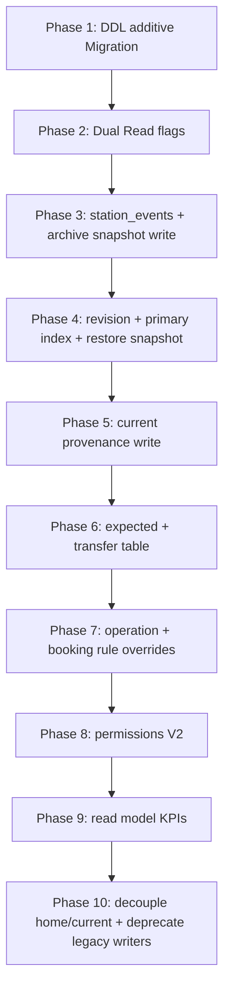

# Stations V2 — Prisma-, Migrations- und Rolloutplan

**Version:** 1.0 (Spezifikation)  
**Date:** 2026-07-17  
**Status:** **Normativ für zukünftige Schema-Implementierung** — **keine Schemaänderung und keine Produktionsmigration in diesem Prompt**  
**Repository-Git-Commit (Erstellung):** wird beim Abschluss von Prompt 6/78 dokumentiert  
**Basis:**

- [`stations-v2.md`](./stations-v2.md) (Architekturvertrag Prompt 3/78)
- [`stations-v2-permissions.md`](./stations-v2-permissions.md) (Permissions Prompt 5/78)
- [`stations-v2-domain-glossary.md`](./stations-v2-domain-glossary.md) (Glossar Prompt 4/78)
- [`stations-v2-execution-contract.md`](./stations-v2-execution-contract.md) (Ausführungsvertrag)
- [`../audits/stations-v2-implementation-inventory.md`](../audits/stations-v2-implementation-inventory.md) (Ist-Inventur Prompt 2/78)
- Ist-Schema: `backend/prisma/schema.prisma`
- Ist-Migrationen: `20260311224040_init`, `20260420080000_station_operational_fields`, `20260426220000_station_geofence_radius`, `20260616120000_station_operational_module`

**Prinzip:** **Additiv-only.** Keine `DROP`-Spalte, kein `TRUNCATE`, keine blinde Datenbereinigung. Legacy-Felder (`pickupEnabled`, `homeStationId`, …) bleiben les- und schreibbar bis explizite Deprecation-Phase. **Keine automatische Produktionsmigration** — alle Backfills nur als dokumentierte, review-pflichtige Ops-Skripte mit Dry-Run.

---

## Inhaltsverzeichnis

| # | Abschnitt |
|---|-----------|
| 0 | Zweck, Schutzregeln und Nicht-Ziele |
| 1 | Ist-Bestand |
| 2 | Schemaänderungen (additiv) |
| 3 | Neue Enums |
| 4 | Legacy-Mapping |
| 5 | Indizes und Constraints |
| 6 | Feature Flags |
| 7 | Dual Read / Dual Write |
| 8 | Backfill und Dry-Run |
| 9 | Aktivierungsreihenfolge (Phasen) |
| 10 | Rollback |
| 11 | Abnahmekriterien |
| 12 | Referenzen |

---

## 0. Zweck, Schutzregeln und Nicht-Ziele

### 0.1 Zweck

Dieser Plan beschreibt **wie** SynqDrive vom Ist-Schema (monolithische `Station`/`Vehicle`-Felder, gekoppelte Writer, fehlende Provenance) zum Stations-V2-Datenmodell migriert — **ohne** Big-Bang, **ohne** Datenverlust, **ohne** destruktive DDL.

### 0.2 Verbindliche Schutzregeln

| ID | Regel |
|----|-------|
| **M-01** | **Keine destructive Migration** — kein `DROP COLUMN`, kein `DROP TABLE`, kein irreversibles `ALTER TYPE` ohne Rollback-Plan |
| **M-02** | **Keine automatische Produktionsmigration** — DDL via normalem Deploy; DML-Backfill nur manuell/Ops mit Freigabe |
| **M-03** | **Keine blinde Bereinigung von `expectedStationId`** — Clear nur via explizite Commands mit `reason` (R5) |
| **M-04** | **Additive Spalten** nullable oder mit sicheren Defaults |
| **M-05** | Buchungs- und Handover-Pfade bleiben bis Flag-Aktivierung auf Legacy-Writer lesbar |
| **M-06** | Geofence bleibt **CONFIG_ONLY/SHADOW** — keine neuen Spalten die Auto-Current erzwingen |

### 0.3 Nicht-Ziele (dieser Prompt)

- Keine `schema.prisma`-Änderung ausführen
- Kein `prisma migrate deploy` auf Produktion
- Kein VPS-Deploy
- Keine Entfernung von `DELETE /stations/:id` im Code (separater Prompt)

---

## 1. Ist-Bestand

### 1.1 `Station` (Tabelle `stations`)

| Feld (Ist) | Rolle | V2-Anmerkung |
|------------|-------|-------------|
| `status`, `archivedAt` | Lifecycle | Bleibt; ergänzt um Lifecycle-Metadata |
| `isPrimary` | Hauptstation | DB-Invariante fehlt (nur Tx) |
| `pickupEnabled`, `returnEnabled` | Capabilities | Bei Archive auf false — **kein** Snapshot für Restore |
| `openingHours`, `holidayRules`, `timezone` | Calendar | Unverändert |
| `capacity`, `radiusMeters` | Operations | Unverändert |
| `updatedAt` | Touch | **Nicht** für Optimistic Concurrency geeignet (jeder Touch) |

### 1.2 `Vehicle` (stationsbezogen)

| Feld (Ist) | Rolle | V2-Lücke |
|------------|-------|----------|
| `homeStationId` | Heimat | OK |
| `currentStationId` | Current | **Ohne** `source` / `confirmedAt` |
| `expectedStationId` | Expected | **Ohne** `source`; 0 Prod-Rows |

### 1.3 Audit (Ist)

| Mechanismus | Status |
|-------------|--------|
| `ActivityLog` mit `entity=STATION` | Vorhanden, wenig strukturiert |
| Dedizierte `station_events` | **Fehlt** |
| Append-only Capability-Change-Muster | Vorbild: `VehicleBatteryCapabilityChange` |

### 1.4 Overrides (Ist)

| Mechanismus | Status |
|-------------|--------|
| `OrgTaskAutomationRuleOverride.stationScope` | Task-Automation, nicht Stations-Ops |
| Stations Operation Overrides | **Fehlt** |
| Booking Rule Overrides pro Buchung | **Fehlt** (nur Exception-Wurf) |

### 1.5 Transfer (Ist)

Kein `Transfer`-Modell — nur `expectedStationId` + `stationTransferFeeCents` auf `Booking`.

---

## 2. Schemaänderungen (additiv)

Alle Änderungen in **einer oder mehreren** Migrationen `20260718*_stations_v2_*`. Reihenfolge innerhalb §9.

### 2.1 Station — Lifecycle Metadata

**Zweck:** Restore ohne blindes Re-Enable; Audit-fähiger Archiv-Snapshot (R2, [`stations-v2.md`](./stations-v2.md) §12.2).

| Spalte | Typ | Default | Nullable |
|--------|-----|---------|----------|
| `revision` | `Int` | `1` | NOT NULL |
| `archived_capabilities_snapshot` | `JsonB` | — | YES |
| `lifecycle_metadata` | `JsonB` | — | YES |

**`archived_capabilities_snapshot` JSON-Shape (Ziel):**

```json
{
  "pickupEnabled": true,
  "returnEnabled": false,
  "afterHoursReturnEnabled": false,
  "isPrimary": false,
  "archivedAt": "2026-07-17T12:00:00.000Z",
  "archivedByUserId": "uuid"
}
```

**`lifecycle_metadata` JSON-Shape (optional, erweiterbar):**

```json
{
  "lastArchiveReason": "USER_REQUEST",
  "restoreCount": 0,
  "primarySetAt": "2026-01-01T00:00:00.000Z"
}
```

**Prisma (Ziel-Skizze):**

```prisma
model Station {
  // ... existing ...
  revision                    Int      @default(1)
  archivedCapabilitiesSnapshot Json?   @map("archived_capabilities_snapshot")
  lifecycleMetadata           Json?    @map("lifecycle_metadata")
}
```

### 2.2 Station — Version / Optimistic Concurrency

| Mechanismus | Detail |
|-------------|--------|
| Spalte | `revision` (s. o.) |
| API | Client sendet `If-Match: <revision>` oder Body `expectedRevision` |
| Update | `UPDATE ... SET revision = revision + 1 WHERE id = ? AND revision = ?` |
| Konflikt | HTTP 409 `STATION_REVISION_CONFLICT` |

**Verboten:** `updatedAt` als einzige Concurrency-Quelle (parallele PATCHs auf verschiedene Felder).

### 2.3 Vehicle — Physical Presence Provenance

| Spalte | Typ | Nullable |
|--------|-----|----------|
| `current_station_source` | `VehicleStationPositionSource` | YES |
| `current_station_confirmed_at` | `DateTime` | YES |

**Regel:** Ab Flag `STATIONS_V2_CURRENT_PROVENANCE_WRITE` — Write nur wenn beide gesetzt (R4).

### 2.4 Vehicle — Expected Provenance

| Spalte | Typ | Nullable |
|--------|-----|----------|
| `expected_station_source` | `VehicleExpectedPositionSource` | YES |
| `expected_station_set_at` | `DateTime` | YES |

**Regel (M-03):** Migration setzt **kein** `expectedStationId = null`. Backfill nur `source`/`set_at` wo Wert bereits existiert.

### 2.5 Transfer — neues Modell (Phase 1 minimal)

**Option A (empfohlen):** Neue Tabelle `vehicle_station_transfers` — entkoppelt von Booking, referenzierbar.

```prisma
model VehicleStationTransfer {
  id              String   @id @default(uuid())
  organizationId  String   @map("organization_id")
  vehicleId       String   @map("vehicle_id")
  fromStationId   String?  @map("from_station_id")
  toStationId     String   @map("to_station_id")
  status          VehicleStationTransferStatus @default(PLANNED)
  source          VehicleExpectedPositionSource
  bookingId       String?  @map("booking_id")
  plannedAt       DateTime @default(now()) @map("planned_at")
  completedAt     DateTime? @map("completed_at")
  cancelledAt     DateTime? @map("cancelled_at")
  reason          String?
  metadata        Json?
  createdAt       DateTime @default(now()) @map("created_at")
  updatedAt       DateTime @updatedAt @map("updated_at")

  organization Organization @relation(...)
  vehicle      Vehicle      @relation(...)
  fromStation  Station?     @relation("TransferFrom", ...)
  toStation    Station      @relation("TransferTo", ...)
  booking      Booking?     @relation(...)

  @@index([organizationId, vehicleId, status])
  @@index([organizationId, toStationId, status])
  @@map("vehicle_station_transfers")
}
```

**Option B (Fallback):** Nur Vehicle-Spalten erweitern — **nicht** Zielbild; Transfer-Events fehlen.

**Dual-Write Phase:** `SetExpectedPosition` schreibt `expectedStationId` **und** optional `vehicle_station_transfers` Row (`PLANNED`).

### 2.6 Station Operation Overrides

Temporäre Abweichungen von Capabilities (Wartung, Event, Notfall).

```prisma
model StationOperationOverride {
  id             String   @id @default(uuid())
  organizationId String   @map("organization_id")
  stationId      String   @map("station_id")
  overrideType   StationOperationOverrideType
  payload        Json     // z.B. { pickupEnabled: false, returnEnabled: true }
  effectiveFrom  DateTime @map("effective_from")
  effectiveTo    DateTime? @map("effective_to")
  reason         String?
  createdByUserId String? @map("created_by_user_id")
  revokedAt      DateTime? @map("revoked_at")
  createdAt      DateTime @default(now()) @map("created_at")

  organization Organization @relation(...)
  station      Station      @relation(...)

  @@index([organizationId, stationId, effectiveFrom])
  @@index([stationId, effectiveTo])
  @@map("station_operation_overrides")
}
```

**Auswertung:** Read Model merged `Station.capabilities` ⊕ aktive Overrides (nicht persistiert auf `Station`).

### 2.7 Booking Station Rule Overrides

Persistiert **MANUAL_CONFIRMATION** und Policy-Overrides pro Buchung.

```prisma
model BookingStationRuleOverride {
  id             String   @id @default(uuid())
  organizationId String   @map("organization_id")
  bookingId      String   @map("booking_id")
  ruleId         String   @map("rule_id")
  outcome        StationRuleOutcome
  message        String?
  confirmedByUserId String @map("confirmed_by_user_id")
  confirmedAt    DateTime @default(now()) @map("confirmed_at")
  metadata       Json?

  organization Organization @relation(...)
  booking      Booking      @relation(...)

  @@unique([bookingId, ruleId])
  @@index([organizationId, bookingId])
  @@map("booking_station_rule_overrides")
}
```

### 2.8 Audit Trail — `station_events`

Append-only, feingranularer als generisches `ActivityLog`.

```prisma
model StationEvent {
  id             String   @id @default(uuid())
  organizationId String   @map("organization_id")
  stationId      String?  @map("station_id")
  vehicleId      String?  @map("vehicle_id")
  bookingId      String?  @map("booking_id")
  eventType      StationEventType
  actorUserId    String?  @map("actor_user_id")
  payload        Json
  correlationId  String?  @map("correlation_id")
  createdAt      DateTime @default(now()) @map("created_at")

  organization Organization @relation(...)
  station      Station?     @relation(...)
  vehicle      Vehicle?     @relation(...)
  booking      Booking?     @relation(...)

  @@index([organizationId, stationId, createdAt])
  @@index([organizationId, vehicleId, createdAt])
  @@index([eventType, createdAt])
  @@map("station_events")
}
```

**Parallel:** Weiterhin `ActivityLog` für grobe Timeline; `station_events` = Stations-V2-Detail (Schicht 11).

### 2.9 Membership — Scope-Modus (Permissions V2)

| Spalte | Typ | Nullable |
|--------|-----|----------|
| `station_scope_mode` | `StationScopeMode` | YES |

Backfill aus legacy `stationScope`: `ALL` → `ALL_STATIONS`, UUID → `ASSIGNED_STATIONS`, leer → NULL (Policy-default).

---

## 3. Neue Enums

```prisma
enum VehicleStationPositionSource {
  HANDOVER_PICKUP
  HANDOVER_RETURN
  MANUAL_CONFIRMATION
  ADMIN_ASSIGNMENT
  SYSTEM_MIGRATION
  GEOFENCE_SHADOW      // read-only / shadow — no production current write
}

enum VehicleExpectedPositionSource {
  BOOKING_ONE_WAY
  TRANSFER_PLAN
  MANUAL
  SYSTEM_MIGRATION
}

enum VehicleStationTransferStatus {
  PLANNED
  IN_TRANSIT
  COMPLETED
  CANCELLED
}

enum StationOperationOverrideType {
  CAPABILITY_FLAGS
  CAPACITY
  OPENING_HOURS_EXCEPTION
}

enum StationRuleOutcome {
  ALLOWED
  WARNING
  MANUAL_CONFIRMATION_REQUIRED
  BLOCKED
}

enum StationScopeMode {
  ALL_STATIONS
  ASSIGNED_STATIONS
  NO_STATIONS
}

enum StationEventType {
  STATION_CREATED
  STATION_MASTER_DATA_UPDATED
  STATION_CAPABILITIES_UPDATED
  STATION_ARCHIVED
  STATION_RESTORED
  STATION_PRIMARY_SET
  VEHICLE_HOME_ASSIGNED
  VEHICLE_HOME_DETACHED
  VEHICLE_PRESENCE_CONFIRMED
  VEHICLE_EXPECTED_SET
  VEHICLE_EXPECTED_CLEARED
  TRANSFER_PLANNED
  TRANSFER_COMPLETED
  BOOKING_RULE_OVERRIDE
}
```

**Hinweis:** Enum-Werte nur **hinzufügen** in späteren Migrationen; nie entfernen ohne Deprecation-Phase.

---

## 4. Legacy-Mapping

### 4.1 Station Lifecycle

| Legacy-Verhalten | V2-Mapping |
|------------------|------------|
| `archive()` setzt pickup/return false | Zusätzlich: `archived_capabilities_snapshot` = Werte **vor** Archive |
| `restore()` setzt pickup/return true | V2: Restore aus Snapshot; fehlt Snapshot → `MANUAL_CONFIRMATION_REQUIRED` |
| `PATCH status=ARCHIVED` | Deprecaten → nur `ArchiveStation` Command |
| `delete()` hard | Deprecaten → `ArchiveStation` + `lifecycle_metadata.deletedViaDeprecatedApi` |

### 4.2 Vehicle Writers

| Legacy Writer | V2 Dual-Write Ziel |
|---------------|-------------------|
| `assignVehicle(home)` → home+current | Phase out: nur `AssignHomeStation`; optional Shadow-Log in `station_events` |
| `setStationVehicles` SET | `BulkSetHomeFleet` + server validation |
| Handover → `currentStationId` | `ConfirmPhysicalPresence` + source `HANDOVER_*` + `confirmedAt=now()` |
| `updateVehicleCurrentStation` | Gleich mit Provenance |

### 4.3 Expected / Transfer

| Legacy | V2 |
|--------|-----|
| `expectedStationId` allein | + `expected_station_source`, `expected_station_set_at` |
| Kein Transfer-Row | `vehicle_station_transfers` bei `manage_transfers` |
| Detach home → expected bleibt | **Unverändert** (M-03) — kein Backfill-Clear |

### 4.4 Permissions JSON

| Legacy `stations.{read,write,manage}` | `stationsV2` Keys ([`stations-v2-permissions.md`](./stations-v2-permissions.md) §11) |

### 4.5 Read Model KPIs

| Legacy DTO-Feld | V2-Feld |
|-----------------|---------|
| `bookedVehicles` (= RENTED count) | **`vehiclesWithActiveBookingAtStation`** |
| `vehicleCount` (home only) | `vehicleCountHome` |

---

## 5. Indizes und Constraints

### 5.1 Primary-Station-Invariante

**Partial Unique Index (PostgreSQL):**

```sql
CREATE UNIQUE INDEX stations_one_primary_per_org
  ON stations (organization_id)
  WHERE is_primary = true AND status != 'ARCHIVED';
```

**Anwendung:** Zusätzlich zur Tx in `SetPrimaryStation` — verhindert Race (P2-1 Audit).

### 5.2 Weitere Indizes

| Index | Tabelle | Spalten | Zweck |
|-------|---------|---------|-------|
| `stations_org_status_primary_idx` | `stations` | `(organization_id, status, is_primary)` | Listen-Sortierung |
| `vehicles_org_home_idx` | `vehicles` | `(organization_id, home_station_id)` | Heimatflotte (existiert teilweise) |
| `vehicles_org_current_idx` | `vehicles` | `(organization_id, current_station_id)` | Vor-Ort-KPI |
| `vehicles_org_expected_idx` | `vehicles` | `(organization_id, expected_station_id)` | Erwartete Ankunft |
| `station_events_org_station_created_idx` | `station_events` | `(organization_id, station_id, created_at DESC)` | Activity-Tab |
| `station_operation_overrides_active_idx` | `station_operation_overrides` | `(station_id)` WHERE `revoked_at IS NULL` | Merge Capabilities |

**Kein** Index der `expectedStationId IS NULL` massenhaft umschreibt.

### 5.3 Foreign Keys

Alle neuen FKs: `ON DELETE SET NULL` oder `RESTRICT` — **nie** `CASCADE` auf `vehicles`/`bookings` durch Station-Delete (Hard Delete ausgeschlossen).

---

## 6. Feature Flags

Env-Flags (org-scoped wo angegeben), Default **OFF**:

| Flag | Wirkung | Phase |
|------|---------|-------|
| `STATIONS_V2_SCHEMA_ENABLED` | Liest neue Spalten/Tabellen (Dual Read) | 2 |
| `STATIONS_V2_REVISION_ENFORCED` | 409 bei Revision-Konflikt | 4 |
| `STATIONS_V2_ARCHIVE_SNAPSHOT_WRITE` | Schreibt `archived_capabilities_snapshot` | 3 |
| `STATIONS_V2_RESTORE_FROM_SNAPSHOT` | Restore nutzt Snapshot | 4 |
| `STATIONS_V2_CURRENT_PROVENANCE_WRITE` | Current nur mit source+at | 5 |
| `STATIONS_V2_EXPECTED_PROVENANCE_WRITE` | Expected mit source+set_at | 6 |
| `STATIONS_V2_TRANSFER_TABLE_WRITE` | Dual-Write `vehicle_station_transfers` | 6 |
| `STATIONS_V2_OPERATION_OVERRIDES` | Merge Overrides in Rule Engine | 7 |
| `STATIONS_V2_BOOKING_RULE_OVERRIDES` | Persist MANUAL_CONFIRMATION | 7 |
| `STATIONS_V2_STATION_EVENTS_WRITE` | Append `station_events` | 3 |
| `STATIONS_V2_PRIMARY_DB_CONSTRAINT` | Nutzt DB-Index (Deploy nach Backfill primary) | 4 |
| `STATIONS_V2_PERMISSIONS_V2` | [`stations-v2-permissions.md`](./stations-v2-permissions.md) | 8 |
| `STATIONS_V2_READ_MODEL` | Kanonisches Read Model KPIs | 9 |
| `STATIONS_V2_DECOUPLE_HOME_CURRENT` | Writer entkoppeln | 10 |

**Org-Canary:** `STATIONS_V2_ORG_ALLOWLIST` (comma-separated UUIDs) — alle Flags respect allowlist wenn gesetzt.

---

## 7. Dual Read / Dual Write

### 7.1 Dual Read

| Daten | Legacy-Quelle | V2-Quelle | Merge-Regel |
|-------|---------------|-----------|-------------|
| Station capabilities | `pickupEnabled`/`returnEnabled` | ⊕ active `StationOperationOverride` | Override wins wenn `effectiveFrom <= now < effectiveTo` |
| Current | `currentStationId` | + source/at | Fehlen source/at → `legacy_inferred: true` im DTO |
| Expected | `expectedStationId` | + source + transfer row | Transfer `PLANNED` bevorzugt für UI-Detail |
| KPIs | Alte Formeln | `StationReadModelService` | Flag `STATIONS_V2_READ_MODEL` |

### 7.2 Dual Write

| Phase | Verhalten |
|-------|-----------|
| **Shadow Write** | Neue Tabellen/Spalten befüllen; Legacy-Felder weiterhin Pflicht für alte Clients |
| **Dual Write** | Commands schreiben Legacy **und** V2 (gleiche Tx) |
| **V2 Primary** | Nur V2; Legacy-Felder read-only gespiegelt oder deprecated |

**Txn-Reihenfolge in Dual Write:**

1. Domain-Validierung (Scope + Permission)
2. Legacy-Spalten (Kompatibilität)
3. V2-Spalten / Events
4. `revision++`
5. Commit

### 7.3 Verboten während Dual Write

- `expectedStationId` auf NULL setzen weil `homeStationId` geändert wurde
- Geofence → `currentStationId` ohne Flag
- Automatischer Backfill auf Produktion ohne Dry-Run-Approval

---

## 8. Backfill und Dry-Run

### 8.1 Skripte (Ops-only, nicht im Deploy)

| Skript | Zweck | Destruktiv? |
|--------|-------|-------------|
| `stations-v2-diagnose.ts` | Counts: primary-Duplikate, ARCHIVED+primary, home≠current, expected gesetzt | Nein |
| `stations-v2-backfill-current-provenance.ts` | `current_station_source=SYSTEM_MIGRATION`, `confirmed_at=updated_at` wo current gesetzt | Nein |
| `stations-v2-backfill-expected-provenance.ts` | Nur wo `expected_station_id IS NOT NULL` | **Kein NULL-Clear** |
| `stations-v2-backfill-archive-snapshots.ts` | ARCHIVED ohne Snapshot → aus Logs **oder** manuelle Review-Queue | Nein |
| `stations-v2-primary-reconcile.ts` | Mehrere Primary → Report; **kein** Auto-Fix ohne `--apply` | Dry-Run default |

### 8.2 Dry-Run-Ablauf

```bash
# 1. Diagnose (read-only)
npx ts-node backend/scripts/ops/stations-v2-diagnose.ts --org-id=<uuid>

# 2. Backfill preview
npx ts-node backend/scripts/ops/stations-v2-backfill-current-provenance.ts --dry-run

# 3. Review output CSV / counts

# 4. Apply nur mit explizitem --apply und Backup-Zeitstempel
npx ts-node backend/scripts/ops/stations-v2-backfill-current-provenance.ts --apply
```

**M-02:** Skripte laufen **nicht** in `vps-deploy-release.sh` oder PM2-Start.

### 8.3 Erwartete Diagnose (Audit 1 Referenz)

| Check | Erwartung Prod (kleine Flotte) |
|-------|-------------------------------|
| Primary pro Org | ≤ 1 |
| ARCHIVED mit pickup=true | 0 (nach V2 Archive) |
| expected ohne source (post-migration) | 0 vor Provenance-Flag |
| home/current mismatch | Erlaubt — **nicht** auto-korrigieren |

---

## 9. Aktivierungsreihenfolge (Phasen)



| Phase | Migration / Code | Flags | Prod-DML |
|-------|------------------|-------|----------|
| **1** | DDL: alle §2 Tabellen/Spalten/Enums/Indizes | — | Nein |
| **2** | Services lesen neue Felder wenn vorhanden | `STATIONS_V2_SCHEMA_ENABLED` | Nein |
| **3** | `ArchiveStation` schreibt Snapshot; `station_events` | `STATIONS_V2_ARCHIVE_SNAPSHOT_WRITE`, `STATIONS_V2_STATION_EVENTS_WRITE` | Nein |
| **4** | Revision + Restore; Primary-Index nach Diagnose | `STATIONS_V2_REVISION_ENFORCED`, `STATIONS_V2_RESTORE_FROM_SNAPSHOT`, `STATIONS_V2_PRIMARY_DB_CONSTRAINT` | Optional primary reconcile |
| **5** | Handover + PATCH current mit Provenance | `STATIONS_V2_CURRENT_PROVENANCE_WRITE` + Backfill dry-run | Backfill optional |
| **6** | Expected source; Transfer dual-write | `STATIONS_V2_EXPECTED_PROVENANCE_WRITE`, `STATIONS_V2_TRANSFER_TABLE_WRITE` | **Kein** expected clear |
| **7** | Rule overrides tables + engine | `STATIONS_V2_OPERATION_OVERRIDES`, `STATIONS_V2_BOOKING_RULE_OVERRIDES` | Nein |
| **8** | Permissions guard wiring | `STATIONS_V2_PERMISSIONS_V2` | Nein |
| **9** | Read model + KPI rename | `STATIONS_V2_READ_MODEL` | Nein |
| **10** | Legacy writer removal (feature) | `STATIONS_V2_DECOUPLE_HOME_CURRENT` | Nein |

**Canary:** Phasen 3–6 zuerst auf `STATIONS_V2_ORG_ALLOWLIST` mit 1 Org (Audit-1-Tenant).

---

## 10. Rollback

### 10.1 Prinzipien

| Prinzip | Detail |
|---------|--------|
| **Flags off** | Deaktiviert V2-Writer; Legacy-Pfad bleibt |
| **DDL bleibt** | Kein Rollback-Migration mit DROP in Phase 1–10 |
| **Events bleiben** | `station_events` append-only — Rollback löscht nicht |
| **expected bleibt** | Rollback ändert keine `expectedStationId` |

### 10.2 Rollback-Stufen

| Stufe | Aktion | Datenverlust |
|-------|--------|--------------|
| **R1** | Flags auf `false` | Keiner |
| **R2** | Code-Revert auf vorheriges Release | Keiner (neue Spalten ungenutzt) |
| **R3** | Primary-Index `DROP INDEX` (nur wenn Constraint Probleme) | Keiner |

### 10.3 Nicht rollback-fähig ohne Ops

- Bereits geschriebene `station_events` (by design)
- Manuell angewendete Backfills (Backup vor `--apply`)

---

## 11. Abnahmekriterien

| ID | Kriterium |
|----|-----------|
| AC-M01 | Migration SQL enthält kein `DROP`, `TRUNCATE`, `DELETE FROM` |
| AC-M02 | `prisma validate` + `prisma format` grün nach Schema-PR |
| AC-M03 | Partial unique primary index dokumentiert und getestet |
| AC-M04 | Backfill-Skripte haben `--dry-run` default |
| AC-M05 | Kein Skript setzt `expected_station_id = NULL` ohne `--explicit-clear` |
| AC-M06 | Dual-write Phase schreibt Legacy+V2 in einer Tx |
| AC-M07 | Rollback R1 getestet (Flags off → Legacy-Verhalten) |
| AC-M08 | Prod-Deploy ohne automatischen DML-Backfill |
| AC-M09 | `station_events` für Archive/Home/Presence bei Canary-Org |
| AC-M10 | Revision 409 bei parallelem PATCH (Integrationstest) |

---

## 12. Referenzen

| Dokument | Rolle |
|----------|-------|
| [`stations-v2.md`](./stations-v2.md) | Domain Commands, Schichten |
| [`stations-v2-permissions.md`](./stations-v2-permissions.md) | `station_scope_mode` |
| [`stations-v2-domain-glossary.md`](./stations-v2-domain-glossary.md) | Begriffe |
| [`stations-v2-implementation-inventory.md`](../audits/stations-v2-implementation-inventory.md) | Prompt 7–78 Matrix |
| `backend/prisma/migrations/20260616120000_station_operational_module/` | Letzte große Stations-Migration |
| `VehicleBatteryCapabilityChange` | Audit-Append-Only-Vorbild |

---

**Ende des Prisma-/Migrations-/Rolloutplans Stations V2.** Nächster Implementierungsschritt: DDL-PR (Prompt 7+) nach Freigabe dieses Plans.
