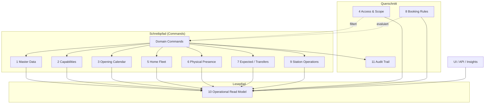

# Stations V2 — Verbindlicher Architekturvertrag

**Version:** 2.0 (Spezifikation)  
**Date:** 2026-07-17  
**Status:** **Normativ für zukünftige Implementierung** — keine produktive Umsetzung in diesem Dokument  
**Repository-Git-Commit (Erstellung):** wird beim Abschluss von Prompt 3/78 dokumentiert  
**Basis:**

- [`stations-v2-execution-contract.md`](./stations-v2-execution-contract.md) (Prompt 1/78 — Ausführungsvertrag)
- [`../audits/stations-v2-implementation-inventory.md`](../audits/stations-v2-implementation-inventory.md) (Prompt 2/78 — Ist-Inventur)
- [`../audits/stations-production-reality.md`](../audits/stations-production-reality.md) (Audit 1 — Production Reality)
- [`../audits/stations-workflow-ux-test-matrix.md`](../audits/stations-workflow-ux-test-matrix.md) (Audit 2 — Workflow/UX-Matrix)

**Prinzip:** Eine kanonische Stations-Domäne mit getrennten Schreib-Commands und einem **Operational Read Model** für Listen, KPIs und UI. Keine parallele Stations-Wahrheit in Frontend-Aggregationen, Dashboard-Derivaten oder impliziten SET-Operationen aus partiellen Listen.

**Normativität:** Dieses Dokument **übersteuert** Legacy-Code und implizite Annahmen, sofern Audits Widersprüche belegen. Der [`stations-v2-execution-contract.md`](./stations-v2-execution-contract.md) regelt **wie** implementiert wird; dieses Dokument definiert **was** fachlich und technisch gilt.

---

## Inhaltsverzeichnis

| # | Abschnitt |
|---|-----------|
| 0 | Zweck und Geltungsbereich |
| 1 | Schichtenmodell (11 Ebenen) |
| 2 | Verbindliche Leitregeln |
| 3 | Domain Commands (Schreibpfad) |
| 4 | Schicht 1 — Station Master Data |
| 5 | Schicht 2 — Operational Capabilities |
| 6 | Schicht 3 — Opening Calendar |
| 7 | Schicht 4 — Station Access und Scope |
| 8 | Schicht 5 — Home Fleet |
| 9 | Schicht 6 — Physical Presence |
| 10 | Schicht 7 — Expected Position und Transfers |
| 11 | Schicht 8 — Booking Station Rules |
| 12 | Schicht 9 — Station Operations |
| 13 | Schicht 10 — Operational Read Model |
| 14 | Schicht 11 — Audit Trail |
| 15 | Geofence-Modus (CONFIG_ONLY / SHADOW) |
| 16 | API- und UI-Vertrag |
| 17 | Ist-Widersprüche (Audit-basiert) |
| 18 | Abnahmekriterien |
| 19 | Referenzen |

---

## 0. Zweck und Geltungsbereich

SynqDrive Stations V2 beschreibt, wie **Stations-Stammdaten**, **operative Fähigkeiten**, **Flottenzuordnung** (Home), **physischer Standort** (Current), **erwartete Position** (Expected), **Buchungsregeln** und **KPIs** in einem Multi-Tenant-SaaS konsistent modelliert, geschrieben und gelesen werden.

**Geltung:**

- Multi-tenant: alle Operationen sind `organizationId`-scoped.
- Keine hardcodierten `organizationId`, `stationId`, `vehicleId`.
- Schreibpfad zentral über **Domain Commands** in `StationsService` (Ziel: dedizierte Command-Handler / Application Services) — keine direkten `prisma.station` / `prisma.vehicle` Mutationen außerhalb des Stations-Schreibpfads für stationsbezogene Felder.
- Lesepfad zentral: **Operational Read Model** — alle UIs, Dashboards, Insights und Notifications konsumieren dieselbe Read-Fassade (Ziel: `StationReadModelService` o. ä.).

**Nicht Gegenstand dieses Vertrags:**

- Automatische Geofence-gesteuerte `currentStationId`-Updates in Produktion (bis expliziter Rollout-Prompt mit Flag).
- Hard Delete von Stationen als regulärer Produktflow.
- Vollständiges Transfer-Workflow-Modul in Phase 1 (Expected/Transfer-Schicht definiert Schnittstellen; Implementierung inkrementell).

---

## 1. Schichtenmodell (11 Ebenen)

Die Stations-Domäne ist in **elf fachliche Schichten** gegliedert. Jede Schicht hat eigene Aggregate, Commands und Read-Projektionen. **Keine Schicht darf still die Wahrheit einer anderen überschreiben.**



| # | Schicht | Kurzdefinition | Primäre Persistenz (Ist → Ziel) |
|---|---------|----------------|----------------------------------|
| 1 | Station Master Data | Identität, Adresse, Typ, Koordinaten, Kontakt | `stations` |
| 2 | Operational Capabilities | Pickup/Return, Primary, Kapazität, Geofence-Radius | `stations` (Flags + `capacity`, `radiusMeters`) |
| 3 | Opening Calendar | Öffnungszeiten, Feiertage, Zeitzone | `stations.openingHours`, `holidayRules`, `timezone` |
| 4 | Station Access und Scope | RBAC `stations`, Membership-`stationScope` | Membership + Guards |
| 5 | Home Fleet | Organisatorische Heimat-Zuordnung | `vehicles.homeStationId` |
| 6 | Physical Presence | Bestätigter physischer Standort | `vehicles.currentStationId` + **Source** + **confirmedAt** (Ziel) |
| 7 | Expected Position und Transfers | Erwarteter Standort aus Buchung/Transfer | `vehicles.expectedStationId` + Transfer-Events (Ziel) |
| 8 | Booking Station Rules | Regelauswertung für Buchungen | Policy-Service (Ziel) |
| 9 | Station Operations | Archive, Restore, Primary, Backfill | Commands auf `stations` |
| 10 | Operational Read Model | Listen, Detail, KPIs, Fleet-Sichten | Read-Service / materialisierte Projektionen |
| 11 | Audit Trail | Nachvollziehbare Änderungen | `ActivityLog` / `StationEvent` (Ziel) |

---

## 2. Verbindliche Leitregeln

Die folgenden Regeln sind **nicht verhandelbar** (vgl. auch [`stations-v2-execution-contract.md`](./stations-v2-execution-contract.md) §5).

| ID | Regel | Bedeutung |
|----|-------|-----------|
| **R1** | Status nur über Domain Commands | `Station.status`, `archivedAt`, `isPrimary`, Capability-Flags werden **nicht** durch generisches PATCH ohne Command-Semantik geändert. Zulässig: `CreateStation`, `UpdateStationMasterData`, `ArchiveStation`, `RestoreStation`, `SetPrimaryStation`. |
| **R2** | ARCHIVED-Invarianten | `ARCHIVED` ⇒ `isPrimary=false`, `pickupEnabled=false`, `returnEnabled=false`. Archivierte Stationen sind weder primary noch pickup- noch returnfähig. |
| **R3** | Home / Current / Expected getrennt | Kein Command darf still mehrere dieser drei Beziehungen setzen. |
| **R4** | Current mit Provenance | Jede Current-Änderung erfordert `currentStationSource` und `currentStationConfirmedAt`. |
| **R5** | Expected nicht blind löschen | Home-Änderungen löschen `expectedStationId` **nicht** automatisch. Explizite Commands: `ClearExpectedPosition`, `SetExpectedPosition`, `CompleteTransfer`. |
| **R6** | Scope serverseitig | Listen, Detail, Writes und KPIs filtern nach Membership-`stationScope` / `stationIds`. |
| **R7** | KPIs respektieren Scope | Keine org-weiten KPIs für scoped User. |
| **R8** | Booking Rules mit vier Outcomes | `ALLOWED`, `WARNING`, `MANUAL_CONFIRMATION_REQUIRED`, `BLOCKED`. |
| **R9** | Geofence CONFIG_ONLY / SHADOW | Kein produktiver Auto-Write auf Current aus Geofence ohne Rollout-Flag. |
| **R10** | Kein Hard Delete | Regulärer Flow = Archive. `DELETE` nur Admin-Deprecation, nicht Produkt-UI. |
| **R11** | UI liest Read Model | Frontend leitet keine eigene Flotten-, KPI- oder Scope-Wahrheit ab. |

---

## 3. Domain Commands (Schreibpfad)

### 3.1 Station-Lifecycle-Commands

| Command | Schicht | Erlaubte Wirkung |
|---------|-------|------------------|
| `CreateStation` | 1, 2, 3 | Neuer `Station`-Datensatz; optional `SetPrimaryStation` in derselben Tx |
| `UpdateStationMasterData` | 1 | Name, Code, Adresse, Koordinaten, Kontakt, Notizen — **ohne** Status/Capabilities |
| `UpdateStationCapabilities` | 2 | `pickupEnabled`, `returnEnabled`, `afterHoursReturnEnabled`, `keyBoxAvailable`, `capacity`, `radiusMeters` |
| `UpdateOpeningCalendar` | 3 | `openingHours`, `holidayRules`, `timezone` |
| `ArchiveStation` | 9 | `status=ARCHIVED`, R2 erzwingen, Audit |
| `RestoreStation` | 9 | `status=ACTIVE`, `archivedAt=null`; Capabilities **nicht** blind überschreiben |
| `SetPrimaryStation` | 2, 9 | Eine Primary pro Org (Tx); nur `ACTIVE` |
| `BackfillStationCoordinates` | 1 | Admin-Geocode-Recovery |

**Verboten:** Direktes Setzen von `status` über generisches `UpdateStationDto` ohne Command-Handler (Ist-Widerspruch — siehe §17).

### 3.2 Vehicle-Station-Commands

| Command | Schicht | Felder |
|---------|-------|--------|
| `AssignHomeStation` | 5 | nur `homeStationId` |
| `DetachHomeStation` | 5 | nur `homeStationId` (null) |
| `ConfirmPhysicalPresence` | 6 | `currentStationId`, `currentStationSource`, `currentStationConfirmedAt` |
| `ClearPhysicalPresence` | 6 | current-Felder null (nur mit explizitem Grund) |
| `SetExpectedPosition` | 7 | nur `expectedStationId` |
| `ClearExpectedPosition` | 7 | nur `expectedStationId` |
| `BulkSetHomeFleet` | 5 | Server-validierte vollständige Menge — **kein** Client-Partial-SET |

**Verboten (Ist):** `assignVehicle(target: home)` setzt home **und** current; `setStationVehicles` SET aus partieller UI-Liste.

### 3.3 Command-Invarianten (Tx)

| Invariante | Prüfung |
|------------|---------|
| **I-ORG** | Station und Vehicle gehören zur gleichen `organizationId` |
| **I-ARCH** | R2 bei jedem Read/Write auf Capabilities |
| **I-SCOPE** | Scoped User darf nur Commands auf erlaubte Stationen ausführen |
| **I-S1** | Ein Command-Typ pro Request für home/current/expected |
| **I-S2** | Bulk-SET nur mit Server-Bestätigung der Vollständigkeit |

---

## 4. Schicht 1 — Station Master Data

### 4.1 Definition

**Station Master Data** ist die **langfristige Identität** einer Station: Name, Code, Typ, Adresse, Geo-Koordinaten, Kontaktdaten, interne Notizen. Master Data ist **unabhängig** vom operativen Tagesgeschäft (Buchungen, Flottenbewegungen).

### 4.2 Attribute

| Attribut | Pflicht | Persistenz | Hinweise |
|----------|---------|------------|----------|
| `id` | Ja | UUID | Tenant-opaque |
| `organizationId` | Ja | FK | Isolation |
| `name` | Ja | string | Eindeutigkeit pro Org empfohlen, nicht erzwungen |
| `code` | Nein | string? | Unique pro Org wenn gesetzt |
| `type` | Ja | `StationType` | MAIN, BRANCH, PARKING, PARTNER, TEMPORARY |
| `address`, `city`, `postalCode`, `country` | Nein | strings | Geocode-Input |
| `latitude`, `longitude` | Nein | float? | Forward-Geocode oder manuell |
| `phone`, `email`, `managerName` | Nein | | Kontakt |
| `notes`, `internalNotes` | Nein | | |
| `googlePlaceId` | Nein | Legacy/Referenz | Mapbox bevorzugt für neue Flows |

### 4.3 Commands

- `CreateStation` — initiale Master Data
- `UpdateStationMasterData` — PATCH nur Master-Felder
- `BackfillStationCoordinates` — Admin-Recovery

**Master Data ändert nicht:** `status`, `isPrimary`, pickup/return flags, opening calendar (eigene Commands).

---

## 5. Schicht 2 — Operational Capabilities

### 5.1 Definition

**Operational Capabilities** beschreiben, **was eine Station operativ darf** — unabhängig von der physischen Flotte oder Buchungen.

### 5.2 Attribute

| Attribut | Default | Bedeutung |
|----------|---------|-----------|
| `status` | `ACTIVE` | `ACTIVE` \| `INACTIVE` \| `ARCHIVED` — **nur** via Lifecycle-Commands (R1) |
| `isPrimary` | false | Organisatorischer Hauptstandort (max. einer pro Org) |
| `pickupEnabled` | true | Buchungen/Handover Pickup erlaubt |
| `returnEnabled` | true | Buchungen/Handover Return erlaubt |
| `afterHoursReturnEnabled` | false | Rückgabe außerhalb Öffnungszeiten (Policy in Schicht 8) |
| `keyBoxAvailable` | false | Anzeige/Handover-Hinweis |
| `capacity` | null | Max. Fahrzeuge (Planung; Enforcement in Schicht 8) |
| `radiusMeters` | 100 | Geofence-Radius (25–5000); CONFIG_ONLY bis Rollout |

### 5.3 Invariante R2 (ARCHIVED)

Wenn `status = ARCHIVED`:

```
isPrimary = false
pickupEnabled = false
returnEnabled = false
archivedAt IS NOT NULL
```

`ArchiveStation` und jeder Pfad zu `ARCHIVED` **muss** R2 atomar erzwingen.

### 5.4 Primary-Station

| Regel | Detail |
|-------|--------|
| Maximal eine | Pro `organizationId` höchstens eine `isPrimary=true` (DB-Constraint Ziel) |
| Nur ACTIVE | `SetPrimaryStation` auf `ARCHIVED` → `BLOCKED` |
| Tx | Andere Primaries in derselben Transaktion löschen |

---

## 6. Schicht 3 — Opening Calendar

### 6.1 Definition

**Opening Calendar** modelliert **wann** eine Station operativ erreichbar ist: Wochenrhythmus, Feiertage und **IANA-Zeitzone** für alle zeitbezogenen Auswertungen.

### 6.2 Attribute

| Attribut | Format | Verwendung |
|----------|--------|------------|
| `timezone` | IANA string | Default `Europe/Berlin`; **Pflicht** für „heute“-KPIs |
| `openingHours` | JSON (Wochentag → Intervalle) | Anzeige + Regelauswertung |
| `holidayRules` | JSON (Ausnahmen) | Anzeige + Regelauswertung |

### 6.3 Commands

- `UpdateOpeningCalendar` — isoliert von Master Data und Capabilities

### 6.4 Read-Projektion

| Projektion | Regel |
|------------|-------|
| `isOpenAt(stationId, instant)` | Auswertung in `station.timezone` |
| `hasMissingOpeningHours` | Flag im Read Model für UI-Warnung |
| KPI „today pickups/returns“ | **Muss** `station.timezone` nutzen (nicht Server-Mitternacht) |

**Ist-Widerspruch:** `getStationOverviewStats` nutzt Server-local midnight — siehe §17.

---

## 7. Schicht 4 — Station Access und Scope

### 7.1 Definition

**Station Access und Scope** regelt **wer** Stations-Daten sehen und ändern darf — auf zwei Ebenen:

1. **Permission-Modul** `stations` (read / write / manage)
2. **Membership Station Scope** (`stationScope`, `stationIds`)

### 7.2 Permission-Modul `stations`

| Aktion | Mindest-Permission |
|--------|-------------------|
| Listen, Detail, KPIs, Fleet lesen | `stations:read` |
| Master Data, Capabilities, Calendar schreiben | `stations:write` |
| Archive, Primary, Bulk-Fleet, Backfill | `stations:write` oder `stations:manage` (Policy festlegen in Prompt 7+) |

**Pflicht:** `PermissionsGuard` auf `StationsController` (Ist: fehlt).

### 7.3 Station Scope (SUB_ADMIN / WORKER)

| `stationScope` | Verhalten |
|----------------|-----------|
| `ALL` oder null | Alle Stationen der Org |
| Einzelne Station-ID | Nur diese Station + abgeleitete Vehicle/Booking-Entitäten |
| `stationIds[]` (JSON) | Vereinigungsmenge erlaubter Stationen |

**Pflicht (R6):** Serverseitige Filter in:

- `findAll`, `findOne`, `getStationStats`, `getStationOverviewStats`
- `getStationFleet`, `getStationBookings`
- Alle Write-Commands

**Referenz-Implementierung (Notifications):** `NotificationStationScopeService` — Muster für Vehicle/Booking-Scope, **nicht** für Stations-API (Ist: unwired).

### 7.4 Scope und KPIs (R7)

Scoped User erhalten:

- `stations[]` nur im erlaubten Scope
- `totalVehicles`, `unassignedVehicles`, Overview-Metriken **nur** für sichtbare Stationen
- Keine org-weiten Aggregationen in Header-KPIs

---

## 8. Schicht 5 — Home Fleet

### 8.1 Definition

**Home Fleet** ist die **organisatorische Heimat-Zuordnung** eines Fahrzeugs. Sie dient Planung, KPI-Heimatflotte, Station-Shortage-Detector und Standard-Pickup-Default bei Buchungen.

### 8.2 Persistenz

| Feld | Modell | Semantik |
|------|--------|----------|
| `homeStationId` | `Vehicle.homeStationId` | Organisatorische Heimat; darf ≠ current sein |

### 8.3 Commands

| Command | Wirkung |
|---------|---------|
| `AssignHomeStation(vehicleId, stationId)` | Setzt nur `homeStationId` |
| `DetachHomeStation(vehicleId)` | `homeStationId = null` |
| `BulkSetHomeFleet(stationId, vehicleIds)` | Server-validierte Gesamtmenge der Heimatflotte |

### 8.4 Regeln

| Regel | Detail |
|-------|--------|
| R3 | `AssignHomeStation` ändert **nicht** `currentStationId` oder `expectedStationId` |
| R5 | Home-Detach löscht **nicht** automatisch `expectedStationId` |
| Zielstation | Muss `ACTIVE` sein (nicht `ARCHIVED` für Home) |
| Listen-KPI | `vehicleCount` in Stationsliste = **Home-Count** (explizit dokumentiert im Read Model) |

### 8.5 Verboten

- SET aus UI-Liste mit `limit: 500` ohne Vollständigkeitsnachweis (R11, Invariante S2)
- Kopplung home+current bei `registerFromDimo` ohne explizite Option (Ist-Widerspruch)

---

## 9. Schicht 6 — Physical Presence

### 9.1 Definition

**Physical Presence** ist der **bestätigte physische Standort** eines Fahrzeugs — wo es nachweislich ist, nicht wo es organisatorisch hingehört.

### 9.2 Persistenz (Ziel-V2)

| Feld | Typ | Pflicht bei Write |
|------|-----|-------------------|
| `currentStationId` | UUID? | Station oder null |
| `currentStationSource` | Enum | **Ja** (R4) |
| `currentStationConfirmedAt` | DateTime | **Ja** (R4) |

### 9.3 `currentStationSource` (Ziel-Enum)

| Wert | Auslöser |
|------|----------|
| `HANDOVER_PICKUP` | Pickup-Handover abgeschlossen |
| `HANDOVER_RETURN` | Return-Handover abgeschlossen |
| `MANUAL_CONFIRMATION` | Operator bestätigt Standort manuell |
| `ADMIN_ASSIGNMENT` | Admin-Zuweisung (current-only Command) |
| `GEOFENCE_SHADOW` | Geofence-Schätzung — **nur** im SHADOW-Modus, schreibt nicht Current bis Rollout |
| `SYSTEM_MIGRATION` | Einmalige Backfill-Migration |

**Ist:** Nur `currentStationId` ohne Source/Timestamp — additive Migration in Prompt 4 (Prisma-Plan).

### 9.4 Commands

| Command | Schicht-6-Felder |
|---------|------------------|
| `ConfirmPhysicalPresence` | stationId, source, confirmedAt |
| `ClearPhysicalPresence` | null + Audit-Grund |

**Handover-Pfad:** `BookingsHandoverService` ruft `ConfirmPhysicalPresence` mit `actualStationId` — **nicht** direktes `vehicle.update`.

### 9.5 Regeln

| Regel | Detail |
|-------|--------|
| R3 | Getrennt von Home und Expected |
| R4 | Kein Current-Write ohne Source + confirmedAt |
| R9 | Geofence darf höchstens SHADOW-Evidence erzeugen, nicht Current setzen |

---

## 10. Schicht 7 — Expected Position und Transfers

### 10.1 Definition

**Expected Position** ist der **erwartete zukünftige Standort** aus Buchungs-, Transfer- oder Logistik-Kontext. Sie ist **Planung**, nicht bestätigte Realität.

### 10.2 Persistenz

| Feld | Semantik |
|------|----------|
| `expectedStationId` | Zielstation vor Ankunft / nach One-Way / während Transfer |

**Ziel (optional):** `TransferPlan` / `TransferEvent` Aggregate für mehrstufige Transfers — Phase 2; V2 Phase 1 nutzt `expectedStationId` als einfaches Erwartungsfeld.

### 10.3 Commands

| Command | Wirkung |
|---------|---------|
| `SetExpectedPosition(vehicleId, stationId, reason)` | Nur expected |
| `ClearExpectedPosition(vehicleId, reason)` | Explizite Bereinigung |
| `CompleteTransfer(vehicleId)` | Expected → Current via `ConfirmPhysicalPresence` + `ClearExpectedPosition` |

### 10.4 Regeln (R5)

| Situation | Erlaubtes Verhalten |
|-----------|---------------------|
| Home-Änderung | `expectedStationId` **bleibt** unverändert |
| Home-Detach | `expectedStationId` **bleibt** (bis expliziter Clear oder Transfer-Regel) |
| One-Way-Buchung bestätigt | `SetExpectedPosition` auf `returnStationId` erlaubt (Prompt 38+) |
| Handover am Ziel | `CompleteTransfer` oder `ClearExpectedPosition` |

**Explizite Clear-Gründe (Ziel):** `TRANSFER_COMPLETED`, `BOOKING_CANCELLED`, `MANUAL_OVERRIDE`, `HOME_REASSIGNED` (nur wenn Business-Regel es verlangt — **nicht** blind bei Home).

### 10.5 Ist

`expectedStationId` existiert; 0 Prod-Fahrzeuge; kein Transfer-Modul; API `assignVehicle(target: expected)` ohne UI.

---

## 11. Schicht 8 — Booking Station Rules

### 11.1 Definition

**Booking Station Rules** evaluieren, ob eine Buchungs- oder Handover-Station-Kombination **zulässig** ist — unter Berücksichtigung von Capabilities, Opening Calendar und Kapazität.

### 11.2 Rule Outcomes (R8)

Jede Regelauswertung liefert **genau einen** Outcome:

| Outcome | Bedeutung | UI / API |
|---------|-----------|----------|
| `ALLOWED` | Regel erfüllt | Fortfahren |
| `WARNING` | Abweichung, aber kein Hard-Stop | Anzeige + optionaler Audit-Eintrag |
| `MANUAL_CONFIRMATION_REQUIRED` | Operator muss bestätigen | Dialog + bestätigter Override mit Audit |
| `BLOCKED` | Nicht zulässig | HTTP 400 / Formular blockiert |

**Struktur (Ziel-DTO):**

```typescript
type StationRuleEvaluation = {
  outcome: 'ALLOWED' | 'WARNING' | 'MANUAL_CONFIRMATION_REQUIRED' | 'BLOCKED';
  ruleId: string;
  message: string;
  stationId?: string;
  field?: 'pickup' | 'return' | 'actualPickup' | 'actualReturn';
};
```

### 11.3 Regelkatalog (Ziel)

| ruleId | Prüfung | Default-Outcome |
|--------|---------|-----------------|
| `STATION_ARCHIVED` | Station nicht ARCHIVED | `BLOCKED` |
| `STATION_INACTIVE` | Status ACTIVE für neue Buchung | `BLOCKED` oder `WARNING` |
| `PICKUP_DISABLED` | `pickupEnabled` | `BLOCKED` |
| `RETURN_DISABLED` | `returnEnabled` | `BLOCKED` |
| `OUTSIDE_OPENING_HOURS` | `isOpenAt` in station TZ | `WARNING` → konfigurierbar `BLOCKED` |
| `HOLIDAY_CLOSED` | holidayRules | `WARNING` / `BLOCKED` |
| `CAPACITY_EXCEEDED` | home fleet vs capacity | `WARNING` / `MANUAL_CONFIRMATION_REQUIRED` |
| `AFTER_HOURS_RETURN` | return außerhalb + !afterHoursReturnEnabled | `MANUAL_CONFIRMATION_REQUIRED` |
| `ONE_WAY_MISMATCH` | isOneWayRental vs station IDs | `BLOCKED` |

### 11.4 Integration

| Consumer | Aufruf |
|----------|--------|
| `BookingsService` create/update | `StationRuleEngine.evaluate(bookingStationInput)` |
| Handover actual station | Regeln für actual vs planned |
| Frontend `StationSelectFields` | Zeigt Server-`evaluations[]` — **keine** eigene harte Wahrheit |

**Ist:** `StationValidationService` liefert nur Exceptions (BLOCKED-äquivalent); keine WARNING/MANUAL; keine Hours/Capacity.

---

## 12. Schicht 9 — Station Operations

### 12.1 Definition

**Station Operations** umfasst **lifecycle-kritische** Eingriffe: Archivieren, Wiederherstellen, Primary setzen, Koordinaten-Backfill.

### 12.2 Commands

| Command | Beschreibung |
|---------|--------------|
| `ArchiveStation` | R1 + R2; keine Hard Delete |
| `RestoreStation` | ACTIVE; Capabilities aus letztem Snapshot oder explizitem Payload — **nicht** blind alles true |
| `SetPrimaryStation` | Tx, nur ACTIVE |
| `BackfillStationCoordinates` | Admin Batch-Geocode |

### 12.3 Hard Delete (R10)

| Aspekt | Regel |
|--------|-------|
| Produkt-UI | **Kein** Delete-Button |
| API `DELETE /stations/:id` | **Deprecated** — HTTP **410 Gone**, Code `STATION_DELETE_DEPRECATED`, Ersatz: `POST /stations/:id/archive` |
| Tenant-Mutation | **Kein** `prisma.station.delete` in Produktpfaden |
| `prisma.station.delete` / `deleteMany` | Nur interne Platform-Admin-Prune- und Test-/Cleanup-Skripte |

**Entscheidung (Prompt 22/78):** Archive ist der fachliche Standard. Historische Relationen (Buchungen, Fahrzeug-Links, scoped Staff) bleiben erhalten. Legacy-Clients, die noch `DELETE` aufrufen, erhalten einen strukturierten Deprecation-Fehler — keine stillschweigende Archivierung mehr.

**Ist (vor V4.9.602):** `delete()` konnte unlinkte Stationen physisch löschen; später Zwischenstand „DELETE archiviert still“.

---

## 13. Schicht 10 — Operational Read Model

### 13.1 Definition

Das **Operational Read Model** ist die **einzige kanonische Lesefassade** für UI, API-Responses, Dashboards und Insights. Es projiziert Master Data, Capabilities, Calendar, Fleet, Presence, Expected und KPIs in **scope-gefilterte**, **konsistent definierte** DTOs.

### 13.2 Prinzip (R11)

| Verboten | Erlaubt |
|----------|---------|
| UI zählt Fahrzeuge clientseitig aus paginierter Liste | `StationListItemDto.vehicleCountHome` vom Server |
| Dashboard leitet „today“ aus Browser-TZ ab | Server liefert `todayPickups` in `station.timezone` |
| Fleet-Filter kombiniert home+current ohne API-Vertrag | `StationFleetReadDto` mit expliziten Feldern |
| N× `overviewStats` ohne Fehleraggregation | `StationListWithStatsDto` oder Batch-Endpoint |

### 13.3 Kanonische Read-DTOs (Ziel)

| DTO | Inhalt |
|-----|--------|
| `StationListItemDto` | Master + Capabilities Summary + `vehicleCountHome` + Scope |
| `StationDetailDto` | Vollständige Schichten 1–3 + Geofence-Config |
| `StationOverviewStatsDto` | KPIs mit **definierten** Metriken (siehe unten) |
| `StationFleetVehicleDto` | vehicle + home/current/expected + presence metadata |
| `StationBookingRowDto` | Booking-Zeilen paginiert |
| `StationsOrgStatsDto` | Header-KPIs scope-gefiltert |
| `GeofenceShadowDto` | Optional HOME/AWAY/UNKNOWN — **SHADOW**, nicht Current |

### 13.4 KPI-Definitionen (verbindlich)

| Metrik | Definition |
|--------|------------|
| `vehicleCountHome` | COUNT vehicles WHERE `homeStationId = stationId` |
| `vehicleCountPresent` | COUNT WHERE `currentStationId = stationId` |
| `totalVehiclesAtStation` | Union home ∪ current (explizit labeln) |
| `availableVehicles` | `status = AVAILABLE` auf union set |
| `bookedVehicles` | COUNT aktive Buchungen mit Bezug zur Station — **nicht** nur `RENTED` |
| `todayPickups` / `todayReturns` | Kalendertag in **`station.timezone`** |
| `capacityUsagePercent` | `vehicleCountHome / capacity` (oder dokumentierte Alternative) |
| `vehiclesWithHealthWarnings` | Aus Rental Health — null nur wenn Modul deaktiviert |

### 13.5 Ziel-Service

`StationReadModelService` (oder Erweiterung `StationsService` read-only-Methoden):

- Einheitliche Scope-Anwendung
- Einheitliche KPI-Formeln
- Paginierung für Bookings/Fleet
- Keine Schreiblogik

**Ist:** Logik verteilt in `StationsService` + Frontend-Aggregationen — Migrationsziel Prompts 41–46.

---

## 14. Schicht 11 — Audit Trail

### 14.1 Definition

**Audit Trail** stellt **nachvollziehbare** Änderungen an Stationen und Vehicle-Station-Beziehungen bereit — für Compliance, Support und Debugging.

### 14.2 Pflicht-Events (Ziel)

| Event | Payload |
|-------|---------|
| `STATION_CREATED` | stationId, actorId, snapshot |
| `STATION_MASTER_DATA_UPDATED` | diff |
| `STATION_CAPABILITIES_UPDATED` | diff inkl. status/primary |
| `STATION_ARCHIVED` / `STATION_RESTORED` | reason |
| `STATION_PRIMARY_SET` | previousPrimaryId |
| `VEHICLE_HOME_ASSIGNED` / `DETACHED` | vehicleId, stationId |
| `VEHICLE_PRESENCE_CONFIRMED` | vehicleId, stationId, source, confirmedAt |
| `VEHICLE_EXPECTED_SET` / `CLEARED` | vehicleId, stationId, reason |
| `BOOKING_STATION_RULE_OVERRIDE` | ruleId, outcome, confirmedBy |

### 14.3 Persistenz (Ziel)

- `ActivityLog` mit `entityType=STATION|VEHICLE`, `action`, `metadata` JSON
- Optional dedizierte `station_events` Tabelle bei hohem Volumen

**Ist:** Keine station-spezifischen strukturierten Audit-Events; Activity-Log-Sample ohne Feld-Diffs (Audit 1).

---

## 15. Geofence-Modus (CONFIG_ONLY / SHADOW)

### 15.1 CONFIG_ONLY (Phase V2 Default)

| Aspekt | Verhalten |
|--------|-----------|
| Speicherung | `latitude`, `longitude`, `radiusMeters` |
| UI | Karten-Overlay, Radius-Slider, `missingGeofence`-Warnung |
| Schreiben Current | **Nein** |

### 15.2 SHADOW (optional, mit Flag)

| Aspekt | Verhalten |
|--------|-----------|
| Berechnung | Haversine / `isVehicleAtHomeStation` |
| Ausgabe | `GeofenceShadowDto`: `HOME` \| `AWAY` \| `UNKNOWN` im Read Model |
| Schreiben Current | **Nein** bis expliziter Rollout-Prompt |
| Telemetrie | DIMO GPS darf Shadow speisen, nicht Current |

### 15.3 Verboten ohne Rollout (R9)

- Hintergrund-Job der `currentStationId` aus GPS setzt
- Webhook/Scheduler mit Geofence-Auto-Assign
- `currentStationSource = GEOFENCE_SHADOW` als produktiver Current-Write

**Referenz Ist:** `HomeAwayBadge`, `geospatial.ts` — reine Anzeige; kein Backend-Writer.

---

## 16. API- und UI-Vertrag

### 16.1 API-Schichten-Mapping

| Endpoint (Ziel) | Schicht | Read/Write |
|-----------------|---------|------------|
| `GET /stations` | 10 | Read (scope) |
| `GET /stations/:id` | 10 | Read |
| `GET /stations/stats` | 10 | Read |
| `GET /stations/:id/overview-stats` | 10 | Read |
| `GET /stations/:id/fleet` | 10 | Read |
| `GET /stations/:id/bookings` | 10 | Read (paginated) |
| `POST /stations` | 1, 2 | `CreateStation` |
| `PATCH /stations/:id` | 1 oder 2 oder 3 | Command-spezifische DTOs |
| `POST .../archive` | 9 | `ArchiveStation` |
| `POST .../restore` | 9 | `RestoreStation` |
| `POST .../set-primary` | 9 | `SetPrimaryStation` |
| `POST .../assign-home` | 5 | `AssignHomeStation` (Ziel) |
| `POST .../confirm-presence` | 6 | `ConfirmPhysicalPresence` (Ziel) |
| `POST .../expected` | 7 | `SetExpectedPosition` (Ziel) |
| `PUT .../home-fleet` | 5 | `BulkSetHomeFleet` mit Server-Validation |
| `DELETE /stations/:id` | — | **410 Gone** — deprecated; use `POST .../archive` |

### 16.2 UI-Vertrag (R11)

| Surface | Read Model |
|---------|------------|
| `StationsView` | `StationListItemDto` + `StationsOrgStatsDto` |
| `StationDetailView` | `StationDetailDto` + Tabs aus Read APIs |
| `StationAssignVehicleModal` | Server-driven picker + Preview, kein blind SET |
| `StationSelectFields` | `StationRuleEvaluation[]` vom Server |
| `FleetView` / `HomeAwayBadge` | `GeofenceShadowDto` optional |
| Dashboard `StationHealthPanel` | `StationOverviewStatsDto` batch |

**Verboten:** Client-seitige KPI-Neuberechnung die von Server-Definitionen abweicht.

---

## 17. Ist-Widersprüche (Audit-basiert)

| ID | Ist | V2-Vertrag | Priorität |
|----|-----|------------|-----------|
| W-01 | `PermissionsGuard` fehlt auf Controller | §7.2 | P0 |
| W-02 | `StationScopeGuard` unwired | §7.3 R6 | P0 |
| W-03 | `assignVehicle(home)` koppelt current | §8, R3 | P0 |
| W-04 | `setStationVehicles` SET + 500 UI cap | §8, R11, S2 | P0 |
| W-05 | Keine Rule Outcomes WARNING/MANUAL | §11 R8 | P0 |
| W-06 | Opening hours nicht enforced | §6, §11 | P0 |
| W-07 | `delete()` hard delete | §12 R10 | P0 |
| W-08 | `currentStationId` ohne source/at | §9 R4 | P1 |
| W-09 | Expected nicht bei Detach bereinigt (implizit) vs R5 | §10 R5 | P1 |
| W-10 | KPI TZ Server-local | §6.4, §13.4 | P1 |
| W-11 | `vehicleCount` vs `totalVehicles` Drift | §13.4 | P1 |
| W-12 | `restore` setzt pickup/return blind true | §12.2 | P1 |
| W-13 | Geofence nur Frontend | §15 | OK (CONFIG_ONLY) |
| W-14 | Staff-Tab leer | UI außerhalb Kernvertrag | P2 |
| W-15 | Legacy `SettingsView.StationsTab` | UI-Konsolidierung Prompt 55 | P2 |

---

## 18. Abnahmekriterien

| ID | Kriterium |
|----|-----------|
| AC-01 | Kein Status-Write außerhalb benannter Domain Commands |
| AC-02 | ARCHIVED erfüllt R2 in DB und API |
| AC-03 | Home/Current/Expected Commands sind isoliert; Integrationstests für S1 |
| AC-04 | Current-Write erfordert source + confirmedAt |
| AC-05 | Home-Änderung löscht expected nicht ohne expliziten Command |
| AC-06 | Scoped User sieht nur erlaubte Stationen in List/Detail/KPI |
| AC-07 | Booking Rules liefern alle vier Outcomes |
| AC-08 | Geofence ohne Rollout-Flag schreibt nicht Current |
| AC-09 | Kein Hard Delete in Tenant-API |
| AC-10 | UI-KPIs stimmen mit Read Model Definitionen überein |
| AC-11 | Audit-Events für Archive, Primary, Home, Presence, Expected |
| AC-12 | Bulk Home Fleet ohne Partial-SET aus Client-Liste |

---

## 19. Referenzen

| Dokument | Rolle |
|----------|-------|
| [`stations-v2-execution-contract.md`](./stations-v2-execution-contract.md) | Ausführungs- und Git-Vertrag |
| [`stations-v2-implementation-inventory.md`](../audits/stations-v2-implementation-inventory.md) | Ist-Call-Sites und Dateimatrix |
| [`stations-production-reality.md`](../audits/stations-production-reality.md) | Production Reality Audit |
| [`stations-workflow-ux-test-matrix.md`](../audits/stations-workflow-ux-test-matrix.md) | Workflow-/UX-Testmatrix |
| `backend/src/modules/stations/` | Ist-Implementierung |
| `frontend/src/rental/components/stations/` | Ist-UI |

---

**Ende des Architekturvertrags Stations V2.** Prompts 4–78 implementieren gegen dieses Dokument und den Execution Contract.
