# Task-Domain v2 — Verbindliche fachliche und technische Spezifikation

| Feld | Wert |
|------|------|
| Status | **Spezifikation** (keine produktive Implementierung in diesem Schritt) |
| Version | `task-domain-v2.0` |
| Datum | 2026-07-15 |
| Basis | `docs/audits/task-management-inventory.md` (Soll-Audit; **zum Spezifikationszeitpunkt nicht im Repo** — Inhalt aus Ist-Code rekonstruiert), Ist-Code (`OrgTask`, `TaskEvent`, `ServiceCase`, `TasksService`) |
| Ziel-Engine | **Bestehende OrgTask-Schicht** — keine zweite Task Engine |

---

## 0. Zweck und Abgrenzung

Dieses Dokument definiert die **verbindliche Task-Domain** für SynqDrive: Begriffe, Zustände, Übergänge, Zeitsemantik, Verknüpfungen, Deduplizierung, Operator-Ansichten und Automationsregeln.

**In Scope**

- Fachliche Definition von Task, Workflow-Schritt, Alert/Insight und ServiceCase
- Normatives Verhalten für Status, Abschluss, Checklisten, Audit und Dedup
- Rückwärtskompatibilität mit vorhandenen `org_tasks`-Datensätzen
- Akzeptanzkriterien für die spätere Implementierung

**Out of Scope (dieser Schritt)**

- Produktive Code-, Schema- oder API-Änderungen
- UI-Migration oder neue Microservices
- Ersetzung von `DashboardInsight`, Notification V2 oder `ServiceCase` als eigenständige Aggregate

**Leitprinzip:** Es gibt **eine** ausführbare Arbeitseinheit (`OrgTask`). Alerts/Insights **erkennen** Zustände; Workflow-Schritte **strukturieren** Prozesse; ServiceCases **gruppieren** mehrstufige Wartungsfälle. Keine parallele „Task Engine 2“.

---

## 1. Domänenobjekte

### 1.1 Task (kanonisch: `OrgTask`)

Ein **Task** ist eine konkrete, einer Person oder Rolle zuweisbare **menschliche Aktion** mit nachvollziehbarer Herkunft und klarem Abschluss.

| Pflichtaspekt | Definition |
|---------------|------------|
| **Ursache (cause)** | Warum existiert der Task? Abgebildet über `sourceType`, `source`, `metadata` (z. B. `insightType`, `generatedKey`, `workflowRunId`) und optional `alertId`. |
| **Betroffenes Objekt (subject)** | Mindestens ein fachlicher Anker: Fahrzeug, Buchung, Kunde, Rechnung, Dokument, Bußgeld, Vendor, ServiceCase oder Alert. Gespeichert in den Link-Spalten von `OrgTask`. |
| **Aktivierungszeitpunkt** | Ab `activatesAt` erscheint der Task in aktiven Operator-Buckets (siehe §D). Vorher nur in „Geplant“, sofern sichtbar. |
| **Fälligkeit** | `dueDate` — operatives Soll-Datum; überfällig wenn `dueDate < now` und Status aktiv. |
| **Nächster Schritt** | Für den Operator: `title` + offene Checklistenpunkte + `description`. Systemseitig: erlaubter Statusübergang oder Warten auf externes Ereignis. |
| **Abschlussdefinition** | Typabhängig: Checkliste vollständig, `resolutionNote`, `resolutionCode`, verknüpftes Objekt erledigt (z. B. Rechnung bezahlt) oder automatische Auflösung gemäß Regel. |
| **Audit-Trail** | Unveränderliche `TaskEvent`-Zeitleiste + `createdByUserId` / `updatedByUserId`. |

**Technische Abbildung:** Tabelle `org_tasks`, Service `TasksService`, API `/organizations/:orgId/tasks`.

**Task ist nicht:**

- ein Alert/Insight-Datensatz (`dashboard_insights`)
- ein Notification-Eintrag
- ein ServiceCase-Header allein (ohne ausführbare Arbeit)
- ein reiner Workflow-Knoten ohne menschliche Ausführung

---

### 1.2 Workflow-Schritt

Ein **Workflow-Schritt** ist ein **regulärer Teil** eines Buchungs-, Pickup-, Return- oder Dokumentenprozesses. Er beschreibt *wo* im Prozess man sich befindet, nicht zwingend einen global sichtbaren Task.

| Eigenschaft | Semantik |
|-------------|----------|
| Prozessfamilien | Buchung (CONFIRMED → ACTIVE → COMPLETED), Dokumentenfreigabe, Vendor-Freigabe |
| Materialisierung | **Optional** als `OrgTask` mit stabilem `dedupKey` (z. B. `booking:prep:{bookingId}`) |
| Sichtbarkeit | Erscheint **nicht automatisch** im globalen „Alle offenen Tasks“, wenn `activatesAt` in der Zukunft liegt oder der Schritt nur im Buchungskontext relevant ist |
| Beziehung zu Task | Wenn materialisiert: `type` ∈ `{BOOKING_PREPARATION, BOOKING_PICKUP, BOOKING_RETURN, DOCUMENT_REVIEW, …}`, `sourceType` = `BOOKING` \| `DOCUMENT` \| `VENDOR` |

**Beispiele (Ist, `TaskAutomationService`):**

| Buchungsstatus | Workflow-Schritt | Materialisierter Task-Typ | dedupKey-Muster |
|----------------|------------------|-------------------------|-----------------|
| CONFIRMED | Vorbereitung | `BOOKING_PREPARATION` | `booking:prep:{id}` |
| CONFIRMED | Reinigung | `VEHICLE_CLEANING` | `booking:clean:{id}` |
| CONFIRMED | Dokumente prüfen | `DOCUMENT_REVIEW` | `booking:document:{id}` |
| ACTIVE | Pickup | `BOOKING_PICKUP` | `booking:pickup:{id}` |
| COMPLETED | Return | `BOOKING_RETURN` | `booking:return:{id}` |
| COMPLETED | Schlussrechnung | `INVOICE_REQUIRED` | `booking:invoice:{id}` |

**Norm v2:** Workflow-Schritte dürfen Tasks erzeugen, müssen aber über `activatesAt` und Kontextfilter (Buchungsdetail, Station, Rolle) steuerbar bleiben. Nicht jeder Schritt ist ein globaler Inbox-Task.

---

### 1.3 Alert / Insight

Ein **Alert** (technisch primär `DashboardInsight`, fachlich auch normalisierte `OperationalIssue`) ist ein **automatisch erkannter Zustand**. Er beschreibt *dass* etwas Aufmerksamkeit braucht, nicht *wie* es erledigt wird.

| Regel | Beschreibung |
|-------|--------------|
| Separate Aggregate | `DashboardInsight` ≠ `OrgTask` |
| Verweis auf Task | Insight kann einen Task **vorschlagen**, **materialisieren** (`InsightTaskBridgeService`) oder **verlinken** (`OrgTask.alertId`) |
| Kein 1:1-Zwang | Nicht jeder Insight-Typ erzeugt einen Task (Ist: 6 von 15+ Typen über Bridge) |
| Severity bleibt am Insight | Task übernimmt abgebildete `priority`, nicht umgekehrt |
| Dedup auf Insight-Ebene | `DashboardInsight.dedupeKey` kann mit `OrgTask.dedupKey` identisch sein |

**Erlaubte Beziehungen:**

```
Insight --(materialize)--> OrgTask     [alertId gesetzt, dedupKey gleich]
Insight --(attention only)--> UI      [ActionQueue, kein Task]
OrgTask --(resolve)--> Insight inactive [über Regel / stale close]
```

**Alert ist nicht selbst ein Task.** Ein Workflow-Action `alert.create`, der heute einen `OrgTask` erzeugt, ist **benennungswidrig** (Ist-Widerspruch §12).

---

### 1.4 ServiceCase

Ein **ServiceCase** ist ein **mehrstufiger Wartungs-, Diagnose- oder Reparaturfall** auf Fahrzeugebene. Tasks darin sind **einzelne ausführbare Arbeitsschritte**.

| Aspekt | ServiceCase | OrgTask im Case |
|--------|-------------|-----------------|
| Granularität | Fall / Episode | Einzelschritt |
| Statusmaschine | Eigen (`ServiceCaseStatus`) | Eigen (`TaskStatus`) |
| Pflicht-Fahrzeug | `vehicleId` required | Optional, muss Case-Fahrzeug matchen |
| Gruppierung | `OrgTask.serviceCaseId` → Case | — |
| Timeline | Comments, Attachments | `TaskEvent` (vollständiger Audit) |

**Norm v2:** Abschluss eines ServiceCase **schließt nicht automatisch** alle verknüpften Tasks (Ist). Spätere Implementierung kann optionale Cascade-Regeln pro `ServiceCaseCategory` einführen — dann explizit per `ruleId`, nicht implizit.

---

## 2. Task-Hauptstatus (A)

Normative Statuswerte — **identisch** mit Ist-Enum `TaskStatus`:

| Status | Bedeutung | Operator-sichtbar als |
|--------|-----------|---------------------|
| `OPEN` | Erstellt, noch nicht begonnen | Offen / Jetzt erforderlich (wenn aktiv) |
| `IN_PROGRESS` | Bearbeitung läuft | In Bearbeitung |
| `WAITING` | Blockiert auf externes Ereignis (Kunde, Teile, Vendor) | Wartend |
| `DONE` | Fachlich erledigt (terminal) | Erledigt |
| `CANCELLED` | Nicht mehr relevant / obsolet (terminal) | Storniert |

**Aktive Status** (für Overdue, Dedup-Reuse, Zähler): `OPEN`, `IN_PROGRESS`, `WAITING`.

---

## 3. Abschlussarten (B)

Abschlussart ist **zusätzliche Semantik** zu `status = DONE` oder `CANCELLED`. Ist-Schema hat kein dediziertes Feld — **v2-Zielabbildung** in `metadata.completionType` oder spätere Spalte `completion_type`.

| Code | Bedeutung | Typischer Auslöser | Terminal |
|------|-----------|-------------------|----------|
| `MANUAL` | Mensch schließt bewusst ab | `completeTask`, `cancelTask` | DONE / CANCELLED |
| `AUTO_RESOLVED` | System erkennt: Bedingung weg | Rechnung bezahlt, Insight inaktiv, Booking-Statuswechsel | DONE |
| `SUPERSEDED` | Ersetzt durch neueren Task / anderen Prozess | Neuer Task mit gleichem fachlichen Scope, Regel „supersede“ | DONE oder CANCELLED |

**Zuordnung Ist → v2:**

| Ist-Verhalten | v2-Abschlussart |
|---------------|----------------|
| Operator klickt „Erledigen“ | `MANUAL` |
| `closeStaleInsightTasks`, `closeStaleBookingLifecycleTasks`, `invoices.closeLinkedTasks` | `AUTO_RESOLVED` (soll künftig über `TasksService`) |
| `upsertByDedup` parkt alten Key (`dedupKey:closed:{id}`) und legt neuen Task an | alter Task implizit abgeschlossen → **soll** `SUPERSEDED` oder `AUTO_RESOLVED` protokollieren |

---

## 4. Statusübergänge (C)

### 4.1 Übergangsmatrix (normativ = Ist `TasksService`)

| Von \\ Nach | OPEN | IN_PROGRESS | WAITING | DONE | CANCELLED |
|-------------|:----:|:-----------:|:-------:|:----:|:---------:|
| **OPEN** | — | ✅ | ✅ | ✅ | ✅ |
| **IN_PROGRESS** | ❌ | — | ✅ | ✅ | ✅ |
| **WAITING** | ❌ | ✅ | — | ✅ | ✅ |
| **DONE** | ❌ | ❌ | ❌ | — | ❌ |
| **CANCELLED** | ❌ | ❌ | ❌ | ❌ | — |

**Verbotene Übergänge (explizit):**

- Jeder Übergang **aus** `DONE` oder `CANCELLED` (kein Reopen in v2)
- `IN_PROGRESS` → `OPEN`, `WAITING` → `OPEN` (kein „Zurücklegen“)
- `DONE` ↔ `CANCELLED`

**Terminalstatus:** `DONE`, `CANCELLED`

**Nebenwirkungen bei erlaubten Übergängen:**

| Übergang | Systemfelder |
|----------|--------------|
| → `IN_PROGRESS` | `startedAt := now` wenn leer |
| → `DONE` | `completedAt := now`; Abschlussvalidierung (§F) |
| → `CANCELLED` | `cancelledAt := now` |

### 4.2 Idempotente Requests

| Situation | Verhalten |
|-----------|-----------|
| `changeStatus(to)` wenn bereits `status === to` | **No-op**, gleicher Task zurückgeben, **kein** zweites `TaskEvent` |
| `assignTask` mit gleicher `assignedUserId` | Update erlaubt, Event nur bei Änderung (Ist: immer Event — **Soll v2:** Event nur bei Delta) |
| `upsertByDedup` bei aktivem Task | Eskalation (Update), kein neuer Task, Status unverändert |
| `upsertByDedup` bei terminal Task | Neuer Task, alter Key geparkt |
| Doppelter REST `POST .../complete` | Zweiter Call: No-op |

**HTTP-Semantik (Soll):** Idempotente Endpunkte mit stabilen Keys (`Idempotency-Key` Header oder `dedupKey`) liefern bei Wiederholung dasselbe Ergebnis.

---

## 5. Zeitsemantik (D)

| Feld | Pflicht | Semantik |
|------|---------|----------|
| `createdAt` | System | Zeitpunkt der Task-Erstellung |
| `activatesAt` | **v2 neu** (optional) | Ab wann der Task in aktiven Operator-Buckets erscheint; Default = `createdAt` |
| `dueDate` | Optional | Fälligkeit; Grundlage für „Überfällig“ |
| `startedAt` | Optional | Erster Übergang nach `IN_PROGRESS` |
| `completedAt` | Optional | Set bei `DONE` |
| `cancelledAt` | Optional | Set bei `CANCELLED` |
| `updatedAt` | System | Letzte Mutation |

**Abgeleitete Prädikate:**

```
isActive      := status ∈ {OPEN, IN_PROGRESS, WAITING}
isOverdue     := isActive ∧ dueDate < now
isActivated   := activatesAt ≤ now   (v2; Ist: fehlt → immer true)
isVisibleNow  := isActive ∧ isActivated
```

**Zeitfenster-Tasks:** Tasks mit `activatesAt` in der Zukunft (z. B. Service 7 Tage vor TÜV) erscheinen in **Geplant**, nicht in **Jetzt erforderlich**.

> **Ist-Widerspruch:** `activatesAt` existiert nicht in `org_tasks`. Bis Migration: `dueDate` oder `metadata.activatesAt` als Übergang.

---

## 6. Checklisten (E)

Checklisten sind **operative Schrittfolgen** pro Task (`task_checklist_items`).

### 6.1 Punktarten (v2-Soll)

| Art | Definition | Ist |
|-----|------------|-----|
| **Erforderlich** | Muss erledigt sein vor `DONE` (wenn Policy aktiv) | ❌ nicht modelliert — alle Items gleich |
| **Optional** | Hilft bei Dokumentation, blockiert nicht | ❌ implizit |

**v2-Feldvorschlag:** `TaskChecklistItem.isRequired Boolean @default(true)` für Template-Items; manuell hinzugefügte Items default `false`.

### 6.2 Fortschritt

```
progress.requiredTotal   = count(items where isRequired)
progress.requiredDone  = count(required where isDone)
progress.optionalTotal = count(optional)
progress.percent       = requiredDone / requiredTotal (wenn requiredTotal > 0)
```

### 6.3 Abschlussblocker

Vor `DONE` prüft `TasksService`:

1. Alle **erforderlichen** Checklistenpunkte `isDone = true` (wenn `type` checklist-pflichtig)
2. `resolutionNote` / `resolutionCode` gemäß §F
3. Kein verletzter Link-Constraint (z. B. ServiceCase geschlossen)

### 6.4 Manager-Override

Rolle mit Permission `tasks.override_completion` darf `DONE` setzen trotz offener Pflicht-Checkliste.

**Pflicht:** `TaskEvent` type `COMPLETION_OVERRIDDEN` mit `metadata: { reason, openRequiredItems[], actorRole }`.

Ist: kein Override-Pfad — **Lücke**.

---

## 7. Abschlussnachweise (F)

### 7.1 Matrix nach Task-Typ (`TaskType`)

| TaskType | resolutionNote | resolutionCode | Checkliste required | AUTO_RESOLVED erlaubt |
|----------|:--------------:|:--------------:|:-------------------:|:---------------------:|
| `VEHICLE_SERVICE` | ✅ Pflicht | empfohlen | ✅ Template | ✅ Insight weg |
| `VEHICLE_INSPECTION` | ✅ | empfohlen | ✅ | ✅ |
| `TIRE_CHECK` | ✅ | empfohlen | ✅ | ✅ |
| `BRAKE_CHECK` | ✅ | empfohlen | ✅ | ✅ |
| `BATTERY_CHECK` | ✅ | empfohlen | ✅ | ✅ |
| `REPAIR` | ✅ | ✅ Pflicht | ✅ | ❌ |
| `BOOKING_PREPARATION` | optional | — | ✅ | ✅ Booking ACTIVE |
| `BOOKING_PICKUP` | optional | — | ✅ | ✅ Handover done |
| `BOOKING_RETURN` | optional | — | ✅ | ✅ Return protocol |
| `VEHICLE_CLEANING` | optional | — | optional | ✅ |
| `DOCUMENT_REVIEW` | optional | `APPROVED` \| `REJECTED` | — | ✅ |
| `INVOICE_REQUIRED` | — | — | — | ✅ Invoice PAID |
| `CUSTOMER_FOLLOWUP` | optional | `CONTACTED` \| `NO_ANSWER` | — | ❌ |
| `CUSTOM` | optional | optional | — | regelabhängig |

**Ist:** Nur `RESOLUTION_REQUIRED_TYPES` erzwingen `resolutionNote` bei DONE — deckt Teilmenge ab.

### 7.2 resolutionCode (v2-Soll)

Strukturierter Abschlussgrund, enum oder registry pro `TaskType`:

```typescript
// Beispiel — keine Implementierung in diesem Schritt
resolutionCode: 'COMPLETED' | 'NOT_APPLICABLE' | 'DEFERRED' | 'DUPLICATE' | ...
```

Speicherung: `metadata.resolutionCode` oder Spalte `resolution_code`.

### 7.3 Automatische Auflösung

Erlaubt nur wenn:

- Regel `ruleId` explizit `autoResolve: true` definiert
- Abschlussart `AUTO_RESOLVED` protokolliert wird
- `TaskEvent` mit `actorUserId = null`, `metadata.auto = true`
- Keine Pflicht-`resolutionNote` für den Typ **oder** Regel liefert strukturierten `resolutionCode`

**Ist-Widerspruch:** Auto-close-Pfade umgehen `changeStatus` und schreiben kein `TaskEvent`.

---

## 8. Verknüpfte Objekte (G)

Alle Links sind **optional**, aber mindestens **ein** fachlicher Anker ist für systemgenerierte Tasks Pflicht.

| Link-Spalte | Ziel-Entität | Kardinalität Task | Validierung | Semantik |
|-------------|--------------|-------------------|-------------|----------|
| `vehicleId` | `Vehicle` | n:1 | Org-Scope | Betroffenes Fahrzeug |
| `bookingId` | `Booking` | n:1 | Org-Scope | Operativer Buchungskontext |
| `customerId` | `Customer` | n:1 | Org-Scope | Ansprechpartner / Vertragspartner |
| `invoiceId` | `OrgInvoice` | n:1 | FK + Org | Zahlungs-/Rechnungsaufgabe |
| `documentId` | `GeneratedDocument` / Upload | n:1 | Org (teilweise) | Dokumentenprüfung |
| `alertId` | `DashboardInsight` | n:1 | Org | Herkunft Alert; **kein FK** (Ist-Risiko) |
| `serviceCaseId` | `ServiceCase` | n:1 | FK + offener Case | Gruppierung Werkstattfall |
| `fineId` | `Fine` | n:1 | FK + Org | Bußgeld bearbeiten |
| `vendorId` | `Vendor` | n:1 | Org-Scope | Werkstatt / Lieferant |
| `assignedUserId` | `User` (Membership) | n:1 | Org-Scope | Verantwortlicher Operator |

**Inverse Links (Ist):**

- `VehicleDamage.taskId` → Task (Schaden reparieren)
- `VehicleComplaint.convertedToTaskId` / `linkedServiceTaskId`
- `Fine.tasks[]`, `OrgInvoice.tasks[]`

**metadata-Verknüpfungen (Ist, sollen in v2 kanonisch werden):**

| metadata-Key | Semantik |
|--------------|----------|
| `damageId` | Schaden ohne `OrgTask`-Spalte |
| `workflowRunId` | Workflow-Instanz |
| `generatedKey` | Dedup-/Regel-Herkunft |
| `insightType` | Alert-Typ bei Bridge |

**Konsistenzregeln (Soll):**

- `serviceCaseId` gesetzt → `vehicleId` muss Case-Fahrzeug entsprechen
- `bookingId` gesetzt → `vehicleId` / `customerId` sollten zur Buchung passen (Warnung, nicht hart wenn Legacy)
- `alertId` gesetzt → `dedupKey` sollte Insight-`dedupeKey` entsprechen

---

## 9. Deduplizierung (H)

### 9.1 Technische Idempotenz

- **DB-Constraint:** `@@unique([organizationId, dedupKey])` auf `org_tasks`
- **API:** Wiederholte `upsertByDedup(orgId, dedupKey, payload)` mit aktivem Task → Update
- **Workflow:** `{idempotencyKey}:action:{n}:task` als dedupKey

### 9.2 Fachliche / semantische Deduplizierung

Zwei Tasks sind **fachlich duplicate**, wenn:

- gleiche `organizationId`
- gleicher **semantic scope** (z. B. `vehicle:{id}:service_compliance:overdue`)
- gleicher **intent** (`TaskType` oder Regel-`ruleId`)
- beide aktiv

**semantic scope** wird über `dedupKey`-Konventionen abgebildet:

| Domäne | dedupKey-Muster |
|--------|-----------------|
| Insight / Compliance | `{insightDedupeKey}` z. B. `service_overdue:{vehicleId}` |
| Buchung | `booking:{step}:{bookingId}` |
| Rechnung | `invoice:unpaid:{invoiceId}` |
| Bußgeld | `fine:{fineId}` |
| Reinigung | `vehicle:cleaning:{vehicleId}` |

**Konflikt mit `docs/operational-issue-normalization.md`:** Frontend-`semanticKey` und Backend-`dedupKey` müssen **dokumentiert gemappt** werden; heute nicht zentral erzwungen.

### 9.3 Wiederauftreten nach Abschluss

| Szenario | Verhalten |
|----------|-----------|
| Task `DONE`, Bedingung tritt erneut auf | Neuer Task; alter `dedupKey` → `{key}:closed:{taskId}` |
| Task `CANCELLED`, Bedingung tritt erneut auf | Wie oben — neuer Task erlaubt |
| Aktiver Task, gleicher dedupKey | Eskalation (Titel, Priorität, dueDate aktualisieren) |

### 9.4 Zeitfensterbezogene Tasks

- Gleicher `dedupKey` über Zeitraum **nur ein aktiver** Task
- Zeitfenster über `activatesAt` + `dueDate`, nicht über parallele Duplikate
- Insight mit wechselnder Severity → Eskalation auf bestehendem Task (höhere `priority`)

---

## 10. Operator-Buckets (I)

Buckets sind **Projektionen** auf `OrgTask`-Listen (kein separates Modell).

| Bucket | Filter (normativ) |
|--------|-------------------|
| **Jetzt erforderlich** | `isVisibleNow` ∧ `priority ∈ {HIGH, CRITICAL}` ∧ ¬`isOverdue` |
| **Heute** | `isVisibleNow` ∧ `dueDate` ∈ [startOfDay, endOfDay] |
| **Demnächst** | `isVisibleNow` ∧ `dueDate` ∈ (endOfToday, endOfToday+7d] |
| **Geplant** | `activatesAt > now` ∨ (`dueDate > endOfToday+7d` ∧ ¬`isOverdue`) |
| **Überfällig** | `isOverdue` |
| **Unzugewiesen** | `isVisibleNow` ∧ `assignedUserId IS NULL` |
| **Alle offenen** | `isActive` (unabhängig von `activatesAt` für Admin-Ansicht optional) |
| **Erledigt** | `status = DONE` (Zeitraum-Filter: letzte 30 Tage Default) |

**Sortierung Default:** `isOverdue DESC`, `priority DESC`, `dueDate ASC`, `createdAt ASC`.

**Scope:** Immer `organizationId` des Tenants; optional gefiltert nach `assignedUserId = currentUser` („Meine Tasks“).

---

## 11. Automationsregeln (J)

### 11.1 Regel-Identität

Jede Automationsentscheidung referenziert:

| Feld | Beschreibung |
|------|--------------|
| `ruleId` | Stabile String-ID, z. B. `booking.lifecycle.prep_on_confirmed` |
| `ruleVersion` | Semver oder Integer; Breaking Changes erhöhen Version |
| `organizationId` | `null` = Plattform-Default; sonst Tenant-Override |

Speicherung (v2-Soll): `metadata.automation = { ruleId, ruleVersion }` auf Task und `TaskEvent`.

### 11.2 Regel-Aktionen

| Aktion | Beschreibung |
|--------|--------------|
| **activate** | Task erzeugen oder `activatesAt` setzen |
| **escalate** | `upsertByDedup` — Priorität, dueDate, Titel |
| **autoResolve** | `DONE` + `AUTO_RESOLVED` wenn Bedingung false |
| **supersede** | Terminal + neuer Task oder `CANCELLED` + Ersatz |
| **assign** | Default-Bearbeiter / Rolle |

### 11.3 Bekannte Regeln (Ist-Inventar)

| ruleId (v2) | Auslöser | Aktion |
|-------------|----------|--------|
| `insight.bridge.service_overdue` | Insight-Cron | materialize / escalate |
| `booking.lifecycle.*` | Booking-Status | upsert + stale close |
| `invoice.unpaid` | Invoice ISSUED | upsert |
| `invoice.paid` | Invoice PAID | autoResolve |
| `fine.created` | Fine create | upsert |
| `vehicle.cleaning` | Policy / Schmutz | upsert |
| `workflow.task.create` | Workflow executor | upsert |

### 11.4 Organisations-Overrides

Tenant darf Regeln **deaktivieren** oder Parameter überschreiben (Priorität, Default-Assignee, `activatesAt`-Offset), nicht `ruleId` umbiegen.

Speicherung (Soll): `OrganizationTaskAutomationPolicy` JSON oder bestehende Org-Settings — **nicht** in diesem Schritt implementieren.

---

## 12. Audit-Trail (K)

### 12.1 Pflicht-Ereignisse (`TaskEvent`)

| Event `type` | Wann | `oldValue` / `newValue` |
|--------------|------|-------------------------|
| `CREATED` | Task-Anlage | — |
| `STATUS_CHANGED` | Jeder Statuswechsel | from / to |
| `ASSIGNED` | Zuweisung geändert | oldUserId / newUserId |
| `COMMENT_ADDED` | Kommentar | — |
| `CHECKLIST_ITEM_ADDED` | Neuer Punkt | — |
| `CHECKLIST_ITEM_CHANGED` | **v2 Soll** — Ist fehlt | isDone delta |
| `ATTACHMENT_ADDED` | Upload | — |
| `AUTO_RESOLVED` | **v2 Soll** | ruleId in metadata |
| `COMPLETION_OVERRIDDEN` | Manager-Override | reason |
| `LINK_CHANGED` | **v2 Soll** | betroffene Link-Spalte |

### 12.2 Anforderungen

- Events sind **append-only** (kein Update/Delete)
- Systemaktionen: `actorUserId = null`, `metadata.system = true`, `metadata.ruleId`
- Jede `AUTO_RESOLVED` / `SUPERSEDED`-Aktion erzeugt mindestens ein Event
- API: Task-Detail inkl. `events[]` chronologisch

---

## 13. Rückwärtskompatibilität

| Ist-Datensatz | v2-Verhalten |
|---------------|--------------|
| `status` DONE/CANCELLED | Bleiben terminal; kein Reopen |
| `dedupKey` null | Manueller Task; keine Dedup-Logik |
| `category` string | Bleibt lesbar; `type` ist kanonisch |
| `source` + `sourceType` | Beide bleiben; `sourceType` für Filter |
| Fehlende `activatesAt` | Behandeln als `activatesAt = createdAt` |
| Fehlende `completionType` | `DONE` + `actorUserId` → `MANUAL`; direktes DB-Update → `AUTO_RESOLVED` (retroaktiv unbekannt) |
| Checklist ohne `isRequired` | Alle Items zählen als erforderlich für Typen in `RESOLUTION_REQUIRED_TYPES` |
| `serviceCaseId` null | Standalone-Task bleibt gültig |
| Legacy `prisma.orgTask.create` ohne Events | Bestand bleibt; neue Writes müssen über `TasksService` |

**Keine Pflicht-Migration** bestehender Rows; neue Felder optional mit Defaults.

---

## 14. Ist-Widersprüche und Lücken (explizit)

| # | Thema | Ist | v2-Soll |
|---|-------|-----|---------|
| W1 | `activatesAt` | fehlt | neues Feld |
| W2 | `completionType` / `resolutionCode` | fehlt | metadata oder Spalten |
| W3 | Auto-close | direktes `prisma.orgTask.update` | nur `TasksService.changeStatus` |
| W4 | `TaskEvent` bei Checklist-Toggle | fehlt | `CHECKLIST_ITEM_CHANGED` |
| W5 | `alertId` ohne FK | orphan möglich | FK oder lazy reconcile |
| W6 | `workflow alert.create` | erzeugt OrgTask | umbenennen oder echten Insight |
| W7 | ServiceCase complete | schließt Tasks nicht | dokumentierte Entkopplung |
| W8 | Roh-`prisma.orgTask.create` (Complaints) | bypass TasksService | abschaffen |
| W9 | Checklist required/optional | nicht unterschieden | `isRequired` |
| W10 | Insight vs Booking overdue | parallele Pfade | semanticKey-Map + eine Materialize-Regel |
| W11 | `assignTask` idempotent | immer Event | Event nur bei Delta |
| W12 | Inventory-Dokument | `docs/audits/task-management-inventory.md` fehlt im Repo | Audit nachziehen; diese Spec ersetzt interim |

---

## 15. Bezug zur bestehenden Architektur

```mermaid
flowchart TB
  subgraph detection [Erkennung]
    INS[DashboardInsight / OperationalIssue]
    NOT[Notification V2]
  end
  subgraph execution [Ausführung]
    TASK[OrgTask]
    EVT[TaskEvent]
  end
  subgraph grouping [Gruppierung]
    SC[ServiceCase]
  end
  subgraph process [Prozess]
    WF[Workflow-Schritt]
  end
  INS -->|materialize ruleId| TASK
  INS -.->|attention only| NOT
  WF -->|optional dedupKey| TASK
  TASK --> EVT
  TASK -->|serviceCaseId| SC
  SC -->|1:n tasks| TASK
```



**Keine zweite Engine:** Alle ausführbaren Arbeiten laufen über `TasksService` + `org_tasks`.

---

## 16. Verbindliche Akzeptanzkriterien für die Implementierung

Die spätere Umsetzung gilt als **abgeschlossen**, wenn alle Kriterien erfüllt sind:

### A. Domain & API

1. **AC-1:** Jede Task-Mutation aus Produktivcode läuft durch `TasksService` (kein direktes `prisma.orgTask.create/update` außerhalb Tests/Migration).
2. **AC-2:** Statusübergänge entsprechen exakt der Matrix §4.1; verbotene Übergänge liefern `400`.
3. **AC-3:** Idempotente Status-Requests erzeugen kein doppeltes `TaskEvent`.
4. **AC-4:** `upsertByDedup` verhält sich wie §9 (Eskalation / Neuanlage nach Terminal).

### B. Zeit & Buckets

5. **AC-5:** `activatesAt` ist persistiert; fehlende Werte verhalten sich wie `createdAt`.
6. **AC-6:** Operator-Buckets §10 liefern für Testdatensatz deterministische, dokumentierte Ergebnisse (Unit-Tests pro Bucket-Filter).

### C. Abschluss & Checklisten

7. **AC-7:** Abschlussmatrix §7.1 ist im Code als Policy-Registry hinterlegt und getestet.
8. **AC-8:** Pflicht-Checklisten blockieren `DONE` sofern nicht Manager-Override (§6.4).
9. **AC-9:** Jeder `DONE`/`CANCELLED` trägt `completionType` (`MANUAL` \| `AUTO_RESOLVED` \| `SUPERSEDED`).

### D. Audit & Automation

10. **AC-10:** Jede Statusänderung, Zuweisung, Checklistenänderung, Auto-Resolve und Override erzeugt `TaskEvent`.
11. **AC-11:** Automatische Aktionen tragen `metadata.ruleId` + `ruleVersion`.
12. **AC-12:** Auto-close-Pfade (`closeStale*`, Invoice paid) nutzen `changeStatus`, nicht Raw-Update.

### E. Verknüpfungen & Dedup

13. **AC-13:** Link-Validierung §8 für alle Create/Update-Pfade; Verletzung → `400`.
14. **AC-14:** Semantic-`dedupKey`-Konventionen §9.2 sind zentral dokumentiert und in allen Produzenten verwendet.
15. **AC-15:** Map `operational-issue semanticKey` ↔ `OrgTask.dedupKey` ist in einer Tabelle/Code-Registry erfasst.

### F. Alerts & ServiceCase

16. **AC-16:** Insight-Materialisierung erzeugt keinen Task ohne `ruleId`; `alertId` gesetzt wenn Insight existiert.
17. **AC-17:** ServiceCase-Task-Verknüpfung erzwingt Fahrzeug-Konsistenz (bestehende Regel bleibt).
18. **AC-18:** Workflow-Schritte mit zukünftigem `activatesAt` erscheinen nicht in „Jetzt erforderlich“.

### G. Rückwärtskompatibilität

19. **AC-19:** Bestehende `org_tasks` ohne neue Felder bleiben lesbar und listenbar.
20. **AC-20:** API-Responses bleiben abwärtskompatibel (neue Felder optional/nullable).

### H. Qualität

21. **AC-21:** Unit-Tests für Übergangsmatrix, Dedup, Bucket-Filter, Abschlusspolicy.
22. **AC-22:** Integrations-Test: Insight → Task → DONE → Re-Insight → neuer Task mit geparktem Key.
23. **AC-23:** `audit-connect-payment-integrity` bleibt unberührt; separater Task-Audit oder erweiterte `audit-connect-payment-integrity`-Task-Sektion mit **HIGH=0** nach Migration.

---

## 17. Referenzen

| Ressource | Pfad |
|-----------|------|
| Task-Inventar (Soll) | `docs/audits/task-management-inventory.md` |
| Operational Issues | `docs/operational-issue-normalization.md` |
| Notification / Insight | `docs/notification-engine-current-state.md` |
| Prisma | `backend/prisma/schema.prisma` (`OrgTask`, `TaskEvent`, `ServiceCase`) |
| Task Service | `backend/src/modules/tasks/tasks.service.ts` |
| Automation | `backend/src/modules/tasks/task-automation.service.ts` |
| Insight Bridge | `backend/src/modules/business-insights/insight-task-bridge.service.ts` |
| Checklist Templates | `backend/src/modules/tasks/task-templates.ts` |
| Architektur UI | `frontend/src/master/components/ArchitekturView.tsx` (ServiceCase V4.9.49) |

---

**Ende der Spezifikation task-domain-v2.0**
